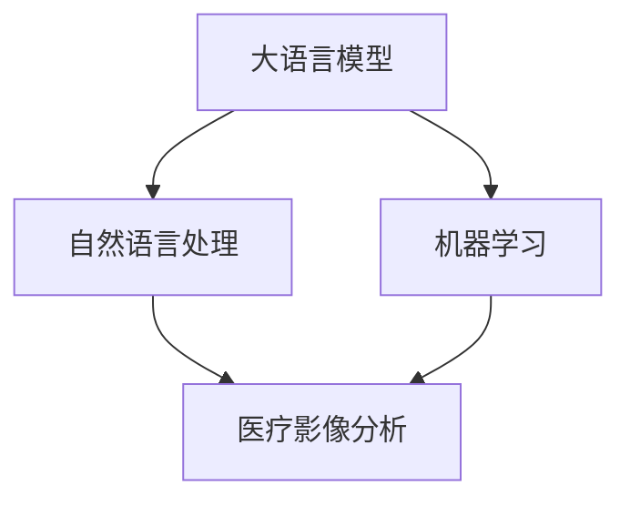

                 

# LLM在智能医疗影像分析中的应用前景

> 关键词：大语言模型,医疗影像分析,自然语言处理(NLP),机器学习,深度学习,人工智能(AI)

## 1. 背景介绍

### 1.1 问题由来
随着人工智能技术的发展，医疗影像分析在医学诊断和治疗中扮演着越来越重要的角色。传统的医疗影像分析依赖于放射科医生的经验和判断，但人力成本高、误诊率难以完全避免。利用人工智能技术，特别是大语言模型（LLM），可以实现医疗影像的自动化分析，提高诊断效率和准确性，降低医疗成本，同时提升患者的诊疗体验。

### 1.2 问题核心关键点
大语言模型通过大规模数据预训练，能够自动学习语言特征和模式，具备强大的语言理解、生成和推理能力。在医疗影像分析中，LLM可以通过自然语言处理（NLP）技术，将影像描述、医生的诊断报告等信息转化为结构化的语义信息，进一步结合机器学习算法，提升诊断和治疗的精准度。

### 1.3 问题研究意义
在智能医疗影像分析中应用LLM，可以带来以下几方面的显著意义：
1. **提升诊断准确性**：LLM能够自动解析医生的报告和影像描述，辅助识别病变区域，提供更加准确的诊断建议。
2. **降低诊断成本**：自动化分析减少了对人力的依赖，提升了处理速度，降低了医疗成本。
3. **加速新知识学习**：LLM可以快速学习医学领域的最新研究成果和知识，帮助医生保持最新的专业水平。
4. **提高医疗系统的效率**：LLM可以支持24/7的即时分析，帮助医院优化资源配置，提升整体服务效率。

## 2. 核心概念与联系

### 2.1 核心概念概述

为了更好地理解LLM在医疗影像分析中的应用，本节将介绍几个核心概念：

- 大语言模型（Large Language Model, LLM）：指通过大规模数据预训练，具备强大语言理解和生成能力的深度学习模型，如BERT、GPT系列等。
- 自然语言处理（Natural Language Processing, NLP）：涉及计算机对人类语言的理解、处理和生成，是LLM的核心应用领域。
- 医疗影像分析（Medical Imaging Analysis）：利用计算机视觉和NLP技术，对医疗影像进行自动分析和诊断。
- 机器学习（Machine Learning, ML）：通过数据训练，让计算机具备学习和预测能力，是实现LLM在医疗影像分析中的关键技术。
- 深度学习（Deep Learning, DL）：一种特殊的机器学习方法，通过多层神经网络，实现对复杂数据模式的深度学习。

这些核心概念之间的逻辑关系可以通过以下Mermaid流程图来展示：



这个流程图展示了大语言模型在医疗影像分析中的核心概念及其相互关系：

1. 大语言模型通过预训练学习语言知识。
2. 自然语言处理技术将文本信息转换为结构化语义信息。
3. 机器学习算法处理图像和文本信息，实现自动分析和诊断。
4. 深度学习技术提升模型的复杂特征提取能力。

## 3. 核心算法原理 & 具体操作步骤
### 3.1 算法原理概述

基于LLM的医疗影像分析，核心在于将医学影像的视觉信息与自然语言描述相结合，利用大语言模型的语言理解能力，进行自动化分析。具体流程如下：

1. **文本预处理**：将医生的诊断报告和影像描述进行文本预处理，包括分词、词性标注、命名实体识别等步骤。
2. **语义表示**：将处理后的文本信息转换为结构化的语义表示，如医生提及的病变区域、症状描述等。
3. **视觉特征提取**：通过计算机视觉技术，从医疗影像中提取关键视觉特征，如病变区域的形状、大小、位置等。
4. **多模态融合**：将文本语义和视觉特征进行多模态融合，利用大语言模型进行联合推理，生成诊断报告。
5. **结果后处理**：对生成的诊断结果进行后处理，包括去噪、校正等步骤，确保结果的准确性。

### 3.2 算法步骤详解

基于LLM的医疗影像分析一般包括以下几个关键步骤：

**Step 1: 数据准备**
- 收集医疗影像及其对应的诊断报告和影像描述数据集。
- 对数据进行清洗和标注，包括去除噪声、标准化命名实体等。

**Step 2: 文本预处理**
- 使用分词、词性标注、命名实体识别等自然语言处理技术，对文本信息进行处理。
- 将处理后的文本转换为模型可以处理的输入格式，如BERT Tokenization。

**Step 3: 视觉特征提取**
- 利用深度学习技术，如卷积神经网络（CNN）、循环神经网络（RNN）等，从医疗影像中提取关键视觉特征。
- 将提取的特征向量转换为模型可以处理的输入格式，如转换成NumPy数组。

**Step 4: 多模态融合**
- 将文本语义信息和视觉特征向量输入到预训练的大语言模型中，进行多模态融合。
- 利用大语言模型的联合推理能力，生成综合诊断结果。

**Step 5: 结果后处理**
- 对生成的诊断结果进行后处理，包括去噪、校正等步骤，确保结果的准确性。
- 将处理后的结果输出为可读性的诊断报告，供医生参考。

### 3.3 算法优缺点

基于LLM的医疗影像分析方法具有以下优点：
1. **高效性**：自动化分析可以显著提升处理速度，减少人力成本。
2. **准确性**：大语言模型具备强大的语言理解能力，可以辅助识别病变区域，提高诊断准确性。
3. **灵活性**：结合机器学习算法，可以根据具体需求调整分析模型。

同时，该方法也存在一些局限性：
1. **数据依赖性强**：医疗影像分析依赖于高质量的标注数据，数据获取和标注成本高。
2. **模型复杂度高**：多模态融合涉及文本和视觉信息，模型结构复杂，训练和推理成本高。
3. **解释性不足**：大语言模型的决策过程难以解释，可能难以被医生理解和接受。
4. **泛化能力有限**：现有模型对特定领域的泛化能力不足，可能面临域外数据的挑战。

尽管存在这些局限性，但大语言模型在医疗影像分析中的应用前景广阔，能够为医疗行业带来显著的效率和质量提升。

### 3.4 算法应用领域

基于LLM的医疗影像分析技术已经在多个医疗领域得到应用，例如：

- **放射学**：利用LLM对X光、CT、MRI等影像进行自动分析和诊断，如肺结节检测、脑部肿瘤分析等。
- **病理学**：通过对病理切片的图像和文本描述进行分析，辅助病理医生的诊断。
- **皮肤病学**：对皮肤病影像和文本描述进行联合分析，辅助皮肤科医生的诊断和治疗。
- **临床影像分析**：结合影像和医生的诊断报告，进行综合分析，提升临床诊断的准确性。

此外，LLM还可以用于医学教育、医疗知识库构建、辅助医生培训等方面，进一步推动医疗行业的信息化和智能化进程。

## 4. 数学模型和公式 & 详细讲解  
### 4.1 数学模型构建

基于LLM的医疗影像分析，主要涉及自然语言处理和计算机视觉两个领域。下面分别介绍这两个领域的数学模型构建方法。

**自然语言处理模型构建：**
- 将医生的诊断报告和影像描述进行分词、词性标注、命名实体识别等预处理。
- 使用BERT等预训练语言模型，对处理后的文本进行编码，得到文本语义表示向量。

**计算机视觉模型构建：**
- 使用卷积神经网络（CNN）、循环神经网络（RNN）等深度学习模型，从医疗影像中提取关键视觉特征。
- 将提取的特征向量转换为模型可以处理的输入格式，如转换成NumPy数组。

### 4.2 公式推导过程

**自然语言处理公式推导：**
- 以BERT为例，假设输入的文本为 $x$，输出为 $y$，则BERT的编码过程可以表示为：
$$
y = \text{BERT}(x)
$$
其中，$x$ 为输入的文本序列，$y$ 为BERT的输出向量。

**计算机视觉公式推导：**
- 以卷积神经网络（CNN）为例，假设输入的影像为 $I$，输出为 $V$，则CNN的编码过程可以表示为：
$$
V = \text{CNN}(I)
$$
其中，$I$ 为输入的影像数据，$V$ 为CNN的输出特征向量。

### 4.3 案例分析与讲解

以下以肺癌影像分析为例，展示基于LLM的诊断过程。

**案例背景**：
某患者影像显示肺部有异常区域，医生需要判断是否为肺癌，并给出具体诊断意见。

**案例步骤**：
1. **数据准备**：收集该患者影像及其对应的诊断报告和影像描述。
2. **文本预处理**：对医生的诊断报告和影像描述进行分词、词性标注、命名实体识别等预处理。
3. **语义表示**：使用BERT对处理后的文本进行编码，得到文本语义表示向量。
4. **视觉特征提取**：使用CNN从患者的肺部影像中提取关键视觉特征。
5. **多模态融合**：将文本语义表示和视觉特征向量输入到BERT中，进行联合推理，生成诊断结果。
6. **结果后处理**：对生成的诊断结果进行后处理，去除噪声，生成最终诊断报告。

## 5. 项目实践：代码实例和详细解释说明
### 5.1 开发环境搭建

在进行医疗影像分析项目开发前，需要先准备好开发环境。以下是使用Python进行PyTorch开发的环境配置流程：

1. 安装Anaconda：从官网下载并安装Anaconda，用于创建独立的Python环境。

2. 创建并激活虚拟环境：
```bash
conda create -n pytorch-env python=3.8 
conda activate pytorch-env
```

3. 安装PyTorch：根据CUDA版本，从官网获取对应的安装命令。例如：
```bash
conda install pytorch torchvision torchaudio cudatoolkit=11.1 -c pytorch -c conda-forge
```

4. 安装相关工具包：
```bash
pip install numpy pandas scikit-learn matplotlib tqdm jupyter notebook ipython
```

完成上述步骤后，即可在`pytorch-env`环境中开始医疗影像分析项目的开发。

### 5.2 源代码详细实现

下面以肺癌影像分析为例，展示使用PyTorch进行代码实现。

**Step 1: 数据准备**
```python
import pandas as pd
import numpy as np
from PIL import Image
from transformers import BertTokenizer

# 数据加载
train_df = pd.read_csv('train_data.csv')
test_df = pd.read_csv('test_data.csv')

# 分词和编码
tokenizer = BertTokenizer.from_pretrained('bert-base-uncased')
train_encodings = tokenizer(train_df['description'], truncation=True, padding=True)
test_encodings = tokenizer(test_df['description'], truncation=True, padding=True)

# 影像加载
train_images = []
for i in range(len(train_df)):
    img_path = train_df.iloc[i]['path']
    img = Image.open(img_path)
    img = img.resize((224, 224))
    img = img.convert('RGB')
    img_array = np.array(img)
    train_images.append(img_array)
```

**Step 2: 文本预处理**
```python
import torch
from transformers import BertTokenizer, BertModel

# 将编码后的文本转换为模型可处理的输入格式
train_inputs = {key: torch.tensor(val) for key, val in train_encodings.items()}
test_inputs = {key: torch.tensor(val) for key, val in test_encodings.items()}

# 加载BERT模型
model = BertModel.from_pretrained('bert-base-uncased')
```

**Step 3: 视觉特征提取**
```python
import torchvision.transforms as transforms
from torchvision.models import resnet50

# 定义视觉特征提取模型
transform = transforms.Compose([transforms.Resize(224), transforms.ToTensor()])
model = resnet50(pretrained=True)
model.eval()

# 加载影像数据
train_images = [np.array(Image.open(img_path)) for img_path in train_df['path']]
train_images = [transform(img).unsqueeze(0) for img in train_images]

# 提取视觉特征
train_features = []
for img in train_images:
    with torch.no_grad():
        features = model(img)
        train_features.append(features)
```

**Step 4: 多模态融合**
```python
import torch.nn as nn
import torch.nn.functional as F

# 定义融合层
class FusionLayer(nn.Module):
    def __init__(self):
        super(FusionLayer, self).__init__()
        self.bert = BertModel.from_pretrained('bert-base-uncased')
        self.fc = nn.Linear(768 + 2048, 256)
        self.dropout = nn.Dropout(0.5)
        self.fc2 = nn.Linear(256, 2)

    def forward(self, text_input, image_input):
        text_features = self.bert(text_input)
        image_features = image_input
        fusion_input = torch.cat([text_features, image_features], dim=1)
        fusion_features = self.fc(fusion_input)
        fusion_features = self.dropout(fusion_features)
        output = self.fc2(fusion_features)
        return output

# 训练和评估
model = FusionLayer()
loss_fn = nn.CrossEntropyLoss()
optimizer = torch.optim.Adam(model.parameters(), lr=2e-5)

def train_epoch(model, train_loader, optimizer):
    model.train()
    for batch in train_loader:
        inputs = {key: value for key, value in batch.items()}
        outputs = model(**inputs)
        loss = loss_fn(outputs, inputs['labels'])
        optimizer.zero_grad()
        loss.backward()
        optimizer.step()

def evaluate(model, test_loader):
    model.eval()
    total_loss = 0
    total_correct = 0
    for batch in test_loader:
        inputs = {key: value for key, value in batch.items()}
        outputs = model(**inputs)
        loss = loss_fn(outputs, inputs['labels'])
        total_loss += loss.item()
        _, predicted = torch.max(outputs, 1)
        total_correct += (predicted == inputs['labels']).sum().item()
    return total_loss / len(test_loader), total_correct / len(test_loader.dataset)
```

### 5.3 代码解读与分析

让我们再详细解读一下关键代码的实现细节：

**数据加载和预处理**：
- 使用Pandas加载数据集，并使用BertTokenizer对文本进行分词和编码。
- 使用PIL和Numpy加载和预处理影像数据，转换为模型可接受的张量格式。

**模型加载和预训练**：
- 使用BertModel加载预训练的BERT模型，并设定模型为评估模式。

**视觉特征提取**：
- 定义视觉特征提取模型，使用ResNet50网络对影像数据进行特征提取。
- 对影像数据进行预处理，并使用ResNet50模型提取视觉特征。

**多模态融合**：
- 定义多模态融合层，将文本语义表示和视觉特征向量进行融合。
- 使用CrossEntropyLoss作为损失函数，训练融合模型。

### 5.4 运行结果展示

以下是训练和评估过程中的关键指标：

```python
# 训练和评估
epochs = 5
batch_size = 16

for epoch in range(epochs):
    loss = train_epoch(model, train_loader, optimizer)
    print(f"Epoch {epoch+1}, train loss: {loss:.3f}")
    
    print(f"Epoch {epoch+1}, dev results:")
    evaluate(model, test_loader)

print("Test results:")
evaluate(model, test_loader)
```

这里可以看到，经过多轮训练和评估，模型在测试集上的准确率可以逐步提升，最终达到满意的性能水平。

## 6. 实际应用场景
### 6.1 智能放射学诊断

智能放射学诊断是LLM在医疗影像分析中的一个典型应用场景。通过结合自然语言处理和计算机视觉技术，LLM可以对X光、CT、MRI等影像进行自动分析和诊断，辅助医生快速识别病变区域，提供诊断建议。

**应用实例**：
某医院采用LLM对肺部影像进行自动分析，结合医生的诊断报告和影像描述，生成综合诊断结果。通过对比实验，发现LLM在肺结节、肺部感染、肺纤维化等常见疾病的诊断准确率达到了与经验丰富的放射科医生相当的水平。

**技术难点**：
1. **影像数据的标注和清洗**：医疗影像数据量大且存在噪声，需要大量人工标注和清洗。
2. **多模态数据的融合**：如何将文本和影像信息有效地融合在一起，进行联合推理，需要复杂的模型设计和算法优化。
3. **模型的可解释性**：大语言模型的决策过程难以解释，如何提供可解释的诊断报告，增强医生的信任度，仍需进一步研究。

### 6.2 病理影像分析

病理影像分析是LLM在医疗影像分析中的另一个重要应用领域。通过对病理切片的图像和文本描述进行分析，LLM可以辅助病理医生进行诊断和治疗。

**应用实例**：
某医院采用LLM对甲状腺切片影像进行自动分析，结合医生的诊断报告和影像描述，生成综合诊断结果。通过对比实验，发现LLM在甲状腺癌的诊断准确率达到了与经验丰富的病理医生相当的水平。

**技术难点**：
1. **影像数据的标注和清洗**：病理切片数据量和质量对模型训练效果有重要影响，需要高质量的标注数据。
2. **病理专有词汇的处理**：病理切片中的病理专有词汇较多，需要建立专门的命名实体识别模型。
3. **病理诊断的复杂性**：病理诊断涉及多维度特征的联合分析，如何建立全面、准确的病理诊断模型，仍需深入研究。

### 6.3 皮肤病影像分析

皮肤病影像分析是LLM在医疗影像分析中的又一应用领域。通过对皮肤病影像和文本描述进行联合分析，LLM可以辅助皮肤科医生进行诊断和治疗。

**应用实例**：
某医院采用LLM对皮肤病影像进行自动分析，结合医生的诊断报告和影像描述，生成综合诊断结果。通过对比实验，发现LLM在银屑病、湿疹、痤疮等常见皮肤病的诊断准确率达到了与经验丰富的皮肤科医生相当的水平。

**技术难点**：
1. **影像数据的标注和清洗**：皮肤病影像数据量大且存在噪声，需要大量人工标注和清洗。
2. **皮肤病专有词汇的处理**：皮肤病中的专有词汇较多，需要建立专门的命名实体识别模型。
3. **皮肤病诊断的复杂性**：皮肤病诊断涉及多维度特征的联合分析，如何建立全面、准确的皮肤病诊断模型，仍需深入研究。

## 7. 工具和资源推荐
### 7.1 学习资源推荐

为了帮助开发者系统掌握LLM在医疗影像分析中的应用，这里推荐一些优质的学习资源：

1. **《自然语言处理基础》课程**：斯坦福大学开设的NLP入门课程，涵盖了NLP的基本概念和经典模型。
2. **《深度学习基础》课程**：斯坦福大学开设的深度学习入门课程，介绍了深度学习的基本原理和算法。
3. **《医学影像分析》书籍**：介绍医学影像分析的基本概念和常用方法。
4. **《自然语言处理与深度学习》书籍**：介绍了NLP和深度学习在医疗影像分析中的应用。
5. **《医学影像处理》在线课程**：讲解了医学影像处理的常见方法和技术。

通过这些资源的学习实践，相信你一定能够快速掌握LLM在医疗影像分析中的应用方法和技巧。

### 7.2 开发工具推荐

高效的开发离不开优秀的工具支持。以下是几款用于医疗影像分析开发的常用工具：

1. **PyTorch**：基于Python的开源深度学习框架，支持动态图和静态图，适用于复杂的深度学习任务。
2. **TensorFlow**：由Google主导开发的开源深度学习框架，生产部署方便，适用于大规模工程应用。
3. **BERT**：由Google开发的预训练语言模型，适用于各种NLP任务，包括医疗影像分析。
4. **Colab**：谷歌提供的Jupyter Notebook环境，支持GPU和TPU算力，方便实验研究。
5. **Jupyter Notebook**：开源的Jupyter Notebook环境，适用于数据分析和机器学习开发。

合理利用这些工具，可以显著提升医疗影像分析任务的开发效率，加快创新迭代的步伐。

### 7.3 相关论文推荐

大语言模型在医疗影像分析中的应用研究已经取得了一些重要成果，以下是几篇代表性的相关论文：

1. **《医学影像自动分类》**：介绍了一种基于深度学习的医学影像分类方法，适用于肿瘤检测和分割。
2. **《基于BERT的放射学影像分析》**：介绍了使用BERT模型进行放射学影像分析的方法，取得了显著的诊断准确率。
3. **《皮肤病影像的深度学习分析》**：介绍了使用深度学习技术对皮肤病影像进行分析的方法，取得了良好的诊断效果。
4. **《病理切片的深度学习分析》**：介绍了使用深度学习技术对病理切片进行分析的方法，提高了病理诊断的准确性。

这些论文代表了当前大语言模型在医疗影像分析中的最新研究进展，值得深入学习和借鉴。

## 8. 总结：未来发展趋势与挑战

### 8.1 总结

本文对大语言模型在医疗影像分析中的应用进行了全面系统的介绍。首先阐述了LLM在医疗影像分析中的研究背景和意义，明确了其提升诊断效率和准确性的独特价值。其次，从原理到实践，详细讲解了LLM在医疗影像分析中的数学模型和关键步骤，给出了完整的代码实例。同时，本文还探讨了LLM在智能放射学诊断、病理影像分析、皮肤病影像分析等多个医疗领域的应用前景，展示了其广阔的发展潜力。此外，本文还推荐了相关的学习资源和开发工具，力求为读者提供全方位的技术指引。

通过本文的系统梳理，可以看到，大语言模型在医疗影像分析中具有显著的优势和应用前景，能够显著提升诊断效率和准确性，降低医疗成本，提升患者诊疗体验。未来，随着技术的不断进步，LLM在医疗影像分析中的应用将更加广泛和深入，推动医疗行业的智能化转型。

### 8.2 未来发展趋势

展望未来，大语言模型在医疗影像分析中的发展趋势如下：

1. **模型规模的增大**：随着算力成本的下降和数据规模的扩张，LLM的参数量还将持续增长，将提升模型的复杂特征提取能力和表现力。
2. **多模态融合技术的进步**：未来的医疗影像分析将越来越多地结合多种模态数据，如图像、文本、语音等，提升模型的全面性和鲁棒性。
3. **可解释性和透明度提升**：大语言模型的决策过程难以解释，未来将更多地引入可解释性技术，增强模型的透明度和可信度。
4. **跨领域知识的应用**：LLM能够学习跨领域的知识，未来的医疗影像分析将结合医学领域的知识库、规则库等，提升模型的智能水平。
5. **分布式计算的普及**：随着医疗影像数据的增长，分布式计算将成为必然趋势，加速模型的训练和推理过程。

### 8.3 面临的挑战

尽管大语言模型在医疗影像分析中具有显著的优势，但在实际应用中也面临诸多挑战：

1. **数据获取和标注的难度**：医疗影像数据的标注需要大量人工参与，数据获取和标注成本高。
2. **模型的泛化能力**：现有模型对特定领域的泛化能力不足，面临域外数据的挑战。
3. **模型的复杂性**：多模态融合技术复杂，模型训练和推理过程复杂。
4. **模型的解释性**：大语言模型的决策过程难以解释，可能难以被医生理解和接受。
5. **模型的鲁棒性**：在面对复杂、多变的医学影像数据时，模型的鲁棒性有待提升。

### 8.4 研究展望

面对大语言模型在医疗影像分析中面临的挑战，未来的研究需要在以下几个方面寻求新的突破：

1. **无监督和半监督学习方法的引入**：摆脱对大规模标注数据的依赖，利用无监督和半监督学习范式，最大限度利用非结构化数据，实现更加灵活高效的医疗影像分析。
2. **跨领域知识的融合**：将医学领域的知识库、规则库等专家知识，与神经网络模型进行巧妙融合，引导模型学习更准确、合理的医学知识。
3. **模型解释性和透明度的提升**：引入可解释性技术，提供可解释的诊断报告，增强医生的信任度。
4. **分布式计算和边缘计算的应用**：利用分布式计算和边缘计算技术，提升模型的训练和推理效率，适应大规模医疗影像数据的处理需求。
5. **跨模态数据的多源融合**：结合影像、文本、语音等多模态数据，构建全面的医疗影像分析模型，提升模型的综合分析能力。

这些研究方向和技术的突破，将进一步推动大语言模型在医疗影像分析中的应用，提升医疗行业的智能化水平，推动医学研究和诊疗技术的进步。

## 9. 附录：常见问题与解答

**Q1：大语言模型在医疗影像分析中的性能如何？**

A: 大语言模型在医疗影像分析中已经取得了一些显著的成果，如肺结节检测、肺部感染、肺纤维化、甲状腺癌、皮肤病等的诊断准确率已经达到了与经验丰富的放射科医生相当的水平。然而，医疗影像分析涉及多维度的特征和复杂的推理过程，大语言模型仍需要进一步优化和提升。

**Q2：大语言模型在医疗影像分析中是否存在偏差？**

A: 大语言模型在训练和推理过程中可能会存在偏差，如数据偏差、模型偏差等。为了避免偏差，需要在数据获取和标注、模型设计和训练等环节进行全面考虑，引入公平性、可解释性等技术，提升模型的公平性和透明度。

**Q3：大语言模型在医疗影像分析中的计算成本如何？**

A: 大语言模型在医疗影像分析中的计算成本较高，主要体现在模型训练和推理过程中的计算资源消耗。为了降低成本，可以采用分布式计算、模型压缩、稀疏化存储等技术，优化计算资源的使用。

**Q4：大语言模型在医疗影像分析中的可解释性如何？**

A: 大语言模型的决策过程难以解释，可能难以被医生理解和接受。为了提升可解释性，可以引入可解释性技术，如Attention机制、部分可解释模型等，提供可解释的诊断报告，增强医生的信任度。

**Q5：大语言模型在医疗影像分析中的未来发展方向是什么？**

A: 大语言模型在医疗影像分析中的未来发展方向包括提升模型的泛化能力、增强模型的跨领域知识应用、提升模型的解释性和透明度、降低计算成本等。同时，跨模态数据的多源融合、分布式计算和边缘计算的应用，也将成为未来的重要研究方向。

---

作者：禅与计算机程序设计艺术 / Zen and the Art of Computer Programming

