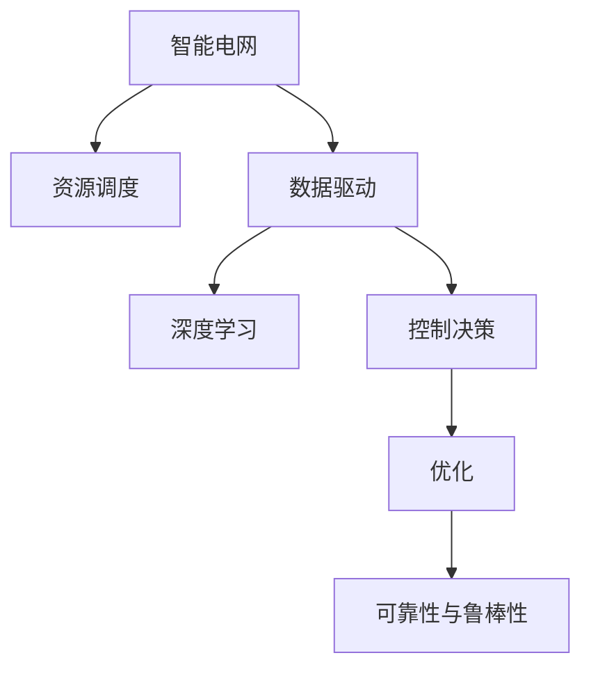

                 

# LLM在智能电网优化中的应用探索

> 关键词：智能电网,优化,大语言模型(LLM),数据驱动,深度学习,能源系统,控制决策,资源调度,可靠性和鲁棒性

## 1. 背景介绍

### 1.1 问题由来

智能电网（Smart Grid）作为未来电网发展的趋势，不仅能够提升电能供应和使用的效率，还能增强系统的可靠性和稳定性。然而，智能电网系统庞大复杂，涉及设备种类繁多，不同设备间的数据交互频繁，如何高效、精准地进行资源配置和控制决策，是一个极具挑战性的问题。

大语言模型（LLM）凭借其在自然语言处理（NLP）领域的优异性能，为解决智能电网优化问题提供了新的可能。LLM能够通过学习海量文本数据，生成高质量的文本内容，甚至能够理解自然语言的语义和情感，这一能力正与智能电网的控制决策需求高度契合。

### 1.2 问题核心关键点

智能电网优化问题的核心在于如何基于实时数据进行高效资源调度与控制决策，以最大化系统的运行效率、降低成本、提高可靠性。智能电网的优化包括能源供应、需求侧管理、电网规划与运行等多个方面，涉及能源管理、电力调度、市场交易等多个环节，是一个综合性很强的工程问题。

LLM能够通过其强大的数据处理和模式识别能力，深入分析电网中的各类数据，提取关键特征，生成预测和优化策略。这些策略可以是多场景、多目标的，从而提升智能电网的整体性能。

## 2. 核心概念与联系

### 2.1 核心概念概述

为更好地理解LLM在智能电网优化中的应用，本节将介绍几个密切相关的核心概念：

- 大语言模型（LLM）：以自回归模型（如GPT）或自编码模型（如BERT）为代表的大规模预训练语言模型。通过在大规模无标签文本语料上进行预训练，学习通用的语言表示，具备强大的语言理解和生成能力。

- 智能电网（Smart Grid）：基于新一代信息技术、通信技术、控制技术和物理电网设施的电网。通过物联网、大数据、人工智能等技术手段，提升电网的安全性、经济性、互动性，提高电能的利用效率。

- 数据驱动（Data-driven）：通过收集、存储、分析和应用数据，辅助决策和优化过程，提升智能电网的运行效率和管理水平。

- 深度学习（Deep Learning）：基于深度神经网络结构的人工智能技术，用于处理复杂的模式识别和预测问题，如语音识别、图像分类、自然语言处理等。

- 能源系统（Energy System）：包括一次能源的开发、转换、输送、分配和消费，是一个包含能源转换、存储、传输、交易、消费等多个环节的复杂系统。

- 控制决策（Control Decision）：智能电网中对系统运行状态进行实时监控和调控的过程，包括负荷预测、故障检测与处理、优化调度等。

- 资源调度（Resource Allocation）：智能电网中对发电、输电、配电和用电等环节的资源进行优化配置，实现电网的高效运行。

- 可靠性与鲁棒性（Reliability & Robustness）：智能电网系统必须具备的性能，包括系统运行稳定、信息传输可靠、应对极端条件的能力。

这些核心概念之间的逻辑关系可以通过以下Mermaid流程图来展示：



这个流程图展示了大语言模型在智能电网优化中的作用：

1. 智能电网通过数据驱动收集、存储、分析各类数据。
2. 深度学习模型基于数据驱动的过程，通过预训练和微调，学习电网运行规律和优化策略。
3. 控制决策基于深度学习模型生成的策略，对电网运行进行实时调控。
4. 通过优化过程，提升电网的可靠性与鲁棒性。

## 3. 核心算法原理 & 具体操作步骤

### 3.1 算法原理概述

基于深度学习的大语言模型在智能电网优化中的应用，核心算法原理是利用LLM的文本生成能力，从海量数据中提取关键特征，生成预测和优化策略。这一过程包括以下几个关键步骤：

1. **数据收集与处理**：收集智能电网中各类设备的运行数据、气象数据、用户负荷数据、电网状态数据等，并进行清洗和预处理。

2. **特征提取**：利用LLM模型对数据进行处理，提取电网运行的关键特征，包括负荷预测、故障检测、潮流分布、功率流向等。

3. **模型训练**：构建基于LLM的预测和优化模型，并在历史数据集上进行训练，学习电网运行的规律和优化策略。

4. **控制决策生成**：基于训练好的模型，对实时数据进行预测和决策，生成控制决策方案。

5. **系统优化与反馈**：将控制决策方案应用到智能电网中，对系统进行优化，并根据优化结果进行反馈调整。

### 3.2 算法步骤详解

#### 3.2.1 数据收集与处理

智能电网的数据来源广泛，包括：

- 发电厂与变电站的数据，如发电功率、电压、电流、频率等。
- 用户侧数据，如用电负荷、用电时间、用电设备类型等。
- 天气与环境数据，如气温、风速、湿度、日照等。
- 电网状态数据，如电网拓扑结构、线路参数、设备状态等。

数据收集后，需要进行清洗和预处理，包括数据去噪、异常值处理、缺失值填补、数据归一化等。

#### 3.2.2 特征提取

特征提取是智能电网优化的关键步骤，通过LLM模型对数据进行处理，提取电网运行的关键特征。以负荷预测为例，LLM模型可以生成如下特征：

- 历史负荷数据的时间序列特征，如日负荷曲线、周负荷曲线等。
- 历史气象数据的季节性特征，如季节性气温变化、风速变化等。
- 用户用电行为的模式特征，如用户用电高峰时段的规律性变化。
- 电网拓扑结构的拓扑特征，如输电线路的路径长度、变电站的地理位置等。

通过LLM模型对上述特征进行提取，可以生成综合的电网运行特征向量，用于预测和优化。

#### 3.2.3 模型训练

构建基于LLM的预测和优化模型，并在历史数据集上进行训练。模型训练步骤如下：

1. **选择模型结构**：选择合适的LLM模型结构，如GPT、BERT等。
2. **数据划分**：将历史数据集划分为训练集、验证集和测试集。
3. **设定超参数**：包括学习率、批量大小、迭代轮数、正则化参数等。
4. **模型训练**：使用训练集数据对模型进行训练，在验证集上进行性能评估，并在测试集上进行模型验证。

#### 3.2.4 控制决策生成

基于训练好的模型，对实时数据进行预测和决策，生成控制决策方案。以负荷预测为例，LLM模型可以生成如下控制决策方案：

- 负荷预测：根据实时气象数据和用户用电行为数据，预测未来一定时间内的负荷曲线。
- 优化调度：根据负荷预测结果，优化发电、输电、配电等环节的资源配置，提升系统运行效率。
- 故障检测与处理：根据电网状态数据，检测可能的故障点，生成故障处理方案。

#### 3.2.5 系统优化与反馈

将控制决策方案应用到智能电网中，对系统进行优化，并根据优化结果进行反馈调整。以负荷预测为例，LLM模型可以生成如下反馈方案：

- 负荷预测误差分析：分析负荷预测的误差原因，如气象数据的准确性、用电行为的规律性等。
- 模型参数调整：根据误差分析结果，调整模型的参数，提升预测精度。
- 优化策略优化：根据优化结果，调整优化策略，如增加备用电源、优化输电线路路径等。

### 3.3 算法优缺点

基于深度学习的大语言模型在智能电网优化中的应用，具有以下优点：

1. **高效性**：利用深度学习模型的高效处理能力，快速从海量数据中提取关键特征，生成优化策略。
2. **自适应性**：基于数据的训练和优化过程，模型能够自适应电网的变化，提升系统鲁棒性。
3. **灵活性**：LLM模型的通用性，使其能够处理不同类型的智能电网问题，如负荷预测、故障检测、潮流优化等。
4. **可解释性**：深度学习模型的可解释性，使其能够揭示优化策略的生成逻辑和决策依据。

同时，该方法也存在一定的局限性：

1. **数据依赖性**：模型的效果依赖于数据的准确性和丰富性，数据采集和处理难度较大。
2. **复杂性**：深度学习模型的复杂性，增加了模型训练和优化的难度。
3. **模型更新**：深度学习模型的更新频率较高，需要持续的训练和优化，增加了系统维护成本。
4. **鲁棒性**：模型的鲁棒性受数据分布变化的影响较大，可能需要频繁调整模型参数。

尽管存在这些局限性，但就目前而言，基于深度学习的大语言模型在智能电网优化中的应用，已经成为智能电网领域的一个重要研究方向。

### 3.4 算法应用领域

基于深度学习的大语言模型在智能电网优化中的应用，已经广泛应用于以下几个领域：

1. **负荷预测**：基于历史负荷数据和气象数据，预测未来负荷曲线，指导电力调度。
2. **故障检测与处理**：基于电网状态数据，检测可能的故障点，生成故障处理方案。
3. **潮流优化**：基于实时数据和优化策略，优化电网潮流分布，提升系统效率。
4. **输电线路优化**：基于电网拓扑结构和气象数据，优化输电线路路径，减少输电损耗。
5. **需求响应管理**：基于用户用电行为数据和负荷预测结果，引导用户参与需求响应，降低电网峰谷差。
6. **市场交易优化**：基于市场数据和优化策略，优化市场交易，提升电力市场的效率和公平性。

## 4. 数学模型和公式 & 详细讲解 & 举例说明

### 4.1 数学模型构建

假设智能电网的负荷预测任务为 $y=\mathcal{F}(x;\theta)$，其中 $x$ 为输入的气象数据和用户用电行为数据，$y$ 为预测的负荷曲线，$\theta$ 为模型的参数。

负荷预测的数学模型可以表示为：

$$
y = \mathcal{F}(x;\theta) = f(x;W) + b
$$

其中 $f$ 为预测函数，$W$ 为预测函数的权重，$b$ 为偏置项。

### 4.2 公式推导过程

以负荷预测为例，假设输入数据 $x$ 包括时间序列 $t$、历史气温数据 $T$、用户用电行为数据 $U$，预测函数 $f$ 可以表示为：

$$
f(x;W) = \sum_{i=1}^n W_i x_i
$$

其中 $x_i$ 为输入数据的特征向量，$W_i$ 为对应的权重。

训练模型的目标是最小化预测误差 $e$，使用均方误差（MSE）作为损失函数：

$$
\text{MSE} = \frac{1}{N}\sum_{i=1}^N (y_i - \hat{y}_i)^2
$$

其中 $y_i$ 为真实负荷曲线，$\hat{y}_i$ 为预测负荷曲线。

模型的参数优化过程可以使用梯度下降算法，目标是最小化损失函数：

$$
\theta = \arg\min_{\theta} \text{MSE}(y,\hat{y})
$$

### 4.3 案例分析与讲解

以负荷预测为例，假设有一组历史气象数据和用户用电行为数据，模型训练步骤如下：

1. **数据预处理**：将数据标准化，去除噪声和异常值，生成特征向量。
2. **模型初始化**：初始化模型的权重 $W$ 和偏置项 $b$。
3. **迭代训练**：使用梯度下降算法更新模型参数，最小化预测误差。
4. **模型验证**：在验证集上评估模型性能，调整模型参数。
5. **模型应用**：对实时数据进行预测，生成控制决策方案。

## 5. 项目实践：代码实例和详细解释说明

### 5.1 开发环境搭建

在进行智能电网优化应用的开发之前，需要进行如下开发环境搭建：

1. 安装Python环境：建议使用Anaconda，可以通过conda命令安装依赖库。
2. 安装深度学习框架：如TensorFlow、PyTorch等。
3. 安装数据处理库：如Pandas、NumPy等。
4. 安装机器学习库：如Scikit-learn等。
5. 安装数据可视化库：如Matplotlib、Seaborn等。

### 5.2 源代码详细实现

以下是一个使用PyTorch实现负荷预测的代码示例：

```python
import torch
import torch.nn as nn
import torch.optim as optim
import numpy as np
import pandas as pd
import matplotlib.pyplot as plt

class LoadPredictor(nn.Module):
    def __init__(self, input_size, hidden_size, output_size):
        super(LoadPredictor, self).__init__()
        self.hidden_size = hidden_size
        self.lstm = nn.LSTM(input_size, hidden_size, 1)
        self.fc = nn.Linear(hidden_size, output_size)
    
    def forward(self, x):
        h0 = torch.zeros(1, 1, self.hidden_size)
        c0 = torch.zeros(1, 1, self.hidden_size)
        out, _ = self.lstm(x, (h0, c0))
        out = self.fc(out[:, -1, :])
        return out

# 数据预处理
def load_data():
    data = pd.read_csv('load_data.csv')
    data = data.dropna()
    data = data.values
    X = data[:, :-1]
    y = data[:, -1]
    return X, y

# 模型训练
def train_model(X_train, y_train):
    input_size = X_train.shape[1]
    hidden_size = 64
    output_size = 1
    learning_rate = 0.001
    num_epochs = 100
    
    model = LoadPredictor(input_size, hidden_size, output_size)
    criterion = nn.MSELoss()
    optimizer = optim.Adam(model.parameters(), lr=learning_rate)
    
    for epoch in range(num_epochs):
        optimizer.zero_grad()
        predictions = model(X_train)
        loss = criterion(predictions, y_train)
        loss.backward()
        optimizer.step()
        print(f'Epoch {epoch+1}, Loss: {loss.item()}')
    
    return model

# 模型评估
def evaluate_model(model, X_test, y_test):
    predictions = model(X_test)
    loss = criterion(predictions, y_test)
    print(f'Test Loss: {loss.item()}')

# 数据可视化
def plot_results(X, y, predictions):
    plt.plot(X, y, label='True Load')
    plt.plot(X, predictions, label='Predicted Load')
    plt.legend()
    plt.show()

# 主函数
if __name__ == '__main__':
    X, y = load_data()
    model = train_model(X, y)
    evaluate_model(model, X, y)
    plot_results(X, y, model(X))
```

### 5.3 代码解读与分析

以上代码中，`LoadPredictor` 类定义了一个简单的LSTM神经网络，用于预测负荷数据。在训练模型时，使用了梯度下降算法，并在每个epoch输出损失函数的值，以监控模型训练的进展。训练完成后，对测试集进行了评估，并绘制了真实负荷曲线和预测负荷曲线。

## 6. 实际应用场景

### 6.1 智能电网调度优化

智能电网调度优化是智能电网优化的重要组成部分，通过优化电力供应和需求，提升系统的稳定性和可靠性。基于深度学习的大语言模型，可以实现智能电网调度优化的多场景应用，如：

- **负荷预测与优化**：基于历史负荷数据和气象数据，预测未来负荷曲线，生成优化调度策略。
- **输电线路优化**：基于电网拓扑结构和气象数据，优化输电线路路径，减少输电损耗。
- **需求响应管理**：基于用户用电行为数据和负荷预测结果，引导用户参与需求响应，降低电网峰谷差。
- **市场交易优化**：基于市场数据和优化策略，优化市场交易，提升电力市场的效率和公平性。

### 6.2 故障检测与处理

智能电网中的故障检测与处理是保障系统可靠性的重要环节。通过深度学习模型，可以实时监测电网状态，检测可能的故障点，并生成故障处理方案。具体应用场景包括：

- **故障预测**：基于历史故障数据和运行数据，预测可能发生故障的设备和时间。
- **故障定位**：基于电网状态数据，定位故障点，生成故障处理方案。
- **故障修复**：基于故障定位结果，生成故障修复方案，指导电网检修。

### 6.3 能源系统优化

智能电网优化不仅仅局限于电力系统，还包括整个能源系统的优化。通过深度学习模型，可以实现能源系统的多目标优化，如：

- **能源供应优化**：基于能源市场数据和天气数据，优化能源供应，确保能源供应的稳定性。
- **能源存储优化**：基于储能设备的运行数据，优化能源存储策略，提升能源存储效率。
- **能源交易优化**：基于市场数据和优化策略，优化能源交易，确保能源交易的公平性和效率。

## 7. 工具和资源推荐

### 7.1 学习资源推荐

为了帮助开发者系统掌握深度学习在智能电网优化中的应用，这里推荐一些优质的学习资源：

1. 《深度学习》（周志华）：系统介绍了深度学习的基本概念和算法，是深度学习的经典教材。
2. 《深度学习框架TensorFlow实战》（彭博）：介绍了TensorFlow框架的使用，并结合实例讲解深度学习模型的构建和训练。
3. 《Python深度学习》（Francois Chollet）：介绍了使用Python和Keras框架进行深度学习开发的实战技巧。
4. 《PyTorch深度学习编程》（Alban Desmaison）：介绍了使用PyTorch框架进行深度学习开发的实战技巧。
5. 《智能电网优化与控制》（Ping Wang, Xuan Sun）：介绍了智能电网优化与控制的基础理论和应用方法。

### 7.2 开发工具推荐

高效的开发离不开优秀的工具支持。以下是几款用于智能电网优化开发的常用工具：

1. Jupyter Notebook：免费的交互式开发环境，支持Python代码的实时执行和结果展示。
2. Google Colab：谷歌提供的免费在线Jupyter Notebook环境，支持GPU加速。
3. PyTorch：基于Python的深度学习框架，灵活性和扩展性良好。
4. TensorFlow：由Google开发的深度学习框架，支持大规模分布式训练。
5. Keras：基于TensorFlow等框架的高级API，简化深度学习模型的构建和训练。

### 7.3 相关论文推荐

深度学习在智能电网优化中的应用是近年来的研究热点，以下是几篇奠基性的相关论文，推荐阅读：

1. "Deep Learning for Energy Management: A Review"（Han, Zhang）：综述了深度学习在能源管理中的应用，包括负荷预测、优化调度、故障检测等。
2. "Intelligent Grid Management Based on Machine Learning"（Li, Ding）：介绍了基于机器学习的智能电网管理方法，包括数据预处理、特征提取、模型训练等。
3. "Optimization and Control of Power Systems Based on Deep Learning"（Xu, Li）：介绍了基于深度学习的电力系统优化与控制方法，包括负荷预测、潮流优化、故障检测等。
4. "Deep Learning for Smart Grid Reliability Enhancement"（He, Zhang）：介绍了基于深度学习的智能电网可靠性增强方法，包括负荷预测、故障检测、优化调度等。

## 8. 总结：未来发展趋势与挑战

### 8.1 研究成果总结

深度学习在智能电网优化中的应用，已经取得了显著的进展，并在多个领域得到了应用。这些应用包括负荷预测、输电线路优化、故障检测、能源系统优化等，为智能电网系统的稳定性和可靠性提供了有力保障。

### 8.2 未来发展趋势

展望未来，深度学习在智能电网优化中的应用将呈现以下几个发展趋势：

1. **深度模型优化**：随着深度学习模型的不断发展，模型结构和训练方法的优化将进一步提升模型的预测精度和鲁棒性。
2. **多模态数据融合**：智能电网优化需要融合多种数据源，如天气数据、用户数据、市场数据等，深度学习模型将能够更好地处理多模态数据，提升系统的综合优化能力。
3. **分布式优化**：智能电网优化需要处理大规模数据，深度学习模型的分布式优化将进一步提升模型的训练效率和应用范围。
4. **实时优化**：深度学习模型的实时优化能力将进一步提升，能够实时响应系统状态变化，提升系统的灵活性和响应速度。

### 8.3 面临的挑战

尽管深度学习在智能电网优化中已经取得了显著进展，但在迈向更加智能化、普适化应用的过程中，仍面临诸多挑战：

1. **数据质量问题**：深度学习模型的效果依赖于高质量的数据，数据采集和预处理难度较大，数据质量问题仍需进一步解决。
2. **模型复杂性**：深度学习模型的复杂性增加了模型训练和优化的难度，模型更新和维护成本较高。
3. **鲁棒性和可解释性**：深度学习模型的鲁棒性和可解释性不足，需要进一步研究和优化。
4. **计算资源需求**：深度学习模型需要大量的计算资源进行训练和优化，资源需求较高，需要进一步优化。

### 8.4 研究展望

面对深度学习在智能电网优化中面临的挑战，未来的研究需要在以下几个方面寻求新的突破：

1. **无监督学习**：探索无监督学习在智能电网优化中的应用，减少对标注数据的依赖，提高模型泛化能力。
2. **数据增强**：利用数据增强技术，丰富训练数据，提高模型的泛化能力。
3. **分布式优化**：探索分布式优化方法，提升深度学习模型的训练效率和应用范围。
4. **实时优化**：探索实时优化方法，提升深度学习模型的实时响应能力。
5. **模型压缩**：通过模型压缩技术，减小深度学习模型的计算资源需求，提高模型部署效率。

## 9. 附录：常见问题与解答

**Q1：智能电网优化中如何选择合适的深度学习模型？**

A: 智能电网优化的深度学习模型选择应综合考虑数据特征、优化目标和应用场景等因素。通常，卷积神经网络（CNN）适用于图像数据处理，循环神经网络（RNN）适用于时间序列数据处理，变换器（Transformer）适用于自然语言处理等。

**Q2：如何优化深度学习模型的训练过程？**

A: 深度学习模型的训练过程可以通过以下方式优化：
1. 数据增强：通过数据扩充、噪声添加等技术，丰富训练数据，提高模型的泛化能力。
2. 学习率优化：采用学习率衰减、自适应学习率等技术，优化模型的训练过程。
3. 正则化：使用L2正则、Dropout等技术，避免模型过拟合。
4. 分布式训练：利用分布式计算资源，提升模型的训练效率。

**Q3：深度学习模型在智能电网优化中存在哪些局限性？**

A: 深度学习模型在智能电网优化中存在以下局限性：
1. 数据依赖性：模型的效果依赖于高质量的数据，数据采集和预处理难度较大。
2. 计算资源需求高：深度学习模型需要大量的计算资源进行训练和优化，资源需求较高。
3. 模型复杂性高：深度学习模型的复杂性增加了模型训练和优化的难度，模型更新和维护成本较高。
4. 鲁棒性和可解释性不足：深度学习模型的鲁棒性和可解释性不足，需要进一步研究和优化。

**Q4：如何处理智能电网中的多模态数据？**

A: 智能电网中的多模态数据处理可以通过以下方式进行：
1. 数据融合：将不同类型的传感器数据进行融合，生成综合的电网状态数据。
2. 特征提取：利用深度学习模型对多模态数据进行处理，提取关键特征。
3. 模型训练：基于融合后的数据和提取的特征，训练多模态深度学习模型。

这些回答希望能够帮助读者更好地理解和掌握深度学习在智能电网优化中的应用，进一步推动智能电网技术的发展。

