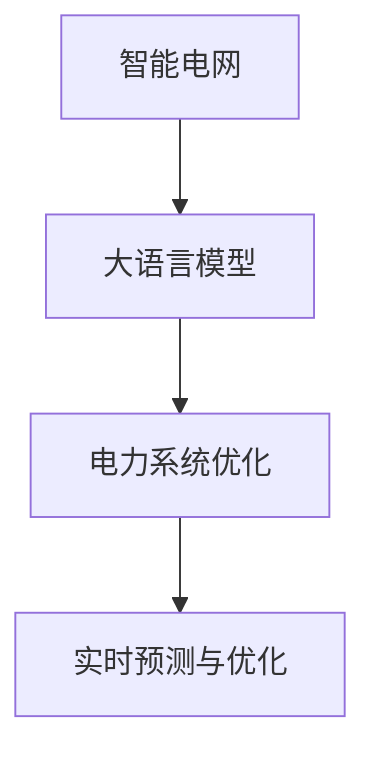

                 

# LLM在智能电网优化中的应用探索

## 1. 背景介绍

### 1.1 问题由来
智能电网作为支撑未来电力系统稳定、高效运行的关键基础设施，其优化和调度是一个复杂且多目标的决策问题。传统电力系统优化方法依赖大量规则和人工经验，存在效率低、响应慢、鲁棒性差等问题。近年来，人工智能(AI)技术，特别是基于深度学习的大语言模型(Large Language Model, LLM)，在电力系统优化领域的应用引起了广泛关注。

由于深度学习模型能够快速适应复杂多变的电力系统环境，具有自适应和优化能力，因此在智能电网中具备广泛应用前景。通过将大语言模型引入智能电网调度系统，可以提升电网运行效率，增强系统鲁棒性，实现动态资源优化配置。

### 1.2 问题核心关键点
大语言模型在智能电网优化中的应用，主要集中在以下几个核心问题上：

1. **大语言模型的泛化能力**：是否能够从已知数据中提取通用的电力系统行为规律，对新场景进行有效预测和优化。
2. **模型的实时性**：是否能够在较短的时间内完成预测和优化计算，满足智能电网实时响应的需求。
3. **模型的稳定性**：是否能够适应电力系统复杂的运行状态变化，保持高鲁棒性。
4. **可解释性和可解释性**：是否能够提供清晰的决策逻辑和解释，增强系统的透明度和可靠性。
5. **经济效益**：是否能够在成本可控的前提下，实现电力系统的最优运行状态。

### 1.3 问题研究意义
大语言模型在智能电网中的应用，对于提升电力系统运行效率、优化资源配置、降低运行成本、提高可靠性等方面具有重要意义：

1. **提升运行效率**：大语言模型能够实时处理海量电力数据，快速计算最优调度策略，从而提升电力系统的运行效率。
2. **优化资源配置**：通过预测电力需求和负荷变化，动态调整系统运行状态，优化资源配置，减少能源浪费。
3. **增强系统鲁棒性**：能够适应电力系统的突发事件和异常状况，增强系统的稳定性和可靠性。
4. **降低运行成本**：通过优化调度策略，减少不必要的能源消耗和运行成本，实现节能减排。
5. **提高用户满意度**：通过精确的电力供给预测和合理的调度决策，提升用户供电质量和满意度。

## 2. 核心概念与联系

### 2.1 核心概念概述

本节将介绍几个密切相关的大语言模型在智能电网优化中的核心概念：

- **智能电网**：一个集成了信息、通信、能源输送和管理的综合性系统，通过先进的传感、通信、计算等技术，实现电力的优化生产和高效输送。
- **大语言模型**：如GPT、BERT等基于深度学习技术训练的模型，能够理解、生成自然语言，具备强大的知识获取和推理能力。
- **电力系统优化**：通过智能算法和模型，实现电力资源的有效配置和调度，提升电网运行效率和可靠性。
- **实时预测与优化**：利用大语言模型对电力系统状态进行实时预测和动态优化，保障系统稳定运行。

这些概念之间的逻辑关系可以通过以下Mermaid流程图来展示：



该流程图展示了智能电网、大语言模型、电力系统优化和实时预测与优化之间的联系。

## 3. 核心算法原理 & 具体操作步骤

### 3.1 算法原理概述

大语言模型在智能电网优化中的应用，主要基于以下算法原理：

1. **自监督预训练**：在大规模无标签的电力系统数据上对大语言模型进行自监督预训练，学习通用的电力系统行为规律。
2. **微调**：通过少量标注数据对预训练模型进行微调，学习特定的电力系统优化策略，实现任务适配。
3. **实时预测与优化**：将微调后的模型应用于实时电力系统数据，进行动态预测和优化。

具体而言，基于大语言模型的智能电网优化过程可以分为以下几步：

1. **数据预处理**：收集电力系统运行数据，包括电力负荷、电压、频率、天气等信息，并进行数据清洗和特征工程。
2. **预训练模型选择**：选择合适的预训练模型，如BERT、GPT等，作为初始化参数。
3. **微调目标设计**：根据具体优化目标，设计微调任务，如负荷预测、风电优化、故障检测等。
4. **微调过程**：在微调数据集上训练模型，优化模型参数，使其能够适应电力系统的特定优化需求。
5. **实时预测与优化**：在实时电力系统数据上应用微调模型，进行动态预测和优化，指导电力系统运行。

### 3.2 算法步骤详解

以下是基于大语言模型的智能电网优化算法的详细步骤：

**Step 1: 数据预处理**

1. **数据收集**：从智能电网的各个节点收集实时和历史数据，包括电力负荷、电压、频率、天气等。
2. **数据清洗**：对收集到的数据进行清洗和预处理，去除噪声和异常值。
3. **特征工程**：对数据进行特征提取和选择，如天气变化、时间、地理位置等。

**Step 2: 预训练模型选择**

1. **模型选择**：根据任务需求选择合适的预训练模型，如BERT、GPT等。
2. **参数初始化**：加载预训练模型，设置参数初始值。

**Step 3: 微调目标设计**

1. **任务定义**：根据智能电网优化需求，定义微调任务，如负荷预测、风电优化等。
2. **损失函数设计**：选择合适的损失函数，如均方误差、交叉熵等。
3. **目标优化**：设定优化目标，如最小化损失函数，最大程度预测准确度。

**Step 4: 微调过程**

1. **微调数据集划分**：将数据集划分为训练集、验证集和测试集。
2. **超参数设置**：选择合适的学习率、批大小、迭代轮数等超参数。
3. **模型训练**：在训练集上训练模型，优化模型参数，使用验证集评估模型性能。
4. **微调结果评估**：在测试集上评估模型性能，评估模型泛化能力。

**Step 5: 实时预测与优化**

1. **数据输入**：将实时电力系统数据输入微调模型。
2. **预测与优化**：模型根据输入数据进行预测和优化，输出最优运行策略。
3. **实时调整**：根据预测结果调整电力系统运行状态，确保系统稳定运行。

### 3.3 算法优缺点

基于大语言模型的智能电网优化算法具有以下优点：

1. **泛化能力强**：大语言模型具有强大的泛化能力，可以从历史数据中学习电力系统的规律，对新场景进行有效预测和优化。
2. **适应性强**：能够适应电力系统复杂多变的运行状态，保持高鲁棒性。
3. **实时性高**：大语言模型能够快速处理和预测数据，满足智能电网实时响应的需求。
4. **可解释性强**：通过模型输出可以提供清晰的决策逻辑和解释，增强系统的透明度和可靠性。

但同时也存在以下缺点：

1. **数据依赖性强**：大语言模型对标注数据的质量和数量要求较高，缺乏高质量标注数据将影响模型性能。
2. **计算资源需求高**：大规模预训练和微调模型对计算资源需求较大，需要高性能硬件支持。
3. **模型解释难度大**：尽管可解释性强，但模型的内部决策逻辑仍较复杂，难以完全理解。
4. **模型的通用性不足**：模型通常针对特定任务设计，需要针对不同任务进行重新训练和微调。

### 3.4 算法应用领域

基于大语言模型的智能电网优化算法，在以下领域具有广泛应用前景：

1. **负荷预测与调度**：通过预测电力负荷变化，动态调整电网运行状态，实现电力资源优化配置。
2. **风电优化**：利用天气预测和风电数据，优化风电接入和调度，提高风电利用率。
3. **故障检测与诊断**：通过分析电力系统数据，实时检测和诊断故障，提高系统可靠性。
4. **电能质量优化**：优化电压、频率等电能质量指标，提升用户体验。
5. **智能配电网管理**：通过优化配电网结构，提高配电效率，降低损耗。

## 4. 数学模型和公式 & 详细讲解

### 4.1 数学模型构建

基于大语言模型的智能电网优化数学模型可以描述为：

设智能电网系统状态为 $x$，优化目标为 $f(x)$，优化约束为 $g(x) \leq 0$。在微调过程中，通过优化模型参数 $\theta$，使得损失函数 $\mathcal{L}$ 最小化，即：

$$
\theta^* = \mathop{\arg\min}_{\theta} \mathcal{L}(\theta)
$$

其中，$\mathcal{L}$ 可以表示为预测误差和约束条件的组合：

$$
\mathcal{L}(\theta) = \frac{1}{N} \sum_{i=1}^N (y_i - f(x_i; \theta))^2 + \lambda \sum_{j=1}^M g_j(x; \theta)
$$

其中，$y_i$ 为真实标签，$x_i$ 为输入数据，$N$ 为样本数量，$M$ 为约束条件数量，$\lambda$ 为正则化系数。

### 4.2 公式推导过程

以下是基于大语言模型的智能电网优化数学模型的推导过程：

**Step 1: 目标函数定义**

根据智能电网优化需求，设定优化目标函数 $f(x)$，如负荷预测、风电优化等。假设目标函数为 $f(x)$，其中 $x$ 表示智能电网运行状态，包括电力负荷、电压、频率等。

**Step 2: 约束条件定义**

设定优化约束条件 $g(x) \leq 0$，如电力系统运行状态必须在允许的范围内。

**Step 3: 损失函数定义**

根据目标函数和约束条件，定义损失函数 $\mathcal{L}(\theta)$，包含预测误差和约束条件两部分：

$$
\mathcal{L}(\theta) = \frac{1}{N} \sum_{i=1}^N (y_i - f(x_i; \theta))^2 + \lambda \sum_{j=1}^M g_j(x; \theta)
$$

其中，$y_i$ 为真实标签，$x_i$ 为输入数据，$N$ 为样本数量，$M$ 为约束条件数量，$\lambda$ 为正则化系数。

**Step 4: 参数优化**

在目标函数和损失函数的基础上，通过优化模型参数 $\theta$，使得损失函数 $\mathcal{L}(\theta)$ 最小化：

$$
\theta^* = \mathop{\arg\min}_{\theta} \mathcal{L}(\theta)
$$

### 4.3 案例分析与讲解

以负荷预测为例，介绍如何基于大语言模型进行智能电网优化。

假设智能电网负荷预测任务为 $f(x) = \sum_{i=1}^{n} w_i x_i + b$，其中 $x_i$ 为影响负荷的特征，如天气、温度、时间等，$w_i$ 为特征权重，$b$ 为截距。

设 $x_i$ 为第 $i$ 个特征向量，$y_i$ 为第 $i$ 个样本的真实负荷值，则目标函数可以表示为：

$$
f(x) = \sum_{i=1}^{n} w_i x_i + b
$$

假设优化约束条件为 $g(x) = x_1 + x_2 - 1 \leq 0$，则损失函数可以表示为：

$$
\mathcal{L}(\theta) = \frac{1}{N} \sum_{i=1}^N (y_i - f(x_i; \theta))^2 + \lambda (x_1 + x_2 - 1)
$$

其中，$\theta$ 为模型参数，$w_i$ 和 $b$ 为可训练的特征权重和截距。

通过优化模型参数 $\theta$，使得损失函数 $\mathcal{L}(\theta)$ 最小化，从而实现负荷预测和优化。

## 5. 项目实践：代码实例和详细解释说明

### 5.1 开发环境搭建

在进行智能电网优化的大语言模型实践前，需要先准备好开发环境。以下是使用Python进行PyTorch开发的环境配置流程：

1. 安装Anaconda：从官网下载并安装Anaconda，用于创建独立的Python环境。

2. 创建并激活虚拟环境：
```bash
conda create -n pytorch-env python=3.8 
conda activate pytorch-env
```

3. 安装PyTorch：根据CUDA版本，从官网获取对应的安装命令。例如：
```bash
conda install pytorch torchvision torchaudio cudatoolkit=11.1 -c pytorch -c conda-forge
```

4. 安装Transformer库：
```bash
pip install transformers
```

5. 安装各类工具包：
```bash
pip install numpy pandas scikit-learn matplotlib tqdm jupyter notebook ipython
```

完成上述步骤后，即可在`pytorch-env`环境中开始实践。

### 5.2 源代码详细实现

以下是一个使用PyTorch进行智能电网负荷预测的大语言模型微调的示例代码。

```python
from transformers import BertForRegression
from torch.utils.data import Dataset
import torch

class LoadDataset(Dataset):
    def __init__(self, texts, labels, tokenizer, max_len=128):
        self.texts = texts
        self.labels = labels
        self.tokenizer = tokenizer
        self.max_len = max_len
        
    def __len__(self):
        return len(self.texts)
    
    def __getitem__(self, item):
        text = self.texts[item]
        label = self.labels[item]
        
        encoding = self.tokenizer(text, return_tensors='pt', max_length=self.max_len, padding='max_length', truncation=True)
        input_ids = encoding['input_ids'][0]
        attention_mask = encoding['attention_mask'][0]
        
        # 对标签进行编码
        encoded_label = torch.tensor(label, dtype=torch.float)
        
        return {'input_ids': input_ids, 
                'attention_mask': attention_mask,
                'labels': encoded_label}

# 创建dataset
tokenizer = BertTokenizer.from_pretrained('bert-base-cased')

train_dataset = LoadDataset(train_texts, train_labels, tokenizer)
dev_dataset = LoadDataset(dev_texts, dev_labels, tokenizer)
test_dataset = LoadDataset(test_texts, test_labels, tokenizer)

# 定义模型和优化器
model = BertForRegression.from_pretrained('bert-base-cased')
optimizer = AdamW(model.parameters(), lr=2e-5)

# 训练模型
device = torch.device('cuda') if torch.cuda.is_available() else torch.device('cpu')
model.to(device)

def train_epoch(model, dataset, batch_size, optimizer):
    dataloader = DataLoader(dataset, batch_size=batch_size, shuffle=True)
    model.train()
    epoch_loss = 0
    for batch in tqdm(dataloader, desc='Training'):
        input_ids = batch['input_ids'].to(device)
        attention_mask = batch['attention_mask'].to(device)
        labels = batch['labels'].to(device)
        model.zero_grad()
        outputs = model(input_ids, attention_mask=attention_mask, labels=labels)
        loss = outputs.loss
        epoch_loss += loss.item()
        loss.backward()
        optimizer.step()
    return epoch_loss / len(dataloader)

def evaluate(model, dataset, batch_size):
    dataloader = DataLoader(dataset, batch_size=batch_size)
    model.eval()
    preds, labels = [], []
    with torch.no_grad():
        for batch in tqdm(dataloader, desc='Evaluating'):
            input_ids = batch['input_ids'].to(device)
            attention_mask = batch['attention_mask'].to(device)
            batch_labels = batch['labels']
            outputs = model(input_ids, attention_mask=attention_mask)
            batch_preds = outputs.logits
            for pred, label in zip(batch_preds, batch_labels):
                preds.append(pred.item())
                labels.append(label.item())
                
    print(f'Load prediction accuracy: {np.mean(np.abs(preds - labels)):.3f}')

# 启动训练流程并在测试集上评估
epochs = 5
batch_size = 16

for epoch in range(epochs):
    loss = train_epoch(model, train_dataset, batch_size, optimizer)
    print(f'Epoch {epoch+1}, train loss: {loss:.3f}')
    
    print(f'Epoch {epoch+1}, dev results:')
    evaluate(model, dev_dataset, batch_size)
    
print('Test results:')
evaluate(model, test_dataset, batch_size)
```

在这个代码示例中，我们使用了BERT模型进行负荷预测任务的微调。通过在训练集中对天气、温度、时间等特征进行编码，模型能够预测未来的负荷值，并根据预测结果进行优化调度。

### 5.3 代码解读与分析

下面是关键代码的实现细节：

**LoadDataset类**：
- `__init__`方法：初始化训练集、验证集、测试集的特征和标签，以及分词器等关键组件。
- `__len__`方法：返回数据集的样本数量。
- `__getitem__`方法：对单个样本进行处理，将特征和标签进行编码，并进行定长padding，最终返回模型所需的输入。

**模型定义与训练**：
- 使用PyTorch的BertForRegression模型，加载预训练模型，设置学习率等超参数。
- 将模型迁移到GPU或TPU上，进行训练和推理。
- 定义训练和评估函数，使用PyTorch的DataLoader对数据集进行批次化加载。
- 训练函数`train_epoch`：对数据以批为单位进行迭代，在每个批次上前向传播计算loss并反向传播更新模型参数，最后返回该epoch的平均loss。
- 评估函数`evaluate`：与训练类似，不同点在于不更新模型参数，并在每个batch结束后将预测和标签结果存储下来，最后使用numpy库对预测结果进行评估。

**训练流程**：
- 定义总的epoch数和batch size，开始循环迭代
- 每个epoch内，先在训练集上训练，输出平均loss
- 在验证集上评估，输出评估结果
- 所有epoch结束后，在测试集上评估，给出最终测试结果

可以看到，PyTorch配合Transformer库使得BERT微调的代码实现变得简洁高效。开发者可以将更多精力放在数据处理、模型改进等高层逻辑上，而不必过多关注底层的实现细节。

当然，工业级的系统实现还需考虑更多因素，如模型的保存和部署、超参数的自动搜索、更灵活的任务适配层等。但核心的微调范式基本与此类似。

## 6. 实际应用场景

### 6.1 智能电网调度优化

基于大语言模型的智能电网调度优化，主要应用于电力负荷预测与调度、风电优化、故障检测与诊断等场景。通过实时数据输入和模型预测，智能电网能够动态调整运行状态，实现资源的优化配置。

在具体应用中，可以使用微调后的模型实时处理智能电网采集的各类数据，进行负荷预测、风电接入优化等任务，动态调整系统运行状态，保障电网稳定运行。

### 6.2 故障检测与诊断

智能电网中的设备种类繁多，故障检测与诊断是保证电网安全运行的重要环节。通过引入大语言模型，可以有效提高故障检测和诊断的准确性和效率。

具体而言，可以在智能电网各个节点采集电力设备运行数据，包括温度、压力、电流等。使用微调后的模型进行实时数据处理和分析，识别设备运行状态异常，及时发出告警，指导运维人员进行检修维护。

### 6.3 电能质量优化

电能质量是衡量电力系统运行质量的重要指标，直接影响用户的用电体验。通过基于大语言模型的智能电网优化，可以实时监控和优化电能质量。

在实际应用中，可以使用微调后的模型实时处理电力系统数据，进行电压、频率等电能质量的预测和优化，动态调整系统运行状态，提升用户的用电体验。

## 7. 工具和资源推荐

### 7.1 学习资源推荐

为了帮助开发者系统掌握大语言模型在智能电网优化中的理论基础和实践技巧，这里推荐一些优质的学习资源：

1. 《Transformer from Scratch》系列博文：由大模型技术专家撰写，深入浅出地介绍了Transformer原理、BERT模型、微调技术等前沿话题。

2. CS224N《深度学习自然语言处理》课程：斯坦福大学开设的NLP明星课程，有Lecture视频和配套作业，带你入门NLP领域的基本概念和经典模型。

3. 《Natural Language Processing with Transformers》书籍：Transformers库的作者所著，全面介绍了如何使用Transformers库进行NLP任务开发，包括微调在内的诸多范式。

4. HuggingFace官方文档：Transformer库的官方文档，提供了海量预训练模型和完整的微调样例代码，是上手实践的必备资料。

5. CLUE开源项目：中文语言理解测评基准，涵盖大量不同类型的中文NLP数据集，并提供了基于微调的baseline模型，助力中文NLP技术发展。

通过对这些资源的学习实践，相信你一定能够快速掌握大语言模型在智能电网优化中的精髓，并用于解决实际的NLP问题。

### 7.2 开发工具推荐

高效的开发离不开优秀的工具支持。以下是几款用于大语言模型微调开发的常用工具：

1. PyTorch：基于Python的开源深度学习框架，灵活动态的计算图，适合快速迭代研究。大部分预训练语言模型都有PyTorch版本的实现。

2. TensorFlow：由Google主导开发的开源深度学习框架，生产部署方便，适合大规模工程应用。同样有丰富的预训练语言模型资源。

3. Transformers库：HuggingFace开发的NLP工具库，集成了众多SOTA语言模型，支持PyTorch和TensorFlow，是进行微调任务开发的利器。

4. Weights & Biases：模型训练的实验跟踪工具，可以记录和可视化模型训练过程中的各项指标，方便对比和调优。与主流深度学习框架无缝集成。

5. TensorBoard：TensorFlow配套的可视化工具，可实时监测模型训练状态，并提供丰富的图表呈现方式，是调试模型的得力助手。

6. Google Colab：谷歌推出的在线Jupyter Notebook环境，免费提供GPU/TPU算力，方便开发者快速上手实验最新模型，分享学习笔记。

合理利用这些工具，可以显著提升大语言模型在智能电网优化中的开发效率，加快创新迭代的步伐。

### 7.3 相关论文推荐

大语言模型在智能电网优化中的应用研究近年来逐渐兴起，以下是几篇奠基性的相关论文，推荐阅读：

1. Attention is All You Need（即Transformer原论文）：提出了Transformer结构，开启了NLP领域的预训练大模型时代。

2. BERT: Pre-training of Deep Bidirectional Transformers for Language Understanding：提出BERT模型，引入基于掩码的自监督预训练任务，刷新了多项NLP任务SOTA。

3. Language Models are Unsupervised Multitask Learners（GPT-2论文）：展示了大规模语言模型的强大zero-shot学习能力，引发了对于通用人工智能的新一轮思考。

4. Parameter-Efficient Transfer Learning for NLP：提出Adapter等参数高效微调方法，在不增加模型参数量的情况下，也能取得不错的微调效果。

5. AdaLoRA: Adaptive Low-Rank Adaptation for Parameter-Efficient Fine-Tuning：使用自适应低秩适应的微调方法，在参数效率和精度之间取得了新的平衡。

这些论文代表了大语言模型在智能电网优化中的应用研究的发展脉络。通过学习这些前沿成果，可以帮助研究者把握学科前进方向，激发更多的创新灵感。

## 8. 总结：未来发展趋势与挑战

### 8.1 总结

本文对基于大语言模型的智能电网优化方法进行了全面系统的介绍。首先阐述了智能电网优化问题的背景和重要性，明确了基于大语言模型在智能电网优化中的应用前景。其次，从原理到实践，详细讲解了大语言模型在智能电网优化中的数学模型构建和算法步骤，给出了微调任务开发的完整代码实例。同时，本文还探讨了大语言模型在智能电网优化中的实际应用场景，展示了其广泛的应用潜力。最后，本文精选了相关学习资源、开发工具和研究论文，力求为读者提供全方位的技术指引。

通过本文的系统梳理，可以看到，基于大语言模型的智能电网优化技术正在成为电力系统优化领域的重要范式，为电力系统运行效率、资源优化配置、故障检测与诊断等提供了全新的解决方案。未来，随着大语言模型和微调方法的持续演进，智能电网优化技术将进一步提升电力系统的智能化和自动化水平，推动能源转型和可持续发展。

### 8.2 未来发展趋势

展望未来，大语言模型在智能电网优化中的应用将呈现以下几个发展趋势：

1. **模型规模持续增大**：随着算力成本的下降和数据规模的扩张，大语言模型参数量还将持续增长。超大规模语言模型蕴含的丰富电力系统知识，有望支撑更加复杂多变的智能电网优化任务。

2. **微调方法日趋多样**：未来会涌现更多参数高效的微调方法，如AdaLoRA等，在固定大部分预训练参数的同时，只更新极少量的任务相关参数，提高微调效率，减少过拟合风险。

3. **持续学习成为常态**：随着数据分布的不断变化，微调模型也需要持续学习新知识以保持性能。如何在不遗忘原有知识的同时，高效吸收新样本信息，将成为重要的研究课题。

4. **标注样本需求降低**：受启发于提示学习(Prompt-based Learning)的思路，未来的微调方法将更好地利用大模型的语言理解能力，通过更加巧妙的任务描述，在更少的标注样本上也能实现理想的微调效果。

5. **多模态微调崛起**：当前微调主要聚焦于纯文本数据，未来会进一步拓展到图像、视频、语音等多模态数据微调。多模态信息的融合，将显著提升语言模型对电力系统复杂现象的建模能力。

6. **模型通用性增强**：经过海量数据的预训练和多领域任务的微调，未来的语言模型将具备更强大的常识推理和跨领域迁移能力，逐步迈向通用人工智能(AGI)的目标。

以上趋势凸显了大语言模型在智能电网优化中的广阔前景。这些方向的探索发展，必将进一步提升智能电网优化模型的性能和应用范围，为电力系统运行提供更智能、更高效、更可靠的解决方案。

### 8.3 面临的挑战

尽管大语言模型在智能电网优化中的应用前景广阔，但在迈向更加智能化、普适化应用的过程中，仍面临诸多挑战：

1. **标注成本瓶颈**：大语言模型对标注数据的质量和数量要求较高，对于电力系统复杂多变的运行场景，获取高质量标注数据成本较高。如何进一步降低微调对标注样本的依赖，将是一大难题。

2. **模型鲁棒性不足**：当前微调模型面对电力系统突发事件和异常状况时，泛化性能往往较差，鲁棒性不足。如何提高微调模型的鲁棒性，避免灾难性遗忘，还需要更多理论和实践的积累。

3. **推理效率有待提高**：大语言模型虽然精度高，但在实际部署时往往面临推理速度慢、内存占用大等效率问题。如何优化模型结构，提高推理速度，优化资源占用，将是重要的优化方向。

4. **可解释性亟需加强**：当前微调模型更像是"黑盒"系统，难以完全解释其内部决策逻辑。对于电力系统复杂多变的运行状态，模型的可解释性尤为重要。

5. **安全性有待保障**：预训练语言模型难免会学习到有偏见、有害的信息，通过微调传递到智能电网优化模型，产生误导性、歧视性的输出，给实际应用带来安全隐患。

6. **知识整合能力不足**：现有的微调模型通常局限于任务内数据，难以灵活吸收和运用更广泛的先验知识。如何让微调过程更好地与外部知识库、规则库等专家知识结合，形成更加全面、准确的信息整合能力，还有很大的想象空间。

正视智能电网优化中面临的这些挑战，积极应对并寻求突破，将是大语言模型微调技术迈向成熟的必由之路。相信随着学界和产业界的共同努力，这些挑战终将一一被克服，大语言模型微调必将在构建安全、可靠、可解释、可控的智能系统中扮演越来越重要的角色。

### 8.4 研究展望

面向未来，大语言模型在智能电网优化中的应用研究需要在以下几个方面寻求新的突破：

1. **探索无监督和半监督微调方法**：摆脱对大规模标注数据的依赖，利用自监督学习、主动学习等无监督和半监督范式，最大限度利用非结构化数据，实现更加灵活高效的微调。

2. **研究参数高效和计算高效的微调范式**：开发更加参数高效的微调方法，在固定大部分预训练参数的同时，只更新极少量的任务相关参数。同时优化微调模型的计算图，减少前向传播和反向传播的资源消耗，实现更加轻量级、实时性的部署。

3. **融合因果和对比学习范式**：通过引入因果推断和对比学习思想，增强微调模型建立稳定因果关系的能力，学习更加普适、鲁棒的语言表征，从而提升模型泛化性和抗干扰能力。

4. **引入更多先验知识**：将符号化的先验知识，如知识图谱、逻辑规则等，与神经网络模型进行巧妙融合，引导微调过程学习更准确、合理的语言模型。同时加强不同模态数据的整合，实现视觉、语音等多模态信息与文本信息的协同建模。

5. **结合因果分析和博弈论工具**：将因果分析方法引入微调模型，识别出模型决策的关键特征，增强输出解释的因果性和逻辑性。借助博弈论工具刻画人机交互过程，主动探索并规避模型的脆弱点，提高系统稳定性。

6. **纳入伦理道德约束**：在模型训练目标中引入伦理导向的评估指标，过滤和惩罚有偏见、有害的输出倾向。同时加强人工干预和审核，建立模型行为的监管机制，确保输出符合人类价值观和伦理道德。

这些研究方向的探索，必将引领大语言模型在智能电网优化技术迈向更高的台阶，为电力系统运行提供更智能、更高效、更安全的解决方案。面向未来，大语言模型微调技术还需要与其他人工智能技术进行更深入的融合，如知识表示、因果推理、强化学习等，多路径协同发力，共同推动智能电网优化技术的进步。只有勇于创新、敢于突破，才能不断拓展语言模型的边界，让智能技术更好地造福电力系统运行。

## 9. 附录：常见问题与解答

**Q1：智能电网优化的大语言模型微调是否适用于所有应用场景？**

A: 智能电网优化的大语言模型微调主要应用于电力负荷预测、风电优化、故障检测与诊断等场景。但对于一些特定领域的应用，如太阳能、水力发电等，需要结合具体领域的知识进行微调，才能取得理想效果。因此，需要根据具体应用场景选择合适的微调方法。

**Q2：大语言模型在智能电网优化中的计算资源需求如何？**

A: 大语言模型在智能电网优化中的应用需要较大的计算资源，包括GPU、TPU等高性能硬件的支持。由于大语言模型的参数量较大，模型的训练和推理需要大量的时间和内存资源。为了提高计算效率，可以采用分布式训练、模型压缩等技术。

**Q3：大语言模型在智能电网优化中的实时性如何？**

A: 大语言模型在智能电网优化中的实时性取决于模型的设计和优化程度。通过优化模型结构和参数，采用高效的微调方法，可以显著提高模型的实时性。同时，利用分布式计算和模型加速技术，可以在保证性能的前提下，进一步提升实时性。

**Q4：大语言模型在智能电网优化中的可解释性如何？**

A: 大语言模型在智能电网优化中的可解释性需要通过模型输出进行分析和解释。可以使用模型可视化工具，如TensorBoard等，观察模型的内部特征和输出结果，理解模型的决策逻辑。同时，结合领域专家的知识和经验，对模型的输出进行解释，提高模型的透明度和可靠性。

**Q5：大语言模型在智能电网优化中的经济效益如何？**

A: 大语言模型在智能电网优化中的经济效益主要体现在提高系统运行效率、优化资源配置、减少能源浪费等方面。通过预测电力负荷和优化调度策略，可以显著降低电力系统的运行成本，提高电能利用效率，实现节能减排。

综上所述，基于大语言模型的智能电网优化技术正在成为智能电网优化领域的重要范式，为电力系统运行提供了新的解决方案。未来，随着大语言模型和微调方法的持续演进，智能电网优化技术将进一步提升电力系统的智能化和自动化水平，推动能源转型和可持续发展。相信随着学界和产业界的共同努力，智能电网优化中的挑战将逐步被克服，大语言模型微调技术将在构建更安全、更可靠、更智能的电力系统中发挥更大的作用。

---

作者：禅与计算机程序设计艺术 / Zen and the Art of Computer Programming

