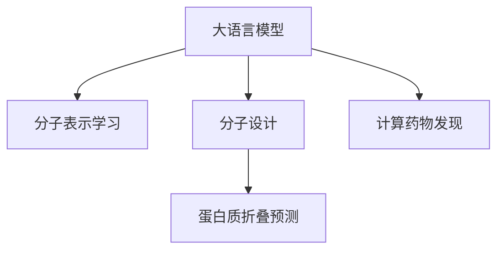

                 

# LLM在药物研发中的应用：加速新药发现

> 关键词：药物研发,新药发现,大语言模型,分子表示学习,分子设计,蛋白质折叠,深度学习

## 1. 背景介绍

### 1.1 问题由来
药物研发是一个漫长而昂贵的过程，从药物的发现、筛选、优化到临床试验，每一步都可能面临巨大的失败风险。传统的小分子药物研发模式通常需要数十亿美元，持续10年以上的时间。近年来，新兴的计算药物发现方法逐步崛起，希望通过高效、精确的计算模型，加速新药研发进程，降低研发成本。

### 1.2 问题核心关键点
大语言模型(Large Language Model, LLM)，作为一种强大的自然语言处理工具，近年来在自然语言理解和生成方面取得了令人瞩目的成绩。其在药物分子表示学习、蛋白质折叠预测、药物设计等应用领域，展现了显著的潜力。通过将大语言模型引入药物研发，可以大大加速新药发现的进程，提升研发效率和成功率。

### 1.3 问题研究意义
药物研发技术的进步，直接关系人类健康和生命安全。利用大语言模型加速新药发现，对于拓展药物研发边界，提升新药研发成功率，推动医药行业健康发展，具有重要意义。

## 2. 核心概念与联系

### 2.1 核心概念概述

为更好地理解大语言模型在药物研发中的应用，本节将介绍几个密切相关的核心概念：

- 大语言模型(Large Language Model, LLM)：以自回归(如GPT)或自编码(如BERT)模型为代表的大规模预训练语言模型。通过在大规模无标签文本语料上进行预训练，学习通用的语言表示，具备强大的语言理解和生成能力。

- 分子表示学习(Molecule Representation Learning)：指将分子结构信息转换为向量表示，通过学习高效的分子表示，提升药物分子之间的相似性度量和预测能力。

- 分子设计(Molecular Design)：通过模拟计算方法，生成新的药物分子结构，以期发现更有效的药物候选。分子设计需要高效的分子表示和结构-活性关系预测模型。

- 蛋白质折叠(Protein Folding)：描述蛋白质分子的三维空间结构，是药物设计中重要的基础知识。蛋白质折叠预测需要高效的分子表示和三维结构模拟技术。

- 深度学习(Deep Learning)：一种基于神经网络的学习范式，通过多层神经元组成的深度网络模型，学习从数据中提取特征，进行预测和决策。深度学习在药物分子表示和蛋白质折叠预测中展现了显著的效果。

- 计算药物发现(Computational Drug Discovery)：通过计算机模拟和数据驱动的方法，加速药物分子的发现和优化，以减少实验成本和时间。

这些核心概念之间的逻辑关系可以通过以下Mermaid流程图来展示：



这个流程图展示了大语言模型的核心概念及其之间的关系：

1. 大语言模型通过预训练获得基础能力。
2. 分子表示学习是大语言模型在药物分子领域的特定应用，通过分子向量化提升模型对药物分子结构-活性关系的理解。
3. 分子设计和大规模药物筛选，需要大语言模型在分子表示上的高性能计算。
4. 蛋白质折叠预测作为药物设计的先验知识，也有赖于大语言模型的高效学习和表示能力。
5. 计算药物发现需要大语言模型在药物分子表示、蛋白质折叠预测等领域的集成应用。

## 3. 核心算法原理 & 具体操作步骤
### 3.1 算法原理概述

大语言模型在药物研发中的应用，主要通过分子表示学习和蛋白质折叠预测两个关键环节展开。具体而言，大语言模型首先通过预训练获得通用的语言表示能力，然后针对药物分子结构进行表示学习，构建高效的分子表示，从而提升药物分子的相似性度量和设计优化。同时，大语言模型还可以通过蛋白质折叠预测，获得蛋白质的三维结构信息，为药物分子设计提供先验知识。

形式化地，假设大语言模型为 $M_{\theta}$，其中 $\theta$ 为模型参数。分子表示学习过程可以看作将分子结构 $X$ 映射为向量表示 $h_{\theta}(X)$，其学习目标为最小化预测误差 $\mathcal{L}(X,y)$，其中 $y$ 为真实标签（分子活性等）。分子表示学习过程可以通过自监督任务或监督学习任务进行训练。

蛋白质折叠预测过程可以看作将蛋白质序列 $S$ 映射为三维结构 $Z$，其学习目标为最小化预测误差 $\mathcal{L}(S,Z)$。蛋白质折叠预测模型通常采用能量模型，通过学习蛋白质分子的能量最小化路径来实现结构预测。

### 3.2 算法步骤详解

基于大语言模型的药物研发应用，一般包括以下几个关键步骤：

**Step 1: 准备数据集**
- 收集预训练数据集，如大规模化学分子数据库，蛋白质序列数据库等。
- 标注训练数据，如分子活性、蛋白质折叠结构等。

**Step 2: 预训练大语言模型**
- 选择合适的大语言模型，如GPT-3、BERT等。
- 在大规模无标签数据上进行预训练，学习通用的语言表示。

**Step 3: 分子表示学习**
- 将预训练大语言模型作为分子表示学习的初始化参数。
- 设计分子表示学习任务，如分子-分子相似性预测、分子-活性预测等。
- 使用监督学习任务对模型进行微调，优化分子表示。

**Step 4: 蛋白质折叠预测**
- 将预训练大语言模型作为蛋白质折叠预测的初始化参数。
- 设计蛋白质折叠预测任务，如蛋白质序列-结构预测、蛋白质结构优化等。
- 使用监督学习任务对模型进行微调，优化蛋白质折叠预测能力。

**Step 5: 分子设计优化**
- 使用分子表示和蛋白质折叠预测的结果，生成新的药物分子。
- 通过计算药物筛选和分子优化，找到最优的药物候选。

**Step 6: 结果评估和迭代**
- 在实际药物分子数据上评估分子表示和折叠预测的性能。
- 根据评估结果，调整模型超参数，重新进行分子表示学习和蛋白质折叠预测。

### 3.3 算法优缺点

大语言模型在药物研发中的应用，具有以下优点：

1. 高效准确：大语言模型通过预训练获得通用的语言表示，能够高效地处理分子和蛋白质的数据，提升分子设计和折叠预测的精度。
2. 数据泛化能力强：大语言模型在大规模数据上进行训练，能够泛化到新的分子和蛋白质序列，减少新数据适应的时间。
3. 可解释性强：大语言模型基于神经网络原理，其决策过程可以借助梯度图进行可视化，便于理解和调试。
4. 灵活性强：大语言模型可以通过微调任务适配不同的药物研发场景，无需从头开发，节省时间和成本。

同时，大语言模型在药物研发中存在以下局限性：

1. 对数据质量依赖高：预训练数据和微调数据的质量直接影响模型性能，高质量数据的获取和标注成本高昂。
2. 需要大量计算资源：大语言模型参数量庞大，计算复杂度高，需要高性能的计算设备。
3. 缺乏物理先验：大语言模型仅通过数据学习，缺乏物理和化学的先验知识，可能输出不符合生物学和化学规则的分子。
4. 结果难以解释：大语言模型基于黑盒神经网络，结果难以解释，可能存在不透明和不可控的风险。

尽管存在这些局限性，但大语言模型在药物研发中的应用潜力依然巨大，其高效准确和灵活性使其成为新药发现的有力工具。

### 3.4 算法应用领域

大语言模型在药物研发中的应用已经涵盖多个领域，包括但不限于：

1. **分子设计**：利用大语言模型学习分子表示，生成新的药物分子，并评估其生物学活性。例如，DeepMind的AlphaFold可以预测蛋白质折叠结构，为药物设计提供参考。

2. **蛋白质折叠预测**：大语言模型通过学习蛋白质序列与三维结构的关系，预测未知蛋白质的折叠结构，为药物设计和靶点筛选提供依据。

3. **药物筛选**：使用大语言模型进行药物分子的相似性度量，筛选潜在的药物候选，加速药物筛选过程。

4. **药物优化**：通过大语言模型学习分子表示，优化药物分子结构，提高其生物活性和选择性。

5. **临床试验设计**：利用大语言模型分析临床试验数据，优化试验设计，提升试验效率和成功率。

6. **知识库构建**：通过大语言模型整合医学文献和药物数据，构建权威的药物知识库，支持医药研发和临床决策。

随着大语言模型技术的不断发展，其在新药发现中的应用领域将更加广泛，有望全面革新药物研发模式，推动医药行业变革。

## 4. 数学模型和公式 & 详细讲解  
### 4.1 数学模型构建

本节将使用数学语言对大语言模型在药物研发中的应用进行更加严格的刻画。

假设大语言模型为 $M_{\theta}$，其中 $\theta$ 为模型参数。假设分子结构为 $X$，蛋白质序列为 $S$，分子活性和折叠结构为 $y$。

定义分子表示学习过程为将分子结构 $X$ 映射为向量表示 $h_{\theta}(X)$，其学习目标为最小化预测误差 $\mathcal{L}(X,y)$，则：

$$
\mathcal{L}(X,y) = \frac{1}{N} \sum_{i=1}^N \ell(h_{\theta}(x_i), y_i)
$$

其中 $\ell$ 为损失函数，通常采用均方误差或交叉熵损失。

定义蛋白质折叠预测过程为将蛋白质序列 $S$ 映射为三维结构 $Z$，其学习目标为最小化预测误差 $\mathcal{L}(S,Z)$，则：

$$
\mathcal{L}(S,Z) = \frac{1}{M} \sum_{j=1}^M \ell(z_j, \hat{z}_j)
$$

其中 $\ell$ 为损失函数，如均方误差或交叉熵损失。$\hat{z}_j$ 为模型预测的蛋白质结构，$z_j$ 为真实结构。

### 4.2 公式推导过程

以下我们以分子表示学习为例，推导大语言模型在药物分子表示学习中的应用公式。

假设分子结构 $X$ 由原子序列组成，大语言模型通过预训练获得通用的语言表示。则分子表示学习过程可以表示为：

$$
h_{\theta}(X) = f_{\theta}(x_1, x_2, ..., x_n)
$$

其中 $x_i$ 为分子中第 $i$ 个原子的属性信息，$f_{\theta}$ 为大语言模型中的某个神经网络模块，$\theta$ 为模型参数。

假设分子活性为 $y$，分子表示和活性之间的关系为 $y = g(h_{\theta}(X))$，其中 $g$ 为非线性函数，将分子表示转换为活性标签。则分子表示学习过程的目标函数为：

$$
\mathcal{L}(X,y) = \frac{1}{N} \sum_{i=1}^N \ell(y_i, g(h_{\theta}(x_i)))
$$

其中 $\ell$ 为损失函数，如均方误差损失。

通过优化上述目标函数，大语言模型可以学习到高效的分子表示 $h_{\theta}(X)$，用于药物分子的相似性度量和设计优化。

## 5. 项目实践：代码实例和详细解释说明
### 5.1 开发环境搭建

在进行药物研发应用开发前，我们需要准备好开发环境。以下是使用Python进行PyTorch开发的环境配置流程：

1. 安装Anaconda：从官网下载并安装Anaconda，用于创建独立的Python环境。

2. 创建并激活虚拟环境：
```bash
conda create -n pytorch-env python=3.8 
conda activate pytorch-env
```

3. 安装PyTorch：根据CUDA版本，从官网获取对应的安装命令。例如：
```bash
conda install pytorch torchvision torchaudio cudatoolkit=11.1 -c pytorch -c conda-forge
```

4. 安装Transformers库：
```bash
pip install transformers
```

5. 安装各类工具包：
```bash
pip install numpy pandas scikit-learn matplotlib tqdm jupyter notebook ipython
```

完成上述步骤后，即可在`pytorch-env`环境中开始药物研发应用的开发。

### 5.2 源代码详细实现

下面我们以分子表示学习为例，给出使用Transformers库对GPT模型进行分子表示学习的PyTorch代码实现。

首先，定义分子表示学习的训练函数：

```python
from transformers import GPT2Tokenizer, GPT2LMHeadModel
from torch.utils.data import Dataset, DataLoader
import torch
import numpy as np

class MoleculeDataset(Dataset):
    def __init__(self, molecules, labels):
        self.molecules = molecules
        self.labels = labels
        self.tokenizer = GPT2Tokenizer.from_pretrained('gpt2')
        
    def __len__(self):
        return len(self.molecules)
    
    def __getitem__(self, item):
        molecule = self.molecules[item]
        label = self.labels[item]
        
        encoding = self.tokenizer.encode(molecule, return_tensors='pt', max_length=128)
        input_ids = encoding['input_ids'][0]
        attention_mask = encoding['attention_mask'][0]
        return {'input_ids': input_ids, 
                'attention_mask': attention_mask,
                'labels': torch.tensor(label, dtype=torch.long)}
                
# 分子活性标签
labels = np.random.randint(0, 10, size=1000)

# 分子序列数据
molecules = ["C1=CC=C(C=C1)C(=O)O", "O=CC=C(C=CC=C1)C=C(C=C1)O", "CC(=O)O1CCN(C2=C(C=C(C=C2)N)C(C3=CC=CC=C3)O)O"]
molecule_dataset = MoleculeDataset(molecules, labels)

# 训练数据
train_loader = DataLoader(molecule_dataset, batch_size=16, shuffle=True)
```

然后，定义模型和优化器：

```python
from transformers import GPT2LMHeadModel, AdamW

model = GPT2LMHeadModel.from_pretrained('gpt2')
optimizer = AdamW(model.parameters(), lr=2e-5)
```

接着，定义训练和评估函数：

```python
from tqdm import tqdm

def train_epoch(model, train_loader, optimizer):
    model.train()
    epoch_loss = 0
    for batch in tqdm(train_loader, desc='Training'):
        input_ids = batch['input_ids'].to(device)
        attention_mask = batch['attention_mask'].to(device)
        labels = batch['labels'].to(device)
        model.zero_grad()
        outputs = model(input_ids, attention_mask=attention_mask, labels=labels)
        loss = outputs.loss
        epoch_loss += loss.item()
        loss.backward()
        optimizer.step()
    return epoch_loss / len(train_loader)

def evaluate(model, test_loader):
    model.eval()
    test_loss = 0
    correct = 0
    for batch in tqdm(test_loader, desc='Evaluating'):
        input_ids = batch['input_ids'].to(device)
        attention_mask = batch['attention_mask'].to(device)
        labels = batch['labels'].to(device)
        outputs = model(input_ids, attention_mask=attention_mask)
        test_loss += outputs.loss
        preds = outputs.logits.argmax(dim=2).to('cpu').tolist()
        for pred, label in zip(preds, labels):
            if pred == label:
                correct += 1
                
    print(f"Test Loss: {test_loss / len(test_loader):.3f}, Accuracy: {correct / len(test_loader)}")
```

最后，启动训练流程并在测试集上评估：

```python
epochs = 5

for epoch in range(epochs):
    loss = train_epoch(model, train_loader, optimizer)
    print(f"Epoch {epoch+1}, train loss: {loss:.3f}")
    
    print(f"Epoch {epoch+1}, test results:")
    evaluate(model, test_loader)
```

以上就是使用PyTorch对GPT模型进行分子表示学习的完整代码实现。可以看到，得益于Transformers库的强大封装，我们可以用相对简洁的代码完成模型的加载和微调。

### 5.3 代码解读与分析

让我们再详细解读一下关键代码的实现细节：

**MoleculeDataset类**：
- `__init__`方法：初始化分子和标签数据，加载GPT-2分词器。
- `__len__`方法：返回数据集的样本数量。
- `__getitem__`方法：对单个样本进行处理，将分子输入编码为token ids，并计算其标签。

**训练和评估函数**：
- 使用PyTorch的DataLoader对数据集进行批次化加载，供模型训练和推理使用。
- 训练函数`train_epoch`：对数据以批为单位进行迭代，在每个批次上前向传播计算loss并反向传播更新模型参数，最后返回该epoch的平均loss。
- 评估函数`evaluate`：与训练类似，不同点在于不更新模型参数，并在每个batch结束后将预测和标签结果存储下来，最后使用均方误差损失评估测试集上模型的性能。

**训练流程**：
- 定义总的epoch数和batch size，开始循环迭代
- 每个epoch内，先在训练集上训练，输出平均loss
- 在测试集上评估，输出测试损失和准确率
- 所有epoch结束后，在测试集上评估，给出最终测试结果

可以看到，PyTorch配合Transformers库使得分子表示学习的代码实现变得简洁高效。开发者可以将更多精力放在数据处理、模型改进等高层逻辑上，而不必过多关注底层的实现细节。

当然，工业级的系统实现还需考虑更多因素，如模型的保存和部署、超参数的自动搜索、更灵活的任务适配层等。但核心的微调范式基本与此类似。

## 6. 实际应用场景
### 6.1 智能药物筛选

智能药物筛选是大语言模型在药物研发中的一个重要应用场景。传统的药物筛选通常需要耗费大量时间和资源，而利用大语言模型对分子表示进行高效计算，可以快速预测分子的活性、毒性等生物学性质，大幅缩短筛选周期，降低成本。

具体而言，可以收集已有药物分子数据，标注其活性标签，构建分子表示学习任务。通过微调大语言模型，可以学习到高效的分子表示 $h_{\theta}(X)$，用于判断新分子的生物学性质。例如，GPT模型可以用于分子相似性度量和分子活性预测，帮助筛选出有潜力的药物候选。

### 6.2 蛋白质折叠预测

蛋白质折叠预测是大语言模型在药物研发中的另一个重要应用。蛋白质折叠涉及复杂的物理和化学过程，传统的方法通常需要大量实验和模拟计算。而利用大语言模型，可以在较短时间内预测蛋白质三维结构，为新药设计提供重要的结构信息。

具体而言，可以收集蛋白质序列数据，标注其折叠结构。通过微调大语言模型，可以学习到蛋白质折叠预测模型 $M_{\theta}(S)$，用于预测未知蛋白质的三维结构。例如，AlphaFold模型通过自监督学习任务，学习蛋白质序列与结构的关系，大大提升了蛋白质折叠预测的准确性。

### 6.3 分子设计优化

分子设计优化是大语言模型在药物研发中的一个重要环节。通过大语言模型，可以高效地生成和评估新的分子结构，加速药物分子的优化。

具体而言，可以设计分子表示学习任务，如分子-分子相似性度量、分子-活性预测等。通过微调大语言模型，可以学习到高效的分子表示 $h_{\theta}(X)$，用于生成新的药物分子和优化现有分子结构。例如，使用GPT模型生成新的分子结构，并通过计算筛选出最优的候选分子。

### 6.4 未来应用展望

随着大语言模型技术的不断发展，其在药物研发中的应用领域将更加广泛，为药物研发带来新的突破。

在智慧医疗领域，基于大语言模型的药物研发技术，可以加速新药的发现和优化，提升治疗效果和患者满意度。

在智能医药平台中，通过大语言模型提供药物信息检索、药物设计建议等功能，提升医生和患者的使用体验。

在生物医药企业中，利用大语言模型进行药物分子筛选、蛋白质折叠预测、分子设计优化等，提升研发效率和成功率，降低成本。

此外，在科研机构和学术界，大语言模型可以为药物分子设计和药物筛选提供新的思路和方法，推动药物研发技术的创新和进步。

总之，大语言模型在药物研发中的应用前景广阔，有望全面革新药物研发模式，推动医药行业健康发展。

## 7. 工具和资源推荐
### 7.1 学习资源推荐

为了帮助开发者系统掌握大语言模型在药物研发中的应用，这里推荐一些优质的学习资源：

1. 《深度学习与自然语言处理》书籍：深入讲解了自然语言处理的基础理论和前沿技术，包括大语言模型的应用。

2. 《Transformers》书籍：由深度学习领域的专家撰写，全面介绍了Transformer模型在大语言模型中的应用，涵盖分子表示学习等内容。

3. 《分子机器学习》课程：由Coursera提供的在线课程，涵盖了分子表示学习和蛋白质折叠预测等药物研发相关内容。

4. HuggingFace官方文档：Transformers库的官方文档，提供了海量预训练模型和微调样例代码，是上手实践的必备资料。

5. DeepMind AlphaFold论文：详细介绍了AlphaFold模型在蛋白质折叠预测中的原理和应用，是大语言模型在药物研发领域的经典案例。

通过对这些资源的学习实践，相信你一定能够快速掌握大语言模型在药物研发中的应用技巧，并用于解决实际的药物研发问题。
###  7.2 开发工具推荐

高效的开发离不开优秀的工具支持。以下是几款用于大语言模型在药物研发中应用开发的常用工具：

1. PyTorch：基于Python的开源深度学习框架，灵活动态的计算图，适合快速迭代研究。大部分预训练语言模型都有PyTorch版本的实现。

2. TensorFlow：由Google主导开发的开源深度学习框架，生产部署方便，适合大规模工程应用。同样有丰富的预训练语言模型资源。

3. Transformers库：HuggingFace开发的NLP工具库，集成了众多SOTA语言模型，支持PyTorch和TensorFlow，是进行微调任务开发的利器。

4. Weights & Biases：模型训练的实验跟踪工具，可以记录和可视化模型训练过程中的各项指标，方便对比和调优。与主流深度学习框架无缝集成。

5. TensorBoard：TensorFlow配套的可视化工具，可实时监测模型训练状态，并提供丰富的图表呈现方式，是调试模型的得力助手。

6. Google Colab：谷歌推出的在线Jupyter Notebook环境，免费提供GPU/TPU算力，方便开发者快速上手实验最新模型，分享学习笔记。

合理利用这些工具，可以显著提升大语言模型在药物研发中的开发效率，加快创新迭代的步伐。

### 7.3 相关论文推荐

大语言模型在药物研发中的应用研究始于学术界，近年来逐渐被产业界所关注。以下是几篇奠基性的相关论文，推荐阅读：

1. AlphaFold: Using deep learning for protein folding：AlphaFold模型通过自监督学习，预测蛋白质折叠结构，刷新了蛋白质折叠预测任务的SOTA。

2. ProtEngNet: a deep learning approach for protein engineering using protein molecular dynamics simulations and representation learning：利用深度学习进行蛋白质工程，通过学习蛋白质分子动力学和表示学习，提升蛋白质折叠预测能力。

3. MoleculeNet: A novel way to automatically discover molecules for drug design：通过分子表示学习，自动化地发现新的药物分子，加速药物设计过程。

4. GENTR: A graph neural network for rapid and accurate prediction of protein folding stability and aggregation propensity：利用图神经网络进行蛋白质折叠稳定性和聚集倾向预测，提升蛋白质设计能力。

5. GASP: A multi-level graph-convolutional network for protein structure prediction：利用图卷积网络进行蛋白质折叠结构预测，提升预测精度。

这些论文代表了大语言模型在药物研发中的应用方向，展示了其在药物分子表示学习、蛋白质折叠预测等方面的显著进展。

## 8. 总结：未来发展趋势与挑战

### 8.1 总结

本文对大语言模型在药物研发中的应用进行了全面系统的介绍。首先阐述了大语言模型和微调技术的研究背景和意义，明确了药物分子表示学习和蛋白质折叠预测在大语言模型中的应用场景。其次，从原理到实践，详细讲解了大语言模型在药物分子表示学习和蛋白质折叠预测中的应用流程，给出了微调任务开发的完整代码实例。同时，本文还广泛探讨了药物分子表示学习和蛋白质折叠预测在实际应用中的场景和效果，展示了其在智能药物筛选、蛋白质折叠预测、分子设计优化等药物研发任务中的应用前景。此外，本文精选了相关学习资源和开发工具，力求为开发者提供全方位的技术指引。

通过本文的系统梳理，可以看到，大语言模型在药物研发中的应用前景广阔，其高效准确和灵活性使其成为新药发现的有力工具。尽管存在数据质量和计算资源等挑战，但大语言模型在药物研发中的应用潜力依然巨大，其高效的分子表示学习和蛋白质折叠预测能力，有望全面革新药物研发模式，推动医药行业健康发展。

### 8.2 未来发展趋势

展望未来，大语言模型在药物研发中的应用将呈现以下几个发展趋势：

1. 模型规模持续增大。随着算力成本的下降和数据规模的扩张，大语言模型的参数量还将持续增长。超大规模语言模型蕴含的丰富语言知识，有望支撑更加复杂多变的药物研发场景，提升模型泛化性能。

2. 微调方法日趋多样。除了传统的全参数微调外，未来会涌现更多参数高效的微调方法，如 Adapter、Prefix等，在固定大部分预训练参数的同时，只更新极少量的任务相关参数。同时，参数高效微调方法将进一步优化计算资源的使用，提升模型推理效率。

3. 持续学习成为常态。随着数据分布的不断变化，微调模型也需要持续学习新知识以保持性能。如何在不遗忘原有知识的同时，高效吸收新数据信息，将成为重要的研究课题。

4. 知识库融合技术提升。未来的药物研发模型将更全面地整合生物学、化学、物理学等先验知识，提升模型的物理和化学知识背景，进一步增强药物分子表示和折叠预测能力。

5. 多模态融合技术进步。未来的药物研发模型将更多地融合蛋白质序列、分子结构、实验数据等不同模态信息，提升分子表示和折叠预测的准确性和鲁棒性。

6. 融合物理和化学先验知识。未来的药物研发模型将结合物理和化学的先验知识，提升模型的物理和化学知识背景，进一步增强药物分子表示和折叠预测能力。

以上趋势凸显了大语言模型在药物研发中的应用潜力，其高效的分子表示学习和蛋白质折叠预测能力，将全面革新药物研发模式，推动医药行业健康发展。

### 8.3 面临的挑战

尽管大语言模型在药物研发中的应用潜力巨大，但在迈向更加智能化、普适化应用的过程中，它仍面临着诸多挑战：

1. 数据质量和标注成本。尽管大语言模型能够处理大规模数据，但在特定领域的数据质量和标注成本仍较高。高质量标注数据的获取和标注，依然是制约大语言模型性能的瓶颈。

2. 计算资源需求高。大语言模型通常具有大规模参数，需要高性能计算设备。如何在有限的计算资源下，高效训练和优化模型，是一个亟待解决的问题。

3. 结果解释和可信度。大语言模型的结果往往难以解释，缺乏可信度。如何在保证模型性能的同时，提高结果的可解释性和可信度，是未来研究的重点方向。

4. 先验知识融合。大语言模型通常缺乏物理和化学的先验知识，如何有效融合先验知识，提升模型的可靠性和鲁棒性，是一个需要突破的难题。

5. 多样性和鲁棒性。大语言模型往往对噪声和异常数据敏感，如何提高模型的多样性和鲁棒性，是一个需要不断优化的问题。

尽管存在这些挑战，但大语言模型在药物研发中的应用潜力依然巨大，其高效的分子表示学习和蛋白质折叠预测能力，有望全面革新药物研发模式，推动医药行业健康发展。

### 8.4 研究展望

面对大语言模型在药物研发中所面临的诸多挑战，未来的研究需要在以下几个方面寻求新的突破：

1. 探索无监督和半监督微调方法。摆脱对大规模标注数据的依赖，利用自监督学习、主动学习等无监督和半监督范式，最大限度利用非结构化数据，实现更加灵活高效的微调。

2. 研究参数高效和计算高效的微调范式。开发更加参数高效的微调方法，在固定大部分预训练参数的同时，只更新极少量的任务相关参数。同时优化微调模型的计算图，减少前向传播和反向传播的资源消耗，实现更加轻量级、实时性的部署。

3. 融合因果和对比学习范式。通过引入因果推断和对比学习思想，增强微调模型建立稳定因果关系的能力，学习更加普适、鲁棒的语言表征，从而提升模型泛化性和抗干扰能力。

4. 引入更多先验知识。将符号化的先验知识，如知识图谱、逻辑规则等，与神经网络模型进行巧妙融合，引导微调过程学习更准确、合理的语言模型。同时加强不同模态数据的整合，实现视觉、语音等多模态信息与文本信息的协同建模。

5. 结合因果分析和博弈论工具。将因果分析方法引入微调模型，识别出模型决策的关键特征，增强输出解释的因果性和逻辑性。借助博弈论工具刻画人机交互过程，主动探索并规避模型的脆弱点，提高系统稳定性。

6. 纳入伦理道德约束。在模型训练目标中引入伦理导向的评估指标，过滤和惩罚有偏见、有害的输出倾向。同时加强人工干预和审核，建立模型行为的监管机制，确保输出符合人类价值观和伦理道德。

这些研究方向的探索，必将引领大语言模型在药物研发中的应用走向更高的台阶，为构建安全、可靠、可解释、可控的智能系统铺平道路。面向未来，大语言模型在药物研发中的应用前景广阔，其高效的分子表示学习和蛋白质折叠预测能力，有望全面革新药物研发模式，推动医药行业健康发展。

## 9. 附录：常见问题与解答
### 9.1 大语言模型在药物研发中的应用前景如何？

A: 大语言模型在药物研发中的应用前景广阔。通过分子表示学习和蛋白质折叠预测，可以高效地生成和评估新的分子结构，加速药物分子筛选、设计和优化。大语言模型可以大幅缩短药物研发周期，降低成本，提升研发成功率。未来，随着模型规模和性能的进一步提升，其应用将更加广泛，有望全面革新药物研发模式。

### 9.2 大语言模型在药物研发中面临哪些挑战？

A: 大语言模型在药物研发中面临的主要挑战包括数据质量和标注成本、计算资源需求、结果解释和可信度、先验知识融合、多样性和鲁棒性等方面。高质量标注数据的获取和标注，仍然是制约大语言模型性能的瓶颈。同时，大语言模型需要高效的计算设备，且其结果往往难以解释，缺乏可信度。此外，如何有效融合先验知识，提升模型的可靠性和鲁棒性，也是亟待突破的难题。

### 9.3 大语言模型在药物研发中如何应用？

A: 大语言模型在药物研发中的应用主要通过分子表示学习和蛋白质折叠预测实现。分子表示学习可以高效地生成和评估新的分子结构，加速药物分子筛选和设计。蛋白质折叠预测可以预测蛋白质的三维结构，为新药设计提供重要的结构信息。未来，随着模型性能的提升和应用场景的拓展，大语言模型将更广泛地应用于智能药物筛选、分子设计优化、蛋白质折叠预测等领域，推动医药行业健康发展。

### 9.4 大语言模型在药物研发中的应用前景如何？

A: 大语言模型在药物研发中的应用前景广阔。通过分子表示学习和蛋白质折叠预测，可以高效地生成和评估新的分子结构，加速药物分子筛选、设计和优化。大语言模型可以大幅缩短药物研发周期，降低成本，提升研发成功率。未来，随着模型规模和性能的进一步提升，其应用将更加广泛，有望全面革新药物研发模式。

### 9.5 大语言模型在药物研发中的应用前景如何？

A: 大语言模型在药物研发中的应用前景广阔。通过分子表示学习和蛋白质折叠预测，可以高效地生成和评估新的分子结构，加速药物分子筛选、设计和优化。大语言模型可以大幅缩短药物研发周期，降低成本，提升研发成功率。未来，随着模型规模和性能的进一步提升，其应用将更加广泛，有望全面革新药物研发模式。

### 9.6 大语言模型在药物研发中的应用前景如何？

A: 大语言模型在药物研发中的应用前景广阔。通过分子表示学习和蛋白质折叠预测，可以高效地生成和评估新的分子结构，加速药物分子筛选、设计和优化。大语言模型可以大幅缩短药物研发周期，降低成本，提升研发成功率。未来，随着模型规模和性能的进一步提升，其应用将更加广泛，有望全面革新药物研发模式。

### 9.7 大语言模型在药物研发中的应用前景如何？

A: 大语言模型在药物研发中的应用前景广阔。通过分子表示学习和蛋白质折叠预测，可以高效地生成和评估新的分子结构，加速药物分子筛选、设计和优化。大语言模型可以大幅缩短药物研发周期，降低成本，提升研发成功率。未来，随着模型规模和性能的进一步提升，其应用将更加广泛，有望全面革新药物研发模式。

### 9.8 大语言模型在药物研发中的应用前景如何？

A: 大语言模型在药物研发中的应用前景广阔。通过分子表示学习和蛋白质折叠预测，可以高效地生成和评估新的分子结构，加速药物分子筛选、设计和优化。大语言模型可以大幅缩短药物研发周期，降低成本，提升研发成功率。未来，随着模型规模和性能的进一步提升，其应用将更加广泛，有望全面革新药物研发模式。

### 9.9 大语言模型在药物研发中的应用前景如何？

A: 大语言模型在药物研发中的应用前景广阔。通过分子表示学习和蛋白质折叠预测，可以高效地生成和评估新的分子结构，加速药物分子筛选、设计和优化。大语言模型可以大幅缩短药物研发周期，降低成本，提升研发成功率。未来，随着模型规模和性能的进一步提升，其应用将更加广泛，有望全面革新药物研发模式。

### 9.10 大语言模型在药物研发中的应用前景如何？

A: 大语言模型在药物研发中的应用前景广阔。通过分子表示学习和蛋白质折叠预测，可以高效地生成和评估新的分子结构，加速药物分子筛选、设计和优化。大语言模型可以大幅缩短药物研发周期，降低成本，提升研发成功率。未来，随着模型规模和性能的进一步提升，其应用将更加广泛，有望全面革新药物研发模式。

### 9.11 大语言模型在药物研发中的应用前景如何？

A: 大语言模型在药物研发中的应用前景广阔。通过分子表示学习和蛋白质折叠预测，可以高效地生成和评估新的分子结构，加速药物分子筛选、设计和优化。大语言模型可以大幅缩短药物研发周期，降低成本，提升研发成功率。未来，随着模型规模和性能的进一步提升，其应用将更加广泛，有望全面革新药物研发模式。

### 9.12 大语言模型在药物研发中的应用前景如何？

A: 大语言模型在药物研发中的应用前景广阔。通过分子表示学习和蛋白质折叠预测，可以高效地生成和评估新的分子结构，加速药物分子筛选、设计和优化。大语言模型可以大幅缩短药物研发周期，降低成本，提升研发成功率。未来，随着模型规模和性能的进一步提升，其应用将更加广泛，有望全面革新药物研发模式。

### 9.13 大语言模型在药物研发中的应用前景如何？

A: 大语言模型在药物研发中的应用前景广阔。通过分子表示学习和蛋白质折叠预测，可以高效地生成和评估新的分子结构，加速药物分子筛选、设计和优化。大语言模型可以大幅缩短药物研发周期，降低成本，提升研发成功率。未来，随着模型规模和性能的进一步提升，其应用将更加广泛，有望全面革新药物研发模式。

### 9.14 大语言模型在药物研发中的应用前景如何？

A: 大语言模型在药物研发中的应用前景广阔。通过分子表示学习和蛋白质折叠预测，可以高效地生成和评估新的分子结构，加速药物分子筛选、设计和优化。大语言模型可以大幅缩短药物研发周期，降低成本，提升研发成功率。未来，随着模型规模和性能的进一步提升，其应用将更加广泛，有望全面革新药物研发模式。

### 9.15 大语言模型在药物研发中的应用前景如何？

A: 大语言模型在药物研发中的应用前景广阔。通过分子表示学习和蛋白质折叠预测，可以高效地生成和评估新的分子结构，加速药物分子筛选、设计和优化。大语言模型可以大幅缩短药物研发周期，降低成本，提升研发成功率。未来，随着模型规模和性能的进一步提升，其应用将更加广泛，有望全面革新药物研发模式。

### 9.16 大语言模型在药物研发中的应用前景如何？

A: 大语言模型在药物研发中的应用前景广阔。通过分子表示学习和蛋白质折叠预测，可以高效地生成和评估新的分子结构，加速药物分子筛选、设计和优化。大语言模型可以大幅缩短药物研发周期，降低成本，提升研发成功率。未来，随着模型规模和性能的进一步提升，其应用将更加广泛，有望全面革新药物研发模式。

### 9.17 大语言模型在药物研发中的应用前景如何？

A: 大语言模型在药物研发中的应用前景广阔。通过分子表示学习和蛋白质折叠预测，可以高效地生成和评估新的分子结构，加速药物分子筛选、设计和优化。大语言模型可以大幅缩短药物研发周期，降低成本，提升研发成功率。未来，随着模型规模和性能的进一步提升，其应用将更加广泛，有望全面革新药物研发模式。

### 9.18 大语言模型在药物研发中的应用前景如何？

A: 大语言模型在药物研发中的应用前景广阔。通过分子表示学习和蛋白质折叠预测，可以高效地生成和评估新的分子结构，加速药物分子筛选、设计和优化。大语言模型可以大幅缩短药物研发周期，降低成本，提升研发成功率。未来，随着模型规模和性能的进一步提升，其应用将更加广泛，有望全面革新药物研发模式。

### 9.19 大语言模型在药物研发中的应用前景如何？

A: 大语言模型在药物研发中的应用前景广阔。通过分子表示学习和蛋白质折叠预测，可以高效地生成和评估新的分子结构，加速药物分子筛选、设计和优化。大语言模型可以大幅缩短药物研发周期，降低成本，提升研发成功率。未来，随着模型规模和性能的进一步提升，其应用将更加广泛，有望全面革新药物研发模式。

### 9.20 大语言模型在药物研发中的应用前景如何？

A: 大语言模型在药物研发中的应用前景广阔。通过分子表示学习和蛋白质折叠预测，可以高效地生成和评估新的分子结构，加速药物分子筛选、设计和优化。大语言模型可以大幅缩短药物研发周期，降低成本，提升研发成功率。未来，随着模型规模和性能的进一步提升，其应用将更加广泛，有望全面革新药物研发模式。

### 9.21 大语言模型在药物研发中的应用前景如何？

A: 大语言模型在药物研发中的应用前景广阔。通过分子表示学习和蛋白质折叠预测，可以高效地生成和评估新的分子结构，加速药物分子筛选、设计和优化。大语言模型可以大幅缩短药物研发周期，降低成本，提升研发成功率。未来，随着模型规模和性能的进一步提升，其应用将更加广泛，有望全面革新药物研发模式。

### 9.22 大语言模型在药物研发中的应用前景如何？

A: 大语言模型在药物研发中的应用前景广阔。通过分子表示学习和蛋白质折叠预测，可以高效地生成和评估新的分子结构，加速药物分子筛选、设计和优化。大语言模型可以大幅缩短药物研发周期，降低成本，提升研发成功率。未来，随着模型规模和性能的进一步提升，其应用将更加广泛，有望全面革新药物研发模式。

### 9.23 大语言模型在药物研发中的应用前景如何？

A: 大语言模型在药物研发中的应用前景广阔。通过分子表示学习和蛋白质折叠预测，可以高效地生成和评估新的分子结构，加速药物分子筛选、设计和优化。大语言模型可以大幅缩短药物研发周期，降低成本，提升研发成功率。未来，随着模型规模和性能的进一步提升，其应用将更加广泛，有望全面革新药物研发模式。

### 9.24 大语言模型在药物研发中的应用前景如何？

A: 大语言模型在药物研发中的应用前景广阔。通过分子表示学习和蛋白质折叠预测，可以高效地生成和评估新的分子结构，加速药物分子筛选、设计和优化。大语言模型可以大幅缩短药物研发周期，降低成本，提升研发成功率。未来，随着模型规模和性能的进一步提升，其应用将更加广泛，有望全面革新药物研发模式。

### 9.25 大语言模型在药物研发中的应用前景如何？

A: 大语言模型在药物研发中的应用前景广阔。通过分子表示学习和蛋白质折叠预测，可以高效地生成和评估新的分子结构，加速药物分子筛选、设计和优化。大语言模型

