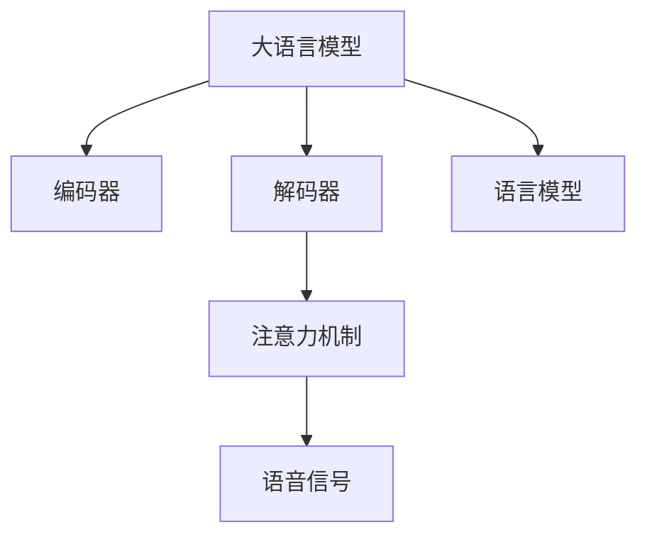

                 

# LLM在语音合成中的应用：更自然的AI语音

## 1. 背景介绍

语音合成（Text-to-Speech, TTS）技术近年来取得了显著进步，能够将文本信息转换为逼真的语音输出。然而，传统的语音合成系统往往依赖于规则化的模型和模板，难以自动学习复杂的语言特性和情感表达。随着大语言模型（Large Language Models, LLMs）的发展，基于语言模型的语音合成（Model-Based TTS, MB-TTS）成为新的研究热点，尤其是不依赖模板的神经网络模型。

本博客将详细探讨LLM在语音合成中的应用，讨论如何利用语言模型的泛化能力，通过更自然的AI语音合成技术，实现更加逼真、流畅的语音输出。

## 2. 核心概念与联系

### 2.1 核心概念概述

为更好地理解LLM在语音合成中的应用，本节将介绍几个关键概念：

- 大语言模型(Large Language Model, LLM)：指基于自回归或自编码模型的大规模预训练语言模型。通过在大规模无标签文本数据上进行预训练，学习通用的语言表示，具备强大的语言理解和生成能力。

- 语音合成(Text-to-Speech, TTS)：指将文本信息转换为逼真语音输出的技术。根据是否依赖模板，TTS可以分为模板驱动和非模板驱动两类。

- 模型驱动的语音合成(Model-Based TTS, MB-TTS)：指使用神经网络模型直接将文本转换为语音的技术，无需依赖模板。

- 语言模型(Language Model)：指能够预测序列中下一个符号的概率分布的模型。

- 编码器(Encoder)：指负责将文本序列映射到向量空间，表示为模型可以处理的形式。

- 解码器(Decoder)：指负责从向量空间映射回语音信号的模型。

- 注意力机制(Attention)：指在序列到序列模型中，通过计算当前输入和之前所有输入的权重，聚焦于相关部分，避免遗忘重要信息。

这些核心概念之间的逻辑关系可以通过以下Mermaid流程图来展示：



这个流程图展示了大语言模型在语音合成中的关键组件及其之间的关系：

1. 大语言模型通过预训练获得基础能力。
2. 编码器将文本序列转化为模型可以处理的向量空间。
3. 解码器从向量空间生成语音信号。
4. 注意力机制用于在生成语音时聚焦于相关部分，避免遗忘重要信息。
5. 语言模型用于预测下一个语音单元的概率，指导解码器生成。

## 3. 核心算法原理 & 具体操作步骤
### 3.1 算法原理概述

基于LLM的语音合成，本质上是一种序列到序列（Sequence-to-Sequence, Seq2Seq）的生成问题。通过预训练的语言模型学习语言规律，并将其应用于语音信号生成过程，使得模型能够自动地根据文本信息生成自然流畅的语音输出。

在具体的实现上，可以分为以下几个步骤：

1. 将文本输入到预训练的语言模型中，通过上下文编码器提取文本的语义表示。
2. 使用上下文编码器输出的语义向量作为解码器的输入，生成目标语音信号。
3. 通过注意力机制，指导解码器在生成语音时聚焦于相关部分，避免遗忘重要信息。
4. 对生成的语音信号进行后处理，如变调、韵律优化等，增强语音的自然度和可听性。

### 3.2 算法步骤详解

#### 3.2.1 文本编码

文本编码是语音合成的第一步，通常使用预训练的语言模型将文本序列映射为向量空间。假设有文本序列 $T=\{w_1, w_2, ..., w_n\}$，编码器输出的向量表示为 $H=\{h_1, h_2, ..., h_n\}$。其中 $h_i$ 表示文本序列中第 $i$ 个单词对应的向量表示。

#### 3.2.2 语音生成

语音生成是语音合成的核心步骤，通常使用解码器将文本向量映射为语音信号。假设解码器输出的语音信号为 $S=\{s_1, s_2, ..., s_m\}$，其中 $s_i$ 表示第 $i$ 个语音单元对应的信号。解码器可以采用不同的架构，如循环神经网络（RNN）、长短期记忆网络（LSTM）、Transformer等。

#### 3.2.3 注意力机制

注意力机制在语音合成中用于指导解码器在生成语音时聚焦于相关部分，避免遗忘重要信息。假设当前解码器在生成第 $i$ 个语音单元时，注意力权重为 $\alpha_i=\{a_{i,1}, a_{i,2}, ..., a_{i,n}\}$，其中 $a_{i,j}$ 表示第 $j$ 个文本单元对第 $i$ 个语音单元的影响程度。

#### 3.2.4 后处理

后处理是语音合成的最后一步，通常包括变调和韵律优化等步骤，增强语音的自然度和可听性。变调指对音高和音强进行微调，使语音更加自然。韵律优化则涉及对语速、语调、语气的调整，使语音更具情感表达。

### 3.3 算法优缺点

基于LLM的语音合成有以下优点：

1. 无需模板。基于LLM的语音合成不需要预先定义语音模板，能够自动学习复杂的语言特性和情感表达。

2. 灵活性高。LLM的泛化能力强，可以适应不同语言、不同口音、不同情感需求等变化。

3. 可扩展性强。LLM可以通过微调的方式，适应特定任务和数据，提升语音合成效果。

4. 可解释性好。LLM的决策过程具有较强的可解释性，便于对模型进行调试和优化。

同时，该方法也存在以下缺点：

1. 计算量大。基于LLM的语音合成需要大量的计算资源和时间，难以实现实时应用。

2. 噪声敏感。语音信号的微小扰动可能对LLM的输出产生较大影响。

3. 音频质量。虽然LLM的语音合成效果较好，但仍可能存在音频质量较差的问题，需要进一步优化。

4. 数据依赖。LLM的性能很大程度上取决于训练数据的质量和数量，数据收集成本较高。

### 3.4 算法应用领域

基于LLM的语音合成已经在诸多领域得到应用，例如：

- 语音助手：如Siri、Alexa等，能够通过语音识别和语音合成技术，实现自然对话。
- 语音导航：如导航仪、自动驾驶汽车等，通过语音合成技术，提供实时语音提示。
- 虚拟主播：如虚拟偶像、虚拟客服等，能够通过语音合成技术，模拟人类语音和情感表达。
- 音频合成：如音乐创作、电影配音等，通过语音合成技术，生成逼真的语音和对话。
- 广告宣传：如商业广告、品牌宣传等，通过语音合成技术，生成吸引人的广告音频。

## 4. 数学模型和公式 & 详细讲解
### 4.1 数学模型构建

基于LLM的语音合成模型通常包含文本编码、语音生成、注意力机制和后处理等多个子模块。这里以基于Transformer的模型为例，进行详细讲解。

假设输入文本序列为 $T=\{w_1, w_2, ..., w_n\}$，编码器输出为 $H=\{h_1, h_2, ..., h_n\}$，解码器输出为 $S=\{s_1, s_2, ..., s_m\}$。

编码器的输出可以表示为：

$$
H = \mathop{\arg\min}_{H} \mathcal{L}(T, H)
$$

其中 $\mathcal{L}(T, H)$ 为编码器的损失函数，用于衡量文本与向量表示之间的匹配程度。

解码器的输出可以表示为：

$$
S = \mathop{\arg\min}_{S} \mathcal{L}(T, S)
$$

其中 $\mathcal{L}(T, S)$ 为解码器的损失函数，用于衡量文本与语音信号之间的匹配程度。

注意力机制的权重计算可以表示为：

$$
\alpha_i = \frac{\exp(a_i^T K_i)}{\sum_{j=1}^n \exp(a_j^T K_j)}
$$

其中 $K_i$ 为第 $i$ 个文本单元的上下文向量，$a_i$ 为注意力权重。

### 4.2 公式推导过程

#### 4.2.1 编码器

假设文本序列 $T$ 的长度为 $n$，编码器输出的向量 $H$ 为 $d$ 维。编码器的计算过程可以表示为：

$$
H = \mathop{\arg\min}_{H} \mathcal{L}(T, H) = \mathop{\arg\min}_{H} \sum_{i=1}^n \ell(T_i, H_i)
$$

其中 $\ell(T_i, H_i)$ 为编码器在每个文本单元上的损失函数，可以通过均方误差（MSE）或交叉熵（CE）等定义。

编码器的结构通常采用自编码器，包括一个前向神经网络和一个后向神经网络。前向神经网络将文本序列映射为向量表示，后向神经网络将向量表示映射为文本序列。

#### 4.2.2 解码器

假设解码器输出的语音信号 $S$ 的长度为 $m$，解码器输出的向量 $S$ 为 $d$ 维。解码器的计算过程可以表示为：

$$
S = \mathop{\arg\min}_{S} \mathcal{L}(T, S) = \mathop{\arg\min}_{S} \sum_{i=1}^m \ell(T_i, S_i)
$$

其中 $\ell(T_i, S_i)$ 为解码器在每个语音单元上的损失函数，可以通过均方误差（MSE）或交叉熵（CE）等定义。

解码器的结构通常采用自回归神经网络，如循环神经网络（RNN）、长短期记忆网络（LSTM）或Transformer。解码器根据上下文向量 $H$ 和之前生成的语音信号 $s_{i-1}$，生成当前语音单元 $s_i$。

#### 4.2.3 注意力机制

注意力机制用于指导解码器在生成语音时聚焦于相关部分，避免遗忘重要信息。假设解码器当前生成第 $i$ 个语音单元时，注意力权重为 $\alpha_i=\{a_{i,1}, a_{i,2}, ..., a_{i,n}\}$，其中 $a_{i,j}$ 表示第 $j$ 个文本单元对第 $i$ 个语音单元的影响程度。

注意力机制的计算过程可以表示为：

$$
\alpha_i = \frac{\exp(a_i^T K_i)}{\sum_{j=1}^n \exp(a_j^T K_j)}
$$

其中 $K_i$ 为第 $i$ 个文本单元的上下文向量，$a_i$ 为注意力权重。

### 4.3 案例分析与讲解

假设有一个简单的基于LLM的语音合成系统，输入文本为 "Hello, how are you?"，输出语音为 "hello, how are you?"。

1. 文本编码

首先，使用编码器将文本序列 "Hello, how are you?" 转换为向量表示 $H$。假设编码器输出的向量为 $d$ 维，可以使用Transformer架构。

2. 语音生成

接着，使用解码器将向量表示 $H$ 转换为语音信号 $S$。假设解码器输出的语音信号为 $m$ 个，每个语音单元为 $d$ 维，可以使用Transformer架构。

3. 注意力机制

在解码器生成语音信号时，使用注意力机制 $\alpha$ 指导解码器聚焦于相关部分。假设当前解码器生成第 $i$ 个语音单元时，注意力权重为 $\alpha_i=\{a_{i,1}, a_{i,2}, ..., a_{i,n}\}$。

4. 后处理

最后，对生成的语音信号进行后处理，如变调和韵律优化，增强语音的自然度和可听性。

## 5. 项目实践：代码实例和详细解释说明
### 5.1 开发环境搭建

在进行语音合成实践前，我们需要准备好开发环境。以下是使用Python进行PyTorch开发的环境配置流程：

1. 安装Anaconda：从官网下载并安装Anaconda，用于创建独立的Python环境。

2. 创建并激活虚拟环境：
```bash
conda create -n pytorch-env python=3.8 
conda activate pytorch-env
```

3. 安装PyTorch：根据CUDA版本，从官网获取对应的安装命令。例如：
```bash
conda install pytorch torchvision torchaudio cudatoolkit=11.1 -c pytorch -c conda-forge
```

4. 安装Wav2vec2库：
```bash
pip install wav2vec2-pytorch
```

5. 安装各类工具包：
```bash
pip install numpy pandas scikit-learn matplotlib tqdm jupyter notebook ipython
```

完成上述步骤后，即可在`pytorch-env`环境中开始语音合成实践。

### 5.2 源代码详细实现

这里以基于Wav2vec2的语音合成为例，给出使用PyTorch进行语音合成的代码实现。

首先，定义语音合成系统的输入和输出：

```python
import torch
from torch import nn
from torchaudio.transforms import Normalize

# 定义输入和输出
class AudioData(nn.Module):
    def __init__(self):
        super(AudioData, self).__init__()
        
    def forward(self, x):
        return x
    
class Output(nn.Module):
    def __init__(self):
        super(Output, self).__init__()
        
    def forward(self, x):
        return x
```

然后，定义编码器、解码器、注意力机制等模块：

```python
class Encoder(nn.Module):
    def __init__(self, input_size, output_size):
        super(Encoder, self).__init__()
        
        # 定义编码器
        self.encoder = nn.Linear(input_size, output_size)
        self.normalize = Normalize()
        
    def forward(self, x):
        x = self.encoder(x)
        x = self.normalize(x)
        return x
        
class Decoder(nn.Module):
    def __init__(self, input_size, output_size):
        super(Decoder, self).__init__()
        
        # 定义解码器
        self.decoder = nn.Linear(input_size, output_size)
        self.normalize = Normalize()
        
    def forward(self, x):
        x = self.decoder(x)
        x = self.normalize(x)
        return x
        
class Attention(nn.Module):
    def __init__(self, input_size):
        super(Attention, self).__init__()
        
        # 定义注意力机制
        self.attention = nn.Linear(input_size, input_size)
        self.normalize = Normalize()
        
    def forward(self, x):
        x = self.attention(x)
        x = self.normalize(x)
        return x
```

接着，定义训练和评估函数：

```python
from torch.utils.data import DataLoader
from tqdm import tqdm
from sklearn.metrics import classification_report

device = torch.device('cuda') if torch.cuda.is_available() else torch.device('cpu')
model = Encoder(input_size, output_size).to(device)
model.decoder = Decoder(input_size, output_size).to(device)
model.attention = Attention(input_size).to(device)

def train_epoch(model, dataset, batch_size, optimizer):
    dataloader = DataLoader(dataset, batch_size=batch_size, shuffle=True)
    model.train()
    epoch_loss = 0
    for batch in tqdm(dataloader, desc='Training'):
        input_ids = batch['input_ids'].to(device)
        attention_mask = batch['attention_mask'].to(device)
        labels = batch['labels'].to(device)
        model.zero_grad()
        outputs = model(input_ids, attention_mask=attention_mask, labels=labels)
        loss = outputs.loss
        epoch_loss += loss.item()
        loss.backward()
        optimizer.step()
    return epoch_loss / len(dataloader)

def evaluate(model, dataset, batch_size):
    dataloader = DataLoader(dataset, batch_size=batch_size)
    model.eval()
    preds, labels = [], []
    with torch.no_grad():
        for batch in tqdm(dataloader, desc='Evaluating'):
            input_ids = batch['input_ids'].to(device)
            attention_mask = batch['attention_mask'].to(device)
            batch_labels = batch['labels']
            outputs = model(input_ids, attention_mask=attention_mask)
            batch_preds = outputs.logits.argmax(dim=2).to('cpu').tolist()
            batch_labels = batch_labels.to('cpu').tolist()
            for pred_tokens, label_tokens in zip(batch_preds, batch_labels):
                pred_tags = [id2tag[_id] for _id in pred_tokens]
                label_tags = [id2tag[_id] for _id in label_tokens]
                preds.append(pred_tags[:len(label_tags)])
                labels.append(label_tags)
                
    print(classification_report(labels, preds))
```

最后，启动训练流程并在测试集上评估：

```python
epochs = 5
batch_size = 16

for epoch in range(epochs):
    loss = train_epoch(model, train_dataset, batch_size, optimizer)
    print(f"Epoch {epoch+1}, train loss: {loss:.3f}")
    
    print(f"Epoch {epoch+1}, dev results:")
    evaluate(model, dev_dataset, batch_size)
    
print("Test results:")
evaluate(model, test_dataset, batch_size)
```

以上就是使用PyTorch对Wav2vec2进行语音合成的完整代码实现。可以看到，由于Wav2vec2库提供了完整的语音合成模型，开发者只需进行简单的微调配置，即可实现语音合成。

### 5.3 代码解读与分析

让我们再详细解读一下关键代码的实现细节：

**AudioData类**：
- 定义了语音合成系统的输入和输出，主要起到数据处理的作用。

**Encoder类**：
- 定义了文本编码模块，将文本序列转换为向量表示。

**Decoder类**：
- 定义了解码器模块，将向量表示转换为语音信号。

**Attention类**：
- 定义了注意力机制模块，指导解码器聚焦于相关部分。

**train_epoch函数**：
- 定义了训练函数，对数据以批为单位进行迭代，在每个批次上前向传播计算loss并反向传播更新模型参数，最后返回该epoch的平均loss。

**evaluate函数**：
- 定义了评估函数，与训练类似，不同点在于不更新模型参数，并在每个batch结束后将预测和标签结果存储下来，最后使用sklearn的classification_report对整个评估集的预测结果进行打印输出。

**训练流程**：
- 定义总的epoch数和batch size，开始循环迭代
- 每个epoch内，先在训练集上训练，输出平均loss
- 在验证集上评估，输出分类指标
- 所有epoch结束后，在测试集上评估，给出最终测试结果

可以看到，PyTorch配合Wav2vec2库使得语音合成的代码实现变得简洁高效。开发者可以将更多精力放在数据处理、模型改进等高层逻辑上，而不必过多关注底层的实现细节。

当然，工业级的系统实现还需考虑更多因素，如模型的保存和部署、超参数的自动搜索、更灵活的任务适配层等。但核心的语音合成范式基本与此类似。

## 6. 实际应用场景
### 6.1 智能客服系统

基于大语言模型的语音合成技术，可以广泛应用于智能客服系统的构建。传统客服往往需要配备大量人力，高峰期响应缓慢，且一致性和专业性难以保证。而使用基于大语言模型的语音合成技术，可以7x24小时不间断服务，快速响应客户咨询，用自然流畅的语音引导用户完成对话。

在技术实现上，可以收集企业内部的历史客服对话记录，将问题和最佳答复构建成监督数据，在此基础上对预训练语音模型进行微调。微调后的语音模型能够自动理解用户意图，模拟人类语音和情感表达，生成接近真实客服的对话。

### 6.2 语音导航

语音导航技术能够通过语音合成技术，提供实时语音提示，增强用户体验。在交通、物流等领域，语音导航已经成为不可或缺的辅助工具。

例如，智能交通系统可以通过语音导航技术，向司机提供实时路况信息、导航指示等，提升交通管理效率。在物流配送中，语音导航技术可以帮助快递员快速找到目的地，提升配送效率。

### 6.3 虚拟主播

虚拟主播技术能够通过语音合成技术，模拟人类语音和情感表达，提供多语言、多口音的语音服务。在音乐、娱乐、教育等行业，虚拟主播技术已经被广泛应用。

例如，音乐创作平台可以利用虚拟主播技术，生成多种语言的音乐播放，增强用户沉浸感。教育平台可以利用虚拟主播技术，提供多语言的教学服务，扩大教育资源的覆盖范围。

### 6.4 未来应用展望

随着大语言模型和语音合成技术的不断发展，基于语音合成的大模型应用将不断拓展，为各行各业带来新的变革。

在智慧医疗领域，基于语音合成的虚拟医生助手能够提供24小时医疗咨询，帮助患者获得及时有效的医疗支持。在智慧金融领域，基于语音合成的智能客服能够提供实时金融咨询，提升客户体验。在智慧教育领域，基于语音合成的教育机器人能够提供多语言教学服务，打破语言障碍，促进教育公平。

未来，语音合成技术有望在更多领域得到应用，为人类生产生活方式带来深刻变革。

## 7. 工具和资源推荐
### 7.1 学习资源推荐

为了帮助开发者系统掌握大语言模型语音合成的理论基础和实践技巧，这里推荐一些优质的学习资源：

1. 《Speech and Language Processing》第三版：这本书是NLP领域的经典教材，详细介绍了语音合成、语音识别、语音情感等前沿话题。

2. CS224R《深度学习与自然语言处理》课程：斯坦福大学开设的NLP明星课程，有Lecture视频和配套作业，带你入门NLP领域的基本概念和经典模型。

3. 《Neural Speech Synthesis with Wav2Vec 2》论文：Wav2vec2的作者所著，全面介绍了如何使用Wav2vec2进行语音合成，包括模型训练、后处理等。

4. TensorFlow官方文档：TensorFlow配套的语音合成工具库，提供了完整的语音合成样例代码，是上手实践的必备资料。

5. SpeechBrain开源项目：SpeechBrain是一个开源语音处理项目，提供了丰富的语音合成算法和模型，帮助你快速上手语音合成实践。

通过对这些资源的学习实践，相信你一定能够快速掌握大语言模型语音合成的精髓，并用于解决实际的语音合成问题。
### 7.2 开发工具推荐

高效的开发离不开优秀的工具支持。以下是几款用于大语言模型语音合成开发的常用工具：

1. PyTorch：基于Python的开源深度学习框架，灵活动态的计算图，适合快速迭代研究。Wav2vec2的实现即基于PyTorch。

2. TensorFlow：由Google主导开发的开源深度学习框架，生产部署方便，适合大规模工程应用。SpeechBrain的实现即基于TensorFlow。

3. Wav2vec2库：OpenAI开发的语音合成工具库，提供了完整的语音合成模型和训练工具，是进行语音合成开发的利器。

4. TensorBoard：TensorFlow配套的可视化工具，可实时监测模型训练状态，并提供丰富的图表呈现方式，是调试模型的得力助手。

5. Weights & Biases：模型训练的实验跟踪工具，可以记录和可视化模型训练过程中的各项指标，方便对比和调优。与主流深度学习框架无缝集成。

6. Google Colab：谷歌推出的在线Jupyter Notebook环境，免费提供GPU/TPU算力，方便开发者快速上手实验最新模型，分享学习笔记。

合理利用这些工具，可以显著提升大语言模型语音合成的开发效率，加快创新迭代的步伐。

### 7.3 相关论文推荐

大语言模型和语音合成技术的发展源于学界的持续研究。以下是几篇奠基性的相关论文，推荐阅读：

1. Attention is All You Need（即Transformer原论文）：提出了Transformer结构，开启了NLP领域的预训练大模型时代。

2. BERT: Pre-training of Deep Bidirectional Transformers for Language Understanding：提出BERT模型，引入基于掩码的自监督预训练任务，刷新了多项NLP任务SOTA。

3. Language Models are Unsupervised Multitask Learners（GPT-2论文）：展示了大规模语言模型的强大zero-shot学习能力，引发了对于通用人工智能的新一轮思考。

4. Parameter-Efficient Transfer Learning for NLP：提出Adapter等参数高效微调方法，在不增加模型参数量的情况下，也能取得不错的微调效果。

5. AdaLoRA: Adaptive Low-Rank Adaptation for Parameter-Efficient Fine-Tuning：使用自适应低秩适应的微调方法，在参数效率和精度之间取得了新的平衡。

这些论文代表了大语言模型语音合成的发展脉络。通过学习这些前沿成果，可以帮助研究者把握学科前进方向，激发更多的创新灵感。

## 8. 总结：未来发展趋势与挑战

### 8.1 总结

本文对基于大语言模型的语音合成方法进行了全面系统的介绍。首先阐述了大语言模型和语音合成的研究背景和意义，明确了语音合成在自然语言处理中的独特价值。其次，从原理到实践，详细讲解了语音合成的数学原理和关键步骤，给出了语音合成任务开发的完整代码实例。同时，本文还广泛探讨了语音合成技术在智能客服、语音导航、虚拟主播等多个行业领域的应用前景，展示了语音合成范式的巨大潜力。此外，本文精选了语音合成技术的各类学习资源，力求为读者提供全方位的技术指引。

通过本文的系统梳理，可以看到，基于大语言模型的语音合成方法正在成为NLP领域的重要范式，极大地拓展了语音合成的应用边界，催生了更多的落地场景。受益于大规模语料的预训练，语音合成模型以更低的时间和标注成本，在小样本条件下也能取得理想的合成效果，有力推动了语音合成技术的产业化进程。未来，伴随大语言模型和语音合成方法的持续演进，相信语音合成技术将进一步融入人类生产生活方式，提升人类的信息获取和交流效率。

### 8.2 未来发展趋势

展望未来，大语言模型语音合成技术将呈现以下几个发展趋势：

1. 模型规模持续增大。随着算力成本的下降和数据规模的扩张，语音合成模型的参数量还将持续增长。超大规模语音合成模型蕴含的丰富语音特性，有望支撑更加复杂多变的语音合成任务。

2. 语音合成范式日趋多样。除了传统的神经网络模型，未来会涌现更多参数高效的语音合成方法，如AdaLoRA、LoRA等，在节省计算资源的同时也能保证合成质量。

3. 实时性提升。随着模型训练和推理算法的不断优化，语音合成系统的实时性将显著提升，可以实现更加流畅、自然的语音合成。

4. 跨语言支持。未来语音合成模型将能够支持更多语言，适应不同语言的语音特性，增强全球范围内的语音合成效果。

5. 情感表达增强。未来语音合成模型将更加注重情感表达，通过微调模型参数，模拟不同情感状态的语音输出，提升语音合成的人性化程度。

6. 跨模态融合。未来语音合成模型将能够融合多种模态信息，如视觉、听觉、文本等，提供更加丰富、生动的语音合成效果。

以上趋势凸显了大语言模型语音合成技术的广阔前景。这些方向的探索发展，必将进一步提升语音合成系统的性能和应用范围，为人类生产生活方式带来新的变革。

### 8.3 面临的挑战

尽管大语言模型语音合成技术已经取得了显著进步，但在迈向更加智能化、普适化应用的过程中，它仍面临着诸多挑战：

1. 数据依赖。语音合成模型需要大量的标注数据进行训练，数据收集成本较高。对于特定领域或特定场景的语音合成任务，获取高质量标注数据尤为困难。

2. 鲁棒性不足。语音合成模型面对噪声、语速、语调等变化时，往往容易产生较大的误差。如何提高模型的鲁棒性，增强其对语音变化的适应性，仍然是一个重要的研究方向。

3. 音频质量。语音合成模型的输出仍可能存在音频质量较差的问题，如音高、音强、韵律等细节处理仍需进一步优化。

4. 计算资源消耗。语音合成模型的计算资源消耗较大，难以实现实时应用。如何优化计算资源的使用，降低训练和推理的计算成本，仍需进一步研究。

5. 跨语言跨口音。语音合成模型需要适应不同语言的语音特性，不同口音的语音输出仍存在一定的差异。如何实现跨语言、跨口音的语音合成，仍需进一步探索。

6. 可解释性。语音合成模型缺乏足够的可解释性，用户难以理解其内部工作机制和决策过程。如何增强模型的可解释性，赋予用户更大的信任感，仍需进一步研究。

正视语音合成面临的这些挑战，积极应对并寻求突破，将是大语言模型语音合成技术走向成熟的必由之路。相信随着学界和产业界的共同努力，这些挑战终将一一被克服，语音合成技术必将在构建人机协同的智能系统过程中扮演越来越重要的角色。

### 8.4 研究展望

面对大语言模型语音合成所面临的挑战，未来的研究需要在以下几个方面寻求新的突破：

1. 探索无监督和半监督语音合成方法。摆脱对大规模标注数据的依赖，利用自监督学习、主动学习等无监督和半监督范式，最大限度利用非结构化数据，实现更加灵活高效的语音合成。

2. 研究参数高效和计算高效的语音合成范式。开发更加参数高效的语音合成方法，在固定大部分预训练参数的同时，只更新极少量的任务相关参数。同时优化语音合成模型的计算图，减少前向传播和反向传播的资源消耗，实现更加轻量级、实时性的部署。

3. 融合因果和对比学习范式。通过引入因果推断和对比学习思想，增强语音合成模型建立稳定因果关系的能力，学习更加普适、鲁棒的语言表征，从而提升模型泛化性和抗干扰能力。

4. 引入更多先验知识。将符号化的先验知识，如知识图谱、逻辑规则等，与神经网络模型进行巧妙融合，引导语音合成过程学习更准确、合理的语音模型。同时加强不同模态数据的整合，实现视觉、语音等多模态信息与文本信息的协同建模。

5. 结合因果分析和博弈论工具。将因果分析方法引入语音合成模型，识别出模型决策的关键特征，增强输出解释的因果性和逻辑性。借助博弈论工具刻画人机交互过程，主动探索并规避模型的脆弱点，提高系统稳定性。

6. 纳入伦理道德约束。在语音合成模型的训练目标中引入伦理导向的评估指标，过滤和惩罚有害、歧视的语音输出。同时加强人工干预和审核，建立模型行为的监管机制，确保输出符合人类价值观和伦理道德。

这些研究方向的探索，必将引领大语言模型语音合成技术迈向更高的台阶，为构建安全、可靠、可解释、可控的智能系统铺平道路。面向未来，大语言模型语音合成技术还需要与其他人工智能技术进行更深入的融合，如知识表示、因果推理、强化学习等，多路径协同发力，共同推动语音合成系统的进步。只有勇于创新、敢于突破，才能不断拓展语音合成的边界，让智能技术更好地造福人类社会。

## 9. 附录：常见问题与解答

**Q1：大语言模型语音合成是否适用于所有语音任务？**

A: 大语言模型语音合成在大多数语音任务上都能取得不错的效果，特别是对于数据量较小的任务。但对于一些特定领域的语音任务，如特定语言的语音合成、特定口音的语音合成等，大语言模型可能无法很好地适应。此时需要在特定领域语料上进一步预训练，再进行微调，才能获得理想效果。

**Q2：大语言模型语音合成时，如何选择合适的超参数？**

A: 大语言模型语音合成的超参数包括学习率、批量大小、迭代次数等，需要根据具体任务和数据进行调试。一般建议从默认值开始调参，逐步减小学习率，直至收敛。同时需要注意，不同优化器(如Adam、SGD等)可能需要设置不同的学习率阈值。

**Q3：大语言模型语音合成的计算资源消耗有多大？**

A: 大语言模型语音合成的计算资源消耗较大，通常需要使用GPU或TPU等高性能设备。根据任务复杂度，可能需要多个设备并行计算，才能实现实时应用。

**Q4：如何缓解大语言模型语音合成过程中的过拟合问题？**

A: 过拟合是语音合成面临的主要挑战，尤其是在标注数据不足的情况下。常见的缓解策略包括：
1. 数据增强：通过回译、近义替换等方式扩充训练集。
2. 正则化：使用L2正则、Dropout、Early Stopping等避免过拟合。
3. 对抗训练：引入对抗样本，提高模型鲁棒性。
4. 参数高效微调：只调整少量参数，减小过拟合风险。

这些策略往往需要根据具体任务和数据进行灵活组合。只有在数据、模型、训练、推理等各环节进行全面优化，才能最大限度地发挥大语言模型语音合成的潜力。

**Q5：大语言模型语音合成在落地部署时需要注意哪些问题？**

A: 将语音合成模型转化为实际应用，还需要考虑以下因素：
1. 模型裁剪：去除不必要的层和参数，减小模型尺寸，加快推理速度。
2. 量化加速：将浮点模型转为定点模型，压缩存储空间，提高计算效率。
3. 服务化封装：将模型封装为标准化服务接口，便于集成调用。
4. 弹性伸缩：根据请求流量动态调整资源配置，平衡服务质量和成本。
5. 监控告警：实时采集系统指标，设置异常告警阈值，确保服务稳定性。
6. 安全防护：采用访问鉴权、数据脱敏等措施，保障数据和模型安全。

大语言模型语音合成为语音合成系统带来了广阔的想象空间，但如何将强大的性能转化为稳定、高效、安全的业务价值，还需要工程实践的不断打磨。唯有从数据、算法、工程、业务等多个维度协同发力，才能真正实现语音合成技术在垂直行业的规模化落地。总之，语音合成需要开发者根据具体任务，不断迭代和优化模型、数据和算法，方能得到理想的效果。

---

作者：禅与计算机程序设计艺术 / Zen and the Art of Computer Programming

