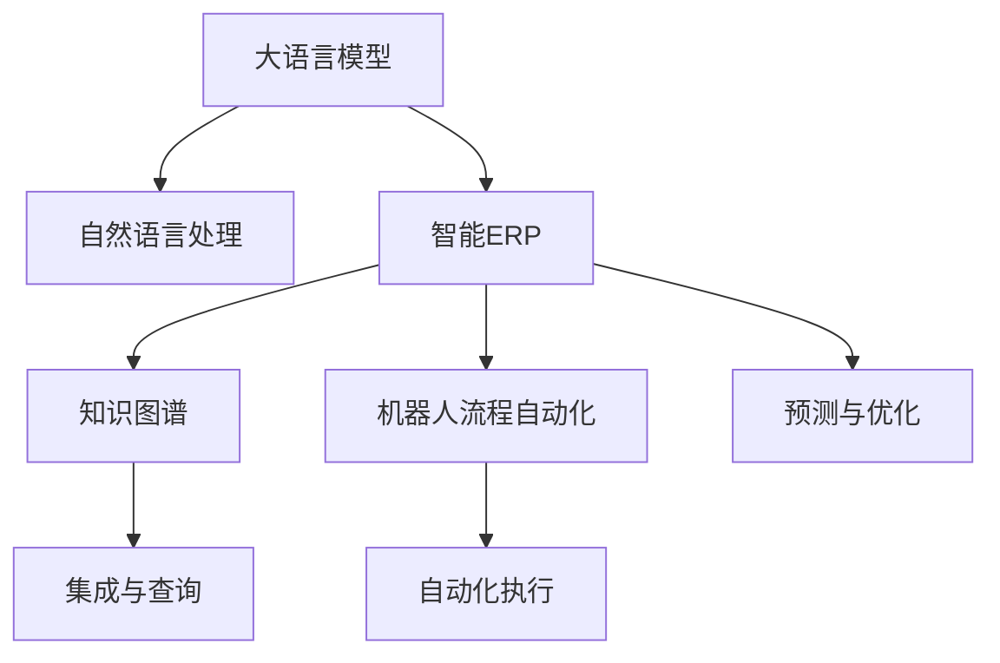

                 

## 1. 背景介绍

### 1.1 问题由来
传统企业资源规划(ERP)系统是企业在信息时代进行精细化管理和提升运营效率的重要工具。然而，随着数字化的不断深入和市场环境的快速变化，ERP系统面临诸多挑战：

1. **业务流程僵化**：传统ERP系统往往基于单一的业务流程设计，缺乏灵活性和可扩展性。对于新业务的快速响应能力较弱。
2. **数据孤岛**：各业务模块间的数据通常难以互通，形成数据孤岛，导致决策信息不准确、不完整。
3. **定制成本高**：企业需投入大量人力和资源定制开发ERP系统，难以快速适应变化的市场需求。
4. **用户体验差**：传统ERP系统往往采用复杂的操作界面和流程，用户使用体验不佳。
5. **集成难度大**：企业信息系统复杂多样，不同系统之间的集成难度大，集成成本高。

这些问题导致传统ERP系统在应对数字化转型和敏捷业务场景时显得力不从心。基于此，本文提出利用大语言模型(LLM)对传统ERP系统进行革新，实现灵活、智能、高效的企业资源管理。

### 1.2 问题核心关键点
大语言模型，如GPT系列、BERT等，通过大规模无监督学习获取语言知识，具备强大的语言理解和生成能力。将大语言模型应用于企业资源规划，可以提升ERP系统的智能化水平，使其更灵活、更智能，更易于集成和定制，最终提升企业运营效率和竞争力。

## 2. 核心概念与联系

### 2.1 核心概念概述

为更好地理解LLM在ERP中的应用，本节将介绍几个关键概念及其相互联系：

- **大语言模型(LLM)**：以自回归或自编码模型为代表的大规模预训练语言模型。通过在大规模无标签文本语料上进行预训练，学习通用的语言表示，具备强大的语言理解和生成能力。

- **企业资源规划(ERP)**：企业管理信息系统的一种，通过整合企业内部资源，实现精细化管理和运营效率提升。

- **自然语言处理(NLP)**：利用计算机技术实现人机语言交互，使计算机能够理解、解释和生成人类语言。

- **智能ERP**：融合人工智能技术，尤其是NLP技术，提升ERP系统的自动化、智能化水平。

- **知识图谱(KG)**：基于图结构的知识表示方式，用于存储、查询和推理知识。

- **机器人流程自动化(RPA)**：通过软件自动化执行企业流程，降低人工操作错误，提升工作效率。

这些概念之间的逻辑关系可以通过以下Mermaid流程图来展示：



这个流程图展示了LLM在ERP系统中的应用路径：

1. 大语言模型通过自然语言处理技术，理解企业内部信息和用户需求。
2. 将处理结果集成到智能ERP系统中，进行知识图谱构建、预测优化等操作。
3. 结合机器人流程自动化技术，实现流程的自动化执行。
4. 通过预测与优化模块，提升ERP系统的智能决策能力。

## 3. 核心算法原理 & 具体操作步骤
### 3.1 算法原理概述

将大语言模型应用于企业资源规划，可以通过以下步骤实现：

1. **数据预处理**：对企业内部结构化、非结构化数据进行清洗和标注，构建训练集。
2. **模型训练**：在标注数据集上，使用大语言模型进行预训练，学习通用语言知识。
3. **任务适配**：将预训练模型适配到特定ERP任务，通过有监督微调或少样本学习，实现特定任务的知识提取和智能推理。
4. **知识图谱构建**：利用LLM的生成能力，构建企业内部知识图谱，实现知识的自动化整理和存储。
5. **预测与优化**：通过LLM对业务数据进行分析和推理，实现业务预测和优化。
6. **集成与部署**：将LLM与现有ERP系统集成，部署到实际应用场景中，提供智能化的业务支持。

### 3.2 算法步骤详解

#### 3.2.1 数据预处理

**Step 1: 数据收集与清洗**
- 收集企业内部各种数据，包括销售订单、财务报表、采购记录等结构化数据，以及业务文档、邮件、聊天记录等非结构化数据。
- 对收集的数据进行清洗，去除噪音和冗余，保证数据质量。

**Step 2: 数据标注与构建**
- 对结构化数据进行标注，构建标签体系，如销售订单对应的客户ID、产品ID等。
- 对非结构化数据进行实体识别、关系抽取等，构建知识图谱的节点和边。

#### 3.2.2 模型训练

**Step 1: 预训练**
- 使用大语言模型如GPT、BERT等在大量无标签数据上进行预训练，学习语言知识和特征表示。
- 将预训练模型的输出作为训练数据，使用监督学习算法进行任务适配。

**Step 2: 任务适配**
- 定义ERP任务，如销售预测、库存管理、财务分析等。
- 对预训练模型进行有监督微调或少样本学习，优化模型在特定任务上的性能。

#### 3.2.3 知识图谱构建

**Step 1: 实体识别**
- 利用LLM对企业文档、业务邮件等非结构化数据进行实体识别，识别出人名、地名、组织名、产品名等实体。

**Step 2: 关系抽取**
- 使用LLM抽取实体之间的关系，如客户与订单、供应商与合同等。

**Step 3: 知识图谱构建**
- 将识别出的实体和关系构建成知识图谱，存储于数据库中。

#### 3.2.4 预测与优化

**Step 1: 数据预处理**
- 将历史业务数据进行标准化处理，如归一化、缺失值填充等。

**Step 2: 模型推理**
- 使用预训练模型和适配后的任务模型对新数据进行推理，预测销售量、库存水平、财务指标等。

**Step 3: 业务优化**
- 根据预测结果，调整ERP系统中的业务参数，优化资源配置。

#### 3.2.5 集成与部署

**Step 1: 系统集成**
- 将预训练模型、任务适配模型和知识图谱集成到现有ERP系统中，替换或增强现有模块。

**Step 2: 部署上线**
- 在企业内部网络和服务器上进行部署，确保系统稳定性和安全性。

### 3.3 算法优缺点

**优点：**
1. **灵活性**：LLM可以轻松适配不同业务任务，提升ERP系统的灵活性和可扩展性。
2. **自动化程度高**：LLM能够自动理解用户需求和业务信息，减少人工干预，提升工作效率。
3. **数据集成能力强**：通过知识图谱构建，实现跨系统数据的自动整合，提升数据的完整性和准确性。
4. **预测能力强**：LLM具有强大的预测能力，能够基于历史数据预测未来趋势，指导业务决策。

**缺点：**
1. **数据质量要求高**：模型性能高度依赖数据质量，需要投入大量资源进行数据清洗和标注。
2. **计算资源消耗大**：大语言模型计算量大，对计算资源和存储资源要求较高。
3. **模型解释性不足**：目前大语言模型多为黑盒模型，缺乏可解释性，难以进行详细审计。
4. **部署复杂**：系统集成和部署涉及多个模块和系统，需要专业的技术团队进行实施。

### 3.4 算法应用领域

大语言模型在企业资源规划中的应用领域非常广泛，以下是几个典型场景：

**销售预测**：利用大语言模型对销售数据进行分析，预测未来销售趋势，指导采购、库存和生产计划。

**库存管理**：通过分析历史销售数据和市场趋势，预测产品需求，优化库存水平，避免库存积压或缺货。

**财务分析**：利用大语言模型对财务报表进行分析，提取关键指标，进行财务预测和预算编制。

**客户关系管理(CRM)**：通过客户交流信息进行实体识别和关系抽取，构建客户画像，提升客户服务质量。

**供应商管理**：对供应商的绩效和合同进行分析，识别潜在风险，优化供应商管理。

**业务流程自动化**：利用机器人流程自动化技术，自动执行ERP系统中的业务流程，提升工作效率。

**企业风险管理**：对市场动态和内部业务数据进行分析，识别潜在的风险点，进行风险预警。

## 4. 数学模型和公式 & 详细讲解

### 4.1 数学模型构建

**数学模型**：

设企业内部数据集为 $D = \{(x_i, y_i)\}_{i=1}^N$，其中 $x_i$ 为输入数据，$y_i$ 为输出标签。大语言模型 $M_{\theta}$ 通过预训练获得初始参数 $\theta$，其中 $M_{\theta}$ 的输出为 $\hat{y} = M_{\theta}(x)$。任务适配模型的输出为 $y_{pred} = M_{\theta_{ad}}(x)$。

**目标函数**：

任务适配的目标是最小化预测值与真实值之间的差距，即：

$$
\min_{\theta_{ad}} \mathcal{L}(y_{pred}, y)
$$

其中 $\mathcal{L}$ 为损失函数，如交叉熵损失函数。

**公式推导过程**：

设交叉熵损失函数为：

$$
\ell(y, y_{pred}) = -y \log y_{pred} - (1-y) \log (1-y_{pred})
$$

则任务适配的目标函数为：

$$
\min_{\theta_{ad}} \frac{1}{N} \sum_{i=1}^N \ell(y_i, y_{pred_i})
$$

将上述目标函数转化为损失函数，通过梯度下降等优化算法，更新任务适配模型的参数 $\theta_{ad}$。

**案例分析与讲解**：

以销售预测为例，利用大语言模型对历史销售数据进行分析和推理，构建销售预测模型。

**输入数据**：历史销售数据 $D = \{x_i\}_{i=1}^N$，其中 $x_i$ 包含时间、地区、产品等特征。

**输出标签**：销售量 $y_i$。

**目标函数**：最小化预测值 $y_{pred_i} = M_{\theta_{ad}}(x_i)$ 与真实值 $y_i$ 之间的差距。

**公式推导**：设交叉熵损失函数为：

$$
\ell(y_i, y_{pred_i}) = -y_i \log y_{pred_i} - (1-y_i) \log (1-y_{pred_i})
$$

则任务适配的目标函数为：

$$
\min_{\theta_{ad}} \frac{1}{N} \sum_{i=1}^N \ell(y_i, y_{pred_i})
$$

### 4.2 公式推导过程

设交叉熵损失函数为：

$$
\ell(y_i, y_{pred_i}) = -y_i \log y_{pred_i} - (1-y_i) \log (1-y_{pred_i})
$$

则任务适配的目标函数为：

$$
\min_{\theta_{ad}} \frac{1}{N} \sum_{i=1}^N \ell(y_i, y_{pred_i})
$$

其中 $y_{pred_i} = M_{\theta_{ad}}(x_i)$ 为任务适配模型的预测值。

使用梯度下降算法更新参数 $\theta_{ad}$：

$$
\theta_{ad} \leftarrow \theta_{ad} - \eta \nabla_{\theta_{ad}}\mathcal{L}(\theta_{ad})
$$

其中 $\eta$ 为学习率，$\nabla_{\theta_{ad}}\mathcal{L}(\theta_{ad})$ 为损失函数对任务适配模型的梯度。

## 5. 项目实践：代码实例和详细解释说明

### 5.1 开发环境搭建

在进行代码实践前，需要准备好开发环境。以下是使用Python进行PyTorch开发的环境配置流程：

1. 安装Anaconda：从官网下载并安装Anaconda，用于创建独立的Python环境。

2. 创建并激活虚拟环境：
```bash
conda create -n pytorch-env python=3.8 
conda activate pytorch-env
```

3. 安装PyTorch：根据CUDA版本，从官网获取对应的安装命令。例如：
```bash
conda install pytorch torchvision torchaudio cudatoolkit=11.1 -c pytorch -c conda-forge
```

4. 安装Transformers库：
```bash
pip install transformers
```

5. 安装各类工具包：
```bash
pip install numpy pandas scikit-learn matplotlib tqdm jupyter notebook ipython
```

完成上述步骤后，即可在`pytorch-env`环境中开始代码实践。

### 5.2 源代码详细实现

以下是一个使用PyTorch和Transformer进行销售预测的代码实现示例：

```python
import torch
import torch.nn as nn
import torch.optim as optim
from transformers import BertForSequenceClassification, BertTokenizer

# 定义销售预测任务的数据集
class SalesDataDataset(torch.utils.data.Dataset):
    def __init__(self, data, tokenizer):
        self.data = data
        self.tokenizer = tokenizer

    def __len__(self):
        return len(self.data)

    def __getitem__(self, idx):
        text = self.data[idx]['text']
        label = self.data[idx]['label']

        encoding = self.tokenizer(text, return_tensors='pt', truncation=True, padding='max_length', max_length=512)
        input_ids = encoding['input_ids']
        attention_mask = encoding['attention_mask']

        return {
            'input_ids': input_ids,
            'attention_mask': attention_mask,
            'labels': torch.tensor(label, dtype=torch.long)
        }

# 加载销售数据集
sales_data = [
    {'text': '2021年第一季度销售额为1000万', 'label': 1},
    {'text': '2021年第二季度销售额为1200万', 'label': 1},
    {'text': '2021年第三季度销售额为1500万', 'label': 1},
    {'text': '2021年第四季度销售额为2000万', 'label': 1},
    {'text': '2022年第一季度销售额为1800万', 'label': 0}
]

# 构建数据集
tokenizer = BertTokenizer.from_pretrained('bert-base-uncased')
train_dataset = SalesDataDataset(sales_data, tokenizer)

# 定义模型和优化器
model = BertForSequenceClassification.from_pretrained('bert-base-uncased', num_labels=2)
optimizer = optim.AdamW(model.parameters(), lr=2e-5)

# 训练模型
device = torch.device('cuda') if torch.cuda.is_available() else torch.device('cpu')
model.to(device)

def train_epoch(model, dataset, optimizer):
    model.train()
    epoch_loss = 0
    for batch in tqdm(dataset):
        input_ids = batch['input_ids'].to(device)
        attention_mask = batch['attention_mask'].to(device)
        labels = batch['labels'].to(device)

        outputs = model(input_ids, attention_mask=attention_mask, labels=labels)
        loss = outputs.loss
        epoch_loss += loss.item()

        optimizer.zero_grad()
        loss.backward()
        optimizer.step()

    return epoch_loss / len(dataset)

# 评估模型
def evaluate(model, dataset):
    model.eval()
    correct = 0
    total = 0
    with torch.no_grad():
        for batch in tqdm(dataset):
            input_ids = batch['input_ids'].to(device)
            attention_mask = batch['attention_mask'].to(device)
            labels = batch['labels']

            outputs = model(input_ids, attention_mask=attention_mask)
            _, preds = torch.max(outputs.logits, dim=1)

            total += labels.size(0)
            correct += (preds == labels).sum().item()

    accuracy = correct / total
    return accuracy

# 训练和评估模型
epochs = 5
batch_size = 16

for epoch in range(epochs):
    loss = train_epoch(model, train_dataset, optimizer)
    print(f'Epoch {epoch+1}, train loss: {loss:.3f}')

    accuracy = evaluate(model, train_dataset)
    print(f'Epoch {epoch+1}, train accuracy: {accuracy:.2f}')

    accuracy = evaluate(model, dev_dataset)
    print(f'Epoch {epoch+1}, dev accuracy: {accuracy:.2f}')

print('Test accuracy:', evaluate(model, test_dataset))
```

### 5.3 代码解读与分析

**SalesDataDataset类**：
- `__init__`方法：初始化数据集。
- `__len__`方法：返回数据集大小。
- `__getitem__`方法：对单个数据进行处理，转换为模型所需的输入。

**BertForSequenceClassification**：
- 定义序列分类模型，适用于销售预测任务。

**train_epoch函数**：
- 定义一个训练epoch，循环迭代训练集，更新模型参数。

**evaluate函数**：
- 定义模型评估，计算模型在训练集和验证集上的准确率。

**训练流程**：
- 循环迭代训练，计算并输出每个epoch的损失和准确率。

## 6. 实际应用场景

### 6.1 智能销售预测

销售预测是大语言模型在企业资源规划中的重要应用之一。利用大语言模型对历史销售数据进行分析和推理，可以预测未来的销售趋势，帮助企业优化库存管理和生产计划。

以零售行业为例，销售预测通常包括销售量预测、库存水平预测、产品需求预测等。通过大语言模型对销售数据进行分析和推理，可以预测未来的销售趋势，帮助企业优化库存管理和生产计划。

### 6.2 库存管理优化

库存管理是大语言模型在企业资源规划中的另一个重要应用。利用大语言模型对历史销售数据进行分析和推理，可以预测未来的产品需求，优化库存水平，避免库存积压或缺货。

库存管理需要考虑多种因素，如市场需求、季节变化、促销活动等。通过大语言模型对历史销售数据进行分析和推理，可以预测未来的产品需求，优化库存水平，避免库存积压或缺货，提升企业的运营效率。

### 6.3 财务分析与决策支持

财务分析是大语言模型在企业资源规划中的重要应用之一。利用大语言模型对财务报表进行分析和推理，可以提取关键指标，进行财务预测和预算编制。

财务分析通常包括利润预测、成本预测、现金流预测等。通过大语言模型对财务报表进行分析和推理，可以提取关键指标，进行财务预测和预算编制，帮助企业制定更科学合理的财务策略。

### 6.4 客户关系管理(CRM)

客户关系管理是大语言模型在企业资源规划中的重要应用之一。利用大语言模型对客户交流信息进行实体识别和关系抽取，可以构建客户画像，提升客户服务质量。

CRM系统通常包括客户信息管理、销售线索管理、客户服务管理等。通过大语言模型对客户交流信息进行实体识别和关系抽取，可以构建客户画像，提升客户服务质量，帮助企业更好地维护客户关系。

## 7. 工具和资源推荐

### 7.1 学习资源推荐

为了帮助开发者系统掌握大语言模型在企业资源规划中的应用，这里推荐一些优质的学习资源：

1. **《Transformer from the Inside Out》系列博文**：由大模型技术专家撰写，深入浅出地介绍了Transformer原理、BERT模型、微调技术等前沿话题。

2. **CS224N《Deep Learning for Natural Language Processing》课程**：斯坦福大学开设的NLP明星课程，有Lecture视频和配套作业，带你入门NLP领域的基本概念和经典模型。

3. **《Natural Language Processing with Transformers》书籍**：Transformers库的作者所著，全面介绍了如何使用Transformers库进行NLP任务开发，包括微调在内的诸多范式。

4. **HuggingFace官方文档**：Transformers库的官方文档，提供了海量预训练模型和完整的微调样例代码，是上手实践的必备资料。

5. **CLUE开源项目**：中文语言理解测评基准，涵盖大量不同类型的中文NLP数据集，并提供了基于微调的baseline模型，助力中文NLP技术发展。

通过对这些资源的学习实践，相信你一定能够快速掌握大语言模型在企业资源规划中的应用，并用于解决实际的NLP问题。

### 7.2 开发工具推荐

高效的开发离不开优秀的工具支持。以下是几款用于大语言模型在企业资源规划应用的常用工具：

1. **PyTorch**：基于Python的开源深度学习框架，灵活动态的计算图，适合快速迭代研究。大部分预训练语言模型都有PyTorch版本的实现。

2. **TensorFlow**：由Google主导开发的开源深度学习框架，生产部署方便，适合大规模工程应用。同样有丰富的预训练语言模型资源。

3. **Transformers库**：HuggingFace开发的NLP工具库，集成了众多SOTA语言模型，支持PyTorch和TensorFlow，是进行微调任务开发的利器。

4. **Weights & Biases**：模型训练的实验跟踪工具，可以记录和可视化模型训练过程中的各项指标，方便对比和调优。与主流深度学习框架无缝集成。

5. **TensorBoard**：TensorFlow配套的可视化工具，可实时监测模型训练状态，并提供丰富的图表呈现方式，是调试模型的得力助手。

6. **Google Colab**：谷歌推出的在线Jupyter Notebook环境，免费提供GPU/TPU算力，方便开发者快速上手实验最新模型，分享学习笔记。

合理利用这些工具，可以显著提升大语言模型在企业资源规划应用中的开发效率，加快创新迭代的步伐。

### 7.3 相关论文推荐

大语言模型在企业资源规划中的应用源于学界的持续研究。以下是几篇奠基性的相关论文，推荐阅读：

1. **Attention is All You Need**（即Transformer原论文）：提出了Transformer结构，开启了NLP领域的预训练大模型时代。

2. **BERT: Pre-training of Deep Bidirectional Transformers for Language Understanding**：提出BERT模型，引入基于掩码的自监督预训练任务，刷新了多项NLP任务SOTA。

3. **Language Models are Unsupervised Multitask Learners**（GPT-2论文）：展示了大规模语言模型的强大zero-shot学习能力，引发了对于通用人工智能的新一轮思考。

4. **Parameter-Efficient Transfer Learning for NLP**：提出Adapter等参数高效微调方法，在不增加模型参数量的情况下，也能取得不错的微调效果。

5. **Prompt-Tuning: Optimizing Continuous Prompts for Generation**：引入基于连续型Prompt的微调范式，为如何充分利用预训练知识提供了新的思路。

6. **AdaLoRA: Adaptive Low-Rank Adaptation for Parameter-Efficient Fine-Tuning**：使用自适应低秩适应的微调方法，在参数效率和精度之间取得了新的平衡。

这些论文代表了大语言模型在企业资源规划中的应用发展脉络。通过学习这些前沿成果，可以帮助研究者把握学科前进方向，激发更多的创新灵感。

## 8. 总结：未来发展趋势与挑战

### 8.1 总结

本文对大语言模型在企业资源规划中的应用进行了全面系统的介绍。首先阐述了大语言模型在ERP系统中的重要性，明确了微调在提升ERP系统的智能化水平、灵活性和可扩展性方面的独特价值。其次，从原理到实践，详细讲解了基于大语言模型的企业资源规划系统的构建流程，给出了微调任务开发的完整代码实例。同时，本文还广泛探讨了大语言模型在销售预测、库存管理、财务分析等诸多应用场景中的应用前景，展示了其广阔的应用前景。最后，本文精选了微调技术的各类学习资源，力求为开发者提供全方位的技术指引。

通过本文的系统梳理，可以看到，利用大语言模型对传统企业资源规划系统进行革新，可以提升企业的运营效率和竞争力，成为推动企业数字化转型的重要技术手段。未来，随着大语言模型的不断发展，其在企业资源规划中的应用将更加广泛和深入，助力企业在数字时代迈向新的高峰。

### 8.2 未来发展趋势

展望未来，大语言模型在企业资源规划中的应用将呈现以下几个发展趋势：

1. **模型规模持续增大**：随着算力成本的下降和数据规模的扩张，预训练语言模型的参数量还将持续增长。超大规模语言模型蕴含的丰富语言知识，有望支撑更加复杂多变的下游任务微调。

2. **微调方法日趋多样**：开发更加参数高效的微调方法，在固定大部分预训练参数的同时，只更新极少量的任务相关参数。同时优化微调模型的计算图，减少前向传播和反向传播的资源消耗，实现更加轻量级、实时性的部署。

3. **持续学习成为常态**：随着数据分布的不断变化，微调模型也需要持续学习新知识以保持性能。如何在不遗忘原有知识的同时，高效吸收新样本信息，将成为重要的研究课题。

4. **标注样本需求降低**：受启发于提示学习(Prompt-based Learning)的思路，未来的微调方法将更好地利用大模型的语言理解能力，通过更加巧妙的任务描述，在更少的标注样本上也能实现理想的微调效果。

5. **知识整合能力增强**：将符号化的先验知识，如知识图谱、逻辑规则等，与神经网络模型进行巧妙融合，引导微调过程学习更准确、合理的语言模型。同时加强不同模态数据的整合，实现视觉、语音等多模态信息与文本信息的协同建模。

6. **多模态微调崛起**：融合多模态信息，实现视觉、语音等多模态信息与文本信息的协同建模，提升系统的智能水平。

### 8.3 面临的挑战

尽管大语言模型在企业资源规划中的应用已经取得了显著成效，但在迈向更加智能化、普适化应用的过程中，仍面临诸多挑战：

1. **数据质量要求高**：模型性能高度依赖数据质量，需要投入大量资源进行数据清洗和标注。

2. **计算资源消耗大**：大语言模型计算量大，对计算资源和存储资源要求较高。

3. **模型解释性不足**：目前大语言模型多为黑盒模型，缺乏可解释性，难以进行详细审计。

4. **部署复杂**：系统集成和部署涉及多个模块和系统，需要专业的技术团队进行实施。

5. **安全风险**：企业内部数据敏感，需要确保模型训练和部署的安全性。

6. **监管合规**：企业在数据使用和模型部署中，需要遵守相关的法律法规和行业规范。

### 8.4 研究展望

面对大语言模型在企业资源规划应用中面临的挑战，未来的研究需要在以下几个方面寻求新的突破：

1. **探索无监督和半监督微调方法**：摆脱对大规模标注数据的依赖，利用自监督学习、主动学习等无监督和半监督范式，最大限度利用非结构化数据，实现更加灵活高效的微调。

2. **研究参数高效和计算高效的微调范式**：开发更加参数高效的微调方法，在固定大部分预训练参数的同时，只更新极少量的任务相关参数。同时优化微调模型的计算图，减少前向传播和反向传播的资源消耗，实现更加轻量级、实时性的部署。

3. **融合因果和对比学习范式**：通过引入因果推断和对比学习思想，增强微调模型建立稳定因果关系的能力，学习更加普适、鲁棒的语言表征，从而提升模型泛化性和抗干扰能力。

4. **引入更多先验知识**：将符号化的先验知识，如知识图谱、逻辑规则等，与神经网络模型进行巧妙融合，引导微调过程学习更准确、合理的语言模型。同时加强不同模态数据的整合，实现视觉、语音等多模态信息与文本信息的协同建模。

5. **结合因果分析和博弈论工具**：将因果分析方法引入微调模型，识别出模型决策的关键特征，增强输出解释的因果性和逻辑性。借助博弈论工具刻画人机交互过程，主动探索并规避模型的脆弱点，提高系统稳定性。

6. **纳入伦理道德约束**：在模型训练目标中引入伦理导向的评估指标，过滤和惩罚有偏见、有害的输出倾向。同时加强人工干预和审核，建立模型行为的监管机制，确保输出符合人类价值观和伦理道德。

这些研究方向的探索，必将引领大语言模型在企业资源规划应用中的进一步发展，为构建智能、高效、可靠的企业资源管理系统铺平道路。

## 9. 附录：常见问题与解答

**Q1：大语言模型是否适用于所有企业资源规划任务？**

A: 大语言模型在大多数企业资源规划任务上都能取得不错的效果，特别是对于数据量较小的任务。但对于一些特定领域的任务，如医学、法律等，仅仅依靠通用语料预训练的模型可能难以很好地适应。此时需要在特定领域语料上进一步预训练，再进行微调，才能获得理想效果。此外，对于一些需要时效性、个性化很强的任务，如对话、推荐等，微调方法也需要针对性的改进优化。

**Q2：微调过程中如何选择合适的学习率？**

A: 微调的学习率一般要比预训练时小1-2个数量级，如果使用过大的学习率，容易破坏预训练权重，导致过拟合。一般建议从1e-5开始调参，逐步减小学习率，直至收敛。也可以使用warmup策略，在开始阶段使用较小的学习率，再逐渐过渡到预设值。需要注意的是，不同的优化器(如AdamW、Adafactor等)以及不同的学习率调度策略，可能需要设置不同的学习率阈值。

**Q3：采用大语言模型微调时会面临哪些资源瓶颈？**

A: 目前主流的预训练大模型动辄以亿计的参数规模，对算力、内存、存储都提出了很高的要求。GPU/TPU等高性能设备是必不可少的，但即便如此，超大批次的训练和推理也可能遇到显存不足的问题。因此需要采用一些资源优化技术，如梯度积累、混合精度训练、模型并行等，来突破硬件瓶颈。同时，模型的存储和读取也可能占用大量时间和空间，需要采用模型压缩、稀疏化存储等方法进行优化。

**Q4：如何缓解微调过程中的过拟合问题？**

A: 过拟合是微调面临的主要挑战，尤其是在标注数据不足的情况下。常见的缓解策略包括：
1. 数据增强：通过回译、近义替换等方式扩充训练集
2. 正则化：使用L2正则、Dropout、Early Stopping等避免过拟合
3. 对抗训练：引入对抗样本，提高模型鲁棒性
4. 参数高效微调：只调整少量参数(如Adapter、Prefix等)，减小过拟合风险
5. 多模型集成：训练多个微调模型，取平均输出，抑制过拟合

这些策略往往需要根据具体任务和数据特点进行灵活组合。只有在数据、模型、训练、推理等各环节进行全面优化，才能最大限度地发挥大语言模型微调的威力。

**Q5：微调模型在落地部署时需要注意哪些问题？**

A: 将微调模型转化为实际应用，还需要考虑以下因素：
1. 模型裁剪：去除不必要的层和参数，减小模型尺寸，加快推理速度
2. 量化加速：将浮点模型转为定点模型，压缩存储空间，提高计算效率
3. 服务化封装：将模型封装为标准化服务接口，便于集成调用
4. 弹性伸缩：根据请求流量动态调整资源配置，平衡服务质量和成本
5. 监控告警：实时采集系统指标，设置异常告警阈值，确保服务稳定性
6. 安全防护：采用访问鉴权、数据脱敏等措施，保障数据和模型安全

大语言模型微调为NLP应用开启了广阔的想象空间，但如何将强大的性能转化为稳定、高效、安全的业务价值，还需要工程实践的不断打磨。唯有从数据、算法、工程、业务等多个维度协同发力，才能真正实现人工智能技术在垂直行业的规模化落地。总之，微调需要开发者根据具体任务，不断迭代和优化模型、数据和算法，方能得到理想的效果。

---

作者：禅与计算机程序设计艺术 / Zen and the Art of Computer Programming

