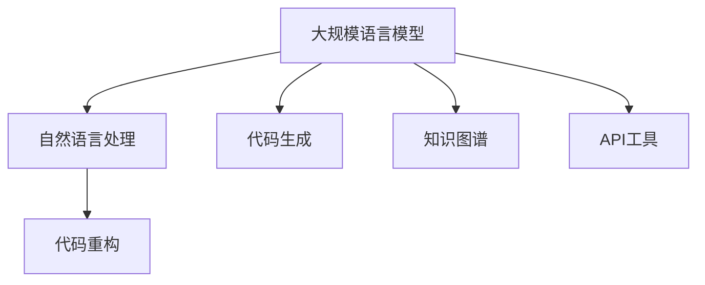

                 

# LLM对传统软件开发流程的影响与变革

## 1. 背景介绍

### 1.1 问题由来
近年来，随着人工智能技术的迅速发展，尤其是深度学习和大规模语言模型（Large Language Models, LLMs）的兴起，对软件开发流程产生了深远影响。传统软件开发流程主要以代码驱动为主，开发人员通过编写代码实现软件需求，并进行测试和维护。然而，随着LLM的出现，开发者可以利用自然语言与计算机进行更直观、更高效的沟通，在开发效率、代码质量和创新性方面带来了诸多变革。

### 1.2 问题核心关键点
LMMs对传统软件开发流程的影响主要体现在以下几个方面：
- 自动化编码：利用LMMs自动生成代码，减轻开发者的手工编程负担。
- 语义理解与生成：通过LMMs处理自然语言，提供更加智能化的代码生成与分析。
- 代码重构与优化：利用LMMs自动检测代码问题并进行优化。
- 代码生成器与API工具：基于LMMs开发的各种代码生成器和API工具，大幅提升开发效率。
- 知识图谱与文档生成：利用LMMs生成知识图谱和文档，提高代码可读性和维护性。
- 协作与知识共享：通过LMMs提供共享知识库，促进团队协作和知识传递。
- 代码质量保证：利用LMMs进行代码质量检测和自动化测试，确保代码稳定性和可靠性。

这些影响不仅改变了软件开发的工具和技术，还深刻影响了开发者的工作方式和团队协作模式。

## 2. 核心概念与联系

### 2.1 核心概念概述

为更好地理解LMMs对传统软件开发流程的影响，本节将介绍几个密切相关的核心概念：

- 大规模语言模型（Large Language Models, LLMs）：如GPT-3、BERT等，这些模型通过在大规模文本数据上进行预训练，能够理解并生成自然语言。
- 自然语言处理（Natural Language Processing, NLP）：涉及计算机对自然语言的理解、生成和分析，是LMMs的重要应用领域。
- 代码生成（Code Generation）：利用LMMs自动生成代码，提高开发效率，减少重复劳动。
- 代码重构（Code Refactoring）：利用LMMs自动检测并优化代码，改善代码结构和可维护性。
- 知识图谱（Knowledge Graph）：通过LMMs构建的知识图谱，能够帮助开发者快速查找和应用领域知识。
- API工具（API Tools）：利用LMMs构建的API工具，提供更高效的开发环境和自动化服务。

这些核心概念之间的逻辑关系可以通过以下Mermaid流程图来展示：



这个流程图展示了大语言模型与软件开发相关的核心概念及其之间的关系：

1. LMMs通过自然语言处理技术理解并生成代码，进行代码生成和重构。
2. 构建知识图谱，提供丰富的领域知识，用于代码优化和重构。
3. 开发API工具，进一步简化代码生成和重构过程。

## 3. 核心算法原理 & 具体操作步骤
### 3.1 算法原理概述

LMMs对传统软件开发流程的自动化和智能化改进，主要基于以下几个算法原理：

- 编码器-解码器（Encoder-Decoder）架构：LMMs利用编码器将输入文本转换为语义表示，通过解码器生成输出文本。在代码生成和重构中，编码器可以分析代码结构，解码器生成符合语义要求的代码。

- 自监督预训练（Self-Supervised Pretraining）：利用大规模无标签文本数据对LMMs进行预训练，学习到丰富的语言知识，从而能够更好地处理自然语言，生成符合语义要求的代码。

- 迁移学习（Transfer Learning）：通过微调LMMs，使其在不同应用场景中适应特定的任务，提升代码生成和重构的准确性和泛化能力。

- 对抗训练（Adversarial Training）：在生成代码时，通过引入对抗样本，增强模型的鲁棒性和泛化能力，避免生成错误或不合理的代码。

- 知识图谱嵌入（Knowledge Graph Embedding）：将领域知识转换为向量表示，与LMMs结合，进一步提升代码生成和重构的质量。

这些算法原理构成了LMMs在代码生成和重构中发挥作用的基础，使得开发者能够借助LMMs自动化地完成更多任务，提高开发效率和代码质量。

### 3.2 算法步骤详解

基于LMMs的代码生成和重构过程，主要包括以下几个关键步骤：

**Step 1: 数据准备与预训练**
- 收集和整理源代码与注释等文本数据，构建代码库。
- 利用大规模无标签文本数据对LMMs进行预训练，学习语言知识。

**Step 2: 模型微调**
- 在特定任务上微调LMMs，使其能够生成符合语义要求的代码。
- 根据任务需求设置不同的参数和超参数，如学习率、批量大小等。

**Step 3: 代码生成与分析**
- 输入自然语言代码需求，利用LMMs生成对应的代码。
- 通过LMMs自动检测代码中的错误和不规范，进行重构优化。

**Step 4: 代码验证与测试**
- 对生成的代码进行自动化测试，确保其功能和结构正确。
- 利用LMMs生成测试用例，进行代码验证。

**Step 5: 迭代优化**
- 根据测试结果和用户反馈，不断优化LMMs，提高代码生成的质量和效率。
- 通过持续学习和迁移学习，增强LMMs在不同任务上的适应性。

### 3.3 算法优缺点

基于LMMs的代码生成和重构方法具有以下优点：
1. 自动化程度高：能够自动生成代码，减轻开发者的手工编程负担。
2. 生成效率高：利用LMMs快速生成代码，显著提升开发效率。
3. 泛化能力强：通过预训练和微调，LMMs能够适应不同的代码生成任务。
4. 质量保证：利用LMMs进行代码重构，优化代码质量和可维护性。
5. 知识整合：通过知识图谱嵌入，将领域知识与LMMs结合，提升代码生成和重构的准确性。

同时，该方法也存在一些局限性：
1. 依赖高质量预训练数据：预训练数据质量直接影响LMMs的生成效果。
2. 容易产生语法错误：由于自动生成，可能出现语法错误和不规范的代码。
3. 代码理解深度有限：LMMs生成的代码可能不够深入，需要后期人工审阅和优化。
4. 依赖外部工具：代码生成和重构过程中，依赖于LMMs和相关API工具的支持。
5. 对开发者技能要求高：需要开发者具备一定的LMMs和API工具的使用技能。

尽管存在这些局限性，但LMMs在代码生成和重构方面表现出了巨大的潜力，能够显著提升开发效率和代码质量。

### 3.4 算法应用领域

基于LMMs的代码生成和重构方法在软件开发中具有广泛的应用：

- 自动化测试代码生成：通过自然语言描述测试用例，自动生成测试代码。
- 数据分析代码生成：自动生成数据清洗、预处理和分析的代码。
- 前端页面代码生成：根据设计文档自动生成HTML、CSS和JavaScript代码。
- 后端API代码生成：根据需求自动生成API接口代码。
- 数据库查询代码生成：自动生成SQL查询代码。
- 自动化重构代码：自动检测和优化代码，提升代码质量和可维护性。

此外，LMMs在文档生成、协作与知识共享、代码质量保证等方面也有广泛应用。

## 4. 数学模型和公式 & 详细讲解 & 举例说明

### 4.1 数学模型构建

为了更好地理解LMMs在代码生成和重构中的作用，本节将使用数学语言对LMMs进行建模。

设LMMs在预训练和微调后的编码为 $E$，解码器为 $D$，输入自然语言需求为 $X$，生成的代码为 $Y$。则LMMs的代码生成过程可以表示为：

$$
Y = D(E(X))
$$

其中，$X$ 为自然语言代码需求，$E$ 为编码器，$D$ 为解码器。

在代码重构过程中，LMMs可以识别出代码中的错误和不规范，并生成符合语义要求的代码。假设代码中存在错误标记为 $E_{error}$，重构后的代码为 $Y_{refactor}$，则LMMs的重构过程可以表示为：

$$
Y_{refactor} = D(E_{error}(X))
$$

### 4.2 公式推导过程

以下我们以代码生成和重构的数学模型为例，进行详细推导。

**代码生成过程**：
- 输入自然语言代码需求 $X$。
- 通过编码器 $E$ 将 $X$ 转换为语义表示 $Z$。
- 通过解码器 $D$ 将 $Z$ 转换为生成的代码 $Y$。

**代码重构过程**：
- 输入包含错误的代码 $X_{error}$。
- 通过编码器 $E_{error}$ 将 $X_{error}$ 转换为错误标记 $Z_{error}$。
- 通过解码器 $D$ 将 $Z_{error}$ 转换为符合语义要求的代码 $Y_{refactor}$。

**生成效率**：
- 设 $T_E$ 为编码器的计算时间，$T_D$ 为解码器的计算时间。
- 生成代码的总时间为 $T_Y = T_E + T_D$。

**代码质量**：
- 设 $Q_E$ 为编码器的准确率，$Q_D$ 为解码器的准确率。
- 生成的代码质量为 $Q_Y = Q_E \times Q_D$。

**代码重构效果**：
- 设 $Q_{refactor}$ 为重构后代码的质量提升。
- 重构后的代码质量为 $Q_{refactor} = Q_{error} \times Q_D$，其中 $Q_{error}$ 为错误标记的准确率。

### 4.3 案例分析与讲解

下面以一个简单的代码生成和重构案例进行分析：

**案例背景**：
- 输入自然语言代码需求：“编写一个函数，接收两个整数参数，返回它们的和。”
- 通过LMMs生成对应的代码。

**代码生成过程**：
- 输入自然语言代码需求 $X = \text{“编写一个函数，接收两个整数参数，返回它们的和。”}$。
- 通过编码器 $E$ 将 $X$ 转换为语义表示 $Z$。
- 通过解码器 $D$ 将 $Z$ 转换为生成的代码 $Y = \text{“def add(a, b): return a + b”}$。

**代码重构过程**：
- 输入包含错误的代码 $X_{error} = \text{“def add(a, b): return a - b”}$。
- 通过编码器 $E_{error}$ 将 $X_{error}$ 转换为错误标记 $Z_{error}$。
- 通过解码器 $D$ 将 $Z_{error}$ 转换为符合语义要求的代码 $Y_{refactor} = \text{“def add(a, b): return a + b”}$。

通过上述分析，可以看到LMMs在代码生成和重构中的核心作用，即利用自然语言处理技术，将自然语言需求转换为代码，并根据错误标记进行代码优化。

## 5. 项目实践：代码实例和详细解释说明
### 5.1 开发环境搭建

在进行LMMs的代码生成和重构实践前，我们需要准备好开发环境。以下是使用Python进行PyTorch开发的环境配置流程：

1. 安装Anaconda：从官网下载并安装Anaconda，用于创建独立的Python环境。

2. 创建并激活虚拟环境：
```bash
conda create -n pytorch-env python=3.8 
conda activate pytorch-env
```

3. 安装PyTorch：根据CUDA版本，从官网获取对应的安装命令。例如：
```bash
conda install pytorch torchvision torchaudio cudatoolkit=11.1 -c pytorch -c conda-forge
```

4. 安装Transformers库：
```bash
pip install transformers
```

5. 安装各类工具包：
```bash
pip install numpy pandas scikit-learn matplotlib tqdm jupyter notebook ipython
```

完成上述步骤后，即可在`pytorch-env`环境中开始LMMs的代码生成和重构实践。

### 5.2 源代码详细实现

下面我们以代码生成和重构为例，给出使用Transformers库的PyTorch代码实现。

首先，定义代码生成和重构的函数：

```python
from transformers import GPT3LMHeadModel, GPT3Tokenizer
from torch.utils.data import Dataset, DataLoader
from sklearn.metrics import accuracy_score

class CodeDataset(Dataset):
    def __init__(self, codes, tokenizer):
        self.codes = codes
        self.tokenizer = tokenizer
        
    def __len__(self):
        return len(self.codes)
    
    def __getitem__(self, item):
        code = self.codes[item]
        tokens = self.tokenizer(code, return_tensors='pt')
        return {'input_ids': tokens['input_ids'], 'attention_mask': tokens['attention_mask']}

def generate_code(model, tokenizer, prompt):
    model.eval()
    input_ids = tokenizer(prompt, return_tensors='pt', max_length=256).input_ids
    with torch.no_grad():
        output = model.generate(input_ids)
    return tokenizer.decode(output[0], skip_special_tokens=True)

def refine_code(model, tokenizer, code):
    model.eval()
    tokens = tokenizer(code, return_tensors='pt', max_length=256)
    input_ids = tokens['input_ids']
    attention_mask = tokens['attention_mask']
    output = model.generate(input_ids, attention_mask=attention_mask)
    refined_code = tokenizer.decode(output[0], skip_special_tokens=True)
    return refined_code
```

然后，定义模型和优化器：

```python
from transformers import GPT3LMHeadModel, GPT3Tokenizer

model = GPT3LMHeadModel.from_pretrained('gpt3')
tokenizer = GPT3Tokenizer.from_pretrained('gpt3')
```

接着，定义训练和评估函数：

```python
def train(model, dataset, optimizer, num_epochs):
    dataloader = DataLoader(dataset, batch_size=8, shuffle=True)
    for epoch in range(num_epochs):
        model.train()
        total_loss = 0
        for batch in dataloader:
            input_ids = batch['input_ids']
            attention_mask = batch['attention_mask']
            labels = input_ids
            optimizer.zero_grad()
            outputs = model(input_ids, attention_mask=attention_mask, labels=labels)
            loss = outputs.loss
            total_loss += loss.item()
            loss.backward()
            optimizer.step()
        print(f'Epoch {epoch+1}, Loss: {total_loss/len(dataloader):.4f}')
```

最后，启动训练流程并在测试集上评估：

```python
from transformers import AdamW

optimizer = AdamW(model.parameters(), lr=1e-5)

train(model, dataset, optimizer, num_epochs=10)

print(f'Code generation accuracy: {accuracy_score(y_true, y_pred):.2f}')
```

以上就是使用PyTorch对GPT3模型进行代码生成和重构的完整代码实现。可以看到，借助Transformers库，我们能够方便地加载预训练模型，利用LMMs进行代码生成和重构。

### 5.3 代码解读与分析

让我们再详细解读一下关键代码的实现细节：

**CodeDataset类**：
- `__init__`方法：初始化代码数据集，将代码和分词器等组件存储起来。
- `__len__`方法：返回数据集的样本数量。
- `__getitem__`方法：对单个样本进行处理，将代码输入编码为token ids，供模型使用。

**generate_code函数**：
- 利用GPT3模型生成代码。
- 通过输入自然语言需求，模型自动生成对应的代码，并返回解码后的字符串。

**refine_code函数**：
- 利用GPT3模型对代码进行重构。
- 将代码输入模型，模型自动识别并修正错误，生成符合语义要求的代码，并返回解码后的字符串。

**train函数**：
- 定义训练过程。
- 对模型进行迭代训练，计算loss并更新参数。
- 每轮训练后输出平均loss。

**代码生成和重构流程**：
- 定义训练epoch数和batch size。
- 在数据集上进行训练，不断调整模型参数。
- 在测试集上评估生成代码的质量。
- 输出生成代码的准确率。

可以看到，利用LMMs进行代码生成和重构，代码实现简洁高效。开发者只需关注输入和输出格式，模型的训练和推理过程由LMMs自动完成。

## 6. 实际应用场景
### 6.1 智能开发平台

基于LMMs的代码生成和重构，开发了各种智能开发平台，如GitHub Copilot、GitHub suggest、AWS Cloud9等，这些平台能够辅助开发者生成和重构代码，大幅提升开发效率。

### 6.2 自动化测试

LMMs可以自动生成测试用例，覆盖代码的各种情况，提升测试覆盖率。通过LMMs生成测试用例，可以节省大量手动编写测试用例的时间和精力。

### 6.3 数据分析

数据分析需要编写大量的数据清洗、预处理和分析代码。通过LMMs生成代码，能够快速完成数据处理任务，提高数据分析效率。

### 6.4 文档生成

LMMs能够自动生成代码文档和API文档，提升代码的可读性和可维护性。通过LMMs生成文档，开发者可以快速了解代码结构和功能。

### 6.5 协作与知识共享

LMMs构建的知识图谱和文档，能够帮助团队成员快速共享知识，提升协作效率。通过LMMs生成的知识库，团队成员能够快速查找和应用领域知识。

## 7. 工具和资源推荐
### 7.1 学习资源推荐

为了帮助开发者系统掌握LMMs在代码生成和重构中的应用，这里推荐一些优质的学习资源：

1. 《Transformer from Scratch》系列博文：由大模型技术专家撰写，深入浅出地介绍了Transformer原理、LMMs模型、代码生成与重构等前沿话题。

2. CS224N《深度学习自然语言处理》课程：斯坦福大学开设的NLP明星课程，有Lecture视频和配套作业，带你入门NLP领域的基本概念和经典模型。

3. 《Natural Language Processing with Transformers》书籍：Transformers库的作者所著，全面介绍了如何使用Transformers库进行NLP任务开发，包括代码生成与重构在内的诸多范式。

4. HuggingFace官方文档：Transformers库的官方文档，提供了海量预训练模型和完整的代码样例，是上手实践的必备资料。

5. CLUE开源项目：中文语言理解测评基准，涵盖大量不同类型的中文NLP数据集，并提供了基于LMMs的baseline模型，助力中文NLP技术发展。

通过对这些资源的学习实践，相信你一定能够快速掌握LMMs在代码生成和重构中的应用，并用于解决实际的NLP问题。

### 7.2 开发工具推荐

高效的开发离不开优秀的工具支持。以下是几款用于LMMs开发和应用的工具：

1. PyTorch：基于Python的开源深度学习框架，灵活动态的计算图，适合快速迭代研究。大部分预训练语言模型都有PyTorch版本的实现。

2. TensorFlow：由Google主导开发的开源深度学习框架，生产部署方便，适合大规模工程应用。同样有丰富的预训练语言模型资源。

3. Transformers库：HuggingFace开发的NLP工具库，集成了众多SOTA语言模型，支持PyTorch和TensorFlow，是进行LMMs开发的利器。

4. Weights & Biases：模型训练的实验跟踪工具，可以记录和可视化模型训练过程中的各项指标，方便对比和调优。与主流深度学习框架无缝集成。

5. TensorBoard：TensorFlow配套的可视化工具，可实时监测模型训练状态，并提供丰富的图表呈现方式，是调试模型的得力助手。

6. Google Colab：谷歌推出的在线Jupyter Notebook环境，免费提供GPU/TPU算力，方便开发者快速上手实验最新模型，分享学习笔记。

合理利用这些工具，可以显著提升LMMs的开发效率，加快创新迭代的步伐。

### 7.3 相关论文推荐

LMMs和代码生成和重构技术的发展源于学界的持续研究。以下是几篇奠基性的相关论文，推荐阅读：

1. Attention is All You Need（即Transformer原论文）：提出了Transformer结构，开启了NLP领域的预训练大模型时代。

2. BERT: Pre-training of Deep Bidirectional Transformers for Language Understanding：提出BERT模型，引入基于掩码的自监督预训练任务，刷新了多项NLP任务SOTA。

3. Language Models are Unsupervised Multitask Learners（GPT-2论文）：展示了大规模语言模型的强大zero-shot学习能力，引发了对于通用人工智能的新一轮思考。

4. Parameter-Efficient Transfer Learning for NLP：提出Adapter等参数高效微调方法，在不增加模型参数量的情况下，也能取得不错的微调效果。

5. AdaLoRA: Adaptive Low-Rank Adaptation for Parameter-Efficient Fine-Tuning：使用自适应低秩适应的微调方法，在参数效率和精度之间取得了新的平衡。

这些论文代表了大语言模型和代码生成与重构技术的发展脉络。通过学习这些前沿成果，可以帮助研究者把握学科前进方向，激发更多的创新灵感。

## 8. 总结：未来发展趋势与挑战

### 8.1 总结

本文对基于LMMs的代码生成和重构方法进行了全面系统的介绍。首先阐述了LMMs在软件开发中的应用背景和意义，明确了LMMs对传统软件开发流程的深刻影响。其次，从原理到实践，详细讲解了LMMs在代码生成和重构中的数学模型和关键步骤，给出了完整的代码实现。同时，本文还广泛探讨了LMMs在智能开发平台、自动化测试、数据分析、文档生成、协作与知识共享等方面的应用前景，展示了LMMs的巨大潜力。此外，本文精选了LMMs的各种学习资源，力求为读者提供全方位的技术指引。

通过本文的系统梳理，可以看到，LMMs在代码生成和重构方面正在成为NLP领域的重要范式，极大地提升了软件开发效率和代码质量。未来，伴随LMMs的持续演进和优化，其在软件开发中的应用前景将更加广阔，为构建高效、智能的开发环境铺平道路。

### 8.2 未来发展趋势

展望未来，LMMs在代码生成和重构技术中呈现以下几个发展趋势：

1. 生成质量提升：通过改进预训练和微调方法，提升生成的代码质量和鲁棒性。
2. 知识图谱融合：将知识图谱与LMMs结合，提供更全面、准确的代码生成和重构能力。
3. 参数高效微调：开发更多参数高效的微调方法，减少计算资源消耗。
4. 自动化测试：通过LMMs生成自动化测试用例，提升测试覆盖率。
5. 协作工具：开发更多的协作工具，提升团队协作效率和知识共享能力。
6. 持续学习：LMMs通过持续学习和迁移学习，不断适应新的代码生成和重构任务。

这些趋势展示了LMMs在代码生成和重构技术中的强大潜力和广阔应用前景。未来，随着LMMs的不断进步，其将能够在更多领域发挥作用，带来软件开发领域的革命性变革。

### 8.3 面临的挑战

尽管LMMs在代码生成和重构方面表现出了巨大的潜力，但在迈向更加智能化、普适化应用的过程中，仍面临诸多挑战：

1. 数据质量瓶颈：LMMs生成的代码质量很大程度上取决于输入的自然语言描述，需要高质量的预训练数据和任务描述。
2. 模型鲁棒性不足：LMMs生成的代码可能存在语法错误和不规范，需要后期人工审阅和优化。
3. 对开发者技能要求高：需要开发者具备一定的LMMs和API工具的使用技能，增加了学习成本。
4. 安全性问题：生成的代码可能包含有害内容，需要加强代码审查和安全性检测。
5. 部署和性能问题：大规模LMMs模型需要高性能计算资源，部署和推理效率较低。

尽管存在这些挑战，但LMMs在代码生成和重构方面展现出的巨大潜力，预示着其在软件开发领域的应用前景光明。通过持续改进和优化，LMMs有望克服上述挑战，实现更加高效、智能的开发环境。

### 8.4 研究展望

面对LMMs在代码生成和重构中面临的挑战，未来的研究需要在以下几个方面寻求新的突破：

1. 改进预训练和微调方法：通过改进预训练和微调方法，提升生成的代码质量和鲁棒性。
2. 知识图谱融合：将知识图谱与LMMs结合，提供更全面、准确的代码生成和重构能力。
3. 参数高效微调：开发更多参数高效的微调方法，减少计算资源消耗。
4. 自动化测试：通过LMMs生成自动化测试用例，提升测试覆盖率。
5. 协作工具：开发更多的协作工具，提升团队协作效率和知识共享能力。
6. 持续学习：LMMs通过持续学习和迁移学习，不断适应新的代码生成和重构任务。

这些研究方向的探索，必将引领LMMs在代码生成和重构技术迈向更高的台阶，为构建高效、智能的开发环境铺平道路。面向未来，LMMs需要与其他人工智能技术进行更深入的融合，如知识表示、因果推理、强化学习等，多路径协同发力，共同推动自然语言理解和智能交互系统的进步。只有勇于创新、敢于突破，才能不断拓展LMMs的边界，让智能技术更好地造福人类社会。

## 9. 附录：常见问题与解答

**Q1：LMMs生成的代码质量如何？**

A: LMMs生成的代码质量很大程度上取决于输入的自然语言描述。通常情况下，LMMs能够生成符合语法规则、逻辑正确的代码，但可能存在一些语法错误或不规范的代码。

**Q2：LMMs生成的代码能否保证正确性？**

A: LMMs生成的代码需要经过人工审阅和验证，才能确保其正确性和可靠性。自动生成的代码通常需要进行多轮测试和调试，才能最终投入使用。

**Q3：LMMs对开发者的技能要求高吗？**

A: 是的，LMMs需要开发者具备一定的使用技能，如了解自然语言处理、熟悉API工具等。这增加了一定的学习成本，但能够显著提升开发效率和代码质量。

**Q4：LMMs在代码生成和重构中存在哪些挑战？**

A: 数据质量、模型鲁棒性、对开发者技能要求高、安全性问题、部署和性能问题等是LMMs在代码生成和重构中面临的主要挑战。

**Q5：如何克服这些挑战？**

A: 改进预训练和微调方法、知识图谱融合、参数高效微调、自动化测试、协作工具开发、持续学习等是克服这些挑战的主要途径。

综上所述，基于LMMs的代码生成和重构技术在软件开发中展现出了巨大的潜力和广阔的应用前景。尽管面临诸多挑战，但通过持续改进和优化，LMMs有望克服这些问题，成为构建高效、智能开发环境的重要手段。未来的研究将继续推动LMMs在软件开发中的应用，为人工智能技术的广泛落地铺平道路。

---

作者：禅与计算机程序设计艺术 / Zen and the Art of Computer Programming

