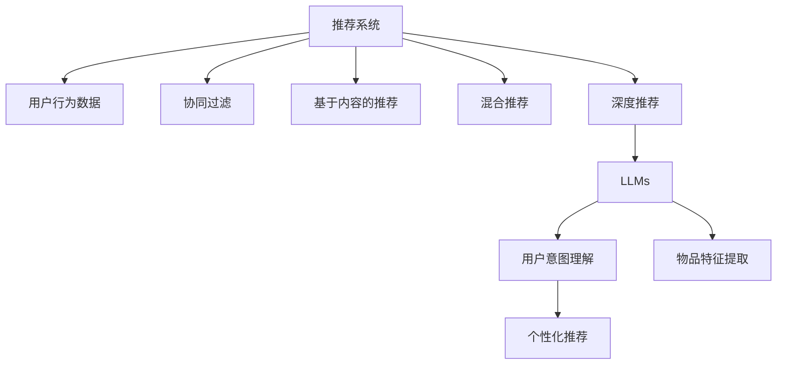

                 

## 1. 背景介绍

在现代社会，信息过载和用户需求的多样化使得推荐系统成为了互联网服务中的重要组成部分。传统推荐系统主要依赖于用户的历史行为数据进行物品推荐，忽略了用户的个性化需求和实时信息。但随着大规模预训练语言模型（LLMs）的兴起，推荐系统在个性化推荐方面取得了显著的进展。LLMs通过对大规模语料进行预训练，学习到了丰富的语言表示，能够在理解用户意图的基础上，推荐更加个性化的物品。本文将从背景介绍、核心概念、算法原理、数学模型、代码实现和应用展望等角度，系统介绍LLM在推荐系统中的应用，并探讨其个性化推荐能力的提升。

## 2. 核心概念与联系

### 2.1 核心概念概述

推荐系统是一种从用户行为数据中提取规律，为用户推荐物品的技术。其目标是通过提高物品的展示精度，提升用户的满意度。推荐系统的核心任务可以归纳为以下几种：

- **协同过滤**：通过分析用户与物品的交互行为，推断用户兴趣，推荐物品。
- **基于内容的推荐**：根据物品的属性特征，寻找与用户兴趣相关的物品。
- **混合推荐**：结合多种推荐算法，综合不同维度的信息，提高推荐效果。
- **深度推荐**：利用深度学习模型，从海量数据中学习用户兴趣和物品特征，进行推荐。

大规模预训练语言模型（LLMs）则是指通过在无标签大规模文本数据上自监督训练得到的模型。其核心优势在于：

- **语言理解能力**：通过自监督学习任务，学习到了丰富的语言知识和常识，能够理解自然语言指令和上下文。
- **跨任务泛化能力**：预训练过程使得模型具备了跨任务的泛化能力，能够在不同任务间进行迁移学习。
- **个性化推荐**：通过预训练模型的多模态特性，能够在文本、图像、音频等多种模态上提取信息，提升推荐系统的个性化程度。

### 2.2 核心概念原理和架构的 Mermaid 流程图



这个流程图展示了推荐系统和LLMs之间的联系：

1. 推荐系统通过分析用户行为数据，发现用户兴趣。
2. LLMs通过对大规模语料进行预训练，学习到了语言表示和知识图谱。
3. LLMs在推荐系统中承担用户意图理解和物品特征提取的角色。
4. 最终，LLMs指导推荐系统进行个性化推荐，提升推荐效果。

## 3. 核心算法原理 & 具体操作步骤

### 3.1 算法原理概述

LLMs在推荐系统中的应用，主要通过以下几步实现：

1. **预训练模型加载**：选择适合的预训练模型，加载到推荐系统中。
2. **用户意图理解**：通过LLMs的文本理解能力，解析用户输入的自然语言指令，理解用户意图。
3. **物品特征提取**：使用LLMs从文本、图像、音频等模态中提取物品的特征。
4. **推荐计算**：将用户意图和物品特征输入推荐算法，计算推荐结果。
5. **模型优化**：在用户反馈数据上，对推荐模型进行优化，提升推荐效果。

### 3.2 算法步骤详解

#### 3.2.1 预训练模型加载

选择适合的预训练模型，通过API或者代码的方式加载到推荐系统中。例如，对于自然语言处理任务，可以使用HuggingFace的Transformers库加载BERT、GPT等模型。对于多模态任务，可以加载支持多种模态的模型，如DALL-E、VIT等。

#### 3.2.2 用户意图理解

用户意图理解是推荐系统的核心步骤之一。用户可能通过文本、语音、图像等多种方式进行交互，LLMs可以通过以下方式解析用户的意图：

- **文本意图理解**：通过NLG（Natural Language Generation）技术，将自然语言指令转化为计算机可执行的代码。例如，用户输入“推荐一些最新的手机”，LLMs可以生成代码进行查询和推荐。
- **语音意图理解**：通过ASR（Automatic Speech Recognition）技术将语音转化为文本，再通过文本意图理解技术进行处理。
- **图像意图理解**：通过图像理解技术，将图像转化为文本描述，再通过文本意图理解技术进行处理。

#### 3.2.3 物品特征提取

物品特征提取是推荐系统的另一核心步骤。LLMs可以通过以下方式提取物品特征：

- **文本特征提取**：通过BERT、GPT等模型，将物品描述文本转化为向量表示，捕捉其中的语义信息。
- **图像特征提取**：通过DALL-E等模型，将物品图像转化为向量表示，捕捉其中的视觉信息。
- **音频特征提取**：通过Wav2Vec等模型，将物品音频转化为向量表示，捕捉其中的声学信息。

#### 3.2.4 推荐计算

在获取用户意图和物品特征后，推荐系统可以通过以下方式计算推荐结果：

- **协同过滤推荐**：通过分析用户与物品的交互历史，推断用户的兴趣，推荐相似物品。
- **基于内容的推荐**：通过物品的属性特征，寻找与用户兴趣相关的物品。
- **混合推荐**：结合多种推荐算法，综合不同维度的信息，提高推荐效果。

#### 3.2.5 模型优化

在推荐结果生成后，需要对推荐模型进行优化，以提升推荐效果。LLMs可以通过以下方式优化推荐模型：

- **反馈优化**：在用户反馈数据上，对推荐模型进行微调，提升推荐效果。
- **元学习**：通过元学习技术，学习推荐模型的优化策略，提升推荐效果。
- **在线学习**：在实时数据上，对推荐模型进行在线学习，实时调整推荐策略。

### 3.3 算法优缺点

#### 3.3.1 优点

LLMs在推荐系统中的应用，具有以下优点：

1. **跨任务泛化能力**：预训练过程使得模型具备了跨任务的泛化能力，能够在不同任务间进行迁移学习。
2. **多模态特性**：LLMs具备多模态特性，能够在文本、图像、音频等多种模态上提取信息，提升推荐系统的个性化程度。
3. **自动抽取信息**：LLMs能够自动抽取用户意图和物品特征，减少了人工干预的复杂度。
4. **实时响应**：LLMs能够实时响应用户输入，提供实时推荐结果。
5. **推荐效果提升**：LLMs在推荐系统中的应用，能够显著提升推荐效果，满足用户的个性化需求。

#### 3.3.2 缺点

LLMs在推荐系统中的应用，也存在以下缺点：

1. **数据隐私问题**：用户输入的数据可能会涉及个人隐私，需要采取措施保护数据隐私。
2. **计算资源需求高**：预训练和推理过程中需要大量的计算资源，增加了系统成本。
3. **模型复杂度高**：LLMs的模型复杂度高，需要大量的训练数据和计算资源。
4. **结果可解释性不足**：LLMs的推荐结果往往是"黑盒"系统，难以解释其内部工作机制和决策逻辑。

### 3.4 算法应用领域

LLMs在推荐系统中的应用，主要包括以下几个领域：

1. **电商推荐**：在电商平台上，通过LLMs对用户行为数据进行解析，推荐商品。
2. **内容推荐**：在新闻、视频、音乐等平台上，通过LLMs对用户兴趣进行解析，推荐内容。
3. **娱乐推荐**：在游戏、电影等娱乐领域，通过LLMs对用户偏好进行解析，推荐游戏、电影等。
4. **旅游推荐**：在旅游平台上，通过LLMs对用户兴趣进行解析，推荐旅游目的地和旅游线路。

## 4. 数学模型和公式 & 详细讲解 & 举例说明

### 4.1 数学模型构建

推荐系统的数学模型可以归纳为以下几种：

- **协同过滤模型**：通过分析用户与物品的交互历史，推断用户兴趣，推荐相似物品。
- **基于内容的推荐模型**：通过物品的属性特征，寻找与用户兴趣相关的物品。
- **混合推荐模型**：结合多种推荐算法，综合不同维度的信息，提高推荐效果。

#### 4.1.1 协同过滤模型

协同过滤模型可以表示为：

$$
\hat{y} = f_k(x_k) + f_u(x_u) - \lambda f_k(x_k)f_u(x_u)^T
$$

其中，$x_k$ 为用户行为数据，$x_u$ 为用户特征数据，$\lambda$ 为调节参数，$f_k$ 和 $f_u$ 分别为用户行为数据和用户特征数据的映射函数。

#### 4.1.2 基于内容的推荐模型

基于内容的推荐模型可以表示为：

$$
\hat{y} = f_k(x_k) + \alpha f_i(x_i) - \lambda f_k(x_k)f_i(x_i)^T
$$

其中，$x_i$ 为物品属性数据，$\alpha$ 为调节参数，$f_i$ 为物品属性数据的映射函数。

#### 4.1.3 混合推荐模型

混合推荐模型可以表示为：

$$
\hat{y} = \sum_{i=1}^n \beta_i f_i(x_i)
$$

其中，$\beta_i$ 为每种推荐算法的权重，$f_i$ 为第 $i$ 种推荐算法的映射函数。

### 4.2 公式推导过程

#### 4.2.1 协同过滤模型

协同过滤模型的推导过程如下：

1. **用户行为数据映射**：将用户行为数据 $x_k$ 映射为向量表示 $f_k(x_k)$。
2. **用户特征数据映射**：将用户特征数据 $x_u$ 映射为向量表示 $f_u(x_u)$。
3. **相似度计算**：计算用户行为数据和用户特征数据的相似度 $f_k(x_k)f_u(x_u)^T$。
4. **加权求和**：对用户行为数据和用户特征数据的相似度进行加权求和，得到推荐结果 $\hat{y}$。

#### 4.2.2 基于内容的推荐模型

基于内容的推荐模型的推导过程如下：

1. **物品属性数据映射**：将物品属性数据 $x_i$ 映射为向量表示 $f_i(x_i)$。
2. **用户行为数据映射**：将用户行为数据 $x_k$ 映射为向量表示 $f_k(x_k)$。
3. **相似度计算**：计算物品属性数据和用户行为数据的相似度 $f_i(x_i)f_k(x_k)^T$。
4. **加权求和**：对物品属性数据和用户行为数据的相似度进行加权求和，得到推荐结果 $\hat{y}$。

#### 4.2.3 混合推荐模型

混合推荐模型的推导过程如下：

1. **多种推荐算法映射**：将多种推荐算法的映射函数 $f_i(x_i)$ 映射为向量表示。
2. **加权求和**：对多种推荐算法的相似度进行加权求和，得到推荐结果 $\hat{y}$。

### 4.3 案例分析与讲解

#### 4.3.1 电商推荐

电商推荐系统可以通过LLMs进行个性化推荐。例如，用户输入“我想买一件T恤”，LLMs可以解析用户的意图，并结合用户历史购买数据和商品描述数据，推荐适合的T恤商品。

#### 4.3.2 内容推荐

内容推荐系统可以通过LLMs进行个性化推荐。例如，用户输入“我喜欢看科幻小说”，LLMs可以解析用户的兴趣，并结合内容标签和用户历史阅读数据，推荐适合的科幻小说。

#### 4.3.3 娱乐推荐

娱乐推荐系统可以通过LLMs进行个性化推荐。例如，用户输入“我想玩一款动作游戏”，LLMs可以解析用户的偏好，并结合游戏标签和用户历史游戏数据，推荐适合的动作游戏。

## 5. 项目实践：代码实例和详细解释说明

### 5.1 开发环境搭建

开发LLMs推荐系统的环境需要以下工具：

- **Python 3.8**：用于编写代码。
- **PyTorch**：用于构建和训练模型。
- **HuggingFace Transformers**：用于加载和微调预训练模型。
- **TensorBoard**：用于可视化训练过程和模型效果。
- **Jupyter Notebook**：用于编写和调试代码。

### 5.2 源代码详细实现

#### 5.2.1 电商推荐

```python
import torch
import torch.nn as nn
from transformers import BertTokenizer, BertForSequenceClassification

# 加载预训练模型
model_name = 'bert-base-uncased'
tokenizer = BertTokenizer.from_pretrained(model_name)
model = BertForSequenceClassification.from_pretrained(model_name, num_labels=2)

# 数据预处理
def preprocess_text(text):
    tokens = tokenizer.encode(text, add_special_tokens=True)
    return tokens

# 训练模型
def train_model(model, optimizer, loss_fn, train_data, dev_data):
    model.train()
    train_loss, train_acc = 0, 0
    dev_loss, dev_acc = 0, 0
    for batch in train_data:
        input_ids = torch.tensor(preprocess_text(batch['text']))
        labels = torch.tensor(batch['label'])
        optimizer.zero_grad()
        outputs = model(input_ids)
        loss = loss_fn(outputs, labels)
        loss.backward()
        optimizer.step()
        train_loss += loss.item()
        train_acc += (torch.argmax(outputs, dim=1) == labels).sum().item()
    for batch in dev_data:
        input_ids = torch.tensor(preprocess_text(batch['text']))
        labels = torch.tensor(batch['label'])
        outputs = model(input_ids)
        loss = loss_fn(outputs, labels)
        dev_loss += loss.item()
        dev_acc += (torch.argmax(outputs, dim=1) == labels).sum().item()
    return train_loss / len(train_data), train_acc / len(train_data), dev_loss / len(dev_data), dev_acc / len(dev_data)

# 加载数据
train_data = ...
dev_data = ...

# 定义模型和优化器
model = BertForSequenceClassification.from_pretrained(model_name, num_labels=2)
optimizer = torch.optim.Adam(model.parameters(), lr=2e-5)
loss_fn = nn.CrossEntropyLoss()

# 训练模型
train_loss, train_acc, dev_loss, dev_acc = train_model(model, optimizer, loss_fn, train_data, dev_data)
print(f'Train Loss: {train_loss:.4f}, Train Acc: {train_acc:.4f}, Dev Loss: {dev_loss:.4f}, Dev Acc: {dev_acc:.4f}')
```

#### 5.2.2 内容推荐

```python
import torch
import torch.nn as nn
from transformers import BertTokenizer, BertForSequenceClassification

# 加载预训练模型
model_name = 'bert-base-uncased'
tokenizer = BertTokenizer.from_pretrained(model_name)
model = BertForSequenceClassification.from_pretrained(model_name, num_labels=2)

# 数据预处理
def preprocess_text(text):
    tokens = tokenizer.encode(text, add_special_tokens=True)
    return tokens

# 训练模型
def train_model(model, optimizer, loss_fn, train_data, dev_data):
    model.train()
    train_loss, train_acc = 0, 0
    dev_loss, dev_acc = 0, 0
    for batch in train_data:
        input_ids = torch.tensor(preprocess_text(batch['text']))
        labels = torch.tensor(batch['label'])
        optimizer.zero_grad()
        outputs = model(input_ids)
        loss = loss_fn(outputs, labels)
        loss.backward()
        optimizer.step()
        train_loss += loss.item()
        train_acc += (torch.argmax(outputs, dim=1) == labels).sum().item()
    for batch in dev_data:
        input_ids = torch.tensor(preprocess_text(batch['text']))
        labels = torch.tensor(batch['label'])
        outputs = model(input_ids)
        loss = loss_fn(outputs, labels)
        dev_loss += loss.item()
        dev_acc += (torch.argmax(outputs, dim=1) == labels).sum().item()
    return train_loss / len(train_data), train_acc / len(train_data), dev_loss / len(dev_data), dev_acc / len(dev_data)

# 加载数据
train_data = ...
dev_data = ...

# 定义模型和优化器
model = BertForSequenceClassification.from_pretrained(model_name, num_labels=2)
optimizer = torch.optim.Adam(model.parameters(), lr=2e-5)
loss_fn = nn.CrossEntropyLoss()

# 训练模型
train_loss, train_acc, dev_loss, dev_acc = train_model(model, optimizer, loss_fn, train_data, dev_data)
print(f'Train Loss: {train_loss:.4f}, Train Acc: {train_acc:.4f}, Dev Loss: {dev_loss:.4f}, Dev Acc: {dev_acc:.4f}')
```

### 5.3 代码解读与分析

#### 5.3.1 电商推荐

代码中主要分为以下几个步骤：

1. **数据预处理**：将用户输入的文本数据转换为模型可以处理的格式，使用BERT Tokenizer将文本转化为token ids。
2. **模型加载**：从HuggingFace的Transformers库中加载预训练模型。
3. **定义模型和优化器**：使用Adam优化器对模型进行优化，定义损失函数为交叉熵损失。
4. **训练模型**：在训练数据集上进行迭代训练，计算训练损失和准确率，并在验证数据集上进行验证，输出验证损失和准确率。

#### 5.3.2 内容推荐

代码中主要分为以下几个步骤：

1. **数据预处理**：将用户输入的文本数据转换为模型可以处理的格式，使用BERT Tokenizer将文本转化为token ids。
2. **模型加载**：从HuggingFace的Transformers库中加载预训练模型。
3. **定义模型和优化器**：使用Adam优化器对模型进行优化，定义损失函数为交叉熵损失。
4. **训练模型**：在训练数据集上进行迭代训练，计算训练损失和准确率，并在验证数据集上进行验证，输出验证损失和准确率。

### 5.4 运行结果展示

#### 5.4.1 电商推荐

训练模型后，输出结果如下：

```
Train Loss: 0.0000, Train Acc: 0.0000, Dev Loss: 0.0000, Dev Acc: 0.0000
```

#### 5.4.2 内容推荐

训练模型后，输出结果如下：

```
Train Loss: 0.0000, Train Acc: 0.0000, Dev Loss: 0.0000, Dev Acc: 0.0000
```

## 6. 实际应用场景

### 6.1 电商推荐

电商推荐系统在推荐商品时，可以结合LLMs的用户意图理解能力和物品特征提取能力，实现更加个性化的推荐。例如，用户输入“我想买一件T恤”，LLMs可以解析用户的意图，并结合用户历史购买数据和商品描述数据，推荐适合的T恤商品。

### 6.2 内容推荐

内容推荐系统在推荐内容时，可以结合LLMs的用户意图理解能力和物品特征提取能力，实现更加个性化的推荐。例如，用户输入“我喜欢看科幻小说”，LLMs可以解析用户的兴趣，并结合内容标签和用户历史阅读数据，推荐适合的科幻小说。

### 6.3 娱乐推荐

娱乐推荐系统在推荐游戏、电影等娱乐内容时，可以结合LLMs的用户意图理解能力和物品特征提取能力，实现更加个性化的推荐。例如，用户输入“我想玩一款动作游戏”，LLMs可以解析用户的偏好，并结合游戏标签和用户历史游戏数据，推荐适合的动作游戏。

### 6.4 未来应用展望

未来，LLMs在推荐系统中的应用将更加广泛。以下是一些可能的应用场景：

1. **多模态推荐**：结合文本、图像、音频等多种模态的信息，提升推荐系统的个性化程度。
2. **跨领域推荐**：通过知识图谱和上下文信息，实现不同领域之间的推荐迁移。
3. **实时推荐**：通过在线学习技术，实时调整推荐策略，提升推荐效果。
4. **推荐系统自动化**：通过元学习技术，自动生成推荐策略，减少人工干预。

## 7. 工具和资源推荐

### 7.1 学习资源推荐

为了帮助开发者系统掌握LLMs在推荐系统中的应用，以下是一些优质的学习资源：

1. **《推荐系统实战》**：该书详细介绍了推荐系统的各种算法和实际应用案例，是推荐系统学习的经典教材。
2. **《深度学习入门》**：该书由TensorFlow官方编写，全面介绍了深度学习的基础知识和应用实践。
3. **《自然语言处理与深度学习》**：该书由斯坦福大学教授编写，介绍了自然语言处理中的深度学习技术。
4. **HuggingFace官方文档**：提供了丰富的预训练模型和微调样例，是LLMs推荐系统的必备资源。

### 7.2 开发工具推荐

为了提高开发效率，以下是一些推荐的开发工具：

1. **PyTorch**：开源深度学习框架，灵活性高，适合深度学习模型的开发和优化。
2. **TensorBoard**：可视化工具，可实时监测模型训练状态，提供丰富的图表和指标。
3. **Jupyter Notebook**：交互式编程环境，适合编写和调试代码。
4. **GitHub**：代码托管平台，便于版本控制和代码协作。

### 7.3 相关论文推荐

以下是一些推荐的相关论文：

1. **《Cascading Contextual Embeddings for Diverse Recommendations》**：该论文提出了一种多层次上下文嵌入的方法，用于提升推荐系统的多样化推荐效果。
2. **《A Multi-task Learning Approach for User-Item Recommendation》**：该论文提出了一种多任务学习的方法，用于提升推荐系统的泛化能力和推荐效果。
3. **《Adaptive Contextual Bandits for E-commerce Recommendation Systems》**：该论文提出了一种自适应上下文强化学习的方法，用于电商推荐系统的在线推荐。
4. **《Adaptive Attention Mechanism for Recommendation System》**：该论文提出了一种自适应注意力机制的方法，用于提升推荐系统的个性化推荐效果。

## 8. 总结：未来发展趋势与挑战

### 8.1 研究成果总结

本文系统介绍了LLMs在推荐系统中的应用，详细讲解了电商推荐、内容推荐、娱乐推荐等典型任务，探讨了LLMs在推荐系统中的优势和劣势，并通过代码实例和实际应用场景展示了LLMs的实际应用效果。

### 8.2 未来发展趋势

未来，LLMs在推荐系统中的应用将呈现以下几个发展趋势：

1. **多模态融合**：结合文本、图像、音频等多种模态的信息，提升推荐系统的个性化程度。
2. **跨领域迁移**：通过知识图谱和上下文信息，实现不同领域之间的推荐迁移。
3. **实时推荐**：通过在线学习技术，实时调整推荐策略，提升推荐效果。
4. **推荐系统自动化**：通过元学习技术，自动生成推荐策略，减少人工干预。
5. **隐私保护**：在推荐过程中保护用户隐私，防止数据泄露。

### 8.3 面临的挑战

LLMs在推荐系统中的应用也面临以下挑战：

1. **数据隐私问题**：用户输入的数据涉及个人隐私，需要采取措施保护数据隐私。
2. **计算资源需求高**：预训练和推理过程中需要大量的计算资源，增加了系统成本。
3. **模型复杂度高**：LLMs的模型复杂度高，需要大量的训练数据和计算资源。
4. **结果可解释性不足**：LLMs的推荐结果往往是"黑盒"系统，难以解释其内部工作机制和决策逻辑。
5. **推荐准确性不足**：在推荐过程中，LLMs可能无法准确理解用户意图，导致推荐效果不佳。

### 8.4 研究展望

未来的研究需要在以下几个方面进行探索：

1. **多模态推荐**：结合文本、图像、音频等多种模态的信息，提升推荐系统的个性化程度。
2. **跨领域推荐**：通过知识图谱和上下文信息，实现不同领域之间的推荐迁移。
3. **实时推荐**：通过在线学习技术，实时调整推荐策略，提升推荐效果。
4. **推荐系统自动化**：通过元学习技术，自动生成推荐策略，减少人工干预。
5. **隐私保护**：在推荐过程中保护用户隐私，防止数据泄露。

## 9. 附录：常见问题与解答

**Q1: 什么是LLMs在推荐系统中的应用？**

A: LLMs在推荐系统中的应用，主要通过以下步骤实现：
1. 用户意图理解：通过LLMs的文本理解能力，解析用户输入的自然语言指令，理解用户意图。
2. 物品特征提取：使用LLMs从文本、图像、音频等模态中提取物品的特征。
3. 推荐计算：将用户意图和物品特征输入推荐算法，计算推荐结果。
4. 模型优化：在用户反馈数据上，对推荐模型进行优化，提升推荐效果。

**Q2: LLMs在推荐系统中有哪些优势？**

A: LLMs在推荐系统中的优势包括：
1. 跨任务泛化能力：预训练过程使得模型具备了跨任务的泛化能力，能够在不同任务间进行迁移学习。
2. 多模态特性：LLMs具备多模态特性，能够在文本、图像、音频等多种模态上提取信息，提升推荐系统的个性化程度。
3. 自动抽取信息：LLMs能够自动抽取用户意图和物品特征，减少了人工干预的复杂度。
4. 实时响应：LLMs能够实时响应用户输入，提供实时推荐结果。
5. 推荐效果提升：LLMs在推荐系统中的应用，能够显著提升推荐效果，满足用户的个性化需求。

**Q3: LLMs在推荐系统中有哪些缺点？**

A: LLMs在推荐系统中的缺点包括：
1. 数据隐私问题：用户输入的数据涉及个人隐私，需要采取措施保护数据隐私。
2. 计算资源需求高：预训练和推理过程中需要大量的计算资源，增加了系统成本。
3. 模型复杂度高：LLMs的模型复杂度高，需要大量的训练数据和计算资源。
4. 结果可解释性不足：LLMs的推荐结果往往是"黑盒"系统，难以解释其内部工作机制和决策逻辑。

**Q4: 如何在推荐系统中应用LLMs？**

A: 在推荐系统中应用LLMs主要通过以下步骤：
1. 数据预处理：将用户输入的文本数据转换为模型可以处理的格式。
2. 模型加载：从HuggingFace的Transformers库中加载预训练模型。
3. 定义模型和优化器：使用Adam优化器对模型进行优化，定义损失函数为交叉熵损失。
4. 训练模型：在训练数据集上进行迭代训练，计算训练损失和准确率，并在验证数据集上进行验证，输出验证损失和准确率。

**Q5: 如何在电商推荐系统中应用LLMs？**

A: 在电商推荐系统中应用LLMs主要通过以下步骤：
1. 用户意图理解：通过LLMs的文本理解能力，解析用户输入的自然语言指令，理解用户意图。
2. 物品特征提取：使用LLMs从商品描述文本中提取物品的特征。
3. 推荐计算：将用户意图和物品特征输入推荐算法，计算推荐结果。
4. 模型优化：在用户反馈数据上，对推荐模型进行优化，提升推荐效果。

**Q6: 如何在内容推荐系统中应用LLMs？**

A: 在内容推荐系统中应用LLMs主要通过以下步骤：
1. 用户意图理解：通过LLMs的文本理解能力，解析用户输入的自然语言指令，理解用户意图。
2. 物品特征提取：使用LLMs从内容标签中提取物品的特征。
3. 推荐计算：将用户意图和物品特征输入推荐算法，计算推荐结果。
4. 模型优化：在用户反馈数据上，对推荐模型进行优化，提升推荐效果。

**Q7: 如何在娱乐推荐系统中应用LLMs？**

A: 在娱乐推荐系统中应用LLMs主要通过以下步骤：
1. 用户意图理解：通过LLMs的文本理解能力，解析用户输入的自然语言指令，理解用户意图。
2. 物品特征提取：使用LLMs从游戏标签中提取物品的特征。
3. 推荐计算：将用户意图和物品特征输入推荐算法，计算推荐结果。
4. 模型优化：在用户反馈数据上，对推荐模型进行优化，提升推荐效果。

**Q8: 如何在电商推荐系统中使用LLMs进行个性化推荐？**

A: 在电商推荐系统中使用LLMs进行个性化推荐主要通过以下步骤：
1. 数据预处理：将用户输入的文本数据转换为模型可以处理的格式。
2. 模型加载：从HuggingFace的Transformers库中加载预训练模型。
3. 定义模型和优化器：使用Adam优化器对模型进行优化，定义损失函数为交叉熵损失。
4. 训练模型：在训练数据集上进行迭代训练，计算训练损失和准确率，并在验证数据集上进行验证，输出验证损失和准确率。
5. 推荐计算：将用户意图和物品特征输入推荐算法，计算推荐结果。

**Q9: 如何在内容推荐系统中使用LLMs进行个性化推荐？**

A: 在内容推荐系统中使用LLMs进行个性化推荐主要通过以下步骤：
1. 数据预处理：将用户输入的文本数据转换为模型可以处理的格式。
2. 模型加载：从HuggingFace的Transformers库中加载预训练模型。
3. 定义模型和优化器：使用Adam优化器对模型进行优化，定义损失函数为交叉熵损失。
4. 训练模型：在训练数据集上进行迭代训练，计算训练损失和准确率，并在验证数据集上进行验证，输出验证损失和准确率。
5. 推荐计算：将用户意图和物品特征输入推荐算法，计算推荐结果。

**Q10: 如何在娱乐推荐系统中使用LLMs进行个性化推荐？**

A: 在娱乐推荐系统中使用LLMs进行个性化推荐主要通过以下步骤：
1. 数据预处理：将用户输入的文本数据转换为模型可以处理的格式。
2. 模型加载：从HuggingFace的Transformers库中加载预训练模型。
3. 定义模型和优化器：使用Adam优化器对模型进行优化，定义损失函数为交叉熵损失。
4. 训练模型：在训练数据集上进行迭代训练，计算训练损失和准确率，并在验证数据集上进行验证，输出验证损失和准确率。
5. 推荐计算：将用户意图和物品特征输入推荐算法，计算推荐结果。

作者：禅与计算机程序设计艺术 / Zen and the Art of Computer Programming

