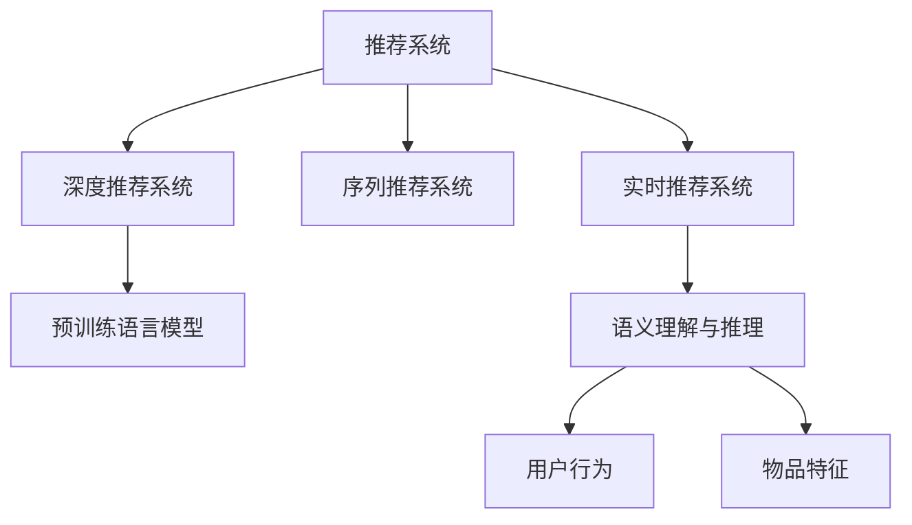

                 

# LLM对推荐系统实时个性化的影响

## 1. 背景介绍

推荐系统在现代互联网应用中无处不在，从电商的购物推荐、社交网络的动态推送、视频平台的个性化播放列表，到新闻网站的订阅服务，推荐算法已成为提升用户体验、优化业务转化的重要工具。然而，传统推荐系统通常采用静态模型，无法实时响应用户行为变化，难以实现真正的个性化推荐。

随着深度学习和大规模预训练语言模型(LLM)的兴起，推荐系统迎来了新的技术范式。LLM通过自监督学习，掌握了丰富的语言知识和理解能力，能够更加智能地适应用户的动态需求，提升推荐系统的实时个性化能力。本文将系统探讨LLM在推荐系统中的应用，深入分析其对实时个性化的影响，展望未来发展趋势。

## 2. 核心概念与联系

### 2.1 核心概念概述

为更好地理解LLM在推荐系统中的应用，本节将介绍几个核心概念：

- 推荐系统(Recommender System)：通过分析用户历史行为和兴趣，推荐可能感兴趣的商品、内容或服务。推荐系统的核心目标是提升用户体验，提升业务转化率。

- 深度推荐系统(Deep Recommender System)：利用深度学习技术，通过大量用户行为数据和物品特征进行推荐。相对于传统推荐算法，深度推荐系统能够更好地捕捉用户和物品之间的复杂关系。

- 预训练语言模型(Pre-trained Language Model)：通过在大规模文本数据上进行自监督学习，获得语言知识和表示能力的大规模模型。如BERT、GPT-3等。

- 序列推荐系统(Sequential Recommender System)：将推荐过程看作一个序列生成问题，通过历史行为序列预测下一个行为。序列推荐系统能够更好地利用时间序列信息，提升推荐准确性。

- 实时推荐系统(Real-time Recommender System)：在用户点击、购买等行为发生时，即时响应并推荐相关信息。实时推荐系统能够更高效地捕捉用户实时兴趣变化，提升用户体验。

- 语义理解与推理：利用LLM的语言理解与推理能力，更好地捕捉用户意图和物品描述，提升推荐系统的理解和生成能力。

这些核心概念之间的逻辑关系可以通过以下Mermaid流程图来展示：



这个流程图展示了推荐系统的主要组成部分及其相互关系：

1. 推荐系统采用深度推荐技术，利用大量用户行为数据和物品特征进行推荐。
2. 深度推荐系统通常使用预训练语言模型作为特征提取器，提升模型的语义理解能力。
3. 实时推荐系统利用用户行为序列进行预测，捕捉用户兴趣的变化。
4. 语义理解与推理利用LLM的语言处理能力，提升推荐系统对用户意图和物品描述的理解和生成。

通过理解这些核心概念，我们可以更好地把握LLM在推荐系统中的应用及其对实时个性化推荐的影响。

## 3. 核心算法原理 & 具体操作步骤

### 3.1 算法原理概述

LLM在推荐系统中的应用主要体现在两个方面：

1. 作为特征提取器。利用预训练语言模型对用户行为和物品描述进行语义理解，提取高层次的语义特征，提升推荐系统的语义表达能力。
2. 作为用户模型。根据用户的历史行为和实时输入，利用LLM生成个性化的推荐内容，实现实时动态推荐。

形式化地，假设用户历史行为序列为 $H=\{x_1, x_2, \ldots, x_t\}$，物品特征向量为 $F$，模型为 $M$，推荐结果为 $R$。则推荐过程可以表示为：

$$
R = M(H, F)
$$

其中 $M$ 为深度推荐模型，可以采用MLP、RNN、LSTM等神经网络结构。用户历史行为序列 $H$ 和物品特征 $F$ 通常需要进行嵌入处理，转换为向量形式。

### 3.2 算法步骤详解

基于LLM的推荐系统一般包括以下几个关键步骤：

**Step 1: 数据预处理**
- 收集用户的历史行为数据和物品特征数据，构建训练集。
- 将用户行为序列和物品特征向量转换为向量表示，通常使用词向量嵌入、BERT等预训练模型进行表示。

**Step 2: 预训练语言模型选择**
- 选择合适的预训练语言模型 $M_{\theta}$，作为特征提取器。如BERT、GPT等。
- 在用户历史行为和物品特征数据上，使用预训练语言模型进行微调，使其适应推荐任务。

**Step 3: 推荐模型构建**
- 设计推荐模型 $M$，通常采用深度神经网络结构。
- 将预训练语言模型 $M_{\theta}$ 作为推荐模型 $M$ 的一部分，嵌入模型的输入层或中间层。

**Step 4: 实时推荐**
- 在用户点击、购买等行为发生时，即时响应并生成个性化推荐。
- 利用实时输入（如用户输入的查询、点击流等），通过预训练语言模型 $M_{\theta}$ 生成推荐结果。
- 将推荐结果输入推荐模型 $M$，生成最终的推荐列表。

**Step 5: 效果评估与优化**
- 在推荐结果上，使用A/B测试、点击率、转化率等指标进行效果评估。
- 根据评估结果，调整预训练语言模型的微调参数和推荐模型的超参数，进一步提升推荐效果。

### 3.3 算法优缺点

利用LLM进行推荐系统微调的方法具有以下优点：

1. 提升推荐准确性。预训练语言模型能够更好地捕捉用户行为和物品描述的语义信息，提升推荐模型的表达能力。
2. 增强推荐实时性。通过LLM的语义理解能力，能够实时响应用户行为变化，提升推荐系统的动态能力。
3. 支持多模态数据融合。LLM可以处理文本、图像、语音等多模态数据，支持更丰富、全面的推荐特征提取。
4. 降低推荐系统开发成本。利用已有的大规模预训练模型，可以显著降低推荐系统开发所需的数据和计算资源。

然而，该方法也存在一些局限性：

1. 对标注数据依赖。虽然利用预训练模型可以降低对标注数据的依赖，但仍然需要收集一定量的用户行为数据和物品特征数据，作为微调的基础。
2. 模型复杂度高。预训练语言模型通常参数量较大，增加了推荐模型的计算复杂度和内存消耗。
3. 需要较高技术门槛。推荐系统的开发和维护需要深度学习和自然语言处理的专业知识，开发门槛较高。
4. 用户隐私保护。在实时推荐中，需要处理用户的实时输入和行为数据，需要加强数据隐私保护和模型公平性设计。

尽管存在这些局限性，但就目前而言，利用LLM进行推荐系统微调的方法仍是提升推荐系统性能的重要手段。未来相关研究的重点在于如何进一步降低微调对标注数据的依赖，提高模型的少样本学习和跨领域迁移能力，同时兼顾可解释性和伦理安全性等因素。

### 3.4 算法应用领域

利用LLM进行推荐系统微调的方法已经在电商、视频、音乐、新闻等多个领域得到了广泛应用，取得了显著的性能提升。例如：

- 电商推荐：利用用户浏览、点击、购买等行为数据，结合物品描述，通过BERT等模型进行推荐。
- 视频推荐：利用用户观看行为、搜索历史等数据，结合视频元数据，通过GPT等模型进行推荐。
- 音乐推荐：利用用户听歌行为、歌单记录等数据，结合歌曲歌词、歌手信息等，通过BERT等模型进行推荐。
- 新闻推荐：利用用户阅读行为、收藏记录等数据，结合新闻标题、摘要等，通过BERT等模型进行推荐。

除了上述这些经典应用外，利用LLM进行推荐系统微调的方法还被创新性地应用到更多场景中，如可控内容推荐、情感化推荐、交叉推荐等，为推荐系统带来了全新的突破。随着预训练模型和微调方法的不断进步，相信推荐系统必将在更多领域大放异彩。

## 4. 数学模型和公式 & 详细讲解 & 举例说明

### 4.1 数学模型构建

为了更好地理解基于LLM的推荐系统，我们将其数学模型形式化表达如下：

**用户行为嵌入**：设用户历史行为序列为 $H=\{x_1, x_2, \ldots, x_t\}$，其中 $x_i$ 为第 $i$ 个行为。通常 $x_i$ 需要转换为向量形式，表示为 $h_i$。

**物品特征嵌入**：设物品特征向量为 $F$，表示为 $f$。

**预训练语言模型**：设预训练语言模型 $M_{\theta}$ 对行为序列和物品特征进行嵌入处理，得到向量表示 $h'_i$ 和 $f'$。

**推荐模型**：设推荐模型 $M$ 采用深度神经网络结构，对嵌入后的行为和物品特征进行组合预测，得到推荐结果 $r$。

**推荐结果**：设最终推荐结果为 $R$，表示为 $r'$。

### 4.2 公式推导过程

将上述各个环节的公式整合起来，得到完整的推荐过程：

$$
R = M(h'_i \oplus f')
$$

其中 $\oplus$ 表示向量拼接或连接操作，$h'_i = M_{\theta}(h_i)$，$f' = M_{\theta}(f)$。推荐模型 $M$ 通常采用多层神经网络结构，其中每一层可以引入非线性激活函数，提升模型的表达能力。

以简单的MLP网络为例，假设行为嵌入为 $h'_i \in \mathbb{R}^d$，物品特征嵌入为 $f' \in \mathbb{R}^d$，推荐模型的中间层输出为 $z \in \mathbb{R}^d$，输出层为 $r \in \mathbb{R}^k$。则推荐模型可以表示为：

$$
z = \sigma(\mathbf{W}_1 h'_i + \mathbf{b}_1) + \sigma(\mathbf{W}_2 f')
$$

$$
r = \mathbf{W}_k z + \mathbf{b}_k
$$

其中 $\sigma$ 表示激活函数，$\mathbf{W}$ 和 $\mathbf{b}$ 表示网络参数。

### 4.3 案例分析与讲解

以视频推荐为例，分析利用BERT等预训练模型进行推荐系统微调的过程。

假设视频推荐系统需要根据用户观看行为和视频描述进行推荐，数据集为 $\{(x_i, y_i)\}_{i=1}^N$，其中 $x_i$ 为视频描述，$y_i$ 为标签（1表示推荐，0表示不推荐）。

**Step 1: 数据预处理**
- 收集用户观看视频的行为数据，如观看时间、评分等，构成行为序列。
- 收集视频元数据，如标题、摘要、标签等，表示为 $f$。
- 使用BERT等预训练模型对行为序列 $H$ 和物品特征 $F$ 进行嵌入处理，得到向量表示 $h'_i$ 和 $f'$。

**Step 2: 预训练语言模型选择**
- 选择合适的预训练语言模型 $M_{\theta}$，如BERT、GPT等。
- 在用户行为数据和物品特征数据上，对 $M_{\theta}$ 进行微调，使其适应视频推荐任务。

**Step 3: 推荐模型构建**
- 设计推荐模型 $M$，通常采用深度神经网络结构。
- 将预训练语言模型 $M_{\theta}$ 作为推荐模型 $M$ 的一部分，嵌入模型的输入层或中间层。
- 假设推荐模型 $M$ 采用MLP结构，参数为 $\mathbf{W}$ 和 $\mathbf{b}$。

**Step 4: 实时推荐**
- 在用户观看行为发生时，即时响应并生成个性化推荐。
- 利用实时输入（如用户观看视频的时间、评分等），通过预训练语言模型 $M_{\theta}$ 生成推荐结果。
- 将推荐结果 $r$ 输入推荐模型 $M$，生成最终的推荐列表 $R$。

**Step 5: 效果评估与优化**
- 在推荐结果上，使用A/B测试、点击率、转化率等指标进行效果评估。
- 根据评估结果，调整预训练语言模型的微调参数和推荐模型的超参数，进一步提升推荐效果。

## 5. 项目实践：代码实例和详细解释说明

### 5.1 开发环境搭建

在进行推荐系统微调实践前，我们需要准备好开发环境。以下是使用Python进行PyTorch开发的环境配置流程：

1. 安装Anaconda：从官网下载并安装Anaconda，用于创建独立的Python环境。

2. 创建并激活虚拟环境：
```bash
conda create -n pytorch-env python=3.8 
conda activate pytorch-env
```

3. 安装PyTorch：根据CUDA版本，从官网获取对应的安装命令。例如：
```bash
conda install pytorch torchvision torchaudio cudatoolkit=11.1 -c pytorch -c conda-forge
```

4. 安装Transformers库：
```bash
pip install transformers
```

5. 安装各类工具包：
```bash
pip install numpy pandas scikit-learn matplotlib tqdm jupyter notebook ipython
```

完成上述步骤后，即可在`pytorch-env`环境中开始推荐系统微调实践。

### 5.2 源代码详细实现

下面我们以视频推荐为例，给出使用Transformers库对BERT模型进行推荐系统微调的PyTorch代码实现。

首先，定义推荐系统的数据处理函数：

```python
from transformers import BertTokenizer
from torch.utils.data import Dataset
import torch

class VideoDataset(Dataset):
    def __init__(self, texts, labels, tokenizer, max_len=128):
        self.texts = texts
        self.labels = labels
        self.tokenizer = tokenizer
        self.max_len = max_len
        
    def __len__(self):
        return len(self.texts)
    
    def __getitem__(self, item):
        text = self.texts[item]
        label = self.labels[item]
        
        encoding = self.tokenizer(text, return_tensors='pt', max_length=self.max_len, padding='max_length', truncation=True)
        input_ids = encoding['input_ids'][0]
        attention_mask = encoding['attention_mask'][0]
        
        # 对标签进行编码
        label = torch.tensor(label, dtype=torch.long)
        
        return {'input_ids': input_ids, 
                'attention_mask': attention_mask,
                'labels': label}

# 标签与id的映射
label2id = {0: 'not_recommend', 1: 'recommend'}
id2label = {v: k for k, v in label2id.items()}

# 创建dataset
tokenizer = BertTokenizer.from_pretrained('bert-base-cased')

train_dataset = VideoDataset(train_texts, train_labels, tokenizer)
dev_dataset = VideoDataset(dev_texts, dev_labels, tokenizer)
test_dataset = VideoDataset(test_texts, test_labels, tokenizer)
```

然后，定义模型和优化器：

```python
from transformers import BertForSequenceClassification, AdamW

model = BertForSequenceClassification.from_pretrained('bert-base-cased', num_labels=2)

optimizer = AdamW(model.parameters(), lr=2e-5)
```

接着，定义训练和评估函数：

```python
from torch.utils.data import DataLoader
from tqdm import tqdm
from sklearn.metrics import classification_report

device = torch.device('cuda') if torch.cuda.is_available() else torch.device('cpu')
model.to(device)

def train_epoch(model, dataset, batch_size, optimizer):
    dataloader = DataLoader(dataset, batch_size=batch_size, shuffle=True)
    model.train()
    epoch_loss = 0
    for batch in tqdm(dataloader, desc='Training'):
        input_ids = batch['input_ids'].to(device)
        attention_mask = batch['attention_mask'].to(device)
        labels = batch['labels'].to(device)
        model.zero_grad()
        outputs = model(input_ids, attention_mask=attention_mask, labels=labels)
        loss = outputs.loss
        epoch_loss += loss.item()
        loss.backward()
        optimizer.step()
    return epoch_loss / len(dataloader)

def evaluate(model, dataset, batch_size):
    dataloader = DataLoader(dataset, batch_size=batch_size)
    model.eval()
    preds, labels = [], []
    with torch.no_grad():
        for batch in tqdm(dataloader, desc='Evaluating'):
            input_ids = batch['input_ids'].to(device)
            attention_mask = batch['attention_mask'].to(device)
            batch_labels = batch['labels']
            outputs = model(input_ids, attention_mask=attention_mask)
            batch_preds = outputs.logits.argmax(dim=2).to('cpu').tolist()
            batch_labels = batch_labels.to('cpu').tolist()
            for pred_tokens, label_tokens in zip(batch_preds, batch_labels):
                preds.append(pred_tokens[:len(label_tokens)])
                labels.append(label_tokens)
                
    print(classification_report(labels, preds))
```

最后，启动训练流程并在测试集上评估：

```python
epochs = 5
batch_size = 16

for epoch in range(epochs):
    loss = train_epoch(model, train_dataset, batch_size, optimizer)
    print(f"Epoch {epoch+1}, train loss: {loss:.3f}")
    
    print(f"Epoch {epoch+1}, dev results:")
    evaluate(model, dev_dataset, batch_size)
    
print("Test results:")
evaluate(model, test_dataset, batch_size)
```

以上就是使用PyTorch对BERT进行视频推荐系统微调的完整代码实现。可以看到，得益于Transformers库的强大封装，我们可以用相对简洁的代码完成BERT模型的加载和微调。

### 5.3 代码解读与分析

让我们再详细解读一下关键代码的实现细节：

**VideoDataset类**：
- `__init__`方法：初始化视频描述、标签、分词器等关键组件。
- `__len__`方法：返回数据集的样本数量。
- `__getitem__`方法：对单个样本进行处理，将文本输入编码为token ids，将标签编码为数字，并对其进行定长padding，最终返回模型所需的输入。

**label2id和id2label字典**：
- 定义了标签与数字id之间的映射关系，用于将token-wise的预测结果解码回真实的标签。

**训练和评估函数**：
- 使用PyTorch的DataLoader对数据集进行批次化加载，供模型训练和推理使用。
- 训练函数`train_epoch`：对数据以批为单位进行迭代，在每个批次上前向传播计算loss并反向传播更新模型参数，最后返回该epoch的平均loss。
- 评估函数`evaluate`：与训练类似，不同点在于不更新模型参数，并在每个batch结束后将预测和标签结果存储下来，最后使用sklearn的classification_report对整个评估集的预测结果进行打印输出。

**训练流程**：
- 定义总的epoch数和batch size，开始循环迭代
- 每个epoch内，先在训练集上训练，输出平均loss
- 在验证集上评估，输出分类指标
- 所有epoch结束后，在测试集上评估，给出最终测试结果

可以看到，PyTorch配合Transformers库使得BERT微调的代码实现变得简洁高效。开发者可以将更多精力放在数据处理、模型改进等高层逻辑上，而不必过多关注底层的实现细节。

当然，工业级的系统实现还需考虑更多因素，如模型的保存和部署、超参数的自动搜索、更灵活的任务适配层等。但核心的微调范式基本与此类似。

## 6. 实际应用场景
### 6.1 智能视频推荐

基于大语言模型微调的推荐系统，可以广泛应用于智能视频推荐系统的构建。传统视频推荐往往需要大量人工标注，推荐效果难以保证。而利用微调后的视频推荐模型，可以自动学习用户对视频的兴趣偏好，提升推荐精度。

在技术实现上，可以收集用户观看行为、评分、评论等数据，构建监督数据集。利用BERT等预训练语言模型进行微调，使其适应视频推荐任务。微调后的模型能够自动判断用户对视频内容的好恶，生成个性化的推荐列表。对于新视频，可以利用检索系统实时获取相关内容，动态生成推荐结果。如此构建的智能视频推荐系统，能大幅提升用户的观看体验和平台的用户黏性。

### 6.2 智能电商推荐

电商推荐系统是推荐系统的重要应用之一，通过推荐系统，电商平台可以提升用户的购买体验和平台转化率。利用微调后的电商推荐模型，可以自动学习用户对商品的兴趣偏好，提升推荐精准度。

在技术实现上，可以收集用户浏览、点击、购买等行为数据，结合商品标题、描述、图片等特征，构建监督数据集。利用BERT等预训练语言模型进行微调，使其适应电商推荐任务。微调后的模型能够自动理解用户的购买意图，生成个性化的推荐商品。对于用户浏览过的商品，可以加入实时搜索模块，动态生成推荐结果。如此构建的智能电商推荐系统，能显著提升用户的购买决策效率和平台转化率。

### 6.3 智能音乐推荐

音乐推荐系统在流媒体平台上应用广泛，通过推荐系统，音乐平台可以提升用户的听歌体验和平台留存率。利用微调后的音乐推荐模型，可以自动学习用户对歌曲的兴趣偏好，提升推荐准确度。

在技术实现上，可以收集用户听歌行为、评分、收藏等数据，结合歌曲标题、歌词、歌手等特征，构建监督数据集。利用BERT等预训练语言模型进行微调，使其适应音乐推荐任务。微调后的模型能够自动理解用户的听歌偏好，生成个性化的推荐曲目。对于新歌曲，可以加入实时搜索模块，动态生成推荐结果。如此构建的智能音乐推荐系统，能显著提升用户的听歌体验和平台留存率。

### 6.4 未来应用展望

随着大语言模型和微调方法的不断发展，基于微调范式将在更多领域得到应用，为传统行业带来变革性影响。

在智慧医疗领域，基于微调的推荐系统可以推荐医生、药品、诊断设备等信息，辅助医生进行决策，提升医疗服务的效率和质量。

在智能教育领域，利用微调技术进行推荐，可以推荐个性化的学习资源、教学视频等，因材施教，提升教育公平和教学效果。

在智能城市治理中，利用微调技术进行推荐，可以推荐出行路线、公共服务等信息，提升城市管理智能化水平。

此外，在企业生产、社会治理、文娱传媒等众多领域，基于大语言模型微调的人工智能推荐系统也将不断涌现，为各行各业带来新的增长点。

## 7. 工具和资源推荐
### 7.1 学习资源推荐

为了帮助开发者系统掌握基于大语言模型的推荐系统理论基础和实践技巧，这里推荐一些优质的学习资源：

1. 《深度学习与推荐系统》书籍：全面介绍推荐系统理论和深度学习技术，涵盖用户行为分析、推荐模型设计、评估指标等。

2. 《自然语言处理与深度学习》课程：斯坦福大学开设的NLP明星课程，涵盖推荐系统、深度学习、预训练模型等内容。

3. 《Transformers in NLP》书籍：介绍Transformers库在大规模预训练模型中的应用，包括推荐系统、微调技术等。

4. HuggingFace官方文档：Transformer库的官方文档，提供了海量预训练模型和完整的推荐系统微调样例代码，是上手实践的必备资料。

5. Kaggle推荐系统竞赛：参加Kaggle等在线竞赛，通过实战练习推荐系统算法，提升实战能力。

通过对这些资源的学习实践，相信你一定能够快速掌握基于大语言模型的推荐系统微调技术，并用于解决实际的推荐问题。

### 7.2 开发工具推荐

高效的开发离不开优秀的工具支持。以下是几款用于推荐系统微调开发的常用工具：

1. PyTorch：基于Python的开源深度学习框架，灵活动态的计算图，适合快速迭代研究。大部分预训练语言模型都有PyTorch版本的实现。

2. TensorFlow：由Google主导开发的开源深度学习框架，生产部署方便，适合大规模工程应用。同样有丰富的预训练语言模型资源。

3. Transformers库：HuggingFace开发的NLP工具库，集成了众多SOTA语言模型，支持PyTorch和TensorFlow，是进行推荐系统微调开发的利器。

4. Weights & Biases：模型训练的实验跟踪工具，可以记录和可视化模型训练过程中的各项指标，方便对比和调优。与主流深度学习框架无缝集成。

5. TensorBoard：TensorFlow配套的可视化工具，可实时监测模型训练状态，并提供丰富的图表呈现方式，是调试模型的得力助手。

6. Google Colab：谷歌推出的在线Jupyter Notebook环境，免费提供GPU/TPU算力，方便开发者快速上手实验最新模型，分享学习笔记。

合理利用这些工具，可以显著提升推荐系统微调任务的开发效率，加快创新迭代的步伐。

### 7.3 相关论文推荐

推荐系统领域的研究十分活跃，以下是几篇奠基性的相关论文，推荐阅读：

1. Deep Graph-based Recommendation（JSDA）：提出基于图结构的深度推荐方法，构建用户-物品-内容的三维关系，提升推荐系统效果。

2. Factorization Machines for Adaptive Hyper-Parameters: A Trainer’s Guide（FTRL）：提出高效的推荐模型训练器，支持大规模数据和高维特征，提升推荐系统性能。

3. Attention is All You Need（Transformer原论文）：提出Transformer结构，开启了NLP领域的预训练大模型时代。

4. A Neural Attention-based Recommender System（NARS）：提出基于注意力机制的推荐模型，提升推荐系统对用户和物品之间复杂关系的建模能力。

5. Neural Collaborative Filtering（NCF）：提出基于深度神经网络的协同过滤模型，提升推荐系统对用户兴趣的建模能力。

6. SimClick: Simulating Click Streams with Few Observations（SimCLICK）：提出基于模拟点击流的推荐方法，提升推荐系统对用户点击行为的建模能力。

这些论文代表了大语言模型微调技术的发展脉络。通过学习这些前沿成果，可以帮助研究者把握学科前进方向，激发更多的创新灵感。

## 8. 总结：未来发展趋势与挑战

### 8.1 总结

本文对基于大语言模型的推荐系统微调方法进行了全面系统的介绍。首先阐述了推荐系统和大语言模型的研究背景和意义，明确了微调在提升推荐系统性能方面的独特价值。其次，从原理到实践，详细讲解了微调过程的数学模型和关键步骤，给出了微调任务开发的完整代码实例。同时，本文还广泛探讨了微调方法在智能视频、电商、音乐等多个行业领域的应用前景，展示了微调范式的巨大潜力。此外，本文精选了微调技术的各类学习资源，力求为读者提供全方位的技术指引。

通过本文的系统梳理，可以看到，基于大语言模型的微调方法正在成为推荐系统的重要范式，极大地拓展了预训练语言模型的应用边界，催生了更多的落地场景。受益于大规模语料的预训练，微调模型以更低的时间和标注成本，在小样本条件下也能取得不俗的效果，有力推动了推荐系统的产业化进程。未来，伴随预训练语言模型和微调方法的持续演进，相信推荐系统必将在更多领域大放异彩，深刻影响人类的生产生活方式。

### 8.2 未来发展趋势

展望未来，大语言模型微调技术将呈现以下几个发展趋势：

1. 推荐模型的多样化。除了传统的基于神经网络的推荐模型外，未来会涌现更多基于大语言模型的推荐方法，如基于 Prompt 的推荐、基于知识图谱的推荐等，提升推荐系统的灵活性和多样性。

2. 跨领域推荐技术的发展。随着多模态数据的整合和跨领域推荐模型的研究，推荐系统将能够更好地融合不同类型的信息，提升推荐系统的泛化能力和鲁棒性。

3. 实时推荐系统的发展。随着深度学习和大规模预训练模型的应用，推荐系统将具备更强的实时性，能够更高效地响应用户行为变化，提升推荐系统的动态能力。

4. 推荐系统的个性化。基于大语言模型的推荐系统将能够更好地捕捉用户兴趣和行为的多样性和复杂性，实现更精准的个性化推荐。

5. 推荐系统的可解释性和透明性。随着推荐系统的不断发展，可解释性和透明性将成为用户信任和接受的重要因素。未来的推荐系统将更好地利用大语言模型的语义理解能力，提升推荐结果的可解释性和用户接受度。

6. 推荐系统的公平性和偏见。推荐系统需要兼顾公平性和偏见问题，避免因用户历史行为而产生歧视和偏见。未来的推荐系统将更好地利用大语言模型的公平性分析能力，构建更公平的推荐系统。

以上趋势凸显了大语言模型微调技术的广阔前景。这些方向的探索发展，必将进一步提升推荐系统的性能和应用范围，为人类认知智能的进化带来深远影响。

### 8.3 面临的挑战

尽管大语言模型微调技术已经取得了瞩目成就，但在迈向更加智能化、普适化应用的过程中，它仍面临着诸多挑战：

1. 标注数据不足。尽管利用预训练模型可以降低对标注数据的依赖，但推荐系统仍然需要收集一定量的用户行为数据和物品特征数据，作为微调的基础。如何进一步降低微调对标注样本的依赖，将是一大难题。

2. 推荐系统复杂度高。预训练语言模型通常参数量较大，增加了推荐系统的计算复杂度和内存消耗。如何在保证性能的同时，减小模型规模，提升计算效率，将是重要的优化方向。

3. 数据隐私保护。在实时推荐中，需要处理用户的实时输入和行为数据，需要加强数据隐私保护和模型公平性设计。如何在隐私保护和推荐效果之间取得平衡，将是重要的研究方向。

4. 模型可解释性不足。当前微调模型更像是"黑盒"系统，难以解释其内部工作机制和决策逻辑。如何赋予推荐系统更强的可解释性，将是亟待攻克的难题。

5. 推荐系统鲁棒性不足。预训练语言模型面对域外数据时，泛化性能往往大打折扣。如何在保证微调效果的同时，提升模型的鲁棒性，避免灾难性遗忘，还需要更多理论和实践的积累。

尽管存在这些挑战，但就目前而言，利用大语言模型进行推荐系统微调的方法仍是提升推荐系统性能的重要手段。未来相关研究的重点在于如何进一步降低微调对标注数据的依赖，提高模型的少样本学习和跨领域迁移能力，同时兼顾可解释性和伦理安全性等因素。

### 8.4 研究展望

面对大语言模型微调所面临的种种挑战，未来的研究需要在以下几个方面寻求新的突破：

1. 探索无监督和半监督微调方法。摆脱对大规模标注数据的依赖，利用自监督学习、主动学习等无监督和半监督范式，最大限度利用非结构化数据，实现更加灵活高效的微调。

2. 研究参数高效和计算高效的微调范式。开发更加参数高效的微调方法，在固定大部分预训练参数的同时，只更新极少量的任务相关参数。同时优化微调模型的计算图，减少前向传播和反向传播的资源消耗，实现更加轻量级、实时性的部署。

3. 引入更多先验知识。将符号化的先验知识，如知识图谱、逻辑规则等，与神经网络模型进行巧妙融合，引导微调过程学习更准确、合理的推荐模型。同时加强不同模态数据的整合，实现视觉、语音等多模态信息与文本信息的协同建模。

4. 结合因果分析和博弈论工具。将因果分析方法引入微调模型，识别出推荐系统决策的关键特征，增强推荐结果的因果性和逻辑性。借助博弈论工具刻画人机交互过程，主动探索并规避推荐系统的脆弱点，提高系统稳定性。

5. 纳入伦理道德约束。在推荐系统设计中引入伦理导向的评估指标，过滤和惩罚有偏见、有害的输出倾向。同时加强人工干预和审核，建立推荐系统的监管机制，确保输出符合人类价值观和伦理道德。

这些研究方向的探索，必将引领大语言模型微调技术迈向更高的台阶，为构建安全、可靠、可解释、可控的智能推荐系统铺平道路。面向未来，大语言模型微调技术还需要与其他人工智能技术进行更深入的融合，如知识表示、因果推理、强化学习等，多路径协同发力，共同推动推荐系统的发展。只有勇于创新、敢于突破，才能不断拓展语言模型的边界，让智能技术更好地造福人类社会。

## 9. 附录：常见问题与解答

**Q1：大语言模型微调是否适用于所有推荐系统？**

A: 大语言模型微调在大多数推荐系统上都能取得不错的效果，特别是对于数据量较小的任务。但对于一些特定领域的推荐系统，如医学、法律等，仅仅依靠通用语料预训练的模型可能难以很好地适应。此时需要在特定领域语料上进一步预训练，再进行微调，才能获得理想效果。此外，对于一些需要时效性、个性化很强的任务，如对话、推荐等，微调方法也需要针对性的改进优化。

**Q2：微调过程中如何选择合适的学习率？**

A: 微调的学习率一般要比预训练时小1-2个数量级，如果使用过大的学习率，容易破坏预训练权重，导致过拟合。一般建议从1e-5开始调参，逐步减小学习率，直至收敛。也可以使用warmup策略，在开始阶段使用较小的学习率，再逐渐过渡到预设值。需要注意的是，不同的优化器(如AdamW、Adafactor等)以及不同的学习率调度策略，可能需要设置不同的学习率阈值。

**Q3：采用大语言模型微调时会面临哪些资源瓶颈？**

A: 目前主流的预训练大模型动辄以亿计的参数规模，对算力、内存、存储都提出了很高的要求。GPU/TPU等高性能设备是必不可少的，但即便如此，超大批次的训练和推理也可能遇到显存不足的问题。因此需要采用一些资源优化技术，如梯度积累、混合精度训练、模型并行等，来突破硬件瓶颈。同时，模型的存储和读取也可能占用大量时间和空间，需要采用模型压缩、稀疏化存储等方法进行优化。

**Q4：如何缓解微调过程中的过拟合问题？**

A: 过拟合是微调面临的主要挑战，尤其是在标注数据不足的情况下。常见的缓解策略包括：
1. 数据增强：通过回译、近义替换等方式扩充训练集
2. 正则化：使用L2正则、Dropout、Early Stopping等避免过拟合
3. 对抗训练：引入对抗样本，提高模型鲁棒性
4. 参数高效微调：只调整少量参数(如Adapter、Prefix等)，减小过拟合风险
5. 多模型集成：训练多个微调模型，取平均输出，抑制过拟合

这些策略往往需要根据具体任务和数据特点进行灵活组合。只有在数据、模型、训练、推理等各环节进行全面优化，才能最大限度地发挥大语言模型微调的威力。

**Q5：微调模型在落地部署时需要注意哪些问题？**

A: 将微调模型转化为实际应用，还需要考虑以下因素：
1. 模型裁剪：去除不必要的层和参数，减小模型尺寸，加快推理速度
2. 量化加速：将浮点模型转为定点模型，压缩存储空间，提高计算效率
3. 服务化封装：将模型封装为标准化服务接口，便于集成调用
4. 弹性伸缩：根据请求流量动态调整资源配置，平衡服务质量和成本
5. 监控告警：实时采集系统指标，设置异常告警阈值，确保服务稳定性
6. 安全防护：采用访问鉴权、数据脱敏等措施，保障数据和模型安全

大语言模型微调为推荐系统提供了强大的语言理解和生成能力，但如何将强大的性能转化为稳定、高效、安全的业务价值，还需要工程实践的不断打磨。唯有从数据、算法、工程、业务等多个维度协同发力，才能真正实现人工智能技术在垂直行业的规模化落地。总之，微调需要开发者根据具体任务，不断迭代和优化模型、数据和算法，方能得到理想的效果。

---

作者：禅与计算机程序设计艺术 / Zen and the Art of Computer Programming

