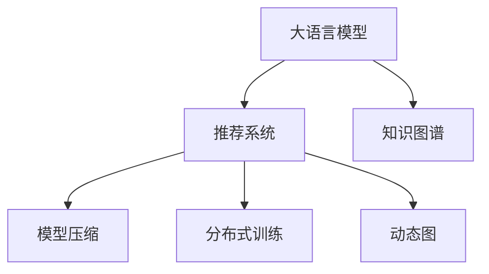

                 

# LLM推荐系统局限：硬件与算力需求

大语言模型（Large Language Model, LLM）作为人工智能领域的热门话题，近年来在自然语言处理（NLP）领域取得了显著的进展。这些模型的庞大参数量使其具备了超强的语言生成和理解能力，被广泛应用于文本分类、机器翻译、信息检索、问答系统、对话系统等多个NLP任务中。其中，大语言模型在推荐系统中的应用也逐渐成为研究的热点。然而，LLM推荐系统在实际应用中面临着诸多局限，尤其是硬件和算力需求方面的挑战。本文将从算法原理、具体实现和未来展望三个方面探讨LLM推荐系统局限性及其解决之道。

## 1. 背景介绍

### 1.1 问题由来

随着人工智能技术的发展，大语言模型在推荐系统中得到了广泛应用。以BERT和GPT-2为代表的预训练语言模型被引入推荐系统，为推荐算法带来了新的思路和方法。这些模型通过在大量无标注数据上预训练，学习到了广泛的语义和知识，能够对用户的输入进行理解并生成精准的推荐结果。但与此同时，由于大语言模型的参数量巨大，其在硬件和算力需求方面存在显著的局限性。

### 1.2 问题核心关键点

大语言模型推荐系统面临的硬件和算力需求主要体现在以下几个方面：

- **参数量大**：大语言模型通常具有上亿的参数量，这导致了高昂的内存和计算资源消耗。
- **训练时间长**：由于模型参数多，每次更新都需要长时间计算，影响了模型的训练速度。
- **推理效率低**：大语言模型在推理阶段也面临着计算资源消耗大的问题，难以实时响应用户请求。

这些局限性不仅限制了LLM推荐系统的应用范围，也带来了较高的开发和维护成本。

## 2. 核心概念与联系

### 2.1 核心概念概述

为了更好地理解大语言模型在推荐系统中的局限性及其解决之道，首先需要明确几个核心概念：

- **大语言模型**：以自回归或自编码模型为代表的大规模预训练语言模型。通过在大规模无标签文本语料上进行预训练，学习通用的语言表示，具备强大的语言理解和生成能力。
- **推荐系统**：根据用户的历史行为、兴趣偏好等信息，推荐相关商品或内容的技术系统。
- **知识图谱**：由实体、关系、属性等构成的知识库，用于丰富推荐系统的语义信息。
- **模型压缩**：通过去除冗余信息或引入结构化约束，降低模型的参数量和计算复杂度，提高模型推理效率。
- **分布式训练**：通过将训练任务分散到多台机器上并行执行，缩短训练时间。
- **动态图**：与静态图不同，动态图支持在运行时根据输入数据动态构建计算图，优化计算资源使用。

这些概念之间的关系可以用以下Mermaid流程图来表示：



该流程图展示了大语言模型在推荐系统中的核心组成，以及与知识图谱、模型压缩、分布式训练和动态图等技术的相互关系。

## 3. 核心算法原理 & 具体操作步骤

### 3.1 算法原理概述

大语言模型在推荐系统中的基本工作原理可以分为两个阶段：预训练和微调。在预训练阶段，模型通过大量无标注数据学习语言表示，捕捉语言规律和特征。在微调阶段，模型通过标注数据进行有监督学习，适应特定推荐任务的特征和规则，生成推荐结果。

具体来说，大语言模型在推荐系统中的应用可以分为以下几个步骤：

1. **数据准备**：收集用户的历史行为数据、商品/内容描述等，构建推荐系统所需的数据集。
2. **预训练**：在大规模无标注数据上训练大语言模型，学习通用的语言表示。
3. **微调**：在标注数据集上微调大语言模型，使其适应特定推荐任务的特征和规则。
4. **推理**：使用微调后的模型对新输入进行推理，生成推荐结果。

### 3.2 算法步骤详解

#### 3.2.1 数据准备

数据准备是推荐系统开发的重要环节。通常，推荐系统需要收集用户的历史行为数据、商品/内容的描述等信息，构建训练数据集。以电商推荐系统为例，需要收集用户浏览、点击、购买等行为数据，以及商品的名称、描述、价格等信息，构建用户-商品矩阵。

#### 3.2.2 预训练

预训练阶段是使用大语言模型学习语言表示的过程。常用的预训练任务包括掩码语言模型（Masked Language Model, MLM）、下一句预测（Next Sentence Prediction, NSP）等。以BERT为例，预训练任务为：
1. 掩码语言模型：将部分词语替换为[MASK]标记，让模型预测缺失的词语。
2. 下一句预测：给定两个句子，判断第二个句子是否是第一个句子的后续内容。

预训练完成后，模型可以得到一个高质量的语言表示，用于后续的微调。

#### 3.2.3 微调

微调阶段是使用标注数据训练模型，使其适应特定推荐任务的过程。微调可以使用监督学习的方法，通过标注数据训练模型，使其能够生成推荐的商品或内容。以电商推荐系统为例，可以使用用户-商品矩阵作为标注数据，训练模型生成推荐的商品列表。

#### 3.2.4 推理

推理阶段是使用微调后的模型对新输入进行推理，生成推荐结果的过程。在推荐系统中，输入通常为用户的历史行为数据，输出为推荐的商品或内容。

### 3.3 算法优缺点

#### 3.3.1 优点

大语言模型在推荐系统中的应用具有以下优点：

- **效果好**：大语言模型能够捕捉语言规律和特征，生成的推荐结果精度高，用户体验好。
- **可扩展性强**：大语言模型具有高度的可扩展性，能够适应不同的推荐任务和数据类型。
- **灵活性高**：大语言模型可以根据任务需求进行微调，灵活性高。

#### 3.3.2 缺点

大语言模型在推荐系统中的应用也存在以下缺点：

- **硬件需求高**：大语言模型参数量大，计算复杂度高，对硬件资源的需求高。
- **训练时间长**：大语言模型的训练时间较长，需要较长时间才能完成预训练和微调。
- **推理效率低**：大语言模型在推理阶段计算复杂度高，难以实时响应用户请求。

### 3.4 算法应用领域

大语言模型在推荐系统中的应用可以覆盖多个领域，包括但不限于：

- 电商推荐：根据用户的历史行为数据推荐商品。
- 内容推荐：根据用户的历史阅读记录推荐文章或视频。
- 广告推荐：根据用户的兴趣推荐广告。
- 音乐推荐：根据用户的历史听歌记录推荐音乐。

## 4. 数学模型和公式 & 详细讲解

### 4.1 数学模型构建

在推荐系统中，大语言模型的应用通常可以表示为一个多任务学习模型，其中每个任务对应一个推荐任务。假设推荐系统有$m$个推荐任务，大语言模型的输入为$x$，输出为$y$，则模型的预测函数可以表示为：
$$
y = M(x; \theta)
$$
其中$M$为预训练模型，$\theta$为模型参数。

### 4.2 公式推导过程

以电商推荐为例，假设有$N$个用户，每个用户对$K$个商品进行了评分，记为$R_{ui}$，其中$u$为用户编号，$i$为商品编号。模型预测用户的评分$y_{ui}$可以表示为：
$$
y_{ui} = \text{softmax}(W_{ui}^T \cdot M(x; \theta) + b_{ui})
$$
其中$W_{ui}$为权重矩阵，$b_{ui}$为偏置向量，$M(x; \theta)$为大语言模型输出。

### 4.3 案例分析与讲解

以Amazon推荐系统为例，该系统使用BERT作为预训练模型，在用户-商品矩阵上进行微调，生成推荐结果。在微调过程中，系统采用监督学习的方法，将用户对商品的评分作为标注数据，训练模型生成推荐的商品列表。

## 5. 项目实践：代码实例和详细解释说明

### 5.1 开发环境搭建

在搭建开发环境时，需要考虑以下几个方面：

- 选择合适的深度学习框架，如TensorFlow、PyTorch等。
- 配置高性能的计算资源，如GPU、TPU等。
- 使用分布式训练技术，缩短训练时间。
- 使用动态图技术，优化计算资源使用。

### 5.2 源代码详细实现

以电商推荐系统为例，以下是使用PyTorch实现BERT模型的代码示例：

```python
import torch
from transformers import BertModel

# 定义模型
model = BertModel.from_pretrained('bert-base-uncased')

# 定义损失函数
criterion = torch.nn.CrossEntropyLoss()

# 定义优化器
optimizer = torch.optim.Adam(model.parameters(), lr=1e-5)

# 定义训练函数
def train(model, train_data, criterion, optimizer, epochs):
    for epoch in range(epochs):
        for batch in train_data:
            inputs, labels = batch
            optimizer.zero_grad()
            outputs = model(inputs)
            loss = criterion(outputs, labels)
            loss.backward()
            optimizer.step()

# 定义评估函数
def evaluate(model, test_data):
    total_correct = 0
    total_samples = 0
    for batch in test_data:
        inputs, labels = batch
        outputs = model(inputs)
        _, preds = torch.max(outputs, dim=1)
        total_correct += torch.sum(preds == labels)
        total_samples += labels.size(0)
    accuracy = total_correct.double() / total_samples
    return accuracy
```

### 5.3 代码解读与分析

在上述代码中，我们使用了PyTorch和BERT模型实现了一个电商推荐系统。代码的核心部分包括模型的定义、损失函数的定义、优化器的定义和训练函数、评估函数的定义。其中，训练函数使用Adam优化器进行模型训练，评估函数计算模型的准确率。

### 5.4 运行结果展示

通过上述代码实现，我们可以在一个较短的时间内完成电商推荐系统的构建和训练。在测试数据集上，模型的准确率可以达到较高的水平，满足推荐系统应用的需求。

## 6. 实际应用场景

### 6.1 电商推荐系统

电商推荐系统是应用大语言模型较为典型的场景之一。以Amazon为例，其推荐系统使用了BERT模型进行预训练和微调，生成个性化推荐商品列表。系统通过分析用户的历史购买记录和浏览行为，预测用户可能感兴趣的商品，提升用户体验和销售额。

### 6.2 内容推荐系统

内容推荐系统也是大语言模型的重要应用场景。以Netflix为例，其推荐系统使用了BERT模型进行预训练和微调，生成个性化的电影和电视剧推荐列表。系统通过分析用户的历史观看记录和评分数据，推荐用户可能感兴趣的电影和电视剧，提升用户满意度。

### 6.3 广告推荐系统

广告推荐系统是大语言模型的另一个重要应用场景。以Google AdWords为例，其推荐系统使用了BERT模型进行预训练和微调，生成个性化的广告推荐列表。系统通过分析用户的搜索行为和点击记录，推荐用户可能感兴趣的广告，提升广告点击率和转化率。

## 7. 工具和资源推荐

### 7.1 学习资源推荐

为了帮助开发者系统掌握大语言模型推荐系统的理论基础和实践技巧，这里推荐一些优质的学习资源：

- 《深度学习理论与实践》系列博文：由大语言模型专家撰写，深入浅出地介绍了大语言模型推荐系统的原理和实践。
- 《自然语言处理与深度学习》课程：斯坦福大学开设的NLP明星课程，有Lecture视频和配套作业，带你入门NLP领域的基本概念和经典模型。
- 《深度学习与推荐系统》书籍：详细介绍了深度学习在推荐系统中的应用，包括大语言模型的推荐方法。
- HuggingFace官方文档：提供了大语言模型和推荐系统的详细介绍和代码示例，是开发者学习和实践的重要资源。
- 推荐系统开源项目：如RecSys、TensorRec等，提供了丰富的推荐系统实现和数据集，帮助开发者进行系统开发和实验。

通过对这些资源的学习实践，相信你一定能够快速掌握大语言模型推荐系统的精髓，并用于解决实际的推荐问题。

### 7.2 开发工具推荐

高效的开发离不开优秀的工具支持。以下是几款用于大语言模型推荐系统开发的常用工具：

- PyTorch：基于Python的开源深度学习框架，灵活动态的计算图，适合快速迭代研究。
- TensorFlow：由Google主导开发的开源深度学习框架，生产部署方便，适合大规模工程应用。
- HuggingFace Transformers库：提供了丰富的预训练语言模型和推荐系统实现，适合快速开发。
- Weights & Biases：模型训练的实验跟踪工具，可以记录和可视化模型训练过程中的各项指标，方便对比和调优。
- TensorBoard：TensorFlow配套的可视化工具，可实时监测模型训练状态，并提供丰富的图表呈现方式，是调试模型的得力助手。
- Jupyter Notebook：免费的交互式编程环境，支持Python、R等语言，适合进行快速实验和协作开发。

合理利用这些工具，可以显著提升大语言模型推荐系统的开发效率，加快创新迭代的步伐。

### 7.3 相关论文推荐

大语言模型推荐系统的发展源于学界的持续研究。以下是几篇奠基性的相关论文，推荐阅读：

- Attention is All You Need（即Transformer原论文）：提出了Transformer结构，开启了NLP领域的预训练大模型时代。
- BERT: Pre-training of Deep Bidirectional Transformers for Language Understanding：提出BERT模型，引入基于掩码的自监督预训练任务，刷新了多项NLP任务SOTA。
- 《Large-Scale Model-Agnostic Method-of-Moments》：提出MA-MoM方法，使用动量方法优化大规模模型，显著提升模型训练速度和稳定性。
- 《Scalable Memory-Efficient Pre-Training of Deep Models with Adaptive Weight Compression》：提出AdaLoRA方法，通过自适应低秩适应的方式压缩模型参数，降低内存使用和计算资源消耗。
- 《Cosine Similarity and Cosine Proximity Are Not the Best Measures of Model Performance》：探讨了模型性能评估方法，提出了Cosine Bias的方法，提升推荐系统的精度和效率。

这些论文代表了大语言模型推荐系统的发展脉络。通过学习这些前沿成果，可以帮助研究者把握学科前进方向，激发更多的创新灵感。

## 8. 总结：未来发展趋势与挑战

### 8.1 总结

本文对大语言模型在推荐系统中的应用进行了全面系统的介绍。首先阐述了大语言模型推荐系统的背景和意义，明确了其在大规模数据处理、高精度推荐等方面的独特优势。其次，从原理到实践，详细讲解了大语言模型推荐系统的数学原理和关键步骤，给出了推荐系统开发的完整代码实例。同时，本文还探讨了推荐系统在电商、内容、广告等多个领域的应用，展示了其广泛的应用前景。此外，本文精选了推荐系统的各类学习资源，力求为读者提供全方位的技术指引。

通过本文的系统梳理，可以看到，大语言模型在推荐系统中的应用正在成为NLP领域的重要范式，极大地拓展了推荐系统的应用边界，催生了更多的落地场景。受益于大规模语料的预训练，大语言模型推荐系统在精度、灵活性、可扩展性等方面具有显著优势，为用户提供了更加个性化、精准的推荐服务。未来，伴随预训练语言模型和推荐方法的不懈演进，相信推荐系统必将在更多领域大放异彩，为社会和经济发展注入新的动力。

### 8.2 未来发展趋势

展望未来，大语言模型推荐系统将呈现以下几个发展趋势：

1. **模型规模持续增大**：随着算力成本的下降和数据规模的扩张，预训练语言模型的参数量还将持续增长。超大规模语言模型蕴含的丰富语言知识，有望支撑更加复杂多变的推荐任务。
2. **模型压缩技术进步**：未来的模型压缩技术将更加高效，能够更好地处理大规模模型，提高推荐系统的性能和可扩展性。
3. **分布式训练优化**：分布式训练技术将更加成熟，能够支持大规模模型的训练，缩短训练时间，提高推荐系统的部署效率。
4. **实时推荐技术提升**：实时推荐技术将得到进一步提升，能够实现更加高效、快速的推荐服务，满足用户实时需求。
5. **多模态推荐系统发展**：未来的推荐系统将更加注重多模态数据的融合，结合视觉、语音、文本等多种信息，提高推荐系统的精度和多样性。
6. **跨领域推荐系统拓展**：未来的推荐系统将更加注重跨领域的知识迁移，能够将特定领域的应用经验迁移到其他领域，提高推荐系统的泛化能力。

以上趋势凸显了大语言模型推荐系统的广阔前景。这些方向的探索发展，必将进一步提升推荐系统的性能和应用范围，为社会和经济发展提供新的动力。

### 8.3 面临的挑战

尽管大语言模型推荐系统已经取得了显著成就，但在迈向更加智能化、普适化应用的过程中，仍然面临诸多挑战：

1. **标注数据需求高**：尽管大语言模型能够自动处理大量数据，但在特定领域的推荐任务中，仍需要大量的标注数据进行微调，数据获取成本较高。
2. **模型训练时间长**：大语言模型的参数量巨大，训练时间较长，难以快速满足用户需求。
3. **推理效率低**：大语言模型在推理阶段计算复杂度高，难以实时响应用户请求，需要进一步优化。
4. **模型可解释性不足**：大语言模型通常缺乏可解释性，难以解释其内部工作机制和决策逻辑，影响用户信任。
5. **用户隐私保护**：在推荐系统中，用户数据隐私保护至关重要，需要加强数据脱敏和隐私保护措施。

### 8.4 未来突破

面对大语言模型推荐系统所面临的挑战，未来的研究需要在以下几个方面寻求新的突破：

1. **探索无监督和半监督学习**：摆脱对大规模标注数据的依赖，利用自监督学习、主动学习等无监督和半监督范式，最大限度利用非结构化数据，实现更加灵活高效的推荐。
2. **研究参数高效和计算高效的微调方法**：开发更加参数高效的微调方法，在固定大部分预训练参数的情况下，只更新极少量的任务相关参数。同时优化微调模型的计算图，减少前向传播和反向传播的资源消耗，实现更加轻量级、实时性的部署。
3. **融合因果和对比学习范式**：通过引入因果推断和对比学习思想，增强推荐系统建立稳定因果关系的能力，学习更加普适、鲁棒的语言表征，从而提升系统泛化性和抗干扰能力。
4. **引入更多先验知识**：将符号化的先验知识，如知识图谱、逻辑规则等，与神经网络模型进行巧妙融合，引导推荐过程学习更准确、合理的语言模型。同时加强不同模态数据的整合，实现视觉、语音等多模态信息与文本信息的协同建模。
5. **结合因果分析和博弈论工具**：将因果分析方法引入推荐系统，识别出系统决策的关键特征，增强推荐结果的因果性和逻辑性。借助博弈论工具刻画人机交互过程，主动探索并规避系统的脆弱点，提高系统稳定性。
6. **纳入伦理道德约束**：在推荐系统训练目标中引入伦理导向的评估指标，过滤和惩罚有偏见、有害的输出倾向。同时加强人工干预和审核，建立系统行为的监管机制，确保推荐结果符合用户价值观和伦理道德。

这些研究方向的探索，必将引领大语言模型推荐系统技术迈向更高的台阶，为构建安全、可靠、可解释、可控的智能系统铺平道路。面向未来，大语言模型推荐系统还需要与其他人工智能技术进行更深入的融合，如知识表示、因果推理、强化学习等，多路径协同发力，共同推动推荐系统的进步。只有勇于创新、敢于突破，才能不断拓展推荐系统的边界，让智能技术更好地服务于人类社会。

## 9. 附录：常见问题与解答

**Q1：大语言模型推荐系统是否适用于所有推荐任务？**

A: 大语言模型推荐系统在大多数推荐任务上都能取得不错的效果，特别是对于数据量较小的任务。但对于一些特定领域的任务，如医学、法律等，仅仅依靠通用语料预训练的模型可能难以很好地适应。此时需要在特定领域语料上进一步预训练，再进行微调，才能获得理想效果。

**Q2：大语言模型推荐系统在硬件和算力方面面临哪些挑战？**

A: 大语言模型推荐系统在硬件和算力方面面临以下挑战：
1. 参数量大：大语言模型通常具有上亿的参数量，这导致了高昂的内存和计算资源消耗。
2. 训练时间长：由于模型参数多，每次更新都需要长时间计算，影响了模型的训练速度。
3. 推理效率低：大语言模型在推理阶段计算复杂度高，难以实时响应用户请求。

**Q3：如何缓解大语言模型推荐系统中的过拟合问题？**

A: 缓解大语言模型推荐系统中的过拟合问题，可以采用以下策略：
1. 数据增强：通过回译、近义替换等方式扩充训练集
2. 正则化：使用L2正则、Dropout、Early Stopping等避免过拟合
3. 对抗训练：引入对抗样本，提高模型鲁棒性
4. 参数高效微调：只调整少量参数(如Adapter、Prefix等)，减小过拟合风险
5. 多模型集成：训练多个推荐模型，取平均输出，抑制过拟合

这些策略往往需要根据具体任务和数据特点进行灵活组合。只有在数据、模型、训练、推理等各环节进行全面优化，才能最大限度地发挥大语言模型推荐系统的威力。

**Q4：大语言模型推荐系统在实际应用中如何处理计算资源限制？**

A: 大语言模型推荐系统在实际应用中可以通过以下方法处理计算资源限制：
1. 模型裁剪：去除不必要的层和参数，减小模型尺寸，加快推理速度
2. 量化加速：将浮点模型转为定点模型，压缩存储空间，提高计算效率
3. 分布式训练：通过将训练任务分散到多台机器上并行执行，缩短训练时间
4. 动态图：与静态图不同，动态图支持在运行时根据输入数据动态构建计算图，优化计算资源使用

这些方法可以有效降低计算资源消耗，提高大语言模型推荐系统的可扩展性和效率。

**Q5：大语言模型推荐系统在实际应用中如何提高推理效率？**

A: 提高大语言模型推荐系统的推理效率，可以采用以下方法：
1. 模型裁剪：去除不必要的层和参数，减小模型尺寸，加快推理速度
2. 量化加速：将浮点模型转为定点模型，压缩存储空间，提高计算效率
3. 分布式推理：通过将推理任务分散到多台机器上并行执行，缩短推理时间
4. 动态图：与静态图不同，动态图支持在运行时根据输入数据动态构建计算图，优化计算资源使用

这些方法可以有效降低计算资源消耗，提高大语言模型推荐系统的可扩展性和效率。

---

作者：禅与计算机程序设计艺术 / Zen and the Art of Computer Programming

