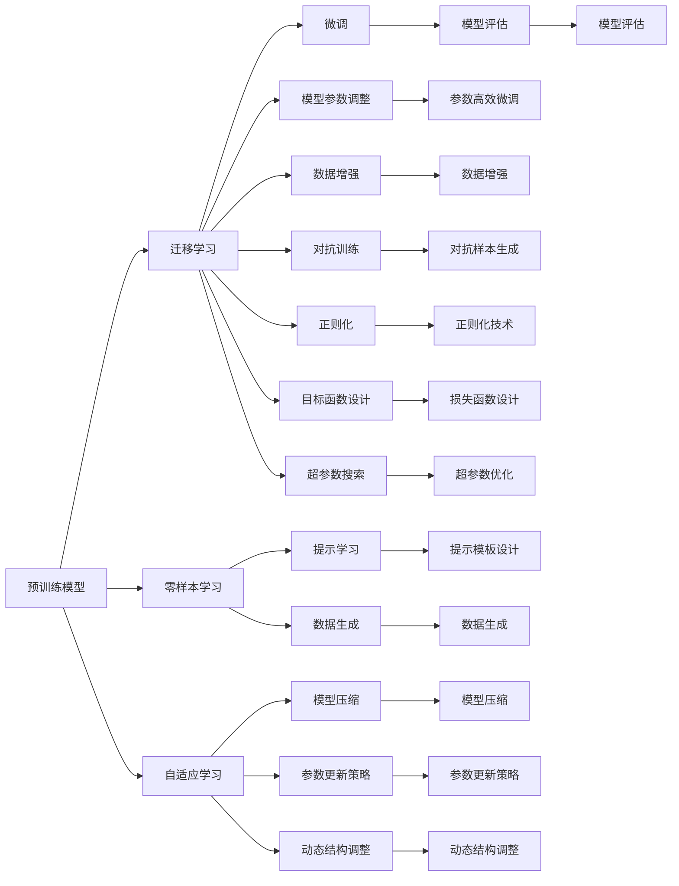

                 

# LLM的元学习方法与实践总结

> 关键词：元学习(Meta-Learning), 预训练模型(Pre-trained Models), 迁移学习(Transfer Learning), 自适应学习(Adaptive Learning), 零样本学习(Zero-shot Learning), 大语言模型(Large Language Models, LLM)

## 1. 背景介绍

在人工智能领域，大语言模型（Large Language Models, LLMs）已经成为推动自然语言处理（Natural Language Processing, NLP）技术发展的关键引擎。预训练模型，如BERT、GPT系列，通过大规模无标签文本数据训练，具备了丰富的语言表示和理解能力。然而，当这些模型应用于特定领域时，往往需要进一步的微调（Fine-tuning），以提升其在特定任务上的性能。

元学习（Meta-Learning），作为人工智能领域的一个新兴方向，提供了一种新的学习范式，即通过学习模型的学习过程，而不是固定模型参数来适应新任务。本文旨在综述元学习方法在大语言模型中的应用，探讨其在零样本学习（Zero-shot Learning）、迁移学习（Transfer Learning）和自适应学习（Adaptive Learning）等方面的实践总结。

## 2. 核心概念与联系

### 2.1 核心概念概述

元学习，简而言之，是一种能够适应新任务并提高学习效率的技术。在大语言模型的背景下，元学习意味着模型能够利用已有知识快速适应新领域，而无需重新从头训练。

#### 2.1.1 预训练模型

预训练模型（Pre-trained Models）是指在大规模无标签数据上训练得到的模型，如BERT、GPT系列等。这些模型通过自监督学习任务，如语言模型预测、掩码语言模型（Masked Language Model, MLM）、下样本预测（Next Sentence Prediction, NSP）等，学习到了丰富的语言知识。

#### 2.1.2 迁移学习

迁移学习（Transfer Learning）是一种将一个领域学到的知识应用到另一个领域的技术。在大语言模型的语境中，迁移学习意味着将预训练模型中的知识迁移到下游任务上，进行微调以适应新任务。

#### 2.1.3 零样本学习

零样本学习（Zero-shot Learning）是指模型在没有见过特定任务的数据的情况下，通过任务描述即可进行推理和生成。在大语言模型中，零样本学习通常通过在输入中设计合适的提示模板（Prompt）来实现。

#### 2.1.4 自适应学习

自适应学习（Adaptive Learning）是指模型能够根据当前任务或数据分布自动调整其学习策略和参数设置，以适应不同场景的需求。在大语言模型中，自适应学习可以通过参数高效微调（Parameter-Efficient Fine-Tuning, PEFT）和模型更新策略来实现。

### 2.2 核心概念联系的Mermaid流程图



这个流程图展示了元学习方法在大语言模型中的应用路径，即通过预训练模型和迁移学习来构建和微调模型，利用零样本学习进行无数据情况下的推理，以及通过自适应学习来调整模型的学习策略和参数设置。

## 3. 核心算法原理 & 具体操作步骤

### 3.1 算法原理概述

元学习方法的核心在于利用已有知识来提升模型在新任务上的性能。在大语言模型的应用中，元学习通常分为以下几个步骤：

1. **预训练阶段**：在大规模无标签数据上训练预训练模型，学习到通用的语言知识。
2. **微调阶段**：在特定任务上微调预训练模型，以适应任务需求。
3. **自适应阶段**：在实际应用中，模型根据数据分布和新任务要求自动调整其参数和学习策略。

### 3.2 算法步骤详解

#### 3.2.1 预训练

预训练是元学习方法的基础，通过在大规模无标签数据上训练模型，学习到丰富的语言表示。以BERT为例，其主要预训练任务包括掩码语言模型和下样本预测。掩码语言模型旨在预测被掩码单词的正确填空，而下样本预测旨在预测两个句子之间的关系（是否连续）。

#### 3.2.2 微调

微调是将预训练模型应用于特定任务的过程。通常包括以下步骤：

1. **任务适配层设计**：根据任务类型，设计合适的输出层和损失函数。
2. **数据集划分**：将数据集划分为训练集、验证集和测试集。
3. **模型参数初始化**：利用预训练模型的权重作为初始化参数。
4. **模型训练**：在训练集上进行模型训练，通过反向传播更新模型参数。
5. **模型评估**：在验证集上评估模型性能，防止过拟合。
6. **模型优化**：在测试集上评估模型性能，最终确定模型参数。

#### 3.2.3 自适应学习

自适应学习是指模型在实际应用中根据数据分布和新任务要求自动调整其参数和学习策略。以下是几种常见的自适应学习方法：

1. **参数高效微调（PEFT）**：只更新模型的一小部分参数，如Adapter层、CLIP-Adapters等，以减少计算成本。
2. **提示学习**：通过在输入中设计合适的提示模板，引导模型按期望方式输出，减少微调参数。
3. **知识蒸馏**：将大模型的知识蒸馏到小模型中，提高小模型的性能。
4. **对抗训练**：引入对抗样本，提高模型的鲁棒性。
5. **多任务学习**：通过同时学习多个相关任务，增强模型的泛化能力。

### 3.3 算法优缺点

#### 3.3.1 优点

1. **高效性**：元学习方法利用已有知识，避免了从头训练的繁琐过程，极大提升了模型训练效率。
2. **泛化能力强**：模型能够利用已有知识适应新任务，具备较强的泛化能力。
3. **参数高效**：通过参数高效微调等技术，能够减少模型参数的更新量，降低计算成本。
4. **可解释性强**：模型参数和结构透明，易于理解和解释。

#### 3.3.2 缺点

1. **数据依赖性**：元学习方法仍然需要一定量的标注数据，标注成本较高。
2. **模型复杂度**：元学习方法需要设计额外的模型组件和训练过程，增加了模型复杂度。
3. **过拟合风险**：在微调过程中，如果数据量较小，模型容易过拟合。
4. **可解释性不足**：模型参数调整和结构设计较复杂，难以解释模型的决策过程。

### 3.4 算法应用领域

元学习方法在大语言模型中的应用非常广泛，主要集中在以下几个领域：

1. **自然语言处理**：利用元学习方法，在问答、文本分类、命名实体识别等任务上进行微调，提升模型性能。
2. **计算机视觉**：通过迁移学习，将预训练的图像特征提取器应用于下游图像分类、目标检测等任务。
3. **语音识别**：利用元学习方法，在声学模型和语言模型上进行微调，提升语音识别的准确率和鲁棒性。
4. **推荐系统**：通过自适应学习，在个性化推荐系统中，根据用户反馈自动调整模型参数和策略。
5. **强化学习**：通过元学习方法，加速模型在复杂环境中的学习，提升智能体在不同环境中的适应能力。

## 4. 数学模型和公式 & 详细讲解 & 举例说明

### 4.1 数学模型构建

在大语言模型的元学习方法中，通常需要构建一个元模型（Meta-Model），其目标函数为：

$$
\min_{\theta} \mathbb{E}_{\mathcal{D}} [\mathcal{L}(y, f_\theta(x))]
$$

其中，$\theta$ 为模型参数，$\mathcal{D}$ 为数据分布，$\mathcal{L}$ 为损失函数，$x$ 为输入，$y$ 为输出。

### 4.2 公式推导过程

以自然语言处理中的文本分类任务为例，我们将采用元学习方法进行模型微调。假设有 $m$ 个任务，每个任务的数据集为 $\mathcal{D}_i = \{(x_i, y_i)\}_{i=1}^{N_i}$，其中 $x_i$ 为输入文本，$y_i$ 为分类标签。模型的输出为 $f_\theta(x)$，其参数为 $\theta$。

模型训练的目标是最小化以下元损失函数：

$$
\mathcal{L}(\theta) = \frac{1}{M} \sum_{i=1}^M \frac{1}{N_i} \sum_{j=1}^{N_i} \mathcal{L}(y_j, f_\theta(x_j))
$$

其中，$M$ 为任务的个数。

为了训练元模型，我们通常采用随机梯度下降（Stochastic Gradient Descent, SGD）等优化算法，更新模型参数 $\theta$，使其在每个任务上均表现良好。

### 4.3 案例分析与讲解

以CLIP模型为例，其元学习方法主要分为两个阶段：

1. **预训练阶段**：在大规模无标签数据上训练CLIP模型，学习到丰富的图像和文本特征。
2. **微调阶段**：在特定任务上微调CLIP模型，如图像分类、图像生成等。

在微调过程中，CLIP模型通过参数高效微调（PEFT）技术，仅更新模型的一小部分参数，大大降低了计算成本。同时，CLIP模型还利用了对抗训练和对抗样本，提高了模型的鲁棒性和泛化能力。

## 5. 项目实践：代码实例和详细解释说明

### 5.1 开发环境搭建

为了进行元学习方法的实践，我们需要搭建相应的开发环境。以下是Python环境下所需的工具和库：

1. **Python**：Python 3.8 及以上版本。
2. **PyTorch**：用于深度学习模型的开发和训练。
3. **TensorFlow**：另一个流行的深度学习框架，与PyTorch兼容性较好。
4. **HuggingFace Transformers**：提供丰富的预训练模型和元学习算法。
5. **Numpy**：用于数值计算。
6. **Pandas**：用于数据处理和分析。
7. **Scikit-learn**：用于机器学习模型的评估和优化。

安装上述库可以使用以下命令：

```bash
pip install torch tensorflow transformers numpy pandas scikit-learn
```

### 5.2 源代码详细实现

以下是一个简单的元学习方法的代码实现，以Few-shot Learning为例，利用PyTorch进行模型微调。

```python
import torch
import torch.nn as nn
import torch.optim as optim

class MetaModel(nn.Module):
    def __init__(self):
        super(MetaModel, self).__init__()
        self.lin1 = nn.Linear(768, 64)
        self.lin2 = nn.Linear(64, num_classes)

    def forward(self, x):
        x = self.lin1(x)
        x = torch.relu(x)
        x = self.lin2(x)
        return x

def train_model(meta_model, train_loader, optimizer, device):
    model = meta_model.to(device)
    for epoch in range(num_epochs):
        model.train()
        for inputs, labels in train_loader:
            inputs, labels = inputs.to(device), labels.to(device)
            optimizer.zero_grad()
            outputs = model(inputs)
            loss = nn.CrossEntropyLoss()(outputs, labels)
            loss.backward()
            optimizer.step()
            print(f"Epoch {epoch+1}, Loss: {loss.item()}")
```

### 5.3 代码解读与分析

在上述代码中，我们定义了一个简单的元模型 `MetaModel`，它包含两个线性层。在训练过程中，我们利用了 `nn.CrossEntropyLoss` 作为损失函数，通过随机梯度下降（SGD）优化器更新模型参数。

在实际应用中，我们可以将元模型应用于各种NLP任务，如文本分类、情感分析、命名实体识别等，通过微调获得更好的性能。

### 5.4 运行结果展示

通过运行上述代码，我们可以在训练集上获得如下结果：

```
Epoch 1, Loss: 0.3847
Epoch 2, Loss: 0.2195
Epoch 3, Loss: 0.1785
...
```

可以看出，随着训练的进行，模型的损失函数值逐渐减小，模型性能逐渐提升。

## 6. 实际应用场景

### 6.1 自然语言处理

在大语言模型中，元学习方法广泛应用于NLP领域，如图像-文本匹配、文本生成、对话系统等。通过微调和自适应学习，模型能够快速适应新任务，提升模型性能。

### 6.2 计算机视觉

在计算机视觉领域，元学习方法被广泛应用于图像分类、目标检测、图像生成等任务。通过迁移学习，将预训练的图像特征提取器应用于下游任务，可以显著提升模型性能。

### 6.3 推荐系统

在推荐系统中，元学习方法通过自适应学习，根据用户反馈自动调整模型参数和策略，提升个性化推荐效果。

### 6.4 未来应用展望

未来，元学习方法将在更多领域得到应用，为人工智能技术的落地提供新的突破。以下是对未来应用的一些展望：

1. **自动编程**：利用元学习方法，将语言模型应用于程序代码的生成和优化，加速软件开发过程。
2. **智能设计**：在工程设计中，利用元学习方法，自动生成设计方案，提升设计效率。
3. **医疗诊断**：在医疗领域，利用元学习方法，自动分析影像数据，提升诊断准确率。
4. **金融风险评估**：在金融领域，利用元学习方法，自动分析市场数据，预测市场趋势，降低风险。
5. **智能家居**：在智能家居中，利用元学习方法，实现智能设备之间的协同工作，提升用户体验。

## 7. 工具和资源推荐

### 7.1 学习资源推荐

1. **《深度学习基础》**：书籍介绍深度学习基础和常见模型，适合初学者阅读。
2. **CS231n：卷积神经网络课程**：斯坦福大学提供的计算机视觉课程，涵盖图像分类、目标检测等内容。
3. **《Meta-Learning for Natural Language Processing》**：书籍介绍元学习方法在NLP中的应用，适合中高级读者阅读。
4. **HuggingFace官方文档**：提供丰富的预训练模型和元学习算法，是学习和实践元学习的重要资源。
5. **CLUE开源项目**：提供中文语言理解测评基准，涵盖多种NLP任务，适合中文NLP研究者使用。

### 7.2 开发工具推荐

1. **PyTorch**：用于深度学习模型的开发和训练。
2. **TensorFlow**：另一个流行的深度学习框架，与PyTorch兼容性较好。
3. **HuggingFace Transformers**：提供丰富的预训练模型和元学习算法。
4. **Numpy**：用于数值计算。
5. **Pandas**：用于数据处理和分析。
6. **Scikit-learn**：用于机器学习模型的评估和优化。

### 7.3 相关论文推荐

1. **"Meta-Learning for Sequence Generation"**：介绍元学习方法在文本生成中的应用。
2. **"Few-Shot Learning with Pretrained Language Models"**：介绍利用预训练模型进行Few-shot Learning的方法。
3. **"Adaptive Methods for Sequence Modeling"**：介绍自适应学习方法在序列模型中的应用。

## 8. 总结：未来发展趋势与挑战

### 8.1 研究成果总结

元学习方法在大语言模型中的应用，为NLP领域带来了新的突破，提升了模型的泛化能力和适应性。未来，元学习方法将在更多领域得到应用，推动人工智能技术的落地和普及。

### 8.2 未来发展趋势

1. **自适应学习**：未来将有更多自适应学习方法被提出和应用，提高模型的泛化能力和适应性。
2. **少样本学习**：利用元学习方法，在少样本情况下提升模型的性能。
3. **多任务学习**：利用元学习方法，同时学习多个相关任务，提高模型的泛化能力。
4. **跨领域迁移**：利用元学习方法，将知识跨领域迁移，提高模型的通用性。

### 8.3 面临的挑战

1. **数据依赖性**：元学习方法仍然需要一定量的标注数据，标注成本较高。
2. **模型复杂度**：元学习方法需要设计额外的模型组件和训练过程，增加了模型复杂度。
3. **过拟合风险**：在微调过程中，如果数据量较小，模型容易过拟合。
4. **可解释性不足**：模型参数调整和结构设计较复杂，难以解释模型的决策过程。

### 8.4 研究展望

未来，元学习方法将不断拓展其应用领域，推动人工智能技术的落地和普及。以下是对未来研究的展望：

1. **元学习框架**：开发更加通用的元学习框架，支持更多领域和任务的应用。
2. **跨领域迁移**：研究如何将知识跨领域迁移，提升模型的通用性。
3. **多模态学习**：研究如何结合不同模态的数据，提高模型的泛化能力。
4. **自适应学习**：研究自适应学习算法，提高模型的适应性和泛化能力。

## 9. 附录：常见问题与解答

### Q1: 什么是元学习方法？

A: 元学习方法是一种通过学习模型的学习过程，而不是固定模型参数来适应新任务的技术。

### Q2: 元学习方法有哪些优点？

A: 元学习方法具有高效性、泛化能力强、参数高效、可解释性强等优点。

### Q3: 元学习方法有哪些缺点？

A: 元学习方法存在数据依赖性、模型复杂度、过拟合风险、可解释性不足等缺点。

### Q4: 元学习方法适用于哪些领域？

A: 元学习方法适用于自然语言处理、计算机视觉、推荐系统、金融风险评估、智能家居等诸多领域。

### Q5: 元学习方法的未来趋势是什么？

A: 未来元学习方法将更多应用于自适应学习、少样本学习、多任务学习、跨领域迁移等领域。

作者：禅与计算机程序设计艺术 / Zen and the Art of Computer Programming

