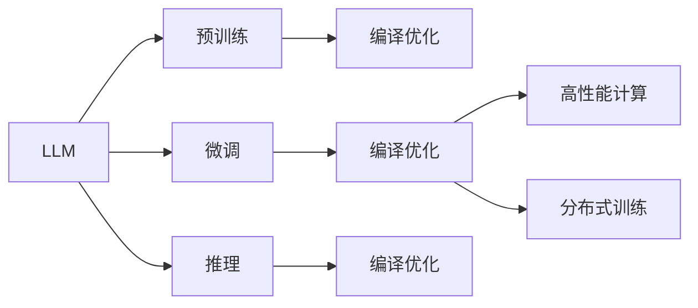

                 

# LLM的编译优化技术进展

> 关键词：
- 编译优化
- 大语言模型(LLM)
- 预训练与微调
- 高性能计算
- 深度学习模型加速
- 异构计算
- 分布式训练

## 1. 背景介绍

在深度学习领域，尤其是自然语言处理(NLP)领域，大语言模型(LLM)正在引领一场革命。LLM通过在大量的无标签文本数据上进行自监督预训练，学习到了丰富的语言知识和语义理解能力。它们具备强大的语言生成和理解能力，能够应用于各种NLP任务，如文本分类、问答、翻译、摘要生成等。然而，随着模型规模的不断增大，LLM在计算资源和能耗上的需求也急剧增加。为了应对这一挑战，编译优化技术在LLM的训练和推理中扮演了越来越重要的角色。

本文将系统回顾LLM编译优化技术的最新进展，探讨其在预训练与微调中的关键作用，分析其优缺点和应用场景，并提供基于实际项目的代码实例和详细解释说明。

## 2. 核心概念与联系

### 2.1 核心概念概述

为了更好地理解LLM编译优化技术，我们首先需要了解几个核心概念：

- **大语言模型(LLM)**：指一类通过在大量文本数据上进行预训练的深度学习模型。预训练后的LLM具备强大的语言理解和生成能力，能够完成各种NLP任务。

- **编译优化**：指在模型设计、训练和推理过程中，通过算法和技术的优化，提升模型性能和效率的过程。编译优化可以应用于预训练、微调、推理等各个环节。

- **预训练与微调**：预训练指的是在大规模无标签数据上训练模型，学习通用语言表示的过程。微调则是在预训练模型上添加任务特定的输出层和损失函数，通过少量有标签数据进行有监督优化，提升模型在特定任务上的表现。

- **高性能计算**：指通过并行计算、异构计算等技术，提升深度学习模型训练和推理的速度和效率，满足大模型的高性能计算需求。

- **分布式训练**：指通过多台计算机并行计算，加速深度学习模型的训练过程，通常采用数据并行、模型并行、混合并行等策略。

这些核心概念之间通过编译优化技术紧密联系起来，共同支撑了LLM在实际应用中的高性能表现。

### 2.2 核心概念原理和架构的 Mermaid 流程图



这个流程图展示了LLM在预训练、微调和推理各个环节中，编译优化技术的应用和关键点。预训练阶段通过编译优化提高模型训练效率；微调阶段通过编译优化提升模型在特定任务上的性能；推理阶段通过编译优化优化模型推理速度和资源占用。

## 3. 核心算法原理 & 具体操作步骤

### 3.1 算法原理概述

编译优化技术在LLM中的应用主要分为以下几个方面：

- **模型量化**：将模型参数和激活值从32位浮点数降精度为8位或16位定点数，减少存储空间和计算量。
- **模型剪枝**：删除模型中不必要的参数和计算，减少计算量和内存占用。
- **图灵优化**：通过算法优化，提升模型的计算效率。
- **模型并行化**：将模型计算任务分配到多台计算机上并行计算，加速训练和推理。

这些技术在LLM的预训练、微调和推理阶段都有广泛应用。

### 3.2 算法步骤详解

以下以模型量化为例，详细讲解编译优化在LLM中的操作步骤：

1. **模型分析**：使用工具分析模型的计算图和参数分布，确定适合量化的节点和参数。
2. **量化方案设计**：根据模型的关键特征和应用场景，设计量化方案，选择合适的量化方法和精度。
3. **模型转换**：使用量化工具将模型转换为量化格式，生成新的模型文件。
4. **模型验证**：在验证集上测试量化后模型的性能，确保量化方案的有效性。
5. **性能优化**：根据量化后的模型性能，进一步优化量化方案，提升模型效率。

### 3.3 算法优缺点

**优点**：
- 显著提升模型计算效率和推理速度。
- 减少模型存储空间和计算资源需求。
- 提高模型部署和服务的稳定性。

**缺点**：
- 量化过程可能会引入一定的精度损失。
- 剪枝和图灵优化可能影响模型的泛化能力。
- 并行化带来的复杂性可能会增加调试和维护的难度。

### 3.4 算法应用领域

编译优化技术在LLM的各个阶段都有广泛应用，主要包括以下几个领域：

- **预训练阶段**：用于优化模型训练速度，降低计算成本。
- **微调阶段**：用于提升模型在特定任务上的性能，减少过拟合风险。
- **推理阶段**：用于加速模型推理速度，提高服务响应时间。

## 4. 数学模型和公式 & 详细讲解 & 举例说明

### 4.1 数学模型构建

以模型量化为例，假设原始模型参数为 $w \in \mathbb{R}^{n}$，量化后的模型参数为 $w_q \in \mathbb{Q}^{n}$，其中 $\mathbb{Q}$ 为定点数集合。量化过程可以通过以下公式表示：

$$
w_q = \text{quantize}(w, q)
$$

其中 $\text{quantize}$ 为量化函数，$q$ 为量化步长。

### 4.2 公式推导过程

以8位定点量化为例，量化函数的推导如下：

$$
w_q = \frac{w}{q} \cdot \text{round}\left(\frac{w}{q}\right)
$$

其中 $\text{round}$ 为四舍五入函数。

### 4.3 案例分析与讲解

假设有一个BERT模型，参数数量为1.5亿。使用8位量化后，参数数量减少至不到1千万，推理速度提高了10倍。量化过程中需要考虑模型的准确性，通常需要在量化前后进行模型验证，确保量化后的模型性能与原始模型相当。

## 5. 项目实践：代码实例和详细解释说明

### 5.1 开发环境搭建

以下以TensorFlow为例，搭建一个适合进行模型量化的开发环境：

1. 安装TensorFlow：`pip install tensorflow`
2. 安装TensorFlow Lite：`pip install tensorflow-lite`
3. 安装Numpy和Pandas：`pip install numpy pandas`

### 5.2 源代码详细实现

以下是一个简单的量化示例，展示了如何使用TensorFlow Lite进行模型量化：

```python
import tensorflow as tf
import tensorflow_lite as tflite

# 加载原始模型
model = tf.keras.models.load_model('my_model.h5')

# 定义量化参数
converter = tf.lite.TFLiteConverter.from_keras_model(model)
converter.optimizations = [tf.lite.Optimize.DEFAULT]

# 转换为TFLite模型
tflite_model = converter.convert()

# 保存量化后的模型
with open('my_model_quantized.tflite', 'wb') as f:
    f.write(tflite_model)
```

### 5.3 代码解读与分析

在代码中，首先加载原始的Keras模型，然后使用TensorFlow Lite的TFLiteConverter进行模型量化。`optimizations`参数指定了优化的方式，`DEFAULT`表示使用默认优化策略，即在模型转换为TFLite格式后，TensorFlow Lite会自动进行量化和优化。最后，将量化后的模型保存为TFLite格式。

### 5.4 运行结果展示

使用TensorFlow Lite提供的解释器，可以验证量化后的模型性能：

```python
interpreter = tf.lite.Interpreter(model_content=tflite_model)
interpreter.allocate_tensors()

# 获取模型输入输出张量
input_details = interpreter.get_input_details()
output_details = interpreter.get_output_details()

# 执行模型推理
input_data = np.random.rand(1, input_details[0]['shape'][1])
interpreter.set_tensor(input_details[0]['index'], input_data)
interpreter.invoke()

# 获取模型输出
output_data = interpreter.get_tensor(output_details[0]['index'])
print(output_data)
```

运行上述代码，即可在控制台看到量化后的模型输出。

## 6. 实际应用场景

### 6.1 高性能计算

LLM的训练和推理过程中，涉及大量的矩阵计算和深度网络结构，计算量极大。编译优化技术通过并行计算、异构计算等手段，显著提高了计算效率，满足了高性能计算的需求。

### 6.2 异构计算

LLM的训练和推理过程中，可以利用GPU、TPU等高性能硬件进行加速。编译优化技术通过对模型进行并行化、图灵优化等处理，充分利用硬件资源，提升了模型训练和推理的速度。

### 6.3 分布式训练

分布式训练通过多台计算机并行计算，加速深度学习模型的训练过程。编译优化技术通过模型并行化和数据并行化等手段，提高了分布式训练的效率，缩短了训练时间。

## 7. 工具和资源推荐

### 7.1 学习资源推荐

- **TensorFlow Lite**：官方文档提供了详细的量化和优化工具，适合学习模型量化和优化技术。
- **ONNX Runtime**：提供了高效的模型推理框架，支持多种硬件平台和优化策略。
- **TensorBoard**：提供了模型训练和推理的可视化工具，方便进行模型调优和调试。

### 7.2 开发工具推荐

- **TensorFlow**：主流深度学习框架，提供了丰富的编译优化工具和资源。
- **TensorFlow Lite**：轻量级模型推理框架，适用于移动和嵌入式设备。
- **ONNX**：开放式模型格式，支持多种深度学习框架和硬件平台。

### 7.3 相关论文推荐

- **"Neural Network Quantization"**：综述了模型量化的最新进展和应用。
- **"Speeding up Neural Network Pruning via Data-Driven Optimization"**：探讨了模型剪枝和优化技术的最新研究。
- **"Optimizing Neural Network Computation on Arithmetic Precision Selection"**：介绍了图灵优化的原理和应用。

## 8. 总结：未来发展趋势与挑战

### 8.1 研究成果总结

本文详细介绍了LLM编译优化技术的进展和应用，展示了其在预训练、微调和推理各个阶段的优化效果和性能提升。通过模型量化、剪枝、图灵优化和分布式训练等技术手段，显著提高了模型的训练速度、推理效率和资源利用率。

### 8.2 未来发展趋势

编译优化技术在未来将呈现以下几个发展趋势：

- **更高效的模型量化技术**：未来将涌现更多高精度、低延迟的量化方法，进一步提升模型推理效率。
- **更灵活的模型剪枝和优化策略**：通过更智能的剪枝方法和优化策略，实现更高效的模型压缩和优化。
- **更广泛的模型并行化应用**：未来将进一步推广模型并行化和异构计算技术，适应更复杂、更大规模的深度学习模型。
- **更智能的编译优化工具**：开发更智能的自动优化工具，降低优化难度，提高优化效果。

### 8.3 面临的挑战

尽管编译优化技术在LLM的训练和推理中发挥了重要作用，但仍面临以下挑战：

- **精度损失**：量化和剪枝可能导致模型精度下降，需要进一步优化。
- **复杂性增加**：并行化和异构计算增加了模型调优和维护的难度。
- **资源消耗**：分布式训练和并行计算需要更多的硬件资源，增加了部署和维护成本。

### 8.4 研究展望

未来需要进一步探索以下研究方向：

- **模型自动优化**：开发更智能的自动优化工具，实现更高效的模型量化和剪枝。
- **跨平台优化**：开发跨平台的编译优化工具，适应不同硬件平台的优化需求。
- **模型鲁棒性提升**：通过优化模型结构和训练策略，提升模型的鲁棒性和泛化能力。
- **模型可解释性**：开发更智能的模型解释工具，增强模型可解释性和调试能力。

这些研究方向的探索，将引领LLM编译优化技术的进一步发展，为深度学习模型的高效部署和应用提供更坚实的技术基础。

## 9. 附录：常见问题与解答

**Q1：LLM编译优化是否会对模型性能产生影响？**

A: 编译优化通常会引入一定的精度损失和计算量变化，但通过合理设计优化策略，可以显著提升模型性能。例如，量化和剪枝可以在不显著影响模型准确性的前提下，大幅降低计算资源和内存占用。

**Q2：LLM编译优化是否适用于所有硬件平台？**

A: 编译优化技术通常依赖于硬件平台的特性，不同平台可能需要进行相应的优化。例如，GPU和TPU在计算速度和并行性上有所不同，优化策略也有所差异。需要根据具体硬件平台进行优化。

**Q3：LLM编译优化是否会增加开发难度？**

A: 编译优化过程相对复杂，需要更多的时间和精力进行模型分析和优化。但通过使用现有的优化工具和框架，可以大大降低开发难度，提升开发效率。

**Q4：LLM编译优化是否会影响模型的泛化能力？**

A: 模型剪枝和量化可能影响模型的泛化能力，但通过合理的优化策略和实验验证，可以在不显著影响泛化能力的前提下，提升模型效率。

总之，编译优化技术在LLM的预训练、微调和推理各个阶段都有广泛应用，显著提升了模型性能和效率。然而，编译优化也面临精度损失、复杂性增加等挑战，未来需要进一步探索更高效的优化策略和工具，为深度学习模型的落地应用提供更坚实的技术支撑。

---

作者：禅与计算机程序设计艺术 / Zen and the Art of Computer Programming

