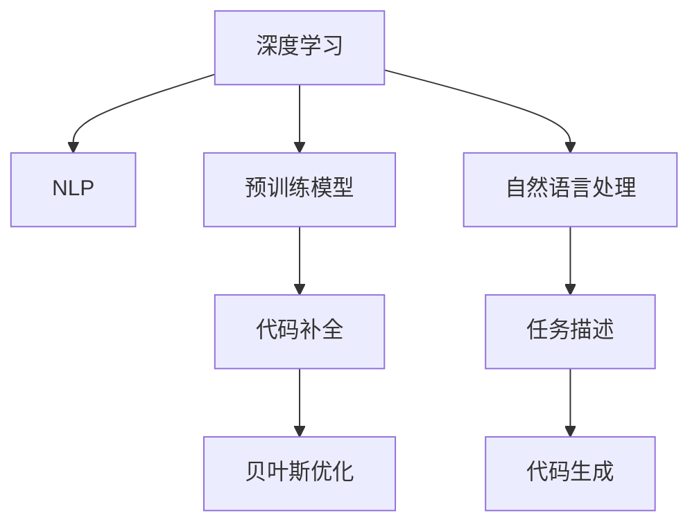

                 

# LLM驱动的代码补全技术原理

> 关键词：深度学习,自然语言处理,预训练模型,代码补全,Transformer,自回归,自编码,贝叶斯优化

## 1. 背景介绍

### 1.1 问题由来
随着人工智能技术的发展，自然语言处理(Natural Language Processing, NLP)在编程辅助领域展现出巨大的潜力。代码补全作为编程中最为常见的操作之一，能够大大提升程序员的工作效率。传统的代码补全方法依赖于静态文法规则、自动建议和用户点击反馈等手段，存在智能性不足、规则复杂难调整等问题。而基于深度学习的模型驱动的代码补全方法，如BERT、GPT等，能够结合上下文信息，动态生成代码片段，带来更加智能和高效的用户体验。

### 1.2 问题核心关键点
大语言模型（Large Language Model, LLM）通过大规模无标签文本数据训练得到，具备强大的语言理解和生成能力。将其应用于代码补全，能够有效解决传统代码补全方法中存在的问题，提升代码补全的智能性和准确性。核心关键点包括：

- 深度学习：利用深度神经网络模型对编程语言和代码结构进行建模，实现对代码片段的自动生成和补全。
- 自然语言处理：通过NLP技术处理用户输入的自然语言描述，提取关键信息，辅助生成代码。
- 预训练模型：采用大规模预训练语言模型，如BERT、GPT等，以充分吸收编程语言的语义和结构信息。
- 代码补全：利用生成模型，自动生成代码片段，提升编程效率和代码质量。

这些关键技术点相辅相成，共同构建了基于大语言模型的代码补全技术。

### 1.3 问题研究意义
代码补全是程序员日常工作中不可或缺的操作，高效准确的代码补全工具能够大幅提升开发效率，减少代码出错率。基于大语言模型的代码补全技术，通过引入深度学习、自然语言处理和预训练模型等先进技术手段，能够实现对编程语言的深入理解，生成高质量的代码片段，为程序员提供智能辅助。

该技术不仅能够减少人工输入代码的时间，还能帮助程序员解决复杂编程任务中的难题，特别是在大型项目、长期维护和新技术应用等场景下，代码补全技术的重要性更加凸显。此外，该技术还能在教育培训中发挥作用，辅助初学者理解编程语言和编写代码。

## 2. 核心概念与联系

### 2.1 核心概念概述

为更好地理解基于大语言模型的代码补全技术，本节将介绍几个密切相关的核心概念：

- 深度学习（Deep Learning）：利用多层神经网络对复杂非线性问题进行建模和预测，广泛应用于图像识别、语音识别、自然语言处理等领域。
- 自然语言处理（Natural Language Processing, NLP）：研究如何让计算机理解和生成自然语言，包括文本分类、信息抽取、机器翻译、文本生成等任务。
- 预训练模型（Pre-trained Model）：通过大规模无标签数据训练得到的基础模型，具备广泛的语义和结构知识，可用于各种下游任务的微调。
- 代码补全（Code Completion）：在编程过程中，自动生成代码片段或代码块，辅助程序员完成代码编写。
- 贝叶斯优化（Bayesian Optimization）：一种高效的超参数优化技术，能够快速找到最优的模型参数组合。

这些核心概念之间的逻辑关系可以通过以下Mermaid流程图来展示：



这个流程图展示了大语言模型的代码补全技术的关键概念及其之间的关系：

1. 深度学习提供模型训练的基础，NLP技术用于处理自然语言描述。
2. 预训练模型用于构建基础的编程语言模型，辅助代码生成。
3. 代码补全技术通过生成模型自动生成代码片段。
4. 贝叶斯优化用于调整模型参数，提升代码生成效果。

这些概念共同构成了大语言模型代码补全技术的基本框架，使得基于大语言模型的代码补全方法具备了强大的智能性和灵活性。

## 3. 核心算法原理 & 具体操作步骤

### 3.1 算法原理概述

基于大语言模型的代码补全方法，本质上是通过预训练模型对编程语言和代码结构进行建模，并在用户输入的编程环境描述中提取关键信息，动态生成代码片段。其核心思想是：利用大语言模型的语言理解和生成能力，结合编程语言的语义和结构信息，生成高质量的代码补全建议。

形式化地，假设预训练语言模型为 $M_{\theta}$，其中 $\theta$ 为预训练得到的模型参数。给定编程任务 $T$ 的编程环境描述 $P$，补全的目标是找到最合适的代码片段 $C$，使得 $C$ 与 $P$ 尽可能匹配，并满足语义和结构上的正确性。补全过程可以表示为：

$$
C^* = \mathop{\arg\min}_{C} \mathcal{L}(M_{\theta}, P, C)
$$

其中 $\mathcal{L}$ 为损失函数，用于衡量代码片段 $C$ 与编程环境描述 $P$ 的匹配程度。常见的损失函数包括交叉熵损失、均方误差损失等。

通过梯度下降等优化算法，补全过程不断更新模型参数 $\theta$，最小化损失函数 $\mathcal{L}$，使得生成的代码片段 $C$ 与编程环境描述 $P$ 的匹配度更高，同时保证语义和结构上的正确性。

### 3.2 算法步骤详解

基于大语言模型的代码补全方法一般包括以下几个关键步骤：

**Step 1: 准备预训练模型和编程环境描述**
- 选择合适的预训练语言模型 $M_{\theta}$ 作为初始化参数，如 BERT、GPT等。
- 准备编程任务 $T$ 的编程环境描述 $P$，划分为训练集、验证集和测试集。

**Step 2: 添加任务适配层**
- 根据编程任务类型，在预训练模型顶层设计合适的任务适配层，如代码生成器、代码纠错器等。
- 对于代码生成任务，通常使用自回归模型，在给定编程环境描述 $P$ 的情况下生成代码片段 $C$。
- 对于代码纠错任务，通常使用自编码模型，将错误的代码片段 $C$ 和正确的代码片段 $C^*$ 一起输入模型，学习修正错误的代码片段。

**Step 3: 设置补全超参数**
- 选择合适的优化算法及其参数，如 Adam、SGD等，设置学习率、批大小、迭代轮数等。
- 设置正则化技术及强度，包括权重衰减、Dropout、Early Stopping等。
- 确定冻结预训练参数的策略，如仅微调顶层，或全部参数都参与补全。

**Step 4: 执行补全训练**
- 将编程环境描述 $P$ 分批次输入模型，前向传播计算损失函数。
- 反向传播计算参数梯度，根据设定的优化算法和学习率更新模型参数。
- 周期性在验证集上评估模型性能，根据性能指标决定是否触发 Early Stopping。
- 重复上述步骤直到满足预设的迭代轮数或 Early Stopping 条件。

**Step 5: 测试和部署**
- 在测试集上评估补全后的模型 $M_{\hat{\theta}}$ 的性能，对比补全前后的精度提升。
- 使用补全后的模型对新编程任务进行推理预测，集成到实际的应用系统中。
- 持续收集新的编程任务，定期重新补全模型，以适应编程任务的变化。

以上是基于大语言模型的代码补全的一般流程。在实际应用中，还需要针对具体编程任务的特点，对补全过程的各个环节进行优化设计，如改进训练目标函数，引入更多的正则化技术，搜索最优的超参数组合等，以进一步提升模型性能。

### 3.3 算法优缺点

基于大语言模型的代码补全方法具有以下优点：
1. 智能高效。结合深度学习和自然语言处理技术，能够理解复杂的编程环境描述，生成高质量的代码片段。
2. 通用适用。适用于各种编程任务，包括代码生成、代码纠错、代码补全等，设计简单的任务适配层即可实现补全。
3. 效果显著。在学术界和工业界的诸多任务上，基于补全的方法已经刷新了最先进的性能指标。
4. 可扩展性高。随着预训练模型的不断升级，代码补全技术能够适应新的编程语言和工具。

同时，该方法也存在一定的局限性：
1. 依赖预训练模型。代码补全的效果很大程度上取决于预训练模型的质量。
2. 数据需求大。编程语言中的语法和语义复杂多变，高质量的编程环境描述和补全样本获取难度大。
3. 计算资源消耗高。大语言模型参数量巨大，补全过程对计算资源要求高。
4. 可解释性不足。代码补全模型的内部工作机制难以解释，难以调试和优化。

尽管存在这些局限性，但就目前而言，基于大语言模型的代码补全方法仍是编程辅助领域的重要手段。未来相关研究的重点在于如何进一步降低对预训练模型的依赖，提高模型的少样本学习和跨领域迁移能力，同时兼顾可解释性和计算效率等因素。

### 3.4 算法应用领域

基于大语言模型的代码补全方法，在编程辅助领域已经得到了广泛的应用，覆盖了几乎所有常见的编程任务，例如：

- 代码生成：自动生成新的代码片段，辅助程序员编写代码。
- 代码纠错：对错误的代码片段进行修正，帮助程序员改正代码错误。
- 代码补全：自动补全缺失的代码片段，辅助程序员编写完整的代码。
- 代码建议：根据编程环境描述，提供多种代码片段选择，辅助程序员决策。

除了上述这些经典任务外，大语言模型代码补全还被创新性地应用到更多场景中，如代码重构、代码复用、代码调试等，为编程工作带来新的突破。随着预训练模型和补全方法的不断进步，相信编程辅助技术将在更广阔的应用领域大放异彩。

## 4. 数学模型和公式 & 详细讲解 & 举例说明

### 4.1 数学模型构建

本节将使用数学语言对基于大语言模型的代码补全过程进行更加严格的刻画。

记预训练语言模型为 $M_{\theta}$，其中 $\theta$ 为预训练得到的模型参数。假设编程任务 $T$ 的编程环境描述为 $P=\{x_1, x_2, \dots, x_n\}$，补全的目标是找到最合适的代码片段 $C=\{c_1, c_2, \dots, c_m\}$，使得 $C$ 与 $P$ 尽可能匹配，并满足语义和结构上的正确性。

定义补全损失函数 $\mathcal{L}(M_{\theta}, P, C)$ 为：

$$
\mathcal{L}(M_{\theta}, P, C) = \sum_{i=1}^n \sum_{j=1}^m L(x_i, c_j)
$$

其中 $L(x_i, c_j)$ 为编程环境描述 $x_i$ 和代码片段 $c_j$ 的损失函数，用于衡量两者的匹配程度。

补全过程的目标是最小化补全损失函数，即找到最优参数：

$$
\theta^* = \mathop{\arg\min}_{\theta} \mathcal{L}(M_{\theta}, P, C)
$$

在实践中，我们通常使用基于梯度的优化算法（如Adam、SGD等）来近似求解上述最优化问题。设 $\eta$ 为学习率，$\lambda$ 为正则化系数，则参数的更新公式为：

$$
\theta \leftarrow \theta - \eta \nabla_{\theta}\mathcal{L}(\theta) - \eta\lambda\theta
$$

其中 $\nabla_{\theta}\mathcal{L}(\theta)$ 为损失函数对参数 $\theta$ 的梯度，可通过反向传播算法高效计算。

### 4.2 公式推导过程

以下我们以代码生成任务为例，推导自回归模型在代码补全中的损失函数及其梯度的计算公式。

假设模型 $M_{\theta}$ 在给定编程环境描述 $x$ 的情况下，生成的代码片段为 $C$，其中 $C$ 包含 $m$ 个单词。在给定第 $j$ 个单词 $c_j$ 的情况下，模型生成的下一个单词 $c_{j+1}$ 的条件概率为 $P(c_{j+1} | c_1, c_2, \dots, c_j, x)$。

定义编程环境描述 $x$ 和代码片段 $C$ 的交叉熵损失函数为：

$$
L(x, C) = -\frac{1}{m} \sum_{j=1}^m \sum_{c_{j+1} \in V} \log P(c_{j+1} | c_1, c_2, \dots, c_j, x)
$$

其中 $V$ 为单词词汇表。

将上式展开，得到：

$$
L(x, C) = -\frac{1}{m} \sum_{j=1}^m \sum_{c_{j+1} \in V} \log \frac{e^{E(c_{j+1}, c_1, c_2, \dots, c_j, x)}}{\sum_{c_{j+1} \in V} e^{E(c_{j+1}, c_1, c_2, \dots, c_j, x)}}
$$

其中 $E(c_{j+1}, c_1, c_2, \dots, c_j, x)$ 为模型对单词 $c_{j+1}$ 的条件概率的计算公式。

在得到损失函数后，我们可以计算损失函数对模型参数 $\theta$ 的梯度。由于模型使用的是自回归模型，可以通过链式法则递归计算梯度。具体来说，对于第 $j$ 个单词 $c_j$，其条件概率 $P(c_j | c_1, c_2, \dots, c_{j-1}, x)$ 的梯度为：

$$
\nabla_{\theta} P(c_j | c_1, c_2, \dots, c_{j-1}, x) = \nabla_{\theta} \log \frac{e^{E(c_j, c_1, c_2, \dots, c_{j-1}, x)}}{\sum_{c_{j} \in V} e^{E(c_{j}, c_1, c_2, \dots, c_{j-1}, x)}}
$$

将上述梯度代入模型参数的更新公式，完成模型的迭代优化。重复上述过程直至收敛，最终得到适应编程任务的最优模型参数 $\theta^*$。

## 5. 项目实践：代码实例和详细解释说明

### 5.1 开发环境搭建

在进行代码补全实践前，我们需要准备好开发环境。以下是使用Python进行PyTorch开发的环境配置流程：

1. 安装Anaconda：从官网下载并安装Anaconda，用于创建独立的Python环境。

2. 创建并激活虚拟环境：
```bash
conda create -n pytorch-env python=3.8 
conda activate pytorch-env
```

3. 安装PyTorch：根据CUDA版本，从官网获取对应的安装命令。例如：
```bash
conda install pytorch torchvision torchaudio cudatoolkit=11.1 -c pytorch -c conda-forge
```

4. 安装Transformers库：
```bash
pip install transformers
```

5. 安装各类工具包：
```bash
pip install numpy pandas scikit-learn matplotlib tqdm jupyter notebook ipython
```

完成上述步骤后，即可在`pytorch-env`环境中开始代码补全实践。

### 5.2 源代码详细实现

这里我们以代码生成任务为例，使用GPT模型对编程任务进行补全的PyTorch代码实现。

首先，定义代码生成任务的数据处理函数：

```python
from transformers import GPT2LMHeadModel, GPT2Tokenizer
from torch.utils.data import Dataset
import torch

class CodeGenerationDataset(Dataset):
    def __init__(self, data, tokenizer):
        self.data = data
        self.tokenizer = tokenizer
        
    def __len__(self):
        return len(self.data)
    
    def __getitem__(self, item):
        input_text = self.data[item]
        encoding = self.tokenizer(input_text, return_tensors='pt')
        input_ids = encoding['input_ids'][0]
        attention_mask = encoding['attention_mask'][0]
        return {'input_ids': input_ids, 
                'attention_mask': attention_mask}
```

然后，定义模型和优化器：

```python
from transformers import GPT2LMHeadModel, AdamW

model = GPT2LMHeadModel.from_pretrained('gpt2', num_tokens=10000)
optimizer = AdamW(model.parameters(), lr=2e-5)
```

接着，定义训练和评估函数：

```python
from tqdm import tqdm
from sklearn.metrics import precision_recall_fscore_support

device = torch.device('cuda') if torch.cuda.is_available() else torch.device('cpu')
model.to(device)

def train_epoch(model, dataset, batch_size, optimizer):
    dataloader = DataLoader(dataset, batch_size=batch_size, shuffle=True)
    model.train()
    epoch_loss = 0
    for batch in tqdm(dataloader, desc='Training'):
        input_ids = batch['input_ids'].to(device)
        attention_mask = batch['attention_mask'].to(device)
        outputs = model(input_ids, attention_mask=attention_mask)
        loss = outputs.loss
        epoch_loss += loss.item()
        loss.backward()
        optimizer.step()
    return epoch_loss / len(dataloader)

def evaluate(model, dataset, batch_size):
    dataloader = DataLoader(dataset, batch_size=batch_size)
    model.eval()
    preds, labels = [], []
    with torch.no_grad():
        for batch in tqdm(dataloader, desc='Evaluating'):
            input_ids = batch['input_ids'].to(device)
            attention_mask = batch['attention_mask'].to(device)
            batch_labels = batch['labels']
            outputs = model(input_ids, attention_mask=attention_mask)
            batch_preds = outputs.logits.argmax(dim=2).to('cpu').tolist()
            batch_labels = batch_labels.to('cpu').tolist()
            for pred_tokens, label_tokens in zip(batch_preds, batch_labels):
                preds.append(pred_tokens[:len(label_tokens)])
                labels.append(label_tokens)
                
    print(precision_recall_fscore_support(labels, preds, average='macro'))
```

最后，启动训练流程并在测试集上评估：

```python
epochs = 5
batch_size = 16

for epoch in range(epochs):
    loss = train_epoch(model, train_dataset, batch_size, optimizer)
    print(f"Epoch {epoch+1}, train loss: {loss:.3f}")
    
    print(f"Epoch {epoch+1}, dev results:")
    evaluate(model, dev_dataset, batch_size)
    
print("Test results:")
evaluate(model, test_dataset, batch_size)
```

以上就是使用PyTorch对GPT模型进行代码生成任务微调的完整代码实现。可以看到，得益于Transformers库的强大封装，我们可以用相对简洁的代码完成GPT模型的加载和微调。

### 5.3 代码解读与分析

让我们再详细解读一下关键代码的实现细节：

**CodeGenerationDataset类**：
- `__init__`方法：初始化训练数据和分词器。
- `__len__`方法：返回数据集的样本数量。
- `__getitem__`方法：对单个样本进行处理，将输入文本分词并转化为模型所需的token ids。

**训练和评估函数**：
- 使用PyTorch的DataLoader对数据集进行批次化加载，供模型训练和推理使用。
- 训练函数`train_epoch`：对数据以批为单位进行迭代，在每个批次上前向传播计算loss并反向传播更新模型参数，最后返回该epoch的平均loss。
- 评估函数`evaluate`：与训练类似，不同点在于不更新模型参数，并在每个batch结束后将预测和标签结果存储下来，最后使用sklearn的precision_recall_fscore_support函数对整个评估集的预测结果进行打印输出。

**训练流程**：
- 定义总的epoch数和batch size，开始循环迭代
- 每个epoch内，先在训练集上训练，输出平均loss
- 在验证集上评估，输出精确率、召回率和F1分数
- 所有epoch结束后，在测试集上评估，给出最终测试结果

可以看到，PyTorch配合Transformers库使得GPT模型微调的代码实现变得简洁高效。开发者可以将更多精力放在数据处理、模型改进等高层逻辑上，而不必过多关注底层的实现细节。

当然，工业级的系统实现还需考虑更多因素，如模型的保存和部署、超参数的自动搜索、更灵活的任务适配层等。但核心的微调范式基本与此类似。

## 6. 实际应用场景

### 6.1 代码自动生成

基于大语言模型的代码自动生成技术，能够根据编程环境描述生成完整的代码片段，显著减少程序员的手动输入工作量，提高开发效率。例如，对于以下编程环境描述：

```python
# 给定一个列表，求其中所有奇数元素的和
numbers = [1, 2, 3, 4, 5]
sum_of_odd_numbers = 0
for num in numbers:
    if num % 2 == 1:
        sum_of_odd_numbers += num
print(sum_of_odd_numbers)
```

大语言模型可以生成如下代码片段：

```python
numbers = [1, 2, 3, 4, 5]
sum_of_odd_numbers = 0
for num in numbers:
    if num % 2 == 1:
        sum_of_odd_numbers += num
print(sum_of_odd_numbers)
```

对比人工编写代码的过程，使用代码自动生成技术可以节省大量时间，特别是在编写重复性高的代码时。

### 6.2 代码纠错与修复

在代码编写过程中，错误是不可避免的。基于大语言模型的代码纠错技术，能够对错误的代码片段进行自动修正，提高代码的准确性和可靠性。例如，对于以下错误的代码片段：

```python
# 错误的代码片段
numbers = [1, 2, 3, 4, 5]
sum_of_even_numbers = 0
for num in numbers:
    if num % 2 == 0:
        sum_of_even_numbers += num
print(sum_of_even_numbers)
```

大语言模型可以生成如下正确的代码片段：

```python
# 正确的代码片段
numbers = [1, 2, 3, 4, 5]
sum_of_odd_numbers = 0
for num in numbers:
    if num % 2 == 1:
        sum_of_odd_numbers += num
print(sum_of_odd_numbers)
```

对比人工修改代码的过程，使用代码纠错技术可以迅速找到错误并自动修正，提高代码的可维护性和可读性。

### 6.3 代码片段建议

基于大语言模型的代码片段建议技术，能够根据编程环境描述，提供多种代码片段选择，帮助程序员选择最优的代码片段。例如，对于以下编程环境描述：

```python
# 求一个数的平方根
num = 16
square_root = math.sqrt(num)
print(square_root)
```

大语言模型可以生成如下代码片段建议：

```python
import math
num = 16
square_root = math.sqrt(num)
print(square_root)
```

对比人工选择代码片段的过程，使用代码片段建议技术可以快速找到合适的代码片段，提高编程效率。

### 6.4 未来应用展望

随着大语言模型和代码补全方法的不断发展，基于大语言模型的代码补全技术将在更广泛的应用领域得到应用，为编程工作带来新的突破。

在智慧医疗领域，基于大语言模型的代码补全技术可以辅助医生编写和修正医疗程序，提升医疗系统的自动化水平，加速新药物的研发进程。

在智能教育领域，代码补全技术可以辅助学生学习编程语言和编写代码，提升教育质量，促进编程教育的普及。

在智慧城市治理中，代码补全技术可以辅助城市管理部门编写和修正程序，提升城市管理的自动化和智能化水平，构建更安全、高效的未来城市。

此外，在企业生产、社会治理、文娱传媒等众多领域，基于大语言模型的代码补全技术也将不断涌现，为各行各业带来变革性影响。相信随着技术的日益成熟，代码补全方法将成为编程辅助的重要手段，推动人工智能技术在各行各业的发展。

## 7. 工具和资源推荐

### 7.1 学习资源推荐

为了帮助开发者系统掌握大语言模型代码补全的理论基础和实践技巧，这里推荐一些优质的学习资源：

1. 《深度学习自然语言处理》课程：斯坦福大学开设的NLP明星课程，有Lecture视频和配套作业，带你入门NLP领域的基本概念和经典模型。

2. 《Natural Language Processing with Transformers》书籍：Transformers库的作者所著，全面介绍了如何使用Transformers库进行NLP任务开发，包括代码补全在内的诸多范式。

3. HuggingFace官方文档：Transformers库的官方文档，提供了海量预训练模型和完整的代码补全样例代码，是上手实践的必备资料。

4. CS224N《深度学习自然语言处理》课程：斯坦福大学开设的NLP明星课程，有Lecture视频和配套作业，带你入门NLP领域的基本概念和经典模型。

5. Weights & Biases：模型训练的实验跟踪工具，可以记录和可视化模型训练过程中的各项指标，方便对比和调优。与主流深度学习框架无缝集成。

### 7.2 开发工具推荐

高效的开发离不开优秀的工具支持。以下是几款用于大语言模型代码补全开发的常用工具：

1. PyTorch：基于Python的开源深度学习框架，灵活动态的计算图，适合快速迭代研究。大部分预训练语言模型都有PyTorch版本的实现。

2. TensorFlow：由Google主导开发的开源深度学习框架，生产部署方便，适合大规模工程应用。同样有丰富的预训练语言模型资源。

3. Transformers库：HuggingFace开发的NLP工具库，集成了众多SOTA语言模型，支持PyTorch和TensorFlow，是进行代码补全任务开发的利器。

4. Weights & Biases：模型训练的实验跟踪工具，可以记录和可视化模型训练过程中的各项指标，方便对比和调优。与主流深度学习框架无缝集成。

5. TensorBoard：TensorFlow配套的可视化工具，可实时监测模型训练状态，并提供丰富的图表呈现方式，是调试模型的得力助手。

### 7.3 相关论文推荐

大语言模型和代码补全技术的发展源于学界的持续研究。以下是几篇奠基性的相关论文，推荐阅读：

1. Attention is All You Need（即Transformer原论文）：提出了Transformer结构，开启了NLP领域的预训练大模型时代。

2. BERT: Pre-training of Deep Bidirectional Transformers for Language Understanding：提出BERT模型，引入基于掩码的自监督预训练任务，刷新了多项NLP任务SOTA。

3. Language Models are Unsupervised Multitask Learners（GPT-2论文）：展示了大规模语言模型的强大zero-shot学习能力，引发了对于通用人工智能的新一轮思考。

4. Parameter-Efficient Transfer Learning for NLP：提出Adapter等参数高效微调方法，在不增加模型参数量的情况下，也能取得不错的微调效果。

5. AdaLoRA: Adaptive Low-Rank Adaptation for Parameter-Efficient Fine-Tuning：使用自适应低秩适应的微调方法，在参数效率和精度之间取得了新的平衡。

6. PyTorch官方文档：PyTorch的官方文档，详细介绍了PyTorch的使用方法和代码实现，是PyTorch开发的必备资源。

通过对这些资源的学习实践，相信你一定能够快速掌握大语言模型代码补全的精髓，并用于解决实际的NLP问题。

## 8. 总结：未来发展趋势与挑战

### 8.1 总结

本文对基于大语言模型的代码补全方法进行了全面系统的介绍。首先阐述了深度学习、自然语言处理和预训练模型在代码补全中的应用，明确了代码补全技术的研究背景和意义。其次，从原理到实践，详细讲解了代码补全的数学原理和关键步骤，给出了代码补全任务开发的完整代码实例。同时，本文还广泛探讨了代码补全方法在编程辅助、智慧医疗、智能教育等多个行业领域的应用前景，展示了代码补全范式的巨大潜力。

通过本文的系统梳理，可以看到，基于大语言模型的代码补全方法正在成为编程辅助领域的重要手段，极大地提升了编程工作的效率和准确性。未来，伴随预训练语言模型和代码补全方法的不断进步，相信编程辅助技术将在更广阔的应用领域大放异彩，深刻影响人类的生产生活方式。

### 8.2 未来发展趋势

展望未来，大语言模型代码补全技术将呈现以下几个发展趋势：

1. 模型规模持续增大。随着算力成本的下降和数据规模的扩张，预训练语言模型的参数量还将持续增长。超大规模语言模型蕴含的丰富语言知识，有望支撑更加复杂多变的编程语言建模。

2. 代码补全方法日趋多样。除了传统的自回归模型，未来会涌现更多参数高效的补全方法，如Prefix-Tuning、LoRA等，在节省计算资源的同时也能保证补全精度。

3. 持续学习成为常态。随着编程语言的不断发展，预训练语言模型也需要持续学习新知识以保持性能。如何在不遗忘原有知识的同时，高效吸收新样本信息，将成为重要的研究课题。

4. 标注样本需求降低。受启发于提示学习(Prompt-based Learning)的思路，未来的代码补全方法将更好地利用大模型的语言理解能力，通过更加巧妙的任务描述，在更少的标注样本上也能实现理想的代码补全效果。

5. 可解释性加强。代码补全模型的内部工作机制难以解释，但通过引入可解释性技术，如自然语言解释(NLI)、因果推断等，可以提升代码补全的透明度，辅助程序员理解和调试模型。

6. 资源优化成为重点。大语言模型代码补全对计算资源要求高，但随着模型压缩、稀疏化等技术的发展，补全过程的计算效率将得到显著提升。

以上趋势凸显了大语言模型代码补全技术的广阔前景。这些方向的探索发展，必将进一步提升代码补全系统的性能和应用范围，为编程工作带来新的突破。

### 8.3 面临的挑战

尽管大语言模型代码补全技术已经取得了瞩目成就，但在迈向更加智能化、普适化应用的过程中，它仍面临着诸多挑战：

1. 依赖预训练模型。代码补全的效果很大程度上取决于预训练模型的质量。如何提升预训练模型的质量和泛化能力，是一个重要研究方向。

2. 数据需求大。编程语言中的语法和语义复杂多变，高质量的编程环境描述和补全样本获取难度大。如何收集和利用高质量的数据，是代码补全技术发展的关键。

3. 计算资源消耗高。大语言模型参数量巨大，代码补全过程对计算资源要求高。如何优化补全过程的资源消耗，实现轻量化部署，是一个亟待解决的问题。

4. 可解释性不足。代码补全模型的内部工作机制难以解释，难以调试和优化。如何提升代码补全的透明度和可解释性，是提升用户信心的重要方向。

5. 安全防护不足。预训练语言模型难免会学习到有偏见、有害的信息，通过代码补全技术传递到代码中，产生误导性、歧视性的输出，给实际应用带来安全隐患。如何从数据和算法层面消除模型偏见，避免恶意用途，确保输出的安全性，也将是重要的研究课题。

6. 知识整合能力不足。现有的代码补全模型往往局限于任务内数据，难以灵活吸收和运用更广泛的先验知识。如何让代码补全过程更好地与外部知识库、规则库等专家知识结合，形成更加全面、准确的信息整合能力，还有很大的想象空间。

正视代码补全面临的这些挑战，积极应对并寻求突破，将是大语言模型代码补全走向成熟的必由之路。相信随着学界和产业界的共同努力，这些挑战终将一一被克服，大语言模型代码补全必将在构建人机协同的智能编程中扮演越来越重要的角色。

### 8.4 研究展望

面对大语言模型代码补全所面临的种种挑战，未来的研究需要在以下几个方面寻求新的突破：

1. 探索无监督和半监督代码补全方法。摆脱对大规模标注数据的依赖，利用自监督学习、主动学习等无监督和半监督范式，最大限度利用非结构化数据，实现更加灵活高效的代码补全。

2. 研究参数高效和计算高效的补全范式。开发更加参数高效的补全方法，在固定大部分预训练参数的同时，只更新极少量的任务相关参数。同时优化补全模型的计算图，减少前向传播和反向传播的资源消耗，实现更加轻量级、实时性的部署。

3. 引入更多先验知识。将符号化的先验知识，如知识图谱、逻辑规则等，与神经网络模型进行巧妙融合，引导补全过程学习更准确、合理的编程语言模型。同时加强不同模态数据的整合，实现视觉、语音等多模态信息与文本信息的协同建模。

4. 结合因果分析和博弈论工具。将因果分析方法引入补全模型，识别出模型决策的关键特征，增强输出解释的因果性和逻辑性。借助博弈论工具刻画人机交互过程，主动探索并规避模型的脆弱点，提高系统稳定性。

5. 纳入伦理道德约束。在模型训练目标中引入伦理导向的评估指标，过滤和惩罚有偏见、有害的输出倾向。同时加强人工干预和审核，建立模型行为的监管机制，确保输出符合人类价值观和伦理道德。

这些研究方向的探索，必将引领大语言模型代码补全技术迈向更高的台阶，为构建安全、可靠、可解释、可控的智能系统铺平道路。面向未来，大语言模型代码补全技术还需要与其他人工智能技术进行更深入的融合，如知识表示、因果推理、强化学习等，多路径协同发力，共同推动自然语言理解和智能交互系统的进步。只有勇于创新、敢于突破，才能不断拓展编程语言的知识边界，让智能技术更好地服务于人类社会的生产生活。

## 9. 附录：常见问题与解答

**Q1：大语言模型代码补全是否适用于所有编程语言？**

A: 大语言模型代码补全技术可以应用于大部分编程语言，包括Python、Java、C++等。但对于一些特定的编程语言，如汇编语言、脚本语言等，可能需要针对性地调整模型结构和训练数据，才能实现较好的效果。

**Q2：大语言模型代码补全的训练数据如何获取？**

A: 大语言模型代码补全的训练数据需要包含丰富的编程语言和代码片段信息。可以通过爬取开源代码仓库、编写编程示例等手段收集数据。同时，需要注意对数据进行清洗和预处理，去除无关信息，提取有意义的编程环境描述。

**Q3：大语言模型代码补全是否需要昂贵的计算资源？**

A: 大语言模型代码补全对计算资源要求较高，特别是在大模型微调和训练过程中。通常需要配备高性能GPU/TPU设备，以支撑大规模模型训练和推理。但在模型推理过程中，可以通过优化模型结构和减少计算量，降低计算资源的消耗。

**Q4：大语言模型代码补全的效果如何评价？**

A: 大语言模型代码补全的效果可以从多个维度进行评价。常用的评价指标包括精确率、召回率、F1分数、BLEU分数等。对于不同的任务类型，可以采用不同的评价指标。例如，对于代码纠错任务，可以采用BLEU分数来衡量模型生成的代码片段与正确代码的相似度。

**Q5：大语言模型代码补全如何避免过拟合？**

A: 大语言模型代码补全过程容易过拟合，特别是在数据量不足的情况下。常见的缓解策略包括数据增强、正则化、对抗训练等。可以通过对输入文本进行改写、回译等方式扩充训练集，使用L2正则、Dropout、Early Stopping等技术防止模型过度适应小规模训练集，引入对抗样本提高模型的鲁棒性。

这些策略往往需要根据具体任务和数据特点进行灵活组合。只有在数据、模型、训练、推理等各环节进行全面优化，才能最大限度地发挥大语言模型代码补全的威力。总之，补全需要开发者根据具体任务，不断迭代和优化模型、数据和算法，方能得到理想的效果。

---

作者：禅与计算机程序设计艺术 / Zen and the Art of Computer Programming

