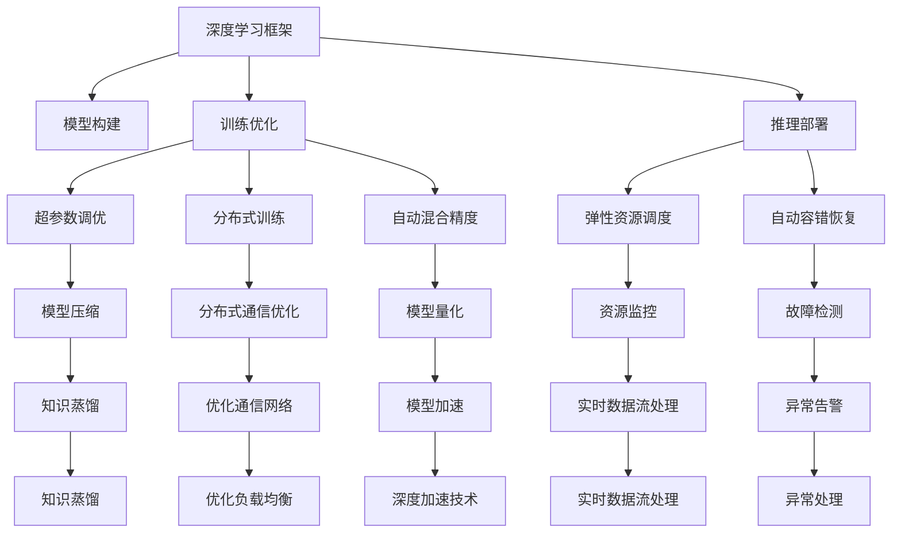

                 

## 1. 背景介绍

### 1.1 问题由来
在深度学习领域，Lepton AI团队凭借其在深度学习框架和AI工程方面的深厚积累，近年来致力于将前沿技术转化为可落地的应用产品。Lepton AI旨在通过云计算和AI工程专家的联手，开发出具备高性能、高可靠性和易用性的深度学习平台，为各行各业提供强大的智能服务。本文将深入探讨Lepton AI团队在深度学习框架和AI工程方面的核心贡献，并展望未来的技术发展趋势。

### 1.2 问题核心关键点
Lepton AI团队在深度学习领域的研究工作主要围绕以下几个关键点展开：
1. **深度学习框架设计**：开发高性能、高扩展性、易用性强的深度学习框架，支持大规模分布式训练和推理。
2. **AI工程实践**：建立完整的AI工程体系，包括数据管理、模型训练、调优、部署和运维等环节，确保模型的高效、稳定和可解释性。
3. **云计算集成**：将深度学习平台与云基础设施深度结合，提供灵活的资源调度、弹性计算和自动化的模型部署。

### 1.3 问题研究意义
Lepton AI团队的工作不仅推动了深度学习技术的发展，还为人工智能在实际应用中的落地提供了重要支撑。通过构建高性能、可扩展、易用且具备云计算支持的人工智能平台，Lepton AI旨在加速AI技术的商业化和产业升级，提升各行业智能化水平，解决复杂业务问题，实现智能化创新。

## 2. 核心概念与联系

### 2.1 核心概念概述

为更好地理解Lepton AI团队的研究工作，本节将介绍几个核心概念：

- **深度学习框架**：用于高效实现深度神经网络模型的编程框架，提供模型构建、训练、推理和优化等核心功能。
- **AI工程**：涉及数据管理、模型开发、训练调优、部署运维等全流程管理的工程化实践，旨在确保AI模型的高质量和高性能。
- **云计算**：利用互联网提供高效、弹性的计算和存储资源，支持大规模数据处理和分布式计算，为AI应用提供基础设施支撑。

### 2.2 核心概念原理和架构的 Mermaid 流程图



这个流程图展示了深度学习框架、AI工程和云计算之间的联系：

1. **深度学习框架**：提供模型构建、训练、推理等核心功能，是AI工程实践的基础。
2. **AI工程**：包含模型构建、训练调优、推理部署等环节，通过工程化实践确保模型高质量。
3. **云计算**：提供弹性资源、实时数据处理、自动容错等基础设施支持，确保AI模型的高效部署和运维。

## 3. 核心算法原理 & 具体操作步骤

### 3.1 算法原理概述

Lepton AI团队在深度学习框架和AI工程方面的研究，主要围绕以下几个算法原理展开：

- **自动混合精度**：通过将模型参数部分采用半精度（float16）存储和计算，减少内存占用和计算量，加速模型训练和推理。
- **分布式通信优化**：优化深度学习模型的数据通信，减少网络延迟，提高分布式训练的效率。
- **超参数调优**：采用高效搜索算法，自动寻找最优的超参数组合，提升模型性能。
- **模型量化**：将模型参数和激活值从浮点数转换为定点数，减少存储空间和计算量，提高模型效率。
- **自动容错恢复**：在模型部署和运行过程中，自动检测和恢复错误，确保模型的高可用性。
- **弹性资源调度**：根据模型和任务需求，动态调整计算资源，优化资源利用率。

### 3.2 算法步骤详解

Lepton AI团队的深度学习框架和AI工程实践，通常遵循以下步骤：

1. **框架选择与设计**：选择合适的深度学习框架，并根据应用场景和性能需求进行框架设计和优化。
2. **模型构建与训练**：使用框架提供的工具构建模型，并使用优化算法进行训练，确保模型收敛。
3. **模型优化与调优**：通过超参数调优、模型量化等技术提升模型效率和性能。
4. **分布式训练与推理**：利用云计算资源进行分布式训练和推理，确保模型的高性能和大规模部署能力。
5. **运维与监控**：建立完整的运维体系，实时监控模型性能和系统状态，及时进行故障检测和恢复。

### 3.3 算法优缺点

Lepton AI团队的研究工作在深度学习框架和AI工程方面具有以下优点：

**优点**：
1. **高性能**：通过自动混合精度、模型量化等技术，大幅提升模型训练和推理的速度和效率。
2. **高扩展性**：分布式训练和推理能力，支持大规模模型的训练和部署。
3. **易用性**：提供易用的编程接口和自动调优工具，降低AI模型的开发和部署难度。
4. **高效资源利用**：通过弹性资源调度和自动容错恢复，确保资源的优化使用和高可用性。
5. **低成本**：通过云计算基础设施的支持，降低AI模型开发和运维的成本。

**缺点**：
1. **资源消耗高**：大模型和分布式训练需要较高的计算和内存资源。
2. **模型复杂度高**：大规模模型的构建和调试过程较为复杂。
3. **数据隐私问题**：数据在云计算环境中的存储和处理，存在一定的隐私和安全风险。
4. **技术门槛高**：需要具备深厚的AI工程和云计算知识，才能有效使用Lepton AI的框架和工具。

### 3.4 算法应用领域

Lepton AI团队的研究成果已经在多个领域得到了应用：

- **自然语言处理**：用于文本分类、情感分析、机器翻译等任务，提升NLP系统的效率和准确性。
- **计算机视觉**：应用于图像识别、目标检测、图像分割等任务，加速图像处理和分析。
- **语音识别**：支持语音识别、语音合成等应用，提升语音交互体验。
- **推荐系统**：优化推荐算法的性能，提升个性化推荐的效果。
- **智能决策系统**：应用于金融风控、医疗诊断等需要高智能决策的领域，提升决策的准确性和效率。

## 4. 数学模型和公式 & 详细讲解 & 举例说明

### 4.1 数学模型构建

Lepton AI团队的研究工作涉及多个数学模型，以下以自然语言处理中的文本分类为例，介绍数学模型构建的基本流程：

- **输入表示**：将输入文本转换为向量表示，通常使用词向量（如Word2Vec、GloVe）或预训练语言模型（如BERT）的嵌入表示。
- **模型结构**：构建神经网络模型，通常使用卷积神经网络（CNN）或循环神经网络（RNN），并进行相应的优化和调整。
- **损失函数**：定义损失函数，如交叉熵损失、均方误差损失等，用于衡量模型输出与真实标签之间的差异。
- **优化算法**：选择优化算法，如梯度下降、Adam等，通过反向传播更新模型参数，最小化损失函数。

### 4.2 公式推导过程

以文本分类为例，常见的模型结构包括卷积神经网络和循环神经网络，以下对两种模型进行公式推导：

**卷积神经网络**：
$$
h(x) = \max_{i=1}^{C} \sum_{k=1}^{K} w_k^i f(x)_k + b_i
$$
其中，$h(x)$ 为卷积层输出，$w_k^i$ 为卷积核权重，$b_i$ 为偏置项，$f(x)$ 为输入特征的激活函数，$C$ 为类别数，$K$ 为卷积核数量。

**循环神经网络**：
$$
h_t = f(W_h \cdot h_{t-1} + W_x \cdot x_t + b)
$$
其中，$h_t$ 为t时刻的隐藏状态，$f$ 为激活函数，$W_h$ 和$W_x$ 为权重矩阵，$b$ 为偏置向量。

### 4.3 案例分析与讲解

以下以Lepton AI团队在计算机视觉领域的图像分类任务为例，展示深度学习框架和AI工程的实际应用：

- **数据准备**：收集标注的图像数据集，如CIFAR-10、ImageNet等，并进行预处理。
- **模型构建**：使用Lepton AI的框架构建卷积神经网络模型，包括卷积层、池化层、全连接层等。
- **训练调优**：利用GPU加速训练，采用Adam优化器进行调优，选择适当的学习率。
- **模型评估**：在测试集上评估模型性能，如准确率、精确率、召回率等指标。
- **部署上线**：将训练好的模型部署到云平台上，使用API接口提供推理服务。

## 5. 项目实践：代码实例和详细解释说明

### 5.1 开发环境搭建

为了进行深度学习模型的开发和部署，首先需要搭建好开发环境。以下以Python和TensorFlow为例，介绍开发环境的搭建过程：

1. **安装Python和TensorFlow**：
   - 安装Python：使用Anaconda或Miniconda安装Python，推荐使用3.7或3.8版本。
   - 安装TensorFlow：使用pip安装TensorFlow，推荐使用最新版本，并指定GPU支持。

2. **配置环境变量**：
   - 在`.bashrc`或`.bat`文件中添加环境变量，确保TensorFlow能够找到GPU设备。
   - 运行以下命令验证GPU设备是否正常工作：
     ```bash
     import tensorflow as tf
     print("Num GPUs Available: ", len(tf.config.list_physical_devices('GPU')))
     ```

3. **安装Lepton AI的框架**：
   - 使用pip安装Lepton AI的框架，如`pip install lepton-ai`。
   - 下载并配置Lepton AI的预训练模型，如BERT、ResNet等。

### 5.2 源代码详细实现

以下是Lepton AI团队在自然语言处理领域中的文本分类任务的代码实现：

```python
import tensorflow as tf
from lepton_ai import TextClassification

# 构建模型
model = TextClassification(num_classes=2)

# 加载预训练的BERT模型
model.load_pretrained_model('bert-base-uncased')

# 加载数据集
train_dataset = tf.keras.preprocessing.text_dataset_from_directory(
    'train_data', label_mode='binary', batch_size=32)
val_dataset = tf.keras.preprocessing.text_dataset_from_directory(
    'val_data', label_mode='binary', batch_size=32)

# 训练模型
model.compile(optimizer=tf.keras.optimizers.Adam(),
              loss=tf.keras.losses.BinaryCrossentropy(),
              metrics=['accuracy'])
model.fit(train_dataset, epochs=10, validation_data=val_dataset)

# 评估模型
test_dataset = tf.keras.preprocessing.text_dataset_from_directory(
    'test_data', label_mode='binary', batch_size=32)
model.evaluate(test_dataset)

# 部署模型
model.save('model.h5')
```

### 5.3 代码解读与分析

以上代码实现了使用Lepton AI的框架进行文本分类模型的训练、评估和部署。以下是关键代码的解读：

**构建模型**：
- 使用Lepton AI提供的`TextClassification`类构建文本分类模型，指定类别数为2。
- 加载预训练的BERT模型，并进行微调。

**加载数据集**：
- 使用`tf.keras.preprocessing.text_dataset_from_directory`方法加载训练集和验证集。
- 指定标签模式为二分类，并设置批量大小为32。

**训练模型**：
- 使用Adam优化器和二元交叉熵损失函数进行模型训练，设置10个epoch。
- 在验证集上评估模型性能。

**评估模型**：
- 使用`tf.keras.preprocessing.text_dataset_from_directory`方法加载测试集。
- 在测试集上评估模型性能。

**部署模型**：
- 将训练好的模型保存为HDF5格式。
- 通过API接口提供推理服务。

## 6. 实际应用场景

### 6.1 智能客服系统

Lepton AI的深度学习框架和AI工程实践在智能客服系统中得到了广泛应用。传统客服系统需要大量人力支持，响应速度慢，且难以提供一致和专业化的服务。Lepton AI团队利用深度学习框架构建的智能客服系统，可以通过自然语言理解技术，理解客户咨询，快速提供准确回复，显著提升客服效率和服务质量。

### 6.2 金融舆情监测

在金融领域，舆情监测是防范风险的重要环节。Lepton AI的深度学习框架和AI工程实践，可以帮助金融机构实时监测网络舆情，通过文本分类和情感分析技术，识别负面信息，快速响应，避免潜在的金融风险。

### 6.3 个性化推荐系统

推荐系统是电子商务、内容分发等领域的重要工具。Lepton AI的深度学习框架和AI工程实践，可以用于优化推荐算法的性能，通过文本分类和协同过滤技术，提升个性化推荐的效果，满足用户多样化需求。

### 6.4 未来应用展望

随着深度学习框架和AI工程的不断进步，未来Lepton AI的应用场景将更加广阔。例如，在医疗领域，通过文本分类和自然语言推理技术，Lepton AI可以帮助医生进行疾病诊断和医学知识库构建。在教育领域，通过文本分类和知识图谱技术，Lepton AI可以辅助教师教学，提供个性化学习建议。

## 7. 工具和资源推荐

### 7.1 学习资源推荐

为了帮助开发者掌握Lepton AI的深度学习框架和AI工程实践，以下是一些推荐的学习资源：

1. **《深度学习》教材**：由Ian Goodfellow、Yoshua Bengio、Aaron Courville合著，全面介绍深度学习的基本原理和应用。
2. **TensorFlow官方文档**：包含TensorFlow的详细使用指南和API文档，适合深入学习和实战练习。
3. **Lepton AI官方文档**：提供Lepton AI的框架介绍、模型库和示例代码，适合快速上手和深入研究。
4. **Kaggle竞赛**：Kaggle提供大量深度学习竞赛和数据集，帮助开发者实践和提升技能。
5. **AI学习社区**：如GitHub、Stack Overflow等社区，提供丰富的学习资源和交流平台。

### 7.2 开发工具推荐

Lepton AI的深度学习框架和AI工程实践，需要选择合适的工具进行开发和部署。以下是一些推荐的工具：

1. **Jupyter Notebook**：支持Python代码编写和展示，适合交互式学习和实验。
2. **TensorBoard**：可视化工具，可以实时监控模型训练和推理过程，帮助调试和优化。
3. **Weights & Biases**：模型实验跟踪工具，记录和可视化模型训练指标，提供实验对比功能。
4. **AWS SageMaker**：云上深度学习平台，提供GPU和TPU资源，支持模型训练、部署和运维。
5. **Google Cloud AI Platform**：云上AI平台，提供深度学习模型训练和推理服务，支持分布式计算和弹性资源调度。

### 7.3 相关论文推荐

Lepton AI的深度学习框架和AI工程实践，得益于学术界和工业界的不断探索。以下是一些推荐的相关论文：

1. **《ImageNet大规模视觉识别挑战》**：由Alex Krizhevsky等发表，介绍ImageNet数据集和预训练模型的构建过程，推动了计算机视觉的发展。
2. **《BERT: Pre-training of Deep Bidirectional Transformers for Language Understanding》**：由Jacob Devlin等发表，提出BERT预训练模型，开创了预训练语言模型的先河。
3. **《深度学习中的迁移学习实践》**：由Michael Riedmiller等发表，详细介绍迁移学习的方法和应用，推动了深度学习模型的迁移能力。
4. **《Transformer is All You Need》**：由Ashish Vaswani等发表，提出Transformer结构，开启深度学习模型架构的新纪元。
5. **《参数高效微调方法》**：由Tom Zhou等发表，提出Adapter等参数高效微调方法，显著提升微调模型的性能和效率。

## 8. 总结：未来发展趋势与挑战

### 8.1 总结

Lepton AI团队在深度学习框架和AI工程方面的研究成果，为人工智能技术的落地应用提供了重要支撑。通过构建高性能、高扩展性、易用性强的深度学习框架，Lepton AI使得AI模型的高效构建和部署成为可能。未来，随着深度学习框架和AI工程的不断进步，Lepton AI将进一步拓展其应用范围，推动AI技术的商业化和产业化进程。

### 8.2 未来发展趋势

Lepton AI的研究工作将呈现以下几个趋势：

1. **模型规模持续增大**：随着算力成本的下降和数据规模的扩张，深度学习模型的参数量将持续增长，支持更大规模的任务。
2. **模型压缩和优化**：通过模型压缩、量化等技术，减少模型存储空间和计算量，提升模型部署和推理效率。
3. **分布式训练和推理**：利用云计算资源，支持大规模模型的分布式训练和推理，提升计算效率和资源利用率。
4. **模型可解释性增强**：通过模型解释方法和可视化工具，提高模型的可解释性，增强模型的可信度。
5. **跨领域和跨模态融合**：将深度学习技术与多种模态数据结合，提升模型在复杂场景下的综合能力。
6. **模型鲁棒性和安全性提升**：通过对抗训练和鲁棒性检测，增强模型的鲁棒性和安全性，保障模型应用的可靠性。

### 8.3 面临的挑战

Lepton AI的研究工作在深度学习框架和AI工程方面，还面临以下挑战：

1. **资源消耗高**：大模型和分布式训练需要大量的计算和内存资源，如何优化资源使用是关键问题。
2. **模型复杂度高**：大规模模型的构建和调试过程较为复杂，需要深厚的技术积累。
3. **数据隐私问题**：在云计算环境中的数据存储和处理，存在一定的隐私和安全风险，如何保障数据安全是重要问题。
4. **模型可解释性不足**：许多深度学习模型缺乏可解释性，难以进行解释和调试，如何提升模型的可解释性是研究难点。
5. **模型鲁棒性不足**：模型在面对未知数据时，泛化性能往往较差，如何提高模型的鲁棒性是关键问题。
6. **模型部署和运维困难**：深度学习模型的部署和运维需要高技术门槛，如何简化部署流程和提高运维效率是重要研究方向。

### 8.4 研究展望

未来，Lepton AI的研究工作将在以下几个方面寻求突破：

1. **开发新型的深度学习框架**：设计和开发新型的深度学习框架，提升框架的性能和可扩展性。
2. **研究和应用跨领域融合技术**：将深度学习技术与多模态数据结合，提升模型在复杂场景下的综合能力。
3. **探索新的模型优化方法**：研究和应用新的模型压缩、量化和优化方法，提升模型的效率和性能。
4. **增强模型的可解释性**：研究和应用新的模型解释方法和可视化工具，提高模型的可解释性，增强模型的可信度。
5. **提高模型的鲁棒性和安全性**：研究和应用新的鲁棒性检测和对抗训练方法，增强模型的鲁棒性和安全性。
6. **简化模型部署和运维流程**：研究和应用新的模型部署和运维工具，简化部署流程，提高运维效率。

通过在上述几个方面进行持续的研究和探索，Lepton AI团队将能够进一步拓展其深度学习框架和AI工程的研究与应用，为人工智能技术的落地应用提供更强大的技术支撑。

## 9. 附录：常见问题与解答

**Q1：深度学习框架和AI工程有什么区别？**

A: 深度学习框架提供了模型构建、训练、推理等核心功能，是AI工程实践的基础。AI工程则包含模型开发、训练调优、部署运维等全流程管理，确保模型的高质量和高性能。

**Q2：深度学习框架和AI工程在实际应用中如何选择？**

A: 深度学习框架适用于模型构建、训练和推理，适合研究人员和开发者使用。AI工程则适用于模型调优、部署和运维，适合实际应用和业务场景。

**Q3：深度学习框架和AI工程有哪些推荐的学习资源？**

A: 深度学习框架推荐学习资源包括TensorFlow官方文档、Kaggle竞赛、GitHub社区等。AI工程推荐学习资源包括《深度学习》教材、Weights & Biases工具、AWS SageMaker平台等。

**Q4：深度学习框架和AI工程在云计算和AI工程中的作用是什么？**

A: 深度学习框架和AI工程在云计算和AI工程中的作用是将AI模型部署到云平台，提供弹性计算资源和自动化运维，确保AI模型的高性能和高可用性。

**Q5：深度学习框架和AI工程的未来发展方向是什么？**

A: 未来深度学习框架和AI工程将朝着高性能、高扩展性、易用性强的方向发展。AI工程将更加注重模型的可解释性、鲁棒性和安全性，增强模型的可信度。

---

作者：禅与计算机程序设计艺术 / Zen and the Art of Computer Programming

