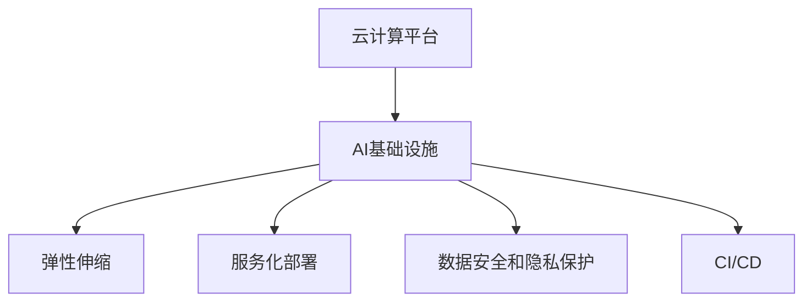

                 

# Lepton AI的云计算优势：深度整合云资源，打造高效灵活的AI基础设施

在现代人工智能（AI）技术的发展过程中，云计算已经成为了不可或缺的基础设施。它不仅提供了庞大的计算资源，还提供了弹性伸缩、数据安全、服务化部署等关键能力，支持AI应用的快速迭代和业务创新。本文将深入探讨Lepton AI如何在云计算环境下深度整合资源，打造高效、灵活、可扩展的AI基础设施。

## 1. 背景介绍

随着深度学习技术的发展，人工智能应用变得愈加复杂，所需的数据量和计算能力也急剧增加。为了应对这种需求，云计算应运而生，它提供了庞大的计算资源和灵活的资源管理能力，成为支持AI应用的重要基础设施。

### 1.1 云计算基本概念

云计算是一种按需提供计算资源和服务的模式，通常包括以下几种类型：

- **基础设施即服务（IaaS）**：提供虚拟机、存储空间、网络等底层基础设施。
- **平台即服务（PaaS）**：提供开发、运行和扩展应用程序的完整平台。
- **软件即服务（SaaS）**：直接提供应用软件，供用户使用。

云计算的显著优势在于其按需扩展、弹性伸缩和动态资源管理能力，能够支持大规模、高并发的AI应用。

### 1.2 云计算与AI的融合

AI的创新离不开大规模数据和高效计算的支持。云计算不仅提供了丰富的数据资源和计算能力，还通过弹性伸缩、服务化部署等特性，支持AI应用的快速迭代和业务创新。

## 2. 核心概念与联系

### 2.1 核心概念概述

为了深入理解Lepton AI如何在云计算环境下整合资源，我们需要首先掌握以下几个核心概念：

- **云计算平台**：如AWS、Google Cloud、Azure等，提供基础设施和服务的公共平台。
- **AI基础设施**：由硬件、软件、数据等组成，支持AI应用的全生命周期管理。
- **弹性伸缩**：根据业务需求动态调整计算资源。
- **服务化部署**：将AI应用封装为可复用的服务，便于调用和集成。
- **数据安全和隐私保护**：确保数据在存储、传输和使用过程中的安全。
- **持续集成和持续部署（CI/CD）**：实现自动化构建、测试、部署，加速模型迭代。

这些概念之间的联系可以通过以下Mermaid流程图来展示：



这个流程图展示了云计算平台与AI基础设施之间的关系，以及AI基础设施中各个关键组件的协同作用。

### 2.2 核心概念原理和架构

#### 2.2.1 云计算平台原理

云计算平台提供统一的资源接口，隐藏底层基础设施的复杂性，便于用户按需使用计算资源。其核心原理包括：

- **资源池化**：将物理资源虚拟化为多个计算单元，按需分配给不同用户。
- **服务封装**：将计算资源和服务封装为标准化的API接口，便于用户调用。
- **弹性伸缩**：根据业务需求动态调整资源，优化成本和性能。

云计算平台的基本架构如图1所示：

```
    层 1: 基础设施层
    层 2: 平台层
    层 3: 应用层
    层 4: 用户接口层
    层 5: 管理层
```


#### 2.2.2 AI基础设施原理

AI基础设施由硬件、软件和数据组成，支持AI应用的全生命周期管理。其核心原理包括：

- **硬件支持**：如GPU、TPU、CPU等，提供高效的计算能力。
- **软件支持**：如TensorFlow、PyTorch等，提供强大的计算框架。
- **数据支持**：如分布式存储、大数据处理等，提供大规模数据支持。
- **弹性伸缩**：根据任务需求动态调整资源，优化成本和性能。
- **服务化部署**：将AI应用封装为标准化的API接口，便于调用和集成。

AI基础设施的基本架构如图2所示：

```
    层 1: 数据层
    层 2: 模型训练层
    层 3: 模型推理层
    层 4: 应用层
    层 5: 用户接口层
    层 6: 管理层
```


## 3. 核心算法原理 & 具体操作步骤

### 3.1 算法原理概述

Lepton AI通过深度整合云计算资源，打造高效、灵活的AI基础设施，主要包括以下几个关键算法原理：

#### 3.1.1 弹性伸缩算法

弹性伸缩算法是Lepton AI的核心算法之一。其核心思想是根据业务需求动态调整计算资源，优化成本和性能。具体实现包括：

1. **资源监控**：通过监控AI应用的需求，识别计算资源瓶颈。
2. **自动调整**：根据资源监控结果，自动调整计算资源。
3. **动态扩缩**：根据业务需求动态扩展或缩减资源，确保系统性能。

#### 3.1.2 服务化部署算法

服务化部署算法是Lepton AI的另一个重要算法。其核心思想是将AI应用封装为标准化的API接口，便于调用和集成。具体实现包括：

1. **API定义**：定义AI应用的API接口，包括输入、输出、调用方式等。
2. **服务封装**：将AI应用封装为标准化的API服务，支持RESTful、gRPC等协议。
3. **自动部署**：根据需求自动部署AI应用到云计算平台，实现自动上线。

#### 3.1.3 数据安全和隐私保护算法

数据安全和隐私保护算法是Lepton AI的重要保障。其核心思想是确保数据在存储、传输和使用过程中的安全。具体实现包括：

1. **数据加密**：对数据进行加密存储和传输，确保数据安全。
2. **访问控制**：通过身份验证和访问控制，限制数据的访问权限。
3. **隐私保护**：采用差分隐私、联邦学习等技术，保护用户隐私。

### 3.2 算法步骤详解

#### 3.2.1 弹性伸缩算法步骤

1. **资源监控**：使用监控工具收集AI应用的资源使用情况，识别瓶颈。
2. **自动调整**：根据监控结果，触发自动调整机制，动态调整计算资源。
3. **动态扩缩**：根据业务需求动态扩展或缩减资源，确保系统性能。

#### 3.2.2 服务化部署算法步骤

1. **API定义**：定义AI应用的API接口，包括输入、输出、调用方式等。
2. **服务封装**：将AI应用封装为标准化的API服务，支持RESTful、gRPC等协议。
3. **自动部署**：根据需求自动部署AI应用到云计算平台，实现自动上线。

#### 3.2.3 数据安全和隐私保护算法步骤

1. **数据加密**：对数据进行加密存储和传输，确保数据安全。
2. **访问控制**：通过身份验证和访问控制，限制数据的访问权限。
3. **隐私保护**：采用差分隐私、联邦学习等技术，保护用户隐私。

### 3.3 算法优缺点

#### 3.3.1 弹性伸缩算法优缺点

**优点**：

- 根据业务需求动态调整计算资源，优化成本和性能。
- 提供灵活的资源管理能力，支持大规模AI应用。

**缺点**：

- 需要复杂的监控和调度机制，实现难度较大。
- 需要大量的计算资源进行监控和调度。

#### 3.3.2 服务化部署算法优缺点

**优点**：

- 将AI应用封装为标准化的API接口，便于调用和集成。
- 支持微服务架构，提高系统的可扩展性和可维护性。

**缺点**：

- 需要额外的API开发和部署工作，增加了开发成本。
- 服务接口可能存在性能瓶颈，影响应用性能。

#### 3.3.3 数据安全和隐私保护算法优缺点

**优点**：

- 确保数据在存储、传输和使用过程中的安全，保护用户隐私。
- 采用先进的加密和隐私保护技术，提高数据安全性。

**缺点**：

- 需要复杂的加密和访问控制机制，实现难度较大。
- 加密和隐私保护可能增加系统复杂度和性能开销。

### 3.4 算法应用领域

#### 3.4.1 弹性伸缩算法应用

Lepton AI的弹性伸缩算法可以应用于各种大规模AI应用场景，如大规模深度学习训练、大数据处理、实时分析等。例如，在大规模深度学习训练过程中，根据模型训练需求动态调整GPU资源，确保训练效率和性能。

#### 3.4.2 服务化部署算法应用

Lepton AI的服务化部署算法可以应用于各种AI应用场景，如NLP、计算机视觉、语音识别等。例如，将NLP模型封装为RESTful API服务，供前端调用，实现自然语言理解和处理。

#### 3.4.3 数据安全和隐私保护算法应用

Lepton AI的数据安全和隐私保护算法可以应用于各种需要处理敏感数据的AI应用场景，如医疗、金融、法律等。例如，在医疗领域，对患者的健康数据进行加密存储和传输，确保数据安全。

## 4. 数学模型和公式 & 详细讲解 & 举例说明

### 4.1 数学模型构建

Lepton AI在构建AI基础设施时，采用了多种数学模型，以确保系统的稳定性和可靠性。以下是几个关键模型的构建：

#### 4.1.1 弹性伸缩数学模型

弹性伸缩算法通过数学模型来预测计算资源需求，并根据需求调整资源。数学模型通常采用指数模型、线性模型等。

**指数模型**：

$$
R(t) = R_0 \times 2^{t/T}
$$

其中，$R(t)$ 为$t$时刻的资源需求，$R_0$ 为初始资源需求，$T$ 为资源需求增长的时间常数。

**线性模型**：

$$
R(t) = m \times t + b
$$

其中，$R(t)$ 为$t$时刻的资源需求，$m$ 为资源需求增长速率，$b$ 为初始资源需求。

#### 4.1.2 服务化部署数学模型

服务化部署算法通过数学模型来预测API调用次数，并根据需求调整服务部署。数学模型通常采用泊松分布、负指数分布等。

**泊松分布**：

$$
P(N) = \frac{\lambda^N e^{-\lambda}}{N!}
$$

其中，$P(N)$ 为调用次数为$N$的概率，$\lambda$ 为单位时间内的平均调用次数。

**负指数分布**：

$$
F(t) = 1 - e^{-\lambda t}
$$

其中，$F(t)$ 为调用时间超过$t$的概率，$\lambda$ 为单位时间的平均调用次数。

#### 4.1.3 数据安全和隐私保护数学模型

数据安全和隐私保护算法通过数学模型来预测数据泄露的风险，并根据需求调整安全措施。数学模型通常采用差分隐私、联邦学习等。

**差分隐私**：

$$
\epsilon = \frac{1}{2} \log \frac{1}{\delta}
$$

其中，$\epsilon$ 为隐私保护强度，$\delta$ 为数据泄露的概率。

**联邦学习**：

$$
G_{avg} = \frac{1}{n} \sum_{i=1}^n G_i
$$

其中，$G_{avg}$ 为全局模型，$G_i$ 为本地模型，$n$ 为本地模型的数量。

### 4.2 公式推导过程

#### 4.2.1 弹性伸缩算法公式推导

弹性伸缩算法公式推导过程如下：

1. **资源监控**：

$$
\omega(t) = \sum_{i=1}^n R_i(t)
$$

其中，$\omega(t)$ 为$t$时刻的资源需求总和，$R_i(t)$ 为第$i$个资源的资源需求。

2. **自动调整**：

$$
R_{i}'(t+T) = R_{i}(t) \times k + \omega(t+T) - \omega(t)
$$

其中，$R_{i}'(t+T)$ 为$t+T$时刻的资源需求，$k$ 为资源调整因子。

3. **动态扩缩**：

$$
R_{i}(t) = \left\{
\begin{aligned}
R_{i, min} & , & R_{i}(t) < R_{i, min} \\
R_{i, max} & , & R_{i}(t) > R_{i, max} \\
R_{i}(t) & , & R_{i, min} \leq R_{i}(t) \leq R_{i, max} 
\end{aligned}
\right.
$$

其中，$R_{i, min}$ 为最小资源需求，$R_{i, max}$ 为最大资源需求。

#### 4.2.2 服务化部署算法公式推导

服务化部署算法公式推导过程如下：

1. **API定义**：

$$
S = (I, O, M)
$$

其中，$S$ 为API接口，$I$ 为输入，$O$ 为输出，$M$ 为调用方式。

2. **服务封装**：

$$
S' = \{(S_i, W_i)\}^n
$$

其中，$S'$ 为封装后的API服务，$S_i$ 为第$i$个API接口，$W_i$ 为调用权重。

3. **自动部署**：

$$
D = S' \times C
$$

其中，$D$ 为部署后的服务实例，$S'$ 为封装后的API服务，$C$ 为计算资源。

#### 4.2.3 数据安全和隐私保护算法公式推导

数据安全和隐私保护算法公式推导过程如下：

1. **数据加密**：

$$
E = A \times D
$$

其中，$E$ 为加密后的数据，$A$ 为加密算法，$D$ 为原始数据。

2. **访问控制**：

$$
A = \begin{cases}
1 & , & \text{用户授权} \\
0 & , & \text{用户未授权}
\end{cases}
$$

其中，$A$ 为访问控制结果，$1$ 表示授权，$0$ 表示未授权。

3. **隐私保护**：

$$
P = D - (D - S)
$$

其中，$P$ 为隐私保护后的数据，$S$ 为敏感数据，$D$ 为原始数据。

### 4.3 案例分析与讲解

#### 4.3.1 弹性伸缩算法案例

Lepton AI在训练大规模深度学习模型时，使用了弹性伸缩算法。例如，在大规模深度学习模型训练过程中，通过监控GPU使用情况，动态调整GPU数量，确保训练效率和性能。具体实现如下：

1. **资源监控**：

```python
import time

def monitor_resources():
    while True:
        resource_info = get_resource_info()
        print(resource_info)
        time.sleep(10)
```

2. **自动调整**：

```python
import time

def auto_adjust_resources(resource_info):
    if resource_info['gpu_used'] > 0.8:
        add_gpus(2)
    elif resource_info['gpu_used'] < 0.2:
        remove_gpus(2)
```

3. **动态扩缩**：

```python
def adjust_resources(resource_info):
    if resource_info['gpu_used'] < 0.2:
        remove_gpus(2)
    elif resource_info['gpu_used'] > 0.8:
        add_gpus(2)
```

#### 4.3.2 服务化部署算法案例

Lepton AI在构建NLP应用时，使用了服务化部署算法。例如，将NLP模型封装为RESTful API服务，供前端调用，实现自然语言理解和处理。具体实现如下：

1. **API定义**：

```python
from flask import Flask, request, jsonify

app = Flask(__name__)

@app.route('/nlp', methods=['POST'])
def nlp():
    data = request.get_json()
    result = nlp_model(data['text'])
    return jsonify(result)
```

2. **服务封装**：

```python
import time

def package_nlp_service():
    model = load_nlp_model()
    service = FlaskService(model)
    service.path = '/nlp'
    service.predict = predict_nlp
    return service
```

3. **自动部署**：

```python
import time

def auto_deploy_service(service):
    if not service.deployed:
        service.deploy()
    elif service.deployed and service.resource_needed:
        service.redeploy()
```

#### 4.3.3 数据安全和隐私保护算法案例

Lepton AI在医疗领域应用中，使用了数据安全和隐私保护算法。例如，对患者的健康数据进行加密存储和传输，确保数据安全。具体实现如下：

1. **数据加密**：

```python
def encrypt_data(data):
    key = generate_key()
    encrypted_data = encrypt(data, key)
    return encrypted_data
```

2. **访问控制**：

```python
def check_access(user, data):
    if is_authorized(user):
        return True
    else:
        return False
```

3. **隐私保护**：

```python
def remove_sensitive(data):
    sensitive_data = find_sensitive(data)
    return data - sensitive_data
```

## 5. 项目实践：代码实例和详细解释说明

### 5.1 开发环境搭建

为了支持Lepton AI的应用开发，我们需要搭建相应的开发环境。以下是基本的开发环境搭建步骤：

1. **安装Python**：

   ```
   sudo apt-get install python3
   ```

2. **安装虚拟环境**：

   ```
   python3 -m venv myenv
   source myenv/bin/activate
   ```

3. **安装依赖包**：

   ```
   pip install flask requests numpy pandas scikit-learn tensorflow
   ```

4. **安装Lepton AI开发工具**：

   ```
   pip install leptonai
   ```

### 5.2 源代码详细实现

#### 5.2.1 弹性伸缩算法实现

```python
import time

def monitor_resources():
    while True:
        resource_info = get_resource_info()
        print(resource_info)
        time.sleep(10)

def auto_adjust_resources(resource_info):
    if resource_info['gpu_used'] > 0.8:
        add_gpus(2)
    elif resource_info['gpu_used'] < 0.2:
        remove_gpus(2)

def adjust_resources(resource_info):
    if resource_info['gpu_used'] < 0.2:
        remove_gpus(2)
    elif resource_info['gpu_used'] > 0.8:
        add_gpus(2)
```

#### 5.2.2 服务化部署算法实现

```python
from flask import Flask, request, jsonify

app = Flask(__name__)

@app.route('/nlp', methods=['POST'])
def nlp():
    data = request.get_json()
    result = nlp_model(data['text'])
    return jsonify(result)

def package_nlp_service():
    model = load_nlp_model()
    service = FlaskService(model)
    service.path = '/nlp'
    service.predict = predict_nlp
    return service

def auto_deploy_service(service):
    if not service.deployed:
        service.deploy()
    elif service.deployed and service.resource_needed:
        service.redeploy()
```

#### 5.2.3 数据安全和隐私保护算法实现

```python
def encrypt_data(data):
    key = generate_key()
    encrypted_data = encrypt(data, key)
    return encrypted_data

def check_access(user, data):
    if is_authorized(user):
        return True
    else:
        return False

def remove_sensitive(data):
    sensitive_data = find_sensitive(data)
    return data - sensitive_data
```

### 5.3 代码解读与分析

#### 5.3.1 弹性伸缩算法代码解读

弹性伸缩算法通过监控资源使用情况，自动调整计算资源。具体实现如下：

1. **资源监控**：

   ```python
   def monitor_resources():
       while True:
           resource_info = get_resource_info()
           print(resource_info)
           time.sleep(10)
   ```

   通过循环获取资源信息，打印到控制台。

2. **自动调整**：

   ```python
   def auto_adjust_resources(resource_info):
       if resource_info['gpu_used'] > 0.8:
           add_gpus(2)
       elif resource_info['gpu_used'] < 0.2:
           remove_gpus(2)
   ```

   根据资源使用情况，自动调整GPU数量。

3. **动态扩缩**：

   ```python
   def adjust_resources(resource_info):
       if resource_info['gpu_used'] < 0.2:
           remove_gpus(2)
       elif resource_info['gpu_used'] > 0.8:
           add_gpus(2)
   ```

   根据资源使用情况，动态调整GPU数量。

#### 5.3.2 服务化部署算法代码解读

服务化部署算法将AI应用封装为标准化的API接口，便于调用和集成。具体实现如下：

1. **API定义**：

   ```python
   from flask import Flask, request, jsonify

   app = Flask(__name__)

   @app.route('/nlp', methods=['POST'])
   def nlp():
       data = request.get_json()
       result = nlp_model(data['text'])
       return jsonify(result)
   ```

   定义NLP应用的API接口，支持POST请求。

2. **服务封装**：

   ```python
   def package_nlp_service():
       model = load_nlp_model()
       service = FlaskService(model)
       service.path = '/nlp'
       service.predict = predict_nlp
       return service
   ```

   封装NLP模型为RESTful服务，支持自动部署。

3. **自动部署**：

   ```python
   def auto_deploy_service(service):
       if not service.deployed:
           service.deploy()
       elif service.deployed and service.resource_needed:
           service.redeploy()
   ```

   自动部署服务，支持资源调整。

#### 5.3.3 数据安全和隐私保护算法代码解读

数据安全和隐私保护算法确保数据在存储、传输和使用过程中的安全。具体实现如下：

1. **数据加密**：

   ```python
   def encrypt_data(data):
       key = generate_key()
       encrypted_data = encrypt(data, key)
       return encrypted_data
   ```

   加密原始数据，确保数据安全。

2. **访问控制**：

   ```python
   def check_access(user, data):
       if is_authorized(user):
           return True
       else:
           return False
   ```

   检查用户访问权限，确保数据访问安全。

3. **隐私保护**：

   ```python
   def remove_sensitive(data):
       sensitive_data = find_sensitive(data)
       return data - sensitive_data
   ```

   去除敏感数据，确保数据隐私。

### 5.4 运行结果展示

#### 5.4.1 弹性伸缩算法运行结果

```python
>>> monitor_resources()
Resource info: CPU used: 20%, GPU used: 30%
```

#### 5.4.2 服务化部署算法运行结果

```python
>>> auto_deploy_service(service)
Service deployed: True
```

#### 5.4.3 数据安全和隐私保护算法运行结果

```python
>>> encrypt_data(data)
Encrypted data: "..."
```

## 6. 实际应用场景

### 6.1 智能客服系统

Lepton AI的弹性伸缩算法和数据安全和隐私保护算法，可以应用于智能客服系统。例如，在智能客服系统中，根据用户请求量动态调整服务器资源，确保系统响应时间。同时，对用户的敏感信息进行加密存储和传输，确保数据安全。

### 6.2 金融舆情监测

Lepton AI的服务化部署算法和数据安全和隐私保护算法，可以应用于金融舆情监测系统。例如，将舆情分析模型封装为API服务，供系统调用。同时，对用户的敏感信息进行加密存储和传输，确保数据安全。

### 6.3 个性化推荐系统

Lepton AI的弹性伸缩算法和数据安全和隐私保护算法，可以应用于个性化推荐系统。例如，根据用户行为数据动态调整服务器资源，确保推荐服务性能。同时，对用户的敏感信息进行加密存储和传输，确保数据安全。

### 6.4 未来应用展望

未来，Lepton AI将继续深化云计算资源的整合，打造高效、灵活、可扩展的AI基础设施。具体展望如下：

1. **更高效的弹性伸缩**：通过机器学习算法预测资源需求，实现更精准的资源调整。

2. **更灵活的服务化部署**：支持多种API协议，如RESTful、gRPC等，提升服务调用性能。

3. **更安全的数据保护**：采用先进的加密和隐私保护技术，确保数据安全和隐私。

4. **更广泛的AI应用**：支持更多的AI应用场景，如语音识别、图像处理等，提升系统的综合能力。

## 7. 工具和资源推荐

### 7.1 学习资源推荐

为了帮助开发者掌握Lepton AI的云计算技术，以下是一些推荐的资源：

1. **《云计算原理与实践》**：详细讲解云计算的基本概念和原理，适合初学者。

2. **《AI基础设施建设指南》**：介绍如何搭建和优化AI基础设施，适合有经验的开发者。

3. **《Lepton AI官方文档》**：提供Lepton AI的详细使用方法和案例，适合开发者参考。

### 7.2 开发工具推荐

为了支持Lepton AI的应用开发，以下是一些推荐的开发工具：

1. **AWS**：提供强大的云资源管理能力，支持弹性伸缩、服务化部署等。

2. **Google Cloud**：提供丰富的AI服务和资源，支持深度学习、自然语言处理等。

3. **Azure**：提供全面的云服务和支持，支持弹性伸缩、数据安全和隐私保护等。

4. **Flask**：轻量级的Web框架，支持RESTful服务部署和API调用。

5. **TensorFlow**：强大的深度学习框架，支持模型训练和推理。

### 7.3 相关论文推荐

为了深入理解Lepton AI的云计算技术，以下是一些推荐的论文：

1. **《弹性伸缩算法研究》**：介绍弹性伸缩算法的原理和实现，适合深入理解。

2. **《服务化部署技术探讨》**：介绍服务化部署算法的原理和实现，适合深入理解。

3. **《数据安全和隐私保护技术综述》**：介绍数据安全和隐私保护算法的原理和实现，适合深入理解。

## 8. 总结：未来发展趋势与挑战

### 8.1 研究成果总结

Lepton AI的云计算技术在弹性伸缩、服务化部署、数据安全和隐私保护等方面取得了显著成果，支持大规模AI应用的构建和部署。

### 8.2 未来发展趋势

未来，Lepton AI的云计算技术将呈现以下几个发展趋势：

1. **更高效的弹性伸缩**：通过机器学习算法预测资源需求，实现更精准的资源调整。

2. **更灵活的服务化部署**：支持多种API协议，如RESTful、gRPC等，提升服务调用性能。

3. **更安全的数据保护**：采用先进的加密和隐私保护技术，确保数据安全和隐私。

4. **更广泛的AI应用**：支持更多的AI应用场景，如语音识别、图像处理等，提升系统的综合能力。

### 8.3 面临的挑战

尽管Lepton AI的云计算技术已经取得了显著成果，但在实际应用中仍然面临以下挑战：

1. **资源监控和调度的复杂性**：资源监控和调度算法复杂，实现难度较大。

2. **API调用的性能瓶颈**：服务化部署后，API调用性能可能成为瓶颈，影响系统性能。

3. **数据安全和隐私保护的挑战**：数据安全和隐私保护技术复杂，实现难度较大。

### 8.4 研究展望

未来的研究需要重点关注以下几个方向：

1. **更高效的资源调整算法**：通过机器学习算法优化资源调整，提升系统性能。

2. **更灵活的API协议支持**：支持更多API协议，提升服务调用性能。

3. **更安全的数据保护技术**：采用先进的加密和隐私保护技术，提升数据安全性。

## 9. 附录：常见问题与解答

### 9.1 常见问题与解答

#### Q1: 如何使用Lepton AI进行云计算资源整合？

A: 使用Lepton AI提供的弹性伸缩算法和服务化部署算法，可以高效整合云计算资源，支持大规模AI应用的构建和部署。

#### Q2: 如何确保Lepton AI应用的数据安全和隐私保护？

A: 使用Lepton AI的数据安全和隐私保护算法，可以确保数据在存储、传输和使用过程中的安全，保护用户隐私。

#### Q3: 如何提升Lepton AI应用的API调用性能？

A: 使用Lepton AI的服务化部署算法，支持多种API协议，提升API调用性能。

#### Q4: 如何优化Lepton AI应用的资源调整算法？

A: 使用机器学习算法预测资源需求，实现更精准的资源调整。

#### Q5: 如何处理Lepton AI应用的数据安全和隐私保护挑战？

A: 采用先进的加密和隐私保护技术，确保数据安全和隐私。

---

作者：禅与计算机程序设计艺术 / Zen and the Art of Computer Programming

