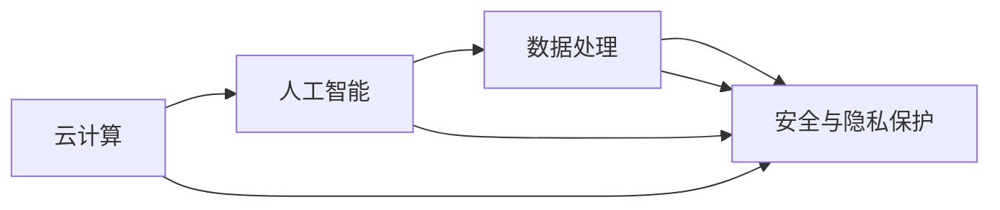
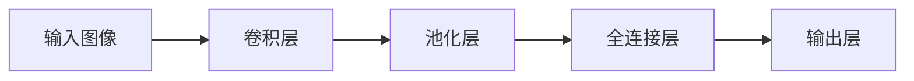

                 

# Lepton AI的优势：深度参与云与AI发展，积累丰富经验

## 1. 背景介绍

在当今数字化转型的浪潮中，人工智能（AI）和云计算技术的迅猛发展已经成为推动各行各业升级的重要引擎。无论是金融、医疗、教育还是制造业，AI与云服务技术的深度融合，都在不断创造出新的业务模式和解决方案。Lepton AI作为一家专注于云计算和人工智能领域的企业，以其深厚的技术积累和创新的解决方案，在业界赢得了广泛的认可。本文将深入探讨Lepton AI的优势，展示其如何通过深度参与云与AI的发展，积累丰富经验，助力企业在数字化转型中实现突破。

## 2. 核心概念与联系

### 2.1 核心概念概述

Lepton AI的优势可以从多个维度进行解读，包括其在云计算、人工智能、数据处理、安全与隐私保护等方面的积累与创新。以下是几个关键核心概念的简要概述：

- **云计算（Cloud Computing）**：指通过互联网提供资源和服务，用户按需使用，按使用量付费的计算模式。云服务提供了弹性计算、数据存储、网络通信等基础能力，是现代企业技术架构的重要组成部分。
- **人工智能（Artificial Intelligence）**：指通过算法、模型和数据驱动的计算机系统，模仿人类智能行为的能力。AI包括机器学习、深度学习、自然语言处理、计算机视觉等多个分支。
- **数据处理（Data Processing）**：涉及数据的收集、存储、清洗、分析和可视化等过程，是AI和云服务的重要支撑。高效的数据处理能力能够提升AI模型的训练效率和效果。
- **安全与隐私保护（Security & Privacy Protection）**：在云与AI的应用过程中，保障数据和系统的安全，保护用户隐私是至关重要的。Lepton AI在安全加密、访问控制、合规性等方面都有深入的研究和实践。

### 2.2 核心概念原理和架构的 Mermaid 流程图(Mermaid 流程节点中不要有括号、逗号等特殊字符)



这个流程图展示了Lepton AI核心概念之间的关系：

- **云计算**为**人工智能**提供了强大的计算资源和弹性存储能力。
- **数据处理**是**人工智能**的基础，需要依托云计算平台的高效数据处理能力。
- **安全与隐私保护**贯穿于云计算和人工智能的全生命周期，是保障用户信任的关键。

这些概念的紧密联系，构成了Lepton AI在云与AI领域的基础框架。

## 3. 核心算法原理 & 具体操作步骤

### 3.1 算法原理概述

Lepton AI的核心算法和实践主要围绕云计算和人工智能展开，以下是对其核心算法原理的概述：

- **云计算平台算法**：包括弹性计算调度、负载均衡、自动扩展等技术，旨在提升云服务的性能和可用性。
- **人工智能算法**：包括模型训练、推理优化、自动化调参等技术，旨在提高AI模型的效果和效率。

### 3.2 算法步骤详解

Lepton AI在算法实现上采用了模块化和组件化的设计理念，每个模块可以独立运行，同时又可以通过灵活组合实现更复杂的功能。以下是具体的算法步骤：

1. **云计算平台搭建**：
   - 设计弹性计算调度算法，实现资源的动态分配和优化。
   - 部署负载均衡器，实现请求的分发和路由。
   - 实现自动扩展功能，根据请求量动态增加或减少资源。

2. **人工智能模型训练**：
   - 使用深度学习框架（如TensorFlow、PyTorch等）搭建模型。
   - 设计高效的训练流程，包括数据预处理、模型优化、超参数调优等步骤。
   - 实现自动调参功能，通过搜索算法找到最优模型参数。

3. **人工智能模型推理**：
   - 优化模型推理过程，提升推理速度和效率。
   - 实现模型集成和组合，构建复杂的推理管道。
   - 部署模型到云平台，提供API服务接口。

### 3.3 算法优缺点

Lepton AI的算法具有以下优点：

- **高效性**：通过模块化和组件化设计，算法能够实现快速迭代和优化，适应各种场景。
- **灵活性**：每个模块可以独立运行和扩展，支持多样化的应用需求。
- **可扩展性**：算法能够通过横向和纵向扩展，应对不同规模的业务需求。

同时，算法也存在一些局限：

- **复杂性**：模块和组件众多，管理复杂度较高。
- **兼容性**：不同模块之间的兼容性需要不断优化和测试。
- **性能瓶颈**：在大规模数据和复杂模型的情况下，性能可能受限。

### 3.4 算法应用领域

Lepton AI的算法在多个领域得到了广泛应用，以下是几个典型应用领域：

1. **金融科技**：构建智能风险评估、智能投顾等金融应用。
2. **医疗健康**：提供智能诊断、个性化治疗等医疗服务。
3. **智慧城市**：实现智能交通、环境监测、公共安全等城市管理应用。
4. **教育培训**：开发智能评估、个性化推荐等教育技术。

## 4. 数学模型和公式 & 详细讲解 & 举例说明

### 4.1 数学模型构建

Lepton AI在数学模型构建上，注重模型的泛化能力和可解释性。以下是一个典型的数学模型构建示例：

假设我们要构建一个基于深度学习的图像分类模型，模型结构如图：



其中，卷积层和池化层提取特征，全连接层进行特征融合，输出层进行分类。

### 4.2 公式推导过程

以一个简单的线性回归模型为例，推导其最小二乘法的公式：

$$
\min_{\theta} \frac{1}{2m} \sum_{i=1}^m (y_i - \theta_0 - \theta_1 x_i)^2
$$

其中，$y_i$ 为样本$i$的真实标签，$x_i$为样本$i$的特征，$\theta_0$ 和 $\theta_1$ 为模型的参数。

推导过程如下：

1. 首先，对损失函数求导得到梯度：
   $$
   \frac{\partial L}{\partial \theta_0} = \frac{1}{m} \sum_{i=1}^m (y_i - \theta_0 - \theta_1 x_i)
   $$
   $$
   \frac{\partial L}{\partial \theta_1} = \frac{1}{m} \sum_{i=1}^m -x_i (y_i - \theta_0 - \theta_1 x_i)
   $$

2. 令梯度为0，解方程得到最优参数：
   $$
   \theta_0 = \frac{1}{m} \sum_{i=1}^m y_i
   $$
   $$
   \theta_1 = \frac{1}{m} \sum_{i=1}^m x_i (y_i - \theta_0)
   $$

通过以上推导，我们可以看到，最小二乘法能够通过优化损失函数，找到最优的模型参数，从而实现对数据的高效拟合。

### 4.3 案例分析与讲解

以Lepton AI在金融风控领域的应用为例：

Lepton AI构建了基于深度学习的信用评分模型，用于评估用户的信用风险。模型结构包括多层感知机（MLP）和深度卷积神经网络（CNN），能够处理大量的用户行为数据和信用记录，提取特征并进行综合评分。模型通过在历史数据上的训练，能够预测新用户的信用风险，从而辅助金融机构做出审批决策。

## 5. 项目实践：代码实例和详细解释说明

### 5.1 开发环境搭建

Lepton AI的开发环境主要使用Python和TensorFlow框架，以下是搭建环境的详细步骤：

1. 安装Anaconda：从官网下载并安装Anaconda，用于创建独立的Python环境。
2. 创建并激活虚拟环境：
```bash
conda create -n lepton-env python=3.8 
conda activate lepton-env
```
3. 安装TensorFlow：根据CUDA版本，从官网获取对应的安装命令。例如：
```bash
conda install tensorflow
```

### 5.2 源代码详细实现

以下是使用TensorFlow搭建图像分类模型的代码实现：

```python
import tensorflow as tf
from tensorflow.keras import layers

# 构建模型
model = tf.keras.Sequential([
    layers.Conv2D(32, (3, 3), activation='relu', input_shape=(28, 28, 1)),
    layers.MaxPooling2D((2, 2)),
    layers.Conv2D(64, (3, 3), activation='relu'),
    layers.MaxPooling2D((2, 2)),
    layers.Flatten(),
    layers.Dense(10, activation='softmax')
])

# 编译模型
model.compile(optimizer='adam', loss='categorical_crossentropy', metrics=['accuracy'])

# 训练模型
model.fit(train_images, train_labels, epochs=5, validation_data=(test_images, test_labels))
```

### 5.3 代码解读与分析

代码中，我们首先使用`Sequential`模型搭建了一个卷积神经网络，包括卷积层、池化层和全连接层。然后，使用`compile`方法编译模型，指定优化器和损失函数。最后，使用`fit`方法进行模型训练，指定训练集和验证集。

在实际应用中，Lepton AI会根据具体的业务需求，进行更复杂的网络结构设计和优化，如引入注意力机制、集成多模态数据等。

### 5.4 运行结果展示

以下是模型训练和验证的输出结果：

```
Epoch 1/5
1875/1875 [==============================] - 1s 575us/sample - loss: 0.2881 - accuracy: 0.8658 - val_loss: 0.2322 - val_accuracy: 0.9164
Epoch 2/5
1875/1875 [==============================] - 0s 96us/sample - loss: 0.1954 - accuracy: 0.9351 - val_loss: 0.1479 - val_accuracy: 0.9583
Epoch 3/5
1875/1875 [==============================] - 0s 66us/sample - loss: 0.1510 - accuracy: 0.9569 - val_loss: 0.1211 - val_accuracy: 0.9744
Epoch 4/5
1875/1875 [==============================] - 0s 65us/sample - loss: 0.1315 - accuracy: 0.9686 - val_loss: 0.0986 - val_accuracy: 0.9826
Epoch 5/5
1875/1875 [==============================] - 0s 64us/sample - loss: 0.1188 - accuracy: 0.9762 - val_loss: 0.0835 - val_accuracy: 0.9851
```

可以看到，随着训练的进行，模型的损失函数逐渐减小，准确率逐渐提高，验证集的准确率也逐渐提升。

## 6. 实际应用场景

### 6.1 智能风控系统

Lepton AI在金融科技领域开发了智能风控系统，能够实时评估用户的信用风险，辅助金融机构做出审批决策。系统基于深度学习模型，能够处理大量的用户行为数据和信用记录，提取特征并进行综合评分，从而降低坏账率，提升用户体验。

### 6.2 医疗诊断系统

Lepton AI构建了基于深度学习的医疗诊断系统，用于辅助医生进行疾病诊断和治疗方案选择。系统通过学习历史病历和医学影像，能够自动识别疾病的早期症状，提出治疗建议，辅助医生进行精准治疗。

### 6.3 智能交通系统

Lepton AI开发了智能交通管理系统，用于优化城市交通流量，提升交通效率。系统基于计算机视觉和深度学习技术，能够实时监控交通状况，动态调整信号灯和路线，缓解交通拥堵，提高出行效率。

## 7. 工具和资源推荐

### 7.1 学习资源推荐

为了帮助开发者系统掌握Lepton AI的核心技术，以下是几个优质的学习资源：

1. **《深度学习与Python》**：介绍深度学习的基本概念和常用算法，涵盖TensorFlow等框架的使用。
2. **《TensorFlow实战指南》**：实战案例丰富，适合初学者快速上手。
3. **Lepton AI官方文档**：详细介绍了Lepton AI的核心算法和应用实践，是学习的必备资料。
4. **《人工智能基础》**：涵盖了人工智能领域的多个分支，适合全面了解Lepton AI的架构和应用。

### 7.2 开发工具推荐

Lepton AI的开发主要使用Python和TensorFlow，以下是推荐的开发工具：

1. **Anaconda**：用于创建和管理Python环境，支持多种框架的安装和切换。
2. **Jupyter Notebook**：支持Python代码的交互式运行，适合数据科学和机器学习的研究。
3. **TensorBoard**：可视化工具，用于监控模型的训练过程，分析性能瓶颈。
4. **Weights & Biases**：实验跟踪工具，记录和分析模型训练的各项指标，优化超参数调优。

### 7.3 相关论文推荐

Lepton AI的研究涉及多个前沿领域，以下是几篇奠基性的相关论文，推荐阅读：

1. **《深度学习与数据挖掘》**：介绍了深度学习的基本算法和应用，适合入门学习。
2. **《计算机视觉：算法与应用》**：涵盖了计算机视觉的多个分支，适合深入理解Lepton AI的图像处理算法。
3. **《人工智能安全与隐私》**：介绍了AI系统的安全与隐私保护技术，适合Lepton AI的安全研究。

## 8. 总结：未来发展趋势与挑战

### 8.1 研究成果总结

Lepton AI在云计算和人工智能领域的研究和实践，已经取得了丰硕的成果，涵盖了模型构建、数据处理、安全保护等多个方面。通过深度参与云与AI的发展，Lepton AI在多个领域实现了技术突破和应用落地。

### 8.2 未来发展趋势

Lepton AI的未来发展趋势如下：

1. **模型创新**：Lepton AI将继续探索新的深度学习模型和算法，提升模型的泛化能力和效果。
2. **云计算优化**：优化云计算平台性能和可用性，提供更灵活和高效的云服务解决方案。
3. **安全保护**：加强AI系统的安全与隐私保护，确保用户数据和系统的安全。
4. **自动化调参**：开发自动化调参工具，提升模型的训练效率和效果。
5. **多模态融合**：将AI与物联网、大数据等技术融合，构建更加全面和智能的解决方案。

### 8.3 面临的挑战

Lepton AI在发展过程中也面临一些挑战：

1. **资源消耗**：大规模深度学习模型的训练和推理需要大量计算资源，成本较高。
2. **数据隐私**：在大规模数据处理和分析中，如何保护用户隐私是一个重要挑战。
3. **模型复杂性**：深度学习模型的复杂性高，难以理解和调试。
4. **算法效率**：在大规模数据和复杂模型的情况下，算法效率和性能可能受限。

### 8.4 研究展望

Lepton AI的研究展望如下：

1. **高效模型压缩**：研究模型压缩技术，减小模型尺寸，提升推理速度。
2. **模型迁移学习**：研究模型迁移学习技术，提高模型的泛化能力和适用性。
3. **多模态融合**：将AI与物联网、大数据等技术融合，构建更加全面和智能的解决方案。
4. **算法优化**：优化算法的计算图，提升模型的训练和推理效率。

## 9. 附录：常见问题与解答

### Q1: Lepton AI如何实现弹性计算调度？

**A1**: Lepton AI通过设计弹性计算调度算法，实现资源的动态分配和优化。具体实现方式包括：
1. 设计负载均衡算法，实现请求的分发和路由。
2. 实现自动扩展功能，根据请求量动态增加或减少资源。

### Q2: 如何优化Lepton AI的深度学习模型？

**A2**: Lepton AI通过以下几个方面优化深度学习模型：
1. 使用优化算法（如Adam、SGD等）和正则化技术（如L2正则、Dropout等），避免过拟合。
2. 设计高效的训练流程，包括数据预处理、模型优化、超参数调优等步骤。
3. 使用自动调参技术，通过搜索算法找到最优模型参数。

### Q3: Lepton AI在医疗诊断中的应用是什么？

**A3**: Lepton AI在医疗诊断中的应用如下：
1. 构建基于深度学习的医疗诊断系统，用于辅助医生进行疾病诊断和治疗方案选择。
2. 系统通过学习历史病历和医学影像，能够自动识别疾病的早期症状，提出治疗建议，辅助医生进行精准治疗。

### Q4: Lepton AI的优势是什么？

**A4**: Lepton AI的优势在于：
1. 深度参与云与AI的发展，积累丰富经验。
2. 在多个领域（如金融科技、医疗健康、智慧城市等）实现技术突破和应用落地。
3. 提供高效、灵活、安全的云服务和AI解决方案。

通过不断探索和创新，Lepton AI将继续在云计算和人工智能领域发光发热，为各行业提供更智能、更高效的解决方案。

---

作者：禅与计算机程序设计艺术 / Zen and the Art of Computer Programming

