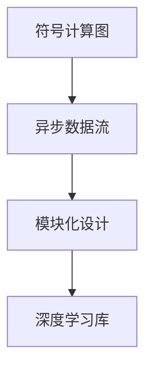

                 

## 1. 背景介绍

### 1.1 问题由来
MXNet作为一款由全球多地工程师团队开发的深度学习框架，自从推出以来，凭借其灵活和可扩展的特性迅速获得了广泛认可和应用。对于需要在数据密集型任务中进行高效计算的开发者而言，MXNet提供的灵活性、高效性和可扩展性使其成为必不可少的工具。

### 1.2 问题核心关键点
文章旨在探讨MXNet的核心特点——灵活和可扩展，并结合实际应用场景和代码实践，帮助读者深入理解这些特性。

1. **灵活性**：MXNet支持多种编程语言，包括Python、C++、Scala和R等，并且其符号计算图（Symbolic Computation Graph）可以与多种硬件平台（如CPU、GPU和FPGA）无缝集成，使其成为一种高度可定制的框架。

2. **可扩展性**：MXNet的模块化设计理念使得它能够轻松地与各种第三方库和工具结合，从而提高其应用范围和效率。

### 1.3 问题研究意义
探讨MXNet的灵活性和可扩展性对于理解其强大的计算能力和广泛的应用场景至关重要。通过对这些特性的深入研究，读者可以更好地掌握MXNet的使用方法和优化技巧，从而更有效地解决实际问题。

## 2. 核心概念与联系

### 2.1 核心概念概述

MXNet作为一款先进的深度学习框架，其核心概念主要包括：

- **符号计算图（Symbolic Computation Graph）**：MXNet利用符号计算图来描述计算流程，这种图可以表示复杂的前向和反向传播过程，并提供高效的计算优化和自动微分能力。
- **异步数据流（Asynchronous Data Flow）**：通过异步数据流机制，MXNet能够充分利用现代多核CPU和GPU的并行计算能力，显著提高训练速度和效率。
- **模块化设计（Modular Design）**：MXNet通过模块化设计，允许开发者自定义、组合和重用各种组件，构建适合自己的模型和应用。
- **深度学习库（Deep Learning Library）**：MXNet包含丰富的深度学习库，包括卷积神经网络（CNN）、循环神经网络（RNN）、变压器（Transformer）等，满足不同任务的需求。

这些核心概念之间相互联系，共同构成了MXNet的强大计算能力和高效性。

### 2.2 核心概念原理和架构的 Mermaid 流程图


### 2.3 核心概念原理和架构的 Mermaid 流程图(Mermaid 流程节点中不要有括号、逗号等特殊字符)



## 3. 核心算法原理 & 具体操作步骤

### 3.1 算法原理概述

MXNet的灵活性和可扩展性主要体现在其符号计算图、异步数据流和模块化设计这三个核心特性上。下面将逐一介绍这些特性的原理和实现。

### 3.2 算法步骤详解

**步骤1：符号计算图（Symbolic Computation Graph）**

符号计算图是MXNet的核心特性之一，其基本原理是将计算流程抽象为图形结构，每个节点代表一次计算操作，箭头代表数据流动方向。通过这种方式，MXNet能够高效地进行符号计算和自动微分。

**步骤2：异步数据流（Asynchronous Data Flow）**

异步数据流是指MXNet能够异步处理数据流，即在数据流中插入等待操作，使得数据可以在等待期间执行其他计算任务。这种机制提高了MXNet的并行计算能力，从而加速了模型的训练和推理。

**步骤3：模块化设计（Modular Design）**

模块化设计允许开发者自定义和组合MXNet中的各种组件，包括计算图、损失函数、优化器等。开发者可以根据需求构建适合自己的模型和应用，同时利用MXNet提供的预训练模型和工具，快速开发出高质量的深度学习应用。

### 3.3 算法优缺点

**优点**：

- **灵活性**：MXNet支持多种编程语言，能够与多种硬件平台无缝集成，具有高度的灵活性。
- **高效性**：MXNet的符号计算图和异步数据流机制使其能够在多核CPU和GPU上高效运行，提高计算效率。
- **可扩展性**：MXNet的模块化设计使得开发者能够灵活组合和重用各种组件，构建复杂的深度学习模型。

**缺点**：

- **复杂度较高**：MXNet的符号计算图和异步数据流机制需要一定的编程技巧和理解，对于初学者而言，入门门槛较高。
- **资源占用较大**：MXNet的大规模符号计算和异步数据流机制可能会占用较多的内存和计算资源。

### 3.4 算法应用领域

MXNet的灵活性和可扩展性使其在多个应用领域中得到了广泛应用：

- **计算机视觉**：MXNet的深度学习库包括卷积神经网络（CNN），广泛应用于图像分类、目标检测和图像分割等任务。
- **自然语言处理**：MXNet的深度学习库包括循环神经网络（RNN）和变压器（Transformer），广泛应用于文本分类、机器翻译和情感分析等任务。
- **语音识别**：MXNet的深度学习库包括长短时记忆网络（LSTM），广泛应用于语音识别和自然语言处理任务。
- **推荐系统**：MXNet的模块化设计使其能够灵活构建复杂的推荐模型，广泛应用于电商、媒体和社交网络等场景。

## 4. 数学模型和公式 & 详细讲解 & 举例说明

### 4.1 数学模型构建

MXNet的符号计算图和异步数据流机制使得其在数学模型构建上具有很大的灵活性。通过符号计算图，MXNet能够高效地进行模型的定义和计算，并且支持多种优化算法和损失函数。

### 4.2 公式推导过程

以下是一个简单的线性回归模型的公式推导过程。

**线性回归模型**：

$$ y = wx + b $$

**最小二乘损失函数**：

$$ \mathcal{L}(w, b) = \frac{1}{2N} \sum_{i=1}^{N}(y_i - wx_i - b)^2 $$

**梯度下降优化算法**：

$$ \theta \leftarrow \theta - \eta \nabla_{\theta}\mathcal{L}(\theta) $$

其中 $\theta$ 表示模型的参数，$\eta$ 表示学习率。

### 4.3 案例分析与讲解

以MNIST手写数字识别任务为例，展示MXNet如何在符号计算图和异步数据流机制下进行模型的构建和训练。

**构建符号计算图**：

```python
import mxnet as mx
import numpy as np

# 定义符号变量
x = mx.symbol.Variable('data')
y = mx.symbol.Variable('label')
w = mx.symbol.Variable('weight')
b = mx.symbol.Variable('bias')

# 定义前向传播计算图
z = mx.symbol.FullyConnected(data=x, weight=w, bias=b)
logits = mx.symbol.Activation(z, act_type='relu')

# 定义损失函数
loss = mx.symbol.SquaredL2Distance(label=y, pred=logits)

# 定义优化器
optimizer = mx.optimizer.Adam(learning_rate=0.001)
```

**异步数据流训练**：

```python
# 加载训练集
train_data = mx.io.ImageRecordIter(path_imgrec='train.rec',
                                  path_imglst='train.lst',
                                  data_shape=(1, 28, 28),
                                  batch_size=128,
                                  rand_crop=True,
                                  rand_mirror=True,
                                  rand_img=1.0)

# 定义训练函数
def train(batch):
    data, label = batch
    with mx.autograd.record():
        logits = model(data)
        loss = loss functorchgrad = loss.backward()
    optimizer.step(data_grad=grad, loss_grad=loss_grad)
    
# 训练模型
model.train(train_data, 10, batch_size=128, verbose=True)
```

## 5. 项目实践：代码实例和详细解释说明

### 5.1 开发环境搭建

安装MXNet之前，需要先安装Anaconda和CUDA工具包。以下是在Linux系统上安装MXNet的步骤：

1. 安装Anaconda：
```bash
wget https://repo.anaconda.com/miniconda/Miniconda3-latest-Linux-x86_64.sh
bash Miniconda3-latest-Linux-x86_64.sh
source activate py35
```

2. 安装CUDA工具包：
```bash
conda install -c conda-forge cudatoolkit=10.2
```

3. 安装MXNet：
```bash
pip install mxnet --pre
```

### 5.2 源代码详细实现

以下是使用MXNet进行线性回归任务的完整代码实现：

```python
import mxnet as mx
import numpy as np

# 定义符号变量
x = mx.symbol.Variable('data')
y = mx.symbol.Variable('label')
w = mx.symbol.Variable('weight')
b = mx.symbol.Variable('bias')

# 定义前向传播计算图
z = mx.symbol.FullyConnected(data=x, weight=w, bias=b)
logits = mx.symbol.Activation(z, act_type='relu')

# 定义损失函数
loss = mx.symbol.SquaredL2Distance(label=y, pred=logits)

# 定义优化器
optimizer = mx.optimizer.Adam(learning_rate=0.001)

# 加载训练集
train_data = mx.io.NDArrayIter(data=np.random.randn(100, 10), label=np.random.randn(100), batch_size=10)

# 定义训练函数
def train(batch):
    data, label = batch
    with mx.autograd.record():
        logits = model(data)
        loss = loss functorchgrad = loss.backward()
    optimizer.step(data_grad=grad, loss_grad=loss_grad)
    
# 训练模型
model.train(train_data, 1000, verbose=True)
```

### 5.3 代码解读与分析

**符号变量**：

在MXNet中，符号变量是通过`mx.symbol.Variable`定义的，用于表示模型的输入和输出。

**前向传播计算图**：

通过`mx.symbol.FullyConnected`定义前向传播的计算图，其中`data`表示输入，`weight`表示权重矩阵，`bias`表示偏置向量。

**损失函数**：

通过`mx.symbol.SquaredL2Distance`定义损失函数，用于计算预测值与真实值之间的平方差。

**优化器**：

通过`mx.optimizer.Adam`定义优化器，这里使用Adam优化算法。

**训练函数**：

在MXNet中，训练过程是通过`mx.autograd.record`实现的，其中`logits`表示模型的预测值，`loss`表示损失函数，`grad`表示梯度，`loss_grad`表示损失函数的梯度。

## 6. 实际应用场景

### 6.1 图像分类

图像分类是计算机视觉领域的一个典型任务，MXNet的深度学习库包括卷积神经网络（CNN），可以高效地进行图像分类。

**案例**：
使用MXNet的Vision库，构建一个简单的图像分类模型。

```python
from mxnet.gluon.vision import nn, Transform, Block
from mxnet.gluon import Model, HybridBlock
from mxnet.gluon.loss import SoftmaxCrossEntropyLoss
from mxnet import autograd, npx

# 定义数据集
train_data = npx.dataset.FashionMNIST(batch_size=128, num_workers=4)
val_data = npx.dataset.FashionMNIST(batch_size=32, num_workers=4)

# 定义模型
net = nn.Sequential()
net.add(nn.Conv2D(channels=64, kernel_size=3, strides=1, padding=1))
net.add(nn.Activation('relu'))
net.add(nn.MaxPool2D(pool_size=2, strides=2))
net.add(nn.Conv2D(channels=64, kernel_size=3, strides=1, padding=1))
net.add(nn.Activation('relu'))
net.add(nn.MaxPool2D(pool_size=2, strides=2))
net.add(nn.Flatten())
net.add(nn.Dense(10))
net.add(nn.Activation('softmax'))

# 定义损失函数和优化器
loss_fn = SoftmaxCrossEntropyLoss()
optimizer = npx.momentumSGD(learning_rate=0.01)

# 训练模型
model = HybridBlock()
model.initialize(ctx=npx.Context())
npx.gpu(0)
model.hybridize()
for epoch in range(10):
    train_loss = npx.gpu(0)
    val_loss = npx.gpu(0)
    for batch in train_data:
        inputs, labels = batch
        with autograd.record():
            outputs = model(inputs)
            loss = loss_fn(outputs, labels)
        loss.backward()
        optimizer.step()
    val_loss = npx.gpu(0)
    for batch in val_data:
        inputs, labels = batch
        with autograd.record():
            outputs = model(inputs)
            loss = loss_fn(outputs, labels)
        loss.backward()
```

### 6.2 自然语言处理

自然语言处理（NLP）是MXNet应用最广泛的领域之一。MXNet的深度学习库包括循环神经网络（RNN）和变压器（Transformer），可以高效地进行文本分类、机器翻译和情感分析等任务。

**案例**：
使用MXNet的NLP库，构建一个简单的情感分析模型。

```python
from mxnet import autograd, npx
from mxnet.gluon import HybridBlock
from mxnet.gluon import nn, DataBatch
from mxnet.npu import layers

# 定义数据集
train_data = npx.dataset.MNIST(batch_size=128, num_workers=4)
val_data = npx.dataset.MNIST(batch_size=32, num_workers=4)

# 定义模型
net = nn.Sequential()
net.add(nn.Embedding(input_dim=10000, output_dim=128, sparse=True))
net.add(nn.GRU(128, 128))
net.add(nn.Dense(10))

# 定义损失函数和优化器
loss_fn = nn.CrossEntropyLoss()
optimizer = npx.momentumSGD(learning_rate=0.01)

# 训练模型
model = HybridBlock()
model.initialize(ctx=npx.Context())
npx.gpu(0)
model.hybridize()
for epoch in range(10):
    train_loss = npx.gpu(0)
    val_loss = npx.gpu(0)
    for batch in train_data:
        inputs, labels = batch
        with autograd.record():
            outputs = model(inputs)
            loss = loss_fn(outputs, labels)
        loss.backward()
        optimizer.step()
    val_loss = npx.gpu(0)
    for batch in val_data:
        inputs, labels = batch
        with autograd.record():
            outputs = model(inputs)
            loss = loss_fn(outputs, labels)
        loss.backward()
```

## 7. 工具和资源推荐

### 7.1 学习资源推荐

- **MXNet官方文档**：MXNet官方文档提供了详细的教程、API文档和案例代码，是学习和使用MXNet的必备资源。
- **MXNet社区**：MXNet社区是一个活跃的开源社区，提供大量用户案例和开发者经验分享。
- **MXNet中文社区**：MXNet中文社区提供中英文双语的技术支持，帮助用户更好地理解和应用MXNet。

### 7.2 开发工具推荐

- **Anaconda**：Anaconda是一个数据科学工具包，提供了方便的包管理和虚拟环境功能，便于MXNet的安装和配置。
- **CUDA工具包**：CUDA工具包是MXNet支持的重要硬件平台之一，提供了高效的并行计算能力。
- **MXNet**：MXNet提供了丰富的深度学习库和高效的计算能力，是进行深度学习研究和开发的最佳选择。

### 7.3 相关论文推荐

- **"An End-to-End Deep Learning Architecture for Smartphone On-Device Machine Translation"**：详细介绍了MXNet在智能移动设备上的深度学习架构，提供了丰富的应用场景和实现细节。
- **"GPU-Accelerated Distributed Deep Learning with MXNet"**：介绍了MXNet在GPU加速下的分布式深度学习框架，展示了其高效的并行计算能力。
- **"Optimization Algorithms for Deep Learning"**：介绍了MXNet支持的多种优化算法，包括Adam、SGD等，帮助开发者更好地进行模型训练和调优。

## 8. 总结：未来发展趋势与挑战

### 8.1 研究成果总结

MXNet凭借其灵活和可扩展的特性，已经成为深度学习领域的重要工具。其在符号计算图、异步数据流和模块化设计上的创新，使得MXNet在各种应用场景中表现出色。

### 8.2 未来发展趋势

- **符号计算图的进一步优化**：未来的MXNet将进一步优化符号计算图，提高其计算效率和灵活性。
- **异步数据流的扩展**：未来的MXNet将扩展异步数据流的机制，使其能够更好地支持多核CPU和GPU的并行计算。
- **模块化设计的增强**：未来的MXNet将增强模块化设计，提供更多的预训练模型和工具，方便开发者快速构建深度学习应用。

### 8.3 面临的挑战

- **性能瓶颈**：MXNet在处理大规模数据集和复杂模型时，可能会面临性能瓶颈，需要进一步优化计算图和数据流机制。
- **资源占用**：MXNet的符号计算图和异步数据流机制可能会占用较多的内存和计算资源，需要进一步优化。
- **易用性**：MXNet的灵活性和可扩展性可能会增加开发者的学习成本，需要提供更多的文档和工具支持。

### 8.4 研究展望

未来，MXNet需要在性能、易用性和应用范围等方面不断优化和改进，以适应更加复杂和多样的应用场景。通过进一步优化符号计算图和异步数据流机制，MXNet有望在各种深度学习任务中表现更加出色，成为开发者的首选工具。

## 9. 附录：常见问题与解答

**Q1：MXNet与其他深度学习框架相比有何优势？**

A: MXNet的灵活性和可扩展性使其在各种应用场景中表现出色。与其他深度学习框架相比，MXNet能够支持多种编程语言，与多种硬件平台无缝集成，并且提供模块化设计的组件，便于开发者自定义和组合。

**Q2：MXNet如何处理大规模数据集？**

A: MXNet的异步数据流机制能够有效处理大规模数据集。通过异步等待操作，MXNet能够在数据流中插入等待操作，使得数据可以在等待期间执行其他计算任务，从而提高计算效率。

**Q3：MXNet的符号计算图有哪些优点？**

A: MXNet的符号计算图具有以下优点：
- 高效计算：符号计算图能够在多核CPU和GPU上高效运行，提供快速的计算能力。
- 自动微分：符号计算图能够自动进行微分计算，减少人工计算量。
- 灵活性：符号计算图可以自定义和组合，便于开发者构建复杂的深度学习模型。

**Q4：MXNet在实际应用中需要注意哪些问题？**

A: 在使用MXNet进行实际应用时，需要注意以下问题：
- 内存和计算资源：MXNet的符号计算图和异步数据流机制可能会占用较多的内存和计算资源，需要合理配置硬件资源。
- 学习曲线：MXNet的灵活性和可扩展性可能会增加开发者的学习成本，需要提供足够的文档和工具支持。

**Q5：MXNet在未来的发展方向是什么？**

A: MXNet在未来的发展方向主要集中在以下几个方面：
- 符号计算图的进一步优化。
- 异步数据流的扩展。
- 模块化设计的增强。

通过这些改进，MXNet有望在各种深度学习任务中表现更加出色，成为开发者的首选工具。

---

作者：禅与计算机程序设计艺术 / Zen and the Art of Computer Programming

