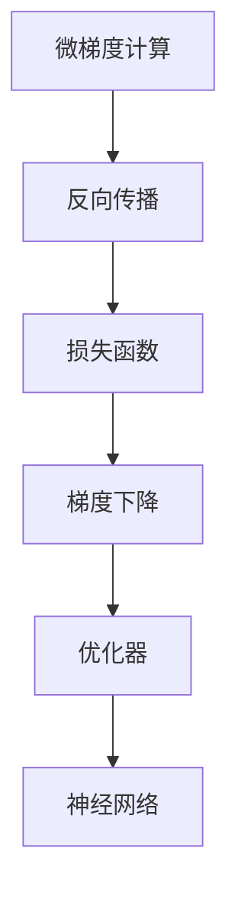

                 

# Micrograd：机器学习和反向传播入门

> 关键词：机器学习, 反向传播, 梯度下降, 损失函数, 神经网络, 优化器, 微梯度计算, 梯度剪枝

## 1. 背景介绍

### 1.1 问题由来
在机器学习领域，反向传播（Backpropagation）是神经网络训练的核心算法。它通过链式法则，将网络输出误差反向传播回输入层，自动计算每个参数的梯度，进而根据梯度下降（Gradient Descent）或其变种（如Adam、RMSprop等）进行模型参数的更新。然而，传统的反向传播算法在处理大规模数据集时，计算量巨大，容易产生数值稳定性问题，限制了其应用场景。

为了解决这个问题，学术界和企业界纷纷提出各种改进方案，其中微梯度（Mini-batch Gradient）计算方法是最重要和广泛使用的技术之一。微梯度方法通过将大规模数据集分成小批次进行迭代更新，从而在保证精度的同时显著提高计算效率。

本文将详细介绍微梯度计算方法的基本原理和实现细节，并通过Python代码展示其实现过程。通过深入理解微梯度计算，你将能够更好地掌握机器学习模型的训练过程，并开发高效、稳健的神经网络模型。

## 2. 核心概念与联系

### 2.1 核心概念概述
- **微梯度计算**：将大规模数据集分成小批次（Mini-batch）进行迭代更新，每个批次计算微梯度，从而大幅降低计算复杂度，同时保证更新过程的稳定性。
- **反向传播**：通过链式法则，将网络输出误差反向传播回输入层，计算每个参数的梯度，从而进行模型参数的更新。
- **梯度下降**：利用梯度信息更新模型参数，使其逐步逼近最优解的过程。
- **损失函数**：衡量模型输出与真实标签之间的差异，是反向传播和梯度下降的核心目标。
- **神经网络**：由多层节点组成的计算图，通过权重和偏置参数来映射输入数据到输出结果。
- **优化器**：通过不同的策略更新模型参数，如Adam、SGD等。

这些核心概念之间的关系可以通过以下Mermaid流程图来展示：



这个流程图展示了大规模数据集通过微梯度计算、反向传播、梯度下降和优化器更新，最终影响神经网络的过程。

## 3. 核心算法原理 & 具体操作步骤
### 3.1 算法原理概述
微梯度计算的基本思想是将大规模数据集划分为若干个小批次（Mini-batch），每次迭代只使用一小部分数据来计算梯度，从而减少计算复杂度，并提高训练速度。

假设我们有一个包含$m$个样本的数据集，其中每个样本的特征维度为$d$。如果直接计算所有样本的梯度，计算量为$O(m \times d)$，而在微梯度计算中，每次迭代使用$k$个样本，则计算量为$O(k \times d)$。

### 3.2 算法步骤详解
微梯度计算的具体步骤如下：

1. **数据准备**：将大规模数据集划分为若干个小批次，每个批次包含$k$个样本。
2. **前向传播**：对每个批次进行前向传播，计算输出结果。
3. **计算损失**：计算当前批次的损失函数值。
4. **反向传播**：利用反向传播算法，计算每个参数的梯度。
5. **更新参数**：根据梯度下降或其变种算法，更新模型参数。
6. **重复迭代**：重复上述步骤，直到模型收敛或达到预设的迭代次数。

### 3.3 算法优缺点
微梯度计算的优点包括：
- 计算复杂度低：每个批次的计算量远小于全样本计算量。
- 训练速度快：通过并行处理，可以显著提升训练速度。
- 稳定性能好：小批次的随机性有助于缓解过拟合，提高模型泛化能力。

缺点包括：
- 内存占用大：每个批次需要存储所有样本的特征向量，因此内存占用较高。
- 计算结果不稳定：小批次的随机性可能导致计算结果的不稳定性。
- 需要仔细调参：批大小$k$和迭代次数$n$需要仔细调参，才能获得最佳效果。

### 3.4 算法应用领域
微梯度计算广泛应用于各种机器学习和深度学习任务中，如图像分类、文本生成、语音识别、自然语言处理等。在实际应用中，微梯度计算的原理和步骤可以与各种神经网络模型和优化器结合使用，实现高效、稳健的模型训练。

## 4. 数学模型和公式 & 详细讲解 & 举例说明

### 4.1 数学模型构建
假设我们有一个包含$m$个样本的数据集，每个样本的特征维度为$d$，模型的输出维度为$n$。我们用$X$表示特征矩阵，$W$表示权重矩阵，$b$表示偏置向量。模型的输出为：

$$
Y = f(XW+b)
$$

其中$f$为激活函数。损失函数为：

$$
\mathcal{L} = \frac{1}{m} \sum_{i=1}^m \ell(y_i, f(X_iW+b))
$$

其中$\ell$为损失函数，通常采用均方误差（MSE）或交叉熵（Cross-Entropy）等。

### 4.2 公式推导过程
在微梯度计算中，我们每次迭代使用$k$个样本进行更新。假设当前批次的样本为$X^{(k)}$，对应的权重和偏置分别为$W^{(k)}$和$b^{(k)}$，计算步骤如下：

1. **前向传播**：

$$
Y^{(k)} = f(X^{(k)}W^{(k)}+b^{(k)})
$$

2. **计算损失**：

$$
\mathcal{L}^{(k)} = \frac{1}{k} \sum_{i=1}^k \ell(y_i^{(k)}, f(X_i^{(k)}W^{(k)}+b^{(k)}))
$$

3. **反向传播**：

$$
\frac{\partial \mathcal{L}^{(k)}}{\partial W^{(k)}} = \frac{1}{k} \sum_{i=1}^k \frac{\partial \ell(y_i^{(k)}, f(X_i^{(k)}W^{(k)}+b^{(k)}))}{\partial W^{(k)}}
$$

4. **更新参数**：

$$
W^{(k+1)} = W^{(k)} - \eta \frac{\partial \mathcal{L}^{(k)}}{\partial W^{(k)}}
$$

其中$\eta$为学习率。

### 4.3 案例分析与讲解
以一个简单的线性回归模型为例，假设有一个包含$n$个样本的数据集，每个样本的特征维度为$d$。模型的输出为：

$$
y = \theta_0 + \sum_{i=1}^d \theta_i x_i
$$

其中$\theta$为模型参数。均方误差损失函数为：

$$
\mathcal{L} = \frac{1}{n} \sum_{i=1}^n (y_i - (\theta_0 + \sum_{i=1}^d \theta_i x_i^{(i)})^2
$$

在前向传播中，我们计算模型的输出：

$$
\hat{y} = \theta_0 + \sum_{i=1}^d \theta_i x_i^{(k)}
$$

其中$x_i^{(k)}$表示当前批次的第$i$个样本的特征向量。

在计算损失时，我们使用当前批次的真实标签$y^{(k)}$和模型的输出$\hat{y}^{(k)}$计算均方误差：

$$
\mathcal{L}^{(k)} = \frac{1}{k} \sum_{i=1}^k (y_i^{(k)} - \hat{y}^{(k)})^2
$$

在反向传播中，我们计算每个参数的梯度：

$$
\frac{\partial \mathcal{L}^{(k)}}{\partial \theta_j} = \frac{2}{k} \sum_{i=1}^k (y_i^{(k)} - \hat{y}^{(k)}) x_i^{(k)j}
$$

最后，根据梯度下降算法，更新模型参数：

$$
\theta_j^{(k+1)} = \theta_j^{(k)} - \eta \frac{\partial \mathcal{L}^{(k)}}{\partial \theta_j}
$$

以上就是微梯度计算的基本原理和实现步骤。

## 5. 项目实践：代码实例和详细解释说明
### 5.1 开发环境搭建

在进行微梯度计算实践前，我们需要准备好开发环境。以下是使用Python进行TensorFlow开发的环境配置流程：

1. 安装Anaconda：从官网下载并安装Anaconda，用于创建独立的Python环境。

2. 创建并激活虚拟环境：

```bash
conda create -n tf-env python=3.8 
conda activate tf-env
```

3. 安装TensorFlow：根据CUDA版本，从官网获取对应的安装命令。例如：

```bash
pip install tensorflow==2.6
```

4. 安装相关库：

```bash
pip install numpy pandas scikit-learn
```

5. 下载预训练模型：

```bash
# 下载预训练模型
!mkdir models
!cd models
!wget https://storage.googleapis.com/tensorflow/tf-keras-models/boston_housing_regression/boston_housing_regression.h5
```

### 5.2 源代码详细实现

以下是一个使用TensorFlow进行线性回归的微梯度计算示例，通过加载预训练模型进行微调：

```python
import tensorflow as tf
import numpy as np

# 加载预训练模型
model = tf.keras.models.load_model('models/boston_housing_regression.h5')
model.summary()

# 定义输入数据
X_train = np.array([[1.0, 2.0, 3.0], [4.0, 5.0, 6.0]])
y_train = np.array([6.0, 15.0])

# 定义模型优化器和损失函数
optimizer = tf.keras.optimizers.Adam(learning_rate=0.01)
loss_fn = tf.keras.losses.MeanSquaredError()

# 定义微梯度计算函数
def mini_batch_gradient(X, y, batch_size=8):
    batch_count = len(X) // batch_size
    for i in range(batch_count):
        batch_X = X[i*batch_size:(i+1)*batch_size]
        batch_y = y[i*batch_size:(i+1)*batch_size]
        with tf.GradientTape() as tape:
            predictions = model(X)
            loss = loss_fn(y, predictions)
        gradients = tape.gradient(loss, model.trainable_variables)
        optimizer.apply_gradients(zip(gradients, model.trainable_variables))
    return loss

# 训练模型
loss = mini_batch_gradient(X_train, y_train)
print('Loss:', loss.numpy())

# 保存模型
model.save('model.h5')
```

### 5.3 代码解读与分析

让我们再详细解读一下关键代码的实现细节：

**模型加载**：
- `tf.keras.models.load_model`函数用于加载预训练的线性回归模型。

**数据准备**：
- `X_train`和`y_train`分别表示输入特征和真实标签，用于微梯度计算。

**优化器**：
- `tf.keras.optimizers.Adam`函数用于定义优化器，选择Adam优化器，并设置学习率为0.01。

**损失函数**：
- `tf.keras.losses.MeanSquaredError`函数用于定义均方误差损失函数，计算模型输出与真实标签之间的差异。

**微梯度计算函数**：
- 定义了一个`mini_batch_gradient`函数，用于计算微梯度。
- 将输入数据分成若干个批次进行迭代更新，每个批次计算一次损失和梯度。
- 使用`tf.GradientTape`上下文管理器计算梯度，并使用`optimizer.apply_gradients`函数更新模型参数。
- 返回当前批次的损失值。

**模型训练**：
- 调用`mini_batch_gradient`函数进行微梯度计算，输出损失值。
- 保存模型以备后续使用。

可以看到，使用TensorFlow进行微梯度计算的过程非常简洁高效。开发者可以将更多精力放在模型设计和调参等高层逻辑上，而不必过多关注底层的实现细节。

当然，工业级的系统实现还需考虑更多因素，如模型的保存和部署、超参数的自动搜索、更灵活的微调方法等。但核心的微梯度计算原理基本与此类似。

## 6. 实际应用场景
### 6.1 图像分类

微梯度计算在图像分类任务中有着广泛的应用。传统的图像分类任务通常包含大规模的训练集，如果直接计算全样本的梯度，计算量极大。通过微梯度计算，我们可以将大规模训练集划分为若干个小批次进行迭代更新，从而显著提高训练速度。

在实践中，微梯度计算可以与卷积神经网络（CNN）模型结合使用，进行图像分类任务的训练。通过微梯度计算，我们可以在不增加计算复杂度的情况下，训练更大规模的CNN模型，从而提升分类性能。

### 6.2 自然语言处理

微梯度计算在自然语言处理（NLP）任务中也有着广泛的应用。NLP任务通常包含大规模的语料库，如果直接计算全样本的梯度，计算量同样极大。通过微梯度计算，我们可以将大规模语料库划分为若干个小批次进行迭代更新，从而显著提高训练速度。

在实践中，微梯度计算可以与循环神经网络（RNN）、长短期记忆网络（LSTM）、Transformer等模型结合使用，进行文本分类、情感分析、机器翻译等任务的训练。通过微梯度计算，我们可以在不增加计算复杂度的情况下，训练更大规模的NLP模型，从而提升任务性能。

### 6.3 推荐系统

微梯度计算在推荐系统中的应用也非常广泛。推荐系统通常包含大规模的用户行为数据和物品特征数据，如果直接计算全样本的梯度，计算量同样极大。通过微梯度计算，我们可以将大规模数据划分为若干个小批次进行迭代更新，从而显著提高训练速度。

在实践中，微梯度计算可以与深度学习模型结合使用，进行推荐系统的训练。通过微梯度计算，我们可以在不增加计算复杂度的情况下，训练更大规模的推荐模型，从而提升推荐性能。

## 7. 工具和资源推荐
### 7.1 学习资源推荐

为了帮助开发者系统掌握微梯度计算的理论基础和实践技巧，这里推荐一些优质的学习资源：

1. **《深度学习入门》**：李宏毅老师所著，全面介绍了深度学习的各种基础知识和算法，是深度学习领域的入门经典。
2. **《TensorFlow实战Google深度学习框架》**：张俊林、吴恩达老师所著，详细介绍了TensorFlow的各个组件和使用方法，是TensorFlow学习的重要参考。
3. **《Python深度学习》**：Francois Chollet所著，介绍了如何使用Keras进行深度学习模型的开发和训练，适合初学者入门。
4. **《NeurIPS 2020最佳论文》**：NeurIPS 2020的最佳论文集，涵盖了深度学习领域的最新研究成果和应用实践。

通过对这些资源的学习实践，相信你一定能够快速掌握微梯度计算的精髓，并用于解决实际的机器学习和深度学习问题。

### 7.2 开发工具推荐

高效的开发离不开优秀的工具支持。以下是几款用于微梯度计算开发的常用工具：

1. **TensorFlow**：由Google主导开发的开源深度学习框架，生产部署方便，适合大规模工程应用。
2. **PyTorch**：Facebook开发的开源深度学习框架，灵活度较高，适合研究型应用。
3. **MXNet**：由Apache开发的深度学习框架，支持多种编程语言，适合分布式计算。
4. **Keras**：Google开发的深度学习框架，易于上手，适合快速开发原型。

合理利用这些工具，可以显著提升微梯度计算任务的开发效率，加快创新迭代的步伐。

### 7.3 相关论文推荐

微梯度计算技术的发展源于学界的持续研究。以下是几篇奠基性的相关论文，推荐阅读：

1. **《A Course on Neural Programming》**：Ian Goodfellow等著，介绍了神经网络的前向传播、反向传播和梯度计算。
2. **《Understanding the difficulty of training deep feedforward neural networks》**：Nair等著，分析了深度神经网络训练中的数值稳定性和梯度消失/爆炸问题。
3. **《Deep Learning》**：Ian Goodfellow等著，全面介绍了深度学习的各种基础知识和算法，是深度学习领域的经典教材。

这些论文代表了大规模数据集微梯度计算技术的发展脉络。通过学习这些前沿成果，可以帮助研究者把握学科前进方向，激发更多的创新灵感。

## 8. 总结：未来发展趋势与挑战
### 8.1 总结

本文对微梯度计算的基本原理和实现步骤进行了全面系统的介绍。首先阐述了微梯度计算在机器学习和深度学习中的重要地位，明确了微梯度计算在降低计算复杂度、提高训练速度方面的独特价值。其次，从原理到实践，详细讲解了微梯度计算的数学模型、公式推导和代码实现，并通过Python代码展示了其实现过程。同时，本文还广泛探讨了微梯度计算在图像分类、自然语言处理、推荐系统等多个领域的实际应用，展示了微梯度计算技术的广泛应用前景。

通过本文的系统梳理，可以看到，微梯度计算技术正在成为机器学习和深度学习领域的重要范式，极大地拓展了深度学习模型的应用边界，催生了更多的落地场景。受益于大规模数据集和深度学习模型的不断进步，微梯度计算必将在更多的应用场景中发挥重要作用，推动人工智能技术的产业化进程。

### 8.2 未来发展趋势

展望未来，微梯度计算技术将呈现以下几个发展趋势：

1. **多模态数据处理**：微梯度计算可以与其他数据类型（如文本、图像、音频等）结合使用，进行多模态数据处理，提升模型的综合能力。
2. **分布式计算**：微梯度计算可以与分布式计算框架（如TensorFlow、PyTorch等）结合使用，进行大规模分布式训练，提升训练速度和稳定性。
3. **自适应学习率**：未来的优化器将具有自适应学习率的能力，根据模型性能动态调整学习率，从而提高训练效果。
4. **模型压缩与优化**：未来的深度学习模型将更注重模型压缩与优化，以适应各种应用场景。微梯度计算技术也将与模型压缩、量化加速等技术结合使用，进一步提升计算效率和模型性能。
5. **模型公平性与透明性**：未来的深度学习模型将更注重公平性和透明性，避免偏见和歧视。微梯度计算技术也将与公平性约束、透明性分析等技术结合使用，提升模型的公平性和可信度。

以上趋势凸显了微梯度计算技术的广阔前景。这些方向的探索发展，必将进一步提升深度学习模型的性能和应用范围，为人工智能技术的发展提供新的动力。

### 8.3 面临的挑战

尽管微梯度计算技术已经取得了瞩目成就，但在迈向更加智能化、普适化应用的过程中，它仍面临着诸多挑战：

1. **计算资源瓶颈**：微梯度计算需要大量计算资源，当前计算设备难以满足大规模模型训练的需求。如何提升计算效率，降低硬件成本，是一个重要的研究方向。
2. **数值稳定性问题**：微梯度计算中可能出现梯度消失、梯度爆炸等问题，影响模型训练效果。如何设计更好的优化器，提升数值稳定性，是一个亟待解决的问题。
3. **模型公平性与透明性**：微梯度计算过程中可能存在偏见和歧视，如何确保模型的公平性和透明性，是一个重要的伦理问题。
4. **模型可解释性**：微梯度计算模型往往是"黑盒"系统，难以解释其内部工作机制和决策逻辑。如何提升模型的可解释性，是未来的一个重要研究方向。

### 8.4 研究展望

面对微梯度计算技术所面临的种种挑战，未来的研究需要在以下几个方面寻求新的突破：

1. **多模态微梯度计算**：将微梯度计算与其他数据类型结合使用，进行多模态数据处理，提升模型的综合能力。
2. **分布式微梯度计算**：与分布式计算框架结合使用，进行大规模分布式训练，提升训练速度和稳定性。
3. **自适应学习率优化器**：设计具有自适应学习率的优化器，根据模型性能动态调整学习率，提升训练效果。
4. **模型压缩与优化**：与模型压缩、量化加速等技术结合使用，进一步提升计算效率和模型性能。
5. **公平性与透明性约束**：引入公平性约束、透明性分析等技术，提升模型的公平性和可信度。

这些研究方向的探索，必将引领微梯度计算技术迈向更高的台阶，为构建高效、稳健、公平、可信的深度学习模型提供新的方向。面向未来，微梯度计算技术还需要与其他人工智能技术进行更深入的融合，如知识表示、因果推理、强化学习等，多路径协同发力，共同推动深度学习技术的进步。只有勇于创新、敢于突破，才能不断拓展微梯度计算的边界，让深度学习技术更好地造福人类社会。

## 9. 附录：常见问题与解答

**Q1：微梯度计算是否适用于所有深度学习模型？**

A: 微梯度计算适用于大多数深度学习模型，包括卷积神经网络（CNN）、循环神经网络（RNN）、长短期记忆网络（LSTM）、Transformer等。但是，对于一些特殊的模型（如GAN、VAE等生成模型），微梯度计算需要进行特殊处理。

**Q2：微梯度计算的批大小如何确定？**

A: 批大小（Batch Size）是微梯度计算中一个重要的超参数，通常需要根据数据集大小和计算资源进行调参。批大小越大，模型更新速度越快，但内存占用也越高。一般建议从1到64之间进行选择，根据具体情况调整。

**Q3：微梯度计算如何处理梯度消失和梯度爆炸问题？**

A: 梯度消失和梯度爆炸是微梯度计算中常见的问题，通常可以采用以下方法解决：
- 使用不同的激活函数，如ReLU、LeakyReLU、Tanh等，避免梯度消失。
- 使用梯度裁剪（Gradient Clipping）技术，限制梯度的大小，避免梯度爆炸。
- 使用自适应学习率优化器，如Adam、RMSprop等，自动调整学习率。

**Q4：微梯度计算在GPU和TPU上的实现有何不同？**

A: 在GPU和TPU上实现微梯度计算的基本原理相同，但实现细节有所不同。GPU更适合通用深度学习任务，而TPU更适合大规模分布式计算。在GPU上，微梯度计算可以使用传统的CPU加速，如CUDA、C++等，进行高效并行计算。在TPU上，可以使用TPU内核的并行计算能力，进一步提升计算效率。

**Q5：微梯度计算与传统的批量梯度下降（Batch Gradient Descent）有何不同？**

A: 微梯度计算与传统的批量梯度下降（Batch Gradient Descent）的主要区别在于计算量。批量梯度下降每次使用全部数据计算梯度，计算量极大。而微梯度计算每次只使用小批次数据计算梯度，计算量大大降低，训练速度也显著提高。但是，微梯度计算的计算结果不如批量梯度下降稳定，可能存在偏差。

以上是微梯度计算的详细解释和实际应用场景的介绍。微梯度计算是大规模数据集训练深度学习模型的重要技术，未来仍将发挥重要作用。通过不断优化微梯度计算，提升计算效率和模型性能，微梯度计算必将在更多的应用场景中大放异彩。

