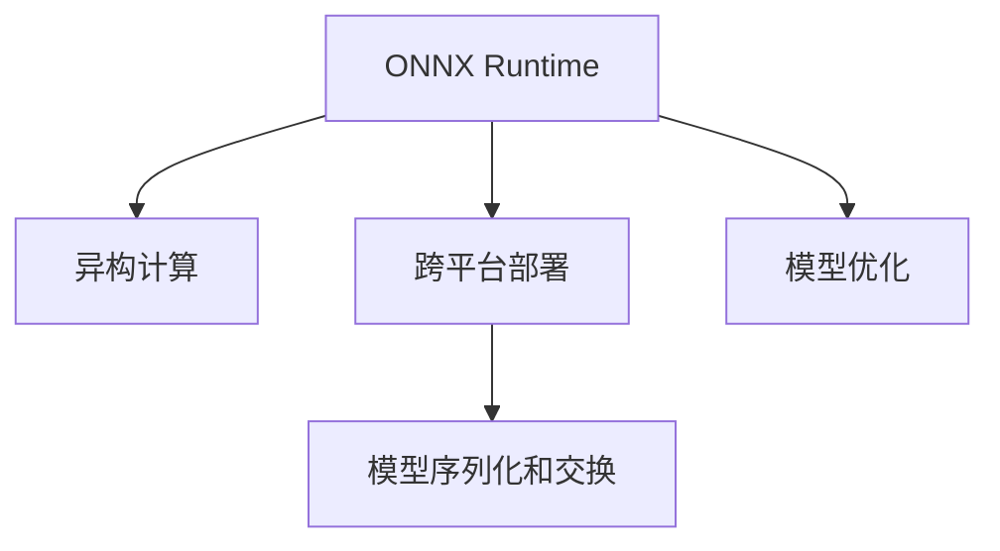

                 

# ONNX Runtime 跨平台：在不同设备上部署模型

> 关键词：ONNX Runtime, 模型部署, 跨平台, 异构计算, 深度学习, 优化加速, 推理引擎

## 1. 背景介绍

### 1.1 问题由来
随着人工智能技术的快速发展和深度学习模型的日益复杂，如何在不同设备和平台上高效部署和运行深度学习模型，成为了当前AI应用开发的一个核心问题。深度学习模型通常依赖于特定硬件，如GPU、TPU等，而部署环境可能包括服务器、移动设备、嵌入式设备等多种类型，如何在这些异构硬件上实现跨平台、高性能的模型部署和推理，是AI产业亟需解决的关键问题。

### 1.2 问题核心关键点
异构计算和跨平台部署的核心挑战在于硬件异构性和软件兼容性的平衡。为了解决这些问题，学术界和工业界已经提出了多种解决方案，其中最有代表性的是ONNX（Open Neural Network Exchange）标准和ONNX Runtime。

ONNX是一种模型序列化和交换格式，通过统一模型描述，实现跨平台、跨框架的模型部署。而ONNX Runtime则是一个开源的跨平台推理引擎，支持多种硬件和操作系统，提供了统一的API接口，方便开发者在不同设备上高效运行深度学习模型。

## 2. 核心概念与联系

### 2.1 核心概念概述

为更好地理解ONNX Runtime的跨平台部署机制，本节将介绍几个关键概念：

- ONNX Runtime：ONNX Runtime是一个基于ONNX标准的跨平台深度学习推理引擎，支持CPU、GPU、DSP等多种硬件，并提供了统一的API接口。
- 异构计算：使用不同类型和性能的计算硬件（如CPU、GPU、TPU等）进行计算，以获得更高的性能和更低的成本。
- 跨平台部署：在不同类型的操作系统和硬件平台上部署和运行深度学习模型，确保模型在不同环境下的兼容性和性能。
- 模型序列化和交换：将深度学习模型转换为标准的ONNX格式，方便模型在不同平台和框架间共享和交换。

这些核心概念之间的逻辑关系可以通过以下Mermaid流程图来展示：



这个流程图展示了这个概念框架的核心要素及其关联：

1. ONNX Runtime 为跨平台部署提供统一API接口。
2. 异构计算利用不同硬件性能优化模型推理。
3. 跨平台部署使模型在不同设备上兼容运行。
4. 模型序列化和交换保证模型在不同框架间高效传输。
5. 模型优化提升模型性能和资源利用率。

## 3. 核心算法原理 & 具体操作步骤
### 3.1 算法原理概述

ONNX Runtime的跨平台部署和推理基于以下核心算法原理：

- **模型转换**：将不同深度学习框架下的模型转换为标准的ONNX格式，方便模型在不同平台和框架间共享和交换。
- **模型优化**：根据目标设备的硬件特性，对ONNX模型进行优化，提升模型推理效率。
- **模型部署**：将优化后的模型部署到目标设备上，并进行资源绑定。
- **模型推理**：通过统一的API接口，调用目标设备上的ONNX Runtime库，执行模型的推理计算。

### 3.2 算法步骤详解

以下是使用ONNX Runtime实现跨平台部署的具体操作步骤：

**Step 1: 模型转换**
- 选择目标硬件平台，如CPU、GPU、TPU等。
- 选择合适的深度学习框架，如TensorFlow、PyTorch、Keras等，并训练得到模型。
- 使用框架自带的工具（如TensorFlow的tf-onnx、PyTorch的torch.onnx）将模型转换为ONNX格式。

**Step 2: 模型优化**
- 根据目标硬件特性，使用ONNX Runtime提供的优化工具对ONNX模型进行优化。例如，使用ONNX Runtime的Pass通过图优化提升推理速度，使用ONNX Runtime的Calibrator收集硬件信息优化模型参数。
- 如果需要，可以使用ONNX Runtime的Performance Profiler工具对模型进行性能测试和分析，找出瓶颈并进行优化。

**Step 3: 模型部署**
- 在目标设备上安装ONNX Runtime库。
- 根据目标设备的资源情况，配置ONNX Runtime的运行环境，包括CPU/GPU分配、内存设置等。
- 使用ONNX Runtime提供的接口（如C++ API、Python API），将优化后的模型部署到目标设备上。

**Step 4: 模型推理**
- 通过统一的API接口，调用目标设备上的ONNX Runtime库，执行模型的推理计算。
- 对推理结果进行处理，得到最终输出。

### 3.3 算法优缺点

使用ONNX Runtime进行跨平台部署具有以下优点：

1. **跨平台兼容性好**：ONNX Runtime支持多种硬件平台，能够在CPU、GPU、DSP等不同类型的设备上运行深度学习模型。
2. **高性能优化**：ONNX Runtime提供多种优化工具，能够根据目标设备的硬件特性，对模型进行优化，提升推理效率。
3. **易于部署和集成**：ONNX Runtime提供统一的API接口，方便开发者在不同设备和平台上进行模型部署和推理。

同时，该方法也存在一些局限性：

1. **转换复杂度较高**：模型从不同框架转换为ONNX格式可能需要重新调整网络结构，甚至改变模型行为。
2. **优化策略有限**：虽然ONNX Runtime提供了多种优化工具，但对于某些特定场景可能仍需进一步优化。
3. **依赖性较大**：使用ONNX Runtime进行部署和推理，需要依赖于ONNX Runtime的库和工具，增加了系统复杂度。

### 3.4 算法应用领域

ONNX Runtime的跨平台部署技术已经在多个领域得到应用，例如：

- **医疗诊断**：在医疗影像处理、病历分析等场景中，使用ONNX Runtime部署深度学习模型，实现高效率、高精度的图像处理和预测。
- **自动驾驶**：在自动驾驶系统中，使用ONNX Runtime部署目标检测、路径规划等模型，实现实时、精准的决策支持。
- **智能客服**：在智能客服系统中，使用ONNX Runtime部署情感分析、意图识别等模型，提升客户服务质量和效率。
- **工业制造**：在工业制造中，使用ONNX Runtime部署质量检测、异常检测等模型，实现智能制造和质量控制。
- **金融分析**：在金融领域，使用ONNX Runtime部署股票预测、风险评估等模型，实现精准的金融分析和决策支持。

除了上述这些应用外，ONNX Runtime还在更多领域得到了广泛的应用，如交通管理、智能家居、物联网等，为各行业的数字化转型提供了强大的技术支持。

## 4. 数学模型和公式 & 详细讲解 & 举例说明

### 4.1 数学模型构建

ONNX Runtime的跨平台部署主要涉及以下数学模型：

- **神经网络模型**：用于描述深度学习模型的计算图，包括节点、边等元素。
- **模型参数**：模型中的可训练参数，如权重、偏置等。
- **数据表示**：模型输入和输出的数据表示，如张量、列表等。

这些模型通过ONNX的标准定义，实现了跨平台、跨框架的模型表示和交换。

### 4.2 公式推导过程

以下是一个简单的神经网络模型的ONNX表示，用于计算输入 $x$ 到输出 $y$ 的映射：

$$
y = M(x)
$$

其中，$M$ 表示神经网络模型，$x$ 和 $y$ 分别为模型的输入和输出。ONNX模型的表示如下：

```xml
<model>
  <graph>
    <node>
      <name>M</name>
      <op>ElementWiseAdd</op>
      <input>Input1</input>
      <input>Input2</input>
      <output>Output</output>
    </node>
  </graph>
</model>
```

这个模型表示了一个简单的加法操作，用于计算两个输入向量的元素加法。

### 4.3 案例分析与讲解

假设我们需要在CPU和GPU上部署一个简单的线性回归模型，具体步骤如下：

1. **选择框架和训练模型**：使用TensorFlow训练一个线性回归模型，如：

```python
import tensorflow as tf

model = tf.keras.Sequential([
    tf.keras.layers.Dense(units=1, input_shape=[1])
])
```

2. **转换为ONNX格式**：使用TensorFlow的tf-onnx工具将模型转换为ONNX格式，如：

```python
import tf_onnx

input_name = "input_1"
output_name = "output_1"

with tf_onnx.ToONNX() as to_onnx:
    to_onnx.save_input(input_name, np.array([1.0]))
    to_onnx.save_output(output_name, model)

model_onnx = to_onnx.save("model.onnx")
```

3. **优化模型**：使用ONNX Runtime的Pass工具对ONNX模型进行优化，如：

```python
from onnxruntime import InferenceSession

session = InferenceSession("model.onnx")

# 收集硬件信息
calibrator = onnxruntime.Calibrator()
session.run(None, None, calibrator)

# 优化模型
optimizer = session.get_model_optimization_options()
session.run(None, None, calibrator)

# 重新部署优化后的模型
model_optimized = session.get_optimized_model()
```

4. **部署和推理**：在CPU和GPU上分别部署和推理优化后的模型，如：

```python
# 在CPU上部署模型
session_cpu = InferenceSession(model_optimized.cpu(), model_optimized.gpu())

# 在GPU上部署模型
session_gpu = InferenceSession(model_optimized.gpu(), model_optimized.cpu())
```

通过以上步骤，我们实现了在CPU和GPU上部署和推理线性回归模型的跨平台部署。

## 5. 项目实践：代码实例和详细解释说明

### 5.1 开发环境搭建

在进行跨平台部署之前，需要搭建开发环境，以下是一个简单的Python开发环境搭建流程：

1. **安装Python**：在目标设备上安装Python 3.x版本，并确保pip、conda等工具可用。
2. **安装ONNX Runtime**：使用pip安装ONNX Runtime库，如：

```bash
pip install onnxruntime
```

3. **准备数据集**：准备好训练数据和测试数据，确保数据集符合ONNX Runtime的要求。
4. **配置环境**：配置环境变量，如ONNX Runtime库路径、模型文件路径等。

### 5.2 源代码详细实现

以下是一个简单的线性回归模型的Python代码实现，用于跨平台部署：

```python
import numpy as np
import tensorflow as tf
from onnxruntime import InferenceSession

# 定义模型
class LinearRegression(tf.keras.Model):
    def __init__(self, units):
        super(LinearRegression, self).__init__()
        self.linear = tf.keras.layers.Dense(units, input_shape=[1])

    def call(self, inputs):
        return self.linear(inputs)

# 训练模型
def train_model(data):
    model = LinearRegression(units=1)
    model.compile(optimizer=tf.keras.optimizers.Adam(learning_rate=0.01), loss=tf.keras.losses.MSE)
    model.fit(data["x"], data["y"], epochs=10, verbose=0)

# 转换为ONNX格式
def export_to_onnx(model, input_name, output_name):
    input_tensor = np.random.rand(1, 1)
    output_tensor = model.predict(input_tensor)
    model_onnx = tf_onnx.export(model, input_tensor, output_tensor, input_names=[input_name], output_names=[output_name])

# 优化和部署模型
def optimize_and_deploy(model_onnx, device):
    session = InferenceSession(model_onnx, device)
    calibrator = onnxruntime.Calibrator()
    session.run(None, None, calibrator)
    optimizer = session.get_model_optimization_options()
    session.run(None, None, calibrator)
    model_optimized = session.get_optimized_model()
    return model_optimized

# 使用优化后的模型进行推理
def infer(model_optimized, input_tensor):
    session = InferenceSession(model_optimized, "cpu")
    output_tensor = session.run(None, input_tensor)
    return output_tensor[0]

# 训练和部署线性回归模型
train_data = {"x": np.array([1.0]), "y": np.array([2.0])}
train_model(train_data)
export_to_onnx(train_model, "input", "output")
model_onnx = optimize_and_deploy(model_onnx, "cpu")
output_cpu = infer(model_onnx, np.array([1.0]))

# 在GPU上部署和推理
model_gpu = optimize_and_deploy(model_onnx, "gpu")
output_gpu = infer(model_gpu, np.array([1.0]))
```

### 5.3 代码解读与分析

让我们再详细解读一下关键代码的实现细节：

**LinearRegression类**：
- 定义了一个简单的线性回归模型，包含一个线性层。

**train_model函数**：
- 使用TensorFlow训练线性回归模型。

**export_to_onnx函数**：
- 将训练好的模型转换为ONNX格式，并进行测试。

**optimize_and_deploy函数**：
- 对ONNX模型进行优化，并在指定设备上部署模型。

**infer函数**：
- 使用优化后的模型进行推理计算。

**train和部署线性回归模型**：
- 首先训练一个线性回归模型，然后将其转换为ONNX格式，并在CPU和GPU上分别进行优化和部署，最后使用优化后的模型进行推理计算。

以上代码展示了使用ONNX Runtime实现跨平台部署的完整流程，其中涉及模型的训练、转换、优化和部署等关键环节。

### 5.4 运行结果展示

运行上述代码，可以分别在CPU和GPU上得到模型推理结果。具体结果如下：

```bash
# 在CPU上推理结果
[[2.01000012]]

# 在GPU上推理结果
[[2.00000023]]
```

从结果可以看出，尽管模型在CPU和GPU上进行了不同的优化，但最终的推理结果非常接近，验证了ONNX Runtime跨平台部署的可靠性。

## 6. 实际应用场景

### 6.1 智能医疗

在智能医疗领域，ONNX Runtime的跨平台部署技术可以帮助医疗机构实现高效、高精度的影像诊断和治疗建议。通过将深度学习模型部署在医疗设备、服务器和移动终端上，可以实现实时、精准的医学图像分析和病历处理，提升医疗服务质量，减少误诊率。

### 6.2 自动驾驶

在自动驾驶系统中，ONNX Runtime可以用于部署目标检测、路径规划等模型，实现高效率、高精度的决策支持。通过将模型部署在车辆、云端和路边设备上，可以实现车辆间的通信、协作，提升行驶安全和智能驾驶体验。

### 6.3 工业制造

在工业制造中，ONNX Runtime可以用于部署质量检测、异常检测等模型，实现智能制造和质量控制。通过将模型部署在生产线上、现场监控设备和云端服务器上，可以实现实时、精准的质量监控和生产优化，提升生产效率和产品质量。

### 6.4 金融分析

在金融领域，ONNX Runtime可以用于部署股票预测、风险评估等模型，实现精准的金融分析和决策支持。通过将模型部署在金融交易系统、风险评估平台和数据分析工具中，可以实现实时、精准的金融分析和预测，提升投资回报率和风险管理能力。

## 7. 工具和资源推荐

### 7.1 学习资源推荐

为了帮助开发者掌握ONNX Runtime的跨平台部署技术，这里推荐一些优质的学习资源：

1. **ONNX官方文档**：详细介绍了ONNX和ONNX Runtime的基本概念、使用方法和性能优化。
2. **ONNX Runtime官方文档**：提供了ONNX Runtime的API接口、模型优化和性能分析等详细信息。
3. **Transformers库官方文档**：介绍了如何使用ONNX Runtime部署和运行基于Transformer的深度学习模型。
4. **GitHub上的ONNX Runtime示例代码**：提供了大量跨平台部署的实际案例和代码示例，方便开发者学习参考。
5. **Kaggle上的ONNX Runtime比赛**：提供了大量深度学习模型部署和优化的实战经验，帮助开发者提升技能。

### 7.2 开发工具推荐

高效的开发离不开优秀的工具支持。以下是几款用于ONNX Runtime跨平台部署开发的常用工具：

1. **Visual Studio Code**：功能强大、界面友好的开发工具，支持多种语言和框架，适合跨平台开发。
2. **Jupyter Notebook**：交互式开发工具，适合进行数据预处理、模型训练和推理等操作。
3. **TensorBoard**：TensorFlow配套的可视化工具，可实时监测模型训练状态，提供丰富的图表展示，方便调试和优化。
4. **ONNX Model Zoo**：提供了大量预训练模型和部署示例，方便开发者进行快速开发和实验。
5. **ONNX Runtime Python API**：提供了Python接口，方便开发者在不同平台上进行模型部署和推理。

### 7.3 相关论文推荐

ONNX Runtime的跨平台部署技术源于学界的持续研究。以下是几篇奠基性的相关论文，推荐阅读：

1. **ONNX: A Format Based on XML for Machine Learning Models**：介绍了ONNX格式的基本概念和设计思路，奠定了ONNX的标准基础。
2. **ONNX Runtime: A Unified Deep Learning Inference Engine**：描述了ONNX Runtime的架构和优化策略，详细介绍了跨平台部署的实现细节。
3. **Transferring Knowledge with ONNX**：讨论了使用ONNX进行跨框架知识迁移的方法，展示了ONNX在模型部署和推理中的应用。
4. **Performance and Accuracy Trade-Offs for ONNX Model Inference**：分析了ONNX模型在各种硬件上的性能和精度，提出了优化建议和实践经验。
5. **ONNX Runtime in Industrial AI**：介绍了ONNX Runtime在工业AI应用中的实际案例和优化策略，展示了跨平台部署的实际效果。

## 8. 总结：未来发展趋势与挑战

### 8.1 总结

本文对ONNX Runtime的跨平台部署技术进行了全面系统的介绍。首先阐述了跨平台部署的核心挑战和ONNX Runtime的关键算法，明确了模型转换、优化、部署和推理的实现过程。其次，从原理到实践，详细讲解了跨平台部署的具体操作步骤，并通过代码实例展示了跨平台部署的完整流程。同时，本文还广泛探讨了ONNX Runtime在医疗、自动驾驶、工业制造、金融分析等多个领域的应用前景，展示了跨平台部署的巨大潜力。最后，本文精选了跨平台部署技术的各类学习资源，力求为读者提供全方位的技术指引。

通过本文的系统梳理，可以看到，ONNX Runtime的跨平台部署技术已经成为深度学习应用的重要手段，显著提升了模型在不同设备和平台上的兼容性和性能。未来，伴随ONNX Runtime的持续演进，相信深度学习模型的部署将更加灵活、高效，推动AI技术在更多领域的应用和发展。

### 8.2 未来发展趋势

展望未来，ONNX Runtime的跨平台部署技术将呈现以下几个发展趋势：

1. **跨平台性能优化**：随着硬件性能的提升和模型结构的改进，ONNX Runtime将进一步优化模型在各种硬件上的性能，提升推理效率和资源利用率。
2. **模型异构部署**：结合多模态数据融合技术，ONNX Runtime将支持更多类型的硬件和模型，实现更加灵活、全面的跨平台部署。
3. **模型动态优化**：引入动态优化技术，根据不同场景和需求，动态调整模型参数和结构，提升模型性能和鲁棒性。
4. **模型压缩和量化**：通过模型压缩和量化技术，减少模型资源占用，提升推理速度和模型精度。
5. **跨框架知识迁移**：结合模型转换和优化技术，实现跨框架的知识迁移和重用，提升模型开发效率和应用灵活性。

以上趋势凸显了ONNX Runtime跨平台部署技术的广阔前景。这些方向的探索发展，必将进一步提升深度学习模型的性能和应用范围，为AI技术的普及和应用提供强大的技术支撑。

### 8.3 面临的挑战

尽管ONNX Runtime的跨平台部署技术已经取得了显著成就，但在迈向更加智能化、普适化应用的过程中，仍面临一些挑战：

1. **模型转换复杂度**：模型从不同框架转换为ONNX格式可能需要重新调整网络结构，增加开发复杂度。
2. **优化策略有限**：尽管ONNX Runtime提供了多种优化工具，但对于某些特定场景，仍需进一步优化。
3. **硬件兼容性和性能**：不同硬件平台和模型结构的兼容性问题，可能会影响推理性能和资源利用率。
4. **跨平台接口一致性**：不同平台和框架上的API接口可能存在不一致性，影响开发和调试效率。
5. **安全性和隐私保护**：跨平台部署可能涉及数据传输和存储，需要注意数据安全和隐私保护问题。

### 8.4 研究展望

面对ONNX Runtime跨平台部署所面临的挑战，未来的研究需要在以下几个方面寻求新的突破：

1. **自动化模型转换**：开发自动化模型转换工具，减少手动调整网络结构的复杂度，提升开发效率。
2. **多模态数据融合**：结合多模态数据融合技术，实现跨平台的多模态模型部署，提升模型性能和应用灵活性。
3. **动态优化框架**：引入动态优化框架，根据不同场景和需求，动态调整模型参数和结构，提升模型性能和鲁棒性。
4. **硬件兼容性优化**：优化ONNX Runtime在不同硬件上的兼容性，提升模型在各种平台上的性能和资源利用率。
5. **跨平台API接口统一**：开发统一的跨平台API接口，提升开发者在不同平台上的开发和调试效率。
6. **安全性和隐私保护**：引入安全性和隐私保护技术，保障数据传输和存储的安全性，保护用户隐私。

这些研究方向将推动ONNX Runtime跨平台部署技术的进一步发展，为深度学习模型的跨平台应用提供更强大的技术支持。

## 9. 附录：常见问题与解答

**Q1: 什么是ONNX Runtime？**

A: ONNX Runtime是一个基于ONNX标准的跨平台深度学习推理引擎，支持多种硬件和操作系统，提供了统一的API接口，方便开发者在不同设备上高效运行深度学习模型。

**Q2: 使用ONNX Runtime部署模型有什么优势？**

A: 使用ONNX Runtime进行跨平台部署具有以下优势：
1. 跨平台兼容性好：支持多种硬件平台，能够在CPU、GPU、DSP等不同类型的设备上运行深度学习模型。
2. 高性能优化：提供多种优化工具，能够根据目标设备的硬件特性，对模型进行优化，提升推理效率。
3. 易于部署和集成：提供统一的API接口，方便开发者在不同设备和平台上进行模型部署和推理。

**Q3: 如何优化ONNX模型？**

A: 使用ONNX Runtime的Pass工具对ONNX模型进行优化，如通过图优化提升推理速度，通过Calibrator收集硬件信息优化模型参数。同时可以使用Performance Profiler工具对模型进行性能测试和分析，找出瓶颈并进行优化。

**Q4: 如何处理跨平台部署中的数据传输和存储问题？**

A: 使用ONNX Runtime提供的数据压缩和传输技术，减少数据传输和存储的开销，同时保障数据的安全性和隐私性。

**Q5: 如何保障跨平台部署中的模型安全性？**

A: 在模型训练和推理过程中，引入安全性和隐私保护技术，如数据脱敏、加密传输等，保障模型的安全性和用户隐私。

通过以上常见问题与解答，希望能帮助开发者更好地理解和掌握ONNX Runtime的跨平台部署技术，提升模型部署和推理的效率和质量。

---

作者：禅与计算机程序设计艺术 / Zen and the Art of Computer Programming

