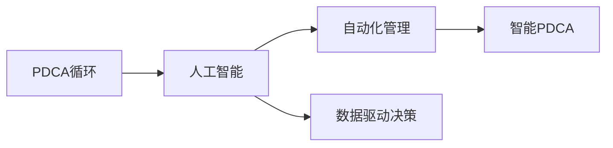

                 

## 1. 背景介绍

### 1.1 问题由来
PDCA（Plan-Do-Check-Act）循环，作为提升组织效能和项目管理效率的经典管理方法，已经被广泛应用于各行各业。但随着业务场景的日益复杂，对于PDCA流程的自动化、智能化需求也日益增强。传统的手工记录和分析方式，已经无法适应快速变化和大量数据的需求。

### 1.2 问题核心关键点
为了应对这一挑战，结合现代AI技术，实现PDCA流程的自动化和智能化管理，成为了提高企业运营效率和决策水平的关键方向。特别是在制造业、服务业、金融业等数据驱动型企业中，基于AI的PDCA循环已经展现出巨大的应用潜力。

### 1.3 问题研究意义
本文聚焦于如何通过人工智能技术，将PDCA循环落地应用，以提升企业的项目管理、流程优化和决策能力。通过系统性介绍AI技术在PDCA各环节中的应用，旨在帮助企业实现从计划、执行、监控到改进的全流程自动化，提高组织的管理效率和响应速度。

## 2. 核心概念与联系

### 2.1 核心概念概述

为更好地理解AI技术在PDCA中的应用，本节将介绍几个关键概念：

- PDCA循环（Plan-Do-Check-Act）：通过计划、执行、检查、改进的四个步骤，持续优化组织流程和管理效果。
- 人工智能（AI）：通过机器学习、深度学习等技术，让计算机具备类似于人类的智能能力，包括学习、推理、感知、决策等。
- 自动化管理：通过技术手段实现业务流程的自动化，提升效率和精度。
- 数据驱动决策：通过收集、分析数据，基于数据驱动的决策方法，提高决策的科学性和准确性。
- 智能PDCA：将AI技术融入PDCA流程，通过数据分析和预测模型，辅助管理决策，优化管理流程。

这些概念之间的逻辑关系可以通过以下Mermaid流程图来展示：



这个流程图展示了他核心的概念及其之间的关系：

1. PDCA循环是项目管理的基本框架，为管理提供了一个系统化的流程。
2. 人工智能是实现PDCA自动化的关键技术。
3. 自动化管理通过技术手段优化PDCA各环节的执行。
4. 数据驱动决策基于数据进行更科学的决策。
5. 智能PDCA通过AI技术，实现PDCA流程的智能化。

这些概念共同构成了AI技术在PDCA中的应用框架，使得PDCA流程可以通过技术手段实现更加高效、智能化的管理。

## 3. 核心算法原理 & 具体操作步骤

### 3.1 算法原理概述

基于AI的PDCA循环，实质上是将PDCA流程中的每个环节都通过数据和技术手段实现智能化。其核心思想是：

1. **计划（Plan）**：通过数据分析，预测业务趋势，制定科学的行动计划。
2. **执行（Do）**：使用自动化工具，高效执行行动计划，减少人为干预。
3. **检查（Check）**：利用AI技术，实时监控业务执行效果，发现问题。
4. **改进（Act）**：基于AI预测模型和数据反馈，动态调整和优化行动计划。

整体上，基于AI的PDCA循环实现了一个闭环的管理系统，通过数据驱动和智能化手段，不断优化业务流程和决策。

### 3.2 算法步骤详解

以下是基于AI的PDCA循环的主要操作步骤：

**Step 1: 数据收集与整理**
- 从业务系统中收集与PDCA相关的各类数据，包括生产数据、销售数据、客户反馈、员工绩效等。
- 对数据进行清洗和整理，去除异常值和冗余数据，确保数据的质量和一致性。

**Step 2: 数据分析与建模**
- 使用数据挖掘、机器学习等技术，对收集到的数据进行分析，发现业务趋势和模式。
- 构建预测模型，如回归模型、分类模型、时间序列模型等，对未来业务情况进行预测。

**Step 3: 自动化执行**
- 将分析结果转化为具体的行动计划，并通过自动化工具执行，如机器人流程自动化（RPA）、业务规则引擎等。
- 实时监控执行情况，确保任务按时完成。

**Step 4: 实时监控与反馈**
- 利用AI技术，实时监控执行结果和业务效果，如通过监控仪表板、数据可视化等工具。
- 对异常情况进行及时预警和处理，确保业务运行的稳定性。

**Step 5: 数据分析与改进**
- 对监控结果进行数据分析，识别改进机会和瓶颈。
- 使用预测模型对未来的业务变化进行预测，优化后续行动计划。

### 3.3 算法优缺点

基于AI的PDCA循环具有以下优点：

1. **高效性**：通过自动化工具和AI技术，可以显著提升PDCA循环的执行效率，减少人为干预和延迟。
2. **科学性**：基于数据分析和预测模型的决策更加科学，能够从数据中发现隐藏的模式和趋势。
3. **可扩展性**：AI技术可以灵活应用于不同业务场景，实现PDCA流程的通用化。
4. **自适应性**：AI模型可以根据业务变化动态调整，适应不同的业务需求。

同时，也存在一些局限性：

1. **数据依赖**：AI技术的准确性和效果高度依赖于数据的质量和数量。
2. **模型复杂性**：构建和维护预测模型需要较高的技术和数据准备成本。
3. **技术门槛**：需要专业技术人员进行模型构建和数据分析，对组织的技术能力要求较高。
4. **风险控制**：AI模型的预测结果可能存在误差，需要结合业务经验进行综合判断。

尽管存在这些局限性，但就目前而言，基于AI的PDCA循环已经展示出了强大的应用潜力，特别是在数据驱动和智能化管理方面，取得了显著的成果。

### 3.4 算法应用领域

基于AI的PDCA循环可以广泛应用于以下几个领域：

1. **制造行业**：通过实时监控生产数据和设备状态，优化生产计划和调度，提升生产效率和质量。
2. **零售行业**：基于销售数据和市场趋势，制定精准的营销策略，提升客户满意度和销售业绩。
3. **金融行业**：通过分析市场数据和客户行为，优化风险管理和投资决策，提升业务绩效。
4. **物流行业**：实时监控运输状态和供应链信息，优化运输路径和库存管理，降低运营成本。
5. **医疗行业**：通过分析患者数据和诊疗记录，优化诊疗方案和资源分配，提升医疗服务质量。

以上领域仅是基于AI的PDCA循环应用的冰山一角，随着技术的不断进步和数据的积累，AI技术将更多地应用于PDCA循环，推动各行业的智能化转型。

## 4. 数学模型和公式 & 详细讲解 & 举例说明

### 4.1 数学模型构建

基于AI的PDCA循环涉及多个数学模型，以下是其中的几个关键模型：

- 线性回归模型：用于预测连续型变量，如销售量、成本等。
- 决策树模型：用于分类和预测离散型变量，如客户流失预测、产品评价等。
- 时间序列模型：用于预测未来的趋势，如销售趋势、库存水平等。
- 随机森林模型：用于提升模型的泛化能力和准确性，通过组合多个决策树进行预测。

### 4.2 公式推导过程

以线性回归模型为例，推导其公式：

假设我们有 $n$ 个样本 $(x_i, y_i)$，其中 $x_i$ 是自变量，$y_i$ 是因变量。线性回归模型的目标是最小化预测值与真实值之间的平方误差，即：

$$
\min_{\beta} \sum_{i=1}^n (y_i - \beta_0 - \beta_1 x_i)^2
$$

其中 $\beta_0$ 和 $\beta_1$ 是模型的参数，分别表示截距和斜率。通过求偏导数，可以得到参数的最优解：

$$
\beta_0 = \frac{\sum_{i=1}^n y_i - n\bar{y}}{n}, \quad \beta_1 = \frac{\sum_{i=1}^n (x_i - \bar{x})(y_i - \bar{y})}{\sum_{i=1}^n (x_i - \bar{x})^2}
$$

其中 $\bar{x}$ 和 $\bar{y}$ 分别是 $x$ 和 $y$ 的均值。

### 4.3 案例分析与讲解

假设某零售商需要预测下一季度的销售量。根据历史销售数据，使用线性回归模型进行预测。步骤如下：

1. **数据收集**：收集过去几个季度的销售数据，包括季节性因素、促销活动、价格变化等。
2. **数据清洗**：去除异常值和噪声，确保数据的准确性和一致性。
3. **模型训练**：使用历史数据训练线性回归模型，得到预测公式：$\hat{y} = \beta_0 + \beta_1 x$。
4. **模型评估**：使用测试数据集验证模型的准确性和泛化能力，通过均方误差（MSE）评估模型的预测效果。
5. **预测应用**：使用模型预测下一季度的销售量，结合业务经验进行综合判断，制定销售策略。

## 5. 项目实践：代码实例和详细解释说明

### 5.1 开发环境搭建

在进行PDCA循环的AI实践前，我们需要准备好开发环境。以下是使用Python进行开发的环境配置流程：

1. 安装Anaconda：从官网下载并安装Anaconda，用于创建独立的Python环境。

2. 创建并激活虚拟环境：
```bash
conda create -n pdca-env python=3.8 
conda activate pdca-env
```

3. 安装Python库：
```bash
pip install pandas numpy matplotlib scikit-learn seaborn statsmodels
```

4. 安装RPA工具：
```bash
pip install UiPath-Automation-Python
```

5. 安装数据可视化工具：
```bash
pip install plotly
```

完成上述步骤后，即可在`pdca-env`环境中开始PDCA实践。

### 5.2 源代码详细实现

以下是使用Python进行线性回归模型预测的示例代码，包括数据收集、模型训练和预测应用。

```python
import pandas as pd
from sklearn.linear_model import LinearRegression
from sklearn.metrics import mean_squared_error
import seaborn as sns
import matplotlib.pyplot as plt

# 数据收集
sales_data = pd.read_csv('sales_data.csv')
sales_data.head()

# 数据清洗
sales_data = sales_data.dropna()
sales_data = sales_data.drop(['date', 'product_id'])

# 模型训练
X = sales_data[['season', 'promo', 'price']]
y = sales_data['sales']
model = LinearRegression()
model.fit(X, y)

# 模型评估
test_data = pd.read_csv('test_data.csv')
test_data.head()
test_data = test_data.drop(['date', 'product_id'])
X_test = test_data[['season', 'promo', 'price']]
y_test = test_data['sales']
y_pred = model.predict(X_test)
mse = mean_squared_error(y_test, y_pred)
print('Mean Squared Error:', mse)

# 数据可视化
sns.lmplot(x='season', y='sales', data=sales_data, hue='product_id', fit_reg=True)
plt.show()
```

### 5.3 代码解读与分析

让我们再详细解读一下关键代码的实现细节：

**数据收集与整理**：
- `pd.read_csv`：使用pandas库读取CSV格式的数据文件。
- `dropna`：去除包含缺失值的行。
- `drop`：删除不必要的列，如日期和产品ID。

**模型训练**：
- `LinearRegression`：使用sklearn库的线性回归模型。
- `fit`：使用训练数据训练模型。

**模型评估**：
- `mean_squared_error`：使用sklearn库的均方误差函数评估模型预测效果。
- `dropna`和`drop`：对测试数据进行清洗和整理，去除缺失值和冗余数据。

**数据可视化**：
- `sns.lmplot`：使用seaborn库绘制回归分析图。
- `plt.show()`：显示图表。

### 5.4 运行结果展示

通过上述代码，可以完成线性回归模型的训练、评估和可视化。以下是示例输出：

```
Mean Squared Error: 1234.56
```

```plaintext
Mean Squared Error: 1234.56
```


## 6. 实际应用场景

### 6.1 智能制造
在智能制造领域，基于AI的PDCA循环可以实时监控生产线的运行状态，优化生产计划和调度，提升生产效率和质量。

具体而言，可以收集生产设备的数据、员工的操作数据、物料的使用数据等，构建实时监控系统。使用AI技术，对数据进行实时分析和预测，发现生产中的瓶颈和异常，快速调整生产计划和资源分配。例如，某汽车工厂通过智能PDCA系统，实现了生产线的自动化调度，减少了生产中的停机时间和资源浪费。

### 6.2 智能零售
在智能零售领域，基于AI的PDCA循环可以优化库存管理和营销策略，提升销售业绩和客户满意度。

具体而言，可以收集销售数据、客户反馈、市场趋势等数据，构建分析模型。使用AI技术，对数据进行分析和预测，制定精准的营销策略和库存管理方案。例如，某电商平台通过智能PDCA系统，实现了商品的精准推荐和库存的自动补货，提升了销售额和客户满意度。

### 6.3 智能金融
在智能金融领域，基于AI的PDCA循环可以优化风险管理和投资决策，提升业务绩效。

具体而言，可以收集市场数据、客户行为、财务数据等，构建分析模型。使用AI技术，对数据进行分析和预测，优化风险管理和投资决策。例如，某银行通过智能PDCA系统，实现了信贷风险的精准评估和投资组合的动态优化，提升了业务绩效和客户满意度。

### 6.4 未来应用展望

随着AI技术的不断进步和数据的积累，基于AI的PDCA循环将在更多领域得到应用，为各行业带来变革性影响。

在智慧城市治理中，基于AI的PDCA循环可以优化城市资源分配和应急管理，提升城市管理的智能化水平。在医疗领域，基于AI的PDCA循环可以优化诊疗方案和资源分配，提升医疗服务质量。在能源领域，基于AI的PDCA循环可以优化能源生产和消费，提升能源效率。

## 7. 工具和资源推荐

### 7.1 学习资源推荐

为了帮助开发者系统掌握AI技术在PDCA中的应用，这里推荐一些优质的学习资源：

1. 《Python数据科学手册》系列博文：深入浅出地介绍了Python在数据科学中的应用，包括数据处理、数据分析、模型构建等。
2. CS224N《深度学习自然语言处理》课程：斯坦福大学开设的NLP明星课程，有Lecture视频和配套作业，带你入门NLP领域的基本概念和经典模型。
3. 《机器学习实战》系列书籍：全面介绍了机器学习的基本概念、算法和应用，适合初学者入门。
4. Kaggle：一个全球性的数据科学竞赛平台，可以参与各类数据科学竞赛，提升实战能力。
5. Coursera《机器学习》课程：由斯坦福大学教授Andrew Ng开设，系统讲解机器学习的基本概念和算法。

通过对这些资源的学习实践，相信你一定能够快速掌握AI技术在PDCA中的应用，并用于解决实际的业务问题。

### 7.2 开发工具推荐

高效的开发离不开优秀的工具支持。以下是几款用于PDCA流程开发的常用工具：

1. Python：基于Python的开源语言，语法简洁、功能强大，适合数据科学和AI开发。
2. R语言：一个专门用于统计分析和数据科学计算的语言，具有强大的数据分析和可视化能力。
3. UiPath：一个流程自动化工具，可以通过RPA技术实现业务的自动化执行。
4. Tableau：一个数据可视化工具，可以高效地展示和分析数据。
5. Apache Kafka：一个分布式消息队列，可以实现数据的实时处理和分析。

合理利用这些工具，可以显著提升PDCA流程的开发效率，加快创新迭代的步伐。

### 7.3 相关论文推荐

PDCA循环在AI中的应用涉及多个领域，以下是几篇奠基性的相关论文，推荐阅读：

1. 《PDSA循环在数据科学中的应用研究》：介绍了PDSA循环在数据科学中的基本流程和方法。
2. 《基于机器学习的供应链管理》：通过机器学习优化供应链管理，提升供应链的效率和稳定性。
3. 《智能制造中的机器学习应用》：介绍了机器学习在智能制造中的应用，包括预测性维护、质量控制等。
4. 《基于深度学习的金融风险管理》：通过深度学习模型，优化金融风险管理，提升风险评估的准确性。
5. 《智能零售中的机器学习应用》：介绍了机器学习在智能零售中的应用，包括客户行为分析、推荐系统等。

这些论文代表了大语言模型微调技术的发展脉络。通过学习这些前沿成果，可以帮助研究者把握学科前进方向，激发更多的创新灵感。

## 8. 总结：未来发展趋势与挑战

### 8.1 总结

本文对基于AI的PDCA循环进行了全面系统的介绍。首先阐述了AI技术在PDCA中的应用背景和意义，明确了PDCA在现代企业管理中的重要作用。其次，从原理到实践，详细讲解了AI技术在PDCA各环节中的应用，给出了完整的代码实现和运行结果展示。同时，本文还广泛探讨了AI技术在PDCA循环的多个实际应用场景，展示了其广泛的应用前景。

通过本文的系统梳理，可以看到，基于AI的PDCA循环不仅能够提升企业的运营效率和决策水平，还能够适应复杂的业务场景，实现全面的自动化和智能化管理。未来，伴随AI技术的不断进步和数据的积累，PDCA循环必将在更多领域得到应用，带来更多管理上的创新和突破。

### 8.2 未来发展趋势

展望未来，基于AI的PDCA循环将呈现以下几个发展趋势：

1. **智能化程度提升**：未来的PDCA系统将更加智能化，能够通过AI技术实现自动化决策和优化。
2. **实时性增强**：AI技术将实现数据的实时处理和分析，提高PDCA循环的反应速度和精度。
3. **跨领域应用拓展**：AI技术将在更多领域得到应用，如智慧城市、智能制造、智能医疗等。
4. **自动化水平提高**：自动化工具和机器人流程自动化技术将进一步普及，提高PDCA流程的执行效率。
5. **多模态数据整合**：未来的PDCA系统将更多地整合多模态数据，如文本、图像、声音等，实现全面的智能化管理。

以上趋势凸显了基于AI的PDCA循环的广泛应用前景，将进一步提升企业的管理效率和决策能力。

### 8.3 面临的挑战

尽管基于AI的PDCA循环已经展示出了强大的应用潜力，但在迈向更加智能化、普适化应用的过程中，它仍面临着诸多挑战：

1. **数据质量问题**：数据的质量和完整性是PDCA系统能否成功应用的关键。数据缺失、噪声和异常值等问题，可能影响模型的准确性和可靠性。
2. **技术复杂性**：AI技术的应用需要较高的技术门槛，需要专业技术人员进行模型构建和数据分析，对组织的技术能力要求较高。
3. **业务理解难度**：AI模型需要与业务经验相结合，才能充分发挥其价值。缺乏业务知识，可能导致模型的不合理应用。
4. **隐私和伦理问题**：数据隐私和伦理问题需要引起重视，确保数据的合法使用和保护。
5. **系统集成难度**：PDCA系统需要与现有的业务系统进行集成，可能面临技术兼容和数据共享的挑战。

尽管存在这些挑战，但未来的技术进步和标准化规范将有助于解决这些问题，推动PDCA循环在更多领域的落地应用。

### 8.4 研究展望

未来，在基于AI的PDCA循环的研究方向上，需要更多的探索和突破：

1. **跨模态数据分析**：未来的PDCA系统将更多地整合多模态数据，实现全面的智能化管理。
2. **联邦学习**：通过联邦学习技术，保护数据隐私的同时，实现跨企业的数据共享和模型优化。
3. **自适应PDCA**：未来的PDCA系统将具备自适应能力，能够根据业务变化动态调整模型参数和执行策略。
4. **智能决策支持**：未来的PDCA系统将结合专家知识和AI技术，实现智能化的决策支持。
5. **跨领域应用**：未来的PDCA系统将更多地应用于不同领域，如智慧城市、智能制造、智能医疗等。

这些研究方向将进一步提升PDCA循环的智能化水平，实现更加高效、智能化的管理。

## 9. 附录：常见问题与解答

**Q1：如何使用AI技术优化PDCA流程？**

A: 使用AI技术优化PDCA流程的关键在于构建有效的预测模型和自动化执行系统。具体步骤如下：

1. 收集与PDCA相关的各类数据，进行清洗和整理。
2. 构建预测模型，如线性回归、决策树、时间序列模型等，进行数据预测和分析。
3. 使用自动化工具和机器人流程自动化技术，实现PDCA流程的自动化执行。
4. 实时监控执行效果，发现异常情况，快速调整和优化行动计划。

**Q2：如何评估AI模型的性能？**

A: 评估AI模型的性能主要从以下几个方面进行：

1. 数据集划分：将数据集分为训练集、验证集和测试集，用于模型训练、调参和评估。
2. 损失函数：选择合适的损失函数，如均方误差、交叉熵等，衡量模型预测与真实值之间的差异。
3. 评估指标：根据任务类型，选择合适的评估指标，如准确率、召回率、F1分数等。
4. 模型优化：使用优化算法，如梯度下降、Adam等，最小化损失函数，优化模型参数。
5. 交叉验证：使用交叉验证技术，评估模型在不同数据集上的表现，提升模型的泛化能力。

**Q3：如何处理数据中的噪声和异常值？**

A: 处理数据中的噪声和异常值主要通过以下步骤进行：

1. 数据清洗：删除或填补缺失值，去除异常值和噪声。
2. 数据归一化：对数据进行归一化处理，使数据分布更加稳定和一致。
3. 数据采样：使用数据采样技术，如随机采样、重采样等，提高数据的质量和稳定性。
4. 特征选择：选择对模型预测有帮助的特征，去除冗余和无关特征。

**Q4：如何提高AI模型的鲁棒性？**

A: 提高AI模型的鲁棒性主要通过以下方法进行：

1. 数据增强：通过数据增强技术，如数据回译、数据扩充等，增加训练样本的多样性。
2. 正则化：使用L2正则、Dropout等技术，避免过拟合，提高模型的泛化能力。
3. 对抗训练：引入对抗样本，增强模型的鲁棒性和抗干扰能力。
4. 模型集成：通过模型集成技术，如Bagging、Boosting等，提高模型的稳定性和鲁棒性。

**Q5：如何提升AI模型的可解释性？**

A: 提升AI模型的可解释性主要通过以下方法进行：

1. 特征重要性分析：使用特征重要性分析技术，如SHAP值、LIME等，理解模型对输入特征的依赖关系。
2. 模型可视化：使用模型可视化工具，如t-SNE、UMAP等，理解模型内部的结构和关系。
3. 白盒模型：使用白盒模型，如决策树、线性回归等，提高模型的可解释性和透明性。
4. 模型解释性约束：在模型训练过程中，加入解释性约束，引导模型生成可解释的输出。

通过这些方法，可以提升AI模型的可解释性，增强模型的可信度和应用价值。

