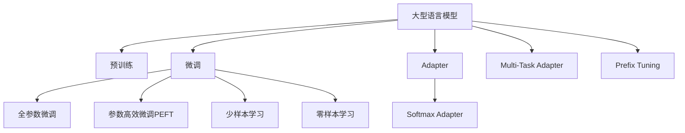

                 

# PEFT技术：高效微调大型语言模型

> 关键词：PEFT,参数高效微调,大型语言模型,大模型微调,自适应预训练

## 1. 背景介绍

### 1.1 问题由来

近年来，随着深度学习技术的发展，预训练大语言模型(如BERT, GPT等)在自然语言处理(NLP)领域取得了显著进展。这些模型通过在大规模无标签文本数据上进行预训练，学习到通用的语言表示，具备强大的语言理解和生成能力。然而，在大规模语言模型的微调过程中，往往面临参数数量庞大、计算成本高昂等挑战。传统的全参数微调方法通常需要较大的计算资源和时间成本，难以在大规模实际应用中推广。

参数高效微调(Parameter-Efficient Fine-Tuning, PEFT)技术应运而生，旨在通过限制微调过程中参数更新的范围，提高微调效率和性能。PEFT方法在大规模预训练模型的微调中得到了广泛应用，并取得了显著效果。

### 1.2 问题核心关键点

PEFT技术的核心思想是在微调过程中，只更新模型中少量的可微调参数，而保留大部分预训练参数不变，从而在减少计算成本的同时，保持模型性能的稳定和一致性。PEFT方法分为多种形式，包括：

- **Adapter**：通过在模型的顶层添加一层全连接层来实现微调。该层参数可以被更新，而底层参数保持不变。
- **Softmax Adapter**：与Adapter类似，但使用softmax激活函数，更适用于分类任务。
- **Multi-Task Adapter**：通过在模型的顶层添加多任务适配层，同时微调不同任务相关的参数，以适应多个下游任务。
- **Prefix Tuning**：通过在输入文本中添加特定的前缀或提示，引导模型输出期望的输出，从而减少微调参数量。

PEFT方法在减少计算成本的同时，也能保证模型的性能和泛化能力，特别适合在资源受限的环境中应用。此外，PEFT技术还可以用于少样本学习和零样本学习，使模型在仅有少量标注样本甚至无标注样本的情况下也能进行推理和生成。

### 1.3 问题研究意义

研究PEFT技术对于加速NLP技术的产业化进程，降低资源消耗，提升模型的实时性和可扩展性具有重要意义：

1. **减少资源消耗**：PEFT方法在微调过程中仅更新少量参数，显著降低了计算成本和存储成本。
2. **提升实时性**：PEFT模型比全参数微调模型具有更快的推理速度，适用于对响应速度要求较高的应用场景。
3. **增强可扩展性**：PEFT模型可以在不增加模型参数的情况下，适应新的下游任务，提高了模型的可扩展性和灵活性。
4. **支持少样本学习和零样本学习**：PEFT方法可以通过巧妙的输入提示，在少量甚至无标注样本的情况下，实现有效的推理和生成。

## 2. 核心概念与联系

### 2.1 核心概念概述

为了更好地理解PEFT技术，本节将介绍几个核心概念：

- **大型语言模型(Large Language Model, LLM)**：如BERT、GPT等，通过大规模无标签文本数据进行预训练，学习到丰富的语言表示。
- **预训练(Pre-training)**：指在大规模无标签文本数据上训练模型，学习到通用的语言表示。
- **微调(Fine-tuning)**：指在预训练模型的基础上，使用下游任务的少量标注数据，通过有监督学习优化模型在特定任务上的性能。
- **参数高效微调(PEFT)**：指在微调过程中，只更新模型中少量的可微调参数，而保留大部分预训练参数不变。
- **Adapter**：通过在模型的顶层添加一层全连接层来实现微调。
- **Softmax Adapter**：与Adapter类似，但使用softmax激活函数。
- **Multi-Task Adapter**：通过在模型的顶层添加多任务适配层，同时微调不同任务相关的参数。
- **Prefix Tuning**：通过在输入文本中添加特定的前缀或提示，引导模型输出期望的输出。
- **少样本学习(Few-shot Learning)**：在仅有少量标注样本的情况下进行模型训练。
- **零样本学习(Zero-shot Learning)**：在无标注样本的情况下进行模型推理和生成。

这些核心概念之间存在紧密联系，共同构成了PEFT技术的理论基础和实践框架。

### 2.2 核心概念原理和架构的 Mermaid 流程图(Mermaid 流程节点中不要有括号、逗号等特殊字符)



该流程图展示了大型语言模型的预训练、微调和PEFT技术之间的关系。大型语言模型通过预训练学习到通用的语言表示，微调过程中，全参数微调方法对所有参数进行更新，而PEFT方法仅更新少量可微调参数，保留大部分预训练参数不变。Adapter、Softmax Adapter、Multi-Task Adapter和Prefix Tuning是PEFT技术的主要形式，适用于不同的下游任务和微调场景。少样本学习和零样本学习则展示了PEFT技术的额外优势，尤其在数据稀缺或无标注数据的情况下，PEFT模型能够快速适应新的任务。

## 3. 核心算法原理 & 具体操作步骤

### 3.1 算法原理概述

PEFT技术的核心原理是利用大型语言模型中已经学习到的知识，仅对少量的可微调参数进行更新，从而在减少计算成本的同时，保持模型的性能和泛化能力。PEFT方法通常采用自适应预训练(Adaptive Pre-training)和微调层(Adaptation Layer)两种方式实现，通过微调层对模型进行适配，达到参数高效微调的目的。

自适应预训练通过在预训练过程中引入任务特定的损失函数，使得模型能够学习到下游任务的特定知识。微调层则是在预训练模型的基础上，添加特定的适配层，对少数参数进行微调，从而适应下游任务。PEFT方法在微调过程中仅更新少量的可微调参数，保留了大部分预训练参数不变，从而提高了微调的效率和性能。

### 3.2 算法步骤详解

PEFT技术的微调步骤一般包括以下几个关键步骤：

**Step 1: 准备预训练模型和数据集**
- 选择合适的预训练语言模型 $M_{\theta}$ 作为初始化参数，如 BERT、GPT等。
- 准备下游任务 $T$ 的少量标注数据集 $D$，划分为训练集、验证集和测试集。一般要求标注数据与预训练数据的分布不要差异过大。

**Step 2: 设计微调层**
- 根据任务类型，设计适配层，包括 Adapter、Softmax Adapter、Multi-Task Adapter 等。
- 对适配层进行初始化，设置学习率、批大小、迭代轮数等超参数。

**Step 3: 执行梯度训练**
- 将训练集数据分批次输入模型，前向传播计算损失函数。
- 反向传播计算参数梯度，根据设定的优化算法和学习率更新适配层的参数。
- 周期性在验证集上评估模型性能，根据性能指标决定是否触发 Early Stopping。
- 重复上述步骤直到满足预设的迭代轮数或 Early Stopping 条件。

**Step 4: 测试和部署**
- 在测试集上评估微调后模型 $M_{\hat{\theta}}$ 的性能，对比微调前后的精度提升。
- 使用微调后的模型对新样本进行推理预测，集成到实际的应用系统中。
- 持续收集新的数据，定期重新微调模型，以适应数据分布的变化。

以上是PEFT技术的一般流程。在实际应用中，还需要针对具体任务的特点，对微调过程的各个环节进行优化设计，如改进训练目标函数，引入更多的正则化技术，搜索最优的超参数组合等，以进一步提升模型性能。

### 3.3 算法优缺点

PEFT方法具有以下优点：
1. **参数效率高**：仅更新少量的可微调参数，减少了计算资源和时间成本。
2. **泛化能力强**：保留了大部分预训练参数，保持了模型的泛化能力和鲁棒性。
3. **适应性强**：适用于不同的下游任务和微调场景，具有广泛的适用性。
4. **可解释性好**：保留了预训练模型的通用语言表示，提供了良好的可解释性。

同时，PEFT方法也存在一定的局限性：
1. **对输入格式敏感**：PEFT方法对输入文本的格式和前缀敏感，可能需要设计巧妙的提示模板。
2. **初始化复杂**：适配层的初始化需要精心设计，否则可能影响微调效果。
3. **性能差异大**：不同形式的PEFT方法对微调效果的提升程度存在差异，需要根据具体任务选择合适的方法。
4. **适用性有限**：对于某些任务，PEFT方法可能无法显著提升性能，甚至可能退化。

尽管存在这些局限性，但就目前而言，PEFT方法是实现高效微调的重要手段，广泛应用于NLP任务的开发和部署中。

### 3.4 算法应用领域

PEFT技术在大规模预训练模型的微调中得到了广泛应用，适用于各种NLP下游任务，包括分类、匹配、生成等。具体而言：

- **文本分类**：如情感分析、主题分类、意图识别等。通过微调使模型学习文本-标签映射。
- **命名实体识别**：识别文本中的人名、地名、机构名等特定实体。通过微调使模型掌握实体边界和类型。
- **关系抽取**：从文本中抽取实体之间的语义关系。通过微调使模型学习实体-关系三元组。
- **问答系统**：对自然语言问题给出答案。将问题-答案对作为微调数据，训练模型学习匹配答案。
- **机器翻译**：将源语言文本翻译成目标语言。通过微调使模型学习语言-语言映射。
- **文本摘要**：将长文本压缩成简短摘要。将文章-摘要对作为微调数据，使模型学习抓取要点。
- **对话系统**：使机器能够与人自然对话。将多轮对话历史作为上下文，微调模型进行回复生成。

除了这些经典任务外，PEFT技术还被创新性地应用到更多场景中，如可控文本生成、常识推理、代码生成、数据增强等，为NLP技术带来了全新的突破。

## 4. 数学模型和公式 & 详细讲解 & 举例说明

### 4.1 数学模型构建

假设预训练语言模型为 $M_{\theta}$，其中 $\theta$ 为预训练得到的模型参数。下游任务 $T$ 的训练集为 $D=\{(x_i,y_i)\}_{i=1}^N, x_i \in \mathcal{X}, y_i \in \mathcal{Y}$，其中 $\mathcal{X}$ 为输入空间，$\mathcal{Y}$ 为输出空间。

定义模型 $M_{\theta}$ 在输入 $x$ 上的输出为 $\hat{y}=M_{\theta}(x)$，表示样本属于类别 $y$ 的概率。设微调层的参数为 $\phi$，则微调后的模型为 $M_{\theta+\phi}$。假设微调层的损失函数为 $\mathcal{L}_{\phi}$，则微调的优化目标为：

$$
\hat{\theta} = \mathop{\arg\min}_{\theta,\phi} \mathcal{L}_{\phi}(M_{\theta+\phi},D) + \lambda\mathcal{L}(\theta,D)
$$

其中 $\mathcal{L}(\theta,D)$ 为预训练模型的损失函数，$\lambda$ 为预训练损失和微调损失之间的平衡系数。

### 4.2 公式推导过程

以 Adapter 为例，假设微调层的输出为 $y_{\phi} = M_{\phi}(M_{\theta}(x))$，则微调层的损失函数为交叉熵损失：

$$
\mathcal{L}_{\phi} = -\frac{1}{N}\sum_{i=1}^N \log M_{\phi}(M_{\theta}(x_i))
$$

通过反向传播算法，计算微调层参数 $\phi$ 的梯度：

$$
\nabla_{\phi}\mathcal{L}_{\phi} = -\frac{1}{N}\sum_{i=1}^N M_{\theta}(x_i) - (1-M_{\theta}(x_i))\nabla_{\phi}M_{\phi}(M_{\theta}(x_i))
$$

将梯度代入模型参数更新公式：

$$
\theta \leftarrow \theta - \eta \nabla_{\theta}\mathcal{L}(\theta) - \eta\lambda\theta
$$

$$
\phi \leftarrow \phi - \eta \nabla_{\phi}\mathcal{L}_{\phi} - \eta\lambda\phi
$$

其中 $\eta$ 为学习率，$\nabla_{\theta}\mathcal{L}(\theta)$ 为预训练模型的梯度。

通过上述公式，可以在微调过程中仅更新微调层的参数 $\phi$，而保留预训练模型的参数 $\theta$ 不变。

### 4.3 案例分析与讲解

假设我们在命名实体识别任务上进行PEFT微调，模型采用Adapter形式。具体步骤如下：

1. 准备预训练模型和标注数据集。
2. 设计Adapter层，并进行初始化。
3. 在训练集上进行微调，计算Adapter层的损失函数和梯度。
4. 反向传播更新Adapter层参数。
5. 在验证集上评估模型性能，根据指标调整学习率或Early Stopping阈值。
6. 在测试集上评估最终模型性能。

在实践中， Adapter层通常采用线性变换形式，即：

$$
y_{\phi} = M_{\phi}(M_{\theta}(x)) = M_{\phi}W_{\phi}M_{\theta}(x) + b_{\phi}
$$

其中 $W_{\phi}$ 和 $b_{\phi}$ 为Adapter层的参数。

## 5. 项目实践：代码实例和详细解释说明

### 5.1 开发环境搭建

在进行PEFT实践前，我们需要准备好开发环境。以下是使用Python进行PyTorch开发的环境配置流程：

1. 安装Anaconda：从官网下载并安装Anaconda，用于创建独立的Python环境。

2. 创建并激活虚拟环境：
```bash
conda create -n pytorch-env python=3.8 
conda activate pytorch-env
```

3. 安装PyTorch：根据CUDA版本，从官网获取对应的安装命令。例如：
```bash
conda install pytorch torchvision torchaudio cudatoolkit=11.1 -c pytorch -c conda-forge
```

4. 安装Transformers库：
```bash
pip install transformers
```

5. 安装各类工具包：
```bash
pip install numpy pandas scikit-learn matplotlib tqdm jupyter notebook ipython
```

完成上述步骤后，即可在`pytorch-env`环境中开始PEFT实践。

### 5.2 源代码详细实现

下面我以命名实体识别(NER)任务为例，给出使用Transformers库对BERT模型进行Adapter微调的PyTorch代码实现。

首先，定义NER任务的数据处理函数：

```python
from transformers import BertTokenizer
from torch.utils.data import Dataset
import torch

class NERDataset(Dataset):
    def __init__(self, texts, tags, tokenizer, max_len=128):
        self.texts = texts
        self.tags = tags
        self.tokenizer = tokenizer
        self.max_len = max_len
        
    def __len__(self):
        return len(self.texts)
    
    def __getitem__(self, item):
        text = self.texts[item]
        tags = self.tags[item]
        
        encoding = self.tokenizer(text, return_tensors='pt', max_length=self.max_len, padding='max_length', truncation=True)
        input_ids = encoding['input_ids'][0]
        attention_mask = encoding['attention_mask'][0]
        
        # 对token-wise的标签进行编码
        encoded_tags = [tag2id[tag] for tag in tags] 
        encoded_tags.extend([tag2id['O']] * (self.max_len - len(encoded_tags)))
        labels = torch.tensor(encoded_tags, dtype=torch.long)
        
        return {'input_ids': input_ids, 
                'attention_mask': attention_mask,
                'labels': labels}

# 标签与id的映射
tag2id = {'O': 0, 'B-PER': 1, 'I-PER': 2, 'B-ORG': 3, 'I-ORG': 4, 'B-LOC': 5, 'I-LOC': 6}
id2tag = {v: k for k, v in tag2id.items()}

# 创建dataset
tokenizer = BertTokenizer.from_pretrained('bert-base-cased')

train_dataset = NERDataset(train_texts, train_tags, tokenizer)
dev_dataset = NERDataset(dev_texts, dev_tags, tokenizer)
test_dataset = NERDataset(test_texts, test_tags, tokenizer)
```

然后，定义模型和优化器：

```python
from transformers import BertForTokenClassification, AdamW

model = BertForTokenClassification.from_pretrained('bert-base-cased', num_labels=len(tag2id))

optimizer = AdamW(model.parameters(), lr=2e-5)
```

接着，定义微调层：

```python
from transformers import BertAdapter

# 设计Adapter层，输出维度为32
adapter_layer = BertAdapter(d_model=32, after_lm_head=True)
model.add_module('adapter_layer', adapter_layer)
```

在模型中添加一个Adapter层，并初始化参数。

然后，定义训练和评估函数：

```python
from torch.utils.data import DataLoader
from tqdm import tqdm
from sklearn.metrics import classification_report

device = torch.device('cuda') if torch.cuda.is_available() else torch.device('cpu')
model.to(device)

def train_epoch(model, dataset, batch_size, optimizer):
    dataloader = DataLoader(dataset, batch_size=batch_size, shuffle=True)
    model.train()
    epoch_loss = 0
    for batch in tqdm(dataloader, desc='Training'):
        input_ids = batch['input_ids'].to(device)
        attention_mask = batch['attention_mask'].to(device)
        labels = batch['labels'].to(device)
        model.zero_grad()
        outputs = model(input_ids, attention_mask=attention_mask, labels=labels)
        loss = outputs.loss
        epoch_loss += loss.item()
        loss.backward()
        optimizer.step()
    return epoch_loss / len(dataloader)

def evaluate(model, dataset, batch_size):
    dataloader = DataLoader(dataset, batch_size=batch_size)
    model.eval()
    preds, labels = [], []
    with torch.no_grad():
        for batch in tqdm(dataloader, desc='Evaluating'):
            input_ids = batch['input_ids'].to(device)
            attention_mask = batch['attention_mask'].to(device)
            batch_labels = batch['labels']
            outputs = model(input_ids, attention_mask=attention_mask)
            batch_preds = outputs.logits.argmax(dim=2).to('cpu').tolist()
            batch_labels = batch_labels.to('cpu').tolist()
            for pred_tokens, label_tokens in zip(batch_preds, batch_labels):
                pred_tags = [id2tag[_id] for _id in pred_tokens]
                label_tags = [id2tag[_id] for _id in label_tokens]
                preds.append(pred_tags[:len(label_tokens)])
                labels.append(label_tags)
                
    print(classification_report(labels, preds))
```

最后，启动训练流程并在测试集上评估：

```python
epochs = 5
batch_size = 16

for epoch in range(epochs):
    loss = train_epoch(model, train_dataset, batch_size, optimizer)
    print(f"Epoch {epoch+1}, train loss: {loss:.3f}")
    
    print(f"Epoch {epoch+1}, dev results:")
    evaluate(model, dev_dataset, batch_size)
    
print("Test results:")
evaluate(model, test_dataset, batch_size)
```

以上就是使用PyTorch对BERT进行Adapter微调的完整代码实现。可以看到，得益于Transformers库的强大封装，我们可以用相对简洁的代码完成BERT模型的微调。

### 5.3 代码解读与分析

让我们再详细解读一下关键代码的实现细节：

**NERDataset类**：
- `__init__`方法：初始化文本、标签、分词器等关键组件。
- `__len__`方法：返回数据集的样本数量。
- `__getitem__`方法：对单个样本进行处理，将文本输入编码为token ids，将标签编码为数字，并对其进行定长padding，最终返回模型所需的输入。

**tag2id和id2tag字典**：
- 定义了标签与数字id之间的映射关系，用于将token-wise的预测结果解码回真实的标签。

**训练和评估函数**：
- 使用PyTorch的DataLoader对数据集进行批次化加载，供模型训练和推理使用。
- 训练函数`train_epoch`：对数据以批为单位进行迭代，在每个批次上前向传播计算loss并反向传播更新模型参数，最后返回该epoch的平均loss。
- 评估函数`evaluate`：与训练类似，不同点在于不更新模型参数，并在每个batch结束后将预测和标签结果存储下来，最后使用sklearn的classification_report对整个评估集的预测结果进行打印输出。

**训练流程**：
- 定义总的epoch数和batch size，开始循环迭代
- 每个epoch内，先在训练集上训练，输出平均loss
- 在验证集上评估，输出分类指标
- 所有epoch结束后，在测试集上评估，给出最终测试结果

可以看到，PyTorch配合Transformers库使得BERT微调的代码实现变得简洁高效。开发者可以将更多精力放在数据处理、模型改进等高层逻辑上，而不必过多关注底层的实现细节。

当然，工业级的系统实现还需考虑更多因素，如模型的保存和部署、超参数的自动搜索、更灵活的任务适配层等。但核心的微调范式基本与此类似。

## 6. 实际应用场景
### 6.1 智能客服系统

基于PEFT技术的大语言模型微调，可以广泛应用于智能客服系统的构建。传统客服往往需要配备大量人力，高峰期响应缓慢，且一致性和专业性难以保证。而使用PEFT微调后的对话模型，可以7x24小时不间断服务，快速响应客户咨询，用自然流畅的语言解答各类常见问题。

在技术实现上，可以收集企业内部的历史客服对话记录，将问题和最佳答复构建成监督数据，在此基础上对预训练对话模型进行微调。微调后的对话模型能够自动理解用户意图，匹配最合适的答案模板进行回复。对于客户提出的新问题，还可以接入检索系统实时搜索相关内容，动态组织生成回答。如此构建的智能客服系统，能大幅提升客户咨询体验和问题解决效率。

### 6.2 金融舆情监测

金融机构需要实时监测市场舆论动向，以便及时应对负面信息传播，规避金融风险。传统的人工监测方式成本高、效率低，难以应对网络时代海量信息爆发的挑战。基于PEFT技术的大语言模型微调，可以应用于金融领域相关的新闻、报道、评论等文本数据，进行情感分析、主题分类等任务，实时获取舆情变化趋势，一旦发现负面信息激增等异常情况，系统便会自动预警，帮助金融机构快速应对潜在风险。

### 6.3 个性化推荐系统

当前的推荐系统往往只依赖用户的历史行为数据进行物品推荐，无法深入理解用户的真实兴趣偏好。基于PEFT技术的大语言模型微调，个性化推荐系统可以更好地挖掘用户行为背后的语义信息，从而提供更精准、多样的推荐内容。

在实践中，可以收集用户浏览、点击、评论、分享等行为数据，提取和用户交互的物品标题、描述、标签等文本内容。将文本内容作为模型输入，用户的后续行为（如是否点击、购买等）作为监督信号，在此基础上微调预训练语言模型。微调后的模型能够从文本内容中准确把握用户的兴趣点。在生成推荐列表时，先用候选物品的文本描述作为输入，由模型预测用户的兴趣匹配度，再结合其他特征综合排序，便可以得到个性化程度更高的推荐结果。

### 6.4 未来应用展望

随着PEFT技术和预训练大语言模型的不断发展，其应用场景将不断拓展，为各行各业带来变革性影响。

在智慧医疗领域，基于PEFT的医学问答、病历分析、药物研发等应用将提升医疗服务的智能化水平，辅助医生诊疗，加速新药开发进程。

在智能教育领域，PEFT技术可应用于作业批改、学情分析、知识推荐等方面，因材施教，促进教育公平，提高教学质量。

在智慧城市治理中，PEFT模型可应用于城市事件监测、舆情分析、应急指挥等环节，提高城市管理的自动化和智能化水平，构建更安全、高效的未来城市。

此外，在企业生产、社会治理、文娱传媒等众多领域，基于PEFT技术的大语言模型微调也将不断涌现，为经济社会发展注入新的动力。

## 7. 工具和资源推荐
### 7.1 学习资源推荐

为了帮助开发者系统掌握PEFT技术的理论基础和实践技巧，这里推荐一些优质的学习资源：

1. 《Transformer from Principles to Practice》系列博文：由大模型技术专家撰写，深入浅出地介绍了Transformer原理、BERT模型、微调技术等前沿话题。

2. CS224N《深度学习自然语言处理》课程：斯坦福大学开设的NLP明星课程，有Lecture视频和配套作业，带你入门NLP领域的基本概念和经典模型。

3. 《Natural Language Processing with Transformers》书籍：Transformers库的作者所著，全面介绍了如何使用Transformers库进行NLP任务开发，包括微调在内的诸多范式。

4. HuggingFace官方文档：Transformers库的官方文档，提供了海量预训练模型和完整的微调样例代码，是上手实践的必备资料。

5. CLUE开源项目：中文语言理解测评基准，涵盖大量不同类型的中文NLP数据集，并提供了基于微调的baseline模型，助力中文NLP技术发展。

通过对这些资源的学习实践，相信你一定能够快速掌握PEFT技术的精髓，并用于解决实际的NLP问题。
###  7.2 开发工具推荐

高效的开发离不开优秀的工具支持。以下是几款用于PEFT开发的常用工具：

1. PyTorch：基于Python的开源深度学习框架，灵活动态的计算图，适合快速迭代研究。大部分预训练语言模型都有PyTorch版本的实现。

2. TensorFlow：由Google主导开发的开源深度学习框架，生产部署方便，适合大规模工程应用。同样有丰富的预训练语言模型资源。

3. Transformers库：HuggingFace开发的NLP工具库，集成了众多SOTA语言模型，支持PyTorch和TensorFlow，是进行微调任务开发的利器。

4. Weights & Biases：模型训练的实验跟踪工具，可以记录和可视化模型训练过程中的各项指标，方便对比和调优。与主流深度学习框架无缝集成。

5. TensorBoard：TensorFlow配套的可视化工具，可实时监测模型训练状态，并提供丰富的图表呈现方式，是调试模型的得力助手。

6. Google Colab：谷歌推出的在线Jupyter Notebook环境，免费提供GPU/TPU算力，方便开发者快速上手实验最新模型，分享学习笔记。

合理利用这些工具，可以显著提升PEFT任务的开发效率，加快创新迭代的步伐。

### 7.3 相关论文推荐

PEFT技术在大规模预训练模型的微调中得到了广泛应用，以下是几篇奠基性的相关论文，推荐阅读：

1. Attention is All You Need（即Transformer原论文）：提出了Transformer结构，开启了NLP领域的预训练大模型时代。

2. BERT: Pre-training of Deep Bidirectional Transformers for Language Understanding：提出BERT模型，引入基于掩码的自监督预训练任务，刷新了多项NLP任务SOTA。

3. Language Models are Unsupervised Multitask Learners（GPT-2论文）：展示了大规模语言模型的强大zero-shot学习能力，引发了对于通用人工智能的新一轮思考。

4. Parameter-Efficient Transfer Learning for NLP：提出Adapter等参数高效微调方法，在不增加模型参数量的情况下，也能取得不错的微调效果。

5. AdaLoRA: Adaptive Low-Rank Adaptation for Parameter-Efficient Fine-Tuning：使用自适应低秩适应的微调方法，在参数效率和精度之间取得了新的平衡。

6. Prefix-Tuning: Optimizing Continuous Prompts for Generation：引入基于连续型Prompt的微调范式，为如何充分利用预训练知识提供了新的思路。

这些论文代表了大语言模型PEFT技术的发展脉络。通过学习这些前沿成果，可以帮助研究者把握学科前进方向，激发更多的创新灵感。

## 8. 总结：未来发展趋势与挑战

### 8.1 总结

本文对PEFT技术进行了全面系统的介绍。首先阐述了PEFT技术的背景、核心思想和实际应用，明确了其在大规模语言模型微调中的重要地位。其次，从原理到实践，详细讲解了PEFT数学模型和具体实现，给出了微调任务开发的完整代码实例。最后，探讨了PEFT技术在多个行业领域的应用前景，展示了其广阔的发展潜力。

通过本文的系统梳理，可以看到，PEFT技术正在成为NLP领域的重要范式，极大地拓展了预训练语言模型的应用边界，催生了更多的落地场景。PEFT方法通过限制微调过程中参数更新的范围，显著提高了微调效率和性能，适用于各种资源受限的环境。未来，随着PEFT技术的不断演进，其应用领域将更加广泛，为各行各业带来深刻的变革。

### 8.2 未来发展趋势

展望未来，PEFT技术将呈现以下几个发展趋势：

1. **参数效率进一步提升**：未来将涌现更多参数高效的PEFT方法，如LoRA、KNN等，在保持性能的同时，进一步降低微调资源消耗。

2. **多模态PEFT崛起**：PEFT技术将不仅仅局限于文本数据，还会扩展到图像、视频、语音等多模态数据微调。多模态信息的融合，将显著提升语言模型对现实世界的理解和建模能力。

3. **自适应预训练技术发展**：自适应预训练将成为PEFT技术的核心，通过引入更多先验知识，引导微调过程学习更全面、准确的语言模型。

4. **少样本和零样本学习研究**：PEFT方法将在少样本和零样本学习中发挥更大作用，通过巧妙的输入提示，在少量甚至无标注样本的情况下，实现有效的推理和生成。

5. **个性化和定制化微调**：根据用户需求和数据分布，进行个性化和定制化的微调，提高模型的实用性和效率。

6. **动态微调和持续学习**：PEFT模型将更加注重动态微调和持续学习，能够快速适应新数据和新任务，保持模型的活力和适应性。

这些趋势凸显了PEFT技术的广阔前景。这些方向的探索发展，必将进一步提升PEFT模型的性能和应用范围，为人类认知智能的进化带来深远影响。

### 8.3 面临的挑战

尽管PEFT技术已经取得了瞩目成就，但在迈向更加智能化、普适化应用的过程中，它仍面临着诸多挑战：

1. **输入格式敏感**：PEFT方法对输入文本的格式和前缀敏感，可能需要设计巧妙的提示模板。
2. **初始化复杂**：适配层的初始化需要精心设计，否则可能影响微调效果。
3. **性能差异大**：不同形式的PEFT方法对微调效果的提升程度存在差异，需要根据具体任务选择合适的方法。
4. **适用性有限**：对于某些任务，PEFT方法可能无法显著提升性能，甚至可能退化。
5. **知识整合能力不足**：现有PEFT模型往往局限于任务内数据，难以灵活吸收和运用更广泛的先验知识。
6. **安全性有待保障**：预训练语言模型可能学习到有偏见、有害的信息，通过微调传递到下游任务，产生误导性、歧视性的输出，给实际应用带来安全隐患。

尽管存在这些挑战，但随着PEFT技术的不断完善和优化，其应用前景仍然广阔。未来研究需要在以上方向寻求新的突破，进一步提升PEFT模型的性能和实用性。

### 8.4 研究展望

面向未来，PEFT技术的突破将依赖于以下几个方向：

1. **参数高效和计算高效的PEFT方法**：开发更加参数高效和计算高效的微调方法，在保持性能的同时，进一步降低计算成本。
2. **自适应预训练技术**：引入更多先验知识，如知识图谱、逻辑规则等，引导PEFT模型学习更准确、合理的语言模型。
3. **多模态PEFT研究**：将视觉、语音、文本等多模态数据进行协同建模，提升模型对现实世界的理解能力。
4. **动态微调和持续学习**：实现动态微调和持续学习，使模型能够适应新数据和新任务，保持活力和适应性。
5. **跨领域和多任务PEFT**：研究跨领域和多任务PEFT方法，提高模型的通用性和适应性。
6. **可解释性和伦理性研究**：增强PEFT模型的可解释性，确保模型输出的公平性和伦理性。

这些研究方向的探索，必将引领PEFT技术迈向更高的台阶，为构建安全、可靠、可解释、可控的智能系统铺平道路。面向未来，PEFT技术还需要与其他人工智能技术进行更深入的融合，如知识表示、因果推理、强化学习等，多路径协同发力，共同推动自然语言理解和智能交互系统的进步。只有勇于创新、敢于突破，才能不断拓展语言模型的边界，让智能技术更好地造福人类社会。

## 9. 附录：常见问题与解答

**Q1：PEFT和全参数微调有什么区别？**

A: PEFT（Parameter-Efficient Fine-Tuning）与全参数微调（Full Fine-Tuning）最大的区别在于参数更新的范围。全参数微调对模型所有参数进行更新，而PEFT仅更新微调层的参数，保留大部分预训练参数不变。PEFT通过限制参数更新范围，显著降低了计算成本和时间成本，同时保留了模型的泛化能力和鲁棒性。

**Q2：PEFT微调过程中如何选择初始化参数？**

A: PEFT微调中，适配层的初始化参数对微调效果有很大影响。通常有以下几种方法：
1. 使用模型预训练层的参数初始化适配层。这种方法利用了模型预训练层的初始化参数，可以使适配层更快地收敛。
2. 使用随机初始化。这种方法可以在微调过程中逐步学习适配层的参数，但初始化过于随机可能导致微调过程不稳定。
3. 使用预训练层的部分参数进行初始化。这种方法可以在保持预训练参数不变的情况下，逐步学习适配层的参数，是一种折中方案。

**Q3：PEFT微调过程中如何进行参数冻结？**

A: PEFT微调过程中，通常需要保留大部分预训练参数不变，以避免破坏预训练模型的泛化能力。可以通过以下几种方法实现参数冻结：
1. 仅更新微调层的参数，其他参数保持不变。
2. 使用梯度裁剪，将微调层以外的参数梯度设为零，防止其参与更新。
3. 使用固定参数优化器，如SGD等，对微调层以外的参数进行固定，不参与更新。

**Q4：PEFT微调过程中如何避免过拟合？**

A: PEFT微调过程中，为避免过拟合，可以采取以下几种方法：
1. 数据增强：通过回译、近义替换等方式扩充训练集。
2. 正则化：使用L2正则、Dropout、Early Stopping等技术，防止模型过度适应训练集。
3. 对抗训练：加入对抗样本，提高模型鲁棒性。
4. 动态调整学习率：根据模型性能动态调整学习率，避免过拟合。

这些方法可以结合使用，根据具体任务和数据特点进行选择和优化。

**Q5：PEFT微调过程中如何选择微调层？**

A: PEFT微调过程中，选择适合的微调层对微调效果有很大影响。以下是几种常见的微调层：
1. Adapter：通过在模型的顶层添加一层全连接层来实现微调。
2. Softmax Adapter：与Adapter类似，但使用softmax激活函数，更适用于分类任务。
3. Multi-Task Adapter：通过在模型的顶层添加多任务适配层，同时微调不同任务相关的参数。
4. Prefix Tuning：通过在输入文本中添加特定的前缀或提示，引导模型输出期望的输出。

在选择微调层时，需要根据具体任务和模型架构进行选择，通常需要进行多次试验和优化。

---

作者：禅与计算机程序设计艺术 / Zen and the Art of Computer Programming

