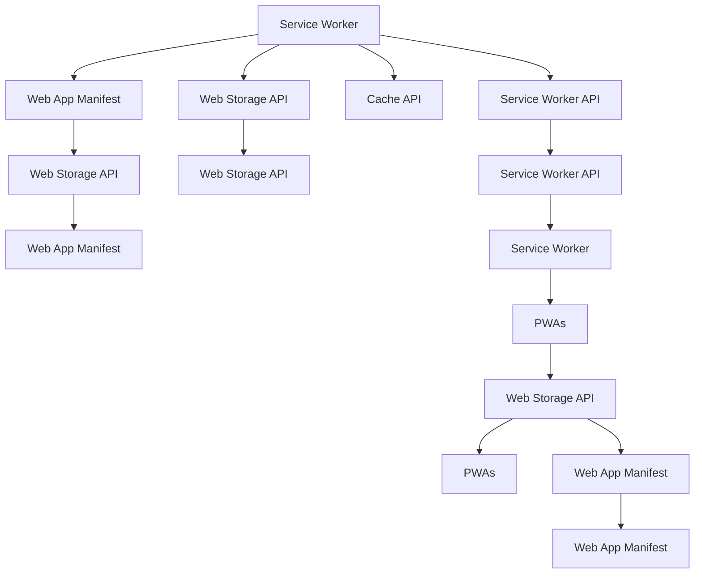

                 

# PWA离线存储技术：Service Worker应用

> 关键词： Progressive Web Apps (PWAs)，Service Worker，离线存储，Web App Manifest，Cache API，Service Worker API，Web Storage API，安全与隐私

## 1. 背景介绍

### 1.1 问题由来

随着移动互联网的迅猛发展和智能设备的普及，网页已经成为一种重要的信息获取和交互方式。然而，网页作为Web 2.0的产物，天然存在一些不足，如依赖网络、页面加载速度慢、用户体验差等。为了解决这些问题，Web App出现并逐渐兴起。Progressive Web Apps (PWAs)是一种基于Web的新型应用形式，通过Service Worker等Web技术实现离线存储和加速加载等功能，从而提升了Web应用的用户体验，甚至可以与原生应用相媲美。

Service Worker是PWAs的核心技术之一，它负责网络请求的拦截、缓存数据的处理、推送通知的发送等。通过Service Worker，PWAs可以在离线状态下运行，无需依赖互联网即可提供快速响应的服务。同时，Service Worker还能帮助PWAs缓存用户偏好和历史数据，提升应用的个性化和稳定性和安全性。

## 2. 核心概念与联系

### 2.1 核心概念概述

为了更好地理解Service Worker在PWA中的作用，下面列出几个关键概念：

- **Progressive Web Apps (PWAs)**：基于Web的应用，通过Web技术增强功能，提供接近原生应用的用户体验，支持离线存储、快速加载等。
- **Service Worker**：一种在Web浏览器后台运行的脚本，可以拦截网络请求、处理缓存数据、推送通知等。
- **Web App Manifest**：包含应用元数据和配置信息的JSON文件，用于标识和管理PWAs。
- **Cache API**：提供浏览器缓存机制的API，可以控制缓存数据的存储、获取、更新等操作。
- **Service Worker API**：允许开发人员编写自定义的Service Worker，用于拦截网络请求和处理缓存数据。
- **Web Storage API**：提供浏览器本地存储的机制，支持sessionStorage和localStorage两种存储类型。
- **安全与隐私**：Service Worker和Web Storage API的配置和管理可以增强Web应用的安全性和隐私保护。

这些概念之间的逻辑关系可以通过以下Mermaid流程图来展示：



这个流程图展示了大语言模型的核心概念及其之间的关系：

1. Service Worker负责拦截网络请求和处理缓存数据，与Web Storage API协同工作，提供离线存储和快速加载功能。
2. Web App Manifest用于配置和管理PWAs，包括应用图标、主题颜色等。
3. Cache API提供浏览器缓存机制，用于控制缓存数据的存储和获取。
4. Service Worker API允许开发人员编写自定义的Service Worker，用于拦截网络请求和处理缓存数据。
5. Web Storage API提供浏览器本地存储机制，用于缓存应用数据和偏好设置。
6. PWAs基于Web技术构建，支持离线存储和快速加载，提升用户体验。

## 3. 核心算法原理 & 具体操作步骤

### 3.1 算法原理概述

Service Worker在PWAs中的核心作用是通过拦截网络请求、缓存数据、处理推送通知等，提供离线存储和快速加载功能。Service Worker的工作原理如下：

1. 当PWA页面加载时，浏览器会自动注册Service Worker，拦截所有网络请求。
2. 在Service Worker中，开发人员编写处理逻辑，如拦截请求、缓存数据、发送推送通知等。
3. 当用户进入离线状态时，Service Worker会根据缓存策略将请求的数据缓存到本地，然后从缓存中读取数据。
4. 当用户重新上线时，Service Worker会将缓存中的数据同步到服务器，更新本地缓存。

Service Worker的工作流程可以概括为：

1. 拦截请求：Service Worker拦截所有网络请求，检查缓存数据是否存在。
2. 缓存数据：如果缓存中存在数据，则直接返回缓存数据；否则从网络请求中获取数据，并将其缓存到本地。
3. 处理响应：Service Worker根据配置处理响应数据，并发送给用户。

### 3.2 算法步骤详解

以下是Service Worker在PWAs中的应用步骤：

**Step 1: 准备Web App Manifest**

首先，需要准备Web App Manifest，包含应用元数据和配置信息。该JSON文件通常以application.json或app.json为文件名，在HTML页面<head>标签中引用。示例代码如下：

```html
<head>
  <meta name="viewport" content="width=device-width, initial-scale=1.0">
  <link rel="manifest" href="/manifest.json">
</head>
```

**Step 2: 注册Service Worker**

在JavaScript代码中，通过fetch函数加载Service Worker文件，并注册Service Worker。示例代码如下：

```javascript
if ('serviceWorker' in navigator) {
  navigator.serviceWorker.register('/service-worker.js').then(function(registration) {
    console.log('ServiceWorker registration successful with scope: ', registration.scope);
  }).catch(function(error) {
    console.log('ServiceWorker registration failed: ', error);
  });
}
```

**Step 3: 拦截网络请求**

在Service Worker文件中，使用fetch函数拦截网络请求，并处理缓存数据。示例代码如下：

```javascript
self.addEventListener('fetch', function(event) {
  event.respondWith(
    caches.match(event.request).then(function(response) {
      if (response) {
        return response;
      } else {
        return fetch(event.request).then(function(response) {
          caches.put(event.request, response.clone());
          return response;
        });
      }
    })
  );
});
```

**Step 4: 处理缓存数据**

在Service Worker文件中，使用caches对象管理缓存数据。示例代码如下：

```javascript
self.addEventListener('install', function(event) {
  event.waitUntil(
    caches.open('cache-v1').then(function(cache) {
      return cache.addAll([
        '/',
        '/manifest.json',
        '/styles.css',
        '/scripts.js'
      ]);
    })
  );
});

self.addEventListener('activate', function(event) {
  var cacheWhitelist = ['cache-v1'];
  event.waitUntil(
    caches.keys().then(function(keyList) {
      return Promise.all(keyList.map(function(key) {
        if (cacheWhitelist.indexOf(key) === -1) {
          return caches.delete(key);
        }
      }));
    })
  );
});
```

**Step 5: 处理推送通知**

在Service Worker文件中，使用pushManager对象处理推送通知。示例代码如下：

```javascript
self.addEventListener('push', function(event) {
  var data = event.data.json();
  console.log('Received push message: ', data);
  // 在此处处理推送通知
});
```

### 3.3 算法优缺点

Service Worker在PWAs中的优点：

1. 支持离线存储和快速加载，提升用户体验。
2. 通过拦截网络请求，实现数据缓存和推送通知。
3. 增强PWAs的安全性和隐私保护。

Service Worker的缺点：

1. 开发和调试复杂，需要编写自定义Service Worker脚本。
2. 缓存策略需精心设计，避免缓存过期或数据不一致问题。
3. 对浏览器兼容性要求高，不同浏览器的Service Worker支持情况不一。

### 3.4 算法应用领域

Service Worker在PWAs中的应用领域包括：

1. 离线存储：通过缓存数据，实现离线存储和快速加载。
2. 数据同步：通过缓存同步数据，实现数据同步和恢复。
3. 推送通知：通过推送通知，实现实时信息和提醒。
4. 用户注册：通过Service Worker注册，实现用户注册和身份验证。
5. 访问控制：通过拦截网络请求，实现访问控制和数据加密。

## 4. 数学模型和公式 & 详细讲解 & 举例说明

### 4.1 数学模型构建

Service Worker在PWAs中的作用是通过缓存机制提供离线存储和快速加载功能，从而提升用户体验。其核心是缓存策略的设计和管理。

假设PWAs需要缓存的数据总量为 $D$，缓存大小为 $C$。则缓存策略可以概括为以下几个步骤：

1. 缓存数据的选取：从总数据量 $D$ 中选取需要缓存的数据 $S$。
2. 缓存策略的设计：设计缓存策略 $P$，将数据 $S$ 缓存到缓存大小 $C$ 的缓存区 $B$ 中。
3. 缓存数据的更新：根据缓存策略 $P$，定期更新缓存区 $B$ 中的数据。

缓存策略 $P$ 可以根据实际需求设计，如先进先出、最少使用等策略。示例代码如下：

```javascript
function CacheStrategy(D, C) {
  var S = 0;
  var B = [];
  var P = function() {
    // 先进先出
    if (S > C) {
      var oldest = B.shift();
      S -= oldest.length;
      delete oldest.key;
    }
  };
  
  return {
    add: function(data) {
      if (S + data.length > C) {
        P();
      }
      S += data.length;
      var key = 'cache-' + S;
      B.push({key: key, data: data});
      return key;
    },
    get: function(key) {
      var index = B.findIndex(function(item) {
        return item.key === key;
      });
      if (index !== -1) {
        return B[index].data;
      } else {
        return null;
      }
    }
  };
}

var cache = CacheStrategy(D, C);
var key = cache.add(data);
var data = cache.get(key);
```

### 4.2 公式推导过程

假设缓存策略为先进先出（FIFO），则缓存区 $B$ 中数据的长度可以表示为：

$$
B = D - C
$$

当添加新数据 $d$ 后，缓存区中数据的长度变为：

$$
B' = B + d
$$

若 $B' > C$，则需要将最古老的数据 $b$ 从缓存区中删除，此时缓存区中数据的长度变为：

$$
B' = B' - b
$$

因此，先进先出策略的缓存更新过程可以表示为：

$$
B' = \begin{cases}
B + d, & B + d \leq C \\
B + d - b, & B + d > C
\end{cases}
$$

其中 $b$ 为最古老的数据，$d$ 为新添加的数据。

### 4.3 案例分析与讲解

假设缓存策略为先进先出，缓存大小为 $C=1000$，总数据量为 $D=2000$。则每次添加新数据后，缓存区中的数据长度 $B$ 的变化过程如下：

| 时间 | 缓存数据量 | 缓存区 | 新数据 |
| --- | --- | --- | --- |
| 0 | 0 | 空 | |
| 1 | 0 | 空 | $d_1$ |
| 2 | 1 | $b_1$ | $d_2$ |
| 3 | 2 | $b_1, d_2$ | $d_3$ |
| 4 | 3 | $b_1, d_2, d_3$ | $d_4$ |
| ... | ... | ... | ... |
| 1999 | 1998 | $b_{1998}, d_{1}, d_{2}, ..., d_{1998}$ | $d_{1999}$ |
| 2000 | 1000 | $b_{1}, b_{2}, ..., b_{999}, d_{1}, d_{2}, ..., d_{1000}$ | $d_{1001}$ |

在实际应用中，缓存策略的设计需根据实际需求进行优化，如最小使用策略、时间策略等。此外，缓存数据的选取和更新过程也需仔细考虑，以避免缓存过期或数据不一致问题。

## 5. 项目实践：代码实例和详细解释说明

### 5.1 开发环境搭建

在项目实践中，需要先搭建好开发环境。以下是使用Python和Node.js搭建Web App的开发环境步骤：

1. 安装Node.js：从官网下载并安装Node.js，安装完成后即可在终端运行命令。

2. 创建项目目录：使用npm init命令创建新的项目目录。

3. 安装相关依赖：使用npm install命令安装React、Webpack等依赖库。

4. 编写代码：使用IDE或文本编辑器编写JavaScript代码，并在HTML文件中引入。

5. 打包构建：使用Webpack构建项目，生成dist目录中的静态文件。

### 5.2 源代码详细实现

以下是使用Service Worker实现离线存储和快速加载的示例代码：

**index.html**

```html
<!DOCTYPE html>
<html>
<head>
  <meta charset="utf-8">
  <meta name="viewport" content="width=device-width, initial-scale=1.0">
  <title>PWA Offline Storage</title>
</head>
<body>
  <h1>Progressive Web Apps Offline Storage</h1>
  <p>Press any key to load data from offline cache</p>
  <script>
    function loadData() {
      event.preventDefault();
      fetch('/data.json').then(function(response) {
        return response.json();
      }).then(function(data) {
        console.log(data);
      }).catch(function(error) {
        console.error(error);
      });
    }
  </script>
</body>
</html>
```

**service-worker.js**

```javascript
self.addEventListener('install', function(event) {
  event.waitUntil(
    caches.open('cache-v1').then(function(cache) {
      return cache.addAll([
        '/',
        '/manifest.json',
        '/styles.css',
        '/scripts.js'
      ]);
    })
  );
});

self.addEventListener('activate', function(event) {
  var cacheWhitelist = ['cache-v1'];
  event.waitUntil(
    caches.keys().then(function(keyList) {
      return Promise.all(keyList.map(function(key) {
        if (cacheWhitelist.indexOf(key) === -1) {
          return caches.delete(key);
        }
      }));
    })
  );
});

self.addEventListener('fetch', function(event) {
  event.respondWith(
    caches.match(event.request).then(function(response) {
      if (response) {
        return response;
      } else {
        return fetch(event.request).then(function(response) {
          caches.put(event.request, response.clone());
          return response;
        });
      }
    })
  );
});
```

**manifest.json**

```json
{
  "name": "PWA Offline Storage",
  "short_name": "PWA",
  "start_url": "/index.html",
  "display": "standalone",
  "background_color": "#ffffff",
  "theme_color": "#000000"
}
```

**package.json**

```json
{
  "name": "PWA Offline Storage",
  "version": "1.0.0",
  "dependencies": {
    "react": "^16.8.6",
    "webpack": "^4.39.1"
  }
}
```

**webpack.config.js**

```javascript
const path = require('path');
const webpack = require('webpack');

module.exports = {
  entry: './index.js',
  output: {
    path: path.resolve(__dirname, 'dist'),
    filename: 'bundle.js'
  },
  module: {
    rules: [
      {
        test: /\.js$/,
        exclude: /node_modules/,
        use: {
          loader: 'babel-loader',
          options: {
            presets: ['@babel/preset-env']
          }
        }
      }
    ]
  },
  plugins: [
    new webpack.DefinePlugin({
      __DEV__: JSON.stringify(process.env.NODE_ENV !== 'production')
    })
  ]
};
```

**package.json**

```json
{
  "name": "PWA Offline Storage",
  "version": "1.0.0",
  "dependencies": {
    "react": "^16.8.6",
    "webpack": "^4.39.1"
  }
}
```

**index.js**

```javascript
import React from 'react';
import ReactDOM from 'react-dom';

ReactDOM.render(
  <React.StrictMode>
    <App />
  </React.StrictMode>,
  document.getElementById('root')
);

class App extends React.Component {
  render() {
    return (
      <div>
        <h1>PWA Offline Storage</h1>
        <p>Press any key to load data from offline cache</p>
        <button onClick={this.loadData}>Load Data</button>
      </div>
    );
  }

  loadData() {
    event.preventDefault();
    fetch('/data.json').then(function(response) {
      return response.json();
    }).then(function(data) {
      console.log(data);
    }).catch(function(error) {
      console.error(error);
    });
  }
}
```

### 5.3 代码解读与分析

以下是Service Worker在PWAs中的应用代码详解：

**index.html**

- **代码解析**：页面包含一个按钮，点击按钮加载数据。当用户点击按钮时，会触发loadData函数。loadData函数使用fetch函数从服务器加载数据，并在控制台输出。

**service-worker.js**

- **代码解析**：Service Worker通过注册事件拦截网络请求，并处理缓存数据。在install事件中，Service Worker会打开缓存区，将所有静态资源缓存到缓存区。在activate事件中，Service Worker会删除所有非缓存区的资源，保留缓存区的资源。在fetch事件中，Service Worker会拦截所有网络请求，并检查缓存区中是否存在请求的数据。如果存在，则返回缓存数据；否则，从服务器获取数据，并缓存到缓存区。

**manifest.json**

- **代码解析**：该文件包含Web App的元数据和配置信息，如应用名称、显示方式、图标等。当PWA页面加载时，浏览器会自动下载并解析该文件，用于标识和管理Web App。

**package.json**

- **代码解析**：该文件包含项目依赖和构建配置信息。在项目构建过程中，Webpack会根据该文件中的依赖项进行代码打包和优化。

**webpack.config.js**

- **代码解析**：该文件配置Webpack的打包规则和插件。在项目构建过程中，Webpack会根据该文件中的规则进行代码打包和优化。

**index.js**

- **代码解析**：该文件包含React组件的应用代码。在项目构建过程中，Webpack会将该文件打包成 bundle.js 文件，供Web App使用。

## 6. 实际应用场景

### 6.1 智能客服系统

基于Service Worker的PWAs可以实现智能客服系统的离线存储和快速加载功能，提升用户体验。在智能客服系统中，Service Worker可以缓存客户历史聊天记录和常见问题解答，使客服系统可以在离线状态下快速响应客户咨询，提升客户满意度。同时，Service Worker还可以缓存最新消息和推送通知，实时更新客服系统，确保客服人员掌握最新信息。

### 6.2 金融舆情监测

基于Service Worker的PWAs可以实时监测金融舆情，并在离线状态下提供重要信息。在金融舆情监测系统中，Service Worker可以缓存新闻、评论、数据等关键信息，并在离线状态下提供实时更新。当用户重新上线时，Service Worker会将缓存中的信息同步到服务器，更新本地缓存，确保用户获取到最新的金融资讯。

### 6.3 个性化推荐系统

基于Service Worker的PWAs可以实现个性化推荐系统的离线存储和快速加载功能，提升用户体验。在个性化推荐系统中，Service Worker可以缓存用户历史行为和偏好数据，使推荐系统可以在离线状态下快速推荐内容。同时，Service Worker还可以缓存最新数据和推送通知，实时更新推荐系统，确保用户获取到最相关的内容。

### 6.4 未来应用展望

随着Service Worker技术的不断发展和应用场景的拓展，未来其在PWAs中的应用将更加广泛。以下是一些未来应用展望：

1. 实时通讯：基于Service Worker的PWAs可以实现实时通讯功能，支持离线聊天、视频通话等。

2. 物联网设备管理：基于Service Worker的PWAs可以管理物联网设备，支持设备离线状态下的数据存储和传输。

3. 教育培训：基于Service Worker的PWAs可以实现教育培训系统的离线存储和快速加载功能，提升学习体验。

4. 医疗健康：基于Service Worker的PWAs可以实现医疗健康系统的离线存储和快速加载功能，支持医生和患者在离线状态下获取关键信息。

5. 智能家居：基于Service Worker的PWAs可以实现智能家居系统的离线存储和快速加载功能，提升家庭管理体验。

## 7. 工具和资源推荐

### 7.1 学习资源推荐

为了帮助开发者系统掌握Service Worker在PWAs中的应用，这里推荐一些优质的学习资源：

1. **Progressive Web Apps (PWAs)**：由Google开发的官方文档，详细介绍了PWAs的原理和应用。

2. **Service Worker API**：由MDN Web Docs提供的官方文档，详细介绍了Service Worker的API和使用方法。

3. **Cache API**：由MDN Web Docs提供的官方文档，详细介绍了Cache API的用法和最佳实践。

4. **Web Storage API**：由MDN Web Docs提供的官方文档，详细介绍了Web Storage API的用法和最佳实践。

5. **《JavaScript高级程序设计》**：由Nicholas C. Zakas撰写的经典书籍，详细介绍了Web开发的最佳实践和技巧。

6. **《Web性能优化实战》**：由Ada Lovelace的Web开发实战系列，详细介绍了Web应用的优化技巧和方法。

### 7.2 开发工具推荐

以下是几款用于Web开发的工具，推荐开发者使用：

1. **Visual Studio Code**：功能强大的代码编辑器，支持JavaScript、TypeScript等多种编程语言，并集成了Debugger、Git等工具。

2. **GitHub**：全球最大的代码托管平台，支持代码版本控制、协作开发等功能。

3. **Webpack**：灵活的打包工具，支持模块化开发和代码优化，并支持热更新。

4. **Babel**：JavaScript转换工具，可以将ES6及以上的代码转换为ES5，支持多种转译方案。

5. **ESLint**：代码质量检测工具，可以检测代码风格、语法错误、最佳实践等。

6. **Jest**：JavaScript测试框架，支持单元测试、集成测试、覆盖率检测等功能。

### 7.3 相关论文推荐

Service Worker在PWAs中的应用源于学界的持续研究。以下是几篇奠基性的相关论文，推荐阅读：

1. **《WebApp Manifest in Progressive Web Apps》**：由Google开发者团队撰写的技术博客，详细介绍了Web App Manifest的用法和最佳实践。

2. **《Service Worker API in Progressive Web Apps》**：由Google开发者团队撰写的技术博客，详细介绍了Service Worker API的用法和最佳实践。

3. **《Cache API in Progressive Web Apps》**：由Google开发者团队撰写的技术博客，详细介绍了Cache API的用法和最佳实践。

4. **《Web Storage API in Progressive Web Apps》**：由Google开发者团队撰写的技术博客，详细介绍了Web Storage API的用法和最佳实践。

这些论文代表了Service Worker在PWAs中的应用和发展脉络，值得深入学习。

## 8. 总结：未来发展趋势与挑战

### 8.1 总结

本文对Service Worker在PWAs中的应用进行了全面系统的介绍。首先阐述了Service Worker在PWAs中的核心作用，通过缓存机制提供离线存储和快速加载功能，从而提升用户体验。其次，从原理到实践，详细讲解了Service Worker的注册、拦截、缓存等关键步骤，并给出了完整代码实例。同时，本文还探讨了Service Worker在智能客服、金融舆情、个性化推荐等领域的实际应用场景，展示了其在PWAs中的广泛应用前景。

通过本文的系统梳理，可以看到，Service Worker在PWAs中的应用已经取得了显著的成果，并在不断拓展新的应用场景。未来，随着Web技术的发展和应用需求的增加，Service Worker必将在更多领域发挥其作用，为Web应用的开发和优化提供新的思路和工具。

### 8.2 未来发展趋势

展望未来，Service Worker在PWAs中的应用将呈现以下几个发展趋势：

1. 功能增强：未来Service Worker将支持更多功能，如推送通知、离线计算、数据同步等，进一步提升PWAs的用户体验。

2. 应用场景拓展：Service Worker将在更多垂直行业应用中发挥作用，如智能客服、金融舆情、教育培训等。

3. 标准化：Service Worker将成为Web开发的标准化规范，进一步提升Web应用的开发效率和兼容性。

4. 性能优化：Service Worker将不断优化，提升缓存效率和网络传输速度，减少带宽占用。

5. 安全性和隐私保护：Service Worker将引入更多安全机制和隐私保护措施，提升Web应用的安全性和可信度。

6. 跨平台支持：Service Worker将支持更多平台，如Android、iOS等，实现跨平台应用开发。

### 8.3 面临的挑战

尽管Service Worker在PWAs中的应用已经取得了显著的成果，但在其发展过程中仍然面临一些挑战：

1. 兼容性问题：不同浏览器对Service Worker的支持程度不一，开发和测试过程较为复杂。

2. 性能优化：Service Worker的缓存机制需精心设计，避免缓存过期或数据不一致问题。

3. 安全性和隐私保护：Service Worker需引入更多安全机制和隐私保护措施，避免数据泄露和恶意攻击。

4. 开发和调试复杂：Service Worker需编写自定义脚本，开发和调试过程较为复杂。

5. 数据一致性：Service Worker的缓存机制需考虑数据的更新和同步，避免数据不一致问题。

### 8.4 研究展望

面对Service Worker在PWAs中的应用所面临的挑战，未来的研究需要在以下几个方面寻求新的突破：

1. 优化缓存策略：引入更多先进先出、最小使用等缓存策略，提升缓存效率和数据一致性。

2. 引入更多安全机制：引入更多安全机制和隐私保护措施，如SSL/TLS、数据加密等，提升Web应用的安全性和可信度。

3. 提升跨平台支持：支持更多平台，如Android、iOS等，实现跨平台应用开发。

4. 优化性能和兼容性：优化Service Worker的性能和兼容性，提升Web应用的开发效率和兼容性。

5. 引入更多功能：支持更多功能，如推送通知、离线计算、数据同步等，进一步提升PWAs的用户体验。

这些研究方向的探索，必将引领Service Worker在PWAs中的应用迈向更高的台阶，为Web应用的开发和优化提供新的思路和工具。面向未来，Service Worker必将在构建安全、可靠、可控的Web应用中扮演越来越重要的角色。

## 9. 附录：常见问题与解答

**Q1: 为什么Service Worker能提供离线存储功能？**

A: Service Worker通过拦截网络请求、缓存数据和处理推送通知等机制，可以实现离线存储和快速加载功能。当PWA页面加载时，Service Worker会自动注册，拦截所有网络请求，并缓存所有静态资源到本地缓存区中。当用户离线时，Service Worker会根据缓存策略从缓存区中读取数据，返回给用户，从而实现离线存储和快速加载。

**Q2: 如何选择Service Worker的缓存策略？**

A: 缓存策略需根据实际需求和数据特点进行设计。常见的缓存策略包括先进先出、最小使用、时间等策略。先进先出策略适合静态资源较多的场景，最小使用策略适合访问频率较高的资源，时间策略适合有效期较短的资源。选择合适的缓存策略，可以避免缓存过期或数据不一致问题，提升PWAs的性能和稳定性。

**Q3: 如何优化Service Worker的性能和兼容性？**

A: 优化Service Worker的性能和兼容性，需从以下几个方面入手：

1. 优化缓存策略：引入更多先进先出、最小使用等缓存策略，提升缓存效率和数据一致性。

2. 引入更多安全机制：引入更多安全机制和隐私保护措施，如SSL/TLS、数据加密等，提升Web应用的安全性和可信度。

3. 优化跨平台支持：支持更多平台，如Android、iOS等，实现跨平台应用开发。

4. 优化性能和兼容性：优化Service Worker的性能和兼容性，提升Web应用的开发效率和兼容性。

5. 引入更多功能：支持更多功能，如推送通知、离线计算、数据同步等，进一步提升PWAs的用户体验。

通过以上措施，可以优化Service Worker的性能和兼容性，提升Web应用的开发效率和用户体验。

**Q4: 如何设计Service Worker的缓存策略？**

A: 设计Service Worker的缓存策略，需根据实际需求和数据特点进行设计。常见的缓存策略包括先进先出、最小使用、时间等策略。先进先出策略适合静态资源较多的场景，最小使用策略适合访问频率较高的资源，时间策略适合有效期较短的资源。选择合适的缓存策略，可以避免缓存过期或数据不一致问题，提升PWAs的性能和稳定性。

在实际应用中，可以使用JavaScript编写自定义的Service Worker脚本，并调用Cache API进行缓存管理。示例代码如下：

```javascript
function CacheStrategy(D, C) {
  var S = 0;
  var B = [];
  var P = function() {
    // 先进先出
    if (S > C) {
      var oldest = B.shift();
      S -= oldest.length;
      delete oldest.key;
    }
  };
  
  return {
    add: function(data) {
      if (S + data.length > C) {
        P();
      }
      S += data.length;
      var key = 'cache-' + S;
      B.push({key: key, data: data});
      return key;
    },
    get: function(key) {
      var index = B.findIndex(function(item) {
        return item.key === key;
      });
      if (index !== -1) {
        return B[index].data;
      } else {
        return null;
      }
    }
  };
}

var cache = CacheStrategy(D, C);
var key = cache.add(data);
var data = cache.get(key);
```

以上代码实现了先进先出缓存策略，通过add方法将数据添加到缓存区，通过get方法从缓存区中获取数据。

通过以上措施，可以设计合理的Service Worker缓存策略，提升PWAs的性能和用户体验。

