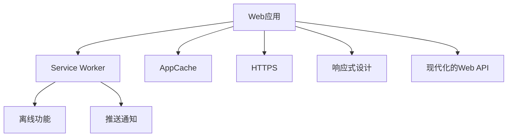

                 

# Progressive Web Apps (PWA)：Web与原生应用的融合

> 关键词：Progressive Web Apps, PWA, Web应用, 浏览器兼容性, 离线功能, 性能优化, 跨平台应用, 应用商店分发

## 1. 背景介绍

### 1.1 问题由来

随着移动互联网的发展，Web应用已经成为人们日常工作和生活的重要组成部分。然而，传统Web应用受限于浏览器的特性，存在诸如加载时间长、不稳定、跨平台兼容性差等问题，用户体验往往不够理想。与此同时，原生应用（如iOS、Android应用）虽然功能强大、性能优异，但开发和维护成本高昂，需要投入大量资源。

为了弥合Web和原生应用的差距，Web开发者需要找到一种折中方案，既能充分利用Web平台的灵活性和易用性，又能提供接近原生应用的性能和用户体验。于是，Progressive Web Apps (PWA)这一概念应运而生。PWA是一套Web应用开发的先进技术，旨在将Web应用与原生应用的优点相结合，让Web应用具备更强的自适应性、离线能力和良好的性能表现。

### 1.2 问题核心关键点

PWA的核心思想在于，通过一系列Web技术的组合，使Web应用能够在现代浏览器上具备接近原生应用的功能和性能。主要的技术点包括：

- 服务工作(Serviceworker)：实现离线功能，使得Web应用能够在没有网络连接的情况下正常运行。
- 应用缓存(AppCache)：缓存本地资源，提高应用加载速度。
- 安全传输(Secure)：使用HTTPS协议，确保数据传输的安全性。
- 响应式设计(Responsive)：适配不同设备，提供一致的用户体验。
- 现代化的Web API(Modernize)：利用HTML5、CSS3等新技术，提升Web应用的交互能力和用户体验。

这些技术手段共同构建了PWA的基本框架，使其能够兼容多平台，提供高性能的Web体验。

## 2. 核心概念与联系

### 2.1 核心概念概述

为更好地理解PWA的原理和架构，本节将介绍几个关键概念：

- **Web应用(Web App)**：指在Web浏览器上运行的基于HTML、CSS、JavaScript等Web技术的网页应用。Web应用可被多个设备和浏览器广泛支持。

- **原生应用(Native App)**：指专门为特定平台（如iOS、Android）开发的应用程序，利用系统资源和API，提供流畅的用户体验。原生应用性能优秀，但开发成本高，跨平台兼容性差。

- **Service Worker**：一种在后台运行的Web Worker，能够拦截网络请求并处理响应，实现离线缓存、推送通知等功能。

- **AppCache**：Web应用的一种缓存机制，通过将本地资源缓存到本地磁盘中，减少网络请求，提升加载速度。

- **HTTPS**：通过TLS/SSL协议保护Web应用的数据传输，确保数据的机密性和完整性。

- **响应式设计(Responsive Design)**：通过流式布局、弹性图片等技术，使Web应用在不同设备上具备良好的适应性和用户体验。

- **现代化的Web API**：指HTML5、CSS3、Web Storage等新一代Web技术，提供更强大的功能支持，如地理定位、摄像头、存储、绘图等。

这些核心概念之间的逻辑关系可以通过以下Mermaid流程图来展示：



这个流程图展示了PWA的核心概念及其之间的关联：

1. 将Web应用嵌入到浏览器中，通过Service Worker进行离线缓存、数据拦截和推送通知。
2. 使用AppCache技术缓存本地资源，提高Web应用的加载速度。
3. 使用HTTPS协议保证数据传输的安全性。
4. 通过响应式设计适配不同设备，提供一致的用户体验。
5. 利用现代化的Web API提升交互能力和用户体验。

这些技术手段共同构建了PWA的基本框架，使其能够兼容多平台，提供高性能的Web体验。

## 3. 核心算法原理 & 具体操作步骤
### 3.1 算法原理概述

PWA的实现原理主要基于以下几个关键技术：

- **Service Worker**：拦截网络请求，缓存响应数据，处理推送通知。
- **AppCache**：缓存本地资源，提升应用加载速度。
- **HTTPS**：保护数据传输的安全性。
- **响应式设计**：通过流式布局、弹性图片等技术，使Web应用在不同设备上具备良好的适应性和用户体验。
- **现代化的Web API**：提升Web应用的交互能力和用户体验。

通过这些技术，PWA可以具备以下特点：

- 离线功能：能够在离线情况下正常运行，提高用户体验。
- 快速加载：通过缓存本地资源，提升应用加载速度。
- 安全传输：确保数据传输的安全性，保护用户隐私。
- 跨平台支持：兼容多个设备和浏览器，提供一致的用户体验。

### 3.2 算法步骤详解

以下是PWA开发的详细步骤：

**Step 1: 准备开发环境**

1. 安装Node.js和npm，搭建开发环境。
2. 使用Webpack、Webpack 5等工具打包代码和资源。
3. 创建Service Worker，实现缓存和数据拦截功能。

**Step 2: 实现离线功能**

1. 在Service Worker中，注册Intercept Request事件，拦截网络请求。
2. 根据缓存策略判断请求是否在缓存中，返回缓存数据。
3. 如果缓存中无数据，则发起网络请求，将响应数据缓存到本地。

**Step 3: 实现快速加载**

1. 在Service Worker中，注册Install Event事件，缓存本地资源。
2. 根据缓存策略，将必要资源（如图片、CSS、JS等）缓存到本地。
3. 在应用加载时，优先使用缓存数据，减少网络请求。

**Step 4: 实现安全传输**

1. 使用HTTPS协议保护数据传输。
2. 在Service Worker中，拦截数据请求，使用相同域名过滤请求。
3. 对请求进行身份验证，确保只有授权用户可以访问。

**Step 5: 实现响应式设计**

1. 使用CSS媒体查询和弹性布局技术，适配不同设备。
2. 使用流式图片技术，优化图片加载速度。
3. 根据设备特性，调整UI元素大小和布局。

**Step 6: 实现现代化的Web API**

1. 使用HTML5、CSS3等新技术，提升Web应用的交互能力。
2. 利用Web Storage、Web Workers等API，提升应用的性能和用户体验。
3. 通过Geolocation API获取用户地理位置信息。

通过以上步骤，即可构建一个完整的PWA应用。

### 3.3 算法优缺点

PWA的优点在于：

- 兼容性好：能够在各种设备和浏览器上运行。
- 用户体验优：具备接近原生应用的性能和体验。
- 开发成本低：开发和维护成本较低，可复用现有Web技术。
- 易于部署：通过Web Server和CDN进行分发，简单易行。

但PWA也存在一些缺点：

- 受限于浏览器：需要现代浏览器的支持，旧版浏览器可能不支持。
- 缓存问题：缓存策略不当可能导致数据不一致，需谨慎设计。
- 安全问题：缓存本地数据和资源时，需确保数据的安全性。
- 性能问题：过多缓存可能导致应用体积增大，影响性能。

### 3.4 算法应用领域

PWA技术广泛应用于以下领域：

- 金融应用：提供金融数据查询、交易等服务。
- 电商应用：提供商品展示、购物车、订单管理等服务。
- 教育应用：提供在线学习、视频教学等服务。
- 新闻应用：提供新闻资讯、深度报道等服务。
- 社交应用：提供社交网络、即时通讯等服务。

## 4. 数学模型和公式 & 详细讲解  
### 4.1 数学模型构建

在PWA的实现中，Service Worker、AppCache、HTTPS等技术均依赖于Web开发中的数学模型和公式。以下是PWA中常用的数学模型和公式：

**Service Worker的数学模型**

1. 拦截网络请求：使用onfetch或onrequest事件拦截请求。
2. 缓存响应数据：使用Cache API将响应数据缓存到本地。
3. 处理推送通知：使用Push API处理推送通知。

**AppCache的数学模型**

1. 缓存本地资源：使用AppCache API缓存本地资源，如图片、CSS、JS等。
2. 缓存策略：定义缓存策略，包括最大缓存时间、缓存过期时间等。

**HTTPS的数学模型**

1. 数据加密：使用TLS/SSL协议加密数据，确保数据传输的机密性和完整性。
2. 证书验证：使用证书验证确保服务器身份的合法性。

### 4.2 公式推导过程

以下我们以HTTPS协议为例，推导其加密过程。

在HTTPS协议中，数据传输过程涉及对称加密和非对称加密两种方式。具体流程如下：

1. 客户端发起HTTP请求。
2. 服务器返回公钥和数字证书。
3. 客户端使用公钥对证书进行解密，获取服务器的私钥。
4. 客户端使用随机对称密钥加密数据，并将对称密钥用服务器的公钥加密。
5. 客户端将加密后的数据和对称密钥发送到服务器。
6. 服务器使用私钥解密对称密钥，使用对称密钥解密数据。

以下是该过程的数学公式推导：

- **公钥加密**：$c=E_k(m)$，其中$m$为明文，$E_k$为公钥加密函数，$k$为公钥。
- **私钥解密**：$m=D_k(c)$，其中$c$为密文，$D_k$为私钥解密函数，$k$为私钥。
- **对称加密**：$e=F_{k_s}(m)$，其中$m$为明文，$F_{k_s}$为对称加密函数，$k_s$为对称密钥。
- **密钥交换**：$k_s=E_k(p)$，其中$p$为随机对称密钥，$E_k$为公钥加密函数，$k$为公钥。

通过以上公式，HTTPS协议实现了数据传输的安全性。

### 4.3 案例分析与讲解

假设一个金融应用使用PWA技术进行开发，以下是具体的实现案例：

1. **实现离线功能**：
   - 注册Service Worker，拦截网络请求，缓存响应数据。
   - 实现数据离线缓存策略，确保用户能够在离线情况下正常访问应用。

2. **实现快速加载**：
   - 使用AppCache技术，缓存本地资源，如金融数据、API接口等。
   - 设置缓存策略，确保缓存数据的有效性。

3. **实现安全传输**：
   - 使用HTTPS协议，保护用户数据传输的安全性。
   - 在Service Worker中，拦截数据请求，使用相同域名过滤请求。
   - 对请求进行身份验证，确保只有授权用户可以访问。

4. **实现响应式设计**：
   - 使用CSS媒体查询和弹性布局技术，适配不同设备。
   - 使用流式图片技术，优化图片加载速度。
   - 根据设备特性，调整UI元素大小和布局。

5. **实现现代化的Web API**：
   - 使用HTML5、CSS3等新技术，提升Web应用的交互能力。
   - 利用Web Storage、Web Workers等API，提升应用的性能和用户体验。
   - 通过Geolocation API获取用户地理位置信息。

通过以上案例，可以看出PWA技术在金融应用中的具体实现。

## 5. 项目实践：代码实例和详细解释说明
### 5.1 开发环境搭建

在进行PWA实践前，我们需要准备好开发环境。以下是使用Node.js和Webpack构建PWA环境的步骤：

1. 安装Node.js和npm，搭建开发环境。
```bash
sudo apt-get update
sudo apt-get install nodejs
sudo apt-get install npm
```

2. 安装Webpack和Webpack 5，创建开发项目。
```bash
npm install webpack webpack-cli webpack-dev-server
```

3. 创建Service Worker，实现缓存和数据拦截功能。
```javascript
// worker.js
self.addEventListener('fetch', function(event) {
  event.respondWith(caches.match(event.request).then(function(response) {
    if (response) {
      return response;
    } else {
      return fetch(event.request).then(function(response) {
        return caches.open('my-cache').then(function(cache) {
          return cache.put(event.request, response.clone()).then(function() {
            return response;
          });
        });
      });
    }
  });
});
```

4. 实现AppCache，缓存本地资源。
```javascript
// app.js
if ('serviceWorker' in navigator) {
  navigator.serviceWorker.register('worker.js').then(function(reg) {
    console.log('ServiceWorker registered successfully.');
    reg.addEventListener('updatefound', function(event) {
      var installingWorker = event.waiting;
      installingWorker.onstatechange = function() {
        if (installingWorker.state === 'installed') {
          if (navigator.serviceWorker.controller) {
            console.log('ServiceWorker is active.');
          } else {
            console.log('ServiceWorker has been activated.');
          }
        }
      };
    });
  });
}
```

完成上述步骤后，即可在Web Server上部署PWA应用。

### 5.2 源代码详细实现

这里我们以一个简单的金融应用为例，给出使用PWA技术的代码实现。

首先，定义Service Worker：

```javascript
// worker.js
self.addEventListener('fetch', function(event) {
  event.respondWith(caches.match(event.request).then(function(response) {
    if (response) {
      return response;
    } else {
      return fetch(event.request).then(function(response) {
        return caches.open('my-cache').then(function(cache) {
          return cache.put(event.request, response.clone()).then(function() {
            return response;
          });
        });
      });
    }
  });
});
```

接着，定义AppCache：

```javascript
// app.js
if ('serviceWorker' in navigator) {
  navigator.serviceWorker.register('worker.js').then(function(reg) {
    console.log('ServiceWorker registered successfully.');
    reg.addEventListener('updatefound', function(event) {
      var installingWorker = event.waiting;
      installingWorker.onstatechange = function() {
        if (installingWorker.state === 'installed') {
          if (navigator.serviceWorker.controller) {
            console.log('ServiceWorker is active.');
          } else {
            console.log('ServiceWorker has been activated.');
          }
        }
      };
    });
  });
}
```

然后，实现HTTPS协议：

```javascript
// server.js
const https = require('https');
const fs = require('fs');

const options = {
  key: fs.readFileSync('key.pem'),
  cert: fs.readFileSync('cert.pem')
};

const server = https.createServer(options, (req, res) => {
  res.writeHead(200, {'Content-Type': 'text/html'});
  res.write('<html><body><h1>Hello, World!</h1></body></html>');
  res.end();
});

server.listen(443, () => {
  console.log('Server running on port 443.');
});
```

最后，使用Webpack打包代码和资源：

```javascript
// webpack.config.js
const path = require('path');
const webpack = require('webpack');

module.exports = {
  entry: './app.js',
  output: {
    path: path.resolve(__dirname, 'dist'),
    filename: 'bundle.js'
  },
  module: {
    rules: [
      {
        test: /\.css$/,
        use: ['style-loader', 'css-loader']
      },
      {
        test: /\.js$/,
        use: ['babel-loader']
      }
    ]
  },
  plugins: [
    new webpack.DefinePlugin({
      'process.env.NODE_ENV': JSON.stringify('production')
    })
  ]
};
```

完成上述代码后，即可使用Webpack 5打包并部署PWA应用。

### 5.3 代码解读与分析

让我们再详细解读一下关键代码的实现细节：

**Service Worker**：
- `self.addEventListener('fetch', function(event)`：注册fetch事件，拦截所有网络请求。
- `event.respondWith(caches.match(event.request))`：先尝试从缓存中获取数据。
- `return fetch(event.request).then(function(response) { ... })`：若缓存中无数据，则发起网络请求，并将响应数据缓存到本地。

**AppCache**：
- `navigator.serviceWorker.register('worker.js')`：注册Service Worker，定义缓存策略。
- `reg.addEventListener('updatefound', function(event)`：在Service Worker更新时，触发回调函数。

**HTTPS协议**：
- `const https = require('https')`：使用Node.js内置的HTTPS模块。
- `const options = { ... }`：设置HTTPS的证书和密钥。
- `server.listen(443, () => { ... })`：启动HTTPS服务器，监听443端口。

通过以上代码，可以实现一个基本的PWA应用，具备离线、缓存、HTTPS等功能。

### 5.4 运行结果展示

通过以上配置，PWA应用可以在现代浏览器上正常运行，具备以下特点：

- 快速加载：通过缓存本地资源，提高应用加载速度。
- 离线功能：能够在离线情况下正常运行。
- 安全传输：使用HTTPS协议保护数据传输的安全性。

## 6. 实际应用场景
### 6.1 金融应用

在金融应用中，PWA技术可以提供以下功能：

1. 实时行情查询：提供实时股市行情、外汇汇率、商品价格等信息查询。
2. 交易服务：提供股票买卖、基金投资、外汇交易等服务。
3. 用户管理：提供用户登录、个人信息修改、安全认证等服务。

通过PWA技术，金融应用可以具备更好的兼容性和用户体验，满足用户的高要求。

### 6.2 电商应用

在电商应用中，PWA技术可以提供以下功能：

1. 商品展示：提供商品图片、描述、价格等信息展示。
2. 购物车管理：提供商品添加、删除、结算等服务。
3. 订单管理：提供订单查看、支付、物流跟踪等服务。

通过PWA技术，电商应用可以具备更好的兼容性和用户体验，满足用户的高要求。

### 6.3 教育应用

在教育应用中，PWA技术可以提供以下功能：

1. 在线学习：提供课程视频、讲义、练习等服务。
2. 互动问答：提供老师和学生互动、在线讨论等服务。
3. 学习管理：提供作业提交、成绩查询、学习进度跟踪等服务。

通过PWA技术，教育应用可以具备更好的兼容性和用户体验，满足用户的高要求。

### 6.4 新闻应用

在新闻应用中，PWA技术可以提供以下功能：

1. 新闻资讯：提供新闻头条、深度报道、专题文章等服务。
2. 用户互动：提供评论、点赞、分享等服务。
3. 个性化推荐：提供用户兴趣推荐、广告投放等服务。

通过PWA技术，新闻应用可以具备更好的兼容性和用户体验，满足用户的高要求。

## 7. 工具和资源推荐
### 7.1 学习资源推荐

为了帮助开发者系统掌握PWA的理论基础和实践技巧，这里推荐一些优质的学习资源：

1. **Progressive Web Apps (PWA) 官方文档**：详细介绍了PWA的各个方面，包括技术原理、开发流程、最佳实践等。
2. **MDN Web Docs**：提供PWA相关的技术文档、教程和示例代码，是PWA学习的绝佳资源。
3. **Google Web Fundamentals**：Google提供的Web应用开发指南，涵盖PWA、Web组件、响应式设计等多个方面。
4. **Angular Material**：Angular框架提供的UI组件库，支持响应式设计，适合PWA开发。
5. **React Native**：Facebook提供的跨平台移动应用开发框架，可以与PWA技术结合使用。

通过对这些资源的学习实践，相信你一定能够快速掌握PWA的精髓，并用于解决实际的Web应用问题。

### 7.2 开发工具推荐

高效的开发离不开优秀的工具支持。以下是几款用于PWA开发的常用工具：

1. **Node.js**：基于JavaScript的运行环境，支持服务器端编程和模块化开发。
2. **Webpack 5**：现代化的模块打包工具，支持动态导入、代码分割、异步加载等功能。
3. **Webpack Dev Server**：基于Webpack的开发服务器，支持热更新、在线调试等功能。
4. **Service Worker**：现代Web Worker，支持拦截网络请求、缓存数据等功能。
5. **AppCache**：Web应用缓存机制，支持缓存本地资源，提高应用加载速度。
6. **HTTPS**：使用TLS/SSL协议保护数据传输，确保数据传输的安全性。

合理利用这些工具，可以显著提升PWA开发效率，加快创新迭代的步伐。

### 7.3 相关论文推荐

PWA技术的发展源于学界的持续研究。以下是几篇奠基性的相关论文，推荐阅读：

1. **Progressive Web Apps (PWA) - Google**：Google官方的PWA介绍和技术文档，涵盖技术原理和开发实践。
2. **Progressive Web Apps**：Mozilla Web Docs中的PWA技术介绍，详细讲解PWA的核心概念和技术点。
3. **Web Application Security**：探讨Web应用的安全性和隐私保护，提供PWA的安全实践指南。
4. **Responsive Web Design**：介绍响应式设计的原理和实现方法，适合PWA开发。
5. **HTTPS**：介绍HTTPS协议的实现原理和应用场景，适合PWA开发中的安全传输。

这些论文代表了大规模Web应用开发的前沿研究，帮助开发者全面理解PWA技术，推动Web应用的发展。

## 8. 总结：未来发展趋势与挑战

### 8.1 研究成果总结

本文对PWA技术的实现原理、开发步骤、应用场景等进行了详细讲解，提供了完整的代码实现和实例分析。通过本文的学习，开发者可以系统掌握PWA技术的核心概念和实现方法，并用于解决实际的Web应用问题。

### 8.2 未来发展趋势

展望未来，PWA技术将呈现以下几个发展趋势：

1. 兼容性和稳定性：随着PWA技术的不断成熟，兼容性和稳定性将进一步提高，支持更多设备和浏览器。
2. 性能和体验：PWA应用的性能和用户体验将持续提升，接近原生应用的性能水平。
3. 智能化和自动化：PWA应用将更多地集成人工智能技术，如语音识别、机器翻译、推荐系统等，提升智能化水平。
4. 跨平台支持：PWA应用将具备更好的跨平台支持，满足用户在多种设备和操作系统上的需求。
5. 开发工具和框架：将出现更多高效、易用的PWA开发工具和框架，简化开发过程，提高开发效率。

### 8.3 面临的挑战

尽管PWA技术已经取得了显著成果，但在实际应用中仍面临以下挑战：

1. 兼容性和稳定性：需要不断更新和优化，确保在不同设备和浏览器上都能正常运行。
2. 性能问题：需要优化缓存策略，避免过多缓存导致的性能问题。
3. 安全问题：需要加强数据加密和安全认证，确保数据传输的安全性。
4. 技术门槛：需要开发者具备较高的技术水平，熟悉Web开发、API设计、性能优化等技术。

### 8.4 研究展望

面对PWA技术面临的挑战，未来的研究需要在以下几个方面寻求新的突破：

1. 兼容性和稳定性：继续优化PWA应用，支持更多设备和浏览器，确保兼容性和稳定性。
2. 性能优化：优化缓存策略，提升应用加载速度和性能。
3. 安全性：加强数据加密和安全认证，确保数据传输的安全性。
4. 智能化和自动化：集成人工智能技术，提升智能化水平，实现自动化开发和部署。

这些研究方向的探索，必将引领PWA技术迈向更高的台阶，为Web应用的未来发展提供新的动力。

## 9. 附录：常见问题与解答

**Q1：PWA与原生应用的异同点是什么？**

A: PWA和原生应用的主要区别在于：

- 开发成本：PWA开发成本较低，可复用现有Web技术；原生应用开发成本较高，需掌握特定平台开发技术。
- 用户获取：PWA通过Web Server和CDN进行分发，用户可通过浏览器直接访问；原生应用需要通过应用商店进行分发，用户需手动下载。
- 用户体验：PWA应用在Web浏览器中运行，可能会受到浏览器特性限制；原生应用在特定平台上运行，体验流畅。

PWA的优点在于：

- 兼容性好：能够在各种设备和浏览器上运行。
- 用户体验优：具备接近原生应用的性能和体验。
- 开发成本低：开发和维护成本较低，可复用现有Web技术。
- 易于部署：通过Web Server和CDN进行分发，简单易行。

PWA的缺点在于：

- 受限于浏览器：需要现代浏览器的支持，旧版浏览器可能不支持。
- 缓存问题：缓存策略不当可能导致数据不一致，需谨慎设计。
- 安全问题：缓存本地数据和资源时，需确保数据的安全性。
- 性能问题：过多缓存可能导致应用体积增大，影响性能。

**Q2：PWA的缓存策略有哪些？**

A: PWA的缓存策略包括以下几种：

1. AppShell缓存：只缓存应用的shell部分，不缓存内容。
2. AppShell和内容缓存：同时缓存应用的shell和内容。
3. 静态资源缓存：只缓存静态资源，不缓存动态数据。
4. 动态资源缓存：同时缓存静态和动态资源。

选择合适的缓存策略，可以有效提升应用加载速度和性能，同时避免缓存数据不一致的问题。

**Q3：如何实现PWA的离线功能？**

A: 实现PWA的离线功能，需要在Service Worker中拦截网络请求，并将响应数据缓存到本地。具体步骤如下：

1. 注册Service Worker：通过`navigator.serviceWorker.register()`方法，注册Service Worker。
2. 拦截网络请求：使用`self.addEventListener('fetch', function(event)`方法，拦截所有网络请求。
3. 缓存响应数据：通过`caches.open()`方法，打开缓存，使用`event.request`获取请求信息，将响应数据缓存到本地。

通过以上步骤，即可实现PWA的离线功能。

**Q4：PWA的性能优化有哪些方法？**

A: PWA的性能优化主要包括以下几种方法：

1. 缓存策略：选择合适的缓存策略，避免缓存过多数据。
2. 代码分割：使用Webpack 5的代码分割功能，将应用拆分为多个模块，按需加载。
3. 异步加载：使用Webpack 5的异步加载功能，动态加载模块，减少初始加载时间。
4. 服务端渲染：使用Service Worker和Service Worker-based offloading，提高应用的渲染性能。
5. 懒加载图片和视频：使用WebP等格式，优化图片和视频加载，减少加载时间。

通过以上方法，可以显著提升PWA应用的性能和用户体验。

---

作者：禅与计算机程序设计艺术 / Zen and the Art of Computer Programming

