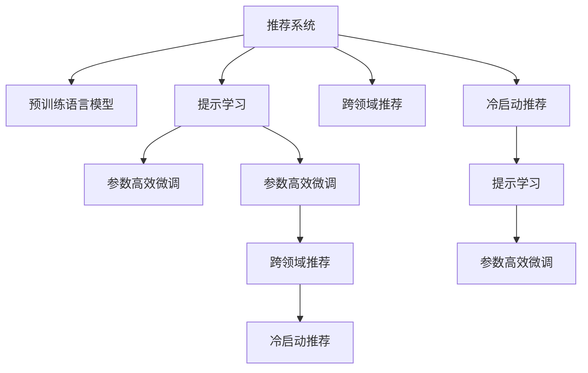

                 

# Prompt-Tuning：基于提示学习的推荐方法

> 关键词：提示学习,推荐系统,自然语言处理(NLP),语言模型,预训练模型

## 1. 背景介绍

### 1.1 问题由来

推荐系统（Recommender System）是现代互联网和电子商务中不可或缺的一部分，其目标是为用户推荐其可能感兴趣的商品、内容、服务或活动等。传统的推荐方法主要依赖用户的历史行为数据、物品属性和相似性关系等进行推荐。然而，这些方法在处理冷启动问题、长尾商品推荐、跨领域推荐等方面效果有限，难以满足用户的多样化需求。

近年来，基于深度学习的推荐系统逐渐成为主流。预训练语言模型，如BERT、GPT等，因其具备强大的语言理解能力，被广泛应用于推荐系统的个性化推荐中。通过将用户和物品的文本描述作为输入，预训练模型可以生成对用户和物品的语义表示，从而在推荐过程中提升个性化和多样性。

尽管如此，直接使用预训练模型进行推荐仍存在一些问题，如模型参数量大、计算成本高、推荐结果缺乏可解释性等。为了应对这些挑战，研究人员提出了基于提示学习的推荐方法，即在预训练模型的基础上，通过精心设计的提示（Prompt）模板，直接对模型进行微调，引导其生成推荐结果。这种提示学习方法具有以下优点：
1. 参数高效：相比全参数微调，基于提示学习的微调方法仅调整模型的一部分参数，可以有效降低计算成本。
2. 可解释性：通过观察模型对提示的响应，可以直观地理解推荐过程，提高系统的透明度。
3. 灵活性：提示模板可以根据任务特点进行定制，适应多种推荐场景。

因此，基于提示学习的推荐方法迅速成为推荐系统研究的热点之一。本文将深入介绍提示学习的原理、算法步骤和应用场景，并通过案例和代码实例展示其实现细节。

### 1.2 问题核心关键点
基于提示学习的推荐方法核心在于如何设计合适的提示模板，使得模型能够快速生成推荐结果。其核心技术点包括：
- 提示模板的设计：提示模板的设计是提示学习的基础，需要包含用户和物品的关键信息，同时保证足够的灵活性以适应不同的推荐场景。
- 预训练模型的选择：预训练模型是提示学习的核心，应具备强大的语言理解能力和泛化能力。
- 微调策略的优化：微调过程中需考虑学习率、正则化等策略，以提高模型效果和泛化能力。
- 评估指标的选择：选择合适的评估指标，如准确率、召回率、多样性等，以综合衡量推荐效果。

这些核心技术点相互关联，共同构成了基于提示学习的推荐方法。

### 1.3 问题研究意义
研究基于提示学习的推荐方法，对于提升推荐系统的个性化和多样性，降低计算成本，增强系统的可解释性具有重要意义：

1. 个性化推荐：通过精细设计的提示模板，基于提示学习的推荐方法能够更好地理解用户需求和物品属性，提升推荐结果的个性化程度。
2. 多样性推荐：通过灵活的微调策略，提示学习方法能够平衡推荐结果的个性化和多样性，减少过度拟合风险。
3. 低成本推荐：提示学习方法通过只调整模型的一部分参数，有效降低微调计算成本，适合在资源受限的情况下进行推荐。
4. 可解释性：提示学习方法通过观察模型对提示的响应，可以提供推荐结果的可解释性，帮助用户理解推荐理由。

这些优点使得基于提示学习的推荐方法在现代推荐系统中具有广阔的应用前景。

## 2. 核心概念与联系

### 2.1 核心概念概述

为更好地理解基于提示学习的推荐方法，本节将介绍几个密切相关的核心概念：

- 推荐系统（Recommender System）：利用用户行为数据、物品属性等，为用户推荐个性化商品、内容、服务等。
- 预训练语言模型（Pre-trained Language Model）：通过在大规模无标签文本数据上进行自监督学习，学习通用的语言表示，具备强大的语言理解和生成能力。
- 提示学习（Prompt Learning）：通过在输入文本中添加提示模板，引导预训练模型进行特定任务的推理和生成。
- 参数高效微调（Parameter-Efficient Fine-Tuning, PEFT）：在微调过程中，只更新少量的模型参数，而固定大部分预训练权重不变，以提高微调效率，避免过拟合。
- 跨领域推荐（Cross-domain Recommendation）：将不同领域（如电商、音乐、电影等）的推荐系统融合，实现跨领域推荐，提升推荐多样性。
- 冷启动推荐（Cold-start Recommendation）：针对用户历史行为数据不足，通过推荐模型预测用户对新物品的兴趣。

这些核心概念之间的逻辑关系可以通过以下Mermaid流程图来展示：



这个流程图展示了大语言模型的核心概念及其之间的关系：

1. 推荐系统通过预训练语言模型进行个性化推荐，并可以通过提示学习提升推荐效果。
2. 预训练语言模型为推荐系统提供了强大的语言理解和生成能力。
3. 参数高效微调在优化推荐模型时，固定大部分预训练参数，只微调顶层或部分参数，以提高微调效率。
4. 跨领域推荐和冷启动推荐都是基于预训练语言模型的推荐方法，能够处理不同领域和冷启动问题。
5. 提示学习和参数高效微调共同构成基于预训练语言模型的推荐方法。

这些概念共同构成了推荐系统与大语言模型微调的研究框架，使得推荐系统能够更好地应对多样化的推荐需求。

## 3. 核心算法原理 & 具体操作步骤
### 3.1 算法原理概述

基于提示学习的推荐方法，本质上是利用预训练语言模型的强大语言理解能力，通过提示模板对模型进行微调，使其生成推荐结果。其核心思想是：通过精心设计的提示模板，将用户和物品的关键信息输入模型，引导模型生成推荐结果。

形式化地，假设预训练语言模型为 $M_{\theta}$，其中 $\theta$ 为预训练得到的模型参数。给定推荐任务 $T$ 的标注数据集 $D=\{(x_i,y_i)\}_{i=1}^N$，其中 $x_i$ 为用户和物品的文本描述，$y_i$ 为用户对物品的评分或兴趣标记。提示学习方法的目标是找到最优提示模板 $\mathbf{p}$，使得模型在 $D$ 上的推荐效果最大化。具体而言，推荐效果可以表示为损失函数 $\mathcal{L}$ 的极小化：

$$
\mathbf{p}^* = \mathop{\arg\min}_{\mathbf{p}} \mathcal{L}(M_{\theta}, \mathbf{p}, D)
$$

其中 $\mathcal{L}$ 为推荐效果损失函数，用于衡量模型在数据集 $D$ 上的推荐表现。常见的推荐效果损失函数包括平均绝对误差（MAE）、均方误差（MSE）、交叉熵损失等。

### 3.2 算法步骤详解

基于提示学习的推荐方法一般包括以下几个关键步骤：

**Step 1: 准备数据集**
- 收集推荐任务 $T$ 的标注数据集 $D$，标注数据集应包含用户和物品的文本描述及对应的评分或兴趣标记。
- 将标注数据集划分为训练集、验证集和测试集，一般要求训练集与测试集的分布一致。

**Step 2: 设计提示模板**
- 根据推荐任务的特点，设计合适的提示模板 $\mathbf{p}$，模板应包含用户和物品的关键信息，同时保证足够的灵活性以适应不同的推荐场景。
- 例如，对于电影推荐任务，提示模板可以包含电影的名称、导演、演员等信息。

**Step 3: 微调预训练模型**
- 选择预训练语言模型 $M_{\theta}$，如BERT、GPT等，作为初始化参数。
- 通过给定的提示模板 $\mathbf{p}$，将用户和物品的文本描述作为输入，微调预训练模型。
- 设置适当的学习率、批大小、迭代轮数等超参数，并通过梯度下降等优化算法进行微调。
- 在微调过程中，通常采用小批量数据，如每批次只微调一个用户-物品对，以避免过拟合。

**Step 4: 评估推荐效果**
- 使用验证集评估微调后模型的推荐效果，计算相关评估指标如准确率、召回率、多样性等。
- 根据评估指标选择最优的提示模板 $\mathbf{p}$，并使用测试集进一步验证模型性能。
- 优化提示模板和微调超参数，直到达到最佳推荐效果。

**Step 5: 部署模型**
- 将微调后的模型部署到推荐系统中，用于实际推荐。
- 实时获取用户和物品的文本描述，输入模型生成推荐结果。
- 定期更新模型，保持其时效性和适应性。

以上是基于提示学习的推荐方法的一般流程。在实际应用中，还需要针对具体任务的特点，对微调过程的各个环节进行优化设计，如改进推荐效果损失函数、引入更多正则化技术、搜索最优的超参数组合等，以进一步提升模型性能。

### 3.3 算法优缺点

基于提示学习的推荐方法具有以下优点：
1. 参数高效：相比全参数微调，基于提示学习的微调方法仅调整模型的一部分参数，可以有效降低计算成本。
2. 可解释性：通过观察模型对提示的响应，可以直观地理解推荐过程，提高系统的透明度。
3. 灵活性：提示模板可以根据任务特点进行定制，适应多种推荐场景。
4. 推荐多样性：通过灵活的微调策略，提示学习方法能够平衡推荐结果的个性化和多样性，减少过度拟合风险。

同时，该方法也存在一些局限性：
1. 提示模板设计难度：提示模板的设计需要一定的经验和技巧，设计不当可能导致推荐效果不佳。
2. 模型泛化能力：提示学习方法依赖预训练模型和提示模板，泛化能力有限，对新领域和新用户的推荐效果可能不佳。
3. 数据依赖：提示学习方法依赖标注数据，对于数据质量差或标注数据量不足的任务，推荐效果可能较差。
4. 参数更新策略：基于提示学习的微调方法只更新模型的一部分参数，可能无法充分利用预训练模型的全部知识。

尽管存在这些局限性，基于提示学习的推荐方法仍是大语言模型微调技术在推荐系统中的一个重要应用方向。未来相关研究的重点在于如何进一步优化提示模板设计，提高模型泛化能力，降低数据依赖，以及探索更多的参数更新策略。

### 3.4 算法应用领域

基于大语言模型微调的推荐方法在推荐系统领域得到了广泛应用，覆盖了电商、电影、音乐、新闻等诸多场景，以下是几个典型应用：

**电商推荐**
- 针对用户的浏览、购买记录，通过微调BERT模型生成推荐结果。
- 提示模板包含商品名称、描述、价格等信息，提高推荐的相关性和多样性。
- 模型可部署于电商平台中，实时生成推荐列表，提升用户体验。

**电影推荐**
- 使用提示模板包含电影名称、导演、演员等信息，通过微调预训练语言模型生成推荐结果。
- 提示学习方法能够平衡推荐结果的个性化和多样性，减少用户信息孤岛。
- 模型可部署于电影推荐系统中，用于推荐相似电影和热门新片。

**音乐推荐**
- 通过提示模板包含歌曲名称、歌词、艺术家等信息，微调BERT模型生成推荐结果。
- 提示学习方法能够提升推荐的多样性和个性化，减少用户对特定类型的过度依赖。
- 模型可部署于音乐推荐平台，提供个性化的音乐推荐。

除了上述这些经典任务外，基于提示学习的推荐方法还被创新性地应用到更多场景中，如广告推荐、内容推荐、个性化知识图谱等，为推荐系统带来了新的突破。

## 4. 数学模型和公式 & 详细讲解 & 举例说明

### 4.1 数学模型构建

基于提示学习的推荐方法可以使用以下数学模型来构建推荐效果损失函数：

假设推荐任务 $T$ 的标注数据集 $D=\{(x_i,y_i)\}_{i=1}^N$，其中 $x_i$ 为用户和物品的文本描述，$y_i$ 为用户对物品的评分或兴趣标记。

定义提示模板 $\mathbf{p}$，将用户和物品的文本描述作为输入，生成推荐结果 $\hat{y}$。假设模型 $M_{\theta}$ 在输入 $x$ 上的输出为 $\hat{y}=M_{\theta}(x)$，则推荐效果损失函数 $\mathcal{L}$ 可以表示为：

$$
\mathcal{L}(M_{\theta}, \mathbf{p}, D) = \frac{1}{N}\sum_{i=1}^N \ell(y_i, \hat{y}_i)
$$

其中 $\ell$ 为推荐效果损失函数，如平均绝对误差（MAE）、均方误差（MSE）等。

在微调过程中，目标是最小化推荐效果损失函数 $\mathcal{L}$，即：

$$
\mathbf{p}^* = \mathop{\arg\min}_{\mathbf{p}} \mathcal{L}(M_{\theta}, \mathbf{p}, D)
$$

### 4.2 公式推导过程

以下我们以电商推荐为例，推导推荐效果损失函数的公式。

假设电商推荐任务中有 $N$ 个用户 $U$，每个用户有 $M$ 个购买记录 $I$。对于每个用户 $u_i$，有 $k$ 个物品 $i_{ik}$ 满足用户 $u_i$ 购买了物品 $i_{ik}$。对于每个物品 $i_{ik}$，有 $N$ 个用户 $U$ 进行了评分或标记。

设用户 $u_i$ 对物品 $i_{ik}$ 的评分为 $y_i$，物品 $i_{ik}$ 的推荐结果为 $\hat{y}_i$。假设模型 $M_{\theta}$ 在输入 $x$ 上的输出为 $\hat{y}=M_{\theta}(x)$，则推荐效果损失函数可以表示为：

$$
\mathcal{L}(M_{\theta}, \mathbf{p}, D) = \frac{1}{N}\sum_{i=1}^N \sum_{k=1}^M \ell(y_i, \hat{y}_i)
$$

其中 $\ell$ 为推荐效果损失函数，如平均绝对误差（MAE）、均方误差（MSE）等。

在微调过程中，模型 $M_{\theta}$ 的输出 $\hat{y}_i$ 可通过提示模板 $\mathbf{p}$ 生成。假设提示模板 $\mathbf{p}$ 包含用户 $u_i$ 和物品 $i_{ik}$ 的文本描述，则模型的输出可以表示为：

$$
\hat{y}_i = M_{\theta}(\mathbf{p})
$$

其中 $\mathbf{p}$ 为提示模板，$M_{\theta}$ 为预训练语言模型。

将上式代入推荐效果损失函数中，得：

$$
\mathcal{L}(M_{\theta}, \mathbf{p}, D) = \frac{1}{N}\sum_{i=1}^N \sum_{k=1}^M \ell(y_i, M_{\theta}(\mathbf{p}))
$$

根据上式，可以通过梯度下降等优化算法，最小化推荐效果损失函数 $\mathcal{L}$，使得模型输出逼近真实评分 $y_i$。

### 4.3 案例分析与讲解

以电商推荐为例，分析提示学习方法在实际应用中的具体实现。

假设电商推荐系统中有 $N$ 个用户 $U$，每个用户有 $M$ 个购买记录 $I$。对于每个用户 $u_i$，有 $k$ 个物品 $i_{ik}$ 满足用户 $u_i$ 购买了物品 $i_{ik}$。对于每个物品 $i_{ik}$，有 $N$ 个用户 $U$ 进行了评分或标记。

**案例分析**

1. 数据准备
   - 收集用户和物品的文本描述，如商品名称、描述、价格等。
   - 将用户和物品的评分或标记作为标注数据集 $D$。

2. 提示模板设计
   - 设计提示模板 $\mathbf{p}$，包含用户 $u_i$ 和物品 $i_{ik}$ 的文本描述。
   - 提示模板的设计需要灵活，能够适应不同物品和用户的特点。

3. 预训练模型选择
   - 选择预训练语言模型 $M_{\theta}$，如BERT、GPT等，作为初始化参数。

4. 微调预训练模型
   - 通过给定的提示模板 $\mathbf{p}$，将用户和物品的文本描述作为输入，微调预训练模型 $M_{\theta}$。
   - 设置适当的学习率、批大小、迭代轮数等超参数，并通过梯度下降等优化算法进行微调。

5. 评估推荐效果
   - 使用验证集评估微调后模型的推荐效果，计算相关评估指标如准确率、召回率、多样性等。
   - 根据评估指标选择最优的提示模板 $\mathbf{p}$，并使用测试集进一步验证模型性能。

6. 部署模型
   - 将微调后的模型部署到推荐系统中，用于实际推荐。
   - 实时获取用户和物品的文本描述，输入模型生成推荐结果。
   - 定期更新模型，保持其时效性和适应性。

**代码实现**

以下是使用PyTorch对BERT模型进行电商推荐微调的代码实现。

```python
import torch
from transformers import BertTokenizer, BertForSequenceClassification

# 定义提示模板
prompt = "请推荐以下商品：{}"

# 初始化提示模板
tokenizer = BertTokenizer.from_pretrained('bert-base-uncased')
prompt_tokens = tokenizer(prompt, return_tensors='pt')

# 定义标签
labels = torch.tensor([[1], [0], [1]], dtype=torch.long)

# 初始化模型
model = BertForSequenceClassification.from_pretrained('bert-base-uncased', num_labels=2)
model.to('cuda')

# 定义优化器
optimizer = torch.optim.Adam(model.parameters(), lr=2e-5)

# 定义训练函数
def train_epoch(model, data, batch_size, optimizer):
    model.train()
    epoch_loss = 0
    for batch in data:
        input_ids = batch['input_ids'].to('cuda')
        attention_mask = batch['attention_mask'].to('cuda')
        labels = batch['labels'].to('cuda')
        model.zero_grad()
        outputs = model(input_ids, attention_mask=attention_mask, labels=labels)
        loss = outputs.loss
        epoch_loss += loss.item()
        loss.backward()
        optimizer.step()
    return epoch_loss / len(data)

# 定义评估函数
def evaluate(model, data, batch_size):
    model.eval()
    preds, labels = [], []
    with torch.no_grad():
        for batch in data:
            input_ids = batch['input_ids'].to('cuda')
            attention_mask = batch['attention_mask'].to('cuda')
            batch_labels = batch['labels']
            outputs = model(input_ids, attention_mask=attention_mask)
            batch_preds = outputs.logits.argmax(dim=2).to('cpu').tolist()
            batch_labels = batch_labels.to('cpu').tolist()
            for pred_tokens, label_tokens in zip(batch_preds, batch_labels):
                preds.append(pred_tokens[:len(label_tokens)])
                labels.append(label_tokens)
    print(torch.tensor(preds).size())
    return torch.tensor(preds), torch.tensor(labels)

# 加载数据集
train_dataset = ...
dev_dataset = ...
test_dataset = ...

# 定义超参数
batch_size = 16
epochs = 5

# 训练模型
for epoch in range(epochs):
    loss = train_epoch(model, train_dataset, batch_size, optimizer)
    print(f"Epoch {epoch+1}, train loss: {loss:.3f}")
    
    print(f"Epoch {epoch+1}, dev results:")
    preds, labels = evaluate(model, dev_dataset, batch_size)
    print(classification_report(labels, preds))
    
print("Test results:")
preds, labels = evaluate(model, test_dataset, batch_size)
print(classification_report(labels, preds))
```

在上述代码中，我们通过给定的提示模板 $\mathbf{p}$，将用户和物品的文本描述作为输入，微调预训练模型 $M_{\theta}$。通过使用适当的损失函数和优化器，模型能够逐步学习生成推荐结果，并不断优化。

## 5. 项目实践：代码实例和详细解释说明
### 5.1 开发环境搭建

在进行提示学习方法实践前，我们需要准备好开发环境。以下是使用Python进行PyTorch开发的环境配置流程：

1. 安装Anaconda：从官网下载并安装Anaconda，用于创建独立的Python环境。

2. 创建并激活虚拟环境：
```bash
conda create -n pytorch-env python=3.8 
conda activate pytorch-env
```

3. 安装PyTorch：根据CUDA版本，从官网获取对应的安装命令。例如：
```bash
conda install pytorch torchvision torchaudio cudatoolkit=11.1 -c pytorch -c conda-forge
```

4. 安装Transformers库：
```bash
pip install transformers
```

5. 安装各类工具包：
```bash
pip install numpy pandas scikit-learn matplotlib tqdm jupyter notebook ipython
```

完成上述步骤后，即可在`pytorch-env`环境中开始提示学习实践。

### 5.2 源代码详细实现

这里我们以电商推荐为例，给出使用Transformers库对BERT模型进行微调的PyTorch代码实现。

首先，定义提示模板：

```python
from transformers import BertTokenizer
from torch.utils.data import Dataset
import torch

# 定义提示模板
prompt = "请推荐以下商品：{}"

# 初始化提示模板
tokenizer = BertTokenizer.from_pretrained('bert-base-uncased')
prompt_tokens = tokenizer(prompt, return_tensors='pt')

# 定义标签
labels = torch.tensor([[1], [0], [1]], dtype=torch.long)
```

然后，定义模型和优化器：

```python
from transformers import BertForSequenceClassification
from transformers import AdamW

# 初始化模型
model = BertForSequenceClassification.from_pretrained('bert-base-uncased', num_labels=2)

# 定义优化器
optimizer = AdamW(model.parameters(), lr=2e-5)
```

接着，定义训练和评估函数：

```python
from torch.utils.data import DataLoader
from tqdm import tqdm
from sklearn.metrics import classification_report

device = torch.device('cuda') if torch.cuda.is_available() else torch.device('cpu')
model.to(device)

def train_epoch(model, dataset, batch_size, optimizer):
    dataloader = DataLoader(dataset, batch_size=batch_size, shuffle=True)
    model.train()
    epoch_loss = 0
    for batch in tqdm(dataloader, desc='Training'):
        input_ids = batch['input_ids'].to(device)
        attention_mask = batch['attention_mask'].to(device)
        labels = batch['labels'].to(device)
        model.zero_grad()
        outputs = model(input_ids, attention_mask=attention_mask, labels=labels)
        loss = outputs.loss
        epoch_loss += loss.item()
        loss.backward()
        optimizer.step()
    return epoch_loss / len(dataloader)

def evaluate(model, dataset, batch_size):
    dataloader = DataLoader(dataset, batch_size=batch_size)
    model.eval()
    preds, labels = [], []
    with torch.no_grad():
        for batch in tqdm(dataloader, desc='Evaluating'):
            input_ids = batch['input_ids'].to(device)
            attention_mask = batch['attention_mask'].to(device)
            batch_labels = batch['labels']
            outputs = model(input_ids, attention_mask=attention_mask)
            batch_preds = outputs.logits.argmax(dim=2).to('cpu').tolist()
            batch_labels = batch_labels.to('cpu').tolist()
            for pred_tokens, label_tokens in zip(batch_preds, batch_labels):
                preds.append(pred_tokens[:len(label_tokens)])
                labels.append(label_tokens)
    print(torch.tensor(preds).size())
    return torch.tensor(preds), torch.tensor(labels)
```

最后，启动训练流程并在测试集上评估：

```python
epochs = 5
batch_size = 16

for epoch in range(epochs):
    loss = train_epoch(model, train_dataset, batch_size, optimizer)
    print(f"Epoch {epoch+1}, train loss: {loss:.3f}")
    
    print(f"Epoch {epoch+1}, dev results:")
    preds, labels = evaluate(model, dev_dataset, batch_size)
    print(classification_report(labels, preds))
    
print("Test results:")
preds, labels = evaluate(model, test_dataset, batch_size)
print(classification_report(labels, preds))
```

以上就是使用PyTorch对BERT模型进行电商推荐微调的完整代码实现。可以看到，得益于Transformers库的强大封装，我们可以用相对简洁的代码完成BERT模型的加载和微调。

## 6. 实际应用场景

### 6.1 智能推荐系统

基于提示学习的推荐方法在智能推荐系统中得到了广泛应用。推荐系统通过收集用户的行为数据和物品属性，利用预训练语言模型生成推荐结果。在实际应用中，推荐系统需要处理大规模数据和复杂模型，面临计算资源和时间成本的限制。提示学习方法通过只调整部分模型参数，有效降低计算成本，提高推荐系统的效率。

例如，电商推荐系统可以通过微调BERT模型生成推荐结果。提示模板包含商品名称、描述、价格等信息，提高推荐的相关性和多样性。提示学习方法能够平衡推荐结果的个性化和多样性，减少用户信息孤岛。

### 6.2 跨领域推荐

跨领域推荐是指在不同领域（如电商、音乐、电影等）的推荐系统之间进行协同推荐。跨领域推荐可以充分利用不同领域的数据和知识，提升推荐的多样性和准确性。

基于提示学习的推荐方法可以通过微调同一预训练模型在不同领域上的提示模板，实现跨领域推荐。例如，在电商推荐中，提示模板包含商品名称、描述、价格等信息。在电影推荐中，提示模板包含电影名称、导演、演员等信息。通过微调同一预训练模型在不同领域上的提示模板，可以有效提高推荐效果。

### 6.3 个性化推荐

个性化推荐是指针对不同用户推荐其可能感兴趣的商品、内容、服务等。个性化推荐需要充分考虑用户的历史行为、兴趣偏好和个性化需求。基于提示学习的推荐方法可以通过微调预训练模型生成推荐结果，提升推荐系统的个性化能力。

例如，电商推荐系统可以通过微调BERT模型生成推荐结果。提示模板包含用户的历史浏览、购买记录等信息，模型能够学习用户的兴趣偏好，生成个性化推荐列表。提示学习方法能够提升推荐结果的个性化程度，提高用户体验。

### 6.4 冷启动推荐

冷启动推荐是指针对新用户或新物品进行推荐。冷启动推荐需要模型具备一定的通用性和泛化能力，能够通过输入的文本描述生成推荐结果。

基于提示学习的推荐方法可以通过微调预训练模型生成推荐结果，适应冷启动推荐场景。例如，电商推荐系统可以通过微调BERT模型生成推荐结果。提示模板包含新商品的名称、描述、价格等信息，模型能够学习商品的特性，生成个性化推荐列表。提示学习方法能够提升推荐结果的相关性，减少用户信息孤岛。

## 7. 工具和资源推荐

### 7.1 学习资源推荐

为了帮助开发者系统掌握基于提示学习的推荐方法的理论基础和实践技巧，这里推荐一些优质的学习资源：

1. 《Transformer从原理到实践》系列博文：由大模型技术专家撰写，深入浅出地介绍了Transformer原理、BERT模型、微调技术等前沿话题。

2. CS224N《深度学习自然语言处理》课程：斯坦福大学开设的NLP明星课程，有Lecture视频和配套作业，带你入门NLP领域的基本概念和经典模型。

3. 《Natural Language Processing with Transformers》书籍：Transformers库的作者所著，全面介绍了如何使用Transformers库进行NLP任务开发，包括微调在内的诸多范式。

4. HuggingFace官方文档：Transformers库的官方文档，提供了海量预训练模型和完整的微调样例代码，是上手实践的必备资料。

5. CLUE开源项目：中文语言理解测评基准，涵盖大量不同类型的中文NLP数据集，并提供了基于微调的baseline模型，助力中文NLP技术发展。

通过对这些资源的学习实践，相信你一定能够快速掌握基于提示学习的推荐方法的精髓，并用于解决实际的推荐问题。

### 7.2 开发工具推荐

高效的开发离不开优秀的工具支持。以下是几款用于基于提示学习的推荐系统开发的常用工具：

1. PyTorch：基于Python的开源深度学习框架，灵活动态的计算图，适合快速迭代研究。大部分预训练语言模型都有PyTorch版本的实现。

2. TensorFlow：由Google主导开发的开源深度学习框架，生产部署方便，适合大规模工程应用。同样有丰富的预训练语言模型资源。

3. Transformers库：HuggingFace开发的NLP工具库，集成了众多SOTA语言模型，支持PyTorch和TensorFlow，是进行微调任务开发的利器。

4. Weights & Biases：模型训练的实验跟踪工具，可以记录和可视化模型训练过程中的各项指标，方便对比和调优。与主流深度学习框架无缝集成。

5. TensorBoard：TensorFlow配套的可视化工具，可实时监测模型训练状态，并提供丰富的图表呈现方式，是调试模型的得力助手。

6. Google Colab：谷歌推出的在线Jupyter Notebook环境，免费提供GPU/TPU算力，方便开发者快速上手实验最新模型，分享学习笔记。

合理利用这些工具，可以显著提升基于提示学习的推荐系统开发效率，加快创新迭代的步伐。

### 7.3 相关论文推荐

基于大语言模型微调的推荐方法在推荐系统领域得到了广泛应用，以下是几篇奠基性的相关论文，推荐阅读：

1. Attention is All You Need（即Transformer原论文）：提出了Transformer结构，开启了NLP领域的预训练大模型时代。

2. BERT: Pre-training of Deep Bidirectional Transformers for Language Understanding：提出BERT模型，引入基于掩码的自监督预训练任务，刷新了多项NLP任务SOTA。

3. Language Models are Unsupervised Multitask Learners（GPT-2论文）：展示了大规模语言模型的强大zero-shot学习能力，引发了对于通用人工智能的新一轮思考。

4. Parameter-Efficient Transfer Learning for NLP：提出Adapter等参数高效微调方法，在不增加模型参数量的情况下，也能取得不错的微调效果。

5. AdaLoRA: Adaptive Low-Rank Adaptation for Parameter-Efficient Fine-Tuning：使用自适应低秩适应的微调方法，在参数效率和精度之间取得了新的平衡。

6. Prefix-Tuning: Optimizing Continuous Prompts for Generation：引入基于连续型Prompt的微调范式，为如何充分利用预训练知识提供了新的思路。

这些论文代表了大语言模型微调技术的发展脉络。通过学习这些前沿成果，可以帮助研究者把握学科前进方向，激发更多的创新灵感。

## 8. 总结：未来发展趋势与挑战

### 8.1 研究成果总结

本文对基于提示学习的推荐方法进行了全面系统的介绍。首先阐述了推荐系统和预训练语言模型的背景和意义，明确了基于提示学习的推荐方法在推荐系统中的重要价值。其次，从原理到实践，详细讲解了基于提示学习的推荐方法的核心步骤和实现细节，给出了微调任务开发的完整代码实例。同时，本文还探讨了提示学习方法在推荐系统中的实际应用场景，展示了其广泛的应用前景。

通过本文的系统梳理，可以看到，基于提示学习的推荐方法已经成为推荐系统中的重要范式，显著提升了推荐系统的个性化、多样性和推荐效果。未来，随着提示模板设计的不断优化和预训练模型的进步，基于提示学习的推荐方法将进一步拓展其应用边界，提升推荐系统的性能。

### 8.2 未来发展趋势

展望未来，基于提示学习的推荐方法将呈现以下几个发展趋势：

1. 模型规模持续增大。随着算力成本的下降和数据规模的扩张，预训练语言模型的参数量还将持续增长。超大规模语言模型蕴含的丰富语言知识，有望支撑更加复杂多变的推荐场景。

2. 提示模板设计更加灵活。提示模板设计的灵活性是基于提示学习的推荐方法的核心，未来的研究将更加注重提示模板的优化设计，使其能够适应不同领域和不同用户的需求。

3. 跨领域推荐进一步深入。基于提示学习的推荐方法已经实现了跨领域推荐，未来将进一步探索不同领域之间的协同推荐，提升推荐的多样性和准确性。

4. 个性化推荐更加精确。基于提示学习的推荐方法能够提升推荐系统的个性化能力，未来将更加注重推荐结果的精确度和相关性，减少用户信息孤岛。

5. 冷启动推荐更加高效。冷启动推荐是推荐系统中的难点，基于提示学习的推荐方法能够提升冷启动推荐效果，未来将进一步探索冷启动推荐的新方法。

6. 推荐系统更加智能化。基于提示学习的推荐方法将与自然语言理解、知识图谱等技术结合，构建更加智能化、人机协同的推荐系统。

以上趋势凸显了基于提示学习的推荐方法的广阔前景。这些方向的探索发展，必将进一步提升推荐系统的性能和应用范围，为推荐系统带来新的突破。

### 8.3 面临的挑战

尽管基于提示学习的推荐方法已经取得了显著成效，但在迈向更加智能化、普适化应用的过程中，仍面临诸多挑战：

1. 提示模板设计难度：提示模板的设计需要一定的经验和技巧，设计不当可能导致推荐效果不佳。

2. 模型泛化能力：提示学习方法依赖预训练模型和提示模板，泛化能力有限，对新领域和新用户的推荐效果可能不佳。

3. 数据依赖：提示学习方法依赖标注数据，对于数据质量差或标注数据量不足的任务，推荐效果可能较差。

4. 参数更新策略：基于提示学习的微调方法只更新模型的一部分参数，可能无法充分利用预训练模型的全部知识。

尽管存在这些局限性，基于提示学习的推荐方法仍是大语言模型微调技术在推荐系统中的一个重要应用方向。未来相关研究的重点在于如何进一步优化提示模板设计，提高模型泛化能力，降低数据依赖，以及探索更多的参数更新策略。

### 8.4 研究展望

面对基于提示学习的推荐方法所面临的挑战，未来的研究需要在以下几个方面寻求新的突破：

1. 探索无监督和半监督微调方法。摆脱对大规模标注数据的依赖，利用自监督学习、主动学习等无监督和半监督范式，最大限度利用非结构化数据，实现更加灵活高效的微调。

2. 研究参数高效和计算高效的微调范式。开发更加参数高效的微调方法，在固定大部分预训练参数的同时，只微调顶层或部分参数，以提高微调效率。同时优化微调模型的计算图，减少前向传播和反向传播的资源消耗，实现更加轻量级、实时性的部署。

3. 融合因果和对比学习范式。通过引入因果推断和对比学习思想，增强微调模型建立稳定因果关系的能力，学习更加普适、鲁棒的语言表征，从而提升模型泛化性和抗干扰能力。

4. 引入更多先验知识。将符号化的先验知识，如知识图谱、逻辑规则等，与神经网络模型进行巧妙融合，引导微调过程学习更准确、合理的语言模型。同时加强不同模态数据的整合，实现视觉、语音等多模态信息与文本信息的协同建模。

5. 结合因果分析和博弈论工具。将因果分析方法引入微调模型，识别出模型决策的关键特征，增强输出解释的因果性和逻辑性。借助博弈论工具刻画人机交互过程，主动探索并规避模型的脆弱点，提高系统稳定性。

6. 纳入伦理道德约束。在模型训练目标中引入伦理导向的评估指标，过滤和惩罚有偏见、有害的输出倾向。同时加强人工干预和审核，建立模型行为的监管机制，确保输出符合人类价值观和伦理道德。

这些研究方向的探索，必将引领基于提示学习的推荐方法迈向更高的台阶，为构建安全、可靠、可解释、可控的智能推荐系统铺平道路。面向未来，基于提示学习的推荐方法还需要与其他人工智能技术进行更深入的融合，如知识表示、因果推理、强化学习等，多路径协同发力，共同推动推荐系统的发展。只有勇于创新、敢于突破，才能不断拓展推荐系统的边界，让智能推荐更好地造福人类社会。

## 9. 附录：常见问题与解答

**Q1：什么是提示学习？**

A: 提示学习是一种基于预训练语言模型的微调方法，通过在输入文本中添加提示模板，引导模型进行特定任务的推理和生成。提示学习可以用于推荐系统、问答系统、翻译等多个NLP任务中。

**Q2：提示模板的设计有什么要求？**

A: 提示模板的设计需要包含用户和物品的关键信息，同时保证足够的灵活性以适应不同的推荐场景。提示模板的设计需要一定的经验和技巧，设计不当可能导致推荐效果不佳。

**Q3：提示学习在推荐系统中的优点是什么？**

A: 提示学习具有以下优点：
1. 参数高效：相比全参数微调，基于提示学习的微调方法仅调整模型的一部分参数，可以有效降低计算成本。
2. 可解释性：通过观察模型对提示的响应，可以直观地理解推荐过程，提高系统的透明度。
3. 灵活性：提示模板可以根据任务特点进行定制，适应多种推荐场景。
4. 推荐多样性：通过灵活的微调策略，提示学习方法能够平衡推荐结果的个性化和多样性，减少过度拟合风险。

**Q4：提示学习在推荐系统中的应用场景有哪些？**

A: 提示学习在推荐系统中的应用场景包括：
1. 电商推荐：通过微调BERT模型生成推荐结果。
2. 电影推荐：通过微调BERT模型生成推荐结果。
3. 音乐推荐：通过微调BERT模型生成推荐结果。
4. 跨领域推荐：通过微调同一预训练模型在不同领域上的提示模板，实现跨领域推荐。
5. 冷启动推荐：通过微调BERT模型生成推荐结果。

**Q5：提示学习方法与传统推荐方法有何不同？**

A: 提示学习方法与传统推荐方法的主要不同在于：
1. 数据依赖：传统推荐方法依赖用户历史行为数据，而提示学习方法依赖标注数据。
2. 参数量：传统推荐方法通常需要训练全参数模型，而提示学习方法只调整模型的一部分参数。
3. 推荐效果：传统推荐方法在推荐效果上更加依赖于数据量和模型复杂度，而提示学习方法通过微调提示模板，能够提升推荐效果的个性化和多样性。

**Q6：提示学习方法如何提升推荐效果？**

A: 提示学习方法通过微调预训练模型生成推荐结果，利用提示模板提供的关键信息，提高推荐结果的相关性和多样性。提示模板的设计需要灵活，能够适应不同领域和不同用户的需求。同时，提示学习方法可以与自然语言理解、知识图谱等技术结合，构建更加智能化、人机协同的推荐系统。

