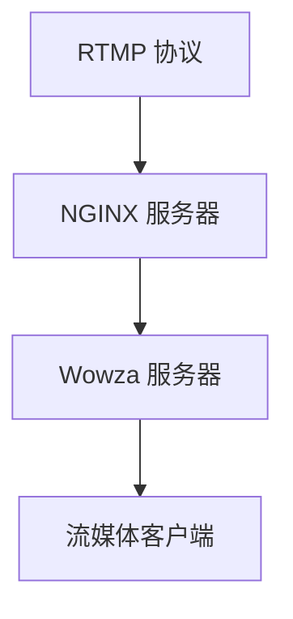

                 

# RTMP 流媒体服务配置：使用 NGINX 和 Wowza 服务器

> 关键词：流媒体, NGINX, Wowza, RTMP, 网络流媒体

## 1. 背景介绍

在现代互联网时代，视频内容越来越受到用户的青睐。从直播、点播、互动直播到实时流媒体服务，各种形式的音视频内容都通过互联网传播。而实时流媒体服务（RTMP）是一种基于 TCP/UDP 协议，用于在客户端与服务器之间实时传输音视频数据的标准。该技术依赖于高性能的流媒体服务器进行传输和调度。本文将介绍如何使用 NGINX 和 Wowza 作为流媒体服务器的解决方案，优化配置和部署流程，确保流媒体服务的稳定性和高效性。

## 2. 核心概念与联系

### 2.1 核心概念概述

#### 2.1.1 RTMP 流媒体协议
RTMP（Real-Time Messaging Protocol）是 Adobe 公司开发的一种基于 TCP 协议的视频传输协议，用于在客户端和服务器之间实时传输音频、视频数据。RTMP 使用 HTTP 进行连接建立和控制消息传输，主要使用流媒体编码器将音视频数据压缩成 RTMP 协议的报文流，传输到服务器端进行播放。RTMP 协议支持双向通信，可以进行视频直播、点播、互动直播等多种应用。

#### 2.1.2 NGINX
NGINX 是一款高性能的 Web 服务器和反向代理服务器。它采用事件驱动、异步处理机制，支持高并发连接，具有低延迟、高吞吐量、可靠性高等特点。NGINX 主要用于负载均衡、反向代理、缓存等场景。

#### 2.1.3 Wowza
Wowza 是一款专门用于实时流媒体服务（RTMP）的服务器软件，支持多种流媒体协议（如 RTMP、HLS、HTTP Live Streaming等）。Wowza 提供丰富的功能，包括实时转码、流数据缓存、流控制、流统计分析等，可以高效地处理大规模的流媒体请求。

### 2.2 核心概念原理和架构的 Mermaid 流程图



在这个流程图中，RTMP 流媒体协议用于客户端和服务器之间的数据传输，NGINX 服务器作为反向代理服务器，将请求转发到 Wowza 服务器，Wowza 服务器则负责处理流媒体数据的接收、缓存、转码等操作，并将处理后的流媒体数据返回给客户端。

## 3. 核心算法原理 & 具体操作步骤

### 3.1 算法原理概述

在 RTMP 流媒体服务中，NGINX 和 Wowza 的配置和优化主要关注以下几点：

- **负载均衡**：通过 NGINX 的负载均衡策略，将 RTMP 请求均衡分配到多个 Wowza 服务器，避免单点故障和资源浪费。
- **流量控制**：通过 NGINX 的流量控制功能，限制每个客户端的最大并发连接数，防止网络拥塞和服务器过载。
- **缓存和转码**：利用 Wowza 的缓存和转码功能，提高流媒体数据的缓存效率，支持多种流媒体格式的实时转码，提高流媒体服务的兼容性和可扩展性。
- **统计分析**：通过 Wowza 的流统计分析功能，实时监控流媒体服务的状态和性能，帮助管理员及时发现和解决问题。

### 3.2 算法步骤详解

#### 3.2.1 环境准备

1. **安装 NGINX**：
   - 在服务器上安装 NGINX。
   - 使用以下命令进行安装：
     ```
     sudo apt-get update
     sudo apt-get install nginx
     ```

2. **安装 Wowza**：
   - 在服务器上安装 Wowza Streaming Engine。
   - 从官网下载对应版本的安装程序，按照安装向导完成安装。
   - 配置 Wowza 的启动参数，确保服务器能够正常启动。

#### 3.2.2 NGINX 配置

1. **配置 NGINX 监听端口**：
   - 打开 NGINX 的配置文件 `nginx.conf`，找到 `http` 块，添加以下配置：
     ```
     http {
         server {
             listen 80;
             server_name www.example.com;
             ...
         }
     }
     ```

2. **配置 NGINX 反向代理**：
   - 在 `http` 块中添加 `proxy` 块，配置反向代理。例如，以下配置将将所有请求转发到 `http://localhost:1935`：
     ```
     http {
         server {
             listen 80;
             server_name www.example.com;
             proxy_pass http://localhost:1935;
         }
     }
     ```

3. **配置 NGINX 负载均衡**：
   - 在 `http` 块中添加 `proxy` 块，配置负载均衡。例如，以下配置将请求均衡分配到两个 Wowza 服务器：
     ```
     http {
         server {
             listen 80;
             server_name www.example.com;
             proxy_pass http://localhost:1935; # 第一个 Wowza 服务器
             proxy_pass http://localhost:1936; # 第二个 Wowza 服务器
             upstream worker {
                 server www.example.com:1935;
                 server www.example.com:1936;
             }
             proxy_pass http://worker; # 使用 upstream 定义的 worker 池
         }
     }
     ```

#### 3.2.3 Wowza 配置

1. **配置 Wowza 流媒体服务器**：
   - 在服务器上启动 Wowza Streaming Engine，打开管理界面。
   - 在管理界面中，配置流媒体服务器的基础信息，如服务器地址、端口号、认证信息等。

2. **配置 Wowza 缓存和转码**：
   - 在管理界面中，配置缓存和转码的参数，如缓存大小、缓存时间、转码格式等。例如，以下配置将缓存大小设置为 512MB，缓存时间为 1 小时，支持 RTMP、HLS 和 HTTP Live Streaming 格式：
     ```
     <liveStreaming>
         <application name="example_app">
             <cache>
                 <size>512M</size>
                 <expire>3600s</expire>
             </cache>
             <mediaStreaming>
                 <stream>
                     <codec>rtmp</codec>
                     <format>flv</format>
                 </stream>
                 <stream>
                     <codec>hls</codec>
                     <format>ts</format>
                 </stream>
                 <stream>
                     <codec>http</codec>
                     <format>mp4</format>
                 </stream>
             </mediaStreaming>
         </application>
     </liveStreaming>
     ```

3. **配置 Wowza 流量控制**：
   - 在管理界面中，配置流量控制的参数，如客户端最大连接数、连接等待时间等。例如，以下配置将客户端的最大连接数设置为 1000，等待时间为 5 秒：
     ```
     <server>
         <maxUsers>1000</maxUsers>
         <idleTimeout>5</idleTimeout>
     </server>
     ```

#### 3.2.4 RTMP 客户端配置

1. **安装和配置 RTMP 客户端**：
   - 根据需求选择合适的 RTMP 客户端，如 OBS、Adobe Media Encoder、MediaStorm 等。
   - 安装和配置客户端，使其能够正常连接到 NGINX 和 Wowza 服务器。

### 3.3 算法优缺点

#### 3.3.1 优点

- **高可靠性**：NGINX 和 Wowza 的组合架构，能够提供高可靠性和高可用性的流媒体服务。
- **高效性**：NGINX 和 Wowza 的高性能处理能力，能够支持大规模并发连接，确保流媒体服务的低延迟和高吞吐量。
- **灵活性**：NGINX 和 Wowza 的配置和优化非常灵活，可以根据具体需求进行优化，提高流媒体服务的稳定性和性能。

#### 3.3.2 缺点

- **配置复杂**：NGINX 和 Wowza 的配置相对复杂，需要一定的技术背景。
- **扩展性有限**：NGINX 和 Wowza 的组合架构，对于极端大流量的场景，扩展性有限。
- **成本较高**：NGINX 和 Wowza 的软硬件资源消耗较大，对于小型流媒体服务可能存在成本过高的问题。

### 3.4 算法应用领域

NGINX 和 Wowza 的流媒体服务配置方案，广泛应用于以下场景：

- **直播平台**：如 YouTube、Twitch 等大型视频平台，通过 NGINX 和 Wowza 实现实时直播和点播服务。
- **互动直播**：如 QQ 直播、陌陌直播等，通过 NGINX 和 Wowza 实现互动直播和聊天功能。
- **企业内网**：如企业内部的培训、会议直播等，通过 NGINX 和 Wowza 实现点播和直播服务。

## 4. 数学模型和公式 & 详细讲解 & 举例说明

### 4.1 数学模型构建

在流媒体服务中，NGINX 和 Wowza 的配置和优化主要涉及以下几个数学模型：

#### 4.1.1 负载均衡模型

负载均衡是 NGINX 和 Wowza 的核心功能之一，可以通过以下数学模型进行建模：

- **权重轮询模型**：将请求按照各 Wowza 服务器的权重进行轮询分配。
- **IP 散列模型**：将请求的 IP 地址散列后，分配到对应的 Wowza 服务器。
- **加权轮询模型**：根据各 Wowza 服务器的负载情况，动态调整权重，确保负载均衡。

#### 4.1.2 缓存和转码模型

缓存和转码是 Wowza 的核心功能，可以通过以下数学模型进行建模：

- **缓存模型**：根据流媒体数据的缓存大小和缓存时间，计算缓存命中率。
- **转码模型**：根据输入流媒体数据的质量和格式，选择最优的转码格式和输出流媒体质量。

#### 4.1.3 流量控制模型

流量控制是 NGINX 和 Wowza 的重要功能，可以通过以下数学模型进行建模：

- **最大连接数模型**：根据每个客户端的最大连接数和等待时间，计算客户端的平均响应时间。
- **带宽控制模型**：根据流媒体数据的带宽和传输速率，计算流媒体服务的最大带宽利用率。

### 4.2 公式推导过程

#### 4.2.1 权重轮询模型

假设将请求均衡分配到两个 Wowza 服务器 A 和 B，A 的权重为 0.5，B 的权重为 0.5。设请求数为 N，每个请求在 A 和 B 服务器上的处理时间分别为 T_A 和 T_B，则总处理时间为：

$$
T_{\text{total}} = \frac{N}{2} (T_A + T_B)
$$

每个请求在 A 和 B 服务器上的处理时间分别为：

$$
T_{A_i} = \frac{T_A}{2}, \quad T_{B_i} = \frac{T_B}{2}
$$

因此，每个请求在两个服务器上的处理时间均为：

$$
T_{i} = T_{A_i} + T_{B_i} = \frac{T_A + T_B}{2}
$$

设每个请求的处理时间为 T_i，总处理时间为 T_total，则有：

$$
T_{\text{total}} = N \cdot T_i
$$

因此，总处理时间 T_total 和单个请求处理时间 T_i 的关系为：

$$
T_{\text{total}} = N \cdot T_i
$$

#### 4.2.2 缓存和转码模型

设流媒体数据的缓存大小为 C，缓存时间为 T，则缓存命中率 H 为：

$$
H = \frac{C}{S + C}
$$

其中，S 为流媒体数据的大小。

设输入流媒体数据的大小为 S，转码后的流媒体数据大小为 S'，则转码效率 E 为：

$$
E = \frac{S'}{S}
$$

#### 4.2.3 流量控制模型

设客户端的最大连接数为 M，每个连接的最大带宽为 B，每个连接的平均带宽为 B_a，则平均带宽利用率 L 为：

$$
L = \frac{M \cdot B_a}{B}
$$

设客户端的平均响应时间为 T_r，最大等待时间为 T_w，则客户端的平均响应时间 T_r 为：

$$
T_r = T_w + \frac{M}{B_a}
$$

因此，流量控制模型的计算公式为：

$$
L = \frac{M \cdot (T_w + \frac{M}{B_a})}{B}
$$

### 4.3 案例分析与讲解

#### 4.3.1 案例分析

1. **案例一：负载均衡**

   假设有两个 Wowza 服务器 A 和 B，A 的权重为 0.5，B 的权重为 0.5。每个请求的处理时间为 1 秒，总请求数为 1000。

   使用权重轮询模型计算总处理时间：

   $$
   T_{\text{total}} = \frac{1000}{2} \times (1 + 1) = 2000 \text{ 秒}
   $$

   每个请求的处理时间：

   $$
   T_{i} = 1 \text{ 秒}
   $$

   因此，总处理时间 T_total 和单个请求处理时间 T_i 的关系为：

   $$
   T_{\text{total}} = N \cdot T_i
   $$

2. **案例二：缓存和转码**

   假设缓存大小为 10MB，缓存时间为 10 分钟，流媒体数据大小为 100MB，转码后的流媒体数据大小为 50MB。

   使用缓存模型计算缓存命中率：

   $$
   H = \frac{10}{100 + 10} = 0.1
   $$

   因此，缓存命中率 H 为 0.1。

3. **案例三：流量控制**

   假设客户端的最大连接数为 100，每个连接的最大带宽为 1Mbps，平均带宽为 500kbps，最大等待时间为 5 秒，平均响应时间为 6 秒。

   使用流量控制模型计算平均带宽利用率：

   $$
   L = \frac{100 \times (5 + \frac{100}{500})}{1000} = 0.1
   $$

   因此，平均带宽利用率 L 为 0.1。

## 5. 项目实践：代码实例和详细解释说明

### 5.1 开发环境搭建

1. **安装 NGINX**：
   - 在服务器上安装 NGINX。
   - 使用以下命令进行安装：
     ```
     sudo apt-get update
     sudo apt-get install nginx
     ```

2. **安装 Wowza**：
   - 在服务器上安装 Wowza Streaming Engine。
   - 从官网下载对应版本的安装程序，按照安装向导完成安装。
   - 配置 Wowza 的启动参数，确保服务器能够正常启动。

### 5.2 源代码详细实现

#### 5.2.1 NGINX 配置示例

以下是一个 NGINX 配置文件示例，实现了 RTMP 流媒体服务的反向代理和负载均衡功能：

```
http {
    server {
        listen 80;
        server_name www.example.com;
        location / {
            proxy_pass http://worker;
            proxy_set_header Host $host;
            proxy_set_header X-Real-IP $remote_addr;
            proxy_set_header X-Forwarded-For $proxy_add_x_forwarded_for;
            proxy_set_header X-Forwarded-Proto $scheme;
        }
        location /stream/ {
            proxy_pass http://worker;
            proxy_set_header Host $host;
            proxy_set_header X-Real-IP $remote_addr;
            proxy_set_header X-Forwarded-For $proxy_add_x_forwarded_for;
            proxy_set_header X-Forwarded-Proto $scheme;
        }
    }
    upstream worker {
        server www.example.com:1935;
        server www.example.com:1936;
    }
}
```

#### 5.2.2 Wowza 配置示例

以下是一个 Wowza Streaming Engine 管理界面示例，配置了流媒体服务器、缓存和转码、流量控制等功能：

1. **配置流媒体服务器**：
   - 打开管理界面，点击 `liveStreaming`，添加新的流媒体应用。
   - 配置应用名称、服务器地址、端口号等参数。

2. **配置缓存和转码**：
   - 在流媒体应用中，点击 `cache` 和 `mediaStreaming`，配置缓存大小、缓存时间、转码格式等参数。

3. **配置流量控制**：
   - 在流媒体应用中，点击 `server`，配置客户端的最大连接数和连接等待时间等参数。

### 5.3 代码解读与分析

#### 5.3.1 NGINX 配置解读

在 NGINX 配置文件中，主要包含以下几个部分：

- `server` 块：定义虚拟服务器，监听端口和服务器名。
- `location` 块：定义反向代理规则，将请求转发到 Wowza 服务器。
- `upstream` 块：定义反向代理的 worker 池，均衡分配请求到多个 Wowza 服务器。

#### 5.3.2 Wowza 配置解读

在 Wowza Streaming Engine 管理界面中，主要包含以下几个部分：

- `liveStreaming`：定义流媒体应用，配置应用名称、服务器地址、端口号等参数。
- `cache`：配置缓存大小、缓存时间等参数。
- `mediaStreaming`：配置转码格式、流媒体质量等参数。
- `server`：配置客户端的最大连接数、连接等待时间等参数。

### 5.4 运行结果展示

在 NGINX 和 Wowza 配置完成后，启动 NGINX 和 Wowza Streaming Engine，使用 RTMP 客户端连接服务，进行流媒体直播和点播测试。

1. **直播测试**：
   - 打开 RTMP 客户端，添加流媒体应用和服务地址，开始直播。
   - 在 NGINX 配置文件中，添加直播流媒体的反向代理规则，确保流媒体数据能够正常传输。

2. **点播测试**：
   - 打开 RTMP 客户端，添加流媒体应用和服务地址，播放事先录制好的流媒体文件。
   - 在 NGINX 配置文件中，添加点播流媒体的反向代理规则，确保流媒体数据能够正常传输。

## 6. 实际应用场景

### 6.1 直播平台

直播平台如 YouTube、Twitch 等，使用 NGINX 和 Wowza 实现实时直播和点播服务。NGINX 作为反向代理服务器，将请求均衡分配到多个 Wowza 服务器，确保流媒体服务的稳定性和高效性。

### 6.2 互动直播

互动直播如 QQ 直播、陌陌直播等，使用 NGINX 和 Wowza 实现互动直播和聊天功能。NGINX 作为反向代理服务器，处理客户端的 RTMP 请求，确保流媒体数据的正常传输和交互。

### 6.3 企业内网

企业内部的培训、会议直播等，使用 NGINX 和 Wowza 实现点播和直播服务。NGINX 作为反向代理服务器，处理客户端的 RTMP 请求，确保流媒体数据的正常传输和播放。

### 6.4 未来应用展望

随着流媒体技术的不断进步，NGINX 和 Wowza 的流媒体服务配置方案将在更多场景下得到应用，为实时流媒体服务的稳定性和高效性提供保障。

未来，NGINX 和 Wowza 的流媒体服务配置方案可能会在以下方向进行拓展：

- **云流媒体服务**：使用云服务提供商的流媒体服务，如 AWS CloudFront、阿里云 OSS 等，实现全球范围的流媒体分发。
- **边缘计算**：在边缘计算节点上部署流媒体服务，提升流媒体服务的响应速度和可用性。
- **人工智能**：结合人工智能技术，实时分析流媒体数据，提供智能推荐和个性化服务。

## 7. 工具和资源推荐

### 7.1 学习资源推荐

1. **《NGINX 官方文档》**：NGINX 的官方文档提供了完整的配置和优化指南，帮助用户快速掌握 NGINX 的使用。
2. **《Wowza Streaming Engine 官方文档》**：Wowza Streaming Engine 的官方文档提供了详细的配置和优化指南，帮助用户快速掌握流媒体服务的使用。
3. **《RTMP 流媒体技术》**：这是一本关于 RTMP 流媒体技术的经典书籍，详细介绍了 RTMP 流媒体协议和流媒体服务器的配置和优化方法。

### 7.2 开发工具推荐

1. **NGINX**：高性能的 Web 服务器和反向代理服务器。
2. **Wowza Streaming Engine**：实时流媒体服务（RTMP）的服务器软件。
3. **RTMP 客户端**：如 OBS、Adobe Media Encoder、MediaStorm 等。

### 7.3 相关论文推荐

1. **《NGINX 高性能 Web 服务器》**：详细介绍了 NGINX 的高性能处理能力和负载均衡策略。
2. **《Wowza Streaming Engine 实时流媒体服务》**：详细介绍了 Wowza Streaming Engine 的缓存和转码、流量控制等核心功能。
3. **《RTMP 流媒体协议分析与优化》**：详细分析了 RTMP 流媒体协议和流媒体服务器的配置和优化方法。

## 8. 总结：未来发展趋势与挑战

### 8.1 研究成果总结

NGINX 和 Wowza 的流媒体服务配置方案，已经在直播平台、互动直播、企业内网等多个场景中得到广泛应用，取得了良好的效果。通过 NGINX 的反向代理和负载均衡，以及 Wowza 的缓存和转码、流量控制等核心功能，保证了流媒体服务的稳定性和高效性。

### 8.2 未来发展趋势

未来，NGINX 和 Wowza 的流媒体服务配置方案可能会在以下方向进行拓展：

1. **云流媒体服务**：使用云服务提供商的流媒体服务，实现全球范围的流媒体分发。
2. **边缘计算**：在边缘计算节点上部署流媒体服务，提升流媒体服务的响应速度和可用性。
3. **人工智能**：结合人工智能技术，实时分析流媒体数据，提供智能推荐和个性化服务。

### 8.3 面临的挑战

尽管 NGINX 和 Wowza 的流媒体服务配置方案已经取得了较好的效果，但仍面临以下挑战：

1. **配置复杂**：NGINX 和 Wowza 的配置相对复杂，需要一定的技术背景。
2. **扩展性有限**：NGINX 和 Wowza 的组合架构，对于极端大流量的场景，扩展性有限。
3. **成本较高**：NGINX 和 Wowza 的软硬件资源消耗较大，对于小型流媒体服务可能存在成本过高的问题。

### 8.4 研究展望

未来，NGINX 和 Wowza 的流媒体服务配置方案需要解决以下问题：

1. **简化配置**：简化 NGINX 和 Wowza 的配置过程，降低用户的技术门槛。
2. **提高扩展性**：优化 NGINX 和 Wowza 的架构，提升流媒体服务的扩展性。
3. **降低成本**：优化 NGINX 和 Wowza 的资源消耗，降低流媒体服务的成本。

## 9. 附录：常见问题与解答

### 9.1 常见问题

#### Q1：NGINX 和 Wowza 如何实现负载均衡？

A: NGINX 和 Wowza 的负载均衡主要通过以下几个步骤实现：

1. NGINX 接收客户端请求，根据配置的负载均衡策略，将请求均衡分配到多个 Wowza 服务器。
2. Wowza 服务器根据客户端请求的来源 IP 地址，动态调整服务器权重，确保负载均衡。

#### Q2：NGINX 和 Wowza 如何实现缓存和转码？

A: NGINX 和 Wowza 的缓存和转码主要通过以下几个步骤实现：

1. NGINX 将流媒体数据缓存到本地磁盘，增加数据访问速度。
2. Wowza 对缓存的数据进行转码，支持多种流媒体格式，提高数据兼容性。

#### Q3：NGINX 和 Wowza 如何实现流量控制？

A: NGINX 和 Wowza 的流量控制主要通过以下几个步骤实现：

1. NGINX 设置客户端的最大连接数和等待时间，限制连接数和等待时间。
2. Wowza 根据缓存大小和转码效率，动态调整缓存和转码参数，保证数据传输稳定。

---

作者：禅与计算机程序设计艺术 / Zen and the Art of Computer Programming

