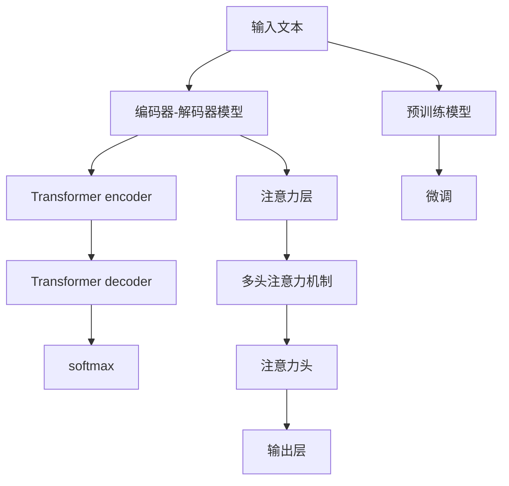

                 

# TensorFlow 自然语言处理技术：理解和生成文本

> 关键词：自然语言处理(NLP)，TensorFlow，文本分类，序列建模，注意力机制，Transformer，预训练模型

## 1. 背景介绍

### 1.1 问题由来

自然语言处理(NLP)是人工智能(AI)领域的重要分支，其目标是使计算机能够理解、处理和生成人类语言。传统的NLP技术基于规则和词典，受限于语法规则的精确性和语义理解的广度，难以应对复杂多变的语言表达。

近年来，随着深度学习技术的迅速发展，特别是神经网络的广泛应用，NLP领域迎来了一场革命性的变革。深度学习模型通过学习大规模语料，能够捕捉到语言的复杂结构与语义关系，显著提升了NLP任务的效果和泛化能力。

其中，TensorFlow作为流行的深度学习框架，提供了强大的工具和库，支持NLP任务的开发和研究。TensorFlow在文本分类、序列建模、注意力机制等方面都有广泛的应用，成为推动NLP技术进步的重要力量。

### 1.2 问题核心关键点

TensorFlow在NLP领域的成功，离不开其灵活的模型构建机制和强大的分布式计算能力。TensorFlow的核心优势包括：

1. **模块化架构**：TensorFlow支持构建灵活的计算图，通过定义操作节点和数据流向，实现复杂模型的高效构建和调度。

2. **分布式计算**：TensorFlow支持大规模分布式训练，能够利用GPU、TPU等高性能设备，加速模型训练和推理过程。

3. **预训练模型**：TensorFlow提供了丰富的预训练模型，如BERT、GPT等，这些模型在大型语料上进行了预训练，具备强大的语言理解和生成能力。

4. **工具和资源**：TensorFlow拥有丰富的API和工具库，如TensorBoard、Estimator等，简化模型开发和调优过程。

5. **生态系统**：TensorFlow构建了庞大的生态系统，拥有活跃的社区和丰富的资源，支持从模型开发到部署的一站式解决方案。

这些关键点共同构成了TensorFlow在NLP领域的技术优势，使其成为NLP开发者首选的框架。

## 2. 核心概念与联系

### 2.1 核心概念概述

要深入理解TensorFlow在NLP领域的应用，首先需要掌握以下核心概念：

- **自然语言处理(NLP)**：涉及文本分类、序列建模、命名实体识别、机器翻译等任务，旨在使计算机能够理解、处理和生成自然语言。

- **深度学习模型**：通过多层神经网络实现复杂非线性映射，学习数据的高阶特征表示。

- **序列建模**：将序列数据作为输入，通过RNN、LSTM、GRU等模型进行建模，捕捉序列之间的依赖关系。

- **注意力机制**：用于计算输入序列与输出序列之间的对齐关系，提高模型的局部关注能力。

- **Transformer**：一种自注意力机制的神经网络结构，通过多头自注意力和位置编码，显著提升了模型的语言建模能力。

- **预训练模型**：在大规模语料上进行预训练，学习到通用语言表示，提升模型泛化能力。

这些概念之间的逻辑关系可以通过以下Mermaid流程图来展示：

```mermaid
graph TB
    A[自然语言处理(NLP)] --> B[深度学习模型]
    B --> C[序列建模]
    B --> D[注意力机制]
    D --> E[Transformer]
    B --> F[预训练模型]
```

这个流程图展示了一系列NLP任务的逻辑关系：

1. 自然语言处理任务（NLP），如文本分类、命名实体识别等，均依赖于深度学习模型进行建模。
2. 深度学习模型中，序列建模和注意力机制是两个核心模块，用于捕捉序列数据的时序依赖关系。
3. Transformer是序列建模中的一种经典结构，通过多头自注意力机制，显著提升了模型的语言建模能力。
4. 预训练模型在大规模语料上进行了预训练，学习到通用语言表示，可用于多种下游NLP任务的微调。

### 2.2 核心概念原理和架构的 Mermaid 流程图



这个流程图展示了Transformer架构的基本构成，包括编码器-解码器结构、多头自注意力机制、输出层等关键组件。其中，编码器负责编码输入序列，解码器负责生成输出序列，注意力层用于计算输入序列与输出序列之间的对齐关系。

## 3. 核心算法原理 & 具体操作步骤

### 3.1 算法原理概述

TensorFlow在NLP领域的应用主要集中在序列建模、注意力机制、预训练模型等方面。以下将详细介绍这些核心算法的原理和操作步骤。

### 3.2 算法步骤详解

#### 3.2.1 序列建模

序列建模是NLP任务中常见的一种建模方式，旨在捕捉序列数据的时序依赖关系。主要算法包括RNN、LSTM、GRU等。

**步骤**：
1. 输入序列经过Embedding层，转化为固定长度的向量表示。
2. 将向量序列输入RNN、LSTM或GRU模型，通过时间步的递归计算，得到每个时间步的隐藏状态。
3. 将隐藏状态输入全连接层或其他神经网络，输出最终结果。

**代码实现**：

```python
import tensorflow as tf
from tensorflow.keras.layers import Embedding, LSTM

# 定义模型
model = tf.keras.Sequential([
    Embedding(input_dim=vocab_size, output_dim=embedding_dim),
    LSTM(units=hidden_size, return_sequences=True),
    LSTM(units=hidden_size),
    Dense(output_dim, activation='softmax')
])

# 编译模型
model.compile(optimizer='adam', loss='categorical_crossentropy', metrics=['accuracy'])

# 训练模型
model.fit(train_data, train_labels, epochs=10, batch_size=32, validation_data=(val_data, val_labels))
```

#### 3.2.2 注意力机制

注意力机制用于计算输入序列与输出序列之间的对齐关系，提高模型的局部关注能力。主要算法包括自注意力机制、多头自注意力机制等。

**步骤**：
1. 输入序列经过线性变换和激活函数，得到查询向量、键向量、值向量。
2. 计算查询向量与键向量的相似度，得到注意力分数。
3. 对注意力分数进行softmax归一化，得到注意力权重。
4. 将注意力权重与值向量相乘，加权求和，得到上下文向量。
5. 将上下文向量输入输出层，输出最终结果。

**代码实现**：

```python
import tensorflow as tf
from tensorflow.keras.layers import Dot, Dense, Add

# 定义注意力层
attention_layer = tf.keras.layers.Lambda(
    lambda query, key, value: Dot(axes=[2, 2])([query, key])
) 

# 计算注意力权重
attention_weights = tf.keras.layers.Activation('softmax')(attention_layer)

# 计算上下文向量
context_vector = tf.keras.layers.Dot(axes=[2, 2])([attention_weights, value])

# 输出结果
output_vector = Dense(output_dim)(context_vector)
```

#### 3.2.3 预训练模型

预训练模型在大规模语料上进行预训练，学习到通用语言表示，提升模型泛化能力。主要算法包括BERT、GPT等。

**步骤**：
1. 使用大规模无标签语料进行预训练，通过自监督学习任务（如掩码语言模型、next sentence prediction等），学习通用语言表示。
2. 在预训练模型上，通过有监督的微调，适应特定任务的需求。
3. 将微调后的模型应用于下游任务，输出预测结果。

**代码实现**：

```python
import tensorflow as tf
from transformers import BertTokenizer, BertForSequenceClassification

# 定义模型
tokenizer = BertTokenizer.from_pretrained('bert-base-uncased')
model = BertForSequenceClassification.from_pretrained('bert-base-uncased', num_labels=num_labels)

# 编译模型
model.compile(optimizer='adam', loss='sparse_categorical_crossentropy', metrics=['accuracy'])

# 训练模型
model.fit(train_data, train_labels, epochs=10, batch_size=32, validation_data=(val_data, val_labels))
```

### 3.3 算法优缺点

TensorFlow在NLP领域的应用具有以下优点：

1. **灵活性**：TensorFlow支持构建灵活的计算图，能够处理多种NLP任务。
2. **分布式计算**：TensorFlow支持大规模分布式训练，能够利用高性能设备加速模型训练和推理。
3. **丰富的API和工具库**：TensorFlow提供了丰富的API和工具库，如TensorBoard、Estimator等，简化模型开发和调优过程。

但同时，TensorFlow也存在一些缺点：

1. **学习曲线较陡**：TensorFlow的灵活性和复杂性，使得初学者较难上手。
2. **资源消耗大**：TensorFlow对内存和显存的要求较高，大规模模型训练时可能会遇到资源瓶颈。
3. **模型部署复杂**：TensorFlow的模型通常需要封装为GraphDef或SavedModel格式，部署到生产环境时较为复杂。

### 3.4 算法应用领域

TensorFlow在NLP领域的应用广泛，涵盖了多种任务和应用场景。以下是一些典型的应用领域：

- **文本分类**：如情感分析、主题分类、垃圾邮件过滤等。使用序列建模和注意力机制，将文本序列转化为固定长度向量，输入分类器进行分类。
- **序列标注**：如命名实体识别、词性标注等。使用序列建模和注意力机制，对输入序列进行序列标注。
- **机器翻译**：如英语到中文、中文到英语等。使用Transformer结构，对输入序列进行编码和解码，得到翻译结果。
- **问答系统**：如基于知识图谱的问答系统、聊天机器人等。使用序列建模和注意力机制，生成自然语言回答。
- **文本生成**：如新闻生成、小说创作等。使用生成对抗网络(GAN)和Transformer结构，生成符合特定语境的文本。

这些应用领域展示了TensorFlow在NLP领域的广泛应用，推动了NLP技术的快速发展和落地。

## 4. 数学模型和公式 & 详细讲解  
### 4.1 数学模型构建

TensorFlow在NLP任务中的应用，主要涉及序列建模、注意力机制和预训练模型的数学建模。以下是几个典型的数学模型构建。

#### 4.1.1 序列建模

序列建模主要涉及RNN、LSTM和GRU等模型的构建。以LSTM为例，其数学模型构建如下：

$$
h_t = \tanh(W_h \cdot [h_{t-1}, x_t] + b_h)
$$

$$
c_t = \text{sigmoid}(W_c \cdot [h_{t-1}, x_t] + b_c)
$$

$$
c_t = c_{t-1} \cdot \text{sigmoid}(W_c \cdot [h_{t-1}, x_t] + b_c) + \text{tanh}(W_c \cdot [h_{t-1}, x_t] + b_c)
$$

$$
o_t = \sigma(W_o \cdot [h_{t-1}, x_t] + b_o)
$$

$$
h_t = o_t \cdot c_t
$$

其中，$h_t$为时间步$t$的隐藏状态，$c_t$为时间步$t$的记忆状态，$x_t$为输入向量，$W_h, W_c, W_o$为权重矩阵，$b_h, b_c, b_o$为偏置向量，$\sigma, \tanh$为激活函数。

#### 4.1.2 注意力机制

注意力机制的数学模型构建如下：

$$
Q = XW_Q + b_Q
$$

$$
K = XW_K + b_K
$$

$$
V = XW_V + b_V
$$

$$
E = QK^T
$$

$$
\alpha = \frac{\exp(E)}{\sum_{i=1}^{n} \exp(E_i)}
$$

$$
H = \alpha V
$$

其中，$X$为输入序列，$W_Q, W_K, W_V$为权重矩阵，$b_Q, b_K, b_V$为偏置向量，$Q, K, V$为查询、键和值向量，$E$为注意力分数，$\alpha$为注意力权重，$H$为上下文向量。

#### 4.1.3 预训练模型

预训练模型的数学模型构建如下：

$$
X = X + M
$$

$$
H = \text{TransformerEncoder}(X)
$$

$$
P = \text{TransformerDecoder}(H)
$$

$$
\text{output} = \text{dense}(P)
$$

其中，$X$为输入序列，$M$为掩码向量，$H$为编码器输出，$P$为解码器输出，$\text{dense}$为输出层，$\text{TransformerEncoder}$和$\text{TransformerDecoder}$为Transformer模型。

### 4.2 公式推导过程

#### 4.2.1 序列建模

序列建模的公式推导如下：

1. 输入序列经过Embedding层，转化为固定长度的向量表示：

$$
X = \text{Embedding}(x)
$$

2. 将向量序列输入LSTM模型，通过时间步的递归计算，得到每个时间步的隐藏状态：

$$
h_t = \tanh(W_h \cdot [h_{t-1}, x_t] + b_h)
$$

$$
c_t = \text{sigmoid}(W_c \cdot [h_{t-1}, x_t] + b_c)
$$

$$
c_t = c_{t-1} \cdot \text{sigmoid}(W_c \cdot [h_{t-1}, x_t] + b_c) + \text{tanh}(W_c \cdot [h_{t-1}, x_t] + b_c)
$$

3. 将隐藏状态输入全连接层或其他神经网络，输出最终结果：

$$
\text{output} = \text{dense}(h_t)
$$

#### 4.2.2 注意力机制

注意力机制的公式推导如下：

1. 输入序列经过线性变换和激活函数，得到查询向量、键向量、值向量：

$$
Q = XW_Q + b_Q
$$

$$
K = XW_K + b_K
$$

$$
V = XW_V + b_V
$$

2. 计算查询向量与键向量的相似度，得到注意力分数：

$$
E = QK^T
$$

3. 对注意力分数进行softmax归一化，得到注意力权重：

$$
\alpha = \frac{\exp(E)}{\sum_{i=1}^{n} \exp(E_i)}
$$

4. 将注意力权重与值向量相乘，加权求和，得到上下文向量：

$$
H = \alpha V
$$

5. 将上下文向量输入输出层，输出最终结果：

$$
\text{output} = \text{dense}(H)
$$

#### 4.2.3 预训练模型

预训练模型的公式推导如下：

1. 使用大规模无标签语料进行预训练，通过自监督学习任务（如掩码语言模型、next sentence prediction等），学习通用语言表示：

$$
X = X + M
$$

2. 在预训练模型上，通过有监督的微调，适应特定任务的需求：

$$
H = \text{TransformerEncoder}(X)
$$

$$
P = \text{TransformerDecoder}(H)
$$

3. 将微调后的模型应用于下游任务，输出预测结果：

$$
\text{output} = \text{dense}(P)
$$

### 4.3 案例分析与讲解

#### 4.3.1 文本分类

以情感分析为例，其数学模型构建如下：

1. 输入序列经过Embedding层，转化为固定长度的向量表示：

$$
X = \text{Embedding}(x)
$$

2. 将向量序列输入LSTM模型，通过时间步的递归计算，得到每个时间步的隐藏状态：

$$
h_t = \tanh(W_h \cdot [h_{t-1}, x_t] + b_h)
$$

$$
c_t = \text{sigmoid}(W_c \cdot [h_{t-1}, x_t] + b_c)
$$

$$
c_t = c_{t-1} \cdot \text{sigmoid}(W_c \cdot [h_{t-1}, x_t] + b_c) + \text{tanh}(W_c \cdot [h_{t-1}, x_t] + b_c)
$$

3. 将隐藏状态输入全连接层，输出情感分类：

$$
\text{output} = \text{dense}(h_t)
$$

#### 4.3.2 命名实体识别

以命名实体识别为例，其数学模型构建如下：

1. 输入序列经过Embedding层，转化为固定长度的向量表示：

$$
X = \text{Embedding}(x)
$$

2. 将向量序列输入LSTM模型，通过时间步的递归计算，得到每个时间步的隐藏状态：

$$
h_t = \tanh(W_h \cdot [h_{t-1}, x_t] + b_h)
$$

$$
c_t = \text{sigmoid}(W_c \cdot [h_{t-1}, x_t] + b_c)
$$

$$
c_t = c_{t-1} \cdot \text{sigmoid}(W_c \cdot [h_{t-1}, x_t] + b_c) + \text{tanh}(W_c \cdot [h_{t-1}, x_t] + b_c)
$$

3. 将隐藏状态输入全连接层，输出实体标签：

$$
\text{output} = \text{dense}(h_t)
$$

## 5. 项目实践：代码实例和详细解释说明

### 5.1 开发环境搭建

在进行TensorFlow项目实践前，我们需要准备好开发环境。以下是使用Python进行TensorFlow开发的环境配置流程：

1. 安装Anaconda：从官网下载并安装Anaconda，用于创建独立的Python环境。

2. 创建并激活虚拟环境：

```bash
conda create -n tensorflow-env python=3.8 
conda activate tensorflow-env
```

3. 安装TensorFlow：根据CUDA版本，从官网获取对应的安装命令。例如：

```bash
pip install tensorflow
```

4. 安装TensorFlow Hub：用于加载预训练模型和模型库。

```bash
pip install tensorflow-hub
```

5. 安装其他相关工具包：

```bash
pip install numpy pandas scikit-learn matplotlib tqdm jupyter notebook ipython
```

完成上述步骤后，即可在`tensorflow-env`环境中开始TensorFlow项目实践。

### 5.2 源代码详细实现

这里我们以情感分析任务为例，给出使用TensorFlow对LSTM模型进行训练和评估的代码实现。

```python
import tensorflow as tf
from tensorflow.keras.layers import Embedding, LSTM, Dense
from tensorflow.keras.models import Sequential
from tensorflow.keras.datasets import imdb

# 加载IMDB情感分析数据集
(x_train, y_train), (x_test, y_test) = imdb.load_data(num_words=10000)

# 定义模型
model = Sequential([
    Embedding(input_dim=10000, output_dim=128),
    LSTM(units=128, dropout=0.2, recurrent_dropout=0.2),
    Dense(units=1, activation='sigmoid')
])

# 编译模型
model.compile(optimizer='adam', loss='binary_crossentropy', metrics=['accuracy'])

# 训练模型
model.fit(x_train, y_train, epochs=10, batch_size=32, validation_data=(x_test, y_test))

# 评估模型
model.evaluate(x_test, y_test, batch_size=32)
```

### 5.3 代码解读与分析

让我们再详细解读一下关键代码的实现细节：

**定义模型**：
- `Sequential`模型：通过继承自`Sequential`的类，依次添加输入层、LSTM层和输出层，并设置相应的参数。
- `Embedding`层：将输入序列转换为固定长度的向量表示。
- `LSTM`层：通过时间步的递归计算，得到每个时间步的隐藏状态，设置dropout和recurrent_dropout参数，防止过拟合。
- `Dense`层：全连接层，输出情感分类。

**编译模型**：
- 使用`adam`优化器，设置`binary_crossentropy`损失函数和`accuracy`评价指标。

**训练模型**：
- 使用`fit`方法进行模型训练，设置训练轮数、批次大小和验证集数据。

**评估模型**：
- 使用`evaluate`方法在测试集上评估模型性能。

可以看到，TensorFlow通过简单的代码实现，就能够构建和训练一个情感分析模型。TensorFlow的模块化架构和灵活的API设计，使得模型开发过程简洁高效。

当然，工业级的系统实现还需考虑更多因素，如模型的保存和部署、超参数的自动搜索、更灵活的任务适配层等。但核心的模型构建和训练流程基本与此类似。

## 6. 实际应用场景

### 6.1 智能客服系统

智能客服系统是TensorFlow在NLP领域的重要应用之一。传统的客服方式依赖于人工处理，成本高、效率低。通过TensorFlow开发的智能客服系统，可以实现自动理解和处理客户咨询，快速响应客户问题，提高服务质量和效率。

在技术实现上，可以收集企业内部的历史客服对话记录，将问题和最佳答复构建成监督数据，在此基础上对预训练模型进行微调。微调后的模型能够自动理解用户意图，匹配最合适的答案模板进行回复。对于客户提出的新问题，还可以接入检索系统实时搜索相关内容，动态组织生成回答。如此构建的智能客服系统，能大幅提升客户咨询体验和问题解决效率。

### 6.2 金融舆情监测

金融舆情监测是TensorFlow在NLP领域的另一个重要应用。金融机构需要实时监测市场舆论动向，以便及时应对负面信息传播，规避金融风险。传统的人工监测方式成本高、效率低，难以应对网络时代海量信息爆发的挑战。

通过TensorFlow开发的金融舆情监测系统，可以实时抓取网络文本数据，自动判断文本属于何种主题，情感倾向是正面、中性还是负面。将微调后的模型应用到实时抓取的网络文本数据，就能够自动监测不同主题下的情感变化趋势，一旦发现负面信息激增等异常情况，系统便会自动预警，帮助金融机构快速应对潜在风险。

### 6.3 个性化推荐系统

个性化推荐系统是TensorFlow在NLP领域的重要应用之一。当前的推荐系统往往只依赖用户的历史行为数据进行物品推荐，无法深入理解用户的真实兴趣偏好。通过TensorFlow开发的个性化推荐系统，可以更好地挖掘用户行为背后的语义信息，从而提供更精准、多样的推荐内容。

在实践中，可以收集用户浏览、点击、评论、分享等行为数据，提取和用户交互的物品标题、描述、标签等文本内容。将文本内容作为模型输入，用户的后续行为（如是否点击、购买等）作为监督信号，在此基础上微调预训练语言模型。微调后的模型能够从文本内容中准确把握用户的兴趣点。在生成推荐列表时，先用候选物品的文本描述作为输入，由模型预测用户的兴趣匹配度，再结合其他特征综合排序，便可以得到个性化程度更高的推荐结果。

### 6.4 未来应用展望

随着TensorFlow在NLP领域的应用不断扩展，未来的应用场景将更加丰富和多样。

在智慧医疗领域，基于TensorFlow的情感分析、病历分析、药物研发等应用将提升医疗服务的智能化水平，辅助医生诊疗，加速新药开发进程。

在智能教育领域，TensorFlow可应用于作业批改、学情分析、知识推荐等方面，因材施教，促进教育公平，提高教学质量。

在智慧城市治理中，TensorFlow可应用于城市事件监测、舆情分析、应急指挥等环节，提高城市管理的自动化和智能化水平，构建更安全、高效的未来城市。

此外，在企业生产、社会治理、文娱传媒等众多领域，基于TensorFlow的人工智能应用也将不断涌现，为经济社会发展注入新的动力。相信随着TensorFlow技术的不懈进步，其在NLP领域的应用也将不断拓展，推动人工智能技术向更广阔的领域加速渗透。

## 7. 工具和资源推荐

### 7.1 学习资源推荐

为了帮助开发者系统掌握TensorFlow在NLP领域的应用，这里推荐一些优质的学习资源：

1. 《TensorFlow实战自然语言处理》：由TensorFlow官方文档团队编写的实战教程，深入浅出地介绍了TensorFlow在NLP任务中的应用。

2. 《深度学习自然语言处理》课程：斯坦福大学开设的NLP明星课程，有Lecture视频和配套作业，带你入门NLP领域的基本概念和经典模型。

3. 《Natural Language Processing with TensorFlow》书籍：TensorFlow官方文档团队编写，全面介绍了如何使用TensorFlow进行NLP任务开发，包括微调在内的诸多范式。

4. TensorFlow官方文档：提供丰富的API和工具库，支持从模型构建到部署的一站式解决方案。

5. CLUE开源项目：中文语言理解测评基准，涵盖大量不同类型的中文NLP数据集，并提供了基于TensorFlow的baseline模型，助力中文NLP技术发展。

通过对这些资源的学习实践，相信你一定能够快速掌握TensorFlow在NLP任务中的应用，并用于解决实际的NLP问题。

### 7.2 开发工具推荐

高效的开发离不开优秀的工具支持。以下是几款用于TensorFlow NLP任务开发的常用工具：

1. TensorFlow：基于Python的开源深度学习框架，灵活的计算图和强大的分布式计算能力，支持NLP任务的开发和研究。

2. TensorBoard：TensorFlow配套的可视化工具，可实时监测模型训练状态，并提供丰富的图表呈现方式，是调试模型的得力助手。

3. Keras：TensorFlow的高层API，简化模型开发和调优过程，支持NLP任务的快速构建和训练。

4. TensorFlow Hub：用于加载预训练模型和模型库，支持模型复用和共享，提升模型开发效率。

5. Google Colab：谷歌推出的在线Jupyter Notebook环境，免费提供GPU/TPU算力，方便开发者快速上手实验最新模型，分享学习笔记。

合理利用这些工具，可以显著提升TensorFlow在NLP任务中的开发效率，加快创新迭代的步伐。

### 7.3 相关论文推荐

TensorFlow在NLP领域的应用源于学界的持续研究。以下是几篇奠基性的相关论文，推荐阅读：

1. Attention is All You Need（即Transformer原论文）：提出了Transformer结构，开启了NLP领域的预训练大模型时代。

2. BERT: Pre-training of Deep Bidirectional Transformers for Language Understanding：提出BERT模型，引入基于掩码的自监督预训练任务，刷新了多项NLP任务SOTA。

3. Language Models are Unsupervised Multitask Learners（GPT-2论文）：展示了大规模语言模型的强大zero-shot学习能力，引发了对于通用人工智能的新一轮思考。

4. Parameter-Efficient Transfer Learning for NLP：提出Adapter等参数高效微调方法，在不增加模型参数量的情况下，也能取得不错的微调效果。

5. Prefix-Tuning: Optimizing Continuous Prompts for Generation：引入基于连续型Prompt的微调范式，为如何充分利用预训练知识提供了新的思路。

6. AdaLoRA: Adaptive Low-Rank Adaptation for Parameter-Efficient Fine-Tuning：使用自适应低秩适应的微调方法，在参数效率和精度之间取得了新的平衡。

这些论文代表了大语言模型在TensorFlow中的应用发展脉络。通过学习这些前沿成果，可以帮助研究者把握学科前进方向，激发更多的创新灵感。

## 8. 总结：未来发展趋势与挑战

### 8.1 研究成果总结

本文对TensorFlow在NLP领域的应用进行了全面系统的介绍。首先阐述了TensorFlow在NLP领域的研究背景和意义，明确了其在序列建模、注意力机制、预训练模型等方面的技术优势。其次，从原理到实践，详细讲解了TensorFlow在NLP任务中的数学建模和关键步骤，给出了模型开发的完整代码实例。同时，本文还广泛探讨了TensorFlow在智能客服、金融舆情、个性化推荐等多个行业领域的应用前景，展示了TensorFlow的广泛应用价值。

通过本文的系统梳理，可以看到，TensorFlow在NLP领域的应用已经取得了显著成效，推动了NLP技术的快速发展。未来，伴随TensorFlow技术的不懈进步，其在NLP领域的应用也将更加多样和广泛，为NLP技术的发展注入新的动力。

### 8.2 未来发展趋势

展望未来，TensorFlow在NLP领域的应用将呈现以下几个发展趋势：

1. **模型规模持续增大**：随着算力成本的下降和数据规模的扩张，TensorFlow预训练模型和微调模型的参数量还将持续增长。超大规模模型蕴含的丰富语言知识，有望支撑更加复杂多变的NLP任务。

2. **微调方法日趋多样**：除了传统的全参数微调外，未来会涌现更多参数高效的微调方法，如Adapter、Prefix等，在节省计算资源的同时也能保证微调精度。

3. **持续学习成为常态**：随着数据分布的不断变化，TensorFlow微调模型也需要持续学习新知识以保持性能。如何在不遗忘原有知识的同时，高效吸收新样本信息，将成为重要的研究课题。

4. **标注样本需求降低**：受启发于提示学习(Prompt-based Learning)的思路，未来的微调方法将更好地利用TensorFlow模型的大模型语言理解能力，通过更加巧妙的任务描述，在更少的标注样本上也能实现理想的微调效果。

5. **多模态微调崛起**：当前的微调主要聚焦于纯文本数据，未来会进一步拓展到图像、视频、语音等多模态数据微调。多模态信息的融合，将显著提升TensorFlow模型对现实世界的理解和建模能力。

6. **模型通用性增强**：经过海量数据的预训练和多领域任务的微调，未来的TensorFlow模型将具备更强大的常识推理和跨领域迁移能力，逐步迈向通用人工智能(AGI)的目标。

以上趋势凸显了TensorFlow在NLP领域的技术优势和应用前景。这些方向的探索发展，必将进一步提升TensorFlow在NLP任务中的性能和应用范围，为NLP技术的发展注入新的动力。

### 8.3 面临的挑战

尽管TensorFlow在NLP领域的应用已经取得了显著成效，但在迈向更加智能化、普适化应用的过程中，它仍面临着诸多挑战：

1. **标注成本瓶颈**：虽然TensorFlow的微调方法在标注样本需求上有所降低，但对于长尾应用场景，难以获得充足的高质量标注数据，成为制约微调性能的瓶颈。如何进一步降低微调对标注样本的依赖，将是一大难题。

2. **模型鲁棒性不足**：TensorFlow微调模型面对域外数据时，泛化性能往往大打折扣。对于测试样本的微小扰动，微调模型的预测也容易发生波动。如何提高TensorFlow模型的鲁棒性，避免灾难性遗忘，还需要更多理论和实践的积累。

3. **推理效率有待提高**：大规模TensorFlow模型虽然精度高，但在实际部署时往往面临推理速度慢、内存占用大等效率问题。如何在保证性能的同时，简化模型结构，提升推理速度，优化资源占用，将是重要的优化方向。

4. **可解释性亟需加强**：TensorFlow微调模型更像是"黑盒"系统，难以解释其内部工作机制和决策逻辑。对于医疗、金融等高风险应用，算法的可解释性和可审计性尤为重要。如何赋予TensorFlow模型更强的可解释性，将是亟待攻克的难题。

5. **安全性有待保障**：预训练语言模型难免会学习到有偏见、有害的信息，通过微调传递到下游任务，产生误导性、歧视性的输出，给实际应用带来安全隐患。如何从数据和算法层面消除模型偏见，避免恶意用途，确保输出的安全性，也将是重要的研究课题。

6. **知识整合能力不足**：现有的TensorFlow微调模型往往局限于任务内数据，难以灵活吸收和运用更广泛的先验知识。如何让微调过程更好地与外部知识库、规则库等专家知识结合，形成更加全面、准确的信息整合能力，还有很大的想象空间。

正视TensorFlow微调面临的这些挑战，积极应对并寻求突破，将是TensorFlow在NLP领域不断进步的关键。相信随着学界和产业界的共同努力，这些挑战终将一一被克服，TensorFlow在NLP领域的应用也将更加广泛和深入。

### 8.4 研究展望

面向未来，TensorFlow在NLP领域的研究需要在以下几个方面寻求新的突破：

1. **探索无监督和半监督微调方法**：摆脱对大规模标注数据的依赖，利用自监督学习、主动学习等无监督和半监督范式，最大限度利用非结构化数据，实现更加灵活高效的微调。

2. **研究参数高效和计算高效的微调范式**：开发更加参数高效的微调方法，在固定大部分预训练参数的同时，只更新极少量的任务相关参数。同时优化TensorFlow模型的计算图，减少前向传播和反向传播的资源消耗，实现更加轻量级、实时性的部署。

3. **融合因果和对比学习范式**：通过引入因果推断和对比学习思想，增强TensorFlow模型建立稳定因果关系的能力，学习更加普适、鲁棒的语言表征，从而提升模型泛化性和抗干扰能力。

4. **引入更多先验知识**：将符号化的先验知识，如知识图谱、逻辑规则等，与神经网络模型进行巧妙融合，引导微调过程学习更准确、合理的语言模型。同时加强不同模态数据的整合，实现视觉、语音等多模态信息与文本信息的协同建模。

5. **结合因果分析和博弈论工具**：将因果分析方法引入TensorFlow模型，识别出模型决策的关键特征，增强输出解释的因果性和逻辑性。借助博弈论工具刻画人机交互过程，主动探索并规避模型的脆弱点，提高系统稳定性。

6. **纳入伦理道德约束**：在模型训练目标中引入伦理导向的评估指标，过滤和惩罚有偏见、有害的输出倾向。同时加强人工干预和审核，建立模型行为的监管机制，确保输出符合人类价值观和伦理道德。

这些研究方向的探索，必将引领TensorFlow在NLP任务中迈向更高的台阶，为构建安全、可靠、可解释、可控的智能系统铺平道路。面向未来，TensorFlow在NLP领域还需要与其他人工智能技术进行更深入的融合，如知识表示、因果推理、强化学习等，多路径协同发力，共同推动自然语言理解和智能交互系统的进步。只有勇于创新、敢于突破，才能不断拓展TensorFlow模型的边界，让智能技术更好地造福人类社会。

## 9. 附录：常见问题与解答

**Q1：TensorFlow在NLP任务中的应用是否适用于所有NLP任务？**

A: TensorFlow在NLP任务中的应用已经取得了显著成效，特别是在文本分类、序列标注、机器翻译、问答系统等领域。但对于一些特定领域的任务，如医学、法律等，依赖于通用语料预训练的模型可能难以很好地适应。此时需要在特定领域语料上进一步预训练，再进行微调，才能获得理想效果。此外，对于一些需要时效性、个性化很强的任务，如对话、推荐等，TensorFlow微调方法也需要针对性的改进优化。

**Q2：使用TensorFlow进行NLP任务开发时，如何选择合适的学习率？**

A: 使用TensorFlow进行NLP任务开发时，学习率的选取非常重要。一般建议从1e-3或1e-4开始调参，逐步减小学习率，直至收敛。如果使用过大的学习率，容易破坏预训练权重，导致过拟合。同时，不同的优化器(如Adam、SGD等)以及不同的学习率调度策略，可能需要设置不同的学习率阈值。

**Q3：在TensorFlow中进行NLP任务开发时，如何缓解过拟合问题？**

A: 缓解TensorFlow中NLP任务开发的过拟合问题，可以采取以下策略：

1. 数据增强：通过回译、近义替换等方式扩充训练集。
2. 正则化：使用L2正则、Dropout、Early Stopping等防止模型过度适应小规模训练集。
3. 对抗训练：加入对抗样本，提高模型鲁棒性。
4. 参数高效微调：只调整少量参数(如Adapter、Prefix等)，减小过拟合风险。
5. 多模型集成：训练多个微调模型，取平均输出，抑制过拟合。

这些策略往往需要根据具体任务和数据特点进行灵活组合。只有在数据、模型、训练、推理等各环节进行全面优化，才能最大限度地发挥TensorFlow的潜力。

**Q4：使用TensorFlow进行NLP任务开发时，需要注意哪些问题？**

A: 使用TensorFlow进行NLP任务开发时，需要注意以下问题：

1. 模型裁剪：去除不必要的层和参数，减小模型尺寸，加快推理速度。
2. 量化加速：将浮点模型转为定点模型，压缩存储空间，提高计算效率。
3. 服务化封装：将模型封装为标准化服务接口，便于集成调用。
4. 弹性伸缩：根据请求流量动态调整资源配置，平衡服务质量和成本。
5. 监控告警：实时采集系统指标，设置异常告警阈值，确保服务稳定性。
6. 安全防护：采用访问鉴权、数据脱敏等措施，保障数据和模型安全。

TensorFlow在NLP任务中的开发，需要从模型构建、训练、部署、监控等各个环节进行全面优化，方能得到理想的效果。

---

作者：禅与计算机程序设计艺术 / Zen and the Art of Computer Programming

