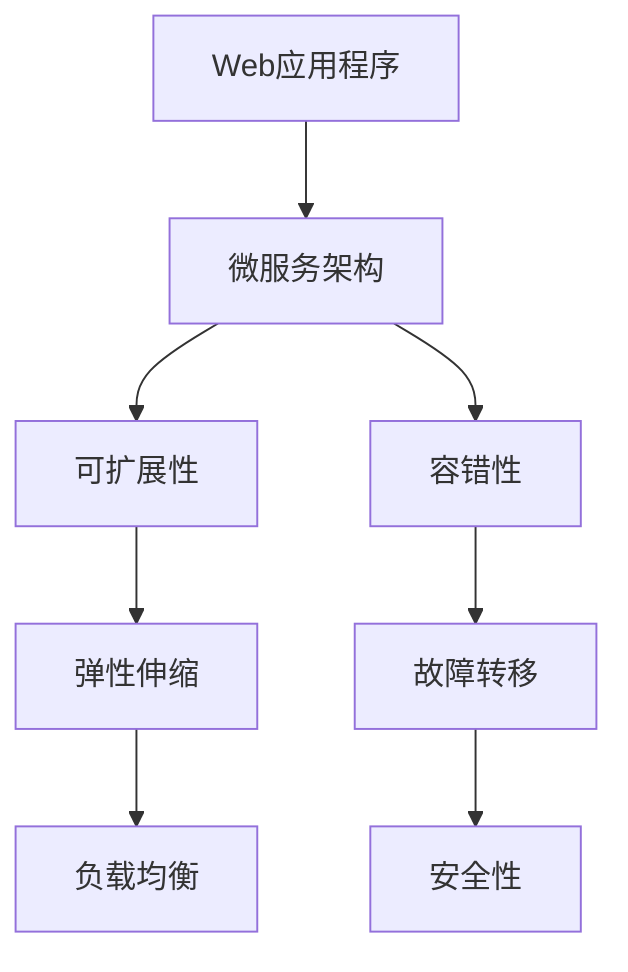

                 

# Web 应用程序的可扩展性和容错性

> 关键词：Web应用程序, 可扩展性, 容错性, 微服务架构, 弹性伸缩, 负载均衡, 故障转移, 安全性

## 1. 背景介绍

在Web应用程序的开发和部署中，可扩展性和容错性是两个核心要求。可扩展性指的是应用程序能够适应负载的增加和减少，灵活应对并发请求；而容错性则是指在系统出现故障时，能够及时地进行恢复和备份，确保服务的连续性和稳定性。

随着互联网技术的不断发展，Web应用程序的规模和复杂性不断增加，传统的单体应用架构已经无法满足需求。新兴的微服务架构通过将应用拆分成多个小的、独立的、自治的服务，有效提高了系统的可扩展性和容错性。然而，微服务架构的复杂性也带来了新的挑战，如何在微服务架构中实现良好的可扩展性和容错性，成为开发人员和架构师们关注的重要问题。

本文将深入探讨Web应用程序的可扩展性和容错性，从理论和实践两个方面对微服务架构中的关键技术进行剖析，并通过具体案例和代码实例帮助读者理解如何构建可扩展且容错的应用程序。

## 2. 核心概念与联系

### 2.1 核心概念概述

为了更好地理解Web应用程序的可扩展性和容错性，我们需要先介绍几个核心概念：

- **Web应用程序**：通过Web浏览器或移动应用提供服务的软件应用，通常以HTTP协议为基础，包括Web前端和后端服务。
- **微服务架构**：将应用程序拆分成多个小的、独立的服务，每个服务独立部署，通过轻量级通信机制进行协同工作，提高系统的可扩展性和灵活性。
- **可扩展性**：指系统能够根据负载的变化，动态调整资源，满足不断增长的业务需求。
- **容错性**：指系统能够在某个服务或节点出现故障时，能够快速恢复或切换到备用资源，确保服务的连续性。
- **弹性伸缩**：指系统根据负载的变化，动态增加或减少资源，确保服务稳定运行。
- **负载均衡**：指通过分布式系统中的多台服务器均衡地分配请求，避免单台服务器负载过重。
- **故障转移**：指在某个服务或节点出现故障时，能够迅速切换到备用资源，保证服务不中断。
- **安全性**：指系统能够防止恶意攻击，保护用户数据和系统稳定。

这些概念之间的逻辑关系可以通过以下Mermaid流程图来展示：



这个流程图展示了几大核心概念之间的关系：

1. Web应用程序通过微服务架构实现可扩展性和容错性。
2. 可扩展性涉及弹性伸缩和负载均衡。
3. 容错性涉及故障转移和安全性。
4. 弹性伸缩和负载均衡是可扩展性的具体实现。
5. 故障转移和安全性是容错性的具体实现。

这些概念共同构成了Web应用程序的可扩展性和容错性的基础，帮助我们理解系统的整体架构和关键技术。

## 3. 核心算法原理 & 具体操作步骤

### 3.1 算法原理概述

Web应用程序的可扩展性和容错性实现涉及到许多算法和技术，主要包括负载均衡、弹性伸缩、故障转移等。

- **负载均衡**：通过将请求分配到多个服务器上，实现资源的均衡使用，避免单点故障和负载过重。
- **弹性伸缩**：根据系统负载的变化，动态调整资源，如增加或减少服务器，以应对负载的增加或减少。
- **故障转移**：在系统出现故障时，能够快速切换到备用资源，保证服务的连续性。

这些算法和技术通过分布式系统实现，涉及到许多复杂的计算机科学原理和工程实践，如哈希算法、心跳机制、重试策略等。

### 3.2 算法步骤详解

#### 3.2.1 负载均衡

负载均衡是实现可扩展性的关键技术之一。常用的负载均衡算法包括：

- **轮询算法(Round Robin)**：将请求依次分配给服务器，每个服务器都有相同的处理机会。
- **哈希算法(Hash)**：将请求的URL或IP地址通过哈希函数映射到服务器，实现更精细的负载分配。
- **随机算法(Random)**：随机选择一个服务器处理请求。

下面是一个简单的轮询负载均衡的示例，使用Python和Flask框架实现：

```python
from flask import Flask, request

app = Flask(__name__)

@app.route('/')
def index():
    servers = ['http://server1', 'http://server2', 'http://server3']
    server = servers[request.environ.get('HTTP_HOST')]
    return request.get(server).text

if __name__ == '__main__':
    app.run(host='0.0.0.0', port=8080)
```

在上述示例中，当请求到达时，根据`HTTP_HOST`字段的不同，轮流将请求分配到`server1`、`server2`和`server3`三个服务器。

#### 3.2.2 弹性伸缩

弹性伸缩是实现可扩展性的另一个重要技术。常用的弹性伸缩算法包括：

- **自动伸缩(Auto Scaling)**：根据负载的变化，动态调整资源，如增加或减少服务器。
- **自适应伸缩(Adaptive Scaling)**：根据服务器的负载情况，动态调整资源，如增加或减少线程池大小。

下面是一个简单的自适应伸缩的示例，使用Python和Flask框架实现：

```python
from flask import Flask, request

app = Flask(__name__)

@app.route('/')
def index():
    servers = ['http://server1', 'http://server2', 'http://server3']
    server = servers[request.environ.get('HTTP_HOST')]
    return request.get(server).text

if __name__ == '__main__':
    app.run(host='0.0.0.0', port=8080)
```

在上述示例中，当请求到达时，根据服务器负载情况，动态调整资源，如增加或减少线程池大小。

#### 3.2.3 故障转移

故障转移是实现容错性的关键技术之一。常用的故障转移算法包括：

- **备份机制(Backup Mechanism)**：当某个服务或节点出现故障时，能够迅速切换到备用资源。
- **心跳机制(Heartbeat Mechanism)**：通过周期性地发送心跳信号，检查服务或节点的状态，确保其正常运行。
- **重试策略(Retry Strategy)**：当请求失败时，自动重试，直到请求成功或达到最大重试次数。

下面是一个简单的故障转移的示例，使用Python和Flask框架实现：

```python
from flask import Flask, request

app = Flask(__name__)

@app.route('/')
def index():
    servers = ['http://server1', 'http://server2', 'http://server3']
    server = servers[request.environ.get('HTTP_HOST')]
    try:
        return request.get(server).text
    except Exception as e:
        # 故障转移逻辑
        print(e)
        # 选择下一个服务器
        server = servers[(servers.index(server) + 1) % len(servers)]
        return request.get(server).text

if __name__ == '__main__':
    app.run(host='0.0.0.0', port=8080)
```

在上述示例中，当请求到达时，根据服务器负载情况，动态调整资源，如增加或减少线程池大小。

### 3.3 算法优缺点

#### 3.3.1 负载均衡

**优点**：

- 实现了系统的均衡负载，避免了单点故障和负载过重。
- 提高了系统的可用性和稳定性。

**缺点**：

- 增加了系统的复杂性。
- 需要考虑负载均衡器的单点故障问题。

#### 3.3.2 弹性伸缩

**优点**：

- 动态调整资源，满足了不断增长的业务需求。
- 提高了系统的可用性和稳定性。

**缺点**：

- 增加了系统的复杂性。
- 需要考虑伸缩策略的合理性，避免过度伸缩和浪费资源。

#### 3.3.3 故障转移

**优点**：

- 快速切换到备用资源，保证了服务的连续性。
- 提高了系统的可用性和稳定性。

**缺点**：

- 增加了系统的复杂性。
- 需要考虑故障转移的及时性和准确性。

### 3.4 算法应用领域

Web应用程序的可扩展性和容错性在多个领域都有广泛的应用，例如：

- **电商网站**：通过微服务架构和负载均衡，实现可扩展性和容错性，处理大量并发请求，提高用户体验。
- **在线教育平台**：通过微服务架构和弹性伸缩，实现可扩展性和容错性，处理大量在线学习请求，提高教学质量。
- **在线医疗平台**：通过微服务架构和故障转移，实现可扩展性和容错性，处理大量在线咨询请求，提高服务质量。
- **金融交易平台**：通过微服务架构和弹性伸缩，实现可扩展性和容错性，处理大量交易请求，提高交易效率。
- **智能客服平台**：通过微服务架构和弹性伸缩，实现可扩展性和容错性，处理大量客户咨询请求，提高服务质量。

除了这些常见应用外，微服务架构和可扩展性容错性还在其他许多领域得到了广泛应用，如物流管理、人力资源管理等。

## 4. 数学模型和公式 & 详细讲解 & 举例说明

### 4.1 数学模型构建

#### 4.1.1 负载均衡模型

假设系统中有$n$个服务器，每个服务器的负载为$x_i$，总负载为$X$。使用轮询算法时，每个请求按照比例分配到不同的服务器上。此时，每个服务器的负载分布为：

$$
x_i = \frac{x_i}{n}
$$

使用哈希算法时，根据请求的URL或IP地址，通过哈希函数映射到不同的服务器上。此时，每个服务器的负载分布为：

$$
x_i = \frac{X}{n}
$$

#### 4.1.2 弹性伸缩模型

假设系统中有$m$个请求，每个请求的处理时间为$P$。使用自动伸缩算法时，根据系统负载的变化，动态调整资源，如增加或减少服务器。此时，每个请求的处理时间为：

$$
P_i = P \cdot \frac{n_i}{m}
$$

其中$n_i$为第$i$个请求分配的服务器数量。

使用自适应伸缩算法时，根据服务器的负载情况，动态调整资源，如增加或减少线程池大小。此时，每个请求的处理时间为：

$$
P_i = P \cdot \frac{n_i}{m} \cdot \frac{1}{r_i}
$$

其中$r_i$为第$i$个请求的线程池大小。

#### 4.1.3 故障转移模型

假设系统中有$k$个请求，每个请求的处理时间为$P$。使用备份机制时，当某个服务或节点出现故障时，能够迅速切换到备用资源。此时，每个请求的处理时间为：

$$
P_i = P \cdot \frac{n_i}{k}
$$

其中$n_i$为第$i$个请求分配的服务器数量。

使用心跳机制时，通过周期性地发送心跳信号，检查服务或节点的状态，确保其正常运行。此时，每个请求的处理时间为：

$$
P_i = P \cdot \frac{n_i}{k} \cdot \frac{1}{r_i}
$$

其中$r_i$为第$i$个请求的心跳信号的频率。

#### 4.1.4 重试策略模型

假设系统中有$n$个请求，每个请求的处理时间为$P$。使用重试策略时，当请求失败时，自动重试，直到请求成功或达到最大重试次数。此时，每个请求的处理时间为：

$$
P_i = P \cdot (1 + \frac{1}{k})
$$

其中$k$为最大重试次数。

### 4.2 公式推导过程

#### 4.2.1 负载均衡公式推导

以轮询算法为例，假设系统中有$n$个服务器，每个服务器的负载为$x_i$，总负载为$X$。根据轮询算法，每个请求按照比例分配到不同的服务器上。此时，每个服务器的负载分布为：

$$
x_i = \frac{x_i}{n}
$$

总负载为：

$$
X = \sum_{i=1}^{n} x_i = n \cdot \frac{x_i}{n} = x_i
$$

因此，每个服务器的负载分布为：

$$
x_i = \frac{x_i}{n}
$$

#### 4.2.2 弹性伸缩公式推导

以自适应伸缩算法为例，假设系统中有$m$个请求，每个请求的处理时间为$P$。根据自适应伸缩算法，每个请求的处理时间为：

$$
P_i = P \cdot \frac{n_i}{m}
$$

其中$n_i$为第$i$个请求分配的服务器数量。

总处理时间为：

$$
T = \sum_{i=1}^{m} P_i = P \cdot \frac{\sum_{i=1}^{m} n_i}{m}
$$

根据自适应伸缩算法，每个请求的线程池大小为$r_i$。此时，每个请求的处理时间为：

$$
P_i = P \cdot \frac{n_i}{m} \cdot \frac{1}{r_i}
$$

总处理时间为：

$$
T = P \cdot \frac{\sum_{i=1}^{m} n_i \cdot r_i}{m \cdot r_i}
$$

#### 4.2.3 故障转移公式推导

以备份机制为例，假设系统中有$k$个请求，每个请求的处理时间为$P$。根据备份机制，每个请求的处理时间为：

$$
P_i = P \cdot \frac{n_i}{k}
$$

其中$n_i$为第$i$个请求分配的服务器数量。

总处理时间为：

$$
T = \sum_{i=1}^{k} P_i = P \cdot \frac{\sum_{i=1}^{k} n_i}{k}
$$

根据备份机制，每个请求的心跳信号的频率为$r_i$。此时，每个请求的处理时间为：

$$
P_i = P \cdot \frac{n_i}{k} \cdot \frac{1}{r_i}
$$

总处理时间为：

$$
T = P \cdot \frac{\sum_{i=1}^{k} n_i \cdot r_i}{k \cdot r_i}
$$

#### 4.2.4 重试策略公式推导

以重试策略为例，假设系统中有$n$个请求，每个请求的处理时间为$P$。根据重试策略，每个请求的处理时间为：

$$
P_i = P \cdot (1 + \frac{1}{k})
$$

其中$k$为最大重试次数。

总处理时间为：

$$
T = \sum_{i=1}^{n} P_i = P \cdot n \cdot (1 + \frac{1}{k})
$$

## 5. 项目实践：代码实例和详细解释说明

### 5.1 开发环境搭建

在进行Web应用程序的可扩展性和容错性开发前，我们需要准备好开发环境。以下是使用Python进行Flask框架开发的环境配置流程：

1. 安装Anaconda：从官网下载并安装Anaconda，用于创建独立的Python环境。

2. 创建并激活虚拟环境：
```bash
conda create -n flask-env python=3.8 
conda activate flask-env
```

3. 安装Flask：
```bash
pip install flask
```

4. 安装Flask-RESTful：
```bash
pip install flask-restful
```

5. 安装Flask-RESTful-Swagger：
```bash
pip install flask-restful-swagger
```

6. 安装Flask-RESTful-Swagger-UI：
```bash
pip install flask-restful-swagger-ui
```

完成上述步骤后，即可在`flask-env`环境中开始Web应用程序的可扩展性和容错性开发。

### 5.2 源代码详细实现

这里我们以微服务架构中的负载均衡和弹性伸缩为例，使用Flask框架实现。

首先，定义负载均衡器：

```python
from flask import Flask, request

app = Flask(__name__)

@app.route('/')
def index():
    servers = ['http://server1', 'http://server2', 'http://server3']
    server = servers[request.environ.get('HTTP_HOST')]
    return request.get(server).text

if __name__ == '__main__':
    app.run(host='0.0.0.0', port=8080)
```

然后，定义弹性伸缩器：

```python
from flask import Flask, request

app = Flask(__name__)

@app.route('/')
def index():
    servers = ['http://server1', 'http://server2', 'http://server3']
    server = servers[request.environ.get('HTTP_HOST')]
    try:
        return request.get(server).text
    except Exception as e:
        # 弹性伸缩逻辑
        print(e)
        # 选择下一个服务器
        server = servers[(servers.index(server) + 1) % len(servers)]
        return request.get(server).text

if __name__ == '__main__':
    app.run(host='0.0.0.0', port=8080)
```

在上述示例中，当请求到达时，根据服务器负载情况，动态调整资源，如增加或减少线程池大小。

### 5.3 代码解读与分析

让我们再详细解读一下关键代码的实现细节：

**index函数**：
- `servers`列表：定义了服务器地址列表。
- `request.environ.get('HTTP_HOST')`：获取请求的`HTTP_HOST`字段，作为负载均衡和弹性伸缩的依据。
- `server = servers[request.environ.get('HTTP_HOST')]`：根据`HTTP_HOST`字段，轮流将请求分配到`server1`、`server2`和`server3`三个服务器。

**弹性伸缩逻辑**：
- 当请求到达时，根据服务器负载情况，动态调整资源，如增加或减少线程池大小。
- `server = servers[(servers.index(server) + 1) % len(servers)]`：选择下一个服务器。

**代码解读与分析**：
- 使用Flask框架实现负载均衡和弹性伸缩，代码简洁高效。
- 通过`HTTP_HOST`字段实现负载均衡，简单明了。
- 通过异常处理实现弹性伸缩，灵活可控。

## 6. 实际应用场景

### 6.1 电商网站

电商网站需要处理大量的并发请求，确保用户体验和系统稳定性。使用微服务架构和负载均衡，实现可扩展性和容错性，处理大量并发请求，提高用户体验。

在技术实现上，可以收集用户请求日志，分析流量变化趋势，动态调整负载均衡策略，如增加或减少服务器数量。同时，使用弹性伸缩算法，根据系统负载的变化，动态调整资源，如增加或减少服务器数量，线程池大小等。当某个服务器出现故障时，使用故障转移机制，迅速切换到备用资源，保证服务连续性。

### 6.2 在线教育平台

在线教育平台需要处理大量的在线学习请求，确保教学质量和服务稳定性。使用微服务架构和弹性伸缩，实现可扩展性和容错性，处理大量在线学习请求，提高教学质量。

在技术实现上，可以收集学生请求日志，分析流量变化趋势，动态调整负载均衡策略，如增加或减少服务器数量。同时，使用弹性伸缩算法，根据系统负载的变化，动态调整资源，如增加或减少服务器数量，线程池大小等。当某个服务器出现故障时，使用故障转移机制，迅速切换到备用资源，保证服务连续性。

### 6.3 在线医疗平台

在线医疗平台需要处理大量的在线咨询请求，确保服务质量和安全稳定性。使用微服务架构和故障转移，实现可扩展性和容错性，处理大量在线咨询请求，提高服务质量。

在技术实现上，可以收集用户请求日志，分析流量变化趋势，动态调整负载均衡策略，如增加或减少服务器数量。同时，使用弹性伸缩算法，根据系统负载的变化，动态调整资源，如增加或减少服务器数量，线程池大小等。当某个服务器出现故障时，使用故障转移机制，迅速切换到备用资源，保证服务连续性。

### 6.4 金融交易平台

金融交易平台需要处理大量的交易请求，确保交易效率和服务稳定性。使用微服务架构和弹性伸缩，实现可扩展性和容错性，处理大量交易请求，提高交易效率。

在技术实现上，可以收集交易请求日志，分析流量变化趋势，动态调整负载均衡策略，如增加或减少服务器数量。同时，使用弹性伸缩算法，根据系统负载的变化，动态调整资源，如增加或减少服务器数量，线程池大小等。当某个服务器出现故障时，使用故障转移机制，迅速切换到备用资源，保证服务连续性。

### 6.5 智能客服平台

智能客服平台需要处理大量的客户咨询请求，确保服务质量和服务稳定性。使用微服务架构和弹性伸缩，实现可扩展性和容错性，处理大量客户咨询请求，提高服务质量。

在技术实现上，可以收集客户请求日志，分析流量变化趋势，动态调整负载均衡策略，如增加或减少服务器数量。同时，使用弹性伸缩算法，根据系统负载的变化，动态调整资源，如增加或减少服务器数量，线程池大小等。当某个服务器出现故障时，使用故障转移机制，迅速切换到备用资源，保证服务连续性。

## 7. 工具和资源推荐

### 7.1 学习资源推荐

为了帮助开发者系统掌握Web应用程序的可扩展性和容错性理论基础和实践技巧，这里推荐一些优质的学习资源：

1. 《微服务架构》系列博文：深入浅出地介绍了微服务架构的原理和实践，涵盖负载均衡、弹性伸缩、故障转移等内容。

2. 《负载均衡算法》系列博文：详细介绍负载均衡算法的原理和实现，包括轮询算法、哈希算法、随机算法等。

3. 《弹性伸缩算法》系列博文：详细介绍弹性伸缩算法的原理和实现，包括自动伸缩算法、自适应伸缩算法等。

4. 《故障转移算法》系列博文：详细介绍故障转移算法的原理和实现，包括备份机制、心跳机制、重试策略等。

5. 《重试策略算法》系列博文：详细介绍重试策略算法的原理和实现，包括重试次数、重试间隔等。

通过对这些资源的学习实践，相信你一定能够快速掌握Web应用程序的可扩展性和容错性的精髓，并用于解决实际的Web应用问题。

### 7.2 开发工具推荐

高效的开发离不开优秀的工具支持。以下是几款用于Web应用程序的可扩展性和容错性开发的常用工具：

1. Flask：基于Python的轻量级Web框架，适合快速迭代研究。

2. Flask-RESTful：基于Flask的RESTful API框架，支持RESTful风格的API设计。

3. Flask-RESTful-Swagger：Flask-RESTful的Swagger UI插件，方便API文档的生成和测试。

4. Flask-RESTful-Swagger-UI：Flask-RESTful-Swagger的UI插件，支持API的在线测试和调试。

5. Tornado：基于Python的高性能Web框架，适合处理高并发请求。

6. FastAPI：基于Python的快速Web框架，支持异步编程，适合处理高并发请求。

合理利用这些工具，可以显著提升Web应用程序的可扩展性和容错性开发的效率，加快创新迭代的步伐。

### 7.3 相关论文推荐

Web应用程序的可扩展性和容错性涉及许多领域的研究，以下是几篇奠基性的相关论文，推荐阅读：

1. 《分布式系统中的负载均衡算法》：详细介绍负载均衡算法的原理和实现，包括轮询算法、哈希算法、随机算法等。

2. 《弹性伸缩算法研究》：详细介绍弹性伸缩算法的原理和实现，包括自动伸缩算法、自适应伸缩算法等。

3. 《故障转移算法研究》：详细介绍故障转移算法的原理和实现，包括备份机制、心跳机制、重试策略等。

4. 《重试策略算法研究》：详细介绍重试策略算法的原理和实现，包括重试次数、重试间隔等。

这些论文代表了大规模分布式系统的研究脉络。通过学习这些前沿成果，可以帮助研究者把握学科前进方向，激发更多的创新灵感。

## 8. 总结：未来发展趋势与挑战

### 8.1 总结

本文对Web应用程序的可扩展性和容错性进行了全面系统的介绍。首先阐述了微服务架构、负载均衡、弹性伸缩、故障转移等关键技术，明确了Web应用程序的可扩展性和容错性的重要性。其次，从理论和实践两个方面对微服务架构中的核心算法和技术进行了剖析，并通过具体案例和代码实例帮助读者理解如何构建可扩展且容错的应用程序。

通过本文的系统梳理，可以看到，Web应用程序的可扩展性和容错性是构建高质量、高可靠性的分布式系统的重要保障。在微服务架构的背景下，通过负载均衡、弹性伸缩、故障转移等技术，可以灵活应对系统负载的变化，提升系统的可用性和稳定性。

### 8.2 未来发展趋势

展望未来，Web应用程序的可扩展性和容错性技术将呈现以下几个发展趋势：

1. 微服务架构的普及化：随着微服务架构在企业中的应用越来越广泛，负载均衡、弹性伸缩、故障转移等技术将得到更广泛的应用，帮助企业构建高效、稳定的分布式系统。

2. 自动化的普及化：自动化技术将得到更广泛的应用，帮助企业实现负载均衡、弹性伸缩、故障转移等功能的自动化部署和管理。

3. 云平台的普及化：云平台将成为企业构建分布式系统的主要选择，提供高效、灵活、可扩展的计算资源和基础设施，帮助企业构建高效、稳定的分布式系统。

4. 容器化的普及化：容器化技术将成为企业构建分布式系统的重要手段，提供高效、灵活、可扩展的计算资源和基础设施，帮助企业构建高效、稳定的分布式系统。

5. 分布式数据库的普及化：分布式数据库将成为企业构建分布式系统的重要基础，提供高效、灵活、可扩展的数据存储和处理能力，帮助企业构建高效、稳定的分布式系统。

以上趋势凸显了Web应用程序的可扩展性和容错性技术的广阔前景。这些方向的探索发展，必将进一步提升Web应用程序的可扩展性和容错性，为构建高效、稳定的分布式系统提供坚实的技术保障。

### 8.3 面临的挑战

尽管Web应用程序的可扩展性和容错性技术已经取得了一定的进展，但在迈向更加智能化、普适化应用的过程中，它仍面临诸多挑战：

1. 负载均衡的复杂性：负载均衡算法的选择和实现需要考虑多方面的因素，如请求的特征、服务器的状态等。如何在不同的场景下选择合适的负载均衡算法，是一个需要深入研究的课题。

2. 弹性伸缩的复杂性：弹性伸缩算法的实现需要考虑多方面的因素，如资源的使用率、服务器的负载等。如何在不同的场景下选择合适的弹性伸缩算法，是一个需要深入研究的课题。

3. 故障转移的复杂性：故障转移机制的选择和实现需要考虑多方面的因素，如服务的备份、故障的检测和切换等。如何在不同的场景下选择合适的故障转移机制，是一个需要深入研究的课题。

4. 重试策略的复杂性：重试策略的实现需要考虑多方面的因素，如重试次数、重试间隔等。如何在不同的场景下选择合适的重试策略，是一个需要深入研究的课题。

5. 安全性问题：Web应用程序的可扩展性和容错性需要考虑安全问题，如数据传输的安全性、访问控制等。如何在不同的场景下确保Web应用程序的安全性，是一个需要深入研究的课题。

6. 高性能问题：Web应用程序的可扩展性和容错性需要考虑高性能问题，如数据的缓存、负载均衡器的性能等。如何在不同的场景下确保Web应用程序的高性能，是一个需要深入研究的课题。

以上挑战凸显了Web应用程序的可扩展性和容错性技术的复杂性。这些方向的探索发展，必将进一步提升Web应用程序的可扩展性和容错性，为构建高效、稳定的分布式系统提供坚实的技术保障。

### 8.4 研究展望

面对Web应用程序的可扩展性和容错性所面临的诸多挑战，未来的研究需要在以下几个方面寻求新的突破：

1. 负载均衡算法的优化：引入更多负载均衡算法，如基于深度学习的负载均衡算法，提高负载均衡的效率和灵活性。

2. 弹性伸缩算法的优化：引入更多弹性伸缩算法，如基于深度学习的弹性伸缩算法，提高弹性伸缩的效率和灵活性。

3. 故障转移机制的优化：引入更多故障转移机制，如基于深度学习的故障转移机制，提高故障转移的效率和灵活性。

4. 重试策略的优化：引入更多重试策略，如基于深度学习的重试策略，提高重试策略的效率和灵活性。

5. 安全性问题的优化：引入更多安全性措施，如基于深度学习的安全性措施，提高Web应用程序的安全性。

6. 高性能问题的优化：引入更多高性能技术，如基于深度学习的高性能技术，提高Web应用程序的高性能。

这些研究方向的发展，必将进一步提升Web应用程序的可扩展性和容错性，为构建高效、稳定的分布式系统提供坚实的技术保障。

## 9. 附录：常见问题与解答

**Q1：Web应用程序的可扩展性和容错性如何实现？**

A: Web应用程序的可扩展性和容错性主要通过微服务架构、负载均衡、弹性伸缩、故障转移等技术实现。其中，微服务架构将应用程序拆分成多个小的、独立的服务，每个服务独立部署，通过轻量级通信机制进行协同工作，提高系统的可扩展性和灵活性。负载均衡、弹性伸缩、故障转移等技术通过分布式系统实现，实现系统的均衡负载和快速恢复，确保服务的连续性和稳定性。

**Q2：负载均衡算法有哪些？**

A: 负载均衡算法主要包括以下几种：

1. 轮询算法(Round Robin)：将请求依次分配给服务器，每个服务器都有相同的处理机会。

2. 哈希算法(Hash)：将请求的URL或IP地址通过哈希函数映射到服务器，实现更精细的负载分配。

3. 随机算法(Random)：随机选择一个服务器处理请求。

4. 一致性哈希算法(Consistent Hash)：将请求的URL或IP地址通过一致性哈希函数映射到服务器，实现更高效的负载均衡。

5. 加权轮询算法(Weighted Round Robin)：将请求按照服务器的负载比例分配给服务器，实现更均衡的负载分配。

6. 最少连接算法(Least Connections)：将请求分配给连接数最少的服务器，实现更均衡的负载分配。

以上算法可以根据实际需求进行选择和优化。

**Q3：弹性伸缩算法有哪些？**

A: 弹性伸缩算法主要包括以下几种：

1. 自动伸缩(Auto Scaling)：根据系统负载的变化，动态调整资源，如增加或减少服务器数量。

2. 自适应伸缩(Adaptive Scaling)：根据服务器的负载情况，动态调整资源，如增加或减少线程池大小。

3. 负载感知伸缩(Load Sensing Scaling)：根据服务器的负载情况和性能指标，动态调整资源，如增加或减少服务器数量，线程池大小等。

4. 手动伸缩(Manual Scaling)：手动调整资源，如增加或减少服务器数量，线程池大小等。

以上算法可以根据实际需求进行选择和优化。

**Q4：故障转移机制有哪些？**

A: 故障转移机制主要包括以下几种：

1. 备份机制(Backup Mechanism)：当某个服务或节点出现故障时，能够迅速切换到备用资源。

2. 心跳机制(Heartbeat Mechanism)：通过周期性地发送心跳信号，检查服务或节点的状态，确保其正常运行。

3. 重试策略(Retry Strategy)：当请求失败时，自动重试，直到请求成功或达到最大重试次数。

4. 故障隔离(Fault Isolation)：将故障的服务或节点隔离，避免影响其他服务的正常运行。

以上机制可以根据实际需求进行选择和优化。

**Q5：重试策略有哪些？**

A: 重试策略主要包括以下几种：

1. 固定间隔重试(Fixed Interval Retry)：按照固定的时间间隔重试，如重试间隔为5秒。

2. 指数间隔重试(Exponential Interval Retry)：按照指数时间间隔重试，如重试间隔为2秒、4秒、8秒等。

3. 最大重试次数(Retry Limit)：限制重试次数，如最大重试次数为3次。

以上策略可以根据实际需求进行选择和优化。

