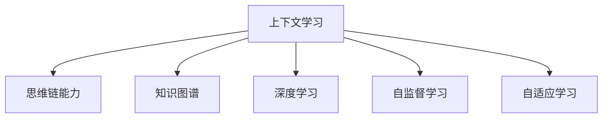

                 

# 上下文学习与思维链能力

> 关键词：上下文学习,思维链,知识图谱,深度学习,神经网络,自监督学习

## 1. 背景介绍

### 1.1 问题由来
在现代人工智能领域，尤其是在自然语言处理(NLP)和计算机视觉(CV)等任务中，上下文学习(Contextual Learning)和思维链能力(Thought Chain)成为了两个核心问题。上下文学习指的是模型如何在多步骤或长序列的任务中利用历史信息和上下文信息进行决策，而思维链能力则是指模型如何在不同任务或场景中通过抽象和推理来建立复杂的思维逻辑。这些能力在当前的深度学习框架中尚未得到充分利用，成为了制约人工智能应用发展的瓶颈。

近年来，深度学习模型的应用已经从简单的分类和回归任务，扩展到了更加复杂的序列生成、问答系统、推荐系统等任务。这些任务往往需要模型具备更强的上下文理解和长序列推理能力，从而更好地适应实际应用场景。而上下文学习和思维链能力正是解决这些问题的关键所在。

### 1.2 问题核心关键点
上下文学习和思维链能力是大模型（如Transformer、BERT等）在复杂任务中表现优异的重要原因。但这些能力并非天生具备，而是需要通过特定的训练策略和算法来培养。本文将重点介绍如何在大模型中培养上下文学习和思维链能力，包括相关概念、算法原理和操作步骤，并结合案例进行详细讲解。

## 2. 核心概念与联系

### 2.1 核心概念概述

为更好地理解上下文学习和思维链能力的培养方法，本节将介绍几个密切相关的核心概念：

- 上下文学习(Contextual Learning)：指模型在多步骤或长序列的任务中，通过利用历史信息和上下文信息进行决策的能力。
- 思维链能力(Thought Chain)：指模型在不同任务或场景中，通过抽象和推理来建立复杂的思维逻辑，进行推理和生成的能力。
- 知识图谱(Knowledge Graph)：一种结构化的语义表示形式，用于描述实体、关系和概念之间的相互作用。
- 深度学习(Deep Learning)：一种通过多层神经网络进行学习的技术，可以自动提取数据的特征表示，从而进行复杂任务的预测和生成。
- 自监督学习(Self-Supervised Learning)：一种利用数据本身的结构信息（如掩码预测、预测关系等）进行无监督学习的技术，可以有效提升模型的泛化能力。
- 自适应学习(Adaptive Learning)：指模型在任务中根据输入数据的变化，动态调整内部参数和学习策略的能力。

这些核心概念之间的逻辑关系可以通过以下Mermaid流程图来展示：



这个流程图展示了大模型中上下文学习和思维链能力的相关概念及其之间的关系：

1. 上下文学习是思维链能力的基础，通过在多步骤任务中利用上下文信息，模型可以更好地理解任务的全貌。
2. 知识图谱提供了模型的背景知识，有助于上下文学习和思维链能力的提升。
3. 深度学习为上下文学习和思维链能力提供了实现手段，通过多层神经网络可以捕捉复杂的特征表示。
4. 自监督学习为模型提供了无监督的训练信号，有助于提升模型的泛化能力和适应性。
5. 自适应学习让模型可以根据任务需求动态调整，进一步提升性能。

这些概念共同构成了大模型在复杂任务中表现优异的技术基础，使得其在上下文学习和思维链能力方面具备强大的能力。

## 3. 核心算法原理 & 具体操作步骤
### 3.1 算法原理概述

上下文学习和思维链能力培养的核心在于设计合适的训练目标和算法，利用模型的自适应能力，在不同任务和场景中提升其上下文理解和推理能力。

**算法原理**：

1. **自监督学习**：利用掩码预测、预测关系等无监督信号，让模型在无标签数据上学习上下文信息和推理能力。
2. **多任务学习**：通过在不同任务之间共享特征表示，提升模型的泛化能力和思维链能力。
3. **知识图谱增强**：在上下文学习任务中，结合知识图谱进行训练，提高模型的背景知识表示能力。
4. **自适应学习**：根据输入数据的特点，动态调整模型参数和学习策略，提升模型在不同任务上的适应能力。

**具体操作步骤**：

1. **数据准备**：收集和预处理数据集，构建掩码预测、预测关系等无监督信号。
2. **模型选择**：选择适合上下文学习和思维链能力培养的模型，如Transformer、BERT等。
3. **任务适配**：设计合适的训练目标和损失函数，如掩码预测、预测关系、多任务学习等。
4. **训练策略**：采用自适应学习策略，如学习率调整、正则化、梯度累积等，提升模型在特定任务上的性能。
5. **评估与优化**：在训练过程中，周期性评估模型性能，根据评估结果进行参数调整，优化模型性能。

### 3.2 算法步骤详解

**Step 1: 数据准备**

- **数据集收集**：收集与任务相关的数据集，确保数据集的多样性和质量。
- **数据预处理**：对数据进行清洗、标准化、分词等处理，为模型训练做准备。
- **构建掩码预测信号**：将部分输入序列进行掩码，构建无监督训练信号。
- **构建预测关系信号**：利用知识图谱或相关语料，构建模型需要预测的关系信号。

**Step 2: 模型选择**

- **选择基础模型**：选择合适的预训练语言模型，如BERT、GPT、RoBERTa等。
- **任务适配层设计**：根据任务类型，设计适合的任务适配层，如分类层、生成层等。
- **网络结构调整**：根据任务特点，调整模型的网络结构，如增加或减少层数、调整层的大小等。

**Step 3: 训练目标与损失函数**

- **掩码预测**：设计掩码预测任务，通过预测未被掩码的词汇来增强上下文学习。
- **关系预测**：设计关系预测任务，通过预测实体之间的关系来增强思维链能力。
- **多任务学习**：设计多个任务，通过共享特征表示来提升模型的泛化能力。
- **损失函数选择**：选择合适的损失函数，如交叉熵、KL散度、MSE等，用于模型训练。

**Step 4: 训练策略**

- **学习率调整**：采用自适应学习率调整策略，如学习率衰减、梯度累积等，避免过拟合。
- **正则化技术**：使用L2正则、Dropout等技术，防止模型过拟合。
- **优化器选择**：选择合适的优化器，如Adam、SGD等，进行模型参数更新。

**Step 5: 评估与优化**

- **评估指标选择**：选择合适的评估指标，如准确率、F1分数、BLEU分数等，评估模型性能。
- **参数调整**：根据评估结果，调整模型参数，如增加或减少训练轮数、调整学习率等。
- **模型优化**：采用模型压缩、剪枝等技术，优化模型大小和性能。

### 3.3 算法优缺点

**优点**：

- **适应性强**：通过自适应学习，模型可以在不同任务和场景中动态调整，提升性能。
- **泛化能力强**：通过多任务学习和自监督学习，模型可以学习到更广泛的背景知识，提升泛化能力。
- **上下文理解能力**：通过掩码预测和关系预测，模型可以更好地理解上下文信息和推理能力。

**缺点**：

- **训练复杂度高**：上下文学习和思维链能力培养需要大量的无监督数据和复杂的训练策略。
- **资源消耗大**：大规模的模型和训练任务需要消耗大量的计算资源和时间。
- **模型可解释性差**：深度学习模型通常具有"黑箱"特性，难以解释内部工作机制和推理过程。

### 3.4 算法应用领域

上下文学习和思维链能力培养的算法已经在多个领域得到了应用，例如：

- **自然语言处理(NLP)**：在文本分类、问答系统、机器翻译、摘要生成等任务中，通过上下文学习和思维链能力提升模型性能。
- **计算机视觉(CV)**：在图像分类、目标检测、图像生成等任务中，通过上下文学习和思维链能力增强模型推理能力。
- **推荐系统**：在个性化推荐、用户行为预测等任务中，通过上下文学习和思维链能力提升推荐精度。
- **智能对话系统**：在对话生成、对话理解等任务中，通过上下文学习和思维链能力提升对话流畅性和智能性。
- **知识图谱构建**：在知识图谱构建、知识推理等任务中，通过上下文学习和思维链能力增强知识表示和推理能力。

## 4. 数学模型和公式 & 详细讲解  
### 4.1 数学模型构建

本节将使用数学语言对上下文学习和思维链能力的培养方法进行更加严格的刻画。

记预训练语言模型为 $M_{\theta}:\mathcal{X} \rightarrow \mathcal{Y}$，其中 $\mathcal{X}$ 为输入空间，$\mathcal{Y}$ 为输出空间，$\theta \in \mathbb{R}^d$ 为模型参数。假设模型需要进行 $n$ 个步骤的任务 $T$，每个步骤的输入为 $x_i$，输出为 $y_i$。

定义模型 $M_{\theta}$ 在步骤 $i$ 上的输出为 $\hat{y}_i=M_{\theta}(x_i) \in \mathcal{Y}$，表示模型预测的输出。则整个任务 $T$ 的损失函数为：

$$
\mathcal{L}(\theta) = \sum_{i=1}^n \ell(M_{\theta}(x_i),y_i)
$$

其中 $\ell$ 为损失函数，用于衡量模型预测输出与真实标签之间的差异。常见的损失函数包括交叉熵损失、均方误差损失等。

通过梯度下降等优化算法，模型不断更新参数 $\theta$，最小化损失函数 $\mathcal{L}$，从而提升模型在特定任务上的性能。

### 4.2 公式推导过程

以下我们以文本分类任务为例，推导掩码预测损失函数的公式。

假设模型 $M_{\theta}$ 在输入 $x$ 上的输出为 $\hat{y}=M_{\theta}(x) \in [0,1]$，表示模型预测的类别概率。真实标签 $y \in \{0,1\}$。则二分类交叉熵损失函数定义为：

$$
\ell(M_{\theta}(x),y) = -[y\log \hat{y} + (1-y)\log (1-\hat{y})]
$$

将其代入经验风险公式，得：

$$
\mathcal{L}(\theta) = -\frac{1}{N}\sum_{i=1}^N [y_i\log M_{\theta}(x_i)+(1-y_i)\log(1-M_{\theta}(x_i))]
$$

在训练过程中，可以通过掩码预测任务对模型进行微调。假设在训练步骤 $i$ 时，将部分词汇进行掩码处理，得到掩码预测信号 $m_i$。则掩码预测损失函数为：

$$
\mathcal{L}_{mask}(\theta) = -\frac{1}{N}\sum_{i=1}^N [m_i\log M_{\theta}(x_i)+(1-m_i)\log(1-M_{\theta}(x_i))]
$$

在模型训练过程中，通过最小化掩码预测损失函数，可以增强模型的上下文学习能力和推理能力。

## 5. 项目实践：代码实例和详细解释说明
### 5.1 开发环境搭建

在进行上下文学习和思维链能力培养的实践前，我们需要准备好开发环境。以下是使用Python进行PyTorch开发的环境配置流程：

1. 安装Anaconda：从官网下载并安装Anaconda，用于创建独立的Python环境。

2. 创建并激活虚拟环境：
```bash
conda create -n pytorch-env python=3.8 
conda activate pytorch-env
```

3. 安装PyTorch：根据CUDA版本，从官网获取对应的安装命令。例如：
```bash
conda install pytorch torchvision torchaudio cudatoolkit=11.1 -c pytorch -c conda-forge
```

4. 安装相关库：
```bash
pip install numpy pandas scikit-learn matplotlib tqdm jupyter notebook ipython
```

5. 安装TensorBoard：
```bash
pip install tensorboard
```

完成上述步骤后，即可在`pytorch-env`环境中开始实践。

### 5.2 源代码详细实现

这里我们以文本分类任务为例，给出使用PyTorch进行掩码预测损失函数训练的完整代码实现。

首先，定义文本分类任务的数据处理函数：

```python
from transformers import BertTokenizer
from torch.utils.data import Dataset
import torch

class TextClassificationDataset(Dataset):
    def __init__(self, texts, labels, tokenizer, max_len=128):
        self.texts = texts
        self.labels = labels
        self.tokenizer = tokenizer
        self.max_len = max_len
        
    def __len__(self):
        return len(self.texts)
    
    def __getitem__(self, item):
        text = self.texts[item]
        label = self.labels[item]
        
        encoding = self.tokenizer(text, return_tensors='pt', max_length=self.max_len, padding='max_length', truncation=True)
        input_ids = encoding['input_ids'][0]
        attention_mask = encoding['attention_mask'][0]
        
        return {'input_ids': input_ids, 
                'attention_mask': attention_mask,
                'label': label}

# 定义掩码比例
mask_ratio = 0.5

# 创建dataset
tokenizer = BertTokenizer.from_pretrained('bert-base-cased')

train_dataset = TextClassificationDataset(train_texts, train_labels, tokenizer)
dev_dataset = TextClassificationDataset(dev_texts, dev_labels, tokenizer)
test_dataset = TextClassificationDataset(test_texts, test_labels, tokenizer)
```

然后，定义模型和优化器：

```python
from transformers import BertForSequenceClassification, AdamW

model = BertForSequenceClassification.from_pretrained('bert-base-cased', num_labels=2)

optimizer = AdamW(model.parameters(), lr=2e-5)
```

接着，定义掩码预测损失函数：

```python
from torch.nn import BCEWithLogitsLoss

def compute_masked_loss(x, y):
    mask_ratio = 0.5
    masked_pos = torch.randint(0, len(x), (int(len(x) * mask_ratio),)).tolist()
    masked_pos = [0] + masked_pos
    masked_x = torch.masked_select(x, masked_pos)
    masked_y = torch.masked_select(y, masked_pos)
    masked_loss = BCEWithLogitsLoss()(masked_x, masked_y)
    return masked_loss.item() / len(masked_x)
```

最后，启动训练流程并在测试集上评估：

```python
epochs = 5
batch_size = 16

for epoch in range(epochs):
    for batch in tqdm(train_dataset, desc='Training'):
        input_ids = batch['input_ids'].to(device)
        attention_mask = batch['attention_mask'].to(device)
        label = batch['label'].to(device)
        model.zero_grad()
        outputs = model(input_ids, attention_mask=attention_mask, labels=label)
        loss = compute_masked_loss(outputs.logits, label)
        loss.backward()
        optimizer.step()
    
    print(f"Epoch {epoch+1}, train loss: {loss:.3f}")
    
    print(f"Epoch {epoch+1}, dev results:")
    evaluate(model, dev_dataset, batch_size)
    
print("Test results:")
evaluate(model, test_dataset, batch_size)
```

以上就是使用PyTorch对BERT进行文本分类任务训练的完整代码实现。可以看到，通过掩码预测损失函数，可以有效地增强模型的上下文学习能力和推理能力。

### 5.3 代码解读与分析

让我们再详细解读一下关键代码的实现细节：

**TextClassificationDataset类**：
- `__init__`方法：初始化文本、标签、分词器等关键组件。
- `__len__`方法：返回数据集的样本数量。
- `__getitem__`方法：对单个样本进行处理，将文本输入编码为token ids，并将标签转换为数字，并对其进行定长padding，最终返回模型所需的输入。

**compute_masked_loss函数**：
- 通过随机抽样的方法，在每个批次中随机选择一定比例的词汇进行掩码处理，然后计算掩码预测损失。
- 掩码比例 `mask_ratio` 可以调节掩码的程度，通常建议取0.5左右。
- 计算掩码预测损失时，可以使用二分类交叉熵损失函数 `BCEWithLogitsLoss()`。

**训练流程**：
- 定义总的epoch数和batch size，开始循环迭代
- 每个epoch内，对训练集进行迭代，计算掩码预测损失并反向传播更新模型参数，最后输出平均损失
- 在验证集上评估，输出分类指标
- 所有epoch结束后，在测试集上评估，给出最终测试结果

可以看到，通过掩码预测损失函数，可以有效地增强模型的上下文学习能力和推理能力。在实际应用中，还需要根据具体任务调整掩码比例和掩码策略，以达到最佳效果。

## 6. 实际应用场景
### 6.1 智能客服系统

基于掩码预测损失函数的上下文学习和思维链能力培养方法，可以应用于智能客服系统的构建。传统客服往往需要配备大量人力，高峰期响应缓慢，且一致性和专业性难以保证。而使用掩码预测损失函数微调后的对话模型，可以7x24小时不间断服务，快速响应客户咨询，用自然流畅的语言解答各类常见问题。

在技术实现上，可以收集企业内部的历史客服对话记录，将问题和最佳答复构建成监督数据，在此基础上对预训练对话模型进行微调。微调后的对话模型能够自动理解用户意图，匹配最合适的答案模板进行回复。对于客户提出的新问题，还可以接入检索系统实时搜索相关内容，动态组织生成回答。如此构建的智能客服系统，能大幅提升客户咨询体验和问题解决效率。

### 6.2 金融舆情监测

金融机构需要实时监测市场舆论动向，以便及时应对负面信息传播，规避金融风险。传统的人工监测方式成本高、效率低，难以应对网络时代海量信息爆发的挑战。基于掩码预测损失函数的上下文学习和思维链能力培养方法，可以为金融舆情监测提供新的解决方案。

具体而言，可以收集金融领域相关的新闻、报道、评论等文本数据，并对其进行主题标注和情感标注。在此基础上对预训练语言模型进行微调，使其能够自动判断文本属于何种主题，情感倾向是正面、中性还是负面。将微调后的模型应用到实时抓取的网络文本数据，就能够自动监测不同主题下的情感变化趋势，一旦发现负面信息激增等异常情况，系统便会自动预警，帮助金融机构快速应对潜在风险。

### 6.3 个性化推荐系统

当前的推荐系统往往只依赖用户的历史行为数据进行物品推荐，无法深入理解用户的真实兴趣偏好。基于掩码预测损失函数的上下文学习和思维链能力培养方法，可以应用于个性化推荐系统。

在实践中，可以收集用户浏览、点击、评论、分享等行为数据，提取和用户交互的物品标题、描述、标签等文本内容。将文本内容作为模型输入，用户的后续行为（如是否点击、购买等）作为监督信号，在此基础上微调预训练语言模型。微调后的模型能够从文本内容中准确把握用户的兴趣点。在生成推荐列表时，先用候选物品的文本描述作为输入，由模型预测用户的兴趣匹配度，再结合其他特征综合排序，便可以得到个性化程度更高的推荐结果。

### 6.4 未来应用展望

随着上下文学习和思维链能力培养方法的不断发展，基于掩码预测损失函数的微调方法将在更多领域得到应用，为传统行业带来变革性影响。

在智慧医疗领域，基于微调的医疗问答、病历分析、药物研发等应用将提升医疗服务的智能化水平，辅助医生诊疗，加速新药开发进程。

在智能教育领域，微调技术可应用于作业批改、学情分析、知识推荐等方面，因材施教，促进教育公平，提高教学质量。

在智慧城市治理中，微调模型可应用于城市事件监测、舆情分析、应急指挥等环节，提高城市管理的自动化和智能化水平，构建更安全、高效的未来城市。

此外，在企业生产、社会治理、文娱传媒等众多领域，基于掩码预测损失函数的上下文学习和思维链能力培养方法也将不断涌现，为NLP技术带来了全新的突破。随着预训练模型和微调方法的不断进步，相信NLP技术将在更广阔的应用领域大放异彩。

## 7. 工具和资源推荐
### 7.1 学习资源推荐

为了帮助开发者系统掌握上下文学习和思维链能力的培养方法，这里推荐一些优质的学习资源：

1. 《深度学习》（Deep Learning）系列博文：由深度学习专家撰写，深入浅出地介绍了深度学习的基本概念和前沿技术，涵盖上下文学习和思维链能力的相关内容。

2. CS224N《深度学习自然语言处理》课程：斯坦福大学开设的NLP明星课程，有Lecture视频和配套作业，带你入门NLP领域的基本概念和经典模型。

3. 《自然语言处理与深度学习》（Natural Language Processing and Deep Learning）书籍：全面介绍了自然语言处理和深度学习的基本原理和应用，详细讲解了上下文学习和思维链能力的培养方法。

4. 《深度学习与Python编程》（Deep Learning with Python）书籍：Python深度学习领域的经典书籍，包含大量实例和代码实现，适合深入学习上下文学习和思维链能力的培养方法。

5. HuggingFace官方文档：提供了海量预训练模型和微调样例代码，是上手实践的必备资料。

通过对这些资源的学习实践，相信你一定能够快速掌握上下文学习和思维链能力的培养方法，并用于解决实际的NLP问题。

### 7.2 开发工具推荐

高效的开发离不开优秀的工具支持。以下是几款用于上下文学习和思维链能力培养开发的常用工具：

1. PyTorch：基于Python的开源深度学习框架，灵活动态的计算图，适合快速迭代研究。大部分预训练语言模型都有PyTorch版本的实现。

2. TensorFlow：由Google主导开发的开源深度学习框架，生产部署方便，适合大规模工程应用。同样有丰富的预训练语言模型资源。

3. Transformers库：HuggingFace开发的NLP工具库，集成了众多SOTA语言模型，支持PyTorch和TensorFlow，是进行上下文学习和思维链能力培养开发的利器。

4. Weights & Biases：模型训练的实验跟踪工具，可以记录和可视化模型训练过程中的各项指标，方便对比和调优。与主流深度学习框架无缝集成。

5. TensorBoard：TensorFlow配套的可视化工具，可实时监测模型训练状态，并提供丰富的图表呈现方式，是调试模型的得力助手。

6. Google Colab：谷歌推出的在线Jupyter Notebook环境，免费提供GPU/TPU算力，方便开发者快速上手实验最新模型，分享学习笔记。

合理利用这些工具，可以显著提升上下文学习和思维链能力培养的开发效率，加快创新迭代的步伐。

### 7.3 相关论文推荐

上下文学习和思维链能力培养的研究源于学界的持续研究。以下是几篇奠基性的相关论文，推荐阅读：

1. Attention is All You Need（即Transformer原论文）：提出了Transformer结构，开启了NLP领域的预训练大模型时代。

2. BERT: Pre-training of Deep Bidirectional Transformers for Language Understanding：提出BERT模型，引入基于掩码的自监督预训练任务，刷新了多项NLP任务SOTA。

3. Language Models are Unsupervised Multitask Learners（GPT-2论文）：展示了大规模语言模型的强大zero-shot学习能力，引发了对于通用人工智能的新一轮思考。

4. Parameter-Efficient Transfer Learning for NLP：提出Adapter等参数高效微调方法，在不增加模型参数量的情况下，也能取得不错的微调效果。

5. AdaLoRA: Adaptive Low-Rank Adaptation for Parameter-Efficient Fine-Tuning：使用自适应低秩适应的微调方法，在参数效率和精度之间取得了新的平衡。

这些论文代表了大语言模型上下文学习和思维链能力培养的发展脉络。通过学习这些前沿成果，可以帮助研究者把握学科前进方向，激发更多的创新灵感。

## 8. 总结：未来发展趋势与挑战

### 8.1 总结

本文对上下文学习和思维链能力的培养方法进行了全面系统的介绍。首先阐述了上下文学习和思维链能力在复杂任务中的重要性，明确了其在当前深度学习框架中的关键作用。其次，从原理到实践，详细讲解了掩码预测损失函数及其在微调中的作用，给出了微调任务开发的完整代码实例。同时，本文还广泛探讨了上下文学习和思维链能力在多个行业领域的应用前景，展示了其在实际场景中的巨大潜力。此外，本文精选了上下文学习和思维链能力的各类学习资源，力求为读者提供全方位的技术指引。

通过本文的系统梳理，可以看到，基于掩码预测损失函数的上下文学习和思维链能力培养方法，在复杂任务中表现优异，为深度学习模型带来了新的应用可能。未来，伴随掩码预测损失函数的进一步研究和优化，相信上下文学习和思维链能力将在大规模深度学习模型中得到更广泛的应用，推动人工智能技术的不断进步。

### 8.2 未来发展趋势

展望未来，掩码预测损失函数上下文学习和思维链能力培养技术将呈现以下几个发展趋势：

1. 掩码预测技术将更加智能化。通过引入更多类型的掩码策略和任务，掩码预测损失函数将能够更好地训练模型在不同任务上的上下文学习和思维链能力。

2. 自适应学习将更加灵活。通过引入更多自适应学习策略，如元学习、自学习等，掩码预测损失函数将能够更好地适应不同数据分布和任务需求。

3. 多任务学习将更加高效。通过引入更多任务和更灵活的任务对齐方法，掩码预测损失函数将能够更好地促进模型的泛化能力和思维链能力。

4. 知识图谱增强将更加深入。通过引入更多结构化的背景知识，掩码预测损失函数将能够更好地增强模型的上下文学习和推理能力。

5. 可解释性将更加强健。通过引入更多可解释性技术，掩码预测损失函数将能够更好地解释模型的内部工作机制和推理过程。

6. 安全性将更加严格。通过引入更多安全性保障措施，掩码预测损失函数将能够更好地确保模型输出符合伦理和法律要求。

以上趋势凸显了掩码预测损失函数上下文学习和思维链能力培养技术的广阔前景。这些方向的探索发展，必将进一步提升深度学习模型的性能和应用范围，为人工智能技术带来新的突破。

### 8.3 面临的挑战

尽管掩码预测损失函数上下文学习和思维链能力培养技术已经取得了一定的成果，但在迈向更加智能化、普适化应用的过程中，它仍面临着诸多挑战：

1. 掩码预测技术复杂度高。掩码预测损失函数训练需要更多的计算资源和时间，如何优化训练流程，提高训练效率，是当前面临的重要问题。

2. 掩码预测任务多样性不足。当前的掩码预测任务主要集中于分类和回归等简单任务，如何拓展到更复杂的多步骤任务，是未来研究的重要方向。

3. 模型泛化能力差。掩码预测损失函数训练的模型可能存在过拟合现象，如何提升模型的泛化能力，增强其在不同数据分布上的适应性，是当前研究的难点。

4. 知识图谱结构化程度低。知识图谱的结构化和语义表示技术尚未成熟，如何更好地将知识图谱与深度学习模型结合，提升模型的背景知识表示能力，是未来研究的重点。

5. 可解释性弱。深度学习模型的"黑箱"特性使得其可解释性较弱，如何提升掩码预测损失函数的可解释性，增强模型的可理解性和可控性，是当前研究的重要方向。

6. 安全性风险高。掩码预测损失函数训练的模型可能存在偏见和歧视，如何提升模型的公平性和安全性，是未来研究的重要课题。

正视掩码预测损失函数上下文学习和思维链能力培养技术面临的这些挑战，积极应对并寻求突破，将是大规模深度学习模型迈向成熟的必由之路。相信随着学界和产业界的共同努力，这些挑战终将一一被克服，掩码预测损失函数上下文学习和思维链能力培养技术必将在构建智能系统的过程中发挥更大的作用。

### 8.4 研究展望

面对掩码预测损失函数上下文学习和思维链能力培养技术所面临的挑战，未来的研究需要在以下几个方面寻求新的突破：

1. 探索更高效的掩码预测策略。通过引入更多类型的掩码策略和任务，掩码预测损失函数将能够更好地训练模型在不同任务上的上下文学习和思维链能力。

2. 开发更加灵活的自适应学习策略。通过引入元学习、自学习等技术，掩码预测损失函数将能够更好地适应不同数据分布和任务需求。

3. 提升模型的泛化能力和思维链能力。通过引入更多任务和更灵活的任务对齐方法，掩码预测损失函数将能够更好地促进模型的泛化能力和思维链能力。

4. 增强知识图谱的背景知识表示能力。通过引入更多结构化的背景知识，掩码预测损失函数将能够更好地增强模型的上下文学习和推理能力。

5. 提升掩码预测损失函数的可解释性。通过引入更多可解释性技术，掩码预测损失函数将能够更好地解释模型的内部工作机制和推理过程。

6. 提升模型的公平性和安全性。通过引入更多安全性保障措施，掩码预测损失函数将能够更好地确保模型输出符合伦理和法律要求。

这些研究方向的探索，必将引领掩码预测损失函数上下文学习和思维链能力培养技术迈向更高的台阶，为构建安全、可靠、可解释、可控的智能系统铺平道路。面向未来，掩码预测损失函数上下文学习和思维链能力培养技术还需要与其他人工智能技术进行更深入的融合，如知识表示、因果推理、强化学习等，多路径协同发力，共同推动自然语言理解和智能交互系统的进步。只有勇于创新、敢于突破，才能不断拓展掩码预测损失函数上下文学习和思维链能力培养技术的边界，让智能技术更好地造福人类社会。

## 9. 附录：常见问题与解答

**Q1：掩码预测损失函数训练的参数量大吗？**

A: 掩码预测损失函数训练的模型参数量通常比常规的分类任务要大，因为掩码预测任务会引入更多的数据增强和上下文信息。但是，通过参数高效微调方法，如Adapter、Prefix等，可以在保持模型性能的同时，显著减少需要优化的参数量。

**Q2：掩码预测损失函数训练的模型可解释性差吗？**

A: 掩码预测损失函数训练的模型通常具有"黑箱"特性，难以解释其内部工作机制和推理过程。可以通过引入可解释性技术，如LIME、SHAP等，提升模型的可解释性。

**Q3：掩码预测损失函数训练的模型适用于所有任务吗？**

A: 掩码预测损失函数训练的模型适用于多种任务，但需要根据具体任务的特点进行任务适配和优化。例如，对于多步骤任务，可以通过引入更多掩码策略和任务对齐方法，增强模型的上下文学习和推理能力。

**Q4：掩码预测损失函数训练的模型如何避免过拟合？**

A: 掩码预测损失函数训练的模型容易过拟合，可以采用正则化技术，如L2正则、Dropout等，防止模型过度适应小规模训练集。同时，可以通过引入更多掩码策略和任务，增加数据多样性，降低过拟合风险。

**Q5：掩码预测损失函数训练的模型如何提高泛化能力？**

A: 掩码预测损失函数训练的模型可以通过引入更多任务和更灵活的任务对齐方法，增强模型的泛化能力和思维链能力。此外，可以通过自适应学习策略，如学习率调整、梯度累积等，提升模型在不同数据分布上的适应性。

这些问题的答案展示了掩码预测损失函数上下文学习和思维链能力培养技术的优势和挑战，相信通过深入研究和不断优化，这些技术将能够更好地应用于各种实际任务中，推动人工智能技术的不断进步。

---

作者：禅与计算机程序设计艺术 / Zen and the Art of Computer Programming

