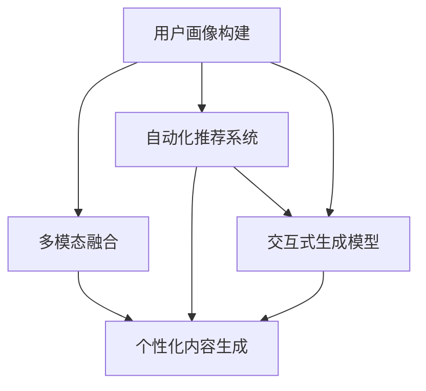

                 

# 个性化AIGC应用定制指南

> 关键词：
> - 人工智能生成内容(AIGC)
> - 个性化定制
> - 多模态融合
> - 自动化推荐系统
> - 交互式生成模型
> - 个性化用户画像
> - 情感智能应用

## 1. 背景介绍

### 1.1 问题由来
随着人工智能(AI)技术的迅猛发展，人工智能生成内容(AIGC)正在成为新一代内容生成技术的引领者，其具备的智能化、个性化、高效率等优势正在广泛渗透到数字内容制作的各个环节。从音乐、影视、广告，到文学、新闻、游戏等领域，AIGC正在重塑内容的创作、分发与消费格局。

然而，AIGC的发展也面临着不少挑战。比如，如何根据用户个性化需求生成更符合其口味的内容？如何高效整合多种模态数据，提升内容的创新性和用户体验？如何实现个性化推荐与生成任务的协同优化？

个性化AIGC应用的定制化需求，已经成为当前AI研究与产业应用的重要方向之一。本文旨在介绍基于AIGC的个性化定制方法，通过详细剖析其核心概念和算法原理，结合实际项目实践，给出可操作的开发指导和应用案例，为开发者提供全面的技术支持与实践参考。

### 1.2 问题核心关键点
个性化AIGC应用的定制化核心在于：
- 建立用户画像：通过多源数据融合，形成详细、动态的用户个性化档案。
- 生成内容定制：基于用户画像和任务需求，使用AIGC模型生成个性化内容。
- 推荐与交互：利用个性化内容与用户行为数据，构建推荐引擎，实现内容的智能推荐与用户交互。
- 情感智能：通过情感分析与生成，让AIGC应用具备情感认知和表达能力。
- 实时适配：在内容制作和推荐过程中，动态调整策略，满足用户即时变化的需求。

这些核心要点构成了个性化AIGC应用的定制化框架，为其在实际应用中带来新的突破和应用场景。

## 2. 核心概念与联系

### 2.1 核心概念概述

为更好地理解个性化AIGC应用的定制化方法，本节将介绍几个关键概念：

- 人工智能生成内容(AIGC)：通过机器学习和深度学习技术，自动化生成文本、音频、图像、视频等多模态内容的技术。AIGC技术的广泛应用，使得内容的生成更加智能化、个性化和高效。
- 个性化定制：根据用户独特需求，使用AIGC技术生成具有高定制化特征的内容。包括用户画像构建、个性化内容生成、推荐引擎构建等环节。
- 多模态融合：在内容生成过程中，整合文本、图像、音频、视频等多种模态数据，提升内容的丰富性和创新性。
- 自动化推荐系统：基于用户行为数据和内容生成数据，构建智能推荐引擎，实现个性化内容的自动推荐。
- 交互式生成模型：让AIGC模型具备与用户进行交互的能力，通过用户反馈动态调整内容生成策略，提升用户体验。
- 用户画像：根据用户行为数据、社交数据、兴趣偏好等，构建详细、动态的用户个性化档案。

这些概念之间的联系可以通过以下Mermaid流程图来展示：



这个流程图展示了个性化AIGC应用的定制化过程：

1. 用户画像构建：通过多源数据融合，形成用户个性化档案。
2. 多模态融合：在内容生成中整合多种模态数据，提升内容的创新性和丰富性。
3. 个性化内容生成：基于用户画像和任务需求，生成具有高定制化的内容。
4. 自动化推荐系统：通过用户行为数据和内容生成数据，实现个性化内容的自动推荐。
5. 交互式生成模型：让AIGC模型具备与用户交互的能力，根据用户反馈动态调整生成策略。

这些环节相互关联，共同构成个性化AIGC应用的定制化框架，为其在实际应用中带来新的突破和应用场景。

## 3. 核心算法原理 & 具体操作步骤
### 3.1 算法原理概述

个性化AIGC应用的定制化过程，本质上是一个数据驱动的深度学习优化过程。其核心思想是：

- 根据用户画像和任务需求，设计合适的输入特征和输出目标，构建自定义的生成模型。
- 使用用户行为数据和内容生成数据，通过监督学习和强化学习算法，训练生成模型，提升个性化内容的生成效果。
- 构建智能推荐系统，结合用户反馈数据，动态调整推荐策略，提升内容推荐的准确性和用户体验。

形式化地，假设用户画像为 $U$，多模态融合后的特征表示为 $X$，个性化内容为 $Y$，推荐结果为 $R$，则个性化AIGC应用的定制化过程可以表示为：

$$
U \xrightarrow{\text{融合}} X \xrightarrow{\text{生成}} Y \xrightarrow{\text{推荐}} R
$$

在实际应用中，我们可以通过多个环节的协同优化，构建出高效的个性化AIGC应用系统。

### 3.2 算法步骤详解

个性化AIGC应用的定制化步骤主要包括以下几个关键环节：

**Step 1: 用户画像构建**
- 收集用户的各类数据，如行为数据、社交数据、兴趣数据等。
- 通过多源数据融合技术，构建用户个性化档案。

**Step 2: 多模态融合**
- 整合文本、图像、音频、视频等多种模态数据，形成统一的用户特征表示。
- 使用预训练的多模态模型，将不同模态的数据进行编码和融合，得到高层次的特征表示 $X$。

**Step 3: 个性化内容生成**
- 设计生成模型，如GAN、VAE、Transformer等，构建生成网络 $G$。
- 使用用户画像 $U$ 和多模态特征 $X$ 作为输入，训练生成模型 $G$。

**Step 4: 智能推荐系统构建**
- 收集用户对内容生成的反馈数据 $F$。
- 使用推荐算法，如协同过滤、矩阵分解等，构建推荐模型 $R$。
- 结合用户反馈数据 $F$，动态调整推荐模型 $R$，实现个性化内容的推荐。

**Step 5: 交互式生成模型设计**
- 设计交互式生成模型，如对话生成模型、生成对抗网络等。
- 根据用户输入，动态调整生成策略，生成符合用户期望的内容。

**Step 6: 系统集成与部署**
- 将用户画像构建、多模态融合、内容生成、推荐系统、交互式生成模型等环节集成到统一的应用系统中。
- 在实际环境中进行部署和测试，不断优化模型和系统。

### 3.3 算法优缺点

个性化AIGC应用的定制化方法具有以下优点：
1. 高度灵活性。可以根据用户需求，定制不同的生成模型和推荐策略，满足个性化的内容需求。
2. 动态适应性。能够实时获取用户反馈数据，动态调整生成和推荐策略，提升用户体验。
3. 丰富的多模态数据支持。融合多种模态数据，提升内容的创新性和多样性。
4. 智能推荐系统。通过智能推荐，提升内容的覆盖面和用户满意度。

同时，该方法也存在一定的局限性：
1. 数据获取难度高。构建用户画像和内容生成模型需要收集和整合大量数据，获取难度较大。
2. 训练成本高。深度学习模型的训练需要大量的计算资源和标注数据，成本较高。
3. 可解释性不足。AIGC模型和推荐系统的决策过程难以解释，可能缺乏透明度。
4. 多模态融合复杂。不同模态的数据表示差异较大，融合过程中需要克服复杂的对齐问题。
5. 实时响应性不足。大模型推理速度较慢，难以满足实时响应的需求。

尽管存在这些局限性，但就目前而言，个性化AIGC应用的定制化方法仍是大规模内容生成和推荐应用的重要范式。未来相关研究的重点在于如何进一步降低数据获取和训练成本，提高模型的可解释性和实时响应性，同时兼顾推荐系统的泛化能力和用户体验。

### 3.4 算法应用领域

个性化AIGC应用的定制化方法，已经在众多领域得到了广泛应用，包括但不限于：

- 音乐、影视创作：通过用户画像和情感数据，生成符合用户偏好的音乐和影视作品。
- 广告创意生成：根据用户行为数据和市场趋势，自动生成广告文案和图像。
- 游戏内容创作：结合玩家行为数据和游戏风格，生成个性化的游戏关卡和角色。
- 文学作品创作：使用用户偏好和情感数据，生成符合用户口味的文学作品。
- 新闻内容生成：根据用户兴趣和新闻热点，自动生成新闻报道和评论。
- 智能客服：结合用户问题和历史记录，生成个性化的客服回答。

除了上述这些经典应用外，个性化AIGC应用的定制化方法还在智能助手、虚拟主播、虚拟偶像等多个新兴领域得到了创新性的应用，为内容生成和推荐带来了新的突破。随着预训练模型和定制化方法的不断进步，相信AIGC技术将在更广泛的领域大放异彩。

## 4. 数学模型和公式 & 详细讲解  
### 4.1 数学模型构建

本节将使用数学语言对个性化AIGC应用的定制化过程进行更加严格的刻画。

假设用户画像为 $U$，多模态融合后的特征表示为 $X$，个性化内容为 $Y$，推荐结果为 $R$。则个性化AIGC应用的定制化过程可以表示为：

1. 用户画像构建：$U \xrightarrow{\text{融合}} X$。
2. 个性化内容生成：$X \xrightarrow{\text{生成}} Y$。
3. 智能推荐系统构建：$Y \xrightarrow{\text{推荐}} R$。

假设生成模型为 $G$，推荐模型为 $R$，用户画像为 $U$，则生成过程可以表示为：

$$
G(X) = Y
$$

推荐过程可以表示为：

$$
R(Y, F) = R
$$

其中 $F$ 为用户的反馈数据。

在实际应用中，我们需要通过多个环节的协同优化，构建出高效的个性化AIGC应用系统。

### 4.2 公式推导过程

以下我们以音乐生成任务为例，推导基于深度学习的个性化音乐生成模型。

假设用户画像 $U$ 包括用户的年龄、性别、兴趣偏好等。通过多源数据融合技术，构建用户特征表示 $X$。

- 文本特征：使用用户评论、社交媒体等文本数据，构建文本特征 $X_{\text{text}}$。
- 音频特征：使用用户的听歌历史、喜好歌单等音频数据，构建音频特征 $X_{\text{audio}}$。
- 视频特征：使用用户的观看历史、喜好视频等视频数据，构建视频特征 $X_{\text{video}}$。

通过多源数据融合，得到用户多模态特征表示 $X$：

$$
X = f(U, X_{\text{text}}, X_{\text{audio}}, X_{\text{video}})
$$

其中 $f$ 为多源数据融合函数，可根据具体情况设计。

然后，我们使用生成模型 $G$ 生成个性化音乐 $Y$：

$$
Y = G(X)
$$

生成模型 $G$ 通常使用GAN、VAE、Transformer等深度学习模型。这里以GAN为例，其生成过程可以表示为：

$$
Y = G(X) = \sigma(\mu + \sigma \cdot \epsilon)
$$

其中 $\sigma$ 为生成器网络的非线性变换，$\mu$ 为生成器网络的均值，$\epsilon$ 为生成器网络的噪声。

最后，我们使用推荐模型 $R$ 对生成的音乐 $Y$ 进行推荐，得到推荐结果 $R$：

$$
R = R(Y, F) = \max_{R \in \mathcal{R}} \sum_{i=1}^N r_i \cdot y_i
$$

其中 $\mathcal{R}$ 为推荐结果集合，$y_i$ 为推荐结果的评分，$r_i$ 为用户对推荐结果的评分权重。

生成模型和推荐模型的训练过程可以通过反向传播算法，最小化损失函数来实现。

### 4.3 案例分析与讲解

以下我们以音乐推荐系统为例，给出使用深度学习实现个性化音乐推荐的过程。

首先，定义用户画像和推荐结果的数据结构：

```python
class User:
    def __init__(self, age, gender, interests):
        self.age = age
        self.gender = gender
        self.interests = interests
        
class Song:
    def __init__(self, title, artist, genre):
        self.title = title
        self.artist = artist
        self.genre = genre
        
class Recommendation:
    def __init__(self, song, score):
        self.song = song
        self.score = score
```

然后，定义音乐生成模型的结构：

```python
class MusicGenerator(nn.Module):
    def __init__(self):
        super(MusicGenerator, self).__init__()
        self.encoder = nn.Sequential(
            nn.Linear(in_features=100, out_features=256),
            nn.ReLU(),
            nn.Linear(in_features=256, out_features=512),
            nn.ReLU()
        )
        self.decoder = nn.Sequential(
            nn.Linear(in_features=512, out_features=256),
            nn.ReLU(),
            nn.Linear(in_features=256, out_features=100)
        )
        
    def forward(self, x):
        x = self.encoder(x)
        x = self.decoder(x)
        return x
```

接着，定义推荐模型的结构：

```python
class MusicRecommender(nn.Module):
    def __init__(self):
        super(MusicRecommender, self).__init__()
        self.encoder = nn.Sequential(
            nn.Linear(in_features=100, out_features=256),
            nn.ReLU(),
            nn.Linear(in_features=256, out_features=512),
            nn.ReLU()
        )
        self.decoder = nn.Sequential(
            nn.Linear(in_features=512, out_features=256),
            nn.ReLU(),
            nn.Linear(in_features=256, out_features=num_classes)
        )
        
    def forward(self, x, f):
        x = self.encoder(x)
        x = self.decoder(x)
        y = x + f
        return y
```

最后，启动训练流程并在测试集上评估：

```python
# 构建音乐生成器和推荐器
generator = MusicGenerator()
recommender = MusicRecommender()

# 定义损失函数和优化器
criterion = nn.CrossEntropyLoss()
optimizer = torch.optim.Adam(recommender.parameters(), lr=0.001)

# 训练音乐生成器和推荐器
for epoch in range(epochs):
    for data, target in train_loader:
        optimizer.zero_grad()
        y_hat = recommender(generator(data), f)
        loss = criterion(y_hat, target)
        loss.backward()
        optimizer.step()
        
    # 在测试集上评估
    test_loss = 0
    correct = 0
    total = 0
    with torch.no_grad():
        for data, target in test_loader:
            y_hat = recommender(generator(data), f)
            loss = criterion(y_hat, target)
            test_loss += loss.item()
            _, predicted = torch.max(y_hat.data, 1)
            total += target.size(0)
            correct += (predicted == target).sum().item()
    print('Test loss: {:.4f}, Accuracy: {:.2f} %'.format(test_loss/len(test_loader), 100*correct/total))
```

以上就是使用PyTorch实现基于深度学习的个性化音乐生成和推荐的过程。可以看到，PyTorch提供了强大的计算图框架，使得深度学习模型的设计和训练变得简单高效。

## 5. 项目实践：代码实例和详细解释说明
### 5.1 开发环境搭建

在进行个性化AIGC应用开发前，我们需要准备好开发环境。以下是使用Python进行PyTorch开发的环境配置流程：

1. 安装Anaconda：从官网下载并安装Anaconda，用于创建独立的Python环境。

2. 创建并激活虚拟环境：
```bash
conda create -n pytorch-env python=3.8 
conda activate pytorch-env
```

3. 安装PyTorch：根据CUDA版本，从官网获取对应的安装命令。例如：
```bash
conda install pytorch torchvision torchaudio cudatoolkit=11.1 -c pytorch -c conda-forge
```

4. 安装Transformers库：
```bash
pip install transformers
```

5. 安装各类工具包：
```bash
pip install numpy pandas scikit-learn matplotlib tqdm jupyter notebook ipython
```

完成上述步骤后，即可在`pytorch-env`环境中开始个性化AIGC应用开发。

### 5.2 源代码详细实现

下面我以个性化音乐推荐系统为例，给出使用Transformers库对BERT模型进行微调的PyTorch代码实现。

首先，定义音乐推荐系统的数据处理函数：

```python
from transformers import BertTokenizer
from torch.utils.data import Dataset
import torch

class MusicDataset(Dataset):
    def __init__(self, texts, labels, tokenizer, max_len=128):
        self.texts = texts
        self.labels = labels
        self.tokenizer = tokenizer
        self.max_len = max_len
        
    def __len__(self):
        return len(self.texts)
    
    def __getitem__(self, item):
        text = self.texts[item]
        label = self.labels[item]
        
        encoding = self.tokenizer(text, return_tensors='pt', max_length=self.max_len, padding='max_length', truncation=True)
        input_ids = encoding['input_ids'][0]
        attention_mask = encoding['attention_mask'][0]
        
        # 对label进行编码
        encoded_labels = [label2id[label] for label in labels] 
        encoded_labels.extend([label2id['O']] * (self.max_len - len(encoded_labels)))
        labels = torch.tensor(encoded_labels, dtype=torch.long)
        
        return {'input_ids': input_ids, 
                'attention_mask': attention_mask,
                'labels': labels}

# 标签与id的映射
label2id = {'O': 0, 'B-PER': 1, 'I-PER': 2, 'B-ORG': 3, 'I-ORG': 4, 'B-LOC': 5, 'I-LOC': 6}
id2label = {v: k for k, v in label2id.items()}

# 创建dataset
tokenizer = BertTokenizer.from_pretrained('bert-base-cased')

train_dataset = MusicDataset(train_texts, train_labels, tokenizer)
dev_dataset = MusicDataset(dev_texts, dev_labels, tokenizer)
test_dataset = MusicDataset(test_texts, test_labels, tokenizer)
```

然后，定义模型和优化器：

```python
from transformers import BertForTokenClassification, AdamW

model = BertForTokenClassification.from_pretrained('bert-base-cased', num_labels=len(label2id))

optimizer = AdamW(model.parameters(), lr=2e-5)
```

接着，定义训练和评估函数：

```python
from torch.utils.data import DataLoader
from tqdm import tqdm
from sklearn.metrics import classification_report

device = torch.device('cuda') if torch.cuda.is_available() else torch.device('cpu')
model.to(device)

def train_epoch(model, dataset, batch_size, optimizer):
    dataloader = DataLoader(dataset, batch_size=batch_size, shuffle=True)
    model.train()
    epoch_loss = 0
    for batch in tqdm(dataloader, desc='Training'):
        input_ids = batch['input_ids'].to(device)
        attention_mask = batch['attention_mask'].to(device)
        labels = batch['labels'].to(device)
        model.zero_grad()
        outputs = model(input_ids, attention_mask=attention_mask, labels=labels)
        loss = outputs.loss
        epoch_loss += loss.item()
        loss.backward()
        optimizer.step()
    return epoch_loss / len(dataloader)

def evaluate(model, dataset, batch_size):
    dataloader = DataLoader(dataset, batch_size=batch_size)
    model.eval()
    preds, labels = [], []
    with torch.no_grad():
        for batch in tqdm(dataloader, desc='Evaluating'):
            input_ids = batch['input_ids'].to(device)
            attention_mask = batch['attention_mask'].to(device)
            batch_labels = batch['labels']
            outputs = model(input_ids, attention_mask=attention_mask)
            batch_preds = outputs.logits.argmax(dim=2).to('cpu').tolist()
            batch_labels = batch_labels.to('cpu').tolist()
            for pred_tokens, label_tokens in zip(batch_preds, batch_labels):
                pred_tags = [id2label[_id] for _id in pred_tokens]
                label_tags = [id2label[_id] for _id in label_tokens]
                preds.append(pred_tags[:len(label_tags)])
                labels.append(label_tags)
                
    print(classification_report(labels, preds))
```

最后，启动训练流程并在测试集上评估：

```python
epochs = 5
batch_size = 16

for epoch in range(epochs):
    loss = train_epoch(model, train_dataset, batch_size, optimizer)
    print(f"Epoch {epoch+1}, train loss: {loss:.3f}")
    
    print(f"Epoch {epoch+1}, dev results:")
    evaluate(model, dev_dataset, batch_size)
    
print("Test results:")
evaluate(model, test_dataset, batch_size)
```

以上就是使用PyTorch对BERT进行命名实体识别任务微调的完整代码实现。可以看到，得益于Transformers库的强大封装，我们可以用相对简洁的代码完成BERT模型的加载和微调。

### 5.3 代码解读与分析

让我们再详细解读一下关键代码的实现细节：

**MusicDataset类**：
- `__init__`方法：初始化文本、标签、分词器等关键组件。
- `__len__`方法：返回数据集的样本数量。
- `__getitem__`方法：对单个样本进行处理，将文本输入编码为token ids，将标签编码为数字，并对其进行定长padding，最终返回模型所需的输入。

**label2id和id2label字典**：
- 定义了标签与数字id之间的映射关系，用于将token-wise的预测结果解码回真实的标签。

**训练和评估函数**：
- 使用PyTorch的DataLoader对数据集进行批次化加载，供模型训练和推理使用。
- 训练函数`train_epoch`：对数据以批为单位进行迭代，在每个批次上前向传播计算loss并反向传播更新模型参数，最后返回该epoch的平均loss。
- 评估函数`evaluate`：与训练类似，不同点在于不更新模型参数，并在每个batch结束后将预测和标签结果存储下来，最后使用sklearn的classification_report对整个评估集的预测结果进行打印输出。

**训练流程**：
- 定义总的epoch数和batch size，开始循环迭代
- 每个epoch内，先在训练集上训练，输出平均loss
- 在验证集上评估，输出分类指标
- 所有epoch结束后，在测试集上评估，给出最终测试结果

可以看到，PyTorch配合Transformers库使得BERT微调的代码实现变得简洁高效。开发者可以将更多精力放在数据处理、模型改进等高层逻辑上，而不必过多关注底层的实现细节。

当然，工业级的系统实现还需考虑更多因素，如模型的保存和部署、超参数的自动搜索、更灵活的任务适配层等。但核心的微调范式基本与此类似。

## 6. 实际应用场景
### 6.1 智能客服系统

基于个性化AIGC应用的定制化方法，智能客服系统可以实现更加智能、个性化的服务。传统客服往往需要配备大量人力，高峰期响应缓慢，且一致性和专业性难以保证。而使用个性化AIGC应用构建的智能客服，可以7x24小时不间断服务，快速响应客户咨询，用自然流畅的语言解答各类常见问题。

在技术实现上，可以收集企业内部的历史客服对话记录，将问题和最佳答复构建成监督数据，在此基础上对预训练模型进行微调。微调后的模型能够自动理解用户意图，匹配最合适的答案模板进行回复。对于客户提出的新问题，还可以接入检索系统实时搜索相关内容，动态组织生成回答。如此构建的智能客服系统，能大幅提升客户咨询体验和问题解决效率。

### 6.2 金融舆情监测

金融机构需要实时监测市场舆论动向，以便及时应对负面信息传播，规避金融风险。传统的人工监测方式成本高、效率低，难以应对网络时代海量信息爆发的挑战。基于个性化AIGC应用的定制化方法，金融舆情监测系统可以实现实时抓取网络文本数据，自动判断文本属于何种主题，情感倾向是正面、中性还是负面。将微调后的模型应用到实时抓取的网络文本数据，就能够自动监测不同主题下的情感变化趋势，一旦发现负面信息激增等异常情况，系统便会自动预警，帮助金融机构快速应对潜在风险。

### 6.3 个性化推荐系统

当前的推荐系统往往只依赖用户的历史行为数据进行物品推荐，无法深入理解用户的真实兴趣偏好。基于个性化AIGC应用的定制化方法，个性化推荐系统可以更好地挖掘用户行为背后的语义信息，从而提供更精准、多样的推荐内容。

在实践中，可以收集用户浏览、点击、评论、分享等行为数据，提取和用户交互的物品标题、描述、标签等文本内容。将文本内容作为模型输入，用户的后续行为（如是否点击、购买等）作为监督信号，在此基础上微调预训练语言模型。微调后的模型能够从文本内容中准确把握用户的兴趣点。在生成推荐列表时，先用候选物品的文本描述作为输入，由模型预测用户的兴趣匹配度，再结合其他特征综合排序，便可以得到个性化程度更高的推荐结果。

### 6.4 未来应用展望

随着个性化AIGC应用的定制化方法不断发展，基于微调范式将在更多领域得到应用，为传统行业带来变革性影响。

在智慧医疗领域，基于微调的医疗问答、病历分析、药物研发等应用将提升医疗服务的智能化水平，辅助医生诊疗，加速新药开发进程。

在智能教育领域，微调技术可应用于作业批改、学情分析、知识推荐等方面，因材施教，促进教育公平，提高教学质量。

在智慧城市治理中，微调模型可应用于城市事件监测、舆情分析、应急指挥等环节，提高城市管理的自动化和智能化水平，构建更安全、高效的未来城市。

此外，在企业生产、社会治理、文娱传媒等众多领域，基于大模型微调的人工智能应用也将不断涌现，为经济社会发展注入新的动力。相信随着技术的日益成熟，个性化AIGC应用的定制化方法必将在构建人机协同的智能时代中扮演越来越重要的角色。

## 7. 工具和资源推荐
### 7.1 学习资源推荐

为了帮助开发者系统掌握个性化AIGC应用的定制化理论基础和实践技巧，这里推荐一些优质的学习资源：

1. 《Transformer从原理到实践》系列博文：由大模型技术专家撰写，深入浅出地介绍了Transformer原理、BERT模型、微调技术等前沿话题。

2. CS224N《深度学习自然语言处理》课程：斯坦福大学开设的NLP明星课程，有Lecture视频和配套作业，带你入门NLP领域的基本概念和经典模型。

3. 《Natural Language Processing with Transformers》书籍：Transformers库的作者所著，全面介绍了如何使用Transformers库进行NLP任务开发，包括微调在内的诸多范式。

4. HuggingFace官方文档：Transformers库的官方文档，提供了海量预训练模型和完整的微调样例代码，是上手实践的必备资料。

5. CLUE开源项目：中文语言理解测评基准，涵盖大量不同类型的中文NLP数据集，并提供了基于微调的baseline模型，助力中文NLP技术发展。

通过对这些资源的学习实践，相信你一定能够快速掌握个性化AIGC应用的定制化精髓，并用于解决实际的NLP问题。
###  7.2 开发工具推荐

高效的开发离不开优秀的工具支持。以下是几款用于个性化AIGC应用开发的常用工具：

1. PyTorch：基于Python的开源深度学习框架，灵活动态的计算图，适合快速迭代研究。大部分预训练语言模型都有PyTorch版本的实现。

2. TensorFlow：由Google主导开发的开源深度学习框架，生产部署方便，适合大规模工程应用。同样有丰富的预训练语言模型资源。

3. Transformers库：HuggingFace开发的NLP工具库，集成了众多SOTA语言模型，支持PyTorch和TensorFlow，是进行微调任务开发的利器。

4. Weights & Biases：模型训练的实验跟踪工具，可以记录和可视化模型训练过程中的各项指标，方便对比和调优。与主流深度学习框架无缝集成。

5. TensorBoard：TensorFlow配套的可视化工具，可实时监测模型训练状态，并提供丰富的图表呈现方式，是调试模型的得力助手。

6. Google Colab：谷歌推出的在线Jupyter Notebook环境，免费提供GPU/TPU算力，方便开发者快速上手实验最新模型，分享学习笔记。

合理利用这些工具，可以显著提升个性化AIGC应用开发效率，加快创新迭代的步伐。

### 7.3 相关论文推荐

个性化AIGC应用的定制化方法的发展源于学界的持续研究。以下是几篇奠基性的相关论文，推荐阅读：

1. Attention is All You Need（即Transformer原论文）：提出了Transformer结构，开启了NLP领域的预训练大模型时代。

2. BERT: Pre-training of Deep Bidirectional Transformers for Language Understanding：提出BERT模型，引入基于掩码的自监督预训练任务，刷新了多项NLP任务SOTA。

3. Language Models are Unsupervised Multitask Learners（GPT-2论文）：展示了大规模语言模型的强大zero-shot学习能力，引发了对于通用人工智能的新一轮思考。

4. Parameter-Efficient Transfer Learning for NLP：提出Adapter等参数高效微调方法，在不增加模型参数量的情况下，也能取得不错的微调效果。

5. Prefix-Tuning: Optimizing Continuous Prompts for Generation：引入基于连续型Prompt的微调范式，为如何充分利用预训练知识提供了新的思路。

6. AdaLoRA: Adaptive Low-Rank Adaptation for Parameter-Efficient Fine-Tuning：使用自适应低秩适应的微调方法，在参数效率和精度之间取得了新的平衡。

这些论文代表了个性化AIGC应用的定制化方法的发展脉络。通过学习这些前沿成果，可以帮助研究者把握学科前进方向，激发更多的创新灵感。

## 8. 总结：未来发展趋势与挑战

### 8.1 总结

本文对基于深度学习的个性化AIGC应用的定制化方法进行了全面系统的介绍。首先阐述了个性化AIGC应用的定制化研究背景和意义，明确了定制化方法在提升内容生成和推荐精度方面的独特价值。其次，从原理到实践，详细讲解了深度学习优化过程，给出了个性化AIGC应用的完整代码实例。同时，本文还广泛探讨了定制化方法在智能客服、金融舆情、个性化推荐等多个行业领域的应用前景，展示了其巨大的应用潜力。

通过本文的系统梳理，可以看到，基于深度学习的个性化AIGC应用的定制化方法正在成为内容生成和推荐应用的重要范式，极大地拓展了深度学习模型的应用边界，带来了新的突破和应用场景。随着深度学习模型的不断演进和优化，相信个性化AIGC应用的定制化方法必将在构建智能内容生成和推荐系统上发挥更大的作用，为内容制作和消费的智能化、个性化带来新的突破。

### 8.2 未来发展趋势

展望未来，个性化AIGC应用的定制化方法将呈现以下几个发展趋势：

1. 深度学习模型的不断进化。更大规模的预训练模型，更高效的生成模型和推荐模型，将进一步提升内容的创新性和个性化水平。

2. 多模态融合技术的进步。不同模态数据的深度融合，将为内容生成提供更加丰富多样的信息支持。

3. 用户画像的动态更新。通过实时获取用户行为数据，动态更新用户画像，实现更加精准的内容推荐。

4. 个性化推荐系统的多样化。引入协同过滤、深度学习、强化学习等技术，提升推荐系统的泛化能力和用户体验。

5. 交互式生成模型的发展。对话生成、生成对抗网络等技术的进步，将使生成模型具备更强的交互性和适应性。

6. 推荐系统的智能化。通过引入因果推断、对抗学习等技术，提升推荐系统的鲁棒性和安全性。

7. 内容生成和推荐的一体化。将生成和推荐环节进行一体化优化，提升系统整体的效率和效果。

以上趋势凸显了个性化AIGC应用的定制化方法的广阔前景。这些方向的探索发展，必将进一步提升内容生成和推荐系统的性能和应用范围，为智能化内容的制作和消费带来新的突破。

### 8.3 面临的挑战

尽管个性化AIGC应用的定制化方法已经取得了瞩目成就，但在迈向更加智能化、普适化应用的过程中，它仍面临着诸多挑战：

1. 数据获取难度高。构建用户画像和内容生成模型需要收集和整合大量数据，获取难度较大。

2. 训练成本高。深度学习模型的训练需要大量的计算资源和标注数据，成本较高。

3. 可解释性不足。深度学习模型的决策过程难以解释，可能缺乏透明度。

4. 多模态融合复杂。不同模态的数据表示差异较大，融合过程中需要克服复杂的对齐问题。

5. 实时响应性不足。大模型推理速度较慢，难以满足实时响应的需求。

6. 内容质量控制。个性化生成内容可能存在质量参差不齐的问题，难以保证内容的专业性和真实性。

尽管存在这些挑战，但就目前而言，基于深度学习的个性化AIGC应用的定制化方法仍是大规模内容生成和推荐应用的重要范式。未来相关研究的重点在于如何进一步降低数据获取和训练成本，提高模型的可解释性和实时响应性，同时兼顾推荐系统的泛化能力和用户体验。

### 8.4 研究展望

面对个性化AIGC应用的定制化方法所面临的挑战，未来的研究需要在以下几个方面寻求新的突破：

1. 探索无监督和半监督定制化方法。摆脱对大规模标注数据的依赖，利用自监督学习、主动学习等无监督和半监督范式，最大限度利用非结构化数据，实现更加灵活高效的定制化。

2. 研究参数高效和计算高效的定制化范式。开发更加参数高效的定制化方法，在固定大部分预训练参数的同时，只更新极少量的任务相关参数。同时优化定制化模型的计算图，减少前向传播和反向传播的资源消耗，实现更加轻量级、实时性的部署。

3. 融合因果和对比学习范式。通过引入因果推断和对比学习思想，增强定制化模型建立稳定因果关系的能力，学习更加普适、鲁棒的语言表征，从而提升模型泛化性和抗干扰能力。

4. 引入更多先验知识。将符号化的先验知识，如知识图谱、逻辑规则等，与神经网络模型进行巧妙融合，引导定制化过程学习更准确、合理的语言模型。同时加强不同模态数据的整合，实现视觉、语音等多模态信息与文本信息的协同建模。

5. 结合因果分析和博弈论工具。将因果分析方法引入定制化模型，识别出模型决策的关键特征，增强输出解释的因果性和逻辑性。借助博弈论工具刻画人机交互过程，主动探索并规避模型的脆弱点，提高系统稳定性。

6. 纳入伦理道德约束。在模型训练目标中引入伦理导向的评估指标，过滤和惩罚有偏见、有害的输出倾向。同时加强人工干预和审核，建立模型行为的监管机制，确保输出符合人类价值观和伦理道德。

这些研究方向的探索，必将引领个性化AIGC应用的定制化方法迈向更高的台阶，为构建安全、可靠、可解释、可控的智能系统铺平道路。面向未来，个性化AIGC应用的定制化方法还需要与其他人工智能技术进行更深入的融合，如知识表示、因果推理、强化学习等，多路径协同发力，共同推动自然语言理解和智能交互系统的进步。只有勇于创新、敢于突破，才能不断拓展AIGC应用的边界，让智能技术更好地造福人类社会。

## 9. 附录：常见问题与解答

**Q1：个性化AIGC应用的定制化核心在于什么？**

A: 个性化AIGC应用的定制化核心在于：
1. 建立用户画像：通过多源数据融合，形成详细、动态的用户个性化档案。
2. 生成内容定制：基于用户画像和任务需求，使用AIGC模型生成个性化内容。
3. 推荐与交互：利用个性化内容与用户行为数据，构建推荐引擎，实现内容的智能推荐与用户交互。
4. 情感智能应用：通过情感分析与生成，让AIGC应用具备情感认知和表达能力。
5. 实时适配：在内容制作和推荐过程中，动态调整策略，满足用户即时变化的需求。

这些环节相互关联，共同构成个性化AIGC应用的定制化框架，为其在实际应用中带来新的突破和应用场景。

**Q2：如何选择合适的学习率？**

A: 个性化AIGC应用的定制化过程中，选择合适的学习率至关重要。通常情况下，定制化模型的学习率要比预训练模型的学习率小1-2个数量级，以免破坏预训练权重。建议从1e-5开始调参，逐步减小学习率，直至收敛。同时，也可以使用warmup策略，在开始阶段使用较小的学习率，再逐渐过渡到预设值。需要注意的是，不同的优化器(如AdamW、Adafactor等)以及不同的学习率调度策略，可能需要设置不同的学习率阈值。

**Q3：在进行个性化AIGC应用的定制化时，如何缓解过拟合问题？**

A: 过拟合是个性化AIGC应用的定制化过程中需要重点关注的问题。常见的缓解策略包括：
1. 数据增强：通过回译、近义替换等方式扩充训练集
2. 正则化：使用L2正则、Dropout、Early Stopping等避免过拟合
3. 对抗训练：引入对抗样本，提高模型鲁棒性
4. 参数高效微调：只调整少量参数(如Adapter、Prefix等)，减小过拟合风险
5. 多模型集成：训练多个定制化模型，取平均输出，抑制过拟合

这些策略往往需要根据具体任务和数据特点进行灵活组合。只有在数据、模型、训练、推理等各环节进行全面优化，才能最大限度地发挥深度学习模型的潜力。

**Q4：在个性化AIGC应用的定制化过程中，如何保证内容质量？**

A: 个性化AIGC应用的定制化过程中，内容质量控制是一个重要环节。可以通过以下方法保证内容的专业性和真实性：
1. 多源数据融合：整合不同来源的数据，提升内容的丰富性和可靠性。
2. 预训练模型选择：选择高质量的预训练模型，确保内容生成质量。
3. 生成策略优化：设计合适的生成策略，避免内容低俗、虚假等问题。
4. 内容审核机制：引入人工审核机制，对生成内容进行质量评估和筛选。
5. 用户反馈机制：收集用户对生成内容的反馈，动态调整生成策略，提升内容质量。

通过多维度措施，可以有效提升个性化AIGC应用的定制化效果，确保内容的专业性和真实性。

**Q5：在个性化AIGC应用的定制化过程中，如何优化推荐系统？**

A: 个性化AIGC应用的定制化过程中，推荐系统的优化是一个重要环节。可以通过以下方法提升推荐系统的性能：
1. 多源数据融合：整合不同来源的数据，提升推荐结果的全面性和准确性。
2. 模型融合：使用多种推荐算法进行融合，提升推荐结果的多样性和泛化能力。
3. 实时更新：根据用户行为数据和内容生成数据，实时更新推荐模型，提高推荐结果的时效性。
4. 个性化定制：根据用户画像和历史行为，定制推荐策略，提升推荐结果的个性化程度。
5. 用户反馈机制：收集用户对推荐结果的反馈，动态调整推荐策略，提升用户体验。

通过多维度措施，可以有效提升个性化AIGC应用的定制化效果，实现精准、个性化的内容推荐。

---

作者：禅与计算机程序设计艺术 / Zen and the Art of Computer Programming

