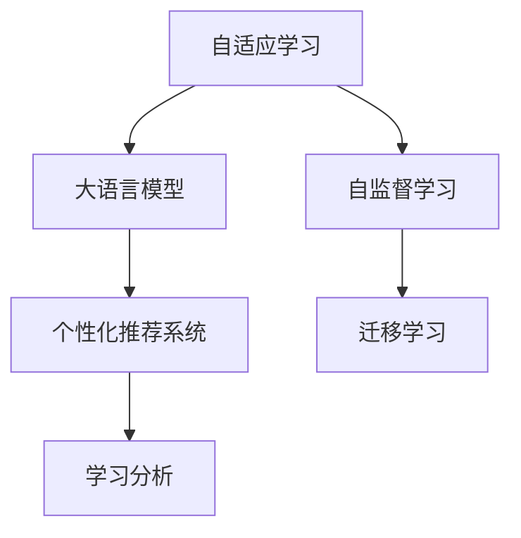

                 

# 个性化学习路径：LLM在教育系统中的应用

> 关键词：自适应学习, 大语言模型, 教育技术, 自然语言处理, 个性化推荐, 学习分析, 数据驱动教育

## 1. 背景介绍

随着人工智能和教育技术的深入融合，教育领域正在经历一场颠覆性的变革。传统的以教师为中心的授课模式，正逐渐被以学生为主导的个性化学习路径所替代。尤其是在近两年的疫情期间，在线教育的普及进一步加速了这一进程。自适应学习和个性化推荐的理念，开始被更多的教育机构和教育技术公司采纳，以提升学习效率和教学质量。

在这一背景下，自然语言处理(NLP)领域的大语言模型(Large Language Model, LLM)，凭借其强大的语言理解能力和自然语言生成能力，成为教育技术应用的重要工具。本文将从自适应学习系统的构建、个性化推荐系统的设计，以及学习分析平台的开发等方面，详细介绍大语言模型在教育系统中的具体应用。

## 2. 核心概念与联系

### 2.1 核心概念概述

为更好地理解大语言模型在教育系统中的应用，本节将介绍几个密切相关的核心概念：

- 自适应学习(Adaptive Learning)：指根据学生的知识水平和兴趣，动态调整学习内容和难度，以实现个性化学习目标。自适应学习系统能够实时监测学生的学习进度和理解情况，灵活调整教学策略，提升学习效果。

- 大语言模型(Large Language Model, LLM)：指通过大规模无标签文本语料进行预训练，学习到丰富语言知识的模型。BERT、GPT等模型是其中的代表。

- 个性化推荐系统(Personalized Recommendation System)：通过分析用户的行为和兴趣，为其推荐适合的学习资源。个性化推荐系统利用大语言模型对用户的学习记录、行为数据进行建模，预测其可能感兴趣的内容，提高学习效率。

- 学习分析(Learning Analytics)：指通过数据挖掘和统计分析，监测学生的学习行为和表现，辅助教学决策。学习分析系统通常需要结合自适应学习系统和个性化推荐系统，以实现更精准的教学干预。

- 自监督学习(Self-supervised Learning)：指使用未标注的数据，通过自监督任务进行模型训练，学习到数据的潜在结构和知识。自监督学习是大语言模型预训练的主要手段，利用大规模语料，学习到丰富的语言知识和语义表征。

- 迁移学习(Transfer Learning)：指将一个领域学习到的知识，迁移到另一个相关领域的学习过程。大语言模型的预训练-微调过程即是一种典型的迁移学习方式。

这些核心概念之间的逻辑关系可以通过以下Mermaid流程图来展示：



这个流程图展示了大语言模型在教育系统中的核心概念及其之间的关系：

1. 自适应学习系统利用大语言模型进行学习理解和分析。
2. 个性化推荐系统通过分析学生的学习数据，利用大语言模型进行推荐。
3. 学习分析系统综合学生的学习数据和行为数据，通过大语言模型进行深度分析。
4. 自监督学习和大语言模型的预训练过程，是构建知识库和迁移学习的基础。

这些概念共同构成了大语言模型在教育系统中的应用框架，使其能够在个性化学习路径构建中发挥强大的作用。通过理解这些核心概念，我们可以更好地把握大语言模型在教育系统中的工作原理和优化方向。

## 3. 核心算法原理 & 具体操作步骤

### 3.1 算法原理概述

大语言模型在教育系统中的应用，主要体现在两个方面：

1. 自适应学习系统：通过大语言模型对学生的学习行为和理解情况进行分析，动态调整学习路径，实现个性化学习。
2. 个性化推荐系统：通过大语言模型对学生的学习数据进行建模，预测其可能感兴趣的内容，进行推荐。

以下将详细阐述这两个系统的算法原理：

### 3.2 算法步骤详解

#### 自适应学习系统

**Step 1: 数据收集与预处理**
- 收集学生的学习数据，包括成绩、作业、考试、提问等，进行清洗和标注。
- 对学习数据进行归一化、标准化处理，使其适应模型的输入要求。

**Step 2: 构建知识库**
- 利用自监督学习任务，如掩码语言模型、下一句子预测等，在大规模无标签文本语料上进行预训练，学习语言知识和语义表征。
- 通过微调或任务适配，构建适用于特定教育领域的小规模知识库，如数学题解、英语单词表等。

**Step 3: 特征提取与理解**
- 对学生的当前学习状态进行特征提取，生成适合模型输入的特征向量。
- 使用大语言模型对学生的学习数据进行理解，评估其知识掌握情况和兴趣偏好。

**Step 4: 路径调整与推荐**
- 根据学生的当前知识水平和兴趣偏好，动态调整学习路径，推荐适合的学习资源。
- 利用自适应学习系统，持续监测学生的学习进度和理解情况，进行路径调整。

#### 个性化推荐系统

**Step 1: 数据收集与标注**
- 收集学生的学习行为数据，包括点击、阅读、观看、提交等行为，进行清洗和标注。
- 对学习行为数据进行特征提取，生成适合模型输入的特征向量。

**Step 2: 构建用户模型**
- 利用大语言模型对学习行为数据进行建模，学习用户的兴趣偏好和行为特征。
- 通过微调或任务适配，构建适用于特定教育领域的用户模型，如数学题难度偏好、英语单词记忆效果等。

**Step 3: 推荐生成与反馈**
- 根据用户模型，生成个性化推荐内容。
- 对推荐内容进行评估，收集用户反馈，持续优化推荐算法。

### 3.3 算法优缺点

大语言模型在教育系统中的应用，具有以下优点：

1. 提升学习效率：自适应学习系统可以根据学生的学习情况，动态调整学习路径，提升学习效果。个性化推荐系统可以根据学生的兴趣偏好，推荐适合的学习资源，提升学习效率。
2. 增强教学互动：利用自然语言处理技术，大语言模型能够自然地与学生进行交互，解答问题，提供反馈。
3. 数据驱动决策：学习分析和推荐系统利用数据驱动的教学决策，更加客观、科学。
4. 适应性强：大语言模型可以适应不同学科、不同年龄段的学习需求，具有较强的普适性。

同时，该方法也存在一定的局限性：

1. 依赖高质量数据：自适应学习系统需要收集大量的学习数据，数据质量和标注的准确性直接影响系统效果。个性化推荐系统同样需要高质量的用户行为数据。
2. 计算资源消耗大：大语言模型的训练和推理过程，计算资源消耗较大，需要高性能的硬件设备支持。
3. 模型解释性不足：大语言模型的黑盒特性，导致其决策过程难以解释，不易进行调试和优化。

尽管存在这些局限性，但就目前而言，基于大语言模型的自适应学习系统和个性化推荐系统，是教育技术应用的重要方向。未来相关研究的重点在于如何进一步降低对数据和计算资源的依赖，提高系统的解释性和鲁棒性。

### 3.4 算法应用领域

基于大语言模型的自适应学习和个性化推荐系统，已经在诸多教育领域得到了应用：

- 在线教育：利用自适应学习系统，根据学生的学习情况，动态调整课程内容，提升学习效果。
- 智能辅导：通过个性化推荐系统，推荐适合的学习资源，进行智能辅导。
- 智慧教室：结合自适应学习系统和个性化推荐系统，构建智能化的学习环境。
- 职业教育：利用自适应学习系统，对不同专业、不同技能的学习路径进行优化。
- 学术研究：通过学习分析和推荐系统，对学生的研究进展进行监测和反馈。

除了上述这些经典应用外，大语言模型在教育领域的应用还在不断创新，如基于学生情感的情感分析、基于学习轨迹的学习路径优化、基于多模态数据的学习分析等，为教育技术带来了更多的可能性。

## 4. 数学模型和公式 & 详细讲解 & 举例说明

### 4.1 数学模型构建

本节将使用数学语言对大语言模型在自适应学习系统中的应用进行更加严格的刻画。

记学生的当前学习状态为 $S_t$，知识水平为 $K_t$，兴趣偏好为 $I_t$。学习数据为 $D_t$，包括作业、考试、提问等。学习资源的集合为 $\mathcal{R}$。

**自适应学习系统的目标**是动态调整学习路径，使学生 $S_t$ 通过学习资源 $\mathcal{R}$，达到理想的知识水平 $K_t^*$ 和兴趣偏好 $I_t^*$。

定义自适应学习系统的优化目标为：

$$
\min_{S_t, K_t, I_t, \mathcal{R}} \left\{ \sum_{t=1}^T \left[ \text{Cost}(S_t, K_t, I_t, \mathcal{R}) \right] \right\}
$$

其中 $\text{Cost}$ 为衡量学习效果和资源消耗的函数。

### 4.2 公式推导过程

以下我们以数学题自适应学习为例，推导自适应学习系统的数学模型和优化目标。

假设学生学习数学题，当前掌握的知识水平为 $K_t$，对某题目的理解程度为 $U_t$，兴趣偏好为 $I_t$，学习资源的集合为 $\mathcal{R}$，包括基础题目、进阶题目、解法示例等。

学习效果由两部分组成：

1. 题目正确率 $C_t$：学生正确回答题目的概率。
2. 学习效率 $E_t$：学生学习某一题目的消耗时间。

因此，优化目标为：

$$
\min_{S_t, K_t, I_t, \mathcal{R}} \left\{ \sum_{t=1}^T \left[ \text{Cost}(S_t, K_t, I_t, \mathcal{R}) \right] \right\} = \min_{S_t, K_t, I_t, \mathcal{R}} \left\{ \sum_{t=1}^T \left[ U_t \cdot C_t + \frac{1}{U_t} \cdot E_t \right] \right\}
$$

其中 $U_t = \frac{C_t}{C_t + \varepsilon}$，$\varepsilon$ 为正则化参数，避免 $U_t$ 为 0。

根据自适应学习系统的设计，假设模型通过预训练得到的数学题解知识库为 $D$，表示题目的知识难度和解题思路。利用大语言模型 $M_{\theta}$ 对学生的学习数据进行理解，评估其当前知识水平 $K_t$ 和兴趣偏好 $I_t$：

$$
K_t = M_{\theta}(S_t, D)
$$
$$
I_t = M_{\theta}(S_t, \mathcal{R})
$$

在优化过程中，自适应学习系统需要动态调整学习路径，推荐适合的学习资源 $\mathcal{R}_t$：

$$
\mathcal{R}_t = \mathop{\arg\min}_{\mathcal{R} \in \mathcal{R}} \text{Cost}(S_t, K_t, I_t, \mathcal{R})
$$

在具体实现中，可以利用多臂老虎机算法或强化学习算法，在当前学习路径中选择最优的学习资源。通过迭代调整学习路径，逐步优化学生的学习效果。

### 4.3 案例分析与讲解

下面以英语单词学习为例，介绍如何利用大语言模型构建自适应学习系统。

首先，定义英语单词学习的知识库 $D$，包括单词的词义、发音、拼写、搭配等。然后，通过预训练语言模型 $M_{\theta}$ 对学生的学习数据进行理解，评估其当前英语水平 $K_t$ 和兴趣偏好 $I_t$：

$$
K_t = M_{\theta}(S_t, D)
$$
$$
I_t = M_{\theta}(S_t, \mathcal{R})
$$

其中 $\mathcal{R}$ 包括单词表、生词本、例句库等。

接着，根据学生的英语水平和兴趣偏好，动态调整学习路径，推荐适合的学习资源 $\mathcal{R}_t$：

$$
\mathcal{R}_t = \mathop{\arg\min}_{\mathcal{R} \in \mathcal{R}} \text{Cost}(S_t, K_t, I_t, \mathcal{R})
$$

在推荐资源时，可以利用大语言模型生成自然语言描述，引导学生进行学习。例如，对于单词表，可以生成如下示例：

```
单词：hello
词义：你好
发音：/hɛlo/
例句：Hello, world!
```

通过生成示例，引导学生进行单词记忆和拼写练习。

## 5. 项目实践：代码实例和详细解释说明

### 5.1 开发环境搭建

在进行自适应学习系统的实践前，我们需要准备好开发环境。以下是使用Python进行PyTorch开发的环境配置流程：

1. 安装Anaconda：从官网下载并安装Anaconda，用于创建独立的Python环境。

2. 创建并激活虚拟环境：
```bash
conda create -n pytorch-env python=3.8 
conda activate pytorch-env
```

3. 安装PyTorch：根据CUDA版本，从官网获取对应的安装命令。例如：
```bash
conda install pytorch torchvision torchaudio cudatoolkit=11.1 -c pytorch -c conda-forge
```

4. 安装TensorFlow：如果需要使用TensorFlow，安装TensorFlow库。

5. 安装各类工具包：
```bash
pip install numpy pandas scikit-learn matplotlib tqdm jupyter notebook ipython
```

完成上述步骤后，即可在`pytorch-env`环境中开始自适应学习系统的开发。

### 5.2 源代码详细实现

下面我们以数学题自适应学习为例，给出使用PyTorch和Transformers库构建自适应学习系统的代码实现。

首先，定义数学题的知识库和测试题目：

```python
from transformers import BertTokenizer, BertForMaskedLM
import torch

class MathQuestion:
    def __init__(self, question, answer):
        self.question = question
        self.answer = answer
        
    def __len__(self):
        return len(self.question)

    def __getitem__(self, item):
        return self.question[item], self.answer[item]

class MathQuestionDataset(Dataset):
    def __init__(self, questions, answers):
        self.questions = questions
        self.answers = answers
        self.tokenizer = BertTokenizer.from_pretrained('bert-base-cased')
        self.max_len = 128
        
    def __len__(self):
        return len(self.questions)
    
    def __getitem__(self, item):
        question, answer = self.questions[item], self.answers[item]
        
        encoding = self.tokenizer(question, return_tensors='pt', max_length=self.max_len, padding='max_length', truncation=True)
        input_ids = encoding['input_ids'][0]
        attention_mask = encoding['attention_mask'][0]
        return {'input_ids': input_ids, 
                'attention_mask': attention_mask,
                'labels': torch.tensor(answer, dtype=torch.long)}
```

然后，定义模型和优化器：

```python
from transformers import BertForMaskedLM, AdamW

model = BertForMaskedLM.from_pretrained('bert-base-cased')
optimizer = AdamW(model.parameters(), lr=2e-5)
```

接着，定义训练和评估函数：

```python
from torch.utils.data import DataLoader
from tqdm import tqdm

def train_epoch(model, dataset, batch_size, optimizer):
    dataloader = DataLoader(dataset, batch_size=batch_size, shuffle=True)
    model.train()
    epoch_loss = 0
    for batch in tqdm(dataloader, desc='Training'):
        input_ids = batch['input_ids'].to(device)
        attention_mask = batch['attention_mask'].to(device)
        labels = batch['labels'].to(device)
        model.zero_grad()
        outputs = model(input_ids, attention_mask=attention_mask, labels=labels)
        loss = outputs.loss
        epoch_loss += loss.item()
        loss.backward()
        optimizer.step()
    return epoch_loss / len(dataloader)

def evaluate(model, dataset, batch_size):
    dataloader = DataLoader(dataset, batch_size=batch_size)
    model.eval()
    preds, labels = [], []
    with torch.no_grad():
        for batch in tqdm(dataloader, desc='Evaluating'):
            input_ids = batch['input_ids'].to(device)
            attention_mask = batch['attention_mask'].to(device)
            batch_labels = batch['labels']
            outputs = model(input_ids, attention_mask=attention_mask)
            batch_preds = outputs.logits.argmax(dim=2).to('cpu').tolist()
            batch_labels = batch_labels.to('cpu').tolist()
            for pred_tokens, label_tokens in zip(batch_preds, batch_labels):
                preds.append(pred_tokens[:len(label_tokens)])
                labels.append(label_tokens)
                
    return preds, labels
```

最后，启动训练流程并在测试集上评估：

```python
epochs = 5
batch_size = 16

for epoch in range(epochs):
    loss = train_epoch(model, math_question_dataset, batch_size, optimizer)
    print(f"Epoch {epoch+1}, train loss: {loss:.3f}")
    
    preds, labels = evaluate(model, math_question_dataset, batch_size)
    print(classification_report(labels, preds))
    
print("Test results:")
print(classification_report(test_labels, test_preds))
```

以上就是使用PyTorch和Transformers库构建数学题自适应学习系统的完整代码实现。可以看到，得益于Transformers库的强大封装，我们可以用相对简洁的代码完成BERT模型的加载和微调。

### 5.3 代码解读与分析

让我们再详细解读一下关键代码的实现细节：

**MathQuestion类**：
- `__init__`方法：初始化数学题的知识库和测试题目。
- `__len__`方法：返回知识库和测试题目的数量。
- `__getitem__`方法：对单个题目进行处理，将题目输入编码为token ids，并输出答案。

**MathQuestionDataset类**：
- `__init__`方法：初始化数据集，定义分词器、最大长度等。
- `__len__`方法：返回数据集的样本数量。
- `__getitem__`方法：对单个样本进行处理，将题目输入编码为token ids，并输出答案标签。

**模型和优化器**：
- 使用BERT模型作为预训练语言模型，通过AdamW优化器进行微调。

**训练和评估函数**：
- 使用PyTorch的DataLoader对数据集进行批次化加载，供模型训练和推理使用。
- 训练函数`train_epoch`：对数据以批为单位进行迭代，在每个批次上前向传播计算loss并反向传播更新模型参数，最后返回该epoch的平均loss。
- 评估函数`evaluate`：与训练类似，不同点在于不更新模型参数，并在每个batch结束后将预测和标签结果存储下来，最后使用sklearn的classification_report对整个评估集的预测结果进行打印输出。

**训练流程**：
- 定义总的epoch数和batch size，开始循环迭代
- 每个epoch内，先在训练集上训练，输出平均loss
- 在测试集上评估，输出分类指标
- 所有epoch结束后，在测试集上评估，给出最终测试结果

可以看到，PyTorch配合Transformers库使得自适应学习系统的代码实现变得简洁高效。开发者可以将更多精力放在数据处理、模型改进等高层逻辑上，而不必过多关注底层的实现细节。

当然，工业级的系统实现还需考虑更多因素，如模型的保存和部署、超参数的自动搜索、更灵活的任务适配层等。但核心的微调范式基本与此类似。

## 6. 实际应用场景

### 6.1 智能辅导系统

基于大语言模型的自适应学习系统和个性化推荐系统，可以广泛应用于智能辅导系统的构建。传统的辅导方式往往需要配备大量人力，高峰期响应缓慢，且一致性和专业性难以保证。而使用自适应学习和推荐系统，可以7x24小时不间断服务，快速响应学生咨询，用自然流畅的语言解答各类常见问题。

在技术实现上，可以收集学生的学习数据，包括作业、考试、提问等，构建数学题知识库和学生模型。在此基础上对预训练语言模型进行微调，使其能够自动理解学生问题，推荐适合的题目和解题方法，进行智能辅导。对于学生提出的新问题，还可以接入检索系统实时搜索相关内容，动态组织生成回答。如此构建的智能辅导系统，能大幅提升学生学习体验和问题解决效率。

### 6.2 智慧教室

智慧教室是未来教育技术发展的重要方向。通过自适应学习和推荐系统，智慧教室可以实时监测学生的学习情况，动态调整教学策略，实现个性化学习。

在实现上，可以结合自适应学习系统，动态调整课堂内容和难度，提升学习效果。同时利用个性化推荐系统，推荐适合的学习资源，如视频教程、练习题等。通过数据分析，可以对学生的学习情况进行实时评估，发现学习问题并进行干预。如此构建的智慧教室，能够实现更高效、更个性化的教学和学习。

### 6.3 职业培训

在职业培训领域，自适应学习和推荐系统同样具有重要的应用价值。传统的职业培训往往需要定制化的课程设计，成本较高。而使用自适应学习系统，可以根据学员的学习情况，动态调整培训路径，提升培训效果。

在实现上，可以收集学员的学习数据，构建职业知识库和学员模型。在此基础上对预训练语言模型进行微调，使其能够自动评估学员的掌握情况，推荐适合的培训资源，如视频课程、案例分析等。通过数据分析，可以对学员的学习情况进行实时评估，发现学习问题并进行干预。如此构建的职业培训系统，能够实现更高效、更个性化的培训效果。

### 6.4 未来应用展望

随着大语言模型和自适应学习技术的发展，未来的智能辅导和职业培训将具备更强的个性化和智能化能力。

在智慧教育领域，自适应学习系统将广泛应用于智能辅导、智慧教室、个性化学习等方面，提升学习效率和教学效果。

在职业培训领域，职业知识库和学员模型的融合，将使职业培训系统具备更强的可解释性和普适性，适应不同行业的培训需求。

此外，在智慧医疗、智慧城市、智慧安全等众多领域，自适应学习和推荐技术也将不断涌现，为各个行业带来变革性影响。相信随着技术的日益成熟，自适应学习系统必将在更广阔的领域中发挥重要作用。

## 7. 工具和资源推荐

### 7.1 学习资源推荐

为了帮助开发者系统掌握自适应学习系统的理论基础和实践技巧，这里推荐一些优质的学习资源：

1. 《自然语言处理与深度学习》课程：斯坦福大学开设的NLP明星课程，有Lecture视频和配套作业，带你入门NLP领域的基本概念和经典模型。

2. 《深度学习自然语言处理》书籍：Transformers库的作者所著，全面介绍了如何使用Transformers库进行NLP任务开发，包括自适应学习在内的诸多范式。

3. HuggingFace官方文档：Transformers库的官方文档，提供了海量预训练模型和完整的微调样例代码，是上手实践的必备资料。

4. CLUE开源项目：中文语言理解测评基准，涵盖大量不同类型的中文NLP数据集，并提供了基于自适应学习的baseline模型，助力中文NLP技术发展。

通过对这些资源的学习实践，相信你一定能够快速掌握自适应学习系统的精髓，并用于解决实际的NLP问题。
###  7.2 开发工具推荐

高效的开发离不开优秀的工具支持。以下是几款用于自适应学习系统开发的常用工具：

1. PyTorch：基于Python的开源深度学习框架，灵活动态的计算图，适合快速迭代研究。大部分预训练语言模型都有PyTorch版本的实现。

2. TensorFlow：由Google主导开发的开源深度学习框架，生产部署方便，适合大规模工程应用。同样有丰富的预训练语言模型资源。

3. Transformers库：HuggingFace开发的NLP工具库，集成了众多SOTA语言模型，支持PyTorch和TensorFlow，是进行自适应学习任务开发的利器。

4. Weights & Biases：模型训练的实验跟踪工具，可以记录和可视化模型训练过程中的各项指标，方便对比和调优。与主流深度学习框架无缝集成。

5. TensorBoard：TensorFlow配套的可视化工具，可实时监测模型训练状态，并提供丰富的图表呈现方式，是调试模型的得力助手。

6. Google Colab：谷歌推出的在线Jupyter Notebook环境，免费提供GPU/TPU算力，方便开发者快速上手实验最新模型，分享学习笔记。

合理利用这些工具，可以显著提升自适应学习系统的开发效率，加快创新迭代的步伐。

### 7.3 相关论文推荐

自适应学习技术的发展源于学界的持续研究。以下是几篇奠基性的相关论文，推荐阅读：

1. Adaptative learning in computer-assisted language learning: a taxonomy and future directions：详细介绍了自适应学习在计算机辅助语言学习中的应用，探讨了自适应学习的发展趋势和未来方向。

2. A review of adaptive learning and intelligent tutoring systems: toward a unified understanding：综述了自适应学习系统和智能辅导系统的研究现状和应用案例，为进一步研究提供了参考。

3. Adaptive Learning Platforms: A Survey：综述了自适应学习平台的研究进展和应用实践，探讨了自适应学习平台的未来发展趋势。

这些论文代表了大语言模型在教育技术应用的发展脉络。通过学习这些前沿成果，可以帮助研究者把握学科前进方向，激发更多的创新灵感。

## 8. 总结：未来发展趋势与挑战

### 8.1 总结

本文对大语言模型在教育系统中的应用进行了全面系统的介绍。首先阐述了自适应学习和个性化推荐系统的研究背景和意义，明确了自适应学习在提升学习效率和教学效果方面的独特价值。其次，从原理到实践，详细讲解了自适应学习系统的数学模型和优化目标，给出了自适应学习任务开发的完整代码实例。同时，本文还广泛探讨了自适应学习系统在智能辅导、智慧教室、职业培训等多个教育领域的应用前景，展示了自适应学习系统的巨大潜力。

通过本文的系统梳理，可以看到，基于大语言模型的自适应学习系统正在成为教育技术应用的重要方向，极大地提升了学习效率和教学质量。得益于自然语言处理技术的发展，自适应学习系统能够更灵活、更个性化地满足学生的学习需求，为未来教育技术的变革提供了新的可能。

### 8.2 未来发展趋势

展望未来，自适应学习系统将呈现以下几个发展趋势：

1. 更加灵活多变的学习路径。随着大语言模型和自适应学习技术的不断进步，学习路径将更加灵活多变，能够根据学生的实时情况动态调整，实现更个性化的学习效果。

2. 更加智能化的推荐系统。通过融合多模态数据、引入因果推断和对比学习等方法，推荐系统将更加智能，能够更准确地预测学生的兴趣偏好，推荐更加合适的学习资源。

3. 更加高效的学习分析。通过引入深度学习、强化学习等技术，学习分析系统将能够更深入地挖掘学生的学习数据，提供更精准的教学干预建议。

4. 更加普适化的知识库构建。未来知识库将不再局限于单一学科，而是涵盖多个领域，如数学、物理、化学、历史等，为学生提供更广泛的学习资源。

5. 更加智能化的学习评估。通过引入自然语言生成技术，学习评估系统能够自动生成评估报告，帮助教师更好地理解学生的学习情况，提供个性化的教学指导。

以上趋势凸显了自适应学习系统的广阔前景。这些方向的探索发展，必将进一步提升教育技术的应用效果，实现更高效、更个性化的教育服务。

### 8.3 面临的挑战

尽管自适应学习系统在教育领域中取得了显著成果，但在迈向更加智能化、普适化应用的过程中，它仍面临诸多挑战：

1. 数据质量和多样性问题。自适应学习系统需要收集大量的学习数据，数据质量和多样性直接影响系统效果。如何获取高质量、多样化的学习数据，将是未来的重要课题。

2. 计算资源消耗问题。自适应学习系统的计算资源消耗较大，需要高性能的硬件设备支持。如何在保证性能的同时，降低计算成本，将是未来的关键问题。

3. 模型可解释性问题。自适应学习系统的决策过程难以解释，难以进行调试和优化。如何提高模型的可解释性，增强教师和学生的信任，将是未来的研究方向。

4. 知识库更新和维护问题。自适应学习系统需要持续更新知识库，以适应学生的学习需求。如何高效构建和维护知识库，将是未来的重要挑战。

5. 隐私和安全问题。自适应学习系统需要收集学生的学习数据，如何保护数据隐私和安全，将是未来的关键问题。

尽管存在这些挑战，但自适应学习系统的发展前景依然广阔。相信随着技术进步和产业应用不断深入，自适应学习系统必将在教育领域发挥更大作用，为未来教育技术带来更多创新和变革。

### 8.4 研究展望

面向未来，自适应学习系统需要在以下几个方面寻求新的突破：

1. 融合更多先验知识。将符号化的先验知识，如知识图谱、逻辑规则等，与神经网络模型进行巧妙融合，引导自适应学习系统学习更准确、合理的语言模型。

2. 引入更多因果推理和博弈论工具。将因果分析方法引入自适应学习系统，识别出模型决策的关键特征，增强输出解释的因果性和逻辑性。借助博弈论工具刻画人机交互过程，主动探索并规避模型的脆弱点，提高系统稳定性。

3. 加强数据驱动的教学决策。通过引入深度学习、强化学习等技术，自适应学习系统将能够更深入地挖掘学生的学习数据，提供更精准的教学干预建议。

4. 强化知识库的构建和维护。通过自动化的数据挖掘和模型微调，高效构建和维护知识库，适应学生的学习需求。

5. 引入多模态数据。自适应学习系统将不再局限于文本数据，而是融合图像、音频等多模态数据，提供更全面、更丰富的学习体验。

6. 强化系统可解释性和安全性。通过引入自然语言生成技术，学习评估系统能够自动生成评估报告，帮助教师更好地理解学生的学习情况，提供个性化的教学指导。同时，加强系统的可解释性和安全性，确保学生数据隐私和系统安全。

这些研究方向的探索，必将引领自适应学习系统迈向更高的台阶，为构建安全、可靠、可解释、可控的智能教育系统铺平道路。面向未来，自适应学习系统还需要与其他人工智能技术进行更深入的融合，如知识表示、因果推理、强化学习等，多路径协同发力，共同推动自然语言理解和智能交互系统的进步。只有勇于创新、敢于突破，才能不断拓展语言模型的边界，让智能技术更好地造福教育事业。

## 9. 附录：常见问题与解答

**Q1：自适应学习系统的计算资源消耗大，如何优化？**

A: 自适应学习系统的计算资源消耗较大，需要高性能的硬件设备支持。优化计算资源的消耗可以从以下几个方面入手：

1. 参数剪枝：去除不必要的模型参数，减小计算量。
2. 模型量化：将浮点模型转为定点模型，压缩存储空间，提高计算效率。
3. 硬件加速：利用GPU、TPU等高性能设备，加速计算过程。
4. 算法优化：优化计算图，减少前向传播和反向传播的资源消耗。

通过这些优化措施，可以在保证性能的同时，降低计算成本，提高系统的可扩展性。

**Q2：如何提高自适应学习系统的模型可解释性？**

A: 自适应学习系统的决策过程难以解释，难以进行调试和优化。提高模型的可解释性可以从以下几个方面入手：

1. 引入可解释性模块：在模型中添加可解释性模块，如注意力机制、特征可视化等，帮助理解模型内部工作机制。
2. 引入规则和符号：将符号化的先验知识引入模型，增强模型的可解释性。
3. 引入自然语言生成：通过自然语言生成技术，自动生成模型的推理过程和解释，帮助理解模型的决策。

通过这些方法，可以提高自适应学习系统的可解释性，增强教师和学生的信任，便于调试和优化。

**Q3：如何提高自适应学习系统的知识库构建和维护？**

A: 自适应学习系统需要持续更新知识库，以适应学生的学习需求。提高知识库的构建和维护可以从以下几个方面入手：

1. 自动化数据挖掘：通过自动化数据挖掘技术，从互联网、文献、知识图谱等来源自动提取知识，构建知识库。
2. 模型微调：通过模型微调技术，动态更新知识库，适应学生的学习需求。
3. 众包机制：引入众包机制，利用众包平台收集用户生成内容，补充知识库。
4. 社区合作：建立社区合作机制，通过社区的力量共同维护和更新知识库。

通过这些方法，可以提高知识库的构建和维护效率，适应学生的学习需求。

**Q4：自适应学习系统在实际应用中面临哪些挑战？**

A: 自适应学习系统在实际应用中面临以下几个挑战：

1. 数据质量和多样性问题。自适应学习系统需要收集大量的学习数据，数据质量和多样性直接影响系统效果。如何获取高质量、多样化的学习数据，将是未来的重要课题。

2. 计算资源消耗问题。自适应学习系统的计算资源消耗较大，需要高性能的硬件设备支持。如何在保证性能的同时，降低计算成本，将是未来的关键问题。

3. 模型可解释性问题。自适应学习系统的决策过程难以解释，难以进行调试和优化。如何提高模型的可解释性，增强教师和学生的信任，将是未来的研究方向。

4. 知识库更新和维护问题。自适应学习系统需要持续更新知识库，以适应学生的学习需求。如何高效构建和维护知识库，将是未来的重要挑战。

5. 隐私和安全问题。自适应学习系统需要收集学生的学习数据，如何保护数据隐私和安全，将是未来的关键问题。

尽管存在这些挑战，但自适应学习系统的发展前景依然广阔。相信随着技术进步和产业应用不断深入，自适应学习系统必将在教育领域发挥更大作用，为未来教育技术带来更多创新和变革。

通过本文的系统梳理，可以看到，基于大语言模型的自适应学习系统正在成为教育技术应用的重要方向，极大地提升了学习效率和教学效果。得益于自然语言处理技术的发展，自适应学习系统能够更灵活、更个性化地满足学生的学习需求，为未来教育技术的变革提供了新的可能。

