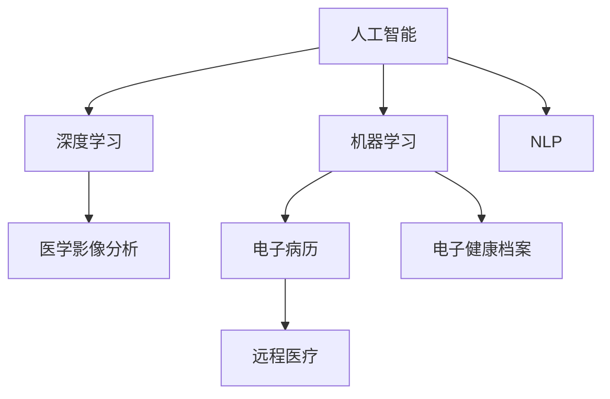

                 

# 人工智能在医疗保健中的应用

## 1. 背景介绍

### 1.1 问题由来
随着大数据、深度学习等技术的发展，人工智能(AI)正在逐步渗透到医疗保健的各个环节，帮助医生更好地诊断疾病、制定治疗方案、管理患者数据，显著提升了医疗服务质量和效率。尤其在2020年新冠疫情期间，AI技术在疫情监测、药物研发、治疗方案推荐等方面发挥了重要作用，展现了其在医疗领域无可比拟的潜力。

### 1.2 问题核心关键点
本文聚焦于人工智能在医疗保健中的应用，主要关注以下几个方面：

1. **疾病诊断**：利用AI算法对医学影像、实验室数据等进行自动诊断，提高诊断准确率，缩短诊断时间。
2. **治疗方案推荐**：结合患者历史数据和当前病情，提供个性化的治疗方案。
3. **患者管理**：通过AI技术实时监控患者的生命体征，预测潜在风险，提前预警，提供个性化的护理建议。
4. **药物研发**：利用AI加速药物筛选和设计，缩短研发周期，降低成本。
5. **公共卫生**：通过大数据分析，预测疾病爆发趋势，制定有效的防控措施。

### 1.3 问题研究意义
人工智能在医疗保健中的应用，有助于提升医疗服务质量、降低医疗成本、改善公共卫生状况。具体如下：

1. **提升诊断精度**：AI技术通过学习大量医学数据，能够快速准确地识别出疾病特征，帮助医生早期诊断，避免延误病情。
2. **个性化医疗**：AI能够根据患者的基因、历史诊疗记录等信息，提供量身定制的治疗方案，提升治疗效果。
3. **数据驱动决策**：AI能够处理和分析海量医疗数据，为医疗决策提供科学依据，提高医疗服务的专业性和精准度。
4. **降低医疗成本**：AI辅助诊疗系统可以替代部分人工操作，降低医疗成本，使更多人能够获得优质的医疗服务。
5. **改善公共健康**：AI能够预测疾病爆发趋势，及时采取预防措施，减少疾病对社会的冲击。

## 2. 核心概念与联系

### 2.1 核心概念概述

为更好地理解人工智能在医疗保健中的应用，本节将介绍几个密切相关的核心概念：

1. **人工智能(AI)**：一种模拟人类智能的技术，包括机器学习、深度学习、自然语言处理等子领域。
2. **机器学习(ML)**：一种让计算机通过学习数据，自动优化模型参数，从而实现特定任务的技术。
3. **深度学习(DL)**：一种基于多层神经网络结构的机器学习算法，适用于大规模复杂数据的处理。
4. **自然语言处理(NLP)**：一种让计算机理解和处理人类语言的技术，包括文本分类、情感分析、机器翻译等任务。
5. **医学影像分析**：利用AI对医学影像进行自动分析，辅助医生诊断疾病。
6. **电子病历(EMR)**：通过数字化手段存储、管理和共享患者病历信息，提升医疗服务效率。
7. **电子健康档案(EHR)**：记录和管理患者从出生到终生的健康信息，支持全面、连续的医疗服务。
8. **远程医疗**：通过AI技术，实现远程诊断、远程治疗和远程咨询，提升医疗服务的可及性。

这些核心概念之间的逻辑关系可以通过以下Mermaid流程图来展示：



这个流程图展示人工智能在医疗保健中的核心概念及其之间的关系：

1. 人工智能技术通过机器学习和深度学习算法，实现对医学影像、文本等复杂数据的处理和分析。
2. 自然语言处理技术帮助AI理解和处理医学术语，提升对文本数据的处理能力。
3. 医学影像分析、电子病历和电子健康档案是AI在医疗领域的主要应用场景，通过AI技术提升医疗服务的效率和质量。
4. 远程医疗通过AI技术实现，提升医疗服务的可及性和便捷性。

## 3. 核心算法原理 & 具体操作步骤
### 3.1 算法原理概述

人工智能在医疗保健中的应用，主要基于机器学习和深度学习算法。其核心思想是通过学习海量医疗数据，构建模型来辅助医疗决策。具体的算法原理如下：

1. **监督学习**：利用已标注的医学数据集，训练模型学习疾病的特征和表现，用于疾病诊断和治疗方案推荐。
2. **非监督学习**：从未标注的医学数据中挖掘出潜在的结构和模式，如聚类、降维等，用于患者数据的分析和预测。
3. **强化学习**：通过模拟医疗决策环境，训练模型在给定状态下选择最佳行动策略，用于个性化医疗和患者管理。
4. **迁移学习**：利用预训练的模型和知识，进行领域内的知识迁移，提升新任务的性能。
5. **增量学习**：持续更新模型参数，适应医疗数据的变化，用于动态更新疾病库和治疗方案。

### 3.2 算法步骤详解

基于人工智能在医疗保健中的应用，以下是一般的算法步骤：

**Step 1: 数据收集与预处理**
- 收集医疗数据，包括医学影像、实验室数据、电子病历、患者自报健康数据等。
- 对数据进行清洗、标注、归一化等预处理，确保数据的质量和一致性。

**Step 2: 选择和训练模型**
- 根据任务类型选择合适的算法，如卷积神经网络(CNN)用于医学影像分析，循环神经网络(RNN)用于序列数据处理，长短期记忆网络(LSTM)用于时间序列预测等。
- 使用已标注的数据集训练模型，调整模型参数，使其能够准确地预测和分类疾病。

**Step 3: 模型评估与优化**
- 在验证集上评估模型的性能，使用准确率、召回率、F1分数等指标衡量模型的效果。
- 根据评估结果，调整模型参数，优化模型结构，提升模型的准确性和鲁棒性。

**Step 4: 模型部署与应用**
- 将训练好的模型部署到实际医疗系统中，用于疾病诊断、治疗方案推荐、患者管理等任务。
- 实时监控模型性能，根据反馈数据不断优化模型，确保其稳定性和可靠性。

**Step 5: 持续学习与迭代**
- 不断收集新的医疗数据，持续更新模型，保持其对新情况的适应能力。
- 定期对模型进行维护和升级，确保其性能和安全性。

### 3.3 算法优缺点

人工智能在医疗保健中的应用具有以下优点：
1. **提高诊断效率**：AI可以快速准确地分析大量医疗数据，辅助医生进行诊断，缩短诊断时间。
2. **提升治疗效果**：个性化医疗方案的推荐，能够根据患者的历史数据和当前病情，提供最合适的治疗方案。
3. **减少医疗成本**：AI能够替代部分人工操作，降低医疗成本，提升医疗服务的可及性。
4. **改善患者管理**：通过实时监控患者的生命体征，预测潜在风险，提前预警，提供个性化的护理建议。
5. **加速药物研发**：AI加速药物筛选和设计，缩短研发周期，降低成本。

同时，这些应用也存在一些局限性：
1. **数据隐私和安全**：医疗数据涉及患者隐私，保护数据安全和隐私是首要任务。
2. **模型可解释性**：AI模型的决策过程缺乏可解释性，对医疗决策的可信度带来挑战。
3. **算法偏见**：AI模型可能会学习到数据中的偏见，导致不公平或歧视性决策。
4. **高昂的研发成本**：AI技术的应用需要大量的研发投入和专业人才，增加了医疗机构的负担。
5. **技术复杂性**：AI技术的实现和维护需要专业知识，一般医疗机构难以独立开发和部署。

### 3.4 算法应用领域

人工智能在医疗保健中的应用主要涵盖以下几个领域：

1. **医学影像分析**：利用AI对医学影像进行自动分析，辅助医生诊断疾病。如CT、MRI、X光影像的自动分割、识别和分析。
2. **电子病历和电子健康档案管理**：通过AI技术，自动汇总和管理患者电子病历和健康档案，提升医疗服务效率。
3. **疾病预测和监测**：利用AI技术对患者健康数据进行实时监测，预测潜在风险，提供个性化的护理建议。
4. **治疗方案推荐**：结合患者历史数据和当前病情，利用AI推荐个性化的治疗方案，提升治疗效果。
5. **药物研发**：利用AI技术加速药物筛选和设计，缩短研发周期，降低成本。
6. **远程医疗**：通过AI技术，实现远程诊断、远程治疗和远程咨询，提升医疗服务的可及性和便捷性。

这些应用领域展示了人工智能在医疗保健中的广泛应用前景，为医疗服务带来了深远的影响。

## 4. 数学模型和公式 & 详细讲解  
### 4.1 数学模型构建

本文将以医学影像分析为例，构建基于卷积神经网络(CNN)的疾病诊断模型。

记输入图像为 $X \in \mathbb{R}^{H \times W \times C}$，其中 $H$、$W$ 和 $C$ 分别代表图像的高度、宽度和通道数。假设模型输出为 $Y \in \{0, 1\}$，表示图像是否为正样本。

定义模型为 $f: \mathbb{R}^{H \times W \times C} \rightarrow \{0, 1\}$，其中 $f$ 是卷积神经网络模型，其输入为 $X$，输出为 $Y$。

假设 $f$ 由若干卷积层、池化层、全连接层组成。用 $h_1, h_2, ..., h_n$ 表示卷积层的输出， $p_1, p_2, ..., p_m$ 表示池化层的输出， $o_1, o_2, ..., o_l$ 表示全连接层的输出。则模型可以表示为：

$$
f(X) = \sigma(o_l)
$$

其中 $\sigma$ 为激活函数，如ReLU、Sigmoid等。

### 4.2 公式推导过程

以下是基于CNN的疾病诊断模型的推导过程：

**Step 1: 输入层**
- 输入图像 $X \in \mathbb{R}^{H \times W \times C}$，经过卷积层提取特征。

**Step 2: 卷积层**
- 使用卷积核对输入图像进行卷积操作，提取图像特征。
- 使用激活函数 $\sigma$ 对卷积结果进行非线性映射。

**Step 3: 池化层**
- 对卷积层输出进行下采样，减小特征图的大小，提高计算效率。

**Step 4: 全连接层**
- 将池化层输出的特征向量输入全连接层，进行线性变换。

**Step 5: 输出层**
- 通过Sigmoid激活函数，将全连接层的输出映射到 $[0, 1]$ 区间，表示图像是否为正样本。

数学上，CNN模型的输出可以表示为：

$$
Y = \sigma(\sum_{i=1}^{n} w_i h_i + b_i)
$$

其中 $w_i$ 和 $b_i$ 分别为卷积层和全连接层的权重和偏置， $n$ 表示卷积层数和全连接层数。

### 4.3 案例分析与讲解

以下以医学影像分析为例，解释CNN在疾病诊断中的应用：

**Case 1: 肺结节检测**
- 使用CT影像作为输入，模型通过卷积层提取图像特征，再通过池化层和全连接层进行特征融合。
- 输出层通过Sigmoid函数将特征映射到 $[0, 1]$ 区间，表示影像中是否存在肺结节。
- 通过大量已标注的CT影像数据训练模型，使其能够准确识别肺结节。

**Case 2: 乳腺癌检测**
- 使用乳腺X光影像作为输入，模型通过卷积层提取影像特征，再通过池化层和全连接层进行特征融合。
- 输出层通过Sigmoid函数将特征映射到 $[0, 1]$ 区间，表示影像中是否存在乳腺癌。
- 通过大量已标注的乳腺X光影像数据训练模型，使其能够准确识别乳腺癌。

通过上述案例分析，可以看出CNN在医学影像分析中的应用，能够自动提取影像特征，实现对疾病的高效检测。

## 5. 项目实践：代码实例和详细解释说明
### 5.1 开发环境搭建

在进行医疗影像分析项目实践前，我们需要准备好开发环境。以下是使用Python进行TensorFlow开发的环境配置流程：

1. 安装Anaconda：从官网下载并安装Anaconda，用于创建独立的Python环境。

2. 创建并激活虚拟环境：
```bash
conda create -n tf-env python=3.8 
conda activate tf-env
```

3. 安装TensorFlow：根据CUDA版本，从官网获取对应的安装命令。例如：
```bash
pip install tensorflow==2.7.0
```

4. 安装TensorFlow Addons：可选，提供一些额外的深度学习组件和优化器。
```bash
pip install tensorflow-addons
```

5. 安装各类工具包：
```bash
pip install numpy pandas scikit-learn matplotlib tqdm jupyter notebook ipython
```

完成上述步骤后，即可在`tf-env`环境中开始项目实践。

### 5.2 源代码详细实现

下面以医学影像分类为例，给出使用TensorFlow构建卷积神经网络(CNN)模型的PyTorch代码实现。

首先，定义模型的架构：

```python
import tensorflow as tf
from tensorflow.keras import layers

def build_model(input_shape):
    model = tf.keras.Sequential([
        layers.Conv2D(32, 3, activation='relu', input_shape=input_shape),
        layers.MaxPooling2D(pool_size=(2, 2)),
        layers.Conv2D(64, 3, activation='relu'),
        layers.MaxPooling2D(pool_size=(2, 2)),
        layers.Flatten(),
        layers.Dense(128, activation='relu'),
        layers.Dense(1, activation='sigmoid')
    ])
    return model
```

然后，定义数据集和数据生成器：

```python
import numpy as np
from tensorflow.keras.preprocessing.image import ImageDataGenerator

input_shape = (256, 256, 1)  # 输入图片形状为256x256，单通道
train_data = np.load('train_data.npy')
train_labels = np.load('train_labels.npy')

train_datagen = ImageDataGenerator(rescale=1./255)
train_generator = train_datagen.flow(train_data, train_labels, batch_size=32)

# 数据生成器示例
train_data = np.random.rand(32, 256, 256, 1)
train_labels = np.random.randint(2, size=32)
train_generator = tf.data.Dataset.from_tensor_slices((train_data, train_labels)).batch(32)
```

接着，训练模型：

```python
batch_size = 32
epochs = 10
learning_rate = 0.001
optimizer = tf.keras.optimizers.Adam(learning_rate)

model = build_model(input_shape)
model.compile(optimizer=optimizer, loss='binary_crossentropy', metrics=['accuracy'])

model.fit(train_generator, epochs=epochs, validation_data=(val_data, val_labels))
```

最后，评估模型：

```python
val_data = np.load('val_data.npy')
val_labels = np.load('val_labels.npy')

val_generator = train_datagen.flow(val_data, val_labels, batch_size=32)

model.evaluate(val_generator)
```

以上就是使用TensorFlow构建卷积神经网络模型的完整代码实现。可以看到，TensorFlow提供了丰富的深度学习组件，使得模型构建和训练变得更加简单和高效。

### 5.3 代码解读与分析

让我们再详细解读一下关键代码的实现细节：

**build_model函数**：
- 定义了卷积神经网络的结构，包括卷积层、池化层、全连接层等。
- 每个卷积层使用ReLU激活函数，池化层使用最大池化操作，全连接层使用ReLU激活函数。
- 输出层使用Sigmoid激活函数，将特征映射到 $[0, 1]$ 区间，表示是否为正样本。

**train_data和train_labels**：
- 使用numpy加载训练数据和标签，并进行预处理，如归一化等。

**ImageDataGenerator**：
- 使用ImageDataGenerator对训练数据进行扩充，包括随机裁剪、旋转、翻转等，增加数据多样性。

**train_generator**：
- 使用ImageDataGenerator生成批次的训练数据和标签，提供给模型进行训练。

**model.compile**：
- 定义模型优化器、损失函数和评估指标，准备模型训练。

**model.fit**：
- 在训练数据生成器上训练模型，使用验证数据进行性能评估。

通过上述代码实现，可以看出TensorFlow在深度学习模型构建和训练方面的强大能力。开发者可以快速迭代和优化模型结构，提升模型性能。

## 6. 实际应用场景
### 6.1 智能诊断系统

智能诊断系统通过AI技术，结合医学影像、实验室数据和病史信息，自动辅助医生进行疾病诊断。具体应用场景包括：

**6.1.1 肺结节检测**
- 使用CT影像作为输入，通过卷积神经网络模型检测肺结节。
- 在大量已标注的CT影像数据上训练模型，使其能够准确识别肺结节。
- 将检测结果可视化，辅助医生进行诊断和治疗。

**6.1.2 乳腺癌检测**
- 使用乳腺X光影像作为输入，通过卷积神经网络模型检测乳腺癌。
- 在大量已标注的乳腺X光影像数据上训练模型，使其能够准确识别乳腺癌。
- 将检测结果可视化，辅助医生进行诊断和治疗。

**6.1.3 糖尿病视网膜病变检测**
- 使用眼底影像作为输入，通过卷积神经网络模型检测糖尿病视网膜病变。
- 在大量已标注的眼底影像数据上训练模型，使其能够准确识别糖尿病视网膜病变。
- 将检测结果可视化，辅助医生进行诊断和治疗。

### 6.2 个性化治疗方案推荐

个性化治疗方案推荐通过AI技术，结合患者的历史数据和当前病情，推荐最适合的治疗方案。具体应用场景包括：

**6.2.1 癌症治疗方案推荐**
- 结合患者的基因信息、病史数据和当前病情，通过深度学习模型推荐最适合的治疗方案。
- 在大量已标注的基因数据和病历数据上训练模型，使其能够准确推荐治疗方案。
- 通过用户界面，将推荐结果展示给医生，辅助其制定治疗方案。

**6.2.2 慢性病管理**
- 结合患者的历史数据和当前病情，通过深度学习模型推荐最适合的治疗方案。
- 在大量已标注的病历数据上训练模型，使其能够准确推荐治疗方案。
- 通过移动应用，将推荐结果展示给患者，辅助其进行自我管理。

### 6.3 患者管理

患者管理通过AI技术，实时监控患者的生命体征，预测潜在风险，提供个性化的护理建议。具体应用场景包括：

**6.3.1 心血管疾病监测**
- 通过穿戴设备获取患者的生命体征数据，如心率、血压、血氧饱和度等。
- 使用深度学习模型对生命体征数据进行实时监控，预测心血管疾病的风险。
- 根据预测结果，提供个性化的护理建议，辅助医生进行干预和治疗。

**6.3.2 慢性病管理**
- 通过穿戴设备获取患者的生命体征数据，如血糖、血压、体重等。
- 使用深度学习模型对生命体征数据进行实时监控，预测慢性病的风险。
- 根据预测结果，提供个性化的护理建议，辅助患者进行自我管理。

### 6.4 药物研发

药物研发通过AI技术，加速药物筛选和设计，缩短研发周期，降低成本。具体应用场景包括：

**6.4.1 药物筛选**
- 利用深度学习模型对化合物数据库进行筛选，筛选出潜在的药物候选。
- 在大量已标注的化合物数据上训练模型，使其能够准确筛选出药物候选。
- 通过实验验证筛选结果，进一步优化药物设计。

**6.4.2 药物设计**
- 利用深度学习模型对药物分子进行设计，生成新的药物分子。
- 在大量已标注的分子数据上训练模型，使其能够准确设计新的药物分子。
- 通过实验验证设计结果，进一步优化药物设计。

## 7. 工具和资源推荐
### 7.1 学习资源推荐

为了帮助开发者系统掌握人工智能在医疗保健中的应用，这里推荐一些优质的学习资源：

1. **Deep Learning Specialization**：由Andrew Ng教授主讲的深度学习课程，系统讲解深度学习原理和实践。
2. **Medical Imaging with Deep Learning**：由Google Research团队主讲的深度学习在医学影像中的应用课程，涵盖卷积神经网络、对抗训练等前沿技术。
3. **AI in Healthcare**：由MIT Media Lab主讲的AI在医疗保健中的应用课程，涵盖疾病预测、个性化治疗等多个主题。
4. **Deep Learning for Medical Imaging**：由UCLA主讲的深度学习在医学影像中的应用课程，讲解卷积神经网络、图像分割等技术。
5. **AI for Healthcare**：由Stanford University主讲的AI在医疗保健中的应用课程，涵盖AI技术在医疗服务中的应用和挑战。

通过对这些资源的学习实践，相信你一定能够快速掌握人工智能在医疗保健中的应用，并用于解决实际的医疗问题。

### 7.2 开发工具推荐

高效的开发离不开优秀的工具支持。以下是几款用于AI在医疗保健中的应用开发的常用工具：

1. **TensorFlow**：由Google开发的开源深度学习框架，提供丰富的深度学习组件和优化器，适合大规模工程应用。
2. **PyTorch**：由Facebook开发的深度学习框架，灵活的计算图和动态执行模式，适合研究和原型开发。
3. **Keras**：由François Chollet开发的深度学习框架，简单易用，适合快速原型开发和模型训练。
4. **PaddlePaddle**：由百度开发的深度学习框架，支持分布式训练和异构计算，适合大规模模型训练。
5. **Jupyter Notebook**：基于IPython的交互式开发环境，支持多种编程语言，适合快速迭代和可视化。

合理利用这些工具，可以显著提升AI在医疗保健中的应用开发效率，加速技术创新和落地。

### 7.3 相关论文推荐

AI在医疗保健中的应用研究源于学界的持续研究。以下是几篇奠基性的相关论文，推荐阅读：

1. **Deep Learning for Medical Image Analysis: A Review**：系统综述深度学习在医学影像分析中的应用，涵盖卷积神经网络、图像分割等技术。
2. **AI in Healthcare: Potential, Challenges, and Opportunities**：综述AI在医疗保健中的应用，探讨其潜力、挑战和未来发展方向。
3. **Artificial Intelligence in Medicine**：介绍AI在医学领域的应用，涵盖疾病预测、个性化治疗等多个主题。
4. **AI for Drug Discovery and Development**：综述AI在药物研发中的应用，探讨其潜力和未来方向。
5. **Patient Monitoring with AI**：介绍AI在患者管理中的应用，涵盖生命体征监控、疾病预测等多个主题。

这些论文代表了大语言模型微调技术的发展脉络。通过学习这些前沿成果，可以帮助研究者把握学科前进方向，激发更多的创新灵感。

## 8. 总结：未来发展趋势与挑战

### 8.1 总结

本文对人工智能在医疗保健中的应用进行了全面系统的介绍。首先阐述了人工智能在医疗保健中的背景和意义，明确了其在疾病诊断、个性化治疗、患者管理、药物研发等诸多领域的应用价值。其次，从原理到实践，详细讲解了机器学习、深度学习等核心算法，并给出了具体的代码实现。同时，本文还广泛探讨了AI在医疗保健中的应用场景，展示了其在医疗服务中的广泛应用前景。

通过本文的系统梳理，可以看到，人工智能在医疗保健中的应用前景广阔，具有巨大的潜力。未来，伴随技术进步和应用推广，AI必将在医疗领域发挥更加重要的作用，为人类健康带来更多福祉。

### 8.2 未来发展趋势

展望未来，人工智能在医疗保健中的应用将呈现以下几个发展趋势：

1. **更精准的疾病诊断**：AI技术将不断提升疾病诊断的准确性和效率，减少误诊和漏诊，为患者提供更优质的医疗服务。
2. **个性化医疗的普及**：AI技术将深入挖掘患者的基因、病史等数据，提供更加个性化和精准的治疗方案，提升治疗效果。
3. **智能化的患者管理**：AI技术将实时监控患者的健康状况，预测潜在风险，提供个性化的护理建议，提升患者管理水平。
4. **高效的药物研发**：AI技术将加速药物筛选和设计，缩短研发周期，降低成本，提升新药上市的速度。
5. **智能化的公共卫生**：AI技术将预测疾病爆发趋势，制定有效的防控措施，提升公共卫生的应急响应能力。

以上趋势凸显了人工智能在医疗保健中的广阔前景。这些方向的探索发展，必将进一步提升医疗服务的质量，为人类健康带来更多福祉。

### 8.3 面临的挑战

尽管人工智能在医疗保健中的应用已经取得了显著进展，但在迈向更加智能化、普适化应用的过程中，仍面临诸多挑战：

1. **数据隐私和安全**：医疗数据涉及患者隐私，保护数据安全和隐私是首要任务。如何在保证数据安全和隐私的同时，充分利用数据进行AI训练，是一个重要问题。
2. **模型可解释性**：AI模型的决策过程缺乏可解释性，对医疗决策的可信度带来挑战。如何在保证模型性能的同时，提高其可解释性，是一个重要问题。
3. **算法偏见**：AI模型可能会学习到数据中的偏见，导致不公平或歧视性决策。如何在模型训练和应用中消除偏见，是一个重要问题。
4. **高昂的研发成本**：AI技术的应用需要大量的研发投入和专业人才，增加了医疗机构的负担。如何在降低成本的同时，提升AI技术的应用效果，是一个重要问题。
5. **技术复杂性**：AI技术的实现和维护需要专业知识，一般医疗机构难以独立开发和部署。如何在降低技术门槛的同时，提升AI技术的应用效果，是一个重要问题。

### 8.4 研究展望

面对AI在医疗保健中所面临的挑战，未来的研究需要在以下几个方面寻求新的突破：

1. **数据隐私保护**：开发隐私保护技术，如联邦学习、差分隐私等，确保数据安全和隐私。
2. **模型可解释性**：引入可解释性技术，如LIME、SHAP等，提高模型的可解释性，提升医疗决策的可信度。
3. **算法偏见消除**：开发偏见消除技术，如对抗训练、公平性约束等，消除模型中的偏见，提升公平性。
4. **成本优化**：开发高效的技术，如模型裁剪、量化加速等，降低AI技术的研发成本，提升应用效果。
5. **技术普及**：开发易于使用的工具和平台，降低技术门槛，帮助医疗机构更轻松地应用AI技术。

这些研究方向的探索，必将引领AI在医疗保健中的应用走向更高的台阶，为医疗服务带来更多创新和突破。面向未来，AI技术还需要与其他技术进行更深入的融合，如知识表示、因果推理、强化学习等，多路径协同发力，共同推动医疗服务的进步。只有勇于创新、敢于突破，才能不断拓展AI在医疗保健中的应用边界，让智能技术更好地造福人类健康。

## 9. 附录：常见问题与解答

**Q1: AI在医疗保健中的应用有哪些？**

A: AI在医疗保健中的应用主要涵盖以下几个方面：

1. **疾病诊断**：利用AI算法对医学影像、实验室数据等进行自动诊断，提高诊断准确率，缩短诊断时间。
2. **治疗方案推荐**：结合患者历史数据和当前病情，提供个性化的治疗方案。
3. **患者管理**：通过AI技术实时监控患者的生命体征，预测潜在风险，提前预警，提供个性化的护理建议。
4. **药物研发**：利用AI加速药物筛选和设计，缩短研发周期，降低成本。
5. **公共卫生**：通过大数据分析，预测疾病爆发趋势，制定有效的防控措施。

**Q2: AI在医疗保健中的应用有哪些挑战？**

A: AI在医疗保健中的应用面临以下几个挑战：

1. **数据隐私和安全**：医疗数据涉及患者隐私，保护数据安全和隐私是首要任务。
2. **模型可解释性**：AI模型的决策过程缺乏可解释性，对医疗决策的可信度带来挑战。
3. **算法偏见**：AI模型可能会学习到数据中的偏见，导致不公平或歧视性决策。
4. **高昂的研发成本**：AI技术的应用需要大量的研发投入和专业人才，增加了医疗机构的负担。
5. **技术复杂性**：AI技术的实现和维护需要专业知识，一般医疗机构难以独立开发和部署。

**Q3: 如何在保证数据安全和隐私的同时，充分利用数据进行AI训练？**

A: 在保证数据安全和隐私的同时，充分利用数据进行AI训练，可以采取以下措施：

1. **联邦学习**：多个机构在本地训练模型，只共享模型参数，不共享原始数据，保护数据隐私。
2. **差分隐私**：通过添加噪声的方式，保护数据隐私，确保数据不被泄露。
3. **数据匿名化**：将数据进行匿名化处理，确保数据不可逆识别。
4. **数据加密**：对数据进行加密处理，确保数据传输过程中的安全性。
5. **多方安全计算**：多个机构在安全的计算环境中进行数据共享和计算，确保数据隐私。

这些措施可以确保数据安全和隐私，同时充分利用数据进行AI训练。

**Q4: 如何提高AI模型的可解释性？**

A: 提高AI模型的可解释性，可以采取以下措施：

1. **模型可视化**：通过可视化技术，展示模型内部结构和工作机制，帮助理解模型决策过程。
2. **可解释性技术**：引入可解释性技术，如LIME、SHAP等，生成模型的局部可解释性结果。
3. **模型设计**：在设计模型时，引入可解释性模块，如规则、决策树等，增强模型的可解释性。
4. **用户交互**：通过用户交互界面，提供模型结果和解释，帮助用户理解模型决策。
5. **多模型集成**：通过集成多个模型的决策结果，提高模型的可解释性，避免单一模型的局限性。

这些措施可以提高AI模型的可解释性，提升医疗决策的可信度。

**Q5: 如何在模型训练和应用中消除算法偏见？**

A: 在模型训练和应用中消除算法偏见，可以采取以下措施：

1. **数据多样性**：确保训练数据的多样性，涵盖不同性别、种族、年龄等人群，避免数据偏见。
2. **对抗训练**：在模型训练过程中，引入对抗样本，提高模型的鲁棒性和泛化能力，消除偏见。
3. **公平性约束**：在模型训练过程中，引入公平性约束，确保模型对不同人群的公平性。
4. **模型审计**：定期审计模型，检测和纠正模型中的偏见，确保模型的公平性。
5. **多样性提升**：在模型应用过程中，确保数据和模型的多样性，避免单一数据和模型的局限性。

这些措施可以在模型训练和应用中消除算法偏见，提升模型的公平性。

---

作者：禅与计算机程序设计艺术 / Zen and the Art of Computer Programming

