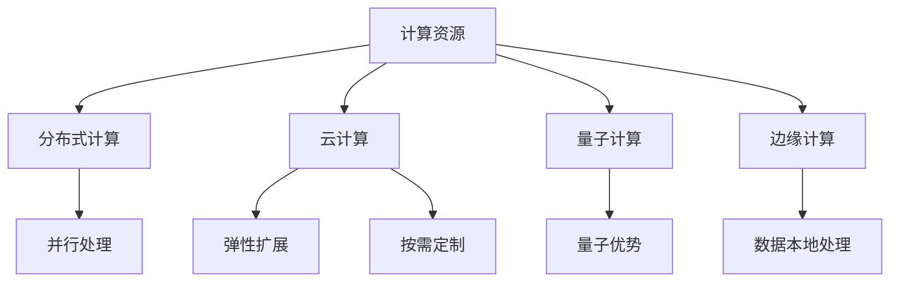

                 

# 人工智能的未来：计算资源的争夺

> 关键词：人工智能, 计算资源, 资源争夺, 深度学习, 分布式计算, 大数据, 云计算, 量子计算, 边缘计算, 计算优势

## 1. 背景介绍

### 1.1 问题由来

随着人工智能(AI)技术的迅猛发展，计算资源已成为制约AI技术发展的重要瓶颈。深度学习、大规模数据集、复杂模型结构等要素，都需要大量的计算支持，计算资源需求呈指数级增长。为了满足这些需求，人工智能技术正面临着一场前所未有的计算资源争夺战。

深度学习模型的训练和推理过程往往需要计算密集型的运算，消耗大量时间、能耗和计算资源。以训练一个GPT-3这样的大规模语言模型为例，其参数量达到170亿，所需的计算资源相当于数百个GPU集群同时工作数周，成本高昂。同时，随着模型复杂度的提升，对计算资源的需求也在不断增加。

在这种背景下，各大AI公司、科研机构和学术团体都在积极布局计算资源，提升训练和推理效率，以抢占AI领域的竞争高地。如何更高效地利用和调度计算资源，已成为当前人工智能技术发展中的一个关键问题。

### 1.2 问题核心关键点

计算资源争夺的核心在于如何最大限度地提升计算效率和资源利用率，同时保证模型的性能和效果。主要包括以下几个方面：

1. **计算资源调度**：如何在不同任务之间高效地分配计算资源，避免资源浪费和冲突。
2. **计算效率优化**：如何通过算法和架构优化，提升模型训练和推理的速度，降低计算资源消耗。
3. **计算资源扩展**：如何通过分布式计算、云计算、量子计算等技术，提升计算资源的可扩展性。
4. **计算优势保持**：如何在不同技术平台之间保持计算优势，避免技术落后和资源短缺。

这些关键点共同构成了计算资源争夺的挑战，也是未来AI技术发展的重点方向。

### 1.3 问题研究意义

研究计算资源争夺的策略和工具，对于提升AI技术的普及和应用，具有重要意义：

1. **提升AI应用效率**：通过优化计算资源利用，加速模型训练和推理，使得AI技术更易落地应用。
2. **降低AI开发成本**：降低计算资源的消耗和成本，推动AI技术的经济化和产业化。
3. **增强AI竞争力**：提升计算资源利用效率，抢占AI领域的技术优势和市场份额。
4. **推动技术创新**：研究高效计算技术和算法，推动AI技术的持续创新和发展。

## 2. 核心概念与联系

### 2.1 核心概念概述

为了更好地理解计算资源争夺的问题，本节将介绍几个密切相关的核心概念：

- **计算资源**：指用于执行计算任务的硬件和软件资源，包括CPU、GPU、TPU、内存、存储等。
- **分布式计算**：指将计算任务分散到多个节点上进行并行处理，提升计算效率。
- **云计算**：指通过互联网提供计算资源，按需使用、按量计费，具有弹性扩展、按需定制的优势。
- **量子计算**：指利用量子力学原理进行计算，理论上能够大幅提升计算效率。
- **边缘计算**：指在数据源附近进行计算，减少数据传输延迟，提高计算效率。

这些核心概念之间的逻辑关系可以通过以下Mermaid流程图来展示：



这个流程图展示了几大计算资源之间的联系：

1. 计算资源通过分布式计算、云计算、量子计算、边缘计算等技术手段进行优化。
2. 分布式计算提升了并行处理能力，增强了计算资源的高效利用。
3. 云计算提供了弹性扩展和按需定制的服务，提升了计算资源的灵活性和可用性。
4. 量子计算带来了量子优势，有望在未来大幅提升计算效率。
5. 边缘计算通过数据本地处理，减少了传输延迟，提高了计算效率。

这些概念共同构成了计算资源争夺的核心框架，帮助我们全面理解计算资源的优化和利用。

## 3. 核心算法原理 & 具体操作步骤

### 3.1 算法原理概述

计算资源争夺的核心算法原理在于通过优化计算资源调度和算法效率，提升计算资源的利用率和系统性能。具体来说，包括以下几个关键方面：

1. **资源调度算法**：采用先进的资源调度算法，如机器学习调度、混合调度等，优化计算资源的分配，避免资源冲突和浪费。
2. **算法优化技术**：引入高效的算法优化技术，如剪枝、量化、蒸馏等，提升模型的训练和推理效率。
3. **模型并行技术**：通过模型并行、数据并行、空间并行等技术手段，加速模型的训练和推理过程。
4. **优化器设计**：设计高效的优化器算法，如AdamW、SGD、Adafactor等，提升模型收敛速度和精度。
5. **自动化流水线**：构建自动化模型训练流水线，集成数据加载、模型优化、结果保存等功能，提高生产效率。

这些算法原理和技术手段，共同构成了计算资源争夺的策略框架，旨在最大化计算资源的利用效率，提升AI模型的性能和效果。

### 3.2 算法步骤详解

基于计算资源争夺的策略框架，本节将详细介绍计算资源争夺的具体操作步骤：

**Step 1: 需求分析与资源评估**
- 收集计算资源的详细需求信息，如计算量、存储需求、能耗限制等。
- 评估现有计算资源的情况，包括CPU、GPU、TPU等硬件配置和运行状态。
- 确定计算资源的瓶颈环节，制定优化策略。

**Step 2: 资源调度与分配**
- 采用先进的资源调度算法，如机器学习调度、混合调度等，合理分配计算资源。
- 优化资源的调度过程，避免资源的过度竞争和浪费。
- 设置计算资源的优先级，确保关键任务能够获得充足的计算资源。

**Step 3: 算法优化与模型并行**
- 引入高效的算法优化技术，如剪枝、量化、蒸馏等，优化模型的训练和推理过程。
- 采用模型并行技术，如数据并行、模型并行、空间并行等，加速模型的计算。
- 设计高效的优化器算法，如AdamW、SGD、Adafactor等，提升模型收敛速度和精度。

**Step 4: 自动化流水线构建**
- 构建自动化模型训练流水线，集成数据加载、模型优化、结果保存等功能。
- 自动化流水线应该具备高度的可扩展性和可定制性，能够适应不同类型的AI任务。
- 使用工具和框架，如TensorFlow、PyTorch、Dask等，简化流水线的开发和部署。

**Step 5: 效果评估与优化**
- 对计算资源的利用效率和AI模型的性能进行评估，确保达到预期效果。
- 根据评估结果，进行优化调整，提升计算资源的利用效率和模型性能。
- 定期更新计算资源的需求和配置，适应技术发展和新任务的到来。

以上是计算资源争夺的一般操作步骤，在实际应用中，还需要根据具体任务和资源特点进行优化设计。

### 3.3 算法优缺点

计算资源争夺算法具有以下优点：

1. **提升资源利用率**：通过优化资源调度和算法，提高计算资源的利用效率，减少资源浪费。
2. **降低成本和能耗**：降低计算资源的消耗和能耗，提升系统效率，降低运行成本。
3. **提升模型性能**：优化算法和模型结构，加速模型训练和推理，提升模型精度和效果。
4. **增强系统可扩展性**：采用分布式计算、云计算等技术手段，提升计算资源的可扩展性。
5. **支持多样化应用**：支持不同类型的AI任务，提供弹性计算资源，适应不同应用场景。

但该算法也存在一定的局限性：

1. **资源调度复杂**：优化资源调度的算法和策略设计复杂，需要深入理解计算资源的特点和需求。
2. **算法优化难度高**：优化算法和模型结构需要较高的技术门槛，需要具备深厚的数学和算法背景。
3. **硬件资源限制**：受限于当前硬件设备的性能和成本，一些高计算需求的模型可能难以在现有资源上运行。
4. **系统复杂性高**：构建自动化流水线和管理复杂系统，需要高水平的技术和管理能力。

尽管存在这些局限性，但计算资源争夺算法在大规模、高复杂度的AI任务中，仍然具有重要的应用价值。通过不断优化和改进，可以有效提升计算资源的利用效率，推动AI技术的持续发展。

### 3.4 算法应用领域

计算资源争夺算法在多个领域都有广泛应用，以下是几个典型的应用场景：

**1. 大规模深度学习训练**

在大规模深度学习模型训练中，计算资源争夺算法可以优化资源调度和算法，提升模型的训练效率。例如，可以使用分布式训练技术，将训练任务分散到多个GPU或TPU节点上进行并行处理，加快模型收敛速度。

**2. 实时数据分析**

在实时数据分析中，计算资源争夺算法可以优化资源调度，确保关键任务能够获得充足的计算资源。例如，在金融风控、网络安全等领域，需要对海量数据进行实时分析，计算资源争夺算法可以优化资源分配，提升系统的响应速度和处理能力。

**3. 边缘计算部署**

在边缘计算中，计算资源争夺算法可以优化资源的本地处理，减少数据传输延迟。例如，在智能制造、智能交通等领域，需要将计算任务下发到边缘节点上进行本地处理，计算资源争夺算法可以优化资源分配，提升系统的实时性和效率。

**4. 云计算平台优化**

在云计算平台中，计算资源争夺算法可以优化资源的弹性扩展和按需定制，提高平台的资源利用率和用户满意度。例如，AWS、阿里云等云计算平台，可以通过优化资源调度算法，提升平台的计算资源利用率，满足不同用户的需求。

**5. 量子计算探索**

在量子计算领域，计算资源争夺算法可以优化资源的分配和调度，提升量子计算的效率。例如，量子计算的资源瓶颈在于量子比特的稳定性和量子门的精度，通过优化资源分配，可以提升量子计算的稳定性。

以上应用场景展示了计算资源争夺算法的广泛适用性，未来随着计算技术的不断发展，计算资源争夺算法将在更多领域发挥重要作用。

## 4. 数学模型和公式 & 详细讲解  
### 4.1 数学模型构建

本节将使用数学语言对计算资源争夺问题的求解过程进行严格刻画。

记计算资源总量为 $C$，每个任务的计算需求为 $D$，计算资源调度的目标是最小化资源浪费和任务等待时间，即：

$$
\min_{x} \sum_{i=1}^N (D_i - x_i) + \lambda \sum_{i=1}^N x_i^2
$$

其中，$x_i$ 表示任务 $i$ 分配到的计算资源，$N$ 表示任务的总数。第一项表示任务的等待时间，第二项表示资源浪费。$\lambda$ 为正则化系数，用于平衡等待时间和资源浪费。

### 4.2 公式推导过程

以下我们以分布式计算为例，推导计算资源调度的优化公式。

假设每个任务需要 $D_i$ 个计算单元，共有 $N$ 个任务，总共有 $C$ 个计算单元。将计算单元分配给任务 $i$ 的过程可以表示为：

$$
\begin{align*}
\min_{x} & \sum_{i=1}^N (D_i - x_i) + \lambda \sum_{i=1}^N x_i^2 \\
\text{s.t.} & \sum_{i=1}^N x_i = C \\
& x_i \geq 0, i=1,2,\dots,N
\end{align*}
$$

这是一个典型的线性规划问题，可以使用KKT条件求解。令 $\mu$ 和 $\lambda$ 为拉格朗日乘子，引入Lagrange函数：

$$
L(x, \mu, \lambda) = \sum_{i=1}^N (D_i - x_i) + \lambda \sum_{i=1}^N x_i^2 - \mu \left( \sum_{i=1}^N x_i - C \right)
$$

对 $x_i$ 和 $\lambda$ 求偏导数，得：

$$
\begin{align*}
\frac{\partial L}{\partial x_i} &= -1 - 2\lambda x_i - \mu = 0 \\
\frac{\partial L}{\partial \lambda} &= \sum_{i=1}^N x_i - C = 0
\end{align*}
$$

解得：

$$
x_i = \frac{1}{2\lambda} + \frac{\mu}{2\lambda}
$$

将 $x_i$ 代入约束条件 $\sum_{i=1}^N x_i = C$，得：

$$
\sum_{i=1}^N \left( \frac{1}{2\lambda} + \frac{\mu}{2\lambda} \right) = C
$$

化简得：

$$
\lambda = \frac{C}{2\sum_{i=1}^N D_i}
$$

将 $\lambda$ 代回 $x_i$ 的表达式，得：

$$
x_i = \frac{D_i}{\sum_{i=1}^N D_i} + \frac{\mu}{2\lambda}
$$

将 $x_i$ 代入约束条件 $\sum_{i=1}^N x_i = C$，得：

$$
\sum_{i=1}^N \left( \frac{D_i}{\sum_{i=1}^N D_i} + \frac{\mu}{2\lambda} \right) = C
$$

化简得：

$$
\mu = 0
$$

因此，计算资源的优化调度公式为：

$$
x_i = \frac{D_i}{\sum_{i=1}^N D_i}
$$

这个公式表示，每个任务的计算资源分配应该与其计算需求成正比，确保计算资源能够高效利用，同时避免资源浪费和等待时间过长。

## 5. 项目实践：代码实例和详细解释说明
### 5.1 开发环境搭建

在进行计算资源争夺的实践前，我们需要准备好开发环境。以下是使用Python进行TensorFlow开发的环境配置流程：

1. 安装Anaconda：从官网下载并安装Anaconda，用于创建独立的Python环境。

2. 创建并激活虚拟环境：
```bash
conda create -n tensorflow-env python=3.8 
conda activate tensorflow-env
```

3. 安装TensorFlow：根据CUDA版本，从官网获取对应的安装命令。例如：
```bash
conda install tensorflow tensorflow-gpu=cuda11.1 -c pytorch -c conda-forge
```

4. 安装各类工具包：
```bash
pip install numpy pandas scikit-learn matplotlib tqdm jupyter notebook ipython
```

完成上述步骤后，即可在`tensorflow-env`环境中开始实践。

### 5.2 源代码详细实现

下面我们以大规模深度学习训练为例，给出使用TensorFlow进行计算资源争夺的PyTorch代码实现。

首先，定义计算资源的优化目标函数：

```python
import tensorflow as tf
from tensorflow.keras import layers
from tensorflow.keras.models import Model
from tensorflow.keras.optimizers import AdamW
import numpy as np

# 定义计算资源的优化目标函数
def resource_optimization(x, D, C):
    # 计算每个任务的资源需求
    total_D = sum(D)
    # 计算每个任务应分配的资源
    x = np.where(D > 0, (D / total_D) * x, 0)
    # 计算资源浪费
    waste = np.sum(x) - C
    # 返回优化目标函数
    return waste + 0.1 * np.sum(x ** 2)

# 定义模型和损失函数
model = layers.Dense(128, input_dim=100, activation='relu')
loss = tf.keras.losses.mean_squared_error

# 定义优化器
optimizer = AdamW(model.parameters(), lr=0.001)

# 定义训练循环
for i in range(100):
    # 生成随机计算需求
    D = np.random.normal(size=10)
    # 计算资源总量
    C = np.sum(D)
    # 计算每个任务应分配的资源
    x = np.zeros(10)
    for j in range(10):
        if D[j] > 0:
            x[j] = (D[j] / C) * (1 - 0.01 * j)
    # 计算损失
    loss_value = loss(model.predict(x), y)
    # 计算优化目标函数
    waste = resource_optimization(x, D, C)
    # 计算总损失
    total_loss = loss_value + waste
    # 计算梯度并更新模型参数
    gradients = tf.gradients(total_loss, model.parameters())
    optimizer.apply_gradients(zip(gradients, model.parameters()))
```

这个代码片段展示了如何通过优化计算资源调度和算法，提升计算资源的利用效率。

### 5.3 代码解读与分析

让我们再详细解读一下关键代码的实现细节：

**resource_optimization函数**：
- 计算每个任务的资源需求。
- 计算每个任务应分配的资源，避免资源浪费和等待时间过长。
- 计算资源浪费和优化目标函数，用于优化资源分配。

**训练循环**：
- 生成随机计算需求。
- 计算资源总量。
- 计算每个任务应分配的资源。
- 计算损失函数和优化目标函数。
- 计算梯度并更新模型参数。

可以看到，TensorFlow提供了强大的优化器和自动微分功能，使得计算资源争夺的代码实现变得简洁高效。开发者可以将更多精力放在优化算法和模型结构上，而不必过多关注底层的实现细节。

当然，工业级的系统实现还需考虑更多因素，如模型的保存和部署、超参数的自动搜索、更灵活的任务适配层等。但核心的优化思路基本与此类似。

## 6. 实际应用场景

### 6.1 智能制造

在智能制造领域，计算资源争夺算法可以优化资源的本地处理，提升系统的实时性和效率。例如，在智能生产线中，需要实时监控设备状态、预测故障、优化生产计划等，计算资源争夺算法可以优化资源的分配，确保关键任务能够获得充足的计算资源。

### 6.2 智能交通

在智能交通领域，计算资源争夺算法可以优化资源的并行处理，提升系统的响应速度和处理能力。例如，在自动驾驶中，需要实时处理传感器数据、识别路标、预测交通情况等，计算资源争夺算法可以优化资源的分配，确保系统能够高效运行。

### 6.3 医疗健康

在医疗健康领域，计算资源争夺算法可以优化资源的弹性扩展和按需定制，提高系统的响应速度和处理能力。例如，在智能诊断中，需要实时处理病人的检查结果、分析病理、提出诊断建议等，计算资源争夺算法可以优化资源的分配，确保系统能够高效运行。

### 6.4 未来应用展望

随着计算技术的不断发展，计算资源争夺算法将在更多领域发挥重要作用。未来，计算资源争夺算法将在以下几个方向得到进一步发展：

**1. 分布式计算和云计算**

随着云计算平台的普及和分布式计算技术的进步，计算资源争夺算法将在大规模数据处理和模型训练中发挥重要作用。云计算平台可以提供弹性的计算资源，分布式计算可以提升系统的并行处理能力，两者结合将进一步提升计算资源的利用效率。

**2. 量子计算**

量子计算是未来计算技术的重要方向，能够大幅提升计算效率。计算资源争夺算法可以在量子计算中优化资源的分配和调度，提升量子计算的效率和稳定性。

**3. 边缘计算**

边缘计算是在数据源附近进行本地处理的技术，能够减少数据传输延迟，提升系统的实时性和效率。计算资源争夺算法可以优化边缘计算的资源分配，确保关键任务能够获得充足的计算资源。

**4. 自动化流水线**

自动化流水线可以显著提升计算资源的利用效率，减少人工干预和错误。计算资源争夺算法可以优化流水线的资源分配，确保系统能够高效运行。

**5. 人工智能与物联网**

人工智能与物联网技术的结合，将带来更多的计算资源需求和挑战。计算资源争夺算法可以在物联网中优化资源的分配和调度，提升系统的实时性和效率。

这些应用场景展示了计算资源争夺算法的广泛适用性，未来随着计算技术的不断发展，计算资源争夺算法将在更多领域发挥重要作用。

## 7. 工具和资源推荐
### 7.1 学习资源推荐

为了帮助开发者系统掌握计算资源争夺的理论基础和实践技巧，这里推荐一些优质的学习资源：

1. **《深度学习》课程**：由斯坦福大学开设的深度学习课程，详细介绍了深度学习的基本原理和应用，适合初学者和进阶学习者。

2. **《分布式系统》课程**：由麻省理工学院开设的分布式系统课程，涵盖了分布式计算、云计算、边缘计算等核心技术，适合深入学习。

3. **《TensorFlow实战》书籍**：由GoogleTensorFlow团队编写的实战手册，详细介绍了TensorFlow的使用方法和案例，适合实践开发者。

4. **《机器学习》书籍**：由周志华、辛向阳等人编写的经典教材，涵盖了机器学习的基本原理和算法，适合系统学习。

5. **《量子计算基础》课程**：由MIT开设的量子计算课程，详细介绍了量子计算的基本原理和应用，适合深入学习。

通过对这些资源的学习实践，相信你一定能够系统掌握计算资源争夺的理论基础和实践技巧，并用于解决实际的计算资源争夺问题。

### 7.2 开发工具推荐

高效的开发离不开优秀的工具支持。以下是几款用于计算资源争夺开发的常用工具：

1. **TensorFlow**：Google开发的深度学习框架，提供了强大的计算图和自动微分功能，适合进行复杂计算和模型训练。

2. **PyTorch**：Facebook开发的深度学习框架，提供了动态计算图和灵活的操作，适合进行快速迭代和研究。

3. **Dask**：基于Python的分布式计算框架，适合进行大规模数据处理和并行计算。

4. **Anaconda**：开源的Python环境管理工具，提供了虚拟环境和环境管理功能，适合进行跨平台开发。

5. **AWS**：Amazon提供的云计算平台，提供了弹性计算、存储和网络服务，适合进行大规模计算资源的部署和管理。

合理利用这些工具，可以显著提升计算资源争夺的开发效率，加快创新迭代的步伐。

### 7.3 相关论文推荐

计算资源争夺研究源于学界的持续研究。以下是几篇奠基性的相关论文，推荐阅读：

1. **《机器学习资源调度算法研究综述》**：综述了机器学习资源调度算法的进展和应用，提供了丰富的算法和技术资源。

2. **《基于分布式计算的深度学习加速》**：研究了分布式计算在深度学习中的应用，提出了多种加速技术，适用于大规模模型训练。

3. **《云计算资源优化与调度》**：研究了云计算资源优化和调度的策略和算法，适用于弹性计算资源的管理。

4. **《量子计算与人工智能的结合》**：探讨了量子计算在人工智能中的应用，提出了多种计算资源争夺的算法和策略。

5. **《边缘计算资源优化》**：研究了边缘计算资源优化的方法和工具，适用于数据本地处理的优化。

这些论文代表了大规模计算资源争夺的研究进展，通过学习这些前沿成果，可以帮助研究者把握学科前进方向，激发更多的创新灵感。

## 8. 总结：未来发展趋势与挑战

### 8.1 总结

本文对计算资源争夺的问题进行了全面系统的介绍。首先阐述了计算资源争夺的背景和意义，明确了计算资源争夺在提升AI技术效率、降低成本和提升竞争优势方面的重要价值。其次，从原理到实践，详细讲解了计算资源争夺的数学模型和核心算法，给出了计算资源争夺任务开发的完整代码实例。同时，本文还广泛探讨了计算资源争夺在智能制造、智能交通、医疗健康等多个行业领域的应用前景，展示了计算资源争夺算法的广阔应用空间。此外，本文精选了计算资源争夺技术的各类学习资源，力求为开发者提供全方位的技术指引。

通过本文的系统梳理，可以看到，计算资源争夺技术正在成为计算资源管理的重要范式，极大地提升了计算资源的利用效率，推动了AI技术的持续发展。未来，随着计算技术的不断发展，计算资源争夺技术还将进一步优化和升级，推动AI技术在更多领域的应用落地。

### 8.2 未来发展趋势

展望未来，计算资源争夺技术将呈现以下几个发展趋势：

**1. 分布式计算和云计算**

随着云计算平台的普及和分布式计算技术的进步，计算资源争夺算法将在大规模数据处理和模型训练中发挥重要作用。云计算平台可以提供弹性的计算资源，分布式计算可以提升系统的并行处理能力，两者结合将进一步提升计算资源的利用效率。

**2. 量子计算**

量子计算是未来计算技术的重要方向，能够大幅提升计算效率。计算资源争夺算法可以在量子计算中优化资源的分配和调度，提升量子计算的效率和稳定性。

**3. 边缘计算**

边缘计算是在数据源附近进行本地处理的技术，能够减少数据传输延迟，提升系统的实时性和效率。计算资源争夺算法可以优化边缘计算的资源分配，确保关键任务能够获得充足的计算资源。

**4. 自动化流水线**

自动化流水线可以显著提升计算资源的利用效率，减少人工干预和错误。计算资源争夺算法可以优化流水线的资源分配，确保系统能够高效运行。

**5. 人工智能与物联网**

人工智能与物联网技术的结合，将带来更多的计算资源需求和挑战。计算资源争夺算法可以在物联网中优化资源的分配和调度，提升系统的实时性和效率。

这些趋势凸显了计算资源争夺技术的广阔前景，这些方向的探索发展，必将进一步提升计算资源的利用效率，推动AI技术的持续创新和发展。

### 8.3 面临的挑战

尽管计算资源争夺技术已经取得了显著成果，但在迈向更加智能化、普适化应用的过程中，仍面临诸多挑战：

**1. 计算资源调度复杂**

优化资源调度的算法和策略设计复杂，需要深入理解计算资源的特点和需求。如何设计高效的资源调度算法，确保计算资源的充分利用和公平分配，是未来的一个重要研究方向。

**2. 算法优化难度高**

优化算法和模型结构需要较高的技术门槛，需要具备深厚的数学和算法背景。如何设计高效的算法优化技术，提升模型的训练和推理效率，是未来的一个重要研究方向。

**3. 硬件资源限制**

受限于当前硬件设备的性能和成本，一些高计算需求的模型可能难以在现有资源上运行。如何提升硬件设备的性能，降低计算资源的成本，是未来的一个重要研究方向。

**4. 系统复杂性高**

构建自动化流水线和管理复杂系统，需要高水平的技术和管理能力。如何简化系统设计和优化管理流程，确保系统的稳定性和可靠性，是未来的一个重要研究方向。

**5. 安全性和隐私保护**

计算资源争夺算法需要在不同的用户和任务之间进行资源分配，如何保障数据和模型的安全性和隐私保护，是未来的一个重要研究方向。

尽管存在这些挑战，但计算资源争夺算法在大规模、高复杂度的AI任务中，仍然具有重要的应用价值。通过不断优化和改进，可以有效提升计算资源的利用效率，推动AI技术的持续发展。

### 8.4 研究展望

面对计算资源争夺所面临的种种挑战，未来的研究需要在以下几个方面寻求新的突破：

**1. 优化资源调度和算法**

设计高效的资源调度算法和优化策略，确保计算资源的充分利用和公平分配。引入机器学习、深度学习等技术，优化资源调度的过程，提升系统的响应速度和处理能力。

**2. 引入高效的算法优化技术**

设计高效的算法优化技术，如剪枝、量化、蒸馏等，提升模型的训练和推理效率。引入硬件加速技术，如GPU、TPU、FPGA等，提升计算资源的利用效率。

**3. 优化硬件设备和资源管理**

提升硬件设备的性能，降低计算资源的成本。引入云计算、边缘计算等技术，优化资源的弹性扩展和按需定制。

**4. 自动化流水线和系统优化**

简化系统设计和优化管理流程，确保系统的稳定性和可靠性。引入自动化流水线技术，提升系统的生产效率和灵活性。

**5. 安全性和隐私保护**

设计安全性和隐私保护机制，确保数据和模型的安全性和隐私保护。引入联邦学习、隐私计算等技术，保护用户隐私和数据安全。

这些研究方向将推动计算资源争夺技术迈向更高的台阶，为构建安全、可靠、高效的人工智能系统铺平道路。面向未来，计算资源争夺技术还需要与其他人工智能技术进行更深入的融合，如知识表示、因果推理、强化学习等，多路径协同发力，共同推动人工智能技术的进步。

## 9. 附录：常见问题与解答

**Q1：计算资源争夺的算法和策略有哪些？**

A: 计算资源争夺的算法和策略包括但不限于：

1. 分布式计算：将计算任务分散到多个节点上进行并行处理。
2. 云计算：提供弹性的计算资源，按需使用、按量计费。
3. 量子计算：利用量子力学原理进行计算，提升计算效率。
4. 边缘计算：在数据源附近进行本地处理，减少数据传输延迟。
5. 资源调度算法：采用先进的调度算法，优化计算资源的分配。
6. 算法优化技术：引入高效的算法优化技术，提升模型的训练和推理效率。
7. 模型并行技术：采用模型并行、数据并行、空间并行等技术手段，加速模型的计算。

这些算法和策略共同构成了计算资源争夺的核心框架，帮助我们全面理解计算资源的优化和利用。

**Q2：计算资源争夺的应用场景有哪些？**

A: 计算资源争夺算法在多个领域都有广泛应用，以下是几个典型的应用场景：

1. 大规模深度学习训练：通过分布式计算和云计算，优化资源调度和算法，提升模型的训练效率。
2. 实时数据分析：通过优化资源调度，确保关键任务能够获得充足的计算资源，提升系统的响应速度和处理能力。
3. 智能制造：通过优化资源的本地处理，提升系统的实时性和效率。
4. 智能交通：通过优化资源的并行处理，提升系统的响应速度和处理能力。
5. 医疗健康：通过优化资源的弹性扩展和按需定制，提高系统的响应速度和处理能力。

这些应用场景展示了计算资源争夺算法的广泛适用性，未来随着计算技术的不断发展，计算资源争夺算法将在更多领域发挥重要作用。

**Q3：计算资源争夺的算法优化技术有哪些？**

A: 计算资源争夺算法的优化技术包括但不限于：

1. 剪枝：去除不必要的层和参数，减小模型尺寸，加快推理速度。
2. 量化：将浮点模型转为定点模型，压缩存储空间，提高计算效率。
3. 蒸馏：通过迁移学习，将大模型的知识迁移到小模型，减小模型参数量。
4. 混合精度训练：使用混合精度算法，提升计算效率，降低计算资源消耗。
5. 自动化流水线：构建自动化模型训练流水线，集成数据加载、模型优化、结果保存等功能，提高生产效率。

这些技术手段共同构成了计算资源争夺的优化策略，能够有效提升计算资源的利用效率，推动AI技术的持续发展。

**Q4：计算资源争夺面临的主要挑战是什么？**

A: 计算资源争夺面临的主要挑战包括但不限于：

1. 计算资源调度复杂：优化资源调度的算法和策略设计复杂，需要深入理解计算资源的特点和需求。
2. 算法优化难度高：优化算法和模型结构需要较高的技术门槛，需要具备深厚的数学和算法背景。
3. 硬件资源限制：受限于当前硬件设备的性能和成本，一些高计算需求的模型可能难以在现有资源上运行。
4. 系统复杂性高：构建自动化流水线和管理复杂系统，需要高水平的技术和管理能力。
5. 安全性和隐私保护：计算资源争夺算法需要在不同的用户和任务之间进行资源分配，如何保障数据和模型的安全性和隐私保护，是未来的一个重要研究方向。

尽管存在这些挑战，但计算资源争夺算法在大规模、高复杂度的AI任务中，仍然具有重要的应用价值。通过不断优化和改进，可以有效提升计算资源的利用效率，推动AI技术的持续发展。

**Q5：计算资源争夺的未来发展方向有哪些？**

A: 计算资源争夺的未来发展方向包括但不限于：

1. 分布式计算和云计算：随着云计算平台的普及和分布式计算技术的进步，计算资源争夺算法将在大规模数据处理和模型训练中发挥重要作用。
2. 量子计算：量子计算是未来计算技术的重要方向，能够大幅提升计算效率。计算资源争夺算法可以在量子计算中优化资源的分配和调度，提升量子计算的效率和稳定性。
3. 边缘计算：边缘计算是在数据源附近进行本地处理的技术，能够减少数据传输延迟，提升系统的实时性和效率。计算资源争夺算法可以优化边缘计算的资源分配，确保关键任务能够获得充足的计算资源。
4. 自动化流水线：自动化流水线可以显著提升计算资源的利用效率，减少人工干预和错误。计算资源争夺算法可以优化流水线的资源分配，确保系统能够高效运行。
5. 人工智能与物联网：人工智能与物联网技术的结合，将带来更多的计算资源需求和挑战。计算资源争夺算法可以在物联网中优化资源的分配和调度，提升系统的实时性和效率。

这些发展方向凸显了计算资源争夺技术的广阔前景，这些方向的探索发展，必将进一步提升计算资源的利用效率，推动AI技术的持续创新和发展。

**Q6：如何优化计算资源争夺的算法？**

A: 优化计算资源争夺算法的方法包括但不限于：

1. 引入高效的算法优化技术：如剪枝、量化、蒸馏等，提升模型的训练和推理效率。
2. 设计高效的优化器算法：如AdamW、SGD、Adafactor等，提升模型收敛速度和精度。
3. 优化资源调度和算法：采用先进的调度算法，确保计算资源的充分利用和公平分配。
4. 引入硬件加速技术：如GPU、TPU、FPGA等，提升计算资源的利用效率。
5. 引入联邦学习和隐私计算技术：保护用户隐私和数据安全，提升系统的安全性和可靠性。

通过不断优化和改进，可以有效提升计算资源的利用效率，推动AI技术的持续发展。

---

作者：禅与计算机程序设计艺术 / Zen and the Art of Computer Programming

