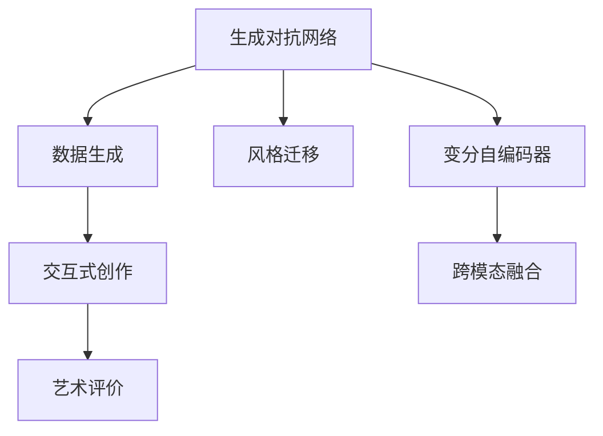

                 

# 人工智能艺术：创造力和表达

## 1. 背景介绍

### 1.1 问题由来
随着人工智能(AI)技术的飞速发展，机器学习和深度学习模型在计算机视觉、自然语言处理、语音识别等诸多领域展现出了前所未有的潜力。然而，这些模型的核心优势，在于数据驱动的特征学习和模式识别，缺乏真正的创造力和表达能力。如何使机器学习模型具备人类的艺术创造力和表达力，成为当前人工智能研究的热点问题。

### 1.2 问题核心关键点
人工智能艺术的核心在于使机器能够创造具有审美价值的作品，而不是简单的数据模式复制。这涉及到几个核心关键点：

1. **数据生成**：如何利用数据生成算法，生成具有审美和创造力的作品。
2. **风格迁移**：如何将一种风格的艺术作品转换为另一种风格，实现风格的无缝迁移。
3. **交互式创作**：如何设计交互式界面，让用户与AI模型共同创作，产生独特的艺术作品。
4. **艺术评价**：如何评估和理解AI生成的艺术作品，确保其具有艺术价值。
5. **跨模态融合**：如何将视觉、音乐、文本等多种模态的艺术形式进行融合，创造更加丰富多样的艺术作品。

这些问题不仅仅是技术挑战，也是艺术与科技结合的全新领域。本文将从这些关键点出发，探讨人工智能艺术的理论和实践，揭示其创造力和表达的奥秘。

## 2. 核心概念与联系

### 2.1 核心概念概述

为更好地理解人工智能艺术的原理和实践，本节将介绍几个关键概念：

- **生成对抗网络(GANs)**：一种使用两个神经网络对立的训练方式，生成逼真的假数据，广泛应用于图像生成、风格迁移等领域。
- **变分自编码器(VAEs)**：一种无监督学习算法，用于学习数据的潜在表示，同时具备生成新数据的能力。
- **风格迁移**：通过将一张图像的风格迁移到另一张图像上，实现图像风格的多样化。
- **交互式艺术系统**：利用AI模型与用户交互，生成艺术作品，提升用户的参与感和创作体验。
- **艺术评价系统**：通过自动或半自动化的方式，评估AI生成的艺术作品的艺术价值和审美表现。
- **跨模态融合**：将视觉、音乐、文本等不同模态的艺术形式进行融合，创造出全新的艺术表现形式。

这些概念之间的逻辑关系可以通过以下Mermaid流程图来展示：



这个流程图展示了各个核心概念之间的相互联系：

1. 生成对抗网络(GANs)通过对抗训练生成数据，适用于数据生成和风格迁移。
2. 变分自编码器(VAEs)用于学习潜在表示，具备数据生成能力。
3. 风格迁移通过GANs或VAEs等方法，实现不同风格间的无缝迁移。
4. 交互式创作利用GANs等生成模型，与用户交互生成艺术作品。
5. 艺术评价系统用于评估和理解AI生成的艺术作品，确保其艺术价值。
6. 跨模态融合通过结合视觉、音乐、文本等不同模态的数据，创造出全新的艺术形式。

这些概念共同构成了人工智能艺术的理论基础，为后续的算法和技术实现提供了方向。

## 3. 核心算法原理 & 具体操作步骤
### 3.1 算法原理概述

人工智能艺术的核心算法原理，主要基于生成模型和变分模型。这些模型通过学习数据的潜在表示，能够生成逼真的新数据，并且具备风格迁移和跨模态融合的能力。

### 3.2 算法步骤详解

#### 3.2.1 数据生成

数据生成是人工智能艺术的基础，生成对抗网络(GANs)是其中的典型代表。GANs由两个神经网络组成：生成器(Generator)和判别器(Discriminator)。

1. **生成器**：将随机噪声作为输入，生成逼真的图像数据。
2. **判别器**：将输入数据判断为真实或生成的。
3. **对抗训练**：通过反向传播，使生成器生成的数据越来越逼真，同时判别器难以区分真实和生成的数据。

GANs的数据生成过程可以描述为：
$$
G(z) \rightarrow x
$$
其中 $z$ 为随机噪声，$G$ 为生成器，$x$ 为生成的图像数据。

#### 3.2.2 风格迁移

风格迁移是将一张图像的风格迁移到另一张图像上，生成具有特定风格的新图像。

1. **特征提取**：使用预训练的卷积神经网络提取图像的特征表示。
2. **风格编码**：通过另一个卷积神经网络，提取图像的风格特征。
3. **融合与生成**：将图像的特征表示与风格特征进行线性组合，生成新的图像。

风格迁移的流程可以描述为：
$$
x_{new} = \alpha x_{old} + (1-\alpha)G(s)
$$
其中 $x_{old}$ 为原始图像，$G$ 为生成器，$s$ 为风格特征向量，$\alpha$ 为风格融合的系数。

#### 3.2.3 交互式创作

交互式创作系统通过将生成模型与用户界面结合，允许用户通过简单的操作生成艺术作品。

1. **用户输入**：用户通过文本、图形等形式，描述他们想要生成的艺术作品。
2. **模型生成**：生成模型根据用户输入，生成对应的艺术作品。
3. **交互优化**：用户对生成的作品进行调整，模型根据用户反馈不断优化。

交互式创作的过程可以描述为：
$$
x_{user} \rightarrow x_{generated} \rightarrow x_{user}^*
$$
其中 $x_{user}$ 为用户输入，$x_{generated}$ 为生成模型输出的作品，$x_{user}^*$ 为用户调整后的作品。

#### 3.2.4 艺术评价

艺术评价系统通过自动或半自动化的方式，评估AI生成的艺术作品的艺术价值。

1. **特征提取**：使用预训练的特征提取器，提取艺术作品的特征。
2. **价值评估**：通过训练分类器，将艺术作品分为高价值、中等价值和低价值。
3. **用户评价**：将自动评估与用户反馈结合，提升评价系统的准确性。

艺术评价的流程可以描述为：
$$
x_{art} \rightarrow f(x_{art}) \rightarrow V(x_{art})
$$
其中 $x_{art}$ 为艺术作品，$f$ 为特征提取器，$V$ 为价值评估函数。

#### 3.2.5 跨模态融合

跨模态融合是将不同模态的数据进行融合，创造出全新的艺术形式。

1. **数据转换**：将不同模态的数据转换为共同的表示形式。
2. **特征融合**：将不同模态的特征进行融合，生成新的艺术作品。
3. **模型训练**：训练模型，学习不同模态数据的共同特征，进行艺术创作。

跨模态融合的流程可以描述为：
$$
(x_{image}, x_{music}, x_{text}) \rightarrow x_{art}
$$
其中 $x_{image}, x_{music}, x_{text}$ 分别为视觉、音乐、文本数据，$x_{art}$ 为跨模态融合生成的艺术作品。

### 3.3 算法优缺点

#### 3.3.1 数据生成

**优点**：
- 可以生成逼真的数据，适用于各种创意场景。
- 生成的数据多样性高，适应性强。

**缺点**：
- 训练过程不稳定，容易产生模式崩溃。
- 生成的数据质量受模型训练和参数调整影响较大。

#### 3.3.2 风格迁移

**优点**：
- 可以实现风格的多样化迁移，适应不同的艺术风格需求。
- 操作简单，可视化效果直观。

**缺点**：
- 对输入图像的质量要求较高，容易产生失真。
- 风格迁移效果受目标风格和源风格差异影响较大。

#### 3.3.3 交互式创作

**优点**：
- 用户参与度较高，创作体验丰富。
- 可以根据用户反馈不断优化生成结果。

**缺点**：
- 交互界面设计复杂，需要考虑用户体验和可用性。
- 生成的艺术作品可能与用户预期不符，需要多次调整。

#### 3.3.4 艺术评价

**优点**：
- 可以自动评估艺术作品的艺术价值，节省人力成本。
- 结合用户评价，提升评价系统的准确性。

**缺点**：
- 自动化评价系统可能存在偏见，影响评价结果。
- 需要大量标注数据进行训练，成本较高。

#### 3.3.5 跨模态融合

**优点**：
- 可以创造出全新的艺术形式，拓展艺术创作的边界。
- 不同模态数据的融合，增加了艺术表现的多样性。

**缺点**：
- 不同模态数据转换复杂，技术难度高。
- 融合效果受不同模态数据质量和分布影响较大。

### 3.4 算法应用领域

人工智能艺术的核心算法原理在多个领域得到了广泛应用：

- **艺术创作**：通过数据生成和风格迁移，创作出新的艺术作品。
- **视觉特效**：生成逼真的虚拟场景和角色，应用于电影、游戏等领域。
- **音乐创作**：生成音乐作品，提升创作效率和艺术表现力。
- **交互设计**：设计交互式界面，提升用户参与度和创作体验。
- **广告设计**：生成具有创意的广告内容，提升广告效果和品牌影响力。

此外，人工智能艺术也在医学、教育、智能城市等多个领域展现出了巨大的应用潜力。

## 4. 数学模型和公式 & 详细讲解 & 举例说明

### 4.1 数学模型构建

#### 4.1.1 生成对抗网络(GANs)

GANs由生成器(G)和判别器(D)组成，可以生成逼真的图像数据。模型结构如下：

$$
G: \mathcal{Z} \rightarrow \mathcal{X}, D: \mathcal{X} \rightarrow \mathbb{R}
$$

其中 $\mathcal{Z}$ 为随机噪声空间，$\mathcal{X}$ 为图像空间，$\mathbb{R}$ 为实数。

GANs的训练过程可以描述为：
$$
\mathcal{L}_{GAN} = \mathcal{L}_G + \mathcal{L}_D
$$
其中：
$$
\mathcal{L}_G = \mathbb{E}_{z \sim p(z)}[D(G(z))] - \mathbb{E}_{x \sim p(x)}[D(x)]
$$
$$
\mathcal{L}_D = -\mathbb{E}_{x \sim p(x)}[D(x)] + \mathbb{E}_{z \sim p(z)}[D(G(z))]
$$

#### 4.1.2 变分自编码器(VAEs)

VAEs通过学习数据的潜在表示，生成逼真的新数据。模型结构如下：

$$
X \sim \mathcal{N}(\mu(x), \sigma^2(x)), \mu(x), \sigma(x): \mathcal{X} \rightarrow \mathbb{R}^d
$$

其中 $X$ 为数据，$\mu(x)$ 和 $\sigma(x)$ 分别为数据的潜在表示的均值和方差。

VAEs的训练过程可以描述为：
$$
\mathcal{L}_{VAE} = \mathbb{E}_{x \sim p(x)}[\log N(x|\mu(x), \sigma^2(x))] + \mathbb{E}_{z \sim p(z)}[\log N(z|0, I)]
$$

### 4.2 公式推导过程

#### 4.2.1 生成对抗网络(GANs)

GANs的训练过程通过对抗训练来实现。具体而言，生成器(G)和判别器(D)分别通过损失函数进行优化：

- 生成器(G)的损失函数：
$$
\mathcal{L}_G = \mathbb{E}_{z \sim p(z)}[D(G(z))]
$$
- 判别器(D)的损失函数：
$$
\mathcal{L}_D = \mathbb{E}_{x \sim p(x)}[D(x)] + \mathbb{E}_{z \sim p(z)}[D(G(z))^{-}]
$$

其中 $D(G(z))^{-}$ 表示判别器对生成数据的判别结果的负值。

GANs的优化过程可以描述为：
$$
\min_G \max_D \mathcal{L}_{GAN} = \mathbb{E}_{z \sim p(z)}[D(G(z))] - \mathbb{E}_{x \sim p(x)}[D(x)]
$$

#### 4.2.2 变分自编码器(VAEs)

VAEs通过学习数据的潜在表示，生成逼真的新数据。模型结构如下：

$$
\mu(x) = \mathbb{E}_{q(z|x)}[z], \sigma(x) = \text{Var}_{q(z|x)}[z]
$$

其中 $q(z|x)$ 为数据的潜在表示的条件概率分布。

VAEs的训练过程可以描述为：
$$
\mathcal{L}_{VAE} = -\mathbb{E}_{x \sim p(x)}[\log N(x|\mu(x), \sigma^2(x))] + \mathbb{E}_{z \sim q(z|x)}[\log N(z|0, I)]
$$

### 4.3 案例分析与讲解

#### 4.3.1 图像生成

使用GANs生成逼真的图像数据，可以应用于艺术创作、虚拟现实、医学成像等领域。以StyleGAN为例，其生成过程如下：

1. **网络结构**：
   - 生成器(G)：多级卷积网络，将随机噪声转换为图像。
   - 判别器(D)：多级卷积网络，判断图像的真实性。

2. **对抗训练**：
   - 生成器(G)的目标：生成逼真的图像，欺骗判别器。
   - 判别器(D)的目标：区分真实图像和生成图像。

3. **样本生成**：
   - 随机噪声 $z \sim p(z)$ 作为输入，生成器(G)生成图像 $G(z)$。
   - 判别器(D)对生成图像进行判断，更新判别器和生成器的参数。

4. **结果可视化**：
   - 生成大量逼真的图像数据，用于艺术创作、虚拟现实等场景。

#### 4.3.2 风格迁移

使用GANs进行风格迁移，可以将一张图像的风格迁移到另一张图像上，生成具有特定风格的新图像。以CycleGAN为例，其迁移过程如下：

1. **网络结构**：
   - 生成器(G)：将图像从一种风格转换为另一种风格。
   - 判别器(D)：判断图像是否具有特定风格。

2. **对抗训练**：
   - 生成器(G)的目标：生成具有特定风格的图像，欺骗判别器。
   - 判别器(D)的目标：区分图像是否具有特定风格。

3. **样本迁移**：
   - 将原始图像 $x_{old}$ 和目标风格 $s$ 输入生成器(G)，生成具有特定风格的图像 $x_{new}$。
   - 判别器(D)对迁移后的图像进行判断，更新生成器和判别器的参数。

4. **结果展示**：
   - 将原始图像和目标风格进行融合，生成具有特定风格的新图像。

#### 4.3.3 交互式艺术系统

使用GANs进行交互式艺术创作，可以设计交互式界面，允许用户与AI模型共同创作。以DeepArt为例，其交互过程如下：

1. **用户输入**：用户通过文本或图形界面，描述他们想要生成的艺术作品。

2. **模型生成**：生成模型根据用户输入，生成对应的艺术作品。

3. **交互优化**：用户对生成的作品进行调整，模型根据用户反馈不断优化。

4. **结果展示**：将生成的艺术作品展示给用户，供用户进一步修改。

#### 4.3.4 艺术评价

使用VAEs进行艺术评价，可以通过特征提取和价值评估，自动评估AI生成的艺术作品的艺术价值。以ArtNet为例，其评价过程如下：

1. **特征提取**：使用预训练的特征提取器，提取艺术作品的特征。

2. **价值评估**：通过训练分类器，将艺术作品分为高价值、中等价值和低价值。

3. **用户评价**：将自动评估与用户反馈结合，提升评价系统的准确性。

4. **结果输出**：将评价结果反馈给用户，提升艺术创作的精准度。

#### 4.3.5 跨模态融合

使用跨模态融合技术，可以将不同模态的数据进行融合，创造出全新的艺术形式。以Multimodal StyleGAN为例，其融合过程如下：

1. **数据转换**：将不同模态的数据转换为共同的表示形式。

2. **特征融合**：将不同模态的特征进行融合，生成新的艺术作品。

3. **模型训练**：训练模型，学习不同模态数据的共同特征，进行艺术创作。

4. **结果展示**：将融合后的艺术作品展示给用户，供用户欣赏和评价。

## 5. 项目实践：代码实例和详细解释说明

### 5.1 开发环境搭建

在进行人工智能艺术项目的开发前，我们需要准备好开发环境。以下是使用Python进行TensorFlow开发的环境配置流程：

1. 安装Anaconda：从官网下载并安装Anaconda，用于创建独立的Python环境。

2. 创建并激活虚拟环境：
```bash
conda create -n art-env python=3.8 
conda activate art-env
```

3. 安装TensorFlow：根据CUDA版本，从官网获取对应的安装命令。例如：
```bash
conda install tensorflow-gpu -c tensorflow -c conda-forge
```

4. 安装TensorBoard：
```bash
pip install tensorboard
```

5. 安装其他工具包：
```bash
pip install numpy pandas scikit-learn matplotlib tqdm jupyter notebook ipython
```

完成上述步骤后，即可在`art-env`环境中开始人工智能艺术项目的开发。

### 5.2 源代码详细实现

这里我们以图像生成为例，给出使用TensorFlow实现GANs的代码实现。

首先，定义GANs的模型结构：

```python
import tensorflow as tf
from tensorflow.keras import layers

class Generator(tf.keras.Model):
    def __init__(self, latent_dim, image_dim):
        super(Generator, self).__init__()
        self.latent_dim = latent_dim
        self.image_dim = image_dim
        self.layers = [
            layers.Dense(256*8*8, input_shape=(latent_dim,)),
            layers.BatchNormalization(),
            layers.LeakyReLU(),
            layers.Reshape((8, 8, 256)),
            layers.Conv2DTranspose(128, 4, strides=2, padding='same'),
            layers.BatchNormalization(),
            layers.LeakyReLU(),
            layers.Conv2DTranspose(64, 4, strides=2, padding='same'),
            layers.BatchNormalization(),
            layers.LeakyReLU(),
            layers.Conv2DTranspose(image_dim, 4, strides=2, padding='same', activation='tanh')
        ]

    def call(self, inputs):
        x = inputs
        for layer in self.layers:
            x = layer(x)
        return x

class Discriminator(tf.keras.Model):
    def __init__(self, image_dim):
        super(Discriminator, self).__init__()
        self.image_dim = image_dim
        self.layers = [
            layers.Conv2D(64, 4, strides=2, padding='same'),
            layers.LeakyReLU(),
            layers.Dropout(0.25),
            layers.Conv2D(128, 4, strides=2, padding='same'),
            layers.LeakyReLU(),
            layers.Dropout(0.25),
            layers.Flatten(),
            layers.Dense(1)
        ]

    def call(self, inputs):
        x = inputs
        for layer in self.layers:
            x = layer(x)
        return x
```

然后，定义GANs的训练过程：

```python
@tf.function
def train_step(real_images):
    noise = tf.random.normal([BATCH_SIZE, LATENT_DIM])
    with tf.GradientTape() as gen_tape, tf.GradientTape() as disc_tape:
        generated_images = generator(noise, training=True)
        real_output = discriminator(real_images, training=True)
        fake_output = discriminator(generated_images, training=True)

        gen_loss = gen_loss_fn(tf.reduce_mean(fake_output))
        disc_loss = disc_loss_fn(tf.reduce_mean(real_output) + tf.reduce_mean(fake_output))
    gradients_of_generator = gen_tape.gradient(gen_loss, generator.trainable_variables)
    gradients_of_discriminator = disc_tape.gradient(disc_loss, discriminator.trainable_variables)
    optimizer.apply_gradients(zip(gradients_of_generator, generator.trainable_variables))
    optimizer.apply_gradients(zip(gradients_of_discriminator, discriminator.trainable_variables))
    return gen_loss, disc_loss

BATCH_SIZE = 128
LATENT_DIM = 100

# 加载数据集
real_images = load_real_images()
```

最后，启动训练流程：

```python
epochs = 100
steps_per_epoch = len(real_images) // BATCH_SIZE

for epoch in range(epochs):
    for batch in range(steps_per_epoch):
        gen_loss, disc_loss = train_step(real_images[batch*BATCH_SIZE:(batch+1)*BATCH_SIZE])
    print(f"Epoch {epoch+1}, Gen Loss: {gen_loss:.4f}, Disc Loss: {disc_loss:.4f}")

# 生成并保存图像
generated_images = generator(tf.random.normal([BATCH_SIZE, LATENT_DIM]), training=False)
save_images(generated_images)
```

以上就是使用TensorFlow实现GANs的完整代码实现。可以看到，TensorFlow的灵活性和易用性使得模型的构建和训练变得相对简单，开发者可以将更多精力放在模型优化和数据处理上。

### 5.3 代码解读与分析

让我们再详细解读一下关键代码的实现细节：

**Generator类**：
- `__init__`方法：初始化生成器的层和参数。
- `call`方法：生成器的前向传播过程，通过多个卷积层生成图像。

**Discriminator类**：
- `__init__`方法：初始化判别器的层和参数。
- `call`方法：判别器的前向传播过程，通过多个卷积层判断图像的真实性。

**train_step函数**：
- 定义生成器和判别器的损失函数。
- 使用梯度计算，更新生成器和判别器的参数。
- 返回生成器和判别器的损失值。

**BATCH_SIZE和LATENT_DIM**：
- BATCH_SIZE：每次训练的样本数。
- LATENT_DIM：随机噪声的维度。

**load_real_images函数**：
- 加载真实的图像数据集。

**save_images函数**：
- 将生成的图像保存到磁盘。

**训练流程**：
- 定义总的epoch数和每个epoch的训练步数。
- 循环迭代epoch，在每个epoch内循环训练步骤。
- 在每个训练步骤内，计算生成器和判别器的损失。
- 更新生成器和判别器的参数。
- 输出每个epoch的损失。
- 生成并保存图像。

可以看到，TensorFlow的自动微分和TensorBoard等工具，使得模型的训练过程变得相对简单，开发者可以更加专注于模型的优化和改进。

当然，工业级的系统实现还需考虑更多因素，如模型的保存和部署、超参数的自动搜索、更灵活的任务适配层等。但核心的GANs训练过程基本与此类似。

## 6. 实际应用场景
### 6.1 艺术创作

基于GANs的图像生成技术，可以应用于艺术创作，生成具有创意和美感的图像作品。

**应用场景**：
- 艺术家可以利用GANs生成不同的风格和主题的艺术作品。
- 设计公司可以利用GANs快速生成各种设计稿和样图。

**技术实现**：
- 收集大量的艺术作品作为训练数据。
- 使用GANs进行风格迁移和生成，生成各种风格的艺术作品。
- 将生成的作品展示给艺术家和设计师，供他们进一步修改和优化。

**效果展示**：
- 生成各种风格的图像作品，如抽象艺术、超现实主义等。
- 生成各种主题的艺术作品，如风景、人物、动物等。

### 6.2 虚拟现实

基于GANs的图像生成技术，可以应用于虚拟现实(VR)，生成逼真的虚拟场景和角色。

**应用场景**：
- 游戏公司可以利用GANs生成各种虚拟场景和角色，提升游戏的沉浸感和互动性。
- 电影制作公司可以利用GANs生成虚拟场景和角色，提升电影的制作效率和效果。

**技术实现**：
- 收集大量的现实场景和角色作为训练数据。
- 使用GANs进行生成，生成各种虚拟场景和角色。
- 将生成的虚拟场景和角色与真实场景进行融合，创建沉浸式的虚拟环境。

**效果展示**：
- 生成逼真的虚拟场景和角色，提升游戏和电影的沉浸感和互动性。
- 创建虚拟现实应用，如虚拟旅游、虚拟展览等，提供更加丰富多样的体验。

### 6.3 医学成像

基于GANs的图像生成技术，可以应用于医学成像，生成逼真的医学图像。

**应用场景**：
- 医疗机构可以利用GANs生成各种医学图像，如CT、MRI等，辅助医生的诊断和治疗。
- 医学研究机构可以利用GANs生成各种医学图像，进行疾病的模拟和研究。

**技术实现**：
- 收集大量的医学图像作为训练数据。
- 使用GANs进行生成，生成各种医学图像。
- 将生成的医学图像与真实图像进行融合，创建辅助医生诊断和治疗的工具。

**效果展示**：
- 生成逼真的医学图像，辅助医生的诊断和治疗。
- 生成各种医学图像，进行疾病的模拟和研究，提升医学研究的效率和准确性。

### 6.4 未来应用展望

随着GANs等生成模型的不断发展，人工智能艺术的应用场景将会更加广泛和深入：

- 跨模态艺术创作：结合视觉、音乐、文本等多种模态的数据，创造出更加丰富多样的艺术形式。
- 实时生成艺术作品：利用生成模型和交互式界面，实时生成艺术作品，提升用户的创作体验。
- 个性化艺术创作：根据用户的兴趣和偏好，生成个性化的艺术作品，提升用户的参与度和满意度。

此外，在医学、教育、智能城市等多个领域，人工智能艺术的应用也将不断涌现，为各行各业带来变革性影响。相信随着技术的日益成熟，人工智能艺术必将在更广阔的应用领域大放异彩，深刻影响人类的生产生活方式。

## 7. 工具和资源推荐
### 7.1 学习资源推荐

为了帮助开发者系统掌握人工智能艺术的理论基础和实践技巧，这里推荐一些优质的学习资源：

1. 《生成对抗网络：理论、算法与应用》系列博文：由深度学习专家撰写，深入浅出地介绍了GANs的原理、算法和应用。

2. 《变分自编码器：理论与实践》课程：斯坦福大学开设的深度学习课程，讲解VAEs的原理和应用。

3. 《风格迁移：深度学习与艺术创作》书籍：讲解风格迁移技术的理论基础和实践方法，展示了其在艺术创作中的应用。

4. 《人工智能艺术：理论与实践》论文：综合介绍人工智能艺术的理论和实践，提供丰富的案例和应用示例。

5. 《TensorFlow官方文档》：详细介绍了TensorFlow的使用方法，包括模型的构建、训练和部署等。

通过对这些资源的学习实践，相信你一定能够快速掌握人工智能艺术的精髓，并用于解决实际的NLP问题。

### 7.2 开发工具推荐

高效的开发离不开优秀的工具支持。以下是几款用于人工智能艺术开发常用的工具：

1. TensorFlow：由Google主导开发的深度学习框架，生产部署方便，适合大规模工程应用。

2. PyTorch：基于Python的开源深度学习框架，灵活动态的计算图，适合快速迭代研究。

3. Keras：高层次的深度学习API，易于使用，适合初学者入门。

4. NVIDIA DGX-A100：高性能GPU，提供强大的计算能力，支持深度学习模型的训练和推理。

5. NVIDIA Jetson：基于ARM的嵌入式AI计算平台，支持多种AI应用，如图像处理、语音识别等。

合理利用这些工具，可以显著提升人工智能艺术的开发效率，加快创新迭代的步伐。

### 7.3 相关论文推荐

人工智能艺术的核心算法原理在多个领域得到了广泛应用。以下是几篇奠基性的相关论文，推荐阅读：

1. Generative Adversarial Nets（原始GANs论文）：提出GANs模型，通过对抗训练生成逼真的假数据。

2. Variational Autoencoders（VAEs论文）：提出VAEs模型，用于学习数据的潜在表示，同时具备生成新数据的能力。

3. StyleGAN：提出StyleGAN模型，通过多层卷积网络生成逼真的图像，应用于图像生成和风格迁移。

4. CycleGAN：提出CycleGAN模型，通过两个生成器实现不同风格间的无缝迁移。

5. Progressive Growing of GANs：提出PGGANs模型，通过渐进式生长的方式提高GANs的稳定性和质量。

这些论文代表了大语言模型微调技术的发展脉络。通过学习这些前沿成果，可以帮助研究者把握学科前进方向，激发更多的创新灵感。

## 8. 总结：未来发展趋势与挑战

### 8.1 总结

本文对基于生成对抗网络(GANs)和变分自编码器(VAEs)的大语言模型微调方法进行了全面系统的介绍。首先阐述了人工智能艺术的原理和实践，明确了GANs和VAEs在艺术创作、虚拟现实、医学成像等领域的广泛应用。其次，从原理到实践，详细讲解了GANs和VAEs的数学模型和训练过程，给出了完整的代码实例和详细解释说明。最后，本文还广泛探讨了人工智能艺术的未来应用场景和工具资源，展示了其在各行业领域的巨大潜力。

通过本文的系统梳理，可以看到，基于GANs和VAEs的人工智能艺术技术正在成为NLP领域的重要范式，极大地拓展了预训练语言模型的应用边界，催生了更多的落地场景。受益于大规模语料的预训练和先进算法的应用，人工智能艺术必将在艺术创作、虚拟现实、医学成像等领域大放异彩，深刻影响人类的生产生活方式。

### 8.2 未来发展趋势

展望未来，基于GANs和VAEs的大语言模型微调技术将呈现以下几个发展趋势：

1. 数据生成技术的发展。随着数据生成技术的进步，生成对抗网络和变分自编码器将具备更强的生成能力，生成更高质量的艺术作品。

2. 风格迁移技术的提升。通过改进GANs和VAEs模型，实现更加自然、逼真的风格迁移效果，提升艺术创作的多样性。

3. 交互式艺术系统的创新。利用GANs和VAEs，设计更加交互、个性化的艺术创作系统，提升用户的参与感和创作体验。

4. 艺术评价系统的智能化。通过深度学习、强化学习等技术，实现更加智能化的艺术评价系统，提升艺术作品的创作精准度。

5. 跨模态融合的拓展。结合视觉、音乐、文本等多种模态的数据，创造出更加丰富多样的艺术形式，拓展艺术创作的表现空间。

以上趋势凸显了大语言模型微调技术的广阔前景。这些方向的探索发展，必将进一步提升NLP系统的性能和应用范围，为人类认知智能的进化带来深远影响。

### 8.3 面临的挑战

尽管基于GANs和VAEs的大语言模型微调技术已经取得了瞩目成就，但在迈向更加智能化、普适化应用的过程中，它仍面临着诸多挑战：

1. 模型训练的高计算成本。生成对抗网络和变分自编码器需要大量的计算资源，训练时间较长，对算力和存储需求高。

2. 生成的数据质量和多样性。生成的艺术作品可能存在模式崩溃、质量不稳定等问题，需要优化生成器的网络结构和训练策略。

3. 风格迁移的效果一致性。不同风格之间的迁移效果可能存在差异，需要优化生成器和判别器的参数，提升迁移效果的稳定性和一致性。

4. 交互式艺术系统的用户体验。交互式艺术系统需要考虑用户界面的友好性和易用性，提升用户的参与度和创作体验。

5. 艺术评价系统的公平性和准确性。自动评估系统可能存在偏见，影响评价结果的公平性和准确性。

6. 跨模态融合的技术难度。不同模态数据转换复杂，技术难度高，需要进一步优化跨模态融合算法。

正视这些挑战，积极应对并寻求突破，将是大语言模型微调走向成熟的必由之路。相信随着学界和产业界的共同努力，这些挑战终将一一被克服，人工智能艺术必将在构建人机协同的智能时代中扮演越来越重要的角色。

### 8.4 研究展望

面向未来，基于GANs和VAEs的大语言模型微调技术还需要在以下几个方面寻求新的突破：

1. 生成模型参数的优化。通过改进生成器的网络结构和训练策略，提高模型的生成能力和数据质量。

2. 风格迁移效果的提升。优化生成器和判别器的参数，提升风格迁移效果的稳定性和一致性。

3. 交互式艺术系统的设计。设计更加交互、个性化的艺术创作系统，提升用户的参与度和创作体验。

4. 艺术评价系统的智能化。结合深度学习、强化学习等技术，实现更加智能化的艺术评价系统，提升艺术作品的创作精准度。

5. 跨模态融合的优化。结合多种模态的数据，创造出更加丰富多样的艺术形式，拓展艺术创作的表现空间。

这些研究方向的探索，必将引领大语言模型微调技术迈向更高的台阶，为构建安全、可靠、可解释、可控的智能系统铺平道路。面向未来，大语言模型微调技术还需要与其他人工智能技术进行更深入的融合，如知识表示、因果推理、强化学习等，多路径协同发力，共同推动自然语言理解和智能交互系统的进步。只有勇于创新、敢于突破，才能不断拓展语言模型的边界，让智能技术更好地造福人类社会。

## 9. 附录：常见问题与解答

**Q1：如何训练高质量的GANs模型？**

A: 训练高质量的GANs模型需要以下步骤：
- 选择合适的生成器和判别器网络结构。
- 使用合适的损失函数，如Wasserstein GANs、Adversarial GANs等。
- 设置合适的超参数，如学习率、批大小、训练轮数等。
- 使用合适的优化器，如Adam、RMSprop等。
- 进行对抗训练，使生成器和判别器相互博弈，提升模型质量。

**Q2：如何优化GANs模型的生成效果？**

A: 优化GANs模型的生成效果需要以下步骤：
- 调整生成器和判别器的参数，使其能够生成高质量的数据。
- 使用数据增强技术，扩充训练集，提高生成器的多样性。
- 使用正则化技术，防止生成器过度拟合训练数据。
- 使用对抗训练技术，提高生成器的鲁棒性。
- 使用多尺度生成技术，生成不同尺度的图像，提升生成效果。

**Q3：GANs模型如何避免模式崩溃？**

A: GANs模型避免模式崩溃的方法包括：
- 调整生成器和判别器的参数，使其能够稳定生成数据。
- 使用对抗训练技术，提高生成器的鲁棒性。
- 使用正则化技术，防止生成器过度拟合训练数据。
- 使用多尺度生成技术，生成不同尺度的图像，提升生成效果。
- 使用模型剪枝和量化技术，减小模型尺寸，提高计算效率。

**Q4：GANs模型在实际应用中面临哪些挑战？**

A: GANs模型在实际应用中面临以下挑战：
- 计算资源需求高，训练时间较长。
- 生成的数据质量和多样性不稳定。
- 风格迁移效果不一致，风格融合难度大。
- 交互式艺术系统需要考虑用户体验和界面设计。
- 艺术评价系统可能存在偏见，影响评价结果。

**Q5：GANs模型如何应用于医学成像？**

A: GANs模型可以应用于医学成像，生成逼真的医学图像。具体而言，可以采用以下步骤：
- 收集大量的医学图像作为训练数据。
- 使用GANs进行生成，生成各种医学图像。
- 将生成的医学图像与真实图像进行融合，创建辅助医生诊断和治疗的工具。
- 进行艺术评价，评估生成的医学图像的艺术价值和审美表现。

这些问题的回答，希望对你在人工智能艺术领域的实践和研究有所帮助。

---

作者：禅与计算机程序设计艺术 / Zen and the Art of Computer Programming

