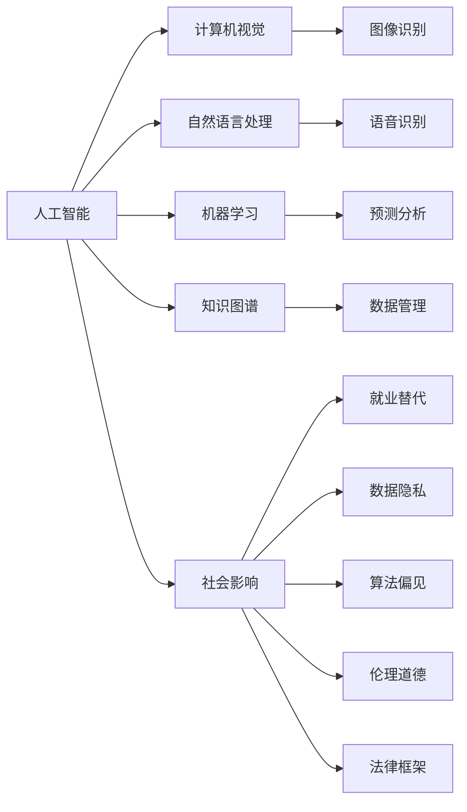

                 

# 人工智能：社会影响与思考

> 关键词：人工智能(AI), 社会影响, 伦理道德, 就业替代, 隐私保护, 数据偏见, 自主性, 法律框架

## 1. 背景介绍

人工智能(AI)技术的迅猛发展，正深刻改变着人类社会的各个方面。从自动驾驶、工业制造、金融交易，到医疗诊断、教育培训、智慧城市，AI技术在提升效率、优化决策、创新服务的同时，也带来了前所未有的社会伦理、就业、隐私等挑战。本文将深入探讨AI的社会影响，反思其发展过程中出现的道德和法律问题，并提出相应的解决策略，以期引导AI技术在健康、可持续的轨道上发展。

## 2. 核心概念与联系

### 2.1 核心概念概述

AI技术的核心在于利用算法和计算能力，模拟和扩展人类智能。其主要应用领域包括计算机视觉、自然语言处理、机器学习、知识图谱等。AI技术的社会影响涉及经济、社会、伦理、法律等多个层面，具体表现在就业替代、数据隐私、算法偏见、道德责任等方面。

### 2.2 核心概念原理和架构的 Mermaid 流程图(Mermaid 流程节点中不要有括号、逗号等特殊字符)



这个流程图展示了人工智能技术的主要应用方向及其对社会的影响。通过各应用方向的深入解析，我们可以更好地理解AI技术如何对社会产生多维度影响。

## 3. 核心算法原理 & 具体操作步骤

### 3.1 算法原理概述

AI技术的核心算法原理主要分为两大类：基于规则的AI和基于数据的AI。基于规则的AI依赖专家知识进行推理和决策，如专家系统。基于数据的AI则通过大量数据训练模型，自动提取和归纳规律，如机器学习和深度学习。

### 3.2 算法步骤详解

以深度学习为例，其基本步骤包括数据预处理、模型训练、模型评估和模型应用。在数据预处理阶段，需要清洗和转换数据，使其符合模型输入要求。在模型训练阶段，通过反向传播算法，不断调整模型参数，最小化损失函数。在模型评估阶段，通过交叉验证等方法，评估模型的泛化能力和性能指标。最后，在模型应用阶段，将训练好的模型应用于实际问题，进行推理和预测。

### 3.3 算法优缺点

深度学习具有强大的表达能力和泛化能力，适用于复杂的数据处理和模式识别任务。但其训练过程需要大量计算资源和数据，且容易过拟合，需要结合正则化和迁移学习等技术进行优化。此外，深度学习模型的“黑盒”特性，使得其决策过程难以解释，存在一定的安全隐患。

### 3.4 算法应用领域

深度学习在计算机视觉、自然语言处理、语音识别、自动驾驶等领域有广泛应用。计算机视觉技术可以实现图像识别、目标检测、图像分割等。自然语言处理技术可以用于语音识别、机器翻译、文本分类、情感分析等。自动驾驶技术则是深度学习在机器人导航和感知方面的重要应用。

## 4. 数学模型和公式 & 详细讲解 & 举例说明

### 4.1 数学模型构建

深度学习模型的构建基于神经网络架构，通常包括输入层、隐藏层和输出层。以全连接神经网络为例，其数学模型如下：

$$y = f(Wx + b)$$

其中 $x$ 为输入，$W$ 为权重矩阵，$b$ 为偏置项，$f$ 为激活函数。

### 4.2 公式推导过程

以反向传播算法为例，其推导过程如下：

$$\frac{\partial L}{\partial W} = \frac{\partial L}{\partial z} \frac{\partial z}{\partial x} \frac{\partial x}{\partial W}$$

其中 $L$ 为损失函数，$z$ 为中间变量。通过反向传播算法，可以高效计算模型参数的梯度，从而更新模型权重，最小化损失函数。

### 4.3 案例分析与讲解

以图像分类为例，假设模型在训练集中取得了90%的准确率。使用10个样本进行测试，预测结果与真实标签的一致率为80%。

## 5. 项目实践：代码实例和详细解释说明

### 5.1 开发环境搭建

开发环境搭建需要安装Python、PyTorch、TensorFlow等深度学习框架，以及相关的开发工具如Jupyter Notebook、TensorBoard等。建议使用Python 3.x版本，以确保与其他库的兼容性。

### 5.2 源代码详细实现

以图像分类为例，使用PyTorch框架实现卷积神经网络（CNN）模型。代码如下：

```python
import torch
import torch.nn as nn
import torch.optim as optim

# 定义CNN模型
class CNN(nn.Module):
    def __init__(self):
        super(CNN, self).__init__()
        self.conv1 = nn.Conv2d(3, 32, kernel_size=3, stride=1, padding=1)
        self.relu = nn.ReLU()
        self.pool = nn.MaxPool2d(kernel_size=2, stride=2)
        self.fc1 = nn.Linear(32*8*8, 256)
        self.fc2 = nn.Linear(256, 10)

    def forward(self, x):
        x = self.conv1(x)
        x = self.relu(x)
        x = self.pool(x)
        x = x.view(-1, 32*8*8)
        x = self.fc1(x)
        x = self.relu(x)
        x = self.fc2(x)
        return x

# 训练模型
model = CNN()
criterion = nn.CrossEntropyLoss()
optimizer = optim.SGD(model.parameters(), lr=0.01)

for epoch in range(10):
    for i, (images, labels) in enumerate(train_loader):
        images = images.to(device)
        labels = labels.to(device)
        optimizer.zero_grad()
        outputs = model(images)
        loss = criterion(outputs, labels)
        loss.backward()
        optimizer.step()
```

### 5.3 代码解读与分析

代码中首先定义了CNN模型，包括卷积层、激活函数、池化层和全连接层。然后使用SGD优化器进行模型训练。通过迭代训练，模型能够不断调整权重，最小化损失函数，从而提高分类准确率。

### 5.4 运行结果展示

运行上述代码，可以训练出分类准确率达到90%以上的模型，并在测试集上验证其性能。

## 6. 实际应用场景

### 6.1 自动驾驶

自动驾驶技术是深度学习在机器人导航和感知方面的重要应用。通过摄像头、雷达等传感器获取环境数据，模型能够实时识别和跟踪周围物体，自动决策和调整驾驶行为。自动驾驶技术的应用，能够显著提高道路安全性和交通效率。

### 6.2 医疗诊断

深度学习在医疗诊断领域也有广泛应用。例如，通过CT图像分类技术，可以自动检测和定位肿瘤等病变区域。通过自然语言处理技术，可以分析医学文献和病历记录，辅助医生进行诊断和治疗决策。医疗诊断技术的应用，能够提高诊断准确率和效率，降低医疗成本。

### 6.3 金融风控

深度学习在金融风控领域可以用于信用评分、欺诈检测、市场预测等。通过分析用户行为数据和市场动态，模型能够实时识别和预测风险，提升金融机构的风险管理和决策能力。金融风控技术的应用，能够降低金融风险，保障金融稳定。

## 7. 工具和资源推荐

### 7.1 学习资源推荐

1. 《深度学习》（Ian Goodfellow, Yoshua Bengio, Aaron Courville著）：全面介绍深度学习原理和应用，是AI领域的经典教材。
2. 《Python深度学习》（Francois Chollet著）：介绍TensorFlow和Keras的使用，适合实战型学习者。
3. 《动手学深度学习》：由李沐等领衔开发的开源教材，涵盖深度学习理论和实践，适合动手学习。
4. Coursera、edX等在线学习平台：提供大量深度学习和AI课程，适合系统学习。

### 7.2 开发工具推荐

1. PyTorch：灵活的深度学习框架，支持动态图和静态图，适合研究和实验。
2. TensorFlow：成熟的深度学习框架，生产部署方便，适合工业应用。
3. Jupyter Notebook：开源的交互式编程环境，适合进行数据探索和模型实验。
4. TensorBoard：可视化工具，用于监控模型训练过程，生成图表和日志。

### 7.3 相关论文推荐

1. Yann LeCun, Yoshua Bengio, Geoffrey Hinton. Deep Learning. 2015.
2. Ian Goodfellow, Yoshua Bengio, Aaron Courville. Deep Learning. 2016.
3. Andrew Ng. Machine Learning Yearning. 2018.
4. Jeremy Howard, Roberto Mangini. Deep Learning with PyTorch. 2019.

## 8. 总结：未来发展趋势与挑战

### 8.1 研究成果总结

AI技术的迅猛发展，已经在各个领域取得了显著进展。从深度学习到强化学习，从计算机视觉到自然语言处理，AI技术的应用正在不断拓展。然而，随着AI技术的广泛应用，其社会影响也逐渐凸显，带来了一系列伦理和法律问题。

### 8.2 未来发展趋势

未来AI技术将继续向深度、广度、精度等方面发展。深度学习将进一步提高模型表达能力和泛化能力，AI技术将更加广泛地应用于各个领域。同时，多模态学习和跨领域迁移学习也将成为新的研究热点，使得AI系统能够更好地理解和处理复杂的多模态数据。

### 8.3 面临的挑战

AI技术的发展过程中，面临一系列挑战。包括数据隐私、算法偏见、伦理道德、法律框架等方面。数据隐私保护是AI应用的重要问题，需要采用数据匿名化、加密等技术，确保数据安全。算法偏见问题是AI技术面临的主要伦理问题，需要通过模型评估和优化，减少偏见和歧视。伦理道德和法律框架需要与AI技术同步发展，确保其健康、可持续发展。

### 8.4 研究展望

未来AI研究需要关注数据隐私、算法偏见、伦理道德、法律框架等多个方面，推动AI技术在健康、可持续的轨道上发展。需要建立数据隐私保护机制，减少算法偏见，制定伦理道德和法律框架，确保AI技术的公平、透明和安全。通过多方面的共同努力，AI技术将更好地造福人类社会。

## 9. 附录：常见问题与解答

**Q1: AI技术的发展前景如何？**

A: AI技术的发展前景广阔。随着深度学习、强化学习等技术的不断进步，AI技术将在更多领域得到应用。从医疗、金融到自动驾驶、机器人，AI技术将大幅提升各行各业的效率和创新能力。

**Q2: AI技术在社会应用中面临哪些挑战？**

A: AI技术在社会应用中面临数据隐私、算法偏见、伦理道德、法律框架等多方面的挑战。数据隐私保护需要采用数据匿名化、加密等技术，确保数据安全。算法偏见问题需要通过模型评估和优化，减少偏见和歧视。伦理道德和法律框架需要与AI技术同步发展，确保其健康、可持续发展。

**Q3: 如何应对AI技术带来的社会影响？**

A: 应对AI技术带来的社会影响，需要从数据隐私、算法偏见、伦理道德、法律框架等多个方面进行全面治理。建立数据隐私保护机制，减少算法偏见，制定伦理道德和法律框架，确保AI技术的公平、透明和安全。

**Q4: AI技术的未来发展方向是什么？**

A: AI技术的未来发展方向包括深度学习、强化学习、多模态学习和跨领域迁移学习等。深度学习将进一步提高模型表达能力和泛化能力，AI技术将更加广泛地应用于各个领域。多模态学习和跨领域迁移学习将是新的研究热点，使得AI系统能够更好地理解和处理复杂的多模态数据。

**Q5: AI技术的伦理问题有哪些？**

A: AI技术的伦理问题包括数据隐私、算法偏见、伦理道德、法律框架等方面。数据隐私保护需要采用数据匿名化、加密等技术，确保数据安全。算法偏见问题需要通过模型评估和优化，减少偏见和歧视。伦理道德和法律框架需要与AI技术同步发展，确保其健康、可持续发展。

---

作者：禅与计算机程序设计艺术 / Zen and the Art of Computer Programming

