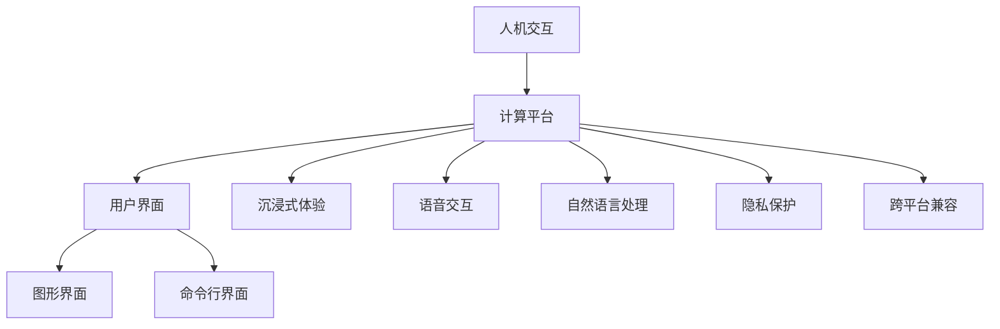

                 

# 人机交互：打造高效便捷的人类计算平台

> 关键词：人机交互,计算平台,用户界面,沉浸式体验,语音交互,自然语言处理,隐私保护,跨平台兼容

## 1. 背景介绍

### 1.1 问题由来
在数字时代，人类已经离不开计算和信息处理。传统的计算平台如电脑、手机、智能家居等，尽管功能强大，但在用户体验上仍存在诸多不足之处。如何打造一个更加高效、便捷、沉浸式的人机交互系统，让计算真正为人类所用，成为了当前计算机科学领域的核心挑战。

随着人工智能技术的发展，尤其是自然语言处理(NLP)、语音识别和生成等前沿技术的突破，人机交互方式正在发生深刻变革。通过这些技术，我们有望构建起一个更加自然、直观、个性化的计算平台，极大地提升用户体验和效率。

### 1.2 问题核心关键点
构建高效便捷的人机交互系统，关键在于以下几个方面：

- **自然语言处理**：通过理解和生成自然语言，实现与用户无障碍的沟通。
- **语音识别和生成**：使得用户可以通过语音进行交互，减少键盘和鼠标的使用。
- **跨平台兼容**：确保系统在不同设备和操作系统上均能顺畅运行，提高用户粘性。
- **隐私保护**：保护用户数据，确保计算平台的安全性和可信度。
- **沉浸式体验**：通过虚拟现实(VR)、增强现实(AR)等技术，增强用户体验，减少物理界面的使用。

这些问题构成了构建高效便捷人机交互系统的核心挑战，也是本文探讨的重点。

## 2. 核心概念与联系

### 2.1 核心概念概述

为更好地理解人机交互系统的设计原理，本节将介绍几个关键概念：

- **人机交互**：指人与计算机之间的信息交换和操作，通过接口将用户输入转化为计算机指令，输出计算机结果并反馈给用户。
- **计算平台**：指计算机系统的基础架构，包括硬件和软件，为用户提供计算服务。
- **用户界面(UI)**：指用户与计算平台交互的界面，分为图形界面(GUI)、命令行界面(CLI)等形式。
- **沉浸式体验**：指通过虚拟现实、增强现实等技术，让用户在物理世界与虚拟世界无缝融合，增强互动体验。
- **语音交互**：指通过语音识别和生成技术，使用户通过语音与计算机进行交互，减少对键盘和鼠标的依赖。
- **自然语言处理**：指使用计算机处理、理解、生成自然语言的技术，使计算机能够理解用户的自然语言指令。
- **隐私保护**：指保护用户数据，防止信息泄露和滥用的技术手段。
- **跨平台兼容**：指计算平台能够在不同设备和操作系统上正常运行，提高用户的使用体验。

这些概念之间的关系可以通过以下Mermaid流程图来展示：



这个流程图展示了人机交互系统的各个组成部分及其相互关系：

1. 人机交互是核心，连接用户和计算平台。
2. 计算平台是基础，包含硬件和软件，提供计算服务。
3. 用户界面是人机交互的具体形式，分为图形界面和命令行界面等。
4. 沉浸式体验、语音交互、自然语言处理等技术，进一步丰富了人机交互的方式。
5. 隐私保护和跨平台兼容是计算平台的重要特性，保证了系统的安全性和可用性。

这些概念共同构成了高效便捷人机交互系统的基本框架，为我们的设计提供了方向。

## 3. 核心算法原理 & 具体操作步骤
### 3.1 算法原理概述

构建高效便捷的人机交互系统，本质上是设计一套能够理解人类行为、进行自然语言处理和响应用户需求的算法。其核心算法包括以下几个部分：

- **语音识别**：将语音信号转化为文本，是实现语音交互的基础。
- **自然语言处理**：理解自然语言，转化为计算机可处理的格式，是实现自然语言处理和交互的前提。
- **推荐系统**：根据用户行为和偏好，推荐相关信息和内容。
- **数据挖掘**：从大量数据中提取有用信息，优化用户界面和交互体验。

### 3.2 算法步骤详解

以下是构建高效便捷人机交互系统的详细步骤：

**Step 1: 确定交互需求和场景**
- 调研目标用户群体，收集他们的需求和偏好。
- 确定主要交互场景，如家居控制、教育辅导、办公助手等。
- 设计用户界面，确保界面简洁、直观、易用。

**Step 2: 收集和处理数据**
- 收集用户行为数据、语音数据、文本数据等。
- 清洗和处理数据，去除噪声和无关信息。
- 使用数据挖掘技术提取用户行为模式和偏好。

**Step 3: 设计和实现语音识别和自然语言处理模型**
- 选择或设计语音识别模型，如深度学习模型、隐马尔可夫模型等。
- 使用自然语言处理技术，将用户输入转化为计算机可处理的形式。
- 训练和优化模型，确保高准确率和鲁棒性。

**Step 4: 集成推荐系统**
- 设计和实现推荐算法，如协同过滤、基于内容的推荐等。
- 将推荐系统与语音交互和自然语言处理模型集成，提升用户交互体验。
- 定期更新推荐内容，保持推荐的相关性和新颖性。

**Step 5: 实现隐私保护和安全机制**
- 设计和实现隐私保护技术，如数据加密、差分隐私等。
- 集成安全机制，防止数据泄露和攻击。
- 定期进行安全审计，确保系统安全。

**Step 6: 测试和优化**
- 在目标用户群体中进行系统测试，收集反馈。
- 根据用户反馈，优化系统界面和交互体验。
- 持续迭代改进，提升系统性能和用户体验。

### 3.3 算法优缺点

构建高效便捷的人机交互系统，具有以下优点：

- **提升用户体验**：通过自然语言处理和语音交互，减少了用户对键盘和鼠标的依赖，提升了操作便捷性。
- **增加互动性**：沉浸式体验、跨平台兼容等技术，使得用户可以在不同场景下无缝切换，增加互动性。
- **优化推荐**：推荐系统可以根据用户行为和偏好，推荐个性化内容，提高用户满意度。
- **强化隐私保护**：隐私保护和安全机制，保证了用户数据的安全性和系统可信度。

同时，该系统也存在一定的局限性：

- **技术复杂度高**：涉及到语音识别、自然语言处理、推荐系统等多个前沿技术，开发难度大。
- **数据依赖性强**：系统性能很大程度上依赖于数据的规模和质量，数据获取成本高。
- **系统扩展性差**：跨平台兼容性和隐私保护等问题，增加了系统的复杂度，扩展性差。

尽管如此，基于这些技术的交互系统仍然能够极大地提升用户的使用体验，为计算平台的普及和应用带来新的可能性。

### 3.4 算法应用领域

高效便捷的人机交互系统已经在多个领域得到了广泛应用，例如：

- **智能家居**：通过语音助手，用户可以通过语音控制家中的各种智能设备，如灯光、电视、空调等。
- **教育辅助**：使用智能教育设备，如智能白板、语音识别笔等，提升教学效果和互动性。
- **远程办公**：使用语音和自然语言处理技术，远程协作更加高效便捷。
- **医疗健康**：通过语音和自然语言交互，老年人使用智能设备进行健康监测和管理，提高生活质量。
- **娱乐休闲**：使用虚拟现实和增强现实技术，提升游戏和娱乐体验。

除了上述这些经典应用外，人机交互技术还在不断拓展新的场景，如智能客服、金融理财、智能交通等，为各行各业带来了新的机遇。

## 4. 数学模型和公式 & 详细讲解 & 举例说明
### 4.1 数学模型构建

在构建人机交互系统时，数学模型是实现自然语言处理和语音识别等技术的基础。以下是几个关键数学模型的构建方法：

- **语音识别模型**：通常使用深度学习模型，如卷积神经网络(CNN)、循环神经网络(RNN)、长短时记忆网络(LSTM)等，将语音信号转化为文本。

- **自然语言处理模型**：包括词向量表示、语法分析、语义理解等，可以使用词嵌入、神经网络等模型进行处理。

- **推荐系统模型**：包括协同过滤、基于内容的推荐、深度学习推荐模型等，可以根据用户行为和数据特征，推荐个性化内容。

### 4.2 公式推导过程

以语音识别模型为例，以下是其公式推导过程：

假设输入语音信号为 $x$，期望输出的文本为 $y$，语音识别模型的目标是寻找最优的权重矩阵 $W$，使得损失函数最小化：

$$
L(W) = \frac{1}{N}\sum_{i=1}^N ||W(x_i - y_i)||^2
$$

其中 $N$ 为样本数，$||\cdot||$ 表示欧式距离。

最小化损失函数 $L(W)$，可以通过反向传播算法求解：

$$
\frac{\partial L(W)}{\partial W} = \frac{2}{N}\sum_{i=1}^N (x_i - y_i)W^T
$$

求解得到 $W$ 后，即可对新的语音信号进行预测和识别。

### 4.3 案例分析与讲解

以下是一个简单的案例，演示如何使用深度学习模型进行语音识别：

1. **数据准备**：收集语音信号和对应的文本，将文本转化为向量形式。
2. **模型选择**：选择RNN或LSTM模型，作为语音识别的基础模型。
3. **模型训练**：使用反向传播算法和梯度下降优化，训练模型参数。
4. **模型测试**：对新的语音信号进行预测，计算预测误差。

## 5. 项目实践：代码实例和详细解释说明
### 5.1 开发环境搭建

在进行项目实践前，我们需要准备好开发环境。以下是使用Python进行深度学习项目开发的环境配置流程：

1. 安装Anaconda：从官网下载并安装Anaconda，用于创建独立的Python环境。

2. 创建并激活虚拟环境：
```bash
conda create -n pyenv python=3.8 
conda activate pyenv
```

3. 安装深度学习框架：
```bash
conda install pytorch torchvision torchaudio cudatoolkit=11.1 -c pytorch -c conda-forge
```

4. 安装TensorFlow：
```bash
conda install tensorflow
```

5. 安装TensorBoard：
```bash
conda install tensorboard
```

6. 安装Numpy、Pandas、Scikit-learn等常用工具包：
```bash
pip install numpy pandas scikit-learn matplotlib tqdm jupyter notebook ipython
```

完成上述步骤后，即可在`pyenv`环境中开始项目实践。

### 5.2 源代码详细实现

以下是一个使用PyTorch进行语音识别的代码示例：

```python
import torch
import torch.nn as nn
import torch.optim as optim

# 定义模型
class RNN(nn.Module):
    def __init__(self, input_size, hidden_size, output_size):
        super(RNN, self).__init__()
        self.hidden_size = hidden_size
        self.rnn = nn.RNN(input_size, hidden_size, batch_first=True)
        self.fc = nn.Linear(hidden_size, output_size)

    def forward(self, x):
        h0 = self.rnn.zero_hits()
        out, _ = self.rnn(x, h0)
        out = self.fc(out[:, -1, :])
        return out

# 定义训练函数
def train(model, optimizer, loss_fn, train_loader, device):
    model.train()
    total_loss = 0
    for data, target in train_loader:
        data, target = data.to(device), target.to(device)
        optimizer.zero_grad()
        output = model(data)
        loss = loss_fn(output, target)
        loss.backward()
        optimizer.step()
        total_loss += loss.item()
    return total_loss / len(train_loader)

# 定义测试函数
def test(model, test_loader, device):
    model.eval()
    total_loss = 0
    with torch.no_grad():
        for data, target in test_loader:
            data, target = data.to(device), target.to(device)
            output = model(data)
            loss = loss_fn(output, target)
            total_loss += loss.item()
    return total_loss / len(test_loader)

# 数据准备
train_data = ...
test_data = ...

# 模型训练
model = RNN(input_size=...
           hidden_size=...
           output_size=...)
criterion = nn.CrossEntropyLoss()
optimizer = optim.Adam(model.parameters(), lr=...
                      weight_decay=...)
device = torch.device("cuda" if torch.cuda.is_available() else "cpu")

# 训练
for epoch in range(num_epochs):
    loss = train(model, optimizer, criterion, train_loader, device)
    print("Epoch {}: Loss = {:.4f}".format(epoch+1, loss))

# 测试
test_loss = test(model, test_loader, device)
print("Test Loss = {:.4f}".format(test_loss))
```

### 5.3 代码解读与分析

让我们再详细解读一下关键代码的实现细节：

**RNN类**：
- `__init__`方法：初始化模型参数，包括输入大小、隐藏层大小和输出大小。
- `forward`方法：前向传播计算模型输出。
- `zero_hits`方法：重置隐藏层状态。

**训练函数train**：
- 在每个epoch中，对训练数据进行迭代训练，计算损失并更新模型参数。
- 使用Adam优化算法，结合权重衰减技术进行优化。
- 在每个epoch结束时，打印训练损失。

**测试函数test**：
- 对测试数据进行迭代计算，计算测试损失。
- 在测试过程中不进行梯度更新，只用于评估模型性能。

**数据准备**：
- 使用PyTorch提供的`Dataset`和`DataLoader`工具，将数据加载到模型中进行训练和测试。

**模型训练**：
- 定义RNN模型和损失函数，选择Adam优化器，并设置学习率和权重衰减等超参数。
- 将数据和模型移动到GPU上进行训练，提高计算效率。
- 通过循环迭代训练数据，计算每个epoch的平均损失。

**测试**：
- 在测试集上对模型进行评估，计算测试损失。
- 在测试过程中不进行梯度更新，仅用于模型性能评估。

通过上述代码示例，可以看到，使用PyTorch进行语音识别的项目实践相对简单，只需定义模型、损失函数、优化器和训练函数即可。

## 6. 实际应用场景
### 6.1 智能家居

智能家居系统通过语音助手，用户可以通过语音控制家中的各种智能设备，如灯光、电视、空调等。例如，使用Amazon的Alexa、Google Assistant等语音助手，用户可以轻松控制家中的智能设备，提升生活质量。

### 6.2 教育辅助

使用智能教育设备，如智能白板、语音识别笔等，提升教学效果和互动性。例如，使用iPad上的语音识别功能，教师可以实时了解学生的反馈，及时调整教学内容，提高教学效果。

### 6.3 远程办公

使用语音和自然语言处理技术，远程协作更加高效便捷。例如，使用Zoom、Microsoft Teams等视频会议工具，结合语音识别和自然语言处理技术，实现无键盘、无鼠标的远程协作，提升工作效率。

### 6.4 医疗健康

通过语音和自然语言交互，老年人使用智能设备进行健康监测和管理，提高生活质量。例如，使用智能手环进行健康监测，结合语音交互功能，老年人可以实时获取健康数据，并得到医生建议。

### 6.5 娱乐休闲

使用虚拟现实和增强现实技术，提升游戏和娱乐体验。例如，使用Oculus Rift等虚拟现实设备，结合语音和自然语言交互，让用户可以在虚拟世界中自由探索和互动。

## 7. 工具和资源推荐
### 7.1 学习资源推荐

为了帮助开发者系统掌握人机交互技术，这里推荐一些优质的学习资源：

1. 《人机交互设计与实现》系列博文：由大模型技术专家撰写，深入浅出地介绍了人机交互设计的原理和实践方法。

2. CS222《计算机视觉》课程：斯坦福大学开设的计算机视觉明星课程，有Lecture视频和配套作业，带你入门计算机视觉领域的基本概念和经典模型。

3. 《深度学习》书籍：深度学习领域的经典教材，涵盖了深度学习的基本原理、算法和应用。

4. TensorFlow官方文档：TensorFlow的官方文档，提供了海量预训练模型和完整的项目开发样例，是入门深度学习的重要资源。

5. Coursera上的《深度学习专业证书》：由DeepLearning.ai开设的深度学习专业课程，系统介绍深度学习理论和实践。

通过对这些资源的学习实践，相信你一定能够快速掌握人机交互技术的精髓，并用于解决实际的交互问题。

### 7.2 开发工具推荐

高效的开发离不开优秀的工具支持。以下是几款用于人机交互项目开发的常用工具：

1. PyTorch：基于Python的开源深度学习框架，灵活动态的计算图，适合快速迭代研究。大部分深度学习模型都有PyTorch版本的实现。

2. TensorFlow：由Google主导开发的开源深度学习框架，生产部署方便，适合大规模工程应用。同样有丰富的深度学习模型资源。

3. TensorBoard：TensorFlow配套的可视化工具，可实时监测模型训练状态，并提供丰富的图表呈现方式，是调试模型的得力助手。

4. Weights & Biases：模型训练的实验跟踪工具，可以记录和可视化模型训练过程中的各项指标，方便对比和调优。与主流深度学习框架无缝集成。

5. Jupyter Notebook：开源的交互式编程环境，支持Python、R等多种语言，适合进行数据处理和模型训练。

6. GitHub：全球最大的代码托管平台，提供代码版本控制和协作开发工具，适合团队合作开发。

合理利用这些工具，可以显著提升人机交互项目的开发效率，加快创新迭代的步伐。

### 7.3 相关论文推荐

人机交互技术的发展源于学界的持续研究。以下是几篇奠基性的相关论文，推荐阅读：

1. "A Survey on Human-Computer Interaction Technologies and Tools"：综述了人机交互技术的最新进展，涵盖了语音识别、自然语言处理、虚拟现实等多个方面。

2. "Interactive Systems for Smartphones"：介绍了基于智能手机的人机交互系统设计方法，包括语音输入、手势识别等技术。

3. "Towards Explainable Artificial Intelligence"：探讨了如何使AI模型具备可解释性，为增强人机交互的可理解性提供了新思路。

4. "Machine Learning-Based Adaptive Interaction Design"：研究了如何使用机器学习技术实现自适应人机交互界面设计，提高用户体验。

5. "Personalized Recommendation Algorithms"：介绍了多种推荐系统算法，包括协同过滤、基于内容的推荐等，为个性化人机交互系统提供了技术基础。

这些论文代表了大语言模型微调技术的发展脉络。通过学习这些前沿成果，可以帮助研究者把握学科前进方向，激发更多的创新灵感。

## 8. 总结：未来发展趋势与挑战
### 8.1 研究成果总结

本文对高效便捷的人机交互系统进行了全面系统的介绍。首先阐述了人机交互技术的核心挑战和研究背景，明确了语音交互、自然语言处理、沉浸式体验等关键技术的重要性。其次，从原理到实践，详细讲解了人机交互的算法构建和关键步骤，给出了项目开发的完整代码实例。同时，本文还广泛探讨了人机交互技术在智能家居、教育辅助、远程办公等多个行业领域的应用前景，展示了人机交互范式的巨大潜力。最后，本文精选了人机交互技术的各类学习资源，力求为读者提供全方位的技术指引。

通过本文的系统梳理，可以看到，高效便捷的人机交互技术正在成为数字时代的重要范式，极大地提升了用户体验和效率。这些技术的深入研究与应用，必将引领人机交互领域向更加自然、直观、个性化的方向发展，为计算平台的普及和应用带来新的可能性。

### 8.2 未来发展趋势

展望未来，人机交互技术将呈现以下几个发展趋势：

1. **自然语言处理能力的提升**：随着深度学习模型的不断优化，自然语言处理的准确率和鲁棒性将大幅提升，使得人机交互更加自然、高效。

2. **多模态交互的普及**：语音、视觉、触觉等模态的融合，将进一步丰富人机交互的方式，提升用户体验。

3. **个性化体验的强化**：通过推荐系统和自适应算法，实现更加个性化的交互体验，满足用户的多样化需求。

4. **隐私保护的加强**：随着数据泄露事件的频发，隐私保护将成为人机交互系统的重要关注点，越来越多的隐私保护技术将被应用于实际应用中。

5. **跨平台兼容性的提升**：通过标准化接口和协议，提升人机交互系统的跨平台兼容性，增强用户的使用体验。

6. **安全性和可靠性的保障**：人机交互系统需要具备高可靠性和安全性，确保用户数据和交互过程的安全。

7. **增强现实和虚拟现实的结合**：通过虚拟现实和增强现实技术，提供更加沉浸式的交互体验，增强用户粘性。

这些趋势凸显了人机交互技术的广阔前景，推动了计算平台向更加智能化、个性化的方向发展。这些方向的探索发展，必将进一步提升人机交互系统的性能和应用范围，为人类计算能力的提升带来新的机遇。

### 8.3 面临的挑战

尽管人机交互技术已经取得了显著进展，但在迈向更加智能化、普适化应用的过程中，它仍面临着诸多挑战：

1. **技术复杂度高**：涉及到语音识别、自然语言处理、推荐系统等多个前沿技术，开发难度大。
2. **数据依赖性强**：系统性能很大程度上依赖于数据的规模和质量，数据获取成本高。
3. **隐私保护不足**：当前的人机交互系统在隐私保护方面仍有不足，数据泄露和滥用风险较高。
4. **跨平台兼容性差**：不同设备和操作系统之间的兼容性问题，增加了系统的复杂度，降低了用户体验。
5. **安全性和可靠性不足**：人机交互系统需要具备高可靠性和安全性，确保用户数据和交互过程的安全。

这些挑战需要进一步的研究和技术突破，才能使人机交互系统更加普及和可靠。

### 8.4 研究展望

面对人机交互系统面临的挑战，未来的研究需要在以下几个方面寻求新的突破：

1. **引入更多先验知识**：将符号化的先验知识，如知识图谱、逻辑规则等，与神经网络模型进行巧妙融合，引导人机交互过程学习更准确、合理的语言模型。

2. **融合因果分析和博弈论工具**：将因果分析方法引入人机交互模型，识别出模型决策的关键特征，增强输出解释的因果性和逻辑性。借助博弈论工具刻画人机交互过程，主动探索并规避模型的脆弱点，提高系统稳定性。

3. **引入更多交互方式**：除了语音和自然语言交互，引入更多交互方式，如手势识别、体感交互等，提升交互多样性和便捷性。

4. **强化隐私保护和数据安全**：通过数据加密、差分隐私等技术手段，加强隐私保护和数据安全，确保人机交互系统的可信度和安全性。

5. **探索无监督和半监督学习**：摆脱对大规模标注数据的依赖，利用自监督学习、主动学习等无监督和半监督范式，最大限度利用非结构化数据，实现更加灵活高效的交互。

6. **融合跨学科知识**：将心理学、社会学等跨学科知识引入人机交互设计，提升系统设计的科学性和合理性。

这些研究方向的研究突破，将为人机交互技术的发展提供新的动力，推动人机交互系统向更加自然、智能、安全的方向发展。面向未来，人机交互技术还需要与其他人工智能技术进行更深入的融合，如知识表示、因果推理、强化学习等，多路径协同发力，共同推动计算平台向更加高效、便捷、个性化的方向发展。

## 9. 附录：常见问题与解答

**Q1：如何选择合适的交互方式？**

A: 选择合适的交互方式需要考虑用户群体的特点和交互场景的需求。语音交互适用于无键盘和鼠标的场景，自然语言交互适用于复杂逻辑和大量文本输入的场景。手势识别、体感交互等技术，适用于需要物理交互的场景。

**Q2：如何优化交互系统的性能？**

A: 优化交互系统的性能需要从多个方面入手：

- 优化模型算法，提高自然语言处理和语音识别的准确率。
- 提升推荐系统的个性化和准确性，推荐更符合用户需求的内容。
- 优化用户界面设计，提升交互体验。

**Q3：如何确保交互系统的安全性？**

A: 确保交互系统的安全性需要：

- 加强数据加密和差分隐私技术，保护用户数据隐私。
- 使用对抗攻击技术，增强系统鲁棒性。
- 定期进行安全审计，发现并修复潜在漏洞。

**Q4：如何实现跨平台兼容性？**

A: 实现跨平台兼容性需要：

- 设计标准化接口和协议，支持不同设备和操作系统。
- 使用通用的开发框架和库，避免平台依赖。
- 优化系统性能，减少资源消耗。

通过这些措施，可以显著提升人机交互系统的兼容性和用户体验。

---

作者：禅与计算机程序设计艺术 / Zen and the Art of Computer Programming

