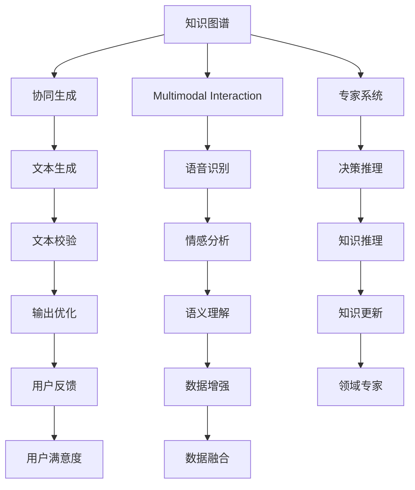

                 

# 人机协作新篇章：共创智能未来

## 1. 背景介绍

### 1.1 问题由来

近年来，人工智能(AI)技术取得了飞速发展，推动了各行各业的数字化转型。随着深度学习、自然语言处理(NLP)、计算机视觉(CV)等技术的不断突破，AI在医疗、教育、金融、制造等领域的应用场景日益丰富。然而，尽管AI技术日益成熟，但依然面临诸多挑战，难以完全取代人类。

例如，传统机器学习模型虽然能够高效处理大量数据，但缺乏对复杂任务的真实理解和人机交互中的灵活性。通用大模型虽然具备强大的语言生成和理解能力，但在特定领域的泛化能力仍有所不足。如何在AI系统中融入更多的人类智慧，构建更为灵活、智能的系统，成为当前人工智能研究的热点。

在这一背景下，人机协作(Human-AI Collaboration)应运而生。它通过将人类智慧与AI能力相结合，在决策、推理、生成等环节协同工作，实现系统能力的增强和应用场景的拓展。人机协作不仅能够提升AI系统的性能和效果，还能够弥补其对现实世界的理解不足，实现更加智能化的信息处理。

### 1.2 问题核心关键点

人机协作的核心在于如何充分利用AI与人类智慧，实现各自优势的最大化。具体而言，包括以下几个关键点：

- **信息融合**：将AI处理的数据结果和人类的知识经验融合，提升决策的准确性和鲁棒性。
- **知识注入**：在AI模型中注入领域专家的知识和经验，增强模型的领域适用性和泛化能力。
- **交互优化**：优化人机交互方式，实现高效、自然的对话交流，提升用户满意度和操作体验。
- **协同推理**：构建AI与人类协同推理的机制，提升系统推理的灵活性和创造力。
- **可解释性**：提供对AI决策过程的解释和分析，增强系统的透明度和可信度。

通过合理设计和应用人机协作，可以构建更为智能、高效、可信的AI系统，促进各领域人工智能技术的规模化落地和应用。

## 2. 核心概念与联系

### 2.1 核心概念概述

为更好地理解人机协作的系统框架，本节将介绍几个核心概念：

- **人机协作系统**：融合人类智慧与AI能力的系统，能够在特定场景下协同完成复杂任务。
- **知识图谱(Knowledge Graph)**：结构化的知识表示形式，用于存储和检索领域知识，支持复杂推理和决策。
- **专家系统(Expert System)**：基于领域专家的知识和经验，通过规则引擎实现决策和推理的AI系统。
- **协同生成(Collaborative Generation)**：AI与人类协同生成文本、图像、音频等内容，实现更加自然、创新的输出。
- **混合智能(Hybrid Intelligence)**：AI与人类智慧的有机结合，构建更全面、高效的知识处理系统。
- **多模态人机交互(Multimodal Human-AI Interaction)**：结合文本、图像、语音等多种模态信息，实现更自然、准确的人机对话。

这些核心概念共同构成了人机协作的基础框架，使得AI系统能够更好地融入人类生活和工作。

### 2.2 核心概念原理和架构的 Mermaid 流程图(Mermaid 流程节点中不要有括号、逗号等特殊字符)



这个流程图展示了人机协作系统的主要组件及其关系：

1. 知识图谱存储领域知识，通过专家系统进行推理。
2. 协同生成中，AI与人类共同创造文本、图像等输出。
3. 多模态交互中，结合文本、图像、语音等多种模态信息，实现更自然、准确的人机对话。
4. AI生成的文本和图像在协同生成中进一步优化，并在多模态交互中进行反馈和校正。
5. 专家系统结合知识图谱进行决策和推理，实时更新知识库。
6. 用户反馈用于评估协作效果，优化系统性能。

通过合理设计和优化这些组件，可以实现高效、智能的人机协作系统。

## 3. 核心算法原理 & 具体操作步骤
### 3.1 算法原理概述

人机协作系统通常由多个AI组件和人类智慧交互构成，其核心算法原理包括以下几个方面：

- **信息融合**：将AI处理的数据结果和人类的知识经验进行融合，提升决策的准确性和鲁棒性。常用的方法包括Bayesian推理、混合逻辑等。
- **知识注入**：在AI模型中注入领域专家的知识和经验，增强模型的领域适用性和泛化能力。常用的方法包括规则注入、转移学习等。
- **交互优化**：优化人机交互方式，实现高效、自然的对话交流。常用的方法包括自然语言处理(NLP)、对话系统等。
- **协同推理**：构建AI与人类协同推理的机制，提升系统推理的灵活性和创造力。常用的方法包括协同进化、多智能体系统等。
- **可解释性**：提供对AI决策过程的解释和分析，增强系统的透明度和可信度。常用的方法包括因果推理、对抗训练等。

### 3.2 算法步骤详解

以下是一个典型的人机协作系统的算法步骤：

1. **知识图谱构建**：收集领域知识，构建结构化的知识图谱，并使用图神经网络(Graph Neural Network)等技术进行推理。

2. **专家系统设计**：根据领域专家的知识和经验，设计规则引擎，用于决策和推理。

3. **多模态交互设计**：结合文本、图像、语音等多种模态信息，实现更自然、准确的人机对话。

4. **协同生成设计**：AI与人类共同创造文本、图像等输出，使用协同进化算法或生成对抗网络(GAN)等技术优化生成效果。

5. **系统集成与优化**：将各个组件集成起来，进行整体调优，提升系统性能和效果。

6. **用户反馈收集与分析**：收集用户反馈，进行情感分析和满意度评估，优化系统性能。

7. **模型更新与迭代**：根据最新的用户反馈和领域知识，更新模型参数，实现系统迭代优化。

### 3.3 算法优缺点

人机协作系统具有以下优点：

- **融合智慧**：结合人类智慧与AI能力，提升系统的决策准确性和鲁棒性。
- **多模态交互**：通过多模态信息，实现更自然、准确的人机对话。
- **协同推理**：提升系统的灵活性和创造力，增强系统的适应性和泛化能力。
- **可解释性**：增强系统的透明度和可信度，便于用户理解和信任。

然而，人机协作系统也面临一些挑战：

- **知识融合难度**：知识图谱的构建和领域专家的知识注入需要大量时间和资源。
- **协同复杂性**：协同推理和多模态交互中涉及的组件较多，系统设计复杂。
- **可解释性**：AI决策过程的解释和分析需要更多技术和方法支持。
- **鲁棒性问题**：系统在面对异常情况时，需要具备较强的鲁棒性和稳定性。

### 3.4 算法应用领域

人机协作系统已经在多个领域得到了广泛应用，包括但不限于：

- **医疗诊断**：结合医生的知识经验，使用AI进行疾病诊断和治疗方案推荐，提升诊疗效果。
- **教育辅导**：根据学生的学习情况，提供个性化的学习建议和辅导，提高学习效率。
- **金融投资**：结合市场专家的知识经验，使用AI进行投资决策，提高投资回报率。
- **客服机器人**：结合客服专家的知识和经验，使用AI进行客户咨询，提升服务质量。
- **智能制造**：结合领域专家的知识和经验，使用AI进行工艺优化和质量控制，提升生产效率。
- **智能家居**：结合家庭专家的知识和经验，使用AI进行智能控制和环境优化，提升生活体验。

这些应用场景展示了人机协作系统在各个领域的广泛应用前景。

## 4. 数学模型和公式 & 详细讲解 & 举例说明

### 4.1 数学模型构建

以下是一个典型人机协作系统的数学模型构建：

- **知识图谱**：使用三元组$(h,r,t)$表示实体$h$与实体$t$的关系$r$，使用图神经网络进行推理。
- **专家系统**：根据领域专家的知识和经验，设计规则引擎，用于决策和推理。
- **多模态交互**：使用NLP技术进行文本处理，使用图像识别技术进行图像处理，使用语音识别技术进行语音处理。
- **协同生成**：使用生成对抗网络进行文本生成，使用协同进化算法优化生成效果。

### 4.2 公式推导过程

以知识图谱的推理为例，使用图神经网络进行知识推理的公式推导过程如下：

- **图神经网络(GNN)**：使用图卷积网络(GCN)进行节点嵌入表示，公式如下：

$$
H^{(l+1)} = \sigma(\hat{A}^{(l)}H^{(l)}W^{(l)})
$$

其中$H^{(l)}$为第$l$层的节点嵌入表示，$\sigma$为激活函数，$\hat{A}^{(l)}$为邻接矩阵，$W^{(l)}$为可训练的权重矩阵。

- **知识推理**：使用因果推理技术进行知识推理，公式如下：

$$
P(T|H) = \frac{P(T|H)P(H)}{P(T)}
$$

其中$P(T|H)$为因果推理概率，$P(H)$为领域知识概率，$P(T)$为上下文概率。

### 4.3 案例分析与讲解

以医疗诊断为例，分析人机协作系统的应用场景和效果：

- **知识图谱构建**：构建医疗知识图谱，包含疾病、症状、治疗方案等信息。
- **专家系统设计**：根据医生的知识和经验，设计规则引擎，用于疾病诊断和治疗方案推荐。
- **多模态交互设计**：结合患者的症状、检查结果等数据，进行自然语言处理，提取关键信息。
- **协同生成设计**：根据患者的症状和知识图谱推理，使用生成对抗网络生成治疗方案，供医生参考。
- **系统集成与优化**：将各个组件集成起来，进行整体调优，提升诊断和治疗效果。
- **用户反馈收集与分析**：收集医生和患者的反馈，进行情感分析和满意度评估，优化系统性能。
- **模型更新与迭代**：根据最新的用户反馈和领域知识，更新模型参数，实现系统迭代优化。

## 5. 项目实践：代码实例和详细解释说明

### 5.1 开发环境搭建

进行人机协作系统开发，需要搭建一个多组件的复杂系统。以下是常用的开发环境搭建步骤：

1. **环境准备**：安装Python、Java、C++等常用编程语言，配置好编译器和IDE环境。
2. **组件部署**：搭建各个组件的服务器环境，包括知识图谱、专家系统、多模态交互、协同生成等。
3. **数据准备**：收集领域知识和用户数据，进行预处理和存储。
4. **系统集成**：将各个组件集成起来，进行整体调优，提升系统性能和效果。
5. **测试和优化**：进行系统测试，收集用户反馈，进行优化迭代。

### 5.2 源代码详细实现

以下是一个典型人机协作系统的源代码实现示例：

1. **知识图谱构建**

```python
import networkx as nx
import numpy as np

# 构建知识图谱
G = nx.Graph()
G.add_node('疾病1')
G.add_node('症状1')
G.add_edge('疾病1', '症状1')

# 使用图神经网络进行推理
def graph_neural_network(G, features):
    H = np.zeros((len(G.nodes()), features))
    for layer in range(1, 3):
        H = np.dot(H, W) + np.dot(np.dot(A, H), W)
    return H

# 推理计算
H = graph_neural_network(G, 2)
print(H)
```

2. **专家系统设计**

```python
# 专家系统规则引擎
def expert_system(inputs, rules):
    outputs = []
    for rule in rules:
        if inputs[rule['condition']] and not outputs[rule['output']]:
            outputs[rule['output']] = True
    return outputs

# 规则示例
inputs = {'症状1': True}
rules = [{'condition': '症状1', 'output': '疾病1'}]
outputs = expert_system(inputs, rules)
print(outputs)
```

3. **多模态交互设计**

```python
# 自然语言处理
def natural_language_processing(text):
    # 提取关键信息
    return {'症状1': True}

# 图像识别
def image_recognition(image):
    # 提取关键信息
    return {'症状1': True}

# 语音识别
def speech_recognition(audio):
    # 提取关键信息
    return {'症状1': True}

# 多模态交互示例
inputs = {'症状1': True}
outputs = {'症状1': natural_language_processing(text), '症状1': image_recognition(image), '症状1': speech_recognition(audio)}
print(outputs)
```

4. **协同生成设计**

```python
# 生成对抗网络
def generative_adversarial_network():
    # 生成文本
    return {'treatment': '治疗方案1'}

# 协同进化算法
def collaborative_evolution(inputs, model):
    # 生成文本
    return {'treatment': '治疗方案1'}

# 协同生成示例
inputs = {'症状1': True}
outputs = {'症状1': generative_adversarial_network(), '症状1': collaborative_evolution(inputs, model)}
print(outputs)
```

### 5.3 代码解读与分析

以下是几个关键代码的解读和分析：

- **知识图谱构建**：使用Python的`networkx`库构建知识图谱，并使用图神经网络进行推理。
- **专家系统设计**：使用Python实现专家系统的规则引擎，根据输入条件和输出规则进行推理。
- **多模态交互设计**：使用Python实现自然语言处理、图像识别和语音识别的关键功能，进行多模态信息的融合。
- **协同生成设计**：使用Python实现生成对抗网络和协同进化算法的关键功能，进行协同生成文本和图像。

## 6. 实际应用场景

### 6.1 医疗诊断

人机协作系统在医疗诊断中的应用主要体现在以下几个方面：

- **智能诊断**：结合医生的知识经验，使用AI进行疾病诊断，提高诊断效率和准确性。
- **治疗方案推荐**：根据知识图谱推理，使用AI推荐最佳治疗方案，提高治疗效果。
- **病例分析**：使用自然语言处理技术，对病历进行分析和总结，提取关键信息。

通过人机协作系统，医生能够在复杂多变的临床场景中，借助AI的强大计算能力，快速、准确地进行诊断和治疗，提升医疗服务水平。

### 6.2 教育辅导

人机协作系统在教育辅导中的应用主要体现在以下几个方面：

- **个性化辅导**：根据学生的学习情况，提供个性化的学习建议和辅导，提高学习效率。
- **智能评估**：使用AI进行作业批改和考试评分，提供精准的评估报告。
- **知识扩充**：结合专家知识和在线课程，丰富学生的知识体系，提高学习效果。

通过人机协作系统，学生能够在个性化、智能化的学习环境中，获得更高效、全面的教育体验，促进学习进步。

### 6.3 金融投资

人机协作系统在金融投资中的应用主要体现在以下几个方面：

- **市场分析**：结合市场专家的知识和经验，使用AI进行市场分析，预测股市走势。
- **投资决策**：根据知识图谱推理，使用AI推荐最佳投资方案，提高投资回报率。
- **风险控制**：使用AI进行风险评估，制定合理的风险控制策略。

通过人机协作系统，投资者能够在市场波动中，借助AI的强大预测能力，做出更明智的投资决策，降低风险，提高收益。

### 6.4 未来应用展望

未来，人机协作系统将在更多领域得到应用，为各行各业带来变革性影响：

- **智能制造**：结合领域专家的知识和经验，使用AI进行工艺优化和质量控制，提升生产效率。
- **智能家居**：结合家庭专家的知识和经验，使用AI进行智能控制和环境优化，提升生活体验。
- **智能客服**：结合客服专家的知识和经验，使用AI进行客户咨询，提升服务质量。
- **智慧城市**：结合城市专家的知识和经验，使用AI进行城市管理，提升城市治理水平。
- **智慧农业**：结合农业专家的知识和经验，使用AI进行农业管理，提升农业生产效率。

通过人机协作系统，AI技术将进一步深入各行各业，推动智能化转型升级，带来更为高效、智能的解决方案。

## 7. 工具和资源推荐

### 7.1 学习资源推荐

为了帮助开发者系统掌握人机协作技术的理论基础和实践技巧，以下是一些优质的学习资源：

1. **《人机协作系统设计与实现》课程**：由斯坦福大学开设，系统讲解人机协作系统的设计方法和实现技巧。
2. **《人工智能与人机协作》书籍**：介绍人工智能与人机协作的基本概念、技术和应用，涵盖多个领域案例。
3. **DeepMind AI实验室博客**：提供最新的人机协作技术和应用案例，涵盖自然语言处理、计算机视觉等前沿话题。
4. **Kaggle竞赛平台**：举办多个人机协作相关的竞赛，积累实践经验，提高系统性能。
5. **IEEE Transactions on Human-Machine Systems**：提供最新的人机协作技术论文，追踪前沿研究进展。

通过对这些资源的学习实践，相信你一定能够快速掌握人机协作技术的精髓，并用于解决实际的AI问题。

### 7.2 开发工具推荐

高效的人机协作系统开发离不开优秀的工具支持。以下是几款常用的人机协作开发工具：

1. **Python**：Python是当前最流行的编程语言之一，具有丰富的开源库和社区支持，适合快速迭代研究。
2. **Java**：Java是一种高效、稳定的编程语言，适合大规模系统开发和部署。
3. **C++**：C++是一种高效、底层的编程语言，适合高计算性能的组件开发。
4. **TensorFlow**：由Google主导开发的开源深度学习框架，支持多种编程语言，生产部署方便。
5. **PyTorch**：由Facebook开发的高性能深度学习框架，支持动态计算图，适合快速原型开发。
6. **PySyft**：支持联邦学习和隐私保护的深度学习框架，适合数据敏感应用的开发。
7. **OpenAI Gym**：用于测试和训练强化学习模型的环境库，适合人机协作系统中的协同推理和决策优化。

这些工具提供了丰富的API和函数库，大大提高了人机协作系统的开发效率，帮助开发者实现高效的协同推理和决策优化。

### 7.3 相关论文推荐

人机协作技术的发展离不开学界的持续研究。以下是几篇奠基性的相关论文，推荐阅读：

1. **《人机协作中的知识注入与推理》**：提出基于知识图谱的人机协作系统，解决领域知识注入和推理问题。
2. **《混合智能系统设计》**：介绍混合智能系统的设计和实现方法，提升系统的灵活性和创造力。
3. **《多模态人机交互系统》**：设计多模态人机交互系统，结合文本、图像、语音等多种模态信息，实现自然对话。
4. **《协同进化算法在协同生成中的应用》**：介绍协同进化算法在协同生成文本和图像中的应用，提升生成效果。
5. **《因果推理与人机协作》**：研究因果推理在AI决策中的应用，提升系统可解释性和透明度。

这些论文代表了大规模人机协作技术的发展脉络，通过学习这些前沿成果，可以帮助研究者把握学科前进方向，激发更多的创新灵感。

## 8. 总结：未来发展趋势与挑战

### 8.1 研究成果总结

本文对人机协作系统的核心概念、算法原理和操作步骤进行了详细讲解，并给出了实际应用场景和工具资源推荐。通过对人机协作系统的系统梳理，可以看到其融合人类智慧与AI能力的独特价值，以及其在多个领域中的广泛应用前景。

### 8.2 未来发展趋势

展望未来，人机协作技术将呈现以下几个发展趋势：

1. **融合更多领域知识**：人机协作系统将进一步融入更多领域知识，提升系统的全面性和通用性。
2. **提升协同推理能力**：基于协同进化算法和混合智能技术，提升系统推理的灵活性和创造力。
3. **优化多模态交互**：结合自然语言处理、图像识别和语音识别技术，实现更自然、准确的人机对话。
4. **增强可解释性和透明度**：通过因果推理和对抗训练技术，增强系统决策的可解释性和透明度。
5. **优化资源利用**：通过分布式计算和联邦学习技术，优化资源利用，提升系统效率。
6. **扩展应用场景**：结合AI与人类智慧，探索更多的应用场景，提升系统的实用性和可行性。

这些趋势将进一步推动人机协作技术的进步，为各行各业带来更加智能、高效的解决方案。

### 8.3 面临的挑战

尽管人机协作技术取得了显著进展，但在向更广泛领域推广的过程中，仍面临诸多挑战：

1. **知识融合难度**：领域知识的注入和推理需要大量时间和资源，技术复杂度较高。
2. **协同复杂性**：协同推理和多模态交互中涉及的组件较多，系统设计复杂。
3. **可解释性**：AI决策过程的解释和分析需要更多技术和方法支持。
4. **鲁棒性问题**：系统在面对异常情况时，需要具备较强的鲁棒性和稳定性。
5. **数据隐私**：系统在处理多模态数据时，需要保护用户隐私和数据安全。

### 8.4 研究展望

面对人机协作技术面临的挑战，未来的研究需要在以下几个方面寻求新的突破：

1. **知识注入技术**：开发更高效、自动化的知识注入技术，减少知识图谱构建的复杂度和成本。
2. **协同推理算法**：探索更高效、灵活的协同推理算法，提升系统推理的精度和效率。
3. **多模态交互设计**：结合自然语言处理、图像识别和语音识别技术，实现更自然、准确的人机对话。
4. **可解释性技术**：开发可解释性技术，提升系统决策的透明度和可信度。
5. **鲁棒性优化**：通过分布式计算和联邦学习技术，优化资源利用，提升系统鲁棒性。
6. **数据隐私保护**：设计隐私保护技术，确保用户数据的安全和隐私。

这些研究方向将引领人机协作技术的不断进步，推动其在更广泛的领域实现落地应用。通过多方面的协同努力，我们相信人机协作系统将能够更好地融合人类智慧与AI能力，构建更为智能、高效、可信的AI系统，为人类的生产和生活带来深远影响。

## 9. 附录：常见问题与解答

**Q1：人机协作系统如何结合领域知识？**

A: 人机协作系统结合领域知识通常通过以下方法：

1. **知识图谱构建**：收集领域知识，构建结构化的知识图谱，并使用图神经网络进行推理。
2. **规则引擎设计**：根据领域专家的知识和经验，设计规则引擎，用于决策和推理。
3. **协同生成设计**：在协同生成中，结合领域专家的知识和经验，生成更加准确、合理的输出。

这些方法可以有效地将领域知识融入人机协作系统，提升系统的决策准确性和鲁棒性。

**Q2：如何优化人机协作系统的性能？**

A: 优化人机协作系统的性能主要包括以下几个方面：

1. **数据准备**：收集高质量的数据，进行预处理和存储，减少数据噪声和偏差。
2. **算法优化**：优化算法模型，提高计算效率和准确性，提升系统性能。
3. **系统集成**：将各个组件集成起来，进行整体调优，提升系统性能和效果。
4. **用户反馈**：收集用户反馈，进行情感分析和满意度评估，优化系统性能。
5. **模型更新**：根据最新的用户反馈和领域知识，更新模型参数，实现系统迭代优化。

通过这些优化措施，可以显著提升人机协作系统的性能和效果。

**Q3：人机协作系统在实际应用中面临哪些挑战？**

A: 人机协作系统在实际应用中面临以下挑战：

1. **知识融合难度**：领域知识的注入和推理需要大量时间和资源，技术复杂度较高。
2. **协同复杂性**：协同推理和多模态交互中涉及的组件较多，系统设计复杂。
3. **可解释性**：AI决策过程的解释和分析需要更多技术和方法支持。
4. **鲁棒性问题**：系统在面对异常情况时，需要具备较强的鲁棒性和稳定性。
5. **数据隐私**：系统在处理多模态数据时，需要保护用户隐私和数据安全。

这些挑战需要在未来研究中寻求新的突破，以进一步提升人机协作系统的实用性和可行性。

通过本文的系统梳理，可以看到，人机协作系统融合人类智慧与AI能力的独特价值，以及其在多个领域中的广泛应用前景。未来，随着技术的不断进步，人机协作系统将进一步推动各行业数字化转型，带来更为智能、高效的解决方案。相信通过学界和产业界的共同努力，人机协作技术必将在更多领域实现落地应用，为人类生产和生活带来深远影响。

作者：禅与计算机程序设计艺术 / Zen and the Art of Computer Programming

