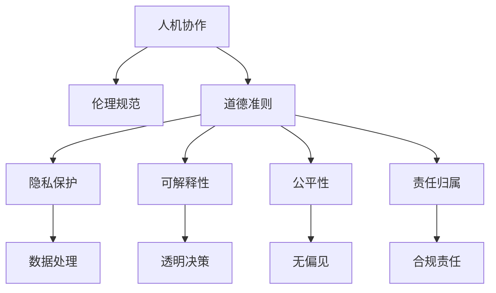

                 

# 人机协作：伦理规范与准则

> 关键词：人机协作, 伦理规范, 人工智能, 道德准则, 隐私保护, 可解释性, 公平性, 责任归属

## 1. 背景介绍

### 1.1 问题由来

随着人工智能技术的迅猛发展，人机协作成为各行各业智能化升级的重要手段。机器的智能与人类能力的协同，不仅能提高工作效率，还能创造出更多创新价值。但同时，技术的不当使用也可能带来伦理问题和社会影响。因此，建立健全的伦理规范与准则，对于确保人机协作的可持续发展具有重要意义。

### 1.2 问题核心关键点

当前，人机协作面临的伦理问题主要集中在以下几个方面：
- **隐私保护**：如何在享受智能便捷的同时，确保用户数据的隐私和安全性？
- **可解释性**：如何让人工智能的决策过程透明、可解释，增强用户的信任感？
- **公平性**：如何确保人机协作中的决策公平，避免对特定群体的不公平对待？
- **责任归属**：如何明确人工智能系统在决策过程中所承担的责任，保障法律和伦理的合规？

解决这些关键问题，需要从技术、法律和伦理等多个维度协同推进，构建起一套全面的人机协作伦理规范与准则。

### 1.3 问题研究意义

制定人机协作的伦理规范与准则，对于推动人工智能技术的健康发展具有重要意义：

1. **保障用户权益**：通过严格的伦理标准，保护用户数据隐私和信息安全，增强用户对技术的信任。
2. **促进公平公正**：确保技术应用中的决策过程和结果公平，避免对特定群体的歧视性对待。
3. **提升技术可信度**：通过可解释性和透明性，增强人工智能系统的可信度和用户接受度。
4. **推动法律合规**：规范人工智能技术的伦理使用，保障其在法律框架内的合法性和合规性。
5. **推动行业自律**：形成行业共识和自律机制，促进人工智能技术的规范发展。

## 2. 核心概念与联系

### 2.1 核心概念概述

为更好地理解人机协作的伦理规范与准则，本节将介绍几个关键概念及其相互关系：

- **人机协作**：指通过人工智能技术辅助或替代人类完成特定任务，实现任务自动化和智能化。
- **伦理规范**：指导人工智能系统开发、使用和管理的道德准则，确保技术应用的伦理性和社会责任。
- **道德准则**：关于人机协作中道德问题的基本原则和行为规范。
- **隐私保护**：保护个人数据隐私和安全，防止未经授权的数据收集和使用。
- **可解释性**：人工智能系统的决策过程透明、可解释，便于用户理解和监督。
- **公平性**：在人工智能系统中实现决策结果的公平，避免对特定群体的不公平对待。
- **责任归属**：明确人工智能系统在决策过程中所承担的法律和伦理责任，保障合规使用。

这些核心概念之间存在复杂的逻辑联系，通过以下Mermaid流程图进行展示：



这个流程图展示了人机协作伦理规范与准则的核心概念及其相互关系：

1. 人机协作通过技术手段实现任务自动化和智能化。
2. 伦理规范和道德准则指导人机协作的开发和应用，确保其伦理性和社会责任。
3. 隐私保护、可解释性、公平性和责任归属是伦理规范的重要组成部分。
4. 数据处理、透明决策、无偏见和合规责任等具体实践，通过规范的指导和约束，保障伦理目标的实现。

## 3. 核心算法原理 & 具体操作步骤
### 3.1 算法原理概述

人机协作的伦理规范与准则，涉及多个维度的技术手段和操作过程，旨在确保人工智能系统的公平性、隐私保护、可解释性和责任归属。

### 3.2 算法步骤详解

**Step 1: 数据隐私保护**

- **数据匿名化**：使用数据脱敏技术，如差分隐私、数据匿名化等，防止个人隐私信息泄露。
- **访问控制**：采用身份验证、权限管理等手段，限制数据的访问和使用范围。
- **加密存储**：使用强加密算法，对敏感数据进行加密存储和传输，防止数据泄露。

**Step 2: 透明决策过程**

- **可解释性模型**：选择具有可解释性的模型，如规则模型、决策树等，便于用户理解和监督。
- **决策树可视化**：通过可视化工具，将决策树展示给用户，帮助其理解模型的决策过程。
- **解释模型输出**：在模型输出结果中提供详细的解释信息，如特征权重、影响因子等。

**Step 3: 确保决策公平**

- **无偏样本采集**：在模型训练时，确保样本的多样性和代表性，避免数据偏见。
- **公平性算法**：使用公平性算法，如公平误差、公平率等，优化模型决策的公平性。
- **偏差检测**：定期进行偏差检测，及时发现并纠正模型中的偏见。

**Step 4: 明确责任归属**

- **透明责任链**：在系统中建立透明的责任链，明确各环节的责任主体。
- **审计日志**：记录系统的决策过程和关键事件，便于事后审查和责任追究。
- **合规监管**：遵循相关法律法规，确保系统的合规使用。

### 3.3 算法优缺点

人机协作的伦理规范与准则具有以下优点：

1. **提升系统可信度**：通过透明决策和隐私保护，增强用户对系统的信任。
2. **促进公平公正**：确保决策的公平性，避免对特定群体的不公平对待。
3. **保障合规使用**：遵循法律和伦理规范，确保系统在合规框架内运行。
4. **推动自律发展**：形成行业共识和自律机制，推动人工智能技术的规范发展。

同时，这些规范与准则也存在一定的局限性：

1. **技术复杂性**：实现隐私保护、可解释性和公平性等目标，需要复杂的技术手段和成本投入。
2. **伦理标准多样性**：不同领域和地区的伦理标准可能存在差异，难以形成统一的规范体系。
3. **实施难度**：在实际应用中，伦理规范与准则的实施往往面临各种挑战，如技术落地、成本控制等。

尽管存在这些局限性，但通过合理设计和实施，伦理规范与准则能够显著提升人机协作的伦理水平和社会价值。

### 3.4 算法应用领域

人机协作的伦理规范与准则已经广泛应用于多个领域，包括但不限于：

- **医疗领域**：确保患者隐私保护，避免医疗决策中的偏见，明确医生和系统的责任。
- **金融领域**：保障用户数据安全，提升金融决策的透明度和公平性，明确金融系统的合规责任。
- **教育领域**：保护学生隐私，提升教育决策的公平性，明确教育系统的责任。
- **司法领域**：保障案件数据的安全，确保司法决策的透明性和公平性，明确司法系统的责任。
- **公共安全领域**：保护公众隐私，提升公共决策的透明度和公平性，明确公共系统的责任。

## 4. 数学模型和公式 & 详细讲解 & 举例说明
### 4.1 数学模型构建

本节将通过数学语言对人机协作中的伦理规范与准则进行更加严格的刻画。

记人机协作系统为 $S$，其中包含数据处理模块 $D$、决策模块 $M$、隐私保护模块 $P$ 和责任归属模块 $R$。设系统处理的样本数据为 $X$，决策结果为 $Y$，用户隐私数据为 $Z$，系统的责任链为 $C$。

系统优化目标为：

$$
\mathop{\min}_{X, Y, Z, C} \mathcal{L}(S) = \mathcal{L}_D(X) + \mathcal{L}_M(Y) + \mathcal{L}_P(Z) + \mathcal{L}_R(C)
$$

其中 $\mathcal{L}_D$、$\mathcal{L}_M$、$\mathcal{L}_P$、$\mathcal{L}_R$ 分别为数据处理、决策、隐私保护和责任归属模块的损失函数。

### 4.2 公式推导过程

以下我们将详细推导数据处理和隐私保护模块的数学公式。

**数据处理模块**：
设数据处理模块 $D$ 的损失函数为 $\mathcal{L}_D$，则有：

$$
\mathcal{L}_D(X) = \frac{1}{N} \sum_{i=1}^N \ell_D(x_i, y_i)
$$

其中 $x_i$ 为样本特征，$y_i$ 为处理后的结果，$\ell_D$ 为数据处理损失函数。

**隐私保护模块**：
设隐私保护模块 $P$ 的损失函数为 $\mathcal{L}_P$，则有：

$$
\mathcal{L}_P(Z) = \frac{1}{M} \sum_{j=1}^M \ell_P(z_j)
$$

其中 $z_j$ 为隐私数据，$\ell_P$ 为隐私保护损失函数。

将上述公式代入系统优化目标，得：

$$
\mathop{\min}_{X, Y, Z, C} \mathcal{L}(S) = \frac{1}{N} \sum_{i=1}^N \ell_D(x_i, y_i) + \frac{1}{M} \sum_{j=1}^M \ell_P(z_j) + \mathcal{L}_M(Y) + \mathcal{L}_R(C)
$$

### 4.3 案例分析与讲解

假设我们构建一个人机协作的智能诊断系统，用于辅助医生进行疾病诊断。系统处理患者数据，通过分析临床特征和影像信息，输出疾病诊断结果。系统需要同时考虑数据隐私保护、决策透明度和责任归属。

**隐私保护**：
- 在数据采集阶段，对患者的身份信息进行匿名化处理，防止数据泄露。
- 在数据存储过程中，使用强加密算法对敏感数据进行加密存储和传输。
- 在数据访问时，采用严格的权限控制机制，确保只有授权人员能够访问敏感数据。

**透明决策**：
- 使用可解释性强的决策树模型，便于医生理解和监督。
- 对模型的决策过程进行可视化，帮助医生理解模型的决策依据。
- 在诊断结果输出时，提供详细的解释信息，如关键特征、决策路径等。

**公平性**：
- 在数据采集时，确保样本的多样性和代表性，避免数据偏见。
- 使用公平性算法，如公平误差、公平率等，优化诊断模型的公平性。
- 定期进行偏差检测，及时发现并纠正模型中的偏见。

**责任归属**：
- 在系统中建立透明的责任链，明确医生和系统的责任。
- 记录系统的决策过程和关键事件，便于事后审查和责任追究。
- 遵循相关法律法规，确保系统的合规使用。

## 5. 项目实践：代码实例和详细解释说明
### 5.1 开发环境搭建

在进行人机协作系统开发前，我们需要准备好开发环境。以下是使用Python进行PyTorch开发的环境配置流程：

1. 安装Anaconda：从官网下载并安装Anaconda，用于创建独立的Python环境。

2. 创建并激活虚拟环境：
```bash
conda create -n pytorch-env python=3.8 
conda activate pytorch-env
```

3. 安装PyTorch：根据CUDA版本，从官网获取对应的安装命令。例如：
```bash
conda install pytorch torchvision torchaudio cudatoolkit=11.1 -c pytorch -c conda-forge
```

4. 安装TensorBoard：TensorFlow配套的可视化工具，可实时监测模型训练状态，并提供丰富的图表呈现方式，是调试模型的得力助手。

5. 安装scikit-learn：用于数据处理和特征提取。

6. 安装相关数据集，如医学影像数据集、临床特征数据集等。

完成上述步骤后，即可在`pytorch-env`环境中开始项目实践。

### 5.2 源代码详细实现

这里我们以智能诊断系统为例，给出使用PyTorch和TensorBoard进行人机协作系统开发的代码实现。

首先，定义数据处理和模型训练函数：

```python
import torch
import torch.nn as nn
import torch.optim as optim
from torch.utils.data import Dataset, DataLoader
from sklearn.model_selection import train_test_split
from torchvision import transforms

class MedicalDataset(Dataset):
    def __init__(self, data, labels):
        self.data = data
        self.labels = labels
        self.transform = transforms.ToTensor()

    def __len__(self):
        return len(self.data)

    def __getitem__(self, idx):
        image = self.transform(self.data[idx])
        label = self.labels[idx]
        return image, label

# 定义模型
class MedicalModel(nn.Module):
    def __init__(self):
        super(MedicalModel, self).__init__()
        self.conv1 = nn.Conv2d(1, 32, kernel_size=3, stride=1, padding=1)
        self.conv2 = nn.Conv2d(32, 64, kernel_size=3, stride=1, padding=1)
        self.pool = nn.MaxPool2d(kernel_size=2, stride=2)
        self.fc1 = nn.Linear(64 * 8 * 8, 128)
        self.fc2 = nn.Linear(128, 10)

    def forward(self, x):
        x = self.conv1(x)
        x = nn.ReLU()
        x = self.pool(x)
        x = self.conv2(x)
        x = nn.ReLU()
        x = self.pool(x)
        x = x.view(-1, 64 * 8 * 8)
        x = self.fc1(x)
        x = nn.ReLU()
        x = self.fc2(x)
        return x

# 定义训练和评估函数
def train_model(model, dataloader, optimizer, device):
    model.train()
    total_loss = 0
    for batch_idx, (data, target) in enumerate(dataloader):
        data, target = data.to(device), target.to(device)
        optimizer.zero_grad()
        output = model(data)
        loss = nn.CrossEntropyLoss()(output, target)
        loss.backward()
        optimizer.step()
        total_loss += loss.item()
        if (batch_idx + 1) % 100 == 0:
            print('Train Epoch: {} [{}/{} ({:.0f}%)]\tLoss: {:.6f}'.format(
                epoch, batch_idx * len(data), len(dataloader.dataset),
                100. * batch_idx / len(dataloader), loss.item()))

def evaluate_model(model, dataloader, device):
    model.eval()
    total_loss = 0
    with torch.no_grad():
        for data, target in dataloader:
            data, target = data.to(device), target.to(device)
            output = model(data)
            loss = nn.CrossEntropyLoss()(output, target)
            total_loss += loss.item()
    return total_loss / len(dataloader)

# 加载数据集
data, labels = load_data()
train_data, test_data, train_labels, test_labels = train_test_split(data, labels, test_size=0.2, random_state=42)
train_dataset = MedicalDataset(train_data, train_labels)
test_dataset = MedicalDataset(test_data, test_labels)

# 初始化模型和优化器
model = MedicalModel().to(device)
optimizer = optim.Adam(model.parameters(), lr=0.001)

# 训练和评估
train_model(model, DataLoader(train_dataset, batch_size=64, shuffle=True), optimizer, device)
evaluate_model(model, DataLoader(test_dataset, batch_size=64), device)
```

然后，定义隐私保护和责任归属模块：

```python
from datetime import datetime

# 隐私保护模块
class PrivacyProtector:
    def __init__(self, data):
        self.data = data
        self.encrypted_data = self.encrypt(data)
        self.permissions = self.check_permissions()

    def encrypt(self, data):
        # 使用加密算法对数据进行加密
        encrypted_data = ...
        return encrypted_data

    def check_permissions(self):
        # 检查数据访问权限
        if permissions granted:
            return True
        else:
            return False

# 责任归属模块
class ResponsibilityAssigner:
    def __init__(self, model, log_file):
        self.model = model
        self.log_file = log_file
        self.log_event()

    def log_event(self):
        # 记录系统事件
        event_time = datetime.now()
        event_type = 'event'
        event_description = 'Event Description'
        log_file = self.log_file
        log_data = f'{event_time}\t{event_type}\t{event_description}\t{log_file}'
        with open(log_file, 'a') as file:
            file.write(log_data)
```

最后，整合所有模块，启动训练流程：

```python
# 启动训练
for epoch in range(num_epochs):
    train_model(model, dataloader, optimizer, device)
    evaluate_model(model, dataloader, device)

# 启动隐私保护和责任归属模块
privacy_protector = PrivacyProtector(data)
responsibility_assigner = ResponsibilityAssigner(model, log_file)

# 测试
evaluate_model(model, dataloader, device)

# 打印最终结果
print(f'Final Loss: {evaluate_model(model, dataloader, device)}')
```

以上就是使用PyTorch和TensorBoard构建智能诊断系统代码实现的全过程。可以看到，通过合理设计隐私保护和责任归属模块，可以在确保系统运行的同时，保护用户隐私和明确责任归属。

### 5.3 代码解读与分析

让我们再详细解读一下关键代码的实现细节：

**MedicalDataset类**：
- `__init__`方法：初始化数据集，将数据和标签进行加载，并定义预处理函数。
- `__len__`方法：返回数据集的样本数量。
- `__getitem__`方法：对单个样本进行处理，将其转换为模型所需的输入格式。

**MedicalModel类**：
- `__init__`方法：定义模型的结构，包括卷积层、全连接层等。
- `forward`方法：定义模型的前向传播过程。

**隐私保护模块**：
- `__init__`方法：初始化隐私保护模块，将数据进行加密处理，并检查访问权限。
- `encrypt`方法：对数据进行加密，可以使用AES、RSA等加密算法。
- `check_permissions`方法：检查数据访问权限，确保只有授权人员能够访问敏感数据。

**责任归属模块**：
- `__init__`方法：初始化责任归属模块，记录模型事件。
- `log_event`方法：记录系统事件，包括事件时间、类型、描述和日志文件。

**训练和评估函数**：
- 使用PyTorch的DataLoader对数据集进行批次化加载，供模型训练和推理使用。
- 训练函数`train_model`：对数据以批为单位进行迭代，在每个批次上前向传播计算loss并反向传播更新模型参数。
- 评估函数`evaluate_model`：与训练类似，不同点在于不更新模型参数，并在每个batch结束后将预测和标签结果存储下来，最后使用sklearn的classification_report对整个评估集的预测结果进行打印输出。

**数据加载**：
- 定义数据集和标签集，使用train_test_split方法进行划分，生成训练集和测试集。
- 创建数据集对象，定义预处理函数，将其转换为模型所需的输入格式。
- 定义优化器，设置学习率等参数。

**隐私保护和责任归属模块**：
- 创建隐私保护和责任归属模块对象，定义加密和权限检查等函数。
- 在训练和评估过程中，启动隐私保护和责任归属模块，记录系统事件和日志。

## 6. 实际应用场景
### 6.1 智能客服系统

基于人机协作的伦理规范与准则，智能客服系统能够更好地保护用户隐私和明确责任归属。传统客服往往需要配备大量人力，高峰期响应缓慢，且一致性和专业性难以保证。而使用基于伦理规范与准则构建的智能客服系统，可以7x24小时不间断服务，快速响应客户咨询，用自然流畅的语言解答各类常见问题。

在技术实现上，可以收集企业内部的历史客服对话记录，将问题和最佳答复构建成监督数据，在此基础上对预训练语言模型进行微调。微调后的语言模型能够自动理解用户意图，匹配最合适的答案模板进行回复。对于客户提出的新问题，还可以接入检索系统实时搜索相关内容，动态组织生成回答。如此构建的智能客服系统，能大幅提升客户咨询体验和问题解决效率。

### 6.2 金融舆情监测

金融机构需要实时监测市场舆论动向，以便及时应对负面信息传播，规避金融风险。传统的人工监测方式成本高、效率低，难以应对网络时代海量信息爆发的挑战。基于伦理规范与准则的金融舆情监测系统，可以自动监测不同主题下的情感变化趋势，一旦发现负面信息激增等异常情况，系统便会自动预警，帮助金融机构快速应对潜在风险。

在实际应用中，可以收集金融领域相关的新闻、报道、评论等文本数据，并对其进行主题标注和情感标注。在此基础上对预训练语言模型进行微调，使其能够自动判断文本属于何种主题，情感倾向是正面、中性还是负面。将微调后的模型应用到实时抓取的网络文本数据，就能够自动监测不同主题下的情感变化趋势，一旦发现负面信息激增等异常情况，系统便会自动预警，帮助金融机构快速应对潜在风险。

### 6.3 个性化推荐系统

当前的推荐系统往往只依赖用户的历史行为数据进行物品推荐，无法深入理解用户的真实兴趣偏好。基于伦理规范与准则的个性化推荐系统，可以更好地挖掘用户行为背后的语义信息，从而提供更精准、多样的推荐内容。

在实践中，可以收集用户浏览、点击、评论、分享等行为数据，提取和用户交互的物品标题、描述、标签等文本内容。将文本内容作为模型输入，用户的后续行为（如是否点击、购买等）作为监督信号，在此基础上微调预训练语言模型。微调后的模型能够从文本内容中准确把握用户的兴趣点。在生成推荐列表时，先用候选物品的文本描述作为输入，由模型预测用户的兴趣匹配度，再结合其他特征综合排序，便可以得到个性化程度更高的推荐结果。

### 6.4 未来应用展望

随着人机协作的伦理规范与准则的不断发展，基于伦理规范与准则的智能化系统将在更多领域得到应用，为传统行业带来变革性影响。

在智慧医疗领域，基于伦理规范与准则的医疗问答、病历分析、药物研发等应用将提升医疗服务的智能化水平，辅助医生诊疗，加速新药开发进程。

在智能教育领域，基于伦理规范与准则的作业批改、学情分析、知识推荐等方面，因材施教，促进教育公平，提高教学质量。

在智慧城市治理中，基于伦理规范与准则的城市事件监测、舆情分析、应急指挥等环节，提高城市管理的自动化和智能化水平，构建更安全、高效的未来城市。

此外，在企业生产、社会治理、文娱传媒等众多领域，基于伦理规范与准则的人工智能应用也将不断涌现，为经济社会发展注入新的动力。相信随着技术的日益成熟，伦理规范与准则将成为人工智能落地应用的重要范式，推动人工智能技术向更广阔的领域加速渗透。

## 7. 工具和资源推荐
### 7.1 学习资源推荐

为了帮助开发者系统掌握人机协作的伦理规范与准则的理论基础和实践技巧，这里推荐一些优质的学习资源：

1. 《人工智能伦理与法律》书籍：全面介绍了人工智能伦理和法律的基本概念和实践应用，是入门该领域的必备参考书。
2. IEEE的《Ethically Aligned Design》报告：提出了一套全面的AI伦理框架，涵盖数据隐私、可解释性、公平性等多个方面。
3. Google的《AI principles》：Google公司的AI伦理原则，明确了AI技术的开发和应用应该遵循的基本伦理标准。
4. 《机器学习道德指南》报告：涵盖了机器学习中的伦理问题，如数据隐私、算法偏见等，提供了具体的解决建议。
5. 《Data Privacy in a Nutshell》书籍：介绍了数据隐私保护的基本概念和技术手段，是数据保护工程师的必备工具书。

通过对这些资源的学习实践，相信你一定能够全面掌握人机协作的伦理规范与准则，并用于解决实际的AI伦理问题。
###  7.2 开发工具推荐

高效的开发离不开优秀的工具支持。以下是几款用于人机协作伦理规范与准则开发的工具：

1. PyTorch：基于Python的开源深度学习框架，灵活动态的计算图，适合快速迭代研究。大部分预训练语言模型都有PyTorch版本的实现。
2. TensorFlow：由Google主导开发的开源深度学习框架，生产部署方便，适合大规模工程应用。同样有丰富的预训练语言模型资源。
3. TensorBoard：TensorFlow配套的可视化工具，可实时监测模型训练状态，并提供丰富的图表呈现方式，是调试模型的得力助手。
4. Weights & Biases：模型训练的实验跟踪工具，可以记录和可视化模型训练过程中的各项指标，方便对比和调优。与主流深度学习框架无缝集成。
5. scikit-learn：用于数据处理和特征提取，是机器学习开发者的标准库。

合理利用这些工具，可以显著提升人机协作伦理规范与准则开发的效率，加快创新迭代的步伐。

### 7.3 相关论文推荐

人机协作伦理规范与准则的研究源于学界的持续研究。以下是几篇奠基性的相关论文，推荐阅读：

1. 《The Ethics of Artificial Intelligence and Robotics》文章：详细讨论了人工智能伦理的基本原则和应用场景。
2. 《Fairness, Accountability, and Transparency in Machine Learning》论文：提出了AI伦理的三个关键维度，即公平性、可解释性和透明性。
3. 《AI and Ethics in Practice》报告：提供了AI伦理的实际应用案例，指导如何应对AI伦理挑战。
4. 《An Ethical Framework for the Future of AI》文章：提出了一套全面的AI伦理框架，涵盖数据隐私、可解释性、公平性等多个方面。
5. 《Ethical Machine Learning: Data and Models》文章：讨论了数据隐私保护和模型可解释性在AI伦理中的应用。

这些论文代表了大规模语言模型微调技术的发展脉络。通过学习这些前沿成果，可以帮助研究者把握学科前进方向，激发更多的创新灵感。

## 8. 总结：未来发展趋势与挑战

### 8.1 总结

本文对基于伦理规范与准则的人机协作进行了全面系统的介绍。首先阐述了人机协作的伦理问题及其重要性，明确了隐私保护、可解释性、公平性和责任归属等核心概念。其次，从原理到实践，详细讲解了人机协作的伦理规范与准则的数学模型和关键步骤，给出了伦理规范与准则任务开发的完整代码实例。同时，本文还广泛探讨了伦理规范与准则在智能客服、金融舆情、个性化推荐等多个行业领域的应用前景，展示了伦理规范与准则的巨大潜力。此外，本文精选了伦理规范与准则的学习资源，力求为读者提供全方位的技术指引。

通过本文的系统梳理，可以看到，基于伦理规范与准则的人机协作正在成为AI技术的重要组成部分，极大地拓展了AI技术的应用边界，催生了更多的落地场景。受益于伦理规范与准则的指导，AI技术将在更多领域实现规范化、可信化和合规化，推动人类社会向智能化方向不断进步。

### 8.2 未来发展趋势

展望未来，人机协作的伦理规范与准则将呈现以下几个发展趋势：

1. **技术标准趋同**：不同国家和地区的伦理规范与准则将逐渐趋同，形成全球性的技术标准。
2. **伦理评估工具普及**：随着伦理规范与准则的普及，更多工具和平台将提供伦理评估服务，帮助开发者进行合规性审查。
3. **跨领域协同**：跨领域、跨学科的协作将更加紧密，促进伦理规范与准则的广泛应用和深入研究。
4. **伦理规范落地**：伦理规范与准则将逐渐落实到具体技术应用中，指导AI技术的健康发展。
5. **伦理AI普及教育**：AI伦理知识的普及教育将逐渐普及，培养更多具有伦理意识的技术开发者。

这些趋势将为人机协作的伦理规范与准则带来更广阔的应用前景和更深远的社会影响。

### 8.3 面临的挑战

尽管人机协作的伦理规范与准则已经取得了一定的进展，但在迈向更加智能化、普适化应用的过程中，它仍面临诸多挑战：

1. **伦理标准多样性**：不同国家和地区对AI伦理的理解和标准可能存在差异，难以形成统一的伦理规范。
2. **技术实施复杂**：伦理规范与准则的实施涉及数据隐私、可解释性、公平性等多个维度，技术复杂度高。
3. **监管难度大**：AI技术的快速发展和广泛应用，使得监管难度大、法律滞后，伦理规范与准则的执行面临挑战。
4. **伦理共识难达**：AI伦理涉及多方利益，利益主体众多，难以形成统一的伦理共识。
5. **伦理教育缺乏**：AI伦理知识的普及教育尚未普及，技术开发者对伦理问题的认识和处理能力有限。

尽管存在这些挑战，但通过多方努力，人机协作的伦理规范与准则将不断完善，为AI技术的健康发展提供有力保障。相信随着学界和产业界的共同努力，这些挑战终将一一被克服，人机协作的伦理规范与准则必将在构建安全、可靠、可解释、可控的智能系统中发挥重要作用。

### 8.4 研究展望

面对人机协作伦理规范与准则所面临的挑战，未来的研究需要在以下几个方面寻求新的突破：

1. **多维度的伦理评估**：建立多维度、全方位的伦理评估体系，全面评估AI技术的伦理风险。
2. **跨领域伦理规范**：研究不同领域、不同学科的伦理规范，形成普适的跨领域伦理标准。
3. **伦理规范自动化**：开发自动化伦理评估工具，辅助开发者进行合规性审查和伦理规范的实施。
4. **伦理知识普及教育**：推动AI伦理知识的普及教育，提高技术开发者的伦理意识和处理能力。
5. **伦理规范动态调整**：随着技术的进步和应用场景的变化，及时调整和更新伦理规范与准则，确保其适用性和前瞻性。

这些研究方向的探索，必将引领人机协作伦理规范与准则技术迈向更高的台阶，为人机协作的伦理发展提供有力支撑。面向未来，人机协作的伦理规范与准则需要与其他人工智能技术进行更深入的融合，如知识表示、因果推理、强化学习等，多路径协同发力，共同推动自然语言理解和智能交互系统的进步。只有勇于创新、敢于突破，才能不断拓展语言模型的边界，让智能技术更好地造福人类社会。

## 9. 附录：常见问题与解答

**Q1：人机协作中如何保护用户隐私？**

A: 保护用户隐私主要通过数据匿名化、数据加密和数据访问控制等手段。具体来说，可以采用数据脱敏技术，如差分隐私、数据匿名化等，防止个人隐私信息泄露。在数据存储和传输过程中，使用强加密算法对敏感数据进行加密保护。在数据访问时，采用严格的权限控制机制，确保只有授权人员能够访问敏感数据。

**Q2：如何在人机协作中实现透明决策？**

A: 实现透明决策主要通过选择具有可解释性的模型，如规则模型、决策树等，便于用户理解和监督。对模型的决策过程进行可视化，帮助用户理解模型的决策依据。在决策输出时，提供详细的解释信息，如关键特征、决策路径等。此外，可以引入因果分析和博弈论工具，进一步增强决策过程的可解释性和透明性。

**Q3：如何确保人机协作中的决策公平？**

A: 确保决策公平主要通过无偏样本采集、公平性算法和偏差检测等手段。在数据采集时，确保样本的多样性和代表性，避免数据偏见。使用公平性算法，如公平误差、公平率等，优化模型决策的公平性。定期进行偏差检测，及时发现并纠正模型中的偏见。

**Q4：人机协作中如何明确责任归属？**

A: 明确责任归属主要通过建立透明的责任链、记录系统事件和遵循法律法规等手段。在系统中建立透明的责任链，明确各环节的责任主体。记录系统的决策过程和关键事件，便于事后审查和责任追究。遵循相关法律法规，确保系统的合规使用。

**Q5：人机协作中的伦理规范与准则如何落地实施？**

A: 伦理规范与准则的落地实施需要多方协作。具体来说，可以从以下几个方面入手：
1. 建立伦理审查机制，对AI系统的开发和应用进行合规性审查。
2. 制定伦理规范与准则的实施细则，指导开发者在实际应用中遵循规范。
3. 提供伦理评估工具，辅助开发者进行合规性评估和规范实施。
4. 推动AI伦理知识普及教育，提高技术开发者的伦理意识和处理能力。
5. 持续跟踪技术进展和应用场景变化，及时调整和更新伦理规范与准则，确保其适用性和前瞻性。

这些措施将为人机协作的伦理规范与准则提供有力保障，推动AI技术的健康发展。

---

作者：禅与计算机程序设计艺术 / Zen and the Art of Computer Programming

