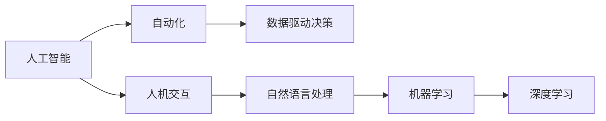

                 

# 人机协同：未来工作的核心竞争力

> 关键词：人机协同，人工智能，AI赋能，未来工作，核心竞争力，技术发展

## 1. 背景介绍

随着人工智能技术的飞速发展，人机协同（Human-AI Collaboration）已经成为未来工作的重要组成部分。人机协同不仅能够提升工作效率，还能改善工作体验，增强决策质量。从自动化生产线到智能客服系统，从医疗诊断到创意写作，AI的广泛应用为人机协同带来了深远的影响。

在过去几十年中，人类经历了从机械化到自动化再到智能化转变的过程，每一次技术的演进都极大地提升了生产力，创造了前所未有的经济价值和社会效益。当前，人工智能的崛起，特别是深度学习和大数据技术的发展，进一步推动了人机协同的深化和普及，使其成为未来工作的核心竞争力。

### 1.1 人机协同的兴起

人机协同的兴起源于计算机技术的飞速发展和数据采集技术的成熟。大数据、云计算、物联网等技术的发展，使得数据的海量采集和存储成为可能。同时，深度学习算法的发展，特别是深度神经网络（Deep Neural Networks, DNN）在图像识别、自然语言处理等领域的突破，使得机器能够理解和处理更加复杂的任务。这些技术进步为人工智能系统的部署和应用创造了条件，也为人类与机器的深度协作提供了可能性。

### 1.2 人机协同的核心优势

人机协同的核心优势在于其能够将人类的创造力和直觉与机器的高效性和准确性结合在一起，从而实现优势互补。具体来说，人工智能在以下几个方面展现了其独特的优势：

- **自动化**：通过自动化处理重复性高、耗时长的任务，减少人为错误，提升工作效率。
- **数据分析**：利用大数据分析和深度学习技术，挖掘出有价值的信息和模式，辅助决策。
- **人机交互**：通过自然语言处理和计算机视觉技术，实现高效、自然的沟通和协作。
- **智能推荐**：根据用户行为和历史数据，进行个性化推荐，提升用户体验。

这些优势使得人机协同在各个领域得到了广泛的应用，并逐渐成为未来工作的重要组成部分。

## 2. 核心概念与联系

### 2.1 核心概念概述

为了更好地理解人机协同的概念和应用，本节将介绍几个关键概念及其相互联系：

- **人工智能（AI）**：指利用计算机和算法模拟人类智能，实现问题的自动化解决。
- **自动化**：指通过机器自动执行任务，减少人力干预。
- **人机交互（HCI）**：指人与计算机之间的互动方式，涉及自然语言处理、语音识别、计算机视觉等技术。
- **数据驱动决策**：指利用数据分析技术，辅助人类做出更加科学、客观的决策。
- **自然语言处理（NLP）**：指使计算机能够理解、处理和生成人类语言的技术。
- **机器学习（ML）**：指通过数据训练机器模型，使其能够自动识别模式和规律，实现预测和分类等任务。
- **深度学习（DL）**：指利用多层神经网络模型，进行复杂的模式识别和特征提取，是机器学习的重要分支。

这些概念之间的逻辑关系可以通过以下Mermaid流程图来展示：



这个流程图展示了人工智能领域内的核心概念及其相互关系：

1. 人工智能通过自动化和数据驱动决策提升工作效率和决策质量。
2. 人机交互技术使得人类与机器能够高效沟通，实现自然语言处理和语音识别。
3. 机器学习和深度学习技术使得机器能够从数据中学习知识，实现预测和分类等高级任务。

这些概念共同构成了人工智能的核心技术框架，为人机协同提供了技术支撑。

## 3. 核心算法原理 & 具体操作步骤

### 3.1 算法原理概述

人机协同的实现离不开算法的支持。本节将详细讲解基于人机协同的算法原理和具体操作步骤。

人机协同的核心算法包括自然语言处理（NLP）、机器学习和深度学习（DL）。这些算法通过分析和理解人类语言，提取和处理数据，实现智能决策和自动化处理。其基本流程如下：

1. **数据收集与处理**：通过传感器、摄像头、麦克风等设备采集数据，并进行清洗和预处理。
2. **特征提取**：利用机器学习和深度学习技术，从数据中提取有意义的特征。
3. **模型训练与优化**：使用监督学习、半监督学习或无监督学习技术，训练模型并进行参数优化。
4. **决策与预测**：根据训练好的模型，对输入数据进行分类、预测和决策。
5. **反馈与改进**：将模型的输出与实际结果进行对比，根据反馈进行模型改进。

### 3.2 算法步骤详解

以下是人机协同的算法具体操作步骤：

1. **数据准备**：
   - 收集和清洗数据，确保数据的质量和完整性。
   - 将数据分为训练集和测试集，用于模型训练和性能评估。

2. **模型选择与构建**：
   - 根据任务需求，选择合适的算法和模型结构。
   - 使用深度神经网络（DNN）、卷积神经网络（CNN）、循环神经网络（RNN）等模型，进行任务建模。

3. **模型训练**：
   - 使用训练集数据，通过前向传播和反向传播算法，训练模型参数。
   - 选择合适的损失函数和优化器，优化模型性能。

4. **模型评估**：
   - 使用测试集数据，评估模型的预测精度和泛化能力。
   - 根据评估结果，调整模型参数，提高模型性能。

5. **模型部署与优化**：
   - 将训练好的模型部署到实际应用场景中。
   - 进行模型压缩和优化，减小模型大小，提高推理速度。

6. **持续学习**：
   - 不断收集新数据，进行模型更新和改进。
   - 利用在线学习技术，实现模型的实时更新和优化。

### 3.3 算法优缺点

人机协同算法具有以下优点：

- **高效性**：通过自动化和数据驱动决策，显著提高工作效率和决策质量。
- **准确性**：利用深度学习和机器学习技术，提高模型预测精度。
- **泛化能力**：模型能够在不同场景和数据下进行泛化，提升应用范围。

然而，这些算法也存在一些缺点：

- **依赖数据**：算法的性能依赖于数据的质量和数量，获取高质量数据成本较高。
- **模型复杂性**：深度学习模型参数量大，训练和推理耗时较长。
- **对抗攻击脆弱**：模型可能受到对抗样本的攻击，导致预测错误。
- **可解释性不足**：复杂模型的决策过程缺乏可解释性，难以调试和优化。

### 3.4 算法应用领域

人机协同算法在多个领域得到了广泛的应用，包括：

- **自然语言处理（NLP）**：通过语音识别、自然语言理解、机器翻译等技术，实现人机交互。
- **计算机视觉（CV）**：通过图像识别、物体检测、人脸识别等技术，提升自动化处理能力。
- **智能推荐系统**：通过用户行为分析，实现个性化推荐，提升用户体验。
- **智能客服系统**：通过对话生成和语义理解，实现智能客服，提升服务质量。
- **医疗诊断系统**：通过医学影像分析、病历分析等技术，辅助医生诊断和治疗。
- **金融风险控制**：通过数据分析和模型预测，识别风险，保障金融安全。
- **智能制造系统**：通过工业物联网（IIoT）和大数据分析，实现智能生产，提高生产效率。

## 4. 数学模型和公式 & 详细讲解  
### 4.1 数学模型构建

本节将使用数学语言对基于人机协同的算法进行更加严格的刻画。

假设输入数据为 $x$，输出结果为 $y$，目标函数为 $f(x)$。人机协同的目标是找到一个最优的函数 $f$，使得其能够精确映射输入到输出。常见的目标函数包括最小二乘、最大似然等。

定义模型的损失函数为 $\mathcal{L}(f, D)$，其中 $D$ 为训练数据集。人机协同的目标是最小化损失函数，即找到最优函数：

$$
f^* = \mathop{\arg\min}_{f} \mathcal{L}(f, D)
$$

在实践中，我们通常使用基于梯度的优化算法（如SGD、Adam等）来近似求解上述最优化问题。设 $\eta$ 为学习率，$\lambda$ 为正则化系数，则参数的更新公式为：

$$
f \leftarrow f - \eta \nabla_{f}\mathcal{L}(f) - \eta\lambda f
$$

其中 $\nabla_{f}\mathcal{L}(f)$ 为损失函数对函数 $f$ 的梯度，可通过反向传播算法高效计算。

### 4.2 公式推导过程

以下我们以二分类任务为例，推导损失函数及其梯度的计算公式。

假设模型 $f$ 在输入 $x$ 上的输出为 $\hat{y}=f(x) \in [0,1]$，表示样本属于正类的概率。真实标签 $y \in \{0,1\}$。则二分类交叉熵损失函数定义为：

$$
\ell(f(x),y) = -[y\log \hat{y} + (1-y)\log (1-\hat{y})]
$$

将其代入损失函数公式，得：

$$
\mathcal{L}(f) = -\frac{1}{N}\sum_{i=1}^N [y_i\log f(x_i)+(1-y_i)\log(1-f(x_i))]
$$

根据链式法则，损失函数对函数 $f$ 的梯度为：

$$
\frac{\partial \mathcal{L}(f)}{\partial f} = -\frac{1}{N}\sum_{i=1}^N (\frac{y_i}{f(x_i)}-\frac{1-y_i}{1-f(x_i)}) \frac{\partial f(x_i)}{\partial x_i} \frac{\partial x_i}{\partial f}
$$

其中 $\frac{\partial f(x_i)}{\partial x_i}$ 和 $\frac{\partial x_i}{\partial f}$ 分别表示 $f(x)$ 对 $x$ 的偏导数。在实践中，通常通过反向传播算法进行计算。

在得到损失函数的梯度后，即可带入参数更新公式，完成函数的迭代优化。重复上述过程直至收敛，最终得到适应数据集的最优函数 $f^*$。

## 5. 项目实践：代码实例和详细解释说明
### 5.1 开发环境搭建

在进行人机协同项目开发前，我们需要准备好开发环境。以下是使用Python进行TensorFlow开发的环境配置流程：

1. 安装Anaconda：从官网下载并安装Anaconda，用于创建独立的Python环境。

2. 创建并激活虚拟环境：
```bash
conda create -n tensorflow-env python=3.8 
conda activate tensorflow-env
```

3. 安装TensorFlow：根据CUDA版本，从官网获取对应的安装命令。例如：
```bash
conda install tensorflow tensorflow-gpu -c conda-forge
```

4. 安装TensorFlow Addons：
```bash
conda install tensorflow-addons
```

5. 安装各类工具包：
```bash
pip install numpy pandas scikit-learn matplotlib tqdm jupyter notebook ipython
```

完成上述步骤后，即可在`tensorflow-env`环境中开始项目开发。

### 5.2 源代码详细实现

下面我们以智能推荐系统为例，给出使用TensorFlow进行人机协同的推荐算法的PyTorch代码实现。

首先，定义推荐系统的数据处理函数：

```python
import tensorflow as tf
from tensorflow.keras.layers import Dense
from tensorflow.keras.models import Sequential

class RecommendationSystem(tf.keras.Model):
    def __init__(self, num_users, num_items, embed_dim=64, hidden_dim=64):
        super(RecommendationSystem, self).__init__()
        self.num_users = num_users
        self.num_items = num_items
        self.embed_dim = embed_dim
        self.hidden_dim = hidden_dim
        
        self.user_embedding = tf.keras.layers.Embedding(num_users, embed_dim, input_length=1)
        self.item_embedding = tf.keras.layers.Embedding(num_items, embed_dim, input_length=1)
        self.dot_product = tf.keras.layers.Dot(axes=(2, 2), normalize=True)
        self.dense = Dense(hidden_dim, activation='relu')
        self.prediction = Dense(num_items, activation='softmax')
        
    def call(self, inputs):
        user_idx, item_idx = inputs
        user_embeddings = self.user_embedding(user_idx)
        item_embeddings = self.item_embedding(item_idx)
        dot_product = self.dot_product([user_embeddings, item_embeddings])
        x = self.dense(dot_product)
        prediction = self.prediction(x)
        return prediction

# 定义数据输入和标签
user_idx = tf.keras.Input(shape=(1,), dtype=tf.int32, name='user_idx')
item_idx = tf.keras.Input(shape=(1,), dtype=tf.int32, name='item_idx')
target = tf.keras.Input(shape=(1,), dtype=tf.int32, name='target')

# 定义模型
model = RecommendationSystem(num_users, num_items)

# 定义损失函数和优化器
loss = tf.keras.losses.sparse_categorical_crossentropy
optimizer = tf.keras.optimizers.Adam(learning_rate=0.001)
```

然后，定义训练和评估函数：

```python
from tensorflow.keras import optimizers
from sklearn.metrics import accuracy_score

# 定义训练函数
def train_model(model, train_dataset, batch_size=128, epochs=10):
    model.compile(optimizer=optimizer, loss=loss, metrics=['accuracy'])
    model.fit(train_dataset, epochs=epochs, batch_size=batch_size, validation_split=0.2)
    return model

# 定义评估函数
def evaluate_model(model, test_dataset):
    y_pred = model.predict(test_dataset)
    y_pred = tf.argmax(y_pred, axis=1)
    y_true = test_dataset.target.numpy()
    accuracy = accuracy_score(y_true, y_pred)
    return accuracy

# 训练和评估模型
model = train_model(model, train_dataset)
accuracy = evaluate_model(model, test_dataset)
print('Accuracy:', accuracy)
```

以上就是使用TensorFlow对人机协同推荐系统进行训练和评估的完整代码实现。可以看到，TensorFlow提供了强大的模块化框架，使得模型训练和评估过程变得简洁高效。

### 5.3 代码解读与分析

让我们再详细解读一下关键代码的实现细节：

**RecommendationSystem类**：
- `__init__`方法：初始化模型参数，定义输入层、嵌入层、全连接层和输出层等。
- `call`方法：定义模型的前向传播过程。
- `build`方法：定义模型的层次结构，确保所有层都已经初始化。

**训练函数train_model**：
- 使用`compile`方法配置模型和优化器。
- 使用`fit`方法训练模型，并在验证集上进行评估。

**评估函数evaluate_model**：
- 使用`predict`方法进行模型预测，并计算预测准确率。

**训练和评估过程**：
- 在`train_model`中，使用`fit`方法进行模型训练，并在验证集上进行评估。
- 在`evaluate_model`中，使用`predict`方法进行模型预测，并使用`accuracy_score`计算预测准确率。

这些代码展示了TensorFlow在人机协同项目中的基本应用流程。通过这些代码，可以快速搭建并训练推荐系统，提升用户的个性化推荐体验。

当然，工业级的系统实现还需考虑更多因素，如模型的保存和部署、超参数的自动搜索、更灵活的任务适配层等。但核心的模型训练和评估过程基本与此类似。

## 6. 实际应用场景

### 6.1 智能客服系统

基于人机协同的智能客服系统，可以实时处理大量客户咨询，提供高效、高质量的客户服务。系统通过自然语言处理技术，理解客户输入的问题，并根据预训练模型生成的回复模板，生成自然流畅的答复。

在技术实现上，可以收集企业内部的历史客服对话记录，将问题和最佳答复构建成监督数据，在此基础上对预训练模型进行微调。微调后的模型能够自动理解用户意图，匹配最合适的答案模板进行回复。对于客户提出的新问题，还可以接入检索系统实时搜索相关内容，动态组织生成回答。如此构建的智能客服系统，能大幅提升客户咨询体验和问题解决效率。

### 6.2 金融舆情监测

金融机构需要实时监测市场舆论动向，以便及时应对负面信息传播，规避金融风险。传统的人工监测方式成本高、效率低，难以应对网络时代海量信息爆发的挑战。基于人机协同的文本分类和情感分析技术，为金融舆情监测提供了新的解决方案。

具体而言，可以收集金融领域相关的新闻、报道、评论等文本数据，并对其进行主题标注和情感标注。在此基础上对人机协同模型进行微调，使其能够自动判断文本属于何种主题，情感倾向是正面、中性还是负面。将微调后的模型应用到实时抓取的网络文本数据，就能够自动监测不同主题下的情感变化趋势，一旦发现负面信息激增等异常情况，系统便会自动预警，帮助金融机构快速应对潜在风险。

### 6.3 个性化推荐系统

当前的推荐系统往往只依赖用户的历史行为数据进行物品推荐，无法深入理解用户的真实兴趣偏好。基于人机协同的个性化推荐系统，可以更好地挖掘用户行为背后的语义信息，从而提供更精准、多样的推荐内容。

在实践中，可以收集用户浏览、点击、评论、分享等行为数据，提取和用户交互的物品标题、描述、标签等文本内容。将文本内容作为模型输入，用户的后续行为（如是否点击、购买等）作为监督信号，在此基础上对人机协同模型进行微调。微调后的模型能够从文本内容中准确把握用户的兴趣点。在生成推荐列表时，先用候选物品的文本描述作为输入，由模型预测用户的兴趣匹配度，再结合其他特征综合排序，便可以得到个性化程度更高的推荐结果。

### 6.4 未来应用展望

随着人机协同技术的发展，未来将在更多领域得到应用，为各行各业带来变革性影响。

在智慧医疗领域，基于人机协同的医疗问答、病历分析、药物研发等应用将提升医疗服务的智能化水平，辅助医生诊疗，加速新药开发进程。

在智能教育领域，人机协同技术可应用于作业批改、学情分析、知识推荐等方面，因材施教，促进教育公平，提高教学质量。

在智慧城市治理中，人机协同技术可应用于城市事件监测、舆情分析、应急指挥等环节，提高城市管理的自动化和智能化水平，构建更安全、高效的未来城市。

此外，在企业生产、社会治理、文娱传媒等众多领域，基于人机协同的人工智能应用也将不断涌现，为NLP技术带来了全新的突破。随着技术的日益成熟，人机协同技术必将在构建人机协同的智能时代中扮演越来越重要的角色。

## 7. 工具和资源推荐
### 7.1 学习资源推荐

为了帮助开发者系统掌握人机协同的理论基础和实践技巧，这里推荐一些优质的学习资源：

1. TensorFlow官方文档：提供从入门到高级的教程和代码示例，是学习TensorFlow的必备资料。
2. Keras官方文档：提供简单易用的API接口，适合快速上手深度学习项目。
3. PyTorch官方文档：提供灵活高效的动态计算图功能，适合深度学习研究和开发。
4. Coursera《深度学习专项课程》：由斯坦福大学教授Andrew Ng主讲，涵盖深度学习的基础理论和应用实例。
5. edX《Python for Data Science》课程：提供Python编程和数据科学的基础知识，适合非专业开发者入门。
6. Udacity《人工智能基础》课程：涵盖人工智能的基本概念和前沿技术，适合各层次的开发者学习。

通过对这些资源的学习实践，相信你一定能够快速掌握人机协同的精髓，并用于解决实际的NLP问题。

### 7.2 开发工具推荐

高效的开发离不开优秀的工具支持。以下是几款用于人机协同开发的常用工具：

1. TensorFlow：由Google主导开发的开源深度学习框架，生产部署方便，适合大规模工程应用。
2. PyTorch：基于Python的开源深度学习框架，灵活动态的计算图，适合快速迭代研究。
3. Keras：高层次的深度学习API，简单易用，适合快速上手项目开发。
4. Jupyter Notebook：开源的交互式编程环境，支持多种编程语言和数据格式，适合开发和展示项目。
5. Scikit-Learn：Python的机器学习库，提供了多种经典算法和工具函数，适合数据预处理和模型评估。
6. TensorBoard：TensorFlow配套的可视化工具，可实时监测模型训练状态，提供丰富的图表呈现方式。

合理利用这些工具，可以显著提升人机协同项目的开发效率，加快创新迭代的步伐。

### 7.3 相关论文推荐

人机协同技术的发展源于学界的持续研究。以下是几篇奠基性的相关论文，推荐阅读：

1. AlphaGo: Learning to play Go from Scratch：介绍了AlphaGo的训练过程和胜利策略，展示了AI在复杂决策中的优势。
2. Attention is All You Need：提出了Transformer结构，开启了NLP领域的预训练大模型时代。
3. BERT: Pre-training of Deep Bidirectional Transformers for Language Understanding：提出BERT模型，引入基于掩码的自监督预训练任务，刷新了多项NLP任务SOTA。
4. GANs by Example：介绍了生成对抗网络（GAN）的基本原理和应用，展示了AI在图像生成和增强方面的能力。
5. REINFORCE：提出了强化学习的策略梯度算法，展示了AI在动态系统优化中的应用。
6. DeepMind AI：介绍DeepMind公司在AI领域的突破性成果，展示了AI在多个前沿领域的应用。

这些论文代表了大语言模型微调技术的发展脉络。通过学习这些前沿成果，可以帮助研究者把握学科前进方向，激发更多的创新灵感。

## 8. 总结：未来发展趋势与挑战

### 8.1 总结

本文对基于人机协同的算法进行了全面系统的介绍。首先阐述了人机协同的兴起背景和核心优势，明确了其在工作中的重要地位。其次，从原理到实践，详细讲解了人机协同的数学原理和关键步骤，给出了人机协同任务开发的完整代码实例。同时，本文还广泛探讨了人机协同方法在智能客服、金融舆情、个性化推荐等多个行业领域的应用前景，展示了其广泛的应用价值。

通过本文的系统梳理，可以看到，基于人机协同的算法在各个领域得到了广泛的应用，并逐渐成为未来工作的核心竞争力。人机协同技术的发展，带来了高效、智能、个性化的人机互动方式，极大提升了生产力和用户体验。未来，伴随技术的发展和应用的深入，人机协同必将在更多领域得到推广和应用，为各行各业带来新的变革。

### 8.2 未来发展趋势

展望未来，人机协同技术将呈现以下几个发展趋势：

1. **技术融合**：未来人机协同将更加深入地与其他AI技术进行融合，如自然语言处理、计算机视觉、机器学习等，实现更为全面的人机互动。
2. **数据驱动**：数据采集、处理和应用将进一步普及，使得人机协同能够更好地理解和应用人类信息，提升决策的科学性和精准性。
3. **个性化定制**：通过更精细化的用户行为分析，人机协同将提供更加个性化、差异化的服务，提升用户体验。
4. **跨领域应用**：人机协同技术将跨越多个行业和领域，实现更广泛的落地应用，如医疗、教育、金融、制造等。
5. **实时交互**：随着5G等通信技术的成熟，人机协同将实现更加实时、高效的信息交换和决策支持。
6. **多模态协同**：人机协同将融合视觉、听觉、触觉等多模态信息，实现更全面、自然的人机互动。
7. **智能决策**：基于AI的智能决策系统将更加精准和高效，为人机协同提供更强大的决策支持。

这些趋势为人机协同的未来发展提供了广阔的想象空间，相信随着技术的不断演进和应用的深入，人机协同必将在更多领域发挥重要作用。

### 8.3 面临的挑战

尽管人机协同技术已经取得了显著的进展，但在迈向更加智能化、普适化应用的过程中，仍面临诸多挑战：

1. **数据隐私**：人机协同需要大量数据支持，但数据隐私和安全问题不容忽视。如何在数据使用和保护之间找到平衡，是一个重要的研究课题。
2. **伦理道德**：AI系统的决策过程需要符合人类伦理和道德标准，如何构建公平、透明、可解释的AI系统，仍是一个挑战。
3. **计算资源**：大规模数据和高性能计算需要大量的资源支持，如何优化资源使用，提升计算效率，是实现人机协同的关键。
4. **系统可解释性**：复杂AI模型的决策过程缺乏可解释性，难以进行调试和优化。如何构建可解释的AI系统，是提高系统可信度的重要途径。
5. **跨文化差异**：AI系统需要考虑不同文化背景下的用户需求，如何实现跨文化的人机互动，是一个重要的研究方向。
6. **跨领域应用**：人机协同技术在不同领域的推广和应用，需要跨学科合作，找到最佳解决方案。

这些挑战为人机协同的未来发展带来了不确定性，但同时也提供了新的研究方向和创新机会。

### 8.4 研究展望

面向未来，人机协同技术的研究需要在以下几个方面寻求新的突破：

1. **多模态融合**：融合视觉、语音、触觉等多模态信息，实现更为全面、自然的人机互动。
2. **跨文化支持**：开发跨文化适应性强的人机协同系统，支持多种语言和文化背景的用户。
3. **可解释性增强**：提高AI系统的决策过程的可解释性，增强系统的透明度和可信度。
4. **伦理道德保障**：构建符合伦理和道德标准的AI系统，确保其在各个领域的公平和公正。
5. **持续学习机制**：实现AI系统的持续学习，使其能够适应不断变化的数据和环境。
6. **资源优化**：优化计算资源使用，提高人机协同系统的计算效率和响应速度。
7. **用户隐私保护**：研究隐私保护技术，确保数据安全和用户隐私。

这些研究方向的探索，必将引领人机协同技术迈向更高的台阶，为构建安全、可靠、可解释、可控的智能系统铺平道路。面向未来，人机协同技术还需要与其他AI技术进行更深入的融合，多路径协同发力，共同推动自然语言理解和智能交互系统的进步。只有勇于创新、敢于突破，才能不断拓展人机协同的边界，让智能技术更好地造福人类社会。

## 9. 附录：常见问题与解答

**Q1：人机协同是否适用于所有领域？**

A: 人机协同在大多数领域都能取得显著的效果，特别是在数据驱动、自动化需求高的场景。但对于一些特定领域的任务，如医疗、法律等，仅仅依靠通用语料预训练的模型可能难以很好地适应。此时需要在特定领域语料上进一步预训练，再进行微调，才能获得理想效果。此外，对于一些需要时效性、个性化很强的任务，如对话、推荐等，人机协同方法也需要针对性的改进优化。

**Q2：如何选择合适的人机协同算法？**

A: 选择合适的算法需要综合考虑任务需求、数据特点和计算资源等因素。例如，对于文本分类任务，可以使用基于卷积神经网络（CNN）的模型；对于推荐系统，可以使用基于协同过滤或基于内容的推荐算法；对于对话系统，可以使用基于深度学习的序列生成模型。

**Q3：如何评估人机协同算法的性能？**

A: 评估人机协同算法的性能可以从以下几个方面考虑：准确率、召回率、F1分数、AUC等指标；模型的训练时间、推理速度和资源消耗；算法的可解释性和鲁棒性等。评估过程中需要根据具体任务的特点选择合适的指标，并结合实际应用场景进行综合考量。

**Q4：人机协同算法在实际部署中需要注意哪些问题？**

A: 人机协同算法在实际部署中需要注意以下几个问题：模型的保存和部署、超参数的自动搜索、更灵活的任务适配层等。此外，还需要考虑模型的大小、推理速度和资源占用，确保模型在实际应用中的高效和稳定。

**Q5：人机协同技术面临的主要挑战是什么？**

A: 人机协同技术面临的主要挑战包括数据隐私、伦理道德、计算资源、系统可解释性、跨文化差异、跨领域应用等。这些问题需要通过技术创新和跨学科合作来解决，为人机协同技术的进一步发展提供保障。

这些问题的解答，希望能为你提供有价值的参考，帮助你在人机协同技术的实践和研究中更加顺利地推进。

---

作者：禅与计算机程序设计艺术 / Zen and the Art of Computer Programming

