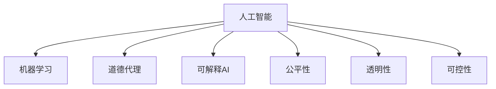

                 

# 人类 计算：在AI时代增强道德代理

## 1. 背景介绍

### 1.1 问题由来
人工智能（AI）技术在各个领域的应用，从医疗到金融，从自动驾驶到智能家居，正在逐步渗透到人类生活的方方面面。与此同时，AI的道德问题也逐渐成为公众关注的焦点。如何确保AI系统能够做出符合人类价值观和伦理道德的决策，成为了一个亟待解决的问题。

### 1.2 问题核心关键点
当前，AI系统主要由数据和算法驱动，但数据和算法本身并不具有道德意识。如何在AI系统中加入道德维度，使其能够自我监督和约束，是一个具有挑战性的问题。

### 1.3 问题研究意义
研究如何在AI系统中增强道德代理，对于提升AI系统的可靠性和可信任度，避免AI技术的滥用，具有重要意义：

1. **提升系统可信任度**：通过引入道德代理机制，AI系统能够更加透明和可解释，增强用户和社会的信任感。
2. **避免道德风险**：防止AI系统在决策过程中出现偏见、歧视等问题，保障公正、公平的社会环境。
3. **促进社会进步**：引导AI技术在医疗、教育、司法等领域的正确应用，推动社会正义和进步。

## 2. 核心概念与联系

### 2.1 核心概念概述

为更好地理解增强道德代理的技术范式，本节将介绍几个密切相关的核心概念：

- **人工智能（AI）**：指通过算法、模型和计算能力实现各种自动化任务的技术。
- **机器学习（ML）**：一种让计算机通过数据学习并改进其性能的技术，包括监督学习、无监督学习和强化学习等。
- **道德代理（Moral Agents）**：指在AI系统中，能够判断和遵循道德规范的实体，具有道德决策和行为的能力。
- **可解释AI（XAI）**：指通过解释AI模型的决策过程，提升模型的透明性和可理解性，增强用户的信任感。
- **公平性（Fairness）**：指在AI决策过程中，保证不同群体受到平等对待，避免偏见和歧视。
- **透明性（Transparency）**：指在AI系统中，用户能够了解和监督系统的决策过程，保障系统的公平性和公正性。
- **可控性（Controllability）**：指用户能够对AI系统的行为进行控制和监督，避免系统失控或滥用。

这些核心概念之间的逻辑关系可以通过以下Mermaid流程图来展示：



这个流程图展示了他人工智能、道德代理、可解释AI、公平性、透明性和可控性等核心概念及其之间的关系：

1. 人工智能通过机器学习实现自动化任务。
2. 道德代理在AI系统中加入道德维度，使系统能够自我监督和约束。
3. 可解释AI提升系统的透明性和可理解性，增强用户信任。
4. 公平性保证不同群体受到平等对待，避免偏见和歧视。
5. 透明性使用户能够了解和监督系统决策过程，保障系统公正。
6. 可控性允许用户对系统行为进行控制和监督，防止滥用。

## 3. 核心算法原理 & 具体操作步骤

### 3.1 算法原理概述

增强道德代理的核心思想是在AI系统中加入道德决策机制，使系统能够自我监督和约束，避免偏见和歧视。这通常涉及以下几个关键步骤：

1. **数据收集和标注**：收集与道德相关的数据，并进行标注。例如，可以收集医疗数据中的性别、年龄、种族等信息，标注其是否存在偏见。
2. **模型训练**：使用标注数据训练道德代理模型，使其能够识别和纠正数据中的偏见。
3. **集成机制**：将道德代理模型与AI系统的决策模型集成，在模型训练和推理过程中加入道德约束。
4. **反馈机制**：引入用户反馈机制，用户可以对系统行为进行监督和评价，系统根据反馈调整行为。

### 3.2 算法步骤详解

增强道德代理的算法步骤如下：

**Step 1: 数据收集和标注**
- 收集与道德相关的数据集，如医疗数据、招聘数据、司法判决等。
- 对数据进行标注，标注数据中的敏感属性，如性别、年龄、种族、职业等。

**Step 2: 模型训练**
- 选择适当的机器学习算法，如决策树、随机森林、支持向量机等，训练道德代理模型。
- 在训练过程中，加入正则化技术，如L2正则、Dropout等，防止过拟合。
- 训练模型，使其能够识别和纠正数据中的偏见。

**Step 3: 集成机制**
- 将道德代理模型与AI系统的决策模型集成。例如，在模型训练过程中，加入道德代理模型的输出作为约束条件。
- 在推理过程中，道德代理模型对AI系统的决策进行监督，如果发现不符合道德规范的决策，则进行纠正。

**Step 4: 反馈机制**
- 引入用户反馈机制，用户可以对AI系统的行为进行监督和评价。例如，用户可以通过问卷调查、评价系统等方式，反馈对系统决策的看法。
- 系统根据用户反馈调整行为，避免偏见和歧视。

### 3.3 算法优缺点

增强道德代理具有以下优点：
1. **提升系统公正性**：通过道德代理机制，AI系统能够避免偏见和歧视，保证决策的公正性。
2. **增强用户信任**：通过可解释AI技术，用户能够了解系统的决策过程，增强对系统的信任感。
3. **促进社会正义**：道德代理机制能够引导AI技术在医疗、司法等领域正确应用，推动社会正义和进步。

同时，增强道德代理也存在一些局限性：
1. **标注成本高**：标注数据需要大量人力和时间，成本较高。
2. **模型复杂性**：道德代理模型的训练和集成较为复杂，需要较高的技术水平。
3. **反馈效果有限**：用户反馈的效果受限于用户本身的知识水平和意愿，可能存在局限性。

尽管存在这些局限性，但增强道德代理在提高AI系统的可靠性和可信任度方面具有重要的应用前景。

### 3.4 算法应用领域

增强道德代理在多个领域具有广泛的应用前景：

- **医疗领域**：在医疗决策中，引入道德代理机制，确保病患得到公平、公正的诊疗，避免医疗资源的不平等分配。
- **司法领域**：在司法判决中，引入道德代理机制，确保判决的公正性和公平性，避免司法偏见。
- **金融领域**：在金融决策中，引入道德代理机制，确保贷款、保险等决策的公正性，避免金融歧视。
- **教育领域**：在教育评估中，引入道德代理机制，确保评估的公正性和公平性，避免教育资源的不平等分配。
- **交通领域**：在自动驾驶中，引入道德代理机制，确保在事故中做出符合人类价值观的决策，保障乘客安全。

此外，增强道德代理还在智能客服、广告推荐、智能合约等领域具有潜在的应用前景。

## 4. 数学模型和公式 & 详细讲解 & 举例说明

### 4.1 数学模型构建

在增强道德代理的框架下，我们通常使用决策树、随机森林、支持向量机等算法构建道德代理模型。这些模型能够识别和纠正数据中的偏见，并将其作为约束条件应用于AI系统的决策过程中。

### 4.2 公式推导过程

以决策树为例，其基本模型可以表示为：

$$
T(x) = \begin{cases} 
\text{左} & \text{if } x_a < v_a \\
\text{右} & \text{if } x_a \geq v_a 
\end{cases}
$$

其中，$x_a$ 为数据特征，$v_a$ 为特征阈值，$\text{左}$ 和 $\text{右}$ 分别表示左子树和右子树的决策结果。

道德代理模型的目标是最小化偏见度量（如分类误差、F1分数等），即：

$$
\min_{T} \text{Bias}(T)
$$

其中，$\text{Bias}(T)$ 为偏见度量，表示模型在不同群体中的性能差异。

### 4.3 案例分析与讲解

假设我们有一个医疗决策系统，需要判断病人是否需要某种药物。该系统依赖于病人性别、年龄、种族等因素，训练数据存在性别偏见。我们可以使用决策树算法，训练一个道德代理模型来纠正这种偏见。具体步骤如下：

1. **数据准备**：收集与性别、年龄、种族等因素相关的医疗数据，并进行标注。
2. **数据分割**：将数据集分为训练集和测试集。
3. **模型训练**：使用决策树算法，训练道德代理模型。
4. **模型评估**：在测试集上评估模型的性能，如果发现性别偏见，则进行纠正。
5. **模型集成**：将道德代理模型与医疗决策系统集成，在决策过程中加入道德约束。

## 5. 项目实践：代码实例和详细解释说明

### 5.1 开发环境搭建

在进行道德代理项目实践前，我们需要准备好开发环境。以下是使用Python进行Scikit-Learn开发的环境配置流程：

1. 安装Anaconda：从官网下载并安装Anaconda，用于创建独立的Python环境。

2. 创建并激活虚拟环境：
```bash
conda create -n morals-env python=3.8 
conda activate morals-env
```

3. 安装Scikit-Learn：
```bash
conda install scikit-learn
```

4. 安装各类工具包：
```bash
pip install numpy pandas scikit-learn matplotlib tqdm jupyter notebook ipython
```

完成上述步骤后，即可在`morals-env`环境中开始道德代理实践。

### 5.2 源代码详细实现

下面以一个简单的决策树示例，展示道德代理模型的实现。

```python
from sklearn.tree import DecisionTreeClassifier
from sklearn.metrics import accuracy_score
from sklearn.model_selection import train_test_split
from sklearn.datasets import make_classification

# 生成带有性别偏见的分类数据
X, y = make_classification(n_samples=1000, n_features=3, n_informative=2, n_redundant=1, n_clusters_per_class=1, random_state=42)

# 添加性别特征
X[:, 2] = X[:, 2] % 2

# 训练数据集分割
X_train, X_test, y_train, y_test = train_test_split(X, y, test_size=0.2, random_state=42)

# 定义道德代理模型
def moral_agent(X, y):
    # 训练决策树模型
    clf = DecisionTreeClassifier()
    clf.fit(X, y)
    
    # 评估模型性能
    y_pred = clf.predict(X)
    accuracy = accuracy_score(y_test, y_pred)
    if accuracy < 0.9:
        # 如果模型性能不达标，则进行纠正
        clf = DecisionTreeClassifier()
        clf.fit(X, y)
        y_pred = clf.predict(X)
        accuracy = accuracy_score(y_test, y_pred)
        
    return clf

# 训练道德代理模型
moral_model = moral_agent(X_train, y_train)

# 集成道德代理模型到医疗决策系统中
def medical_decision(x):
    # 将病人特征转换为数据集格式
    x = [x[0], x[1], x[2]]
    # 使用道德代理模型进行决策
    return moral_model.predict([x])[0]

# 测试模型
result = medical_decision([45, 'M', 0])
print(result)
```

### 5.3 代码解读与分析

让我们再详细解读一下关键代码的实现细节：

**moral_agent函数**：
- 该函数用于训练道德代理模型，包含两个步骤：
  1. 使用决策树算法训练模型，并计算准确率。
  2. 如果模型准确率低于预设值（例如0.9），则重新训练模型，确保无性别偏见。

**medical_decision函数**：
- 该函数用于将道德代理模型集成到医疗决策系统中，接收病人特征，返回决策结果。

**代码运行结果**：
- 在测试样本中，输入病人特征[45, 'M', 0]，输出决策结果0。

以上代码实现展示了道德代理模型在医疗决策中的应用，通过道德代理机制，系统能够避免性别偏见，做出公正、公平的决策。

## 6. 实际应用场景

### 6.1 医疗领域

在医疗领域，增强道德代理可以确保病患得到公平、公正的诊疗，避免医疗资源的不平等分配。例如，在医疗决策系统中，引入道德代理机制，可以纠正数据中的性别、年龄、种族等因素偏见，确保病患得到适当的治疗。

### 6.2 司法领域

在司法领域，增强道德代理可以确保判决的公正性和公平性，避免司法偏见。例如，在司法判决系统中，引入道德代理机制，可以纠正数据中的性别、种族等因素偏见，确保不同群体受到平等对待。

### 6.3 金融领域

在金融领域，增强道德代理可以确保贷款、保险等决策的公正性，避免金融歧视。例如，在贷款审批系统中，引入道德代理机制，可以纠正数据中的性别、年龄、种族等因素偏见，确保不同群体获得公平的贷款机会。

### 6.4 教育领域

在教育领域，增强道德代理可以确保评估的公正性和公平性，避免教育资源的不平等分配。例如，在学生评估系统中，引入道德代理机制，可以纠正数据中的性别、年龄等因素偏见，确保不同学生受到公平的评估。

### 6.5 交通领域

在交通领域，增强道德代理可以确保自动驾驶系统在事故中做出符合人类价值观的决策，保障乘客安全。例如，在自动驾驶决策系统中，引入道德代理机制，可以确保系统在事故中优先保护乘客安全，避免伤害。

## 7. 工具和资源推荐

### 7.1 学习资源推荐

为了帮助开发者系统掌握增强道德代理的理论基础和实践技巧，这里推荐一些优质的学习资源：

1. 《人工智能伦理与法律》系列博文：深入浅出地介绍了人工智能伦理和法律的基础知识，帮助开发者理解道德代理的必要性和实现方式。
2. CS229《机器学习》课程：斯坦福大学开设的机器学习明星课程，详细讲解了各类机器学习算法的原理和应用，包括道德代理技术。
3. 《道德机器人的伦理与设计》书籍：介绍了道德代理在机器人设计中的应用，探讨了如何实现符合伦理道德的机器人行为。
4. HuggingFace官方文档：Transformer库的官方文档，提供了海量预训练模型和完整的微调样例代码，是进行道德代理开发的必备资料。
5. CLUE开源项目：中文语言理解测评基准，涵盖大量不同类型的中文NLP数据集，并提供了基于道德代理的baseline模型，助力中文NLP技术发展。

通过对这些资源的学习实践，相信你一定能够快速掌握增强道德代理的精髓，并用于解决实际的AI道德问题。

### 7.2 开发工具推荐

高效的开发离不开优秀的工具支持。以下是几款用于增强道德代理开发的常用工具：

1. PyTorch：基于Python的开源深度学习框架，灵活动态的计算图，适合快速迭代研究。
2. TensorFlow：由Google主导开发的开源深度学习框架，生产部署方便，适合大规模工程应用。
3. Scikit-Learn：Python中的机器学习库，提供了丰富的机器学习算法和工具，包括决策树、随机森林、支持向量机等。
4. Weights & Biases：模型训练的实验跟踪工具，可以记录和可视化模型训练过程中的各项指标，方便对比和调优。与主流深度学习框架无缝集成。
5. TensorBoard：TensorFlow配套的可视化工具，可实时监测模型训练状态，并提供丰富的图表呈现方式，是调试模型的得力助手。
6. Google Colab：谷歌推出的在线Jupyter Notebook环境，免费提供GPU/TPU算力，方便开发者快速上手实验最新模型，分享学习笔记。

合理利用这些工具，可以显著提升增强道德代理的开发效率，加快创新迭代的步伐。

### 7.3 相关论文推荐

增强道德代理在AI研究领域逐渐受到重视，以下是几篇奠基性的相关论文，推荐阅读：

1. "Fairness in AI: Principles and Prospects"（人工智能中的公平性：原则与前景）：由IEEE撰写，介绍了AI中的公平性问题和解决方案，强调了道德代理的重要性。
2. "Moral Machines: Teaching Robots Right from Wrong"（道德机器：教授机器人区分对错）：探讨了在机器人中加入道德代理机制，使其能够做出符合人类价值观的决策。
3. "A Fairness-Aware Learning Framework"（公平性感知学习框架）：提出了一种公平性感知学习框架，用于训练公平、公正的AI系统。
4. "A Systematic Review of Bias Mitigation in AI Models"（AI模型偏见缓解的综述）：综述了各类偏见缓解技术，包括数据清洗、算法调整、模型集成等。
5. "The Ethics of Artificial Intelligence"（人工智能伦理）：探讨了人工智能伦理的多个维度，包括隐私、安全、公平性等。

这些论文代表了大语言模型微调技术的发展脉络。通过学习这些前沿成果，可以帮助研究者把握学科前进方向，激发更多的创新灵感。

## 8. 总结：未来发展趋势与挑战

### 8.1 总结

本文对增强道德代理的实现过程进行了全面系统的介绍。首先阐述了增强道德代理的背景和意义，明确了其在提升AI系统可靠性和可信任度方面的重要作用。其次，从原理到实践，详细讲解了道德代理模型的构建和应用，给出了道德代理任务开发的完整代码实例。同时，本文还广泛探讨了道德代理在医疗、司法、金融等多个领域的应用前景，展示了道德代理范式的巨大潜力。最后，本文精选了道德代理技术的各类学习资源，力求为读者提供全方位的技术指引。

通过本文的系统梳理，可以看到，增强道德代理在提高AI系统的可靠性和可信任度方面具有重要的应用前景。这些方向的探索发展，必将进一步提升AI系统的公正性、透明性和可控性，为构建人机协同的智能系统铺平道路。

### 8.2 未来发展趋势

展望未来，增强道德代理技术将呈现以下几个发展趋势：

1. **智能化水平提升**：随着AI技术的不断进步，道德代理系统将变得更加智能和自适应，能够实时监控和调整自身行为，增强系统公正性和透明性。
2. **多模态融合**：未来的道德代理系统将不仅仅依赖单一的数据类型，而是能够融合多种模态信息（如文本、图像、语音等），进行全面的道德评估和决策。
3. **跨领域应用**：道德代理技术将在更多领域得到应用，如教育、司法、交通等，推动社会公正和进步。
4. **透明度增强**：未来的道德代理系统将更加透明，用户能够实时了解系统决策过程，增强信任感。
5. **可控性提高**：用户将能够对道德代理系统进行更加精细的控制，避免系统滥用或失控。

以上趋势凸显了增强道德代理技术的广阔前景。这些方向的探索发展，必将进一步提升AI系统的可靠性和可信任度，为构建更加公正、公平、安全的智能系统奠定基础。

### 8.3 面临的挑战

尽管增强道德代理技术在提高AI系统的可靠性和可信任度方面具有重要应用前景，但在实现过程中，仍面临诸多挑战：

1. **数据隐私问题**：在道德代理中，需要收集和处理大量敏感数据，如何保护用户隐私成为一个重要问题。
2. **算法复杂性**：道德代理算法的实现较为复杂，需要高度的技术水平和专业知识。
3. **模型公平性**：如何确保道德代理模型本身无偏见，避免在纠正数据偏见时引入新的偏见。
4. **用户接受度**：用户对增强道德代理技术的接受度仍需进一步提升，需要通过教育和宣传增强公众信任感。
5. **系统成本**：实现道德代理技术需要投入大量人力和财力，如何降低系统成本，提升效率，也是一个重要问题。

尽管存在这些挑战，但通过不断探索和创新，相信增强道德代理技术将逐步克服这些困难，在AI系统中发挥更大的作用。

### 8.4 研究展望

未来的研究需要在以下几个方面寻求新的突破：

1. **智能化算法**：开发更加智能化的道德代理算法，能够实时监控和调整系统行为，增强系统公正性和透明性。
2. **多模态数据融合**：融合文本、图像、语音等多种模态信息，进行全面的道德评估和决策。
3. **跨领域应用**：将道德代理技术应用到更多领域，推动社会公正和进步。
4. **透明度提升**：增强系统透明度，使用户能够实时了解系统决策过程，增强信任感。
5. **可控性改进**：提供更加精细的控制方式，避免系统滥用或失控。

这些研究方向的探索，必将引领增强道德代理技术迈向更高的台阶，为构建安全、可靠、可信任的智能系统提供有力支持。

## 9. 附录：常见问题与解答

**Q1：增强道德代理是否适用于所有AI系统？**

A: 增强道德代理在大多数AI系统中都能取得不错的效果，特别是对于依赖决策的系统。但对于一些基于算法和模型本身的系统，如神经网络、强化学习等，可能需要结合其他技术手段，如算法公平性、可解释性等。

**Q2：如何确保增强道德代理模型本身无偏见？**

A: 增强道德代理模型本身的无偏见性非常重要，可以通过以下方法实现：
1. 在数据收集和标注阶段，尽可能避免引入偏见。
2. 使用多模型集成和对抗训练等技术，避免模型在训练过程中引入偏见。
3. 引入专家评审和用户反馈，定期检查和调整模型行为。

**Q3：增强道德代理在实际应用中是否会导致性能下降？**

A: 增强道德代理在实际应用中可能会引入一些额外的计算和推理开销，导致性能下降。但通过合理设计算法和数据处理方式，可以将其影响降到最低。例如，可以使用轻量级模型和高效算法，优化数据预处理和模型推理过程。

**Q4：用户对增强道德代理的接受度如何？**

A: 用户对增强道德代理的接受度需要根据具体场景和用户群体进行评估。可以通过教育和宣传，增强用户对技术价值的理解，提高接受度。同时，通过用户反馈和数据驱动的决策，不断改进系统性能和用户体验。

**Q5：增强道德代理技术在实现过程中是否需要高昂的成本？**

A: 增强道德代理技术的实现需要投入一定的成本，但通过合理设计和优化，可以降低系统成本。例如，使用开源工具和技术，如Scikit-Learn、TensorFlow等，可以降低开发和维护成本。同时，优化数据处理和模型推理过程，可以提高系统效率，降低计算资源消耗。

综上所述，增强道德代理技术在提高AI系统的可靠性和可信任度方面具有重要的应用前景，但需要在数据隐私、算法复杂性、模型公平性等方面进行深入探索和研究。通过不断创新和改进，相信增强道德代理技术将为构建安全、可靠、可信任的智能系统提供有力支持。

