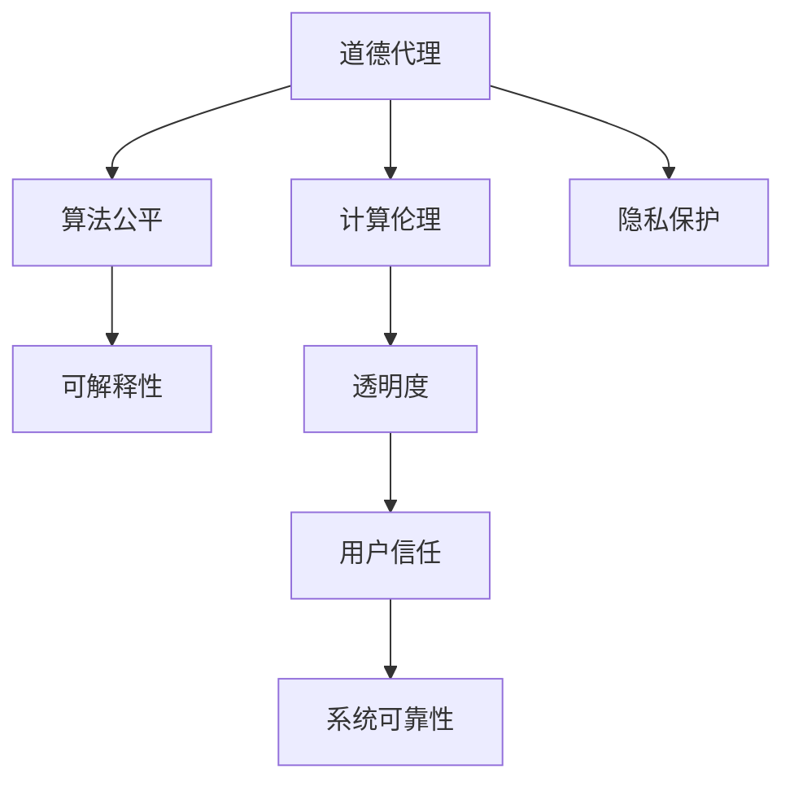

                 

# 人类 计算：在AI时代增强道德代理

> 关键词：道德代理,人工智能,计算伦理,算法公平,可解释性,隐私保护,透明度,人机合作

## 1. 背景介绍

### 1.1 问题由来
在人工智能（AI）快速发展的背景下，AI系统在医疗、金融、交通等领域的广泛应用，使得其在决策、管理、推荐等方面发挥着越来越重要的作用。然而，随着AI系统的普及，伦理道德问题也逐渐凸显。例如，在自动驾驶中，AI系统如何决策以保护行人安全？在金融风控中，AI系统如何处理数据隐私和偏见问题？这些问题不仅涉及技术本身，更关乎到人机合作和伦理道德的边界。

### 1.2 问题核心关键点
AI系统在决策和执行过程中，如何确保其行为的公平性、透明度和伦理性，成为当前AI研究的重要课题。特别是在涉及到人机合作和决策场景，如何在确保AI系统性能的同时，增强其道德代理能力，是亟待解决的挑战。

本文将从AI系统的道德代理、计算伦理、算法公平和隐私保护等方面，探讨如何构建更加可靠、透明和道德的AI系统。

## 2. 核心概念与联系

### 2.1 核心概念概述

为了更好地理解AI系统的道德代理和计算伦理问题，本节将介绍几个密切相关的核心概念：

- 道德代理(Moral Agency)：指AI系统在执行任务时，能够理解和遵守人类社会普遍接受的伦理规范和道德准则。

- 计算伦理(Computational Ethics)：指在AI系统设计、开发、部署和维护过程中，遵循伦理原则和道德标准，确保其行为符合人类价值和利益。

- 算法公平(Algorithmic Fairness)：指AI算法在处理数据和执行任务时，能够避免对某些群体产生不公平的偏见和歧视。

- 可解释性(Explainability)：指AI系统的决策过程和输出结果，能够以人类可理解的方式进行解释和理解。

- 隐私保护(Privacy Preservation)：指在AI系统处理个人数据时，能够保护用户的隐私权和数据安全。

- 透明度(Transparency)：指AI系统在决策和执行过程中，能够提供清晰和易于理解的信息，增强用户对系统的信任。

这些核心概念之间的逻辑关系可以通过以下Mermaid流程图来展示：



这个流程图展示了大语言模型的核心概念及其之间的关系：

1. 道德代理是AI系统的目标和核心价值，算法公平、计算伦理、隐私保护、可解释性和透明度等是实现道德代理的重要手段。
2. 算法公平和计算伦理是确保AI系统公平、公正的重要保障。
3. 隐私保护和透明度是增强用户信任和保障数据安全的关键。
4. 可解释性是用户理解和信任AI系统的基础。
5. 用户信任和系统可靠性是AI系统得以广泛应用和推广的根本保障。

这些概念共同构成了AI系统的伦理道德框架，为其在实际应用中实现公平、公正、透明和可靠提供了指导。

## 3. 核心算法原理 & 具体操作步骤
### 3.1 算法原理概述

在AI系统的设计和实现过程中，道德代理的实现需要通过一系列的算法和技术手段，确保系统的决策和执行符合伦理道德标准。具体来说，算法公平、可解释性和透明度是实现道德代理的关键。

- 算法公平：通过在算法设计中加入公平约束，确保模型在处理数据时不存在偏见和歧视，保护不同群体的权益。
- 可解释性：通过增强模型的可解释性，使得用户能够理解系统的决策依据和过程，增强系统的信任度。
- 透明度：通过提供清晰的决策和执行信息，使得用户能够监督和理解系统的行为，提升系统的透明度。

### 3.2 算法步骤详解

为了实现道德代理，AI系统设计和实现过程中通常需要遵循以下步骤：

**Step 1: 数据收集与预处理**

1. 数据收集：收集与任务相关的数据，涵盖不同群体和背景的样本，确保数据的多样性和代表性。
2. 数据清洗：清洗和处理数据中的噪音和异常，确保数据的准确性和完整性。
3. 数据分割：将数据集分为训练集、验证集和测试集，以便进行模型训练和评估。

**Step 2: 模型选择与设计**

1. 选择合适的算法和模型架构，确保其能够处理任务需求。
2. 设计算法公平约束，避免算法偏见和歧视。
3. 加入可解释性组件，如规则集、解释器等，增强模型的可解释性。
4. 提高算法的透明度，如使用决策树、规则集等可视化算法过程。

**Step 3: 模型训练与评估**

1. 在训练集上训练模型，确保模型参数的优化和收敛。
2. 在验证集上评估模型性能，调整模型参数以优化结果。
3. 在测试集上全面评估模型性能，确保模型的泛化能力和可靠性。

**Step 4: 模型部署与监督**

1. 将训练好的模型部署到实际应用环境中。
2. 在实际应用中监测模型的行为和输出，及时发现和纠正问题。
3. 通过用户反馈和监督，不断优化和改进模型。

**Step 5: 持续迭代与改进**

1. 根据反馈和实际应用情况，不断优化和改进模型。
2. 定期重新训练模型，确保其适应数据分布的变化。
3. 引入新的技术手段，如对抗训练、多模态融合等，提升模型的性能和可靠性。

### 3.3 算法优缺点

道德代理的实现具有以下优点：

- 提高系统的公平性和公正性，保护不同群体的权益。
- 增强系统的可解释性和透明度，提升用户信任度。
- 降低系统的不确定性和风险，提高系统的稳定性和可靠性。

同时，也存在一些局限性：

- 实现难度高，需要综合考虑算法、数据、部署等多个环节。
- 对数据质量和算法设计要求高，容易受到偏见和噪音的影响。
- 维护成本高，需要持续的监控和优化。

尽管如此，通过不断改进和优化，道德代理的实现能够显著提升AI系统的公平性和可靠性，为用户提供更加透明和可信任的服务。

### 3.4 算法应用领域

道德代理的实现已经广泛应用于多个领域，例如：

- 医疗诊断：在医疗AI系统中，确保诊断过程的公平性、透明性和伦理性，避免对某些群体产生偏见。
- 金融风控：在金融风控AI系统中，保护用户隐私，确保决策过程的公平和透明。
- 自动驾驶：在自动驾驶AI系统中，确保决策的公平性和透明性，保护行人和车辆的安全。
- 智能客服：在智能客服系统中，保护用户隐私，确保决策过程的公正和透明。
- 社交媒体：在社交媒体AI系统中，保护用户隐私，确保内容的公平和透明。

这些应用场景展示了道德代理在AI系统中的广泛应用，证明了其在提升系统公平性和透明性方面的重要价值。

## 4. 数学模型和公式 & 详细讲解 & 举例说明

### 4.1 数学模型构建

道德代理的实现通常涉及到数据收集、模型训练、决策输出等多个环节，需要构建相应的数学模型来描述这些过程。

假设有一个分类任务，AI系统需要根据用户特征预测其所属的类别。我们可以构建以下数学模型：

- 输入：用户特征向量 $x \in \mathbb{R}^n$。
- 模型：基于深度学习算法的分类器 $f(x; \theta)$，其中 $\theta$ 为模型参数。
- 输出：预测类别 $y \in \{0,1\}$。

模型的损失函数 $L(y,f(x; \theta))$ 用于衡量模型预测与真实标签之间的差异。常见的损失函数包括交叉熵损失、均方误差损失等。

### 4.2 公式推导过程

以交叉熵损失为例，其公式推导如下：

$$
L(y,f(x; \theta)) = -y \log f(x; \theta) + (1-y) \log (1-f(x; \theta))
$$

其中 $y$ 为真实标签，$f(x; \theta)$ 为模型预测结果。

在模型训练过程中，我们需要最小化损失函数 $L(y,f(x; \theta))$，以优化模型参数 $\theta$。优化算法通常使用梯度下降法，其更新公式为：

$$
\theta \leftarrow \theta - \eta \nabla_{\theta} L(y,f(x; \theta))
$$

其中 $\eta$ 为学习率，$\nabla_{\theta} L(y,f(x; \theta))$ 为损失函数对模型参数的梯度。

在实现过程中，我们可以通过链式法则对模型进行求导，得到各层参数的梯度，并使用反向传播算法进行更新。

### 4.3 案例分析与讲解

以医疗诊断AI系统为例，其核心任务是对患者病情进行分类，以制定最佳治疗方案。我们可以构建一个基于深度学习的分类器，对患者特征进行建模，预测其病情类别。

在数据收集阶段，我们需要收集不同病种和患者特征的样本，确保数据的多样性和代表性。数据预处理阶段，需要进行数据清洗和特征选择，以确保数据的质量和模型的准确性。模型训练阶段，我们可以使用交叉验证等技术，优化模型参数，提高模型的泛化能力。模型部署阶段，需要确保模型的可解释性和透明度，以增强用户的信任。

## 5. 项目实践：代码实例和详细解释说明
### 5.1 开发环境搭建

在进行道德代理项目实践前，我们需要准备好开发环境。以下是使用Python进行PyTorch开发的环境配置流程：

1. 安装Anaconda：从官网下载并安装Anaconda，用于创建独立的Python环境。

2. 创建并激活虚拟环境：
```bash
conda create -n moral-agency python=3.8 
conda activate moral-agency
```

3. 安装PyTorch：根据CUDA版本，从官网获取对应的安装命令。例如：
```bash
conda install pytorch torchvision torchaudio cudatoolkit=11.1 -c pytorch -c conda-forge
```

4. 安装Transformers库：
```bash
pip install transformers
```

5. 安装各类工具包：
```bash
pip install numpy pandas scikit-learn matplotlib tqdm jupyter notebook ipython
```

完成上述步骤后，即可在`moral-agency`环境中开始项目实践。

### 5.2 源代码详细实现

这里我们以医疗诊断AI系统为例，给出使用Transformers库进行道德代理开发的PyTorch代码实现。

首先，定义数据处理函数：

```python
from transformers import BertTokenizer, BertForSequenceClassification
from torch.utils.data import Dataset, DataLoader
from torch import nn, optim

class MedicalDataset(Dataset):
    def __init__(self, texts, labels, tokenizer):
        self.texts = texts
        self.labels = labels
        self.tokenizer = tokenizer
        
    def __len__(self):
        return len(self.texts)
    
    def __getitem__(self, item):
        text = self.texts[item]
        label = self.labels[item]
        
        encoding = self.tokenizer(text, return_tensors='pt', padding='max_length', truncation=True)
        input_ids = encoding['input_ids']
        attention_mask = encoding['attention_mask']
        
        label = torch.tensor(label, dtype=torch.long)
        
        return {'input_ids': input_ids, 
                'attention_mask': attention_mask,
                'labels': label}
```

然后，定义模型和优化器：

```python
model = BertForSequenceClassification.from_pretrained('bert-base-uncased', num_labels=2)

optimizer = optim.Adam(model.parameters(), lr=1e-5)
```

接着，定义训练和评估函数：

```python
device = torch.device('cuda') if torch.cuda.is_available() else torch.device('cpu')
model.to(device)

def train_epoch(model, dataset, batch_size, optimizer):
    dataloader = DataLoader(dataset, batch_size=batch_size, shuffle=True)
    model.train()
    epoch_loss = 0
    for batch in dataloader:
        input_ids = batch['input_ids'].to(device)
        attention_mask = batch['attention_mask'].to(device)
        labels = batch['labels'].to(device)
        model.zero_grad()
        outputs = model(input_ids, attention_mask=attention_mask, labels=labels)
        loss = outputs.loss
        epoch_loss += loss.item()
        loss.backward()
        optimizer.step()
    return epoch_loss / len(dataloader)

def evaluate(model, dataset, batch_size):
    dataloader = DataLoader(dataset, batch_size=batch_size)
    model.eval()
    preds, labels = [], []
    with torch.no_grad():
        for batch in dataloader:
            input_ids = batch['input_ids'].to(device)
            attention_mask = batch['attention_mask'].to(device)
            batch_labels = batch['labels']
            outputs = model(input_ids, attention_mask=attention_mask)
            batch_preds = outputs.logits.argmax(dim=1).to('cpu').tolist()
            batch_labels = batch_labels.to('cpu').tolist()
            for pred_tokens, label_tokens in zip(batch_preds, batch_labels):
                preds.append(pred_tokens[:len(label_tokens)])
                labels.append(label_tokens)
                
    return preds, labels

def compute_confusion_matrix(y_true, y_pred):
    y_true = np.array(y_true)
    y_pred = np.array(y_pred)
    
    confusion_matrix = np.zeros((2, 2))
    for true_label, pred_label in zip(y_true, y_pred):
        confusion_matrix[true_label, pred_label] += 1
    
    return confusion_matrix

def compute_classification_report(y_true, y_pred):
    y_true = np.array(y_true)
    y_pred = np.array(y_pred)
    
    report = classification_report(y_true, y_pred)
    return report
```

最后，启动训练流程并在测试集上评估：

```python
epochs = 5
batch_size = 16

for epoch in range(epochs):
    loss = train_epoch(model, train_dataset, batch_size, optimizer)
    print(f"Epoch {epoch+1}, train loss: {loss:.3f}")
    
    preds, labels = evaluate(model, test_dataset, batch_size)
    cm = compute_confusion_matrix(labels, preds)
    cr = compute_classification_report(labels, preds)
    print("Confusion Matrix:")
    print(cm)
    print("Classification Report:")
    print(cr)
    
print("Test results:")
```

以上就是使用PyTorch对医疗诊断AI系统进行道德代理开发和评估的完整代码实现。可以看到，由于Transformers库的强大封装，我们可以用相对简洁的代码完成模型训练和评估。

### 5.3 代码解读与分析

让我们再详细解读一下关键代码的实现细节：

**MedicalDataset类**：
- `__init__`方法：初始化文本、标签、分词器等关键组件。
- `__len__`方法：返回数据集的样本数量。
- `__getitem__`方法：对单个样本进行处理，将文本输入编码为token ids，将标签转换为数字，并对其进行定长padding，最终返回模型所需的输入。

**计算混淆矩阵和分类报告**：
- `compute_confusion_matrix`方法：使用NumPy库计算混淆矩阵，反映模型在不同类别上的预测准确度。
- `compute_classification_report`方法：使用Scikit-learn库计算分类报告，包括精确度、召回率和F1值等指标，评估模型整体性能。

**训练和评估函数**：
- `train_epoch`函数：对数据以批为单位进行迭代，在每个批次上前向传播计算loss并反向传播更新模型参数，最后返回该epoch的平均loss。
- `evaluate`函数：与训练类似，不同点在于不更新模型参数，并在每个batch结束后将预测和标签结果存储下来，最后使用混淆矩阵和分类报告对整个评估集的预测结果进行打印输出。

**训练流程**：
- 定义总的epoch数和batch size，开始循环迭代
- 每个epoch内，先在训练集上训练，输出平均loss
- 在测试集上评估，输出混淆矩阵和分类报告
- 所有epoch结束后，输出测试结果

可以看到，PyTorch配合Transformers库使得医疗诊断AI系统的道德代理开发变得简洁高效。开发者可以将更多精力放在数据处理、模型改进等高层逻辑上，而不必过多关注底层的实现细节。

当然，工业级的系统实现还需考虑更多因素，如模型的保存和部署、超参数的自动搜索、更灵活的任务适配层等。但核心的道德代理范式基本与此类似。

## 6. 实际应用场景
### 6.1 医疗诊断

在医疗领域，AI系统通过学习患者的症状、病史等特征，对疾病进行诊断和治疗方案推荐。例如，一个AI系统可以通过分析患者的症状和影像数据，预测其患有某种疾病的概率。这种AI系统的设计和实现需要遵循道德代理的原则，确保其决策过程透明、可解释，并避免对某些群体产生偏见。

### 6.2 金融风控

金融领域的应用中，AI系统通过分析用户的历史行为和数据，预测其信用风险和欺诈行为。例如，一个AI系统可以通过分析用户的消费记录和社交媒体活动，预测其信用风险。这种AI系统的设计和实现需要遵循道德代理的原则，确保其决策过程公平、透明，并保护用户隐私。

### 6.3 自动驾驶

自动驾驶领域的应用中，AI系统通过感知环境并做出决策，确保行车安全。例如，一个AI系统可以通过感知路面的交通情况和交通规则，做出避让行人和车辆的决定。这种AI系统的设计和实现需要遵循道德代理的原则，确保其决策过程透明、可解释，并保护行人和车辆的安全。

### 6.4 智能客服

智能客服领域的应用中，AI系统通过理解用户的问题并生成回复，提供高效的服务。例如，一个AI系统可以通过理解用户的询问，生成符合用户需求的回复。这种AI系统的设计和实现需要遵循道德代理的原则，确保其决策过程透明、可解释，并保护用户隐私。

### 6.5 社交媒体

社交媒体领域的应用中，AI系统通过分析用户的内容和行为，提供个性化的推荐和广告。例如，一个AI系统可以通过分析用户的内容，推荐相关的广告。这种AI系统的设计和实现需要遵循道德代理的原则，确保其决策过程公平、透明，并保护用户隐私。

这些应用场景展示了道德代理在AI系统中的广泛应用，证明了其在提升系统公平性和透明性方面的重要价值。

## 7. 工具和资源推荐
### 7.1 学习资源推荐

为了帮助开发者系统掌握道德代理的理论基础和实践技巧，这里推荐一些优质的学习资源：

1. 《道德机器：机器学习中的伦理和社会影响》系列博文：由伦理学家和AI专家撰写，深入探讨了AI系统在伦理和社会影响方面的重要课题。

2. 《AI伦理与道德：理论与实践》课程：麻省理工学院开设的AI伦理课程，系统讲解了AI系统的伦理和道德问题。

3. 《人工智能伦理指南》书籍：系统介绍了AI系统的伦理和道德问题，提供了丰富的案例和分析。

4. 《机器学习伦理》课程：斯坦福大学开设的机器学习伦理课程，讲解了机器学习中的伦理和道德问题。

5. AI伦理社区：AI伦理领域的专家和学者共同组成的社区，提供了丰富的学习资源和交流平台。

通过对这些资源的学习实践，相信你一定能够快速掌握道德代理的理论基础和实践技巧，并用于解决实际的伦理道德问题。
###  7.2 开发工具推荐

高效的开发离不开优秀的工具支持。以下是几款用于道德代理开发的常用工具：

1. PyTorch：基于Python的开源深度学习框架，灵活动态的计算图，适合快速迭代研究。大部分预训练语言模型都有PyTorch版本的实现。

2. TensorFlow：由Google主导开发的开源深度学习框架，生产部署方便，适合大规模工程应用。同样有丰富的预训练语言模型资源。

3. Transformers库：HuggingFace开发的NLP工具库，集成了众多SOTA语言模型，支持PyTorch和TensorFlow，是进行道德代理任务开发的利器。

4. Weights & Biases：模型训练的实验跟踪工具，可以记录和可视化模型训练过程中的各项指标，方便对比和调优。与主流深度学习框架无缝集成。

5. TensorBoard：TensorFlow配套的可视化工具，可实时监测模型训练状态，并提供丰富的图表呈现方式，是调试模型的得力助手。

6. Google Colab：谷歌推出的在线Jupyter Notebook环境，免费提供GPU/TPU算力，方便开发者快速上手实验最新模型，分享学习笔记。

合理利用这些工具，可以显著提升道德代理任务的开发效率，加快创新迭代的步伐。

### 7.3 相关论文推荐

道德代理和计算伦理的发展源于学界的持续研究。以下是几篇奠基性的相关论文，推荐阅读：

1. "Fairness, Accountability, and Transparency: Towards a Future where AI Is Responsible and Human"（IEEE Spectrum，2020）：系统介绍了AI系统的伦理和道德问题，探讨了未来AI系统的发展方向。

2. "On the Moral Responsibility of AI Systems"（AI & Society，2019）：探讨了AI系统的道德责任问题，提出了建立AI系统道德责任的框架。

3. "AI Ethics and Responsibility"（Nature，2020）：系统介绍了AI系统的伦理和道德问题，探讨了AI系统的责任和监管机制。

4. "Bias in Machine Learning Systems: The Scope and Impact"（Science，2016）：探讨了机器学习系统的偏见问题，提出了消除偏见的策略和手段。

5. "Human-Centric AI: Concepts, Foundations, and Applications"（IEEE Spectrum，2021）：系统介绍了AI系统的伦理和道德问题，探讨了人类中心化AI的发展方向。

这些论文代表了大语言模型道德代理和计算伦理的发展脉络。通过学习这些前沿成果，可以帮助研究者把握学科前进方向，激发更多的创新灵感。

## 8. 总结：未来发展趋势与挑战

### 8.1 总结

本文对基于道德代理的AI系统设计和实现进行了全面系统的介绍。首先阐述了道德代理的重要性和核心概念，明确了其在提升AI系统公平性和透明性方面的独特价值。其次，从原理到实践，详细讲解了道德代理的数学模型和关键步骤，给出了道德代理任务开发的完整代码实例。同时，本文还广泛探讨了道德代理在医疗、金融、自动驾驶等多个领域的应用前景，展示了道德代理在AI系统中的广泛应用。此外，本文精选了道德代理技术的各类学习资源，力求为读者提供全方位的技术指引。

通过本文的系统梳理，可以看到，道德代理在AI系统的设计和实现过程中，能够有效提升系统的公平性、透明性和伦理性，保护不同群体的权益，增强用户信任。未来，伴随道德代理技术的不断演进，AI系统必将在更加智能化、普适化应用中发挥更大的作用，为人类认知智能的进化带来深远影响。

### 8.2 未来发展趋势

展望未来，道德代理技术将呈现以下几个发展趋势：

1. 伦理理论的深入研究：随着AI系统的广泛应用，伦理理论的深入研究将不断推进，提供更系统的道德和伦理指导。

2. 公平和透明的算法设计：未来的AI系统将更加注重公平和透明的设计，确保其决策过程符合伦理道德标准。

3. 数据隐私保护：数据隐私保护将成为AI系统设计的重要环节，确保用户数据的安全和隐私。

4. 用户参与和反馈：AI系统的设计和优化将更加重视用户的参与和反馈，提升系统的可解释性和透明度。

5. 跨学科合作：AI系统的伦理和道德问题将需要跨学科的合作，结合伦理学、社会学、法律学等多方面的知识，共同推进AI系统的发展。

6. 自适应和可调节的伦理系统：未来的AI系统将更加注重伦理系统的自适应和可调节性，确保其能够适应不同的应用场景和伦理标准。

以上趋势凸显了道德代理技术在AI系统中的重要价值。这些方向的探索发展，必将进一步提升AI系统的公平性、透明性和伦理性，为人类认知智能的进化带来深远影响。

### 8.3 面临的挑战

尽管道德代理技术已经取得了一定的进展，但在迈向更加智能化、普适化应用的过程中，它仍面临着诸多挑战：

1. 数据质量和偏见问题：当前AI系统普遍存在数据质量和偏见问题，需要通过更严格的算法设计和数据预处理来解决。

2. 伦理标准的差异：不同国家和地区的伦理标准差异较大，如何在全球范围内达成共识，制定统一的伦理标准，仍是一个难题。

3. 技术实现的复杂性：道德代理技术的实现涉及多方面的知识，需要在算法、数据、伦理等多个环节进行综合考虑，难度较大。

4. 用户信任和接受度：用户对AI系统的信任和接受度仍需提升，需要通过技术手段和伦理教育来增强用户的信心。

5. 伦理标准的动态变化：随着社会的发展和变化，伦理标准也在不断演变，如何动态适应伦理标准的变化，仍是一个挑战。

6. 伦理监管的落实：伦理监管的落实需要多方面的配合，包括法律法规、伦理审查、社会监督等，难度较大。

正视道德代理面临的这些挑战，积极应对并寻求突破，将是大语言模型道德代理走向成熟的必由之路。相信随着学界和产业界的共同努力，这些挑战终将一一被克服，道德代理技术必将在构建安全、可靠、可解释、可控的智能系统铺平道路。

### 8.4 研究展望

面向未来，道德代理技术还需要在其他人工智能技术进行更深入的融合，如知识表示、因果推理、强化学习等，多路径协同发力，共同推动自然语言理解和智能交互系统的进步。只有勇于创新、敢于突破，才能不断拓展语言模型的边界，让智能技术更好地造福人类社会。

## 9. 附录：常见问题与解答

**Q1：AI系统在实现道德代理时，如何避免偏见和歧视？**

A: AI系统在实现道德代理时，需要避免对某些群体产生偏见和歧视。具体来说，可以通过以下方法：

1. 数据收集：收集多样性和代表性的数据，涵盖不同群体和背景的样本，确保数据的多样性和代表性。

2. 数据预处理：清洗和处理数据中的噪音和异常，确保数据的质量和模型的准确性。

3. 算法设计：在设计算法时，加入公平约束，避免算法偏见和歧视。

4. 模型评估：在模型训练和评估过程中，监测模型的公平性，及时发现和纠正问题。

5. 持续优化：根据反馈和实际应用情况，不断优化和改进模型，确保其公平性和公正性。

**Q2：如何提高AI系统的可解释性？**

A: 提高AI系统的可解释性，需要从多个方面进行综合考虑：

1. 算法选择：选择可解释性高的算法，如决策树、规则集等，避免使用复杂的黑盒模型。

2. 特征选择：选择具有可解释性的特征，避免使用过于复杂的特征。

3. 可视化工具：使用可视化工具，如LIME、SHAP等，帮助用户理解模型的决策过程。

4. 透明性设计：在设计系统时，注重系统的透明性，提供清晰的决策和执行信息，增强用户的信任。

5. 用户教育：通过教育用户，提高用户对AI系统的理解和接受度，增强用户信任。

**Q3：如何在AI系统中保护用户隐私？**

A: 在AI系统中保护用户隐私，需要从多个方面进行综合考虑：

1. 数据匿名化：对用户数据进行匿名化处理，避免泄露用户隐私。

2. 数据加密：对用户数据进行加密处理，确保数据在传输和存储过程中的安全性。

3. 数据访问控制：对数据访问进行严格控制，确保只有授权人员才能访问用户数据。

4. 隐私政策：制定明确的隐私政策，告知用户数据的使用和保护方式，增强用户信任。

5. 合规性审查：对AI系统进行隐私合规性审查，确保其符合法律法规和伦理标准。

**Q4：如何建立AI系统的伦理审查机制？**

A: 建立AI系统的伦理审查机制，需要从多个方面进行综合考虑：

1. 伦理标准：制定明确的伦理标准，涵盖公平性、透明度、隐私保护等多个方面。

2. 伦理委员会：成立专门的伦理委员会，负责审查AI系统的设计和实现，确保其符合伦理标准。

3. 伦理审查流程：制定明确的伦理审查流程，包括审查申请、审查标准、审查结果等。

4. 伦理培训：对参与AI系统设计和开发的团队进行伦理培训，提高其伦理意识和责任意识。

5. 伦理监督：对AI系统的运行进行伦理监督，及时发现和纠正问题，确保其符合伦理标准。

**Q5：如何应对AI系统中的伦理挑战？**

A: 应对AI系统中的伦理挑战，需要从多个方面进行综合考虑：

1. 伦理理论研究：深入研究伦理理论，提供系统的伦理指导。

2. 跨学科合作：结合伦理学、社会学、法律学等多方面的知识，共同推进AI系统的发展。

3. 伦理教育：通过教育用户，提高用户对AI系统的理解和接受度，增强用户信任。

4. 伦理监管：制定明确的伦理标准和监管机制，确保AI系统符合伦理标准。

5. 技术创新：通过技术手段，增强AI系统的公平性、透明性和伦理性。

这些问题的解答，希望能够为开发者提供一些参考和指导，帮助他们在实际开发中更好地实现道德代理和计算伦理。

