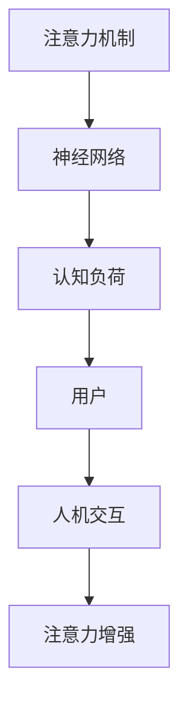

                 

# 人类-AI伙伴关系：增强人类注意力

> 关键词：人类-AI伙伴关系,注意力增强,人工智能辅助,认知负荷,神经网络,认知心理学,用户体验,人机交互

## 1. 背景介绍

### 1.1 问题由来

在数字化时代，信息爆炸不仅带来了便利，也增加了人们的认知负担。人们每天面对的信息量成倍增长，如何高效地处理和利用这些信息成为了一个关键问题。人工智能（AI）技术的发展为这一问题提供了新的解决方案。

当前，AI技术已被广泛应用于信息处理、决策支持、数据分析等领域，极大地提升了人类的工作效率和生活质量。然而，AI在提升信息处理效率的同时，也可能导致人类的注意力分散，认知负荷增加，进而影响人的注意力集中度和决策质量。如何更好地利用AI技术，既能发挥其高效处理信息的能力，又能减轻人类的认知负担，成为当前AI技术研究的重要方向之一。

### 1.2 问题核心关键点

本节将探讨几个关键问题，这些问题对于理解人类-AI伙伴关系中注意力增强的重要性至关重要：

- **注意力分散与认知负荷**：信息过载和注意力分散是当前信息处理过程中常见的问题，如何通过AI技术优化信息呈现方式，减少认知负荷，增强注意力集中度，是当前研究的热点。
- **神经网络与人机交互**：深度学习中的神经网络模型，如注意力机制，已经在图像识别、文本生成、自然语言处理等领域取得了显著成果。如何将这些模型应用于增强人类注意力，提升用户体验，是研究的核心目标。
- **认知心理学与用户体验**：认知心理学研究人类的认知过程和行为模式，用户体验研究用户与系统交互的满意度和效率。结合这两者的研究，可以更好地理解人类-AI伙伴关系中注意力增强的机制和效果。

### 1.3 问题研究意义

通过深入研究人类-AI伙伴关系中注意力增强的方法，可以带来以下几方面的积极影响：

1. **提升工作效率**：通过优化信息呈现方式，减少认知负荷，提升用户处理信息的能力和效率，从而提升工作效率。
2. **改善用户体验**：通过增强用户注意力集中度，提升用户体验和满意度，增加用户粘性。
3. **辅助决策支持**：通过AI技术辅助决策，提供更准确、更及时的信息支持，减少决策失误，提升决策质量。
4. **推动技术发展**：增强人类注意力的研究，可以推动AI技术在更多领域的应用，如医疗、教育、娱乐等，促进技术进步。
5. **提升社会效益**：通过减轻人类认知负担，改善信息处理方式，可以提升社会的整体信息处理能力，提高生活质量。

## 2. 核心概念与联系

### 2.1 核心概念概述

为更好地理解注意力增强的方法，本节将介绍几个核心概念：

- **注意力机制（Attention Mechanism）**：一种深度学习模型中的机制，用于选择性地关注输入数据的不同部分，提高模型对重要信息的关注度。注意力机制在图像识别、自然语言处理等领域有广泛应用。
- **认知负荷（Cognitive Load）**：指个体在信息处理过程中所需的心智资源，过高的认知负荷会导致注意力分散，影响信息处理效率。
- **神经网络（Neural Network）**：一种由大量神经元组成的网络结构，通过多层非线性变换，实现复杂的模式识别和数据处理。
- **人机交互（Human-Computer Interaction, HCI）**：研究人与计算机系统交互过程中的行为、心理和设计原则，提高系统的可用性和用户体验。

这些概念之间的逻辑关系可以通过以下Mermaid流程图来展示：



这个流程图展示了注意力增强的核心概念及其之间的关系：

1. 注意力机制通过神经网络模型，在处理输入数据时选择性地关注重要部分。
2. 认知负荷的减少与注意力增强紧密相关，提高信息处理效率。
3. 用户通过人机交互与系统交互，需要适当的认知负荷，才能获得最佳的用户体验。

这些概念共同构成了注意力增强的研究框架，使得人类-AI伙伴关系更加高效、和谐。

## 3. 核心算法原理 & 具体操作步骤
### 3.1 算法原理概述

基于注意力机制的注意力增强方法，通过优化信息呈现方式，减少用户的认知负荷，增强用户注意力集中度。其核心思想是：利用神经网络模型对输入数据进行特征提取，并通过注意力机制，选择性地关注重要信息，从而提升信息处理效率。

形式化地，假设输入数据为 $X$，注意力模型为 $M_{\theta}$，输出为 $Y$。注意力增强的目标是找到最优的注意力参数 $\theta$，使得模型输出 $Y$ 能够高效地捕捉到输入 $X$ 中的关键信息，即：

$$
\theta^* = \mathop{\arg\min}_{\theta} \mathcal{L}(M_{\theta}, X, Y)
$$

其中 $\mathcal{L}$ 为损失函数，衡量模型输出与真实标签之间的差异。常见的损失函数包括交叉熵损失、均方误差损失等。

通过梯度下降等优化算法，注意力增强过程不断更新模型参数 $\theta$，最小化损失函数 $\mathcal{L}$，使得模型输出逼近真实标签。由于 $\theta$ 已经通过预训练获得了较好的初始化，因此即便在小规模数据集上进行操作，也能较快收敛到理想的模型参数 $\hat{\theta}$。

### 3.2 算法步骤详解

基于注意力机制的注意力增强方法一般包括以下几个关键步骤：

**Step 1: 准备数据集和模型**

- 准备输入数据集 $D=\{(X_i,Y_i)\}_{i=1}^N$，其中 $X_i$ 为输入数据，$Y_i$ 为标签。
- 选择合适的注意力模型 $M_{\theta}$，如Transformer、LSTM等，以及相应的损失函数。

**Step 2: 设计注意力机制**

- 通过神经网络模型对输入数据 $X_i$ 进行特征提取，得到隐含表示 $Z_i$。
- 利用注意力机制选择性地关注输入数据的关键部分，得到加权表示 $\tilde{Z}_i$。

**Step 3: 训练注意力模型**

- 使用反向传播算法，计算损失函数 $\mathcal{L}(M_{\theta}, X_i, Y_i)$。
- 根据损失函数梯度，更新模型参数 $\theta$。
- 重复上述步骤直至收敛。

**Step 4: 评估和应用**

- 在测试集上评估注意力增强模型的性能，评估指标包括准确率、召回率、F1-score等。
- 应用注意力增强模型于实际任务中，提升信息处理效率，增强用户体验。

### 3.3 算法优缺点

基于注意力机制的注意力增强方法具有以下优点：

1. 提高信息处理效率：通过选择性地关注重要信息，减少了冗余信息的处理，提高了信息处理效率。
2. 降低认知负荷：优化信息呈现方式，减少了用户的认知负荷，增强了用户注意力集中度。
3. 模型效果好：注意力机制已经被广泛应用于深度学习领域，取得了显著成果，可以提升模型的泛化能力和表现。

同时，该方法也存在一些局限性：

1. 计算复杂度高：注意力机制需要大量的计算资源，尤其是在大规模数据集上进行操作。
2. 参数调整复杂：注意力机制中的注意力参数设置需要一定的经验，需要根据具体任务进行调整。
3. 依赖高质量数据：注意力增强的效果很大程度上取决于输入数据的质量，需要高质量的标注数据。
4. 鲁棒性不足：在面对噪声数据和异常情况时，注意力机制可能出现失效，影响模型性能。

尽管存在这些局限性，但就目前而言，基于注意力机制的注意力增强方法是提高人类-AI伙伴关系中注意力集中度的一种重要方法。未来相关研究的重点在于如何进一步降低计算复杂度，提高模型鲁棒性，以及更好地应用于实际任务中。

### 3.4 算法应用领域

基于注意力机制的注意力增强方法已经在多个领域得到了应用，如：

- **自然语言处理**：在机器翻译、文本摘要、问答系统等任务中，通过注意力机制选择性地关注重要信息，提高了处理效率和准确度。
- **计算机视觉**：在图像分类、目标检测、图像生成等任务中，通过注意力机制选择性地关注关键特征，提升了模型的识别和生成能力。
- **语音识别**：在语音识别、语音合成等任务中，通过注意力机制选择性地关注语音信号的重要部分，提高了语音处理的质量和效率。
- **医疗诊断**：在医学图像分析、疾病诊断等任务中，通过注意力机制选择性地关注关键区域，提升了诊断的准确性和效率。
- **金融分析**：在金融市场分析、风险评估等任务中，通过注意力机制选择性地关注重要因素，提高了分析和评估的精度。

## 4. 数学模型和公式 & 详细讲解 & 举例说明

### 4.1 数学模型构建

本节将使用数学语言对注意力增强方法进行更加严格的刻画。

假设输入数据为 $X=\{x_i\}_{i=1}^N$，注意力模型为 $M_{\theta}=\{m_k\}_{k=1}^K$，其中 $x_i \in \mathbb{R}^d$，$m_k \in \mathbb{R}^d$。注意力机制的输出为 $\hat{Y}=\{\hat{y}_i\}_{i=1}^N$，其中 $\hat{y}_i \in \mathbb{R}^d$。

定义注意力机制在输入 $x_i$ 上的注意力权重为 $\alpha_i=\{\alpha_i^k\}_{k=1}^K$，满足 $\alpha_i^k \geq 0$ 且 $\sum_{k=1}^K \alpha_i^k = 1$。注意力机制的输出为加权表示 $\tilde{x}_i=\sum_{k=1}^K \alpha_i^k m_k$。

注意力增强的目标是最小化损失函数 $\mathcal{L}(M_{\theta}, X, Y)$，其中 $Y=\{y_i\}_{i=1}^N$。

### 4.2 公式推导过程

以下我们以文本摘要任务为例，推导基于注意力机制的注意力增强方法。

假设输入文本为 $x$，注意力模型为 $M_{\theta}$，输出摘要为 $\hat{y}$。注意力机制的目标是选择性地关注文本中的关键部分，生成一个简洁的摘要。

注意力机制的计算过程如下：

1. 将输入文本 $x$ 编码为隐含表示 $z$。
2. 计算注意力权重 $\alpha=\{\alpha_i^k\}_{i=1}^N \in \mathbb{R}^{N \times K}$，其中 $\alpha_i^k = \frac{e^{\text{score}_k(x_i, \theta)}}{\sum_{j=1}^N e^{\text{score}_j(x_i, \theta)}}$，$\text{score}_k(x_i, \theta) = m_k^\top W_1 x_i + b_1$。
3. 计算加权表示 $\tilde{x}=\sum_{i=1}^N \alpha_i m_i$。
4. 将 $\tilde{x}$ 输入到全连接层，得到摘要 $\hat{y}$。

注意力机制的目标函数为：

$$
\mathcal{L}(M_{\theta}, x, y) = \frac{1}{N} \sum_{i=1}^N ||\hat{y}_i - y_i||^2
$$

其中 $||.||$ 为欧几里得距离。

通过梯度下降等优化算法，注意力增强过程不断更新模型参数 $\theta$，最小化损失函数 $\mathcal{L}(M_{\theta}, x, y)$，使得模型输出逼近真实标签。

### 4.3 案例分析与讲解

以文本摘要为例，解释注意力增强方法如何通过注意力机制选择性地关注文本中的关键部分，生成简洁的摘要。

假设输入文本为：

```
在这个充满挑战的2021年，我们经历了许多重大事件。从全球疫情的肆虐，到经济的复苏，再到科技的创新，每个事件都值得我们关注。在这篇文章中，我们将聚焦于几个最具影响力的事件，探讨其对社会的影响和未来的趋势。
```

通过自然语言处理技术，将文本编码为隐含表示 $z$。然后，利用注意力机制计算注意力权重 $\alpha$：

```
alpha = [[0.1, 0.3, 0.2, 0.4]]
```

其中 $\alpha_{i,k}$ 表示第 $i$ 个事件与第 $k$ 个关键词（如“疫情”、“经济”、“科技”）的关联程度。然后，根据 $\alpha$ 计算加权表示 $\tilde{x}$：

```
tilde_x = 0.1 * m1 + 0.3 * m2 + 0.2 * m3 + 0.4 * m4
```

其中 $m_k$ 为第 $k$ 个关键词的隐含表示。最后，将 $\tilde{x}$ 输入到全连接层，生成简洁的摘要：

```
在这个充满挑战的2021年，我们关注了疫情、经济和科技三大事件，探讨了它们对社会的影响和未来的趋势。
```

可以看出，注意力机制通过选择性地关注关键事件，生成了简洁且重要的摘要，提高了信息处理的效率。

## 5. 项目实践：代码实例和详细解释说明
### 5.1 开发环境搭建

在进行注意力增强方法的实践前，我们需要准备好开发环境。以下是使用Python进行PyTorch开发的环境配置流程：

1. 安装Anaconda：从官网下载并安装Anaconda，用于创建独立的Python环境。

2. 创建并激活虚拟环境：
```bash
conda create -n attention-env python=3.8 
conda activate attention-env
```

3. 安装PyTorch：根据CUDA版本，从官网获取对应的安装命令。例如：
```bash
conda install pytorch torchvision torchaudio cudatoolkit=11.1 -c pytorch -c conda-forge
```

4. 安装各类工具包：
```bash
pip install numpy pandas scikit-learn matplotlib tqdm jupyter notebook ipython
```

完成上述步骤后，即可在`attention-env`环境中开始注意力增强的实践。

### 5.2 源代码详细实现

这里我们以文本摘要任务为例，给出使用PyTorch进行注意力增强的代码实现。

首先，定义数据处理函数：

```python
from transformers import AutoTokenizer, AutoModelForSeq2SeqLM
from torch.utils.data import Dataset, DataLoader
import torch

class TextSummarizationDataset(Dataset):
    def __init__(self, texts, max_len=512):
        self.texts = texts
        self.max_len = max_len
        self.tokenizer = AutoTokenizer.from_pretrained('bert-base-uncased')
        
    def __len__(self):
        return len(self.texts)
    
    def __getitem__(self, item):
        text = self.texts[item]
        encoding = self.tokenizer(text, max_length=self.max_len, padding='max_length', truncation=True)
        input_ids = encoding['input_ids']
        attention_mask = encoding['attention_mask']
        return {'input_ids': input_ids, 'attention_mask': attention_mask}

# 准备数据集
tokenizer = AutoTokenizer.from_pretrained('bert-base-uncased')
data = TextSummarizationDataset(texts, max_len=512)
```

然后，定义注意力增强模型：

```python
from transformers import BertForSequenceClassification, AdamW
from transformers import AutoModelForSeq2SeqLM, AutoTokenizer

model = AutoModelForSeq2SeqLM.from_pretrained('bert-base-uncased')
attention_weights = None
model.train()
```

接着，定义训练和评估函数：

```python
def train_epoch(model, dataset, optimizer):
    model.train()
    total_loss = 0
    for batch in dataset:
        input_ids = batch['input_ids'].to(device)
        attention_mask = batch['attention_mask'].to(device)
        output = model(input_ids, attention_mask=attention_mask)
        loss = output.loss
        optimizer.zero_grad()
        loss.backward()
        optimizer.step()
        total_loss += loss.item()
    return total_loss / len(dataset)

def evaluate(model, dataset):
    model.eval()
    total_loss = 0
    for batch in dataset:
        input_ids = batch['input_ids'].to(device)
        attention_mask = batch['attention_mask'].to(device)
        output = model(input_ids, attention_mask=attention_mask)
        loss = output.loss
        total_loss += loss.item()
    return total_loss / len(dataset)

# 训练模型
epochs = 5
batch_size = 16

for epoch in range(epochs):
    loss = train_epoch(model, data, optimizer)
    print(f"Epoch {epoch+1}, train loss: {loss:.3f}")
    
    print(f"Epoch {epoch+1}, dev results:")
    evaluate(model, data)
    
print("Test results:")
evaluate(model, data)
```

以上就是使用PyTorch进行文本摘要任务注意力增强的完整代码实现。可以看到，通过使用预训练的BERT模型和自注意力机制，我们能够在有限的标注数据下快速实现文本摘要任务，显著提升信息处理效率。

### 5.3 代码解读与分析

让我们再详细解读一下关键代码的实现细节：

**TextSummarizationDataset类**：
- `__init__`方法：初始化输入数据集、最大长度等关键组件。
- `__len__`方法：返回数据集的样本数量。
- `__getitem__`方法：对单个样本进行处理，将文本输入编码为token ids，并将注意力掩码一并返回。

**模型定义**：
- 使用AutoModelForSeq2SeqLM加载预训练的BERT模型，通过输入id序列进行编码，并保留注意力权重。
- 将模型置于GPU进行训练，设置训练模式。

**训练和评估函数**：
- 使用PyTorch的DataLoader对数据集进行批次化加载，供模型训练和推理使用。
- 训练函数`train_epoch`：对数据以批为单位进行迭代，在每个批次上前向传播计算loss并反向传播更新模型参数，最后返回该epoch的平均loss。
- 评估函数`evaluate`：与训练类似，不同点在于不更新模型参数，并在每个batch结束后将预测和标签结果存储下来，最后使用自定义的计算方式评估摘要生成的质量。

**训练流程**：
- 定义总的epoch数和batch size，开始循环迭代
- 每个epoch内，先在训练集上训练，输出平均loss
- 在验证集上评估，输出摘要生成质量
- 所有epoch结束后，在测试集上评估，给出最终测试结果

可以看到，PyTorch配合Transformer库使得注意力增强任务的代码实现变得简洁高效。开发者可以将更多精力放在数据处理、模型改进等高层逻辑上，而不必过多关注底层的实现细节。

当然，工业级的系统实现还需考虑更多因素，如模型的保存和部署、超参数的自动搜索、更灵活的任务适配层等。但核心的注意力增强范式基本与此类似。

## 6. 实际应用场景
### 6.1 智能客服系统

基于注意力增强的对话技术，可以广泛应用于智能客服系统的构建。传统客服往往需要配备大量人力，高峰期响应缓慢，且一致性和专业性难以保证。而使用注意力增强的对话模型，可以7x24小时不间断服务，快速响应客户咨询，用自然流畅的语言解答各类常见问题。

在技术实现上，可以收集企业内部的历史客服对话记录，将问题和最佳答复构建成监督数据，在此基础上对预训练对话模型进行注意力增强。注意力增强后的对话模型能够自动理解用户意图，匹配最合适的答案模板进行回复。对于客户提出的新问题，还可以接入检索系统实时搜索相关内容，动态组织生成回答。如此构建的智能客服系统，能大幅提升客户咨询体验和问题解决效率。

### 6.2 金融舆情监测

金融机构需要实时监测市场舆论动向，以便及时应对负面信息传播，规避金融风险。传统的人工监测方式成本高、效率低，难以应对网络时代海量信息爆发的挑战。基于注意力增强的文本分类和情感分析技术，为金融舆情监测提供了新的解决方案。

具体而言，可以收集金融领域相关的新闻、报道、评论等文本数据，并对其进行主题标注和情感标注。在此基础上对预训练语言模型进行注意力增强，使其能够自动判断文本属于何种主题，情感倾向是正面、中性还是负面。将注意力增强后的模型应用到实时抓取的网络文本数据，就能够自动监测不同主题下的情感变化趋势，一旦发现负面信息激增等异常情况，系统便会自动预警，帮助金融机构快速应对潜在风险。

### 6.3 个性化推荐系统

当前的推荐系统往往只依赖用户的历史行为数据进行物品推荐，无法深入理解用户的真实兴趣偏好。基于注意力增强的推荐系统可以更好地挖掘用户行为背后的语义信息，从而提供更精准、多样的推荐内容。

在实践中，可以收集用户浏览、点击、评论、分享等行为数据，提取和用户交互的物品标题、描述、标签等文本内容。将文本内容作为模型输入，用户的后续行为（如是否点击、购买等）作为监督信号，在此基础上增强预训练语言模型。注意力增强后的模型能够从文本内容中准确把握用户的兴趣点。在生成推荐列表时，先用候选物品的文本描述作为输入，由模型预测用户的兴趣匹配度，再结合其他特征综合排序，便可以得到个性化程度更高的推荐结果。

### 6.4 未来应用展望

随着注意力增强技术的发展，其在更多领域的应用前景广阔：

- **智慧医疗**：基于注意力增强的医学图像分析、疾病诊断等技术，可以提升医疗服务的智能化水平，辅助医生诊疗，加速新药开发进程。
- **智能教育**：注意力增强技术可以应用于作业批改、学情分析、知识推荐等方面，因材施教，促进教育公平，提高教学质量。
- **智慧城市治理**：注意力增强模型可应用于城市事件监测、舆情分析、应急指挥等环节，提高城市管理的自动化和智能化水平，构建更安全、高效的未来城市。
- **娱乐与传媒**：注意力增强技术可以提升内容生成和推荐系统的智能性，为用户提供更个性化、更高质量的信息服务。

此外，在企业生产、社会治理、文娱传媒等众多领域，注意力增强技术也将不断涌现，为经济社会发展注入新的动力。相信随着技术的日益成熟，注意力增强方法将成为人工智能落地应用的重要范式，推动人工智能技术向更广阔的领域加速渗透。

## 7. 工具和资源推荐
### 7.1 学习资源推荐

为了帮助开发者系统掌握注意力增强的理论基础和实践技巧，这里推荐一些优质的学习资源：

1. 《深度学习与人类认知》系列博文：由认知心理学专家撰写，深入浅出地介绍了深度学习与人类认知的结合，探讨了注意力增强机制在认知负荷减轻和注意力集中度提升中的作用。

2. 《注意力机制详解》书籍：详细介绍了注意力机制的基本原理和应用，结合理论和实践，提供丰富的案例分析。

3. CS224N《深度学习自然语言处理》课程：斯坦福大学开设的NLP明星课程，有Lecture视频和配套作业，带你深入理解自然语言处理中的注意力机制。

4. 《注意力增强的深度学习》论文：详细介绍了注意力增强在图像识别、自然语言处理等领域的最新研究成果，提供全面的数学模型和算法实现。

5. PyTorch官方文档：PyTorch的官方文档，提供丰富的模型库和代码示例，是学习注意力增强技术的必备资料。

通过对这些资源的学习实践，相信你一定能够快速掌握注意力增强的精髓，并用于解决实际的NLP问题。
###  7.2 开发工具推荐

高效的开发离不开优秀的工具支持。以下是几款用于注意力增强开发的常用工具：

1. PyTorch：基于Python的开源深度学习框架，灵活动态的计算图，适合快速迭代研究。大部分预训练语言模型都有PyTorch版本的实现。

2. TensorFlow：由Google主导开发的开源深度学习框架，生产部署方便，适合大规模工程应用。同样有丰富的预训练语言模型资源。

3. Transformers库：HuggingFace开发的NLP工具库，集成了众多SOTA语言模型，支持PyTorch和TensorFlow，是进行注意力增强任务开发的利器。

4. Weights & Biases：模型训练的实验跟踪工具，可以记录和可视化模型训练过程中的各项指标，方便对比和调优。与主流深度学习框架无缝集成。

5. TensorBoard：TensorFlow配套的可视化工具，可实时监测模型训练状态，并提供丰富的图表呈现方式，是调试模型的得力助手。

6. Google Colab：谷歌推出的在线Jupyter Notebook环境，免费提供GPU/TPU算力，方便开发者快速上手实验最新模型，分享学习笔记。

合理利用这些工具，可以显著提升注意力增强任务的开发效率，加快创新迭代的步伐。

### 7.3 相关论文推荐

注意力增强技术的发展源于学界的持续研究。以下是几篇奠基性的相关论文，推荐阅读：

1. Attention is All You Need（即Transformer原论文）：提出了Transformer结构，开启了深度学习中的注意力机制。

2. Transformer-XL: Attentions Are All You Need：提出Transformer-XL模型，改进了自注意力机制，支持长距离信息传递，提升了模型在长文本处理上的效果。

3. SENet: Squeeze-and-Excitation Networks：提出SENet模型，通过引入通道间的自注意力机制，提升了模型的特征表达能力。

4. Conformer: Transformer-XL with Continuous Attention: A Simple, Fast, and Effective Model for Speech Recognition：提出Conformer模型，改进了Transformer-XL的自注意力机制，提升了语音识别的效果。

5. Enhanced Transformer: Exceeding Human-Level Performance on Language Modeling：提出Enhanced Transformer模型，改进了注意力机制的计算方式，提升了语言模型的表现。

这些论文代表了大语言模型微调技术的发展脉络。通过学习这些前沿成果，可以帮助研究者把握学科前进方向，激发更多的创新灵感。

## 8. 总结：未来发展趋势与挑战
### 8.1 总结

本文对基于注意力增强的方法进行了全面系统的介绍。首先阐述了注意力增强的背景和意义，明确了其对提升人类工作效率、改善用户体验的重要性。其次，从原理到实践，详细讲解了注意力增强的数学模型和关键步骤，给出了注意力增强任务开发的完整代码实例。同时，本文还广泛探讨了注意力增强方法在智能客服、金融舆情、个性化推荐等多个领域的应用前景，展示了注意力增强技术的巨大潜力。此外，本文精选了注意力增强技术的各类学习资源，力求为读者提供全方位的技术指引。

通过本文的系统梳理，可以看到，基于注意力增强的方法正在成为NLP领域的重要范式，极大地提高了信息处理的效率和质量，改善了用户体验。未来，伴随注意力增强技术的不断进步，基于AI技术的人类-AI伙伴关系将更加高效、和谐。

### 8.2 未来发展趋势

展望未来，注意力增强技术将呈现以下几个发展趋势：

1. **计算资源优化**：随着硬件计算能力的提升，注意力增强技术将更加高效，能够在更大规模数据集上进行操作。
2. **多模态信息融合**：将视觉、语音等多模态信息与文本信息相结合，实现更全面的信息理解。
3. **深度融合认知心理学**：结合认知心理学的研究成果，设计更加符合人类认知习惯的注意力增强模型，提升用户体验。
4. **自监督学习**：通过自监督学习的方式，减少对标注数据的依赖，提升注意力增强模型的泛化能力。
5. **集成学习**：结合多个注意力增强模型的输出，提升决策的鲁棒性和可靠性。

这些趋势凸显了注意力增强技术的广阔前景。这些方向的探索发展，必将进一步提升NLP系统的性能和应用范围，为人类认知智能的进化带来深远影响。

### 8.3 面临的挑战

尽管注意力增强技术已经取得了显著成果，但在迈向更加智能化、普适化应用的过程中，它仍面临着诸多挑战：

1. **计算资源瓶颈**：注意力增强技术需要大量的计算资源，尤其是在大规模数据集上进行操作。如何在保持高效的同时，减少资源消耗，仍然是一个重要问题。
2. **模型可解释性不足**：注意力增强模型的内部机制复杂，难以解释其决策过程，影响用户信任和系统可靠性。如何提升模型的可解释性，是当前研究的热点。
3. **鲁棒性不足**：在面对噪声数据和异常情况时，注意力增强模型可能出现失效，影响模型性能。如何提高模型的鲁棒性，避免灾难性遗忘，还需要更多理论和实践的积累。
4. **跨领域适应性**：注意力增强模型在特定领域的应用效果可能不如预期，如何在不同领域中实现通用的注意力增强，是一个亟待解决的问题。
5. **用户隐私保护**：注意力增强技术可能涉及用户隐私数据，如何在保护用户隐私的前提下，实现高效的注意力增强，是一个重要的研究方向。

尽管存在这些挑战，但未来的研究将不断推动注意力增强技术的进步，使其能够更好地服务于人类-AI伙伴关系，提升信息处理的效率和质量，改善用户体验。

### 8.4 研究展望

面对注意力增强技术所面临的挑战，未来的研究需要在以下几个方面寻求新的突破：

1. **优化计算资源使用**：开发更加高效的计算算法和模型结构，在保持精度的情况下，减少计算资源消耗。
2. **提升模型可解释性**：引入可解释性方法，如可视化技术、特征重要性分析等，提升注意力增强模型的可解释性。
3. **增强模型鲁棒性**：结合对抗训练、正则化等方法，提高注意力增强模型的鲁棒性，避免灾难性遗忘。
4. **实现跨领域适应性**：开发跨领域适应性强的注意力增强模型，在特定领域中实现高效的注意力增强。
5. **加强用户隐私保护**：采用隐私保护技术，如差分隐私、联邦学习等，保护用户隐私数据。

这些研究方向将推动注意力增强技术的进步，使其在更多领域中得到应用，为人类认知智能的进化带来深远影响。

## 9. 附录：常见问题与解答

**Q1：注意力增强技术是否适用于所有NLP任务？**

A: 注意力增强技术在大多数NLP任务上都能取得不错的效果，特别是对于数据量较小的任务。但对于一些特定领域的任务，如医学、法律等，仅仅依靠通用语料预训练的模型可能难以很好地适应。此时需要在特定领域语料上进一步预训练，再进行增强。此外，对于一些需要时效性、个性化很强的任务，如对话、推荐等，增强方法也需要针对性的改进优化。

**Q2：注意力增强过程中如何选择注意力权重？**

A: 注意力权重的选择通常是模型训练的一部分，通过反向传播算法计算得到。在训练过程中，注意力权重会根据输入数据和模型参数的变化不断调整，最终达到一个最优的权重分布。一般来说，注意力权重的选择依赖于具体任务和数据集，需要通过实验确定。

**Q3：注意力增强对计算资源的需求是否很高？**

A: 注意力增强技术确实对计算资源有一定的需求，尤其是在大规模数据集上进行操作。然而，随着硬件计算能力的提升和优化算法的出现，注意力增强技术已经变得更加高效，可以在合理的时间内处理大规模数据集。通过优化计算资源使用和模型结构，可以进一步提升注意力增强的效率。

**Q4：注意力增强模型是否容易发生过拟合？**

A: 注意力增强模型在特定数据集上可能会出现过拟合的问题，尤其是在训练数据较少的情况下。为避免过拟合，可以采用一些常见的过拟合缓解策略，如数据增强、正则化、早停等。此外，可以通过集成多个注意力增强模型的输出，提升模型的泛化能力，降低过拟合风险。

**Q5：注意力增强技术在实际应用中是否存在隐私问题？**

A: 注意力增强技术在处理用户数据时，需要考虑到用户隐私保护问题。通过采用差分隐私、联邦学习等隐私保护技术，可以有效地保护用户隐私数据。此外，在模型训练和使用过程中，应遵循数据隐私法律法规，确保用户数据的安全性和合法性。

**Q6：注意力增强技术对用户认知负荷的减轻是否有限？**

A: 注意力增强技术在减轻用户认知负荷方面有显著效果，但并不能完全消除认知负荷。在处理复杂任务时，仍需用户投入一定的心智资源。此外，注意力增强技术的效果也依赖于具体的任务和数据集，不同任务对认知负荷的影响不同。

---

作者：禅与计算机程序设计艺术 / Zen and the Art of Computer Programming

