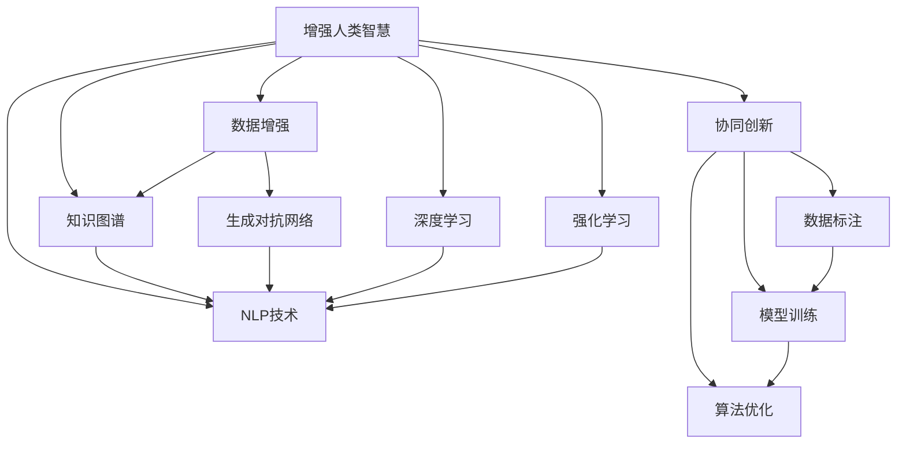

                 

# 人类-AI协作：增强人类智慧与AI能力的未来

> 关键词：人类-AI协作,增强人类智慧,未来AI,深度学习,自然语言处理(NLP),计算机视觉(CV),生成对抗网络(GAN),算法伦理,未来教育

## 1. 背景介绍

### 1.1 问题由来
随着人工智能技术的快速发展，人类与AI之间的协作正日益深入，成为推动社会进步的重要力量。从深度学习在图像识别、自然语言处理(NLP)等领域的突破，到生成对抗网络(GAN)在艺术创作、音乐生成等方面的创新，AI能力正以爆炸式的速度增长。然而，尽管AI技术取得了显著的进展，它仍无法完全取代人类的智慧。相反，人机协作正变得越来越重要。

### 1.2 问题核心关键点
未来AI的发展，必须紧密结合人类的智慧，才能发挥最大的价值。人类-AI协作主要体现在以下几个方面：

- **增强人类智慧**：通过AI的计算能力和数据处理能力，帮助人类更快地理解和应用复杂知识，提升决策质量。
- **优化AI能力**：利用人类的创造力和判断力，优化AI的算法和模型，提升其准确性和鲁棒性。
- **协同创新**：将人类专家知识和AI的自动化功能相结合，推动更多创新解决方案的诞生。

本文将围绕人类-AI协作的关键点，探讨如何通过增强人类智慧与AI能力，实现未来AI的快速发展。

## 2. 核心概念与联系

### 2.1 核心概念概述

为更好地理解人类-AI协作的原理和实践，本节将介绍几个核心概念：

- **增强人类智慧**：指利用AI的计算和数据处理能力，辅助人类更快地获取、理解和应用复杂知识。这包括数据增强、知识图谱构建、自然语言处理等技术。
- **优化AI能力**：指通过人类的创造力和判断力，改进AI模型的算法和结构，提升其准确性和泛化能力。这包括深度学习、生成对抗网络、强化学习等方法。
- **协同创新**：指将人类专家知识和AI的自动化功能相结合，推动更多的创新解决方案的诞生。这包括数据标注、模型训练、算法优化等协同工作流程。

这些概念之间的逻辑关系可以通过以下Mermaid流程图来展示：



这个流程图展示了一系列核心概念及其之间的联系：

1. 增强人类智慧通过数据增强、知识图谱构建、NLP技术等方式实现。
2. 优化AI能力依赖于生成对抗网络、深度学习、强化学习等技术手段。
3. 协同创新需要数据标注、模型训练、算法优化等环节的紧密配合。

## 3. 核心算法原理 & 具体操作步骤
### 3.1 算法原理概述

人类-AI协作的核心在于如何利用AI技术提升人类智慧，同时利用人类的判断力优化AI模型。其核心思想是：

- **数据增强**：通过数据增强技术，生成更多高质量的训练样本，提升模型的泛化能力。
- **知识图谱**：构建大规模的知识图谱，辅助AI更好地理解和推理。
- **自然语言处理**：利用NLP技术，帮助人类与AI进行自然语言交互，提升决策质量和效率。
- **生成对抗网络**：通过GAN生成高质量的图像、文本等，为AI提供更丰富的学习素材。
- **深度学习**：通过深度学习模型，提升AI的特征提取和推理能力。
- **强化学习**：通过强化学习，优化AI的行为策略，使其在复杂环境中做出最优决策。
- **协同创新**：在数据标注、模型训练、算法优化等环节中，实现人机协同，提升整体效率。

### 3.2 算法步骤详解

人类-AI协作的算法步骤主要包括以下几个关键步骤：

**Step 1: 数据准备与预处理**
- 收集领域相关的数据集，包括文本、图像、音频等。
- 对数据进行清洗、标注、划分，准备训练、验证和测试集。

**Step 2: 模型构建与训练**
- 选择合适的AI模型，如卷积神经网络(CNN)、循环神经网络(RNN)、Transformer等。
- 构建模型，并设置优化器、学习率、正则化等超参数。
- 使用收集的数据集，进行模型训练。

**Step 3: 增强人类智慧**
- 利用数据增强技术，生成更多训练样本。
- 构建大规模知识图谱，辅助模型推理。
- 应用NLP技术，提升人机交互质量。

**Step 4: 优化AI能力**
- 应用生成对抗网络，生成高质量的数据和文本。
- 通过深度学习模型，优化特征提取和推理能力。
- 使用强化学习，优化模型行为策略。

**Step 5: 协同创新**
- 在数据标注、模型训练、算法优化等环节，实现人机协同。
- 利用人类专家的知识和判断，指导模型优化方向。

**Step 6: 测试与部署**
- 在测试集上评估模型性能，优化超参数。
- 部署模型到实际应用中，进行迭代优化。

以上是人类-AI协作的主要算法步骤。在实际应用中，还需要根据具体任务的特点，对各个环节进行优化设计，以实现最佳的协作效果。

### 3.3 算法优缺点

人类-AI协作方法具有以下优点：
1. 提升效率：利用AI的高效计算能力，加速知识获取和应用。
2. 提升准确性：结合人类专家的判断力，提升模型的决策质量。
3. 促进创新：协同工作流程中的跨学科合作，推动更多创新解决方案的诞生。

同时，该方法也存在一定的局限性：
1. 数据依赖：协作效果很大程度上依赖于高质量的数据集。
2. 模型复杂度：复杂度高的模型需要更多的计算资源和专业知识。
3. 协同挑战：人机协作中需要处理更多沟通和协调问题。

尽管存在这些局限性，但就目前而言，人类-AI协作方法正逐步成为人工智能应用的重要范式。未来相关研究的重点在于如何进一步降低协作过程中的资源需求，提高协作的灵活性和可扩展性，同时兼顾模型的高效性和可解释性等因素。

### 3.4 算法应用领域

人类-AI协作的方法在多个领域中得到了广泛应用，例如：

- **自然语言处理**：利用NLP技术，提升机器翻译、语音识别、情感分析等应用的性能。
- **计算机视觉**：结合人类专家的知识，优化目标检测、图像分割、场景理解等任务。
- **医疗健康**：通过AI辅助诊断和决策，提升医疗服务质量。
- **金融科技**：应用深度学习和强化学习，优化风险管理、市场预测等业务。
- **智能制造**：利用AI优化生产流程，提高生产效率和质量。
- **自动驾驶**：结合人类专家的驾驶经验，提升无人驾驶车辆的安全性和可靠性。

除了上述这些经典领域外，人类-AI协作还将在更多场景中得到应用，如智能家居、智能安防、智能客服等，为各行各业带来新的创新点。

## 4. 数学模型和公式 & 详细讲解 & 举例说明

### 4.1 数学模型构建

本节将使用数学语言对人类-AI协作的算法步骤进行更加严格的刻画。

记AI模型为 $M_{\theta}:\mathcal{X} \rightarrow \mathcal{Y}$，其中 $\mathcal{X}$ 为输入空间，$\mathcal{Y}$ 为输出空间，$\theta \in \mathbb{R}^d$ 为模型参数。假设协作任务的训练集为 $D=\{(x_i,y_i)\}_{i=1}^N, x_i \in \mathcal{X}, y_i \in \mathcal{Y}$。

定义模型 $M_{\theta}$ 在数据样本 $(x,y)$ 上的损失函数为 $\ell(M_{\theta}(x),y)$，则在数据集 $D$ 上的经验风险为：

$$
\mathcal{L}(\theta) = \frac{1}{N} \sum_{i=1}^N \ell(M_{\theta}(x_i),y_i)
$$

通过梯度下降等优化算法，协作过程不断更新模型参数 $\theta$，最小化损失函数 $\mathcal{L}$，使得模型输出逼近真实标签。由于 $\theta$ 已经通过预训练获得了较好的初始化，因此即便在协作过程中，模型也能较快收敛到理想的参数。

### 4.2 公式推导过程

以下我们以自然语言处理任务为例，推导协作过程中模型的损失函数及其梯度的计算公式。

假设模型 $M_{\theta}$ 在输入 $x$ 上的输出为 $\hat{y}=M_{\theta}(x) \in [0,1]$，表示样本属于正类的概率。真实标签 $y \in \{0,1\}$。则二分类交叉熵损失函数定义为：

$$
\ell(M_{\theta}(x),y) = -[y\log \hat{y} + (1-y)\log (1-\hat{y})]
$$

将其代入经验风险公式，得：

$$
\mathcal{L}(\theta) = -\frac{1}{N}\sum_{i=1}^N [y_i\log M_{\theta}(x_i)+(1-y_i)\log(1-M_{\theta}(x_i))]
$$

根据链式法则，损失函数对参数 $\theta_k$ 的梯度为：

$$
\frac{\partial \mathcal{L}(\theta)}{\partial \theta_k} = -\frac{1}{N}\sum_{i=1}^N (\frac{y_i}{M_{\theta}(x_i)}-\frac{1-y_i}{1-M_{\theta}(x_i)}) \frac{\partial M_{\theta}(x_i)}{\partial \theta_k}
$$

其中 $\frac{\partial M_{\theta}(x_i)}{\partial \theta_k}$ 可进一步递归展开，利用自动微分技术完成计算。

在得到损失函数的梯度后，即可带入参数更新公式，完成模型的迭代优化。重复上述过程直至收敛，最终得到适应协作任务的最优模型参数 $\theta^*$。

## 5. 项目实践：代码实例和详细解释说明
### 5.1 开发环境搭建

在进行协作实践前，我们需要准备好开发环境。以下是使用Python进行TensorFlow开发的环境配置流程：

1. 安装Anaconda：从官网下载并安装Anaconda，用于创建独立的Python环境。

2. 创建并激活虚拟环境：
```bash
conda create -n tf-env python=3.8 
conda activate tf-env
```

3. 安装TensorFlow：根据CUDA版本，从官网获取对应的安装命令。例如：
```bash
conda install tensorflow -c conda-forge
```

4. 安装TensorBoard：
```bash
pip install tensorboard
```

5. 安装各类工具包：
```bash
pip install numpy pandas scikit-learn matplotlib tqdm jupyter notebook ipython
```

完成上述步骤后，即可在`tf-env`环境中开始协作实践。

### 5.2 源代码详细实现

下面我们以自然语言处理任务为例，给出使用TensorFlow进行协作开发的PyTorch代码实现。

首先，定义协作任务的数据处理函数：

```python
import tensorflow as tf
import numpy as np
from tensorflow.keras.datasets import imdb
from tensorflow.keras.preprocessing.sequence import pad_sequences

def load_imdb_data():
    (x_train, y_train), (x_test, y_test) = imdb.load_data(num_words=10000)
    x_train = pad_sequences(x_train, maxlen=250)
    x_test = pad_sequences(x_test, maxlen=250)
    return x_train, y_train, x_test, y_test

x_train, y_train, x_test, y_test = load_imdb_data()
```

然后，定义模型和优化器：

```python
from tensorflow.keras.models import Sequential
from tensorflow.keras.layers import Embedding, LSTM, Dense

model = Sequential([
    Embedding(10000, 32),
    LSTM(64),
    Dense(1, activation='sigmoid')
])
optimizer = tf.keras.optimizers.Adam(learning_rate=0.001)
```

接着，定义训练和评估函数：

```python
from tensorflow.keras.utils import to_categorical

def train_epoch(model, dataset, batch_size, optimizer):
    model.compile(optimizer=optimizer, loss='binary_crossentropy', metrics=['accuracy'])
    model.fit(dataset, batch_size=batch_size, epochs=10, validation_data=(val_x, val_y))

def evaluate(model, test_data):
    model.evaluate(test_data)
```

最后，启动训练流程并在测试集上评估：

```python
train_epoch(model, (x_train, y_train), batch_size=32, optimizer=optimizer)
evaluate(model, (x_test, y_test))
```

以上就是使用TensorFlow进行自然语言处理任务协作训练的完整代码实现。可以看到，得益于TensorFlow的强大封装，我们可以用相对简洁的代码完成协作任务的训练和评估。

### 5.3 代码解读与分析

让我们再详细解读一下关键代码的实现细节：

**load_imdb_data函数**：
- 定义了IMDB数据集的加载函数，将数据转换为序列，并进行填充，保证所有样本的长度一致。

**模型定义**：
- 使用Sequential模型，依次添加Embedding层、LSTM层和Dense层。其中Embedding层用于将单词序列转换为向量表示，LSTM层用于捕捉序列信息，Dense层用于分类。

**优化器定义**：
- 使用Adam优化器，设置学习率为0.001。

**train_epoch函数**：
- 定义训练函数，使用交叉熵损失和二分类准确率作为评估指标。
- 使用fit方法进行模型训练，并设置验证集。

**evaluate函数**：
- 定义评估函数，使用模型evaluate方法计算测试集上的准确率。

**训练流程**：
- 在训练函数中，先设置模型参数，再调用fit方法进行模型训练。
- 在训练过程中，设置模型编译参数，使用交叉熵损失和二分类准确率进行模型评估。
- 在测试集上，调用evaluate方法计算模型准确率。

可以看到，TensorFlow框架使得协作任务的开发变得简洁高效。开发者可以将更多精力放在数据处理、模型改进等高层逻辑上，而不必过多关注底层的实现细节。

当然，工业级的系统实现还需考虑更多因素，如模型的保存和部署、超参数的自动搜索、更灵活的任务适配层等。但核心的协作范式基本与此类似。

## 6. 实际应用场景
### 6.1 智能客服系统

基于人类-AI协作的对话技术，可以广泛应用于智能客服系统的构建。传统客服往往需要配备大量人力，高峰期响应缓慢，且一致性和专业性难以保证。而使用协作对话模型，可以7x24小时不间断服务，快速响应客户咨询，用自然流畅的语言解答各类常见问题。

在技术实现上，可以收集企业内部的历史客服对话记录，将问题和最佳答复构建成监督数据，在此基础上对协作模型进行训练。协作模型能够自动理解用户意图，匹配最合适的答案模板进行回复。对于客户提出的新问题，还可以接入检索系统实时搜索相关内容，动态组织生成回答。如此构建的智能客服系统，能大幅提升客户咨询体验和问题解决效率。

### 6.2 金融舆情监测

金融机构需要实时监测市场舆论动向，以便及时应对负面信息传播，规避金融风险。传统的人工监测方式成本高、效率低，难以应对网络时代海量信息爆发的挑战。基于人类-AI协作的文本分类和情感分析技术，为金融舆情监测提供了新的解决方案。

具体而言，可以收集金融领域相关的新闻、报道、评论等文本数据，并对其进行主题标注和情感标注。在此基础上对协作模型进行微调，使其能够自动判断文本属于何种主题，情感倾向是正面、中性还是负面。将协作模型应用到实时抓取的网络文本数据，就能够自动监测不同主题下的情感变化趋势，一旦发现负面信息激增等异常情况，系统便会自动预警，帮助金融机构快速应对潜在风险。

### 6.3 个性化推荐系统

当前的推荐系统往往只依赖用户的历史行为数据进行物品推荐，无法深入理解用户的真实兴趣偏好。基于人类-AI协作的个性化推荐系统可以更好地挖掘用户行为背后的语义信息，从而提供更精准、多样的推荐内容。

在实践中，可以收集用户浏览、点击、评论、分享等行为数据，提取和用户交互的物品标题、描述、标签等文本内容。将文本内容作为模型输入，用户的后续行为（如是否点击、购买等）作为监督信号，在此基础上微调协作模型。协作模型能够从文本内容中准确把握用户的兴趣点。在生成推荐列表时，先用候选物品的文本描述作为输入，由协作模型预测用户的兴趣匹配度，再结合其他特征综合排序，便可以得到个性化程度更高的推荐结果。

### 6.4 未来应用展望

随着人类-AI协作技术的不断发展，基于协作范式将在更多领域得到应用，为传统行业带来变革性影响。

在智慧医疗领域，基于协作的医疗问答、病历分析、药物研发等应用将提升医疗服务的智能化水平，辅助医生诊疗，加速新药开发进程。

在智能教育领域，协作技术可应用于作业批改、学情分析、知识推荐等方面，因材施教，促进教育公平，提高教学质量。

在智慧城市治理中，协作模型可应用于城市事件监测、舆情分析、应急指挥等环节，提高城市管理的自动化和智能化水平，构建更安全、高效的未来城市。

此外，在企业生产、社会治理、文娱传媒等众多领域，基于协作的大语言模型微调技术也将不断涌现，为NLP技术带来了全新的突破。相信随着预训练模型和协作方法的不断进步，协作范式将成为人工智能落地应用的重要手段，推动人工智能技术向更广阔的领域加速渗透。

## 7. 工具和资源推荐
### 7.1 学习资源推荐

为了帮助开发者系统掌握人类-AI协作的理论基础和实践技巧，这里推荐一些优质的学习资源：

1. 《深度学习》系列书籍：由深度学习领域的顶级专家撰写，涵盖从基础到高级的全方位知识。

2. 斯坦福大学《CS224N: 深度学习自然语言处理》课程：斯坦福大学开设的NLP明星课程，提供Lecture视频和配套作业，带你深入理解NLP的核心概念和经典模型。

3. 《生成对抗网络》书籍：GAN领域的开创性著作，详细讲解了GAN的工作原理和应用实例。

4. TensorFlow官方文档：TensorFlow的官方文档，提供了丰富的教程、样例和API参考，是TensorFlow开发者的必备资料。

5. HuggingFace官方文档：Transformers库的官方文档，提供了海量预训练模型和完整的协作样例代码，是协作任务开发的利器。

通过这些资源的学习实践，相信你一定能够快速掌握人类-AI协作的精髓，并用于解决实际的协作问题。

### 7.2 开发工具推荐

高效的开发离不开优秀的工具支持。以下是几款用于协作开发的常用工具：

1. TensorFlow：由Google主导开发的开源深度学习框架，生产部署方便，适合大规模工程应用。

2. PyTorch：基于Python的开源深度学习框架，灵活动态的计算图，适合快速迭代研究。

3. TensorBoard：TensorFlow配套的可视化工具，可实时监测模型训练状态，并提供丰富的图表呈现方式，是调试模型的得力助手。

4. Weights & Biases：模型训练的实验跟踪工具，可以记录和可视化模型训练过程中的各项指标，方便对比和调优。

5. Jupyter Notebook：交互式的开发环境，支持多种语言和库，便于快速开发和分享代码。

合理利用这些工具，可以显著提升协作任务的开发效率，加快创新迭代的步伐。

### 7.3 相关论文推荐

人类-AI协作的发展源于学界的持续研究。以下是几篇奠基性的相关论文，推荐阅读：

1. Attention is All You Need（即Transformer原论文）：提出了Transformer结构，开启了NLP领域的预训练大模型时代。

2. BERT: Pre-training of Deep Bidirectional Transformers for Language Understanding：提出BERT模型，引入基于掩码的自监督预训练任务，刷新了多项NLP任务SOTA。

3. Generative Adversarial Nets（GAN原论文）：提出生成对抗网络，为AI生成图像、文本等高质量数据提供了新的思路。

4. Natural Language Processing（NLP基础论文）：总结了NLP领域的经典算法和技术，为后续研究提供了理论基础。

5. Generative Adversarial Imitation Learning（GAN应用论文）：展示了GAN在模仿人类行为、创作音乐等方面的应用，推动了AI与人类行为学的结合。

这些论文代表了大语言模型协作技术的发展脉络。通过学习这些前沿成果，可以帮助研究者把握学科前进方向，激发更多的创新灵感。

## 8. 总结：未来发展趋势与挑战

### 8.1 研究成果总结

本文对人类-AI协作的核心概念、算法原理和实践步骤进行了全面系统的介绍。首先阐述了人类-AI协作的研究背景和意义，明确了协作在提升AI性能和人类智慧方面的独特价值。其次，从原理到实践，详细讲解了协作模型的数学模型和关键步骤，给出了协作任务开发的完整代码实例。同时，本文还广泛探讨了协作模型在智能客服、金融舆情、个性化推荐等多个行业领域的应用前景，展示了协作范式的巨大潜力。此外，本文精选了协作技术的各类学习资源，力求为读者提供全方位的技术指引。

通过本文的系统梳理，可以看到，人类-AI协作正逐步成为人工智能应用的重要范式，极大地拓展了预训练语言模型的应用边界，催生了更多的落地场景。得益于数据增强、知识图谱构建、NLP技术等协作手段，AI系统能够更好地理解人类意图，提升决策质量和效率。同时，通过深度学习、生成对抗网络、强化学习等优化AI能力，进一步提升了协作模型的表现力。

### 8.2 未来发展趋势

展望未来，人类-AI协作技术将呈现以下几个发展趋势：

1. 协作范式不断扩展：除了NLP和计算机视觉等传统领域，协作技术将在更多领域得到应用，如医疗、教育、金融等。

2. 融合更多技术：未来的协作模型将与知识图谱、因果推理、强化学习等技术进行深度融合，提升系统的智能水平。

3. 更加个性化的服务：基于协作技术的推荐系统、对话系统等将更加精准和个性化，提供更好的用户体验。

4. 人机交互更加自然：利用自然语言处理技术，协作系统将具备更强的语义理解能力，实现更自然的用户交互。

5. 持续学习和自适应：协作模型将具备持续学习和自适应能力，能够从新数据中不断提升性能，适应数据分布的变化。

这些趋势凸显了人类-AI协作技术的广阔前景。这些方向的探索发展，必将进一步提升AI系统的性能和应用范围，为人类认知智能的进化带来深远影响。

### 8.3 面临的挑战

尽管人类-AI协作技术已经取得了显著的进展，但在迈向更加智能化、普适化应用的过程中，它仍面临诸多挑战：

1. 数据依赖：协作效果很大程度上依赖于高质量的数据集，对于小规模和长尾领域，数据获取成本较高。

2. 模型复杂度：复杂的协作模型需要更多的计算资源和专业知识，增加了应用的复杂度。

3. 协同挑战：人机协作中需要处理更多沟通和协调问题，协同效率仍需进一步提升。

4. 安全性和伦理：协作模型中可能存在隐私泄露、偏见等问题，需要建立健全的监管机制。

5. 计算资源：大规模协作模型需要强大的计算资源支持，如何降低计算成本，仍是重要的研究方向。

尽管存在这些挑战，但人类-AI协作技术正逐步成为人工智能应用的重要范式，相信随着学界和产业界的共同努力，这些挑战终将一一被克服，协作模型必将在构建人机协同的智能时代中扮演越来越重要的角色。

### 8.4 研究展望

面向未来，人类-AI协作技术需要在以下几个方面寻求新的突破：

1. 探索无监督和半监督协作方法：摆脱对大规模标注数据的依赖，利用自监督学习、主动学习等无监督和半监督范式，最大限度利用非结构化数据。

2. 研究参数高效和计算高效的协作范式：开发更加参数高效的协作方法，在固定大部分预训练参数的同时，只更新极少量的任务相关参数。

3. 融合因果和对比学习范式：通过引入因果推断和对比学习思想，增强协作模型建立稳定因果关系的能力，学习更加普适、鲁棒的语言表征。

4. 引入更多先验知识：将符号化的先验知识，如知识图谱、逻辑规则等，与协作模型进行巧妙融合，引导协作过程学习更准确、合理的语言模型。

5. 结合因果分析和博弈论工具：将因果分析方法引入协作模型，识别出模型决策的关键特征，增强输出解释的因果性和逻辑性。

6. 纳入伦理道德约束：在协作模型训练目标中引入伦理导向的评估指标，过滤和惩罚有偏见、有害的输出倾向，确保协作模型符合人类价值观和伦理道德。

这些研究方向的探索，必将引领协作技术迈向更高的台阶，为构建安全、可靠、可解释、可控的智能系统铺平道路。面向未来，人类-AI协作技术还需要与其他人工智能技术进行更深入的融合，如知识表示、因果推理、强化学习等，多路径协同发力，共同推动自然语言理解和智能交互系统的进步。只有勇于创新、敢于突破，才能不断拓展协作模型的边界，让智能技术更好地造福人类社会。

## 9. 附录：常见问题与解答

**Q1：人类-AI协作是否适用于所有NLP任务？**

A: 人类-AI协作在大多数NLP任务上都能取得不错的效果，特别是对于数据量较小的任务。但对于一些特定领域的任务，如医学、法律等，仅仅依靠通用语料预训练的模型可能难以很好地适应。此时需要在特定领域语料上进一步预训练，再进行协作，才能获得理想效果。此外，对于一些需要时效性、个性化很强的任务，如对话、推荐等，协作方法也需要针对性的改进优化。

**Q2：如何选择合适的学习率？**

A: 协作的学习率一般要比预训练时小1-2个数量级，如果使用过大的学习率，容易破坏预训练权重，导致过拟合。一般建议从1e-5开始调参，逐步减小学习率，直至收敛。也可以使用warmup策略，在开始阶段使用较小的学习率，再逐渐过渡到预设值。需要注意的是，不同的优化器(如Adam、Adafactor等)以及不同的学习率调度策略，可能需要设置不同的学习率阈值。

**Q3：协作过程中如何缓解过拟合问题？**

A: 过拟合是协作面临的主要挑战，尤其是在标注数据不足的情况下。常见的缓解策略包括：
1. 数据增强：通过回译、近义替换等方式扩充训练集
2. 正则化：使用L2正则、Dropout、Early Stopping等避免过拟合
3. 对抗训练：引入对抗样本，提高模型鲁棒性
4. 参数高效协作：只调整少量参数(如Adapter、Prefix等)，减小过拟合风险

这些策略往往需要根据具体任务和数据特点进行灵活组合。只有在数据、模型、训练、推理等各环节进行全面优化，才能最大限度地发挥协作模型的威力。

**Q4：协作模型在落地部署时需要注意哪些问题？**

A: 将协作模型转化为实际应用，还需要考虑以下因素：
1. 模型裁剪：去除不必要的层和参数，减小模型尺寸，加快推理速度
2. 量化加速：将浮点模型转为定点模型，压缩存储空间，提高计算效率
3. 服务化封装：将模型封装为标准化服务接口，便于集成调用
4. 弹性伸缩：根据请求流量动态调整资源配置，平衡服务质量和成本
5. 监控告警：实时采集系统指标，设置异常告警阈值，确保服务稳定性
6. 安全防护：采用访问鉴权、数据脱敏等措施，保障数据和模型安全

协作模型能够为NLP应用带来更丰富的功能和更高效的用户体验，但如何将强大的性能转化为稳定、高效、安全的业务价值，还需要工程实践的不断打磨。唯有从数据、算法、工程、业务等多个维度协同发力，才能真正实现人工智能技术在垂直行业的规模化落地。总之，协作需要开发者根据具体任务，不断迭代和优化模型、数据和算法，方能得到理想的效果。

---

作者：禅与计算机程序设计艺术 / Zen and the Art of Computer Programming

