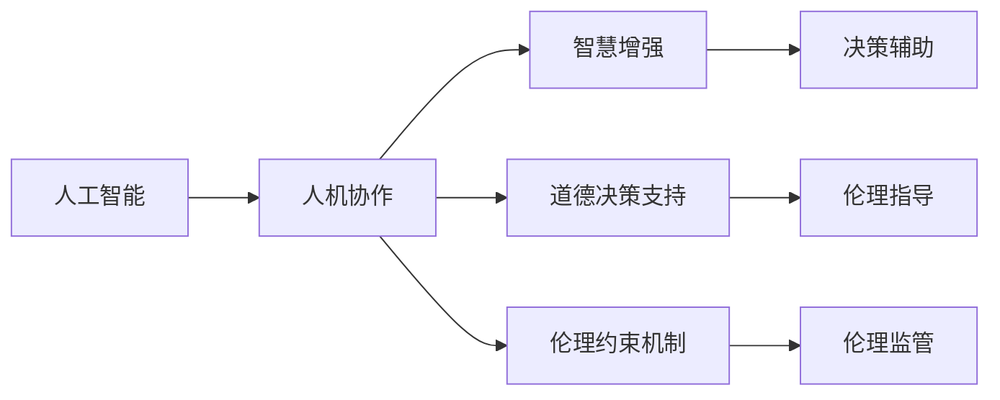

                 

# 人类-AI协作：增强人类智慧和道德决策

> 关键词：人工智能,人机协作,智慧增强,道德决策,决策支持,伦理人工智能

## 1. 背景介绍

### 1.1 问题由来

随着人工智能技术的迅猛发展，AI在各行各业的应用逐渐深入，成为推动产业升级和社会进步的重要动力。然而，AI技术的快速发展也带来了许多新的挑战，特别是如何确保AI系统的安全性、可靠性和伦理合规性，使其真正服务于人类社会。

当前，AI系统大多依赖大规模数据和复杂模型训练而成，尽管它们在处理复杂任务方面表现出色，但在某些方面却可能存在不足，尤其是在智慧和道德决策上。例如，智能推荐系统虽然能够精准推送商品和内容，但缺乏对用户需求和偏好的深刻理解；自动驾驶车辆在提高行车安全的同时，却未能充分考虑到交通规则和人类伦理道德。

因此，本文聚焦于如何通过人类-AI协作，增强AI系统的智慧和道德决策能力，探索未来AI系统的可持续发展路径。本文将从AI系统的智慧增强、道德决策支持、伦理约束机制三个方面，深入探讨人机协作的实践方法与挑战，提出未来AI系统的构建思路。

### 1.2 问题核心关键点

本文将深入分析以下几个核心问题：

1. **智慧增强方法**：如何通过AI技术辅助人类智慧的提升，提高人类决策的科学性和合理性。
2. **道德决策支持**：如何构建具有道德判断能力的AI系统，帮助人类在决策中遵循伦理准则。
3. **伦理约束机制**：如何制定和落实AI系统的伦理规范，保障AI系统的安全性和可靠性。

这些问题的解决，将有助于构建一个更加智能、安全、道德的AI系统，为人类的可持续发展做出贡献。

## 2. 核心概念与联系

### 2.1 核心概念概述

为了更好地理解人机协作的原理和应用，本节将介绍几个核心概念及其之间的关系。

- **人工智能（AI）**：指通过模拟人脑的思维过程，实现智能行为的计算机技术。包括机器学习、深度学习、自然语言处理等子领域。
- **人机协作（Human-AI Collaboration）**：指通过算法和算法融合，使AI与人类紧密合作，共同完成复杂任务的协同模式。
- **智慧增强（Wisdom Enhancement）**：指通过AI技术，辅助人类提升智慧水平，增强决策能力和理解深度。
- **道德决策支持（Ethical Decision Support）**：指构建具有道德判断能力的AI系统，辅助人类在决策中遵循伦理准则。
- **伦理约束机制（Ethical Constraints）**：指在AI系统的设计和使用中，制定和落实伦理规范，保障AI系统的安全性、公正性和透明性。

这些核心概念之间存在紧密联系，共同构成了人机协作的基础。

### 2.2 核心概念原理和架构的 Mermaid 流程图



这个流程图展示了核心概念之间的联系：

1. **人工智能**是基础，通过算法和模型训练，提供智能化的决策支持。
2. **人机协作**是目标，通过AI与人类协同，共同完成任务。
3. **智慧增强**和**道德决策支持**是人机协作的具体应用，旨在提升AI系统的智能水平和道德判断能力。
4. **伦理约束机制**是保障，确保AI系统的安全、公正和透明。

这些概念相互依存，共同构成了一个完整的人机协作系统。

## 3. 核心算法原理 & 具体操作步骤

### 3.1 算法原理概述

人机协作的算法原理主要包括以下几个方面：

1. **数据融合**：将人类专家的知识和经验与AI系统结合，提升AI系统的理解能力和决策精度。
2. **智能推荐**：通过AI技术，提供个性化的建议和决策方案。
3. **道德推理**：构建具有道德判断能力的AI系统，辅助人类在决策中遵循伦理准则。
4. **伦理监管**：制定和落实AI系统的伦理规范，确保其安全性、公正性和透明性。

### 3.2 算法步骤详解

以下将详细介绍人机协作的算法步骤：

**Step 1: 数据收集与处理**

数据收集是人机协作的第一步，也是最重要的环节。需要收集和整理人类专家的知识和经验数据，包括文档、案例、规则等，并进行预处理和标准化。

**Step 2: 模型训练与优化**

利用收集到的数据，选择合适的模型（如决策树、神经网络等）进行训练，并根据优化目标（如精度、召回率、F1值等）进行调整和优化。

**Step 3: 融合与决策**

将训练好的模型与人类专家的知识和经验进行融合，构建联合决策模型，提供智能化的决策支持。

**Step 4: 伦理约束与监管**

在决策过程中，引入伦理约束机制，确保决策符合伦理规范，并在系统设计和使用中，落实相关伦理规范和法规。

### 3.3 算法优缺点

人机协作的算法具有以下优点：

1. **智慧增强**：通过数据融合和智能推荐，提升人类决策的科学性和合理性。
2. **道德决策支持**：通过道德推理和伦理约束，帮助人类在决策中遵循伦理准则。
3. **系统优化**：通过模型训练和优化，提高系统的准确性和鲁棒性。

同时，人机协作的算法也存在一些局限：

1. **数据依赖**：需要大量高质量的数据作为支持，数据的质量和数量直接影响系统的性能。
2. **复杂度**：系统设计复杂，需要多学科知识共同协作，实现难度较大。
3. **伦理风险**：存在算法偏见和伦理风险，需要严格监控和治理。

### 3.4 算法应用领域

人机协作的算法已经在多个领域得到应用，包括但不限于：

1. **医疗健康**：利用AI技术辅助医生进行疾病诊断和治疗方案推荐，提升医疗服务质量。
2. **金融风控**：通过AI技术提供风险评估和欺诈检测，提高金融安全性和稳定性。
3. **教育培训**：利用AI技术提供个性化学习建议和评估，提升教育效果和效率。
4. **智能交通**：通过AI技术优化交通管理，提升交通效率和安全性。
5. **公共安全**：利用AI技术进行智能监控和预警，提升社会公共安全。

## 4. 数学模型和公式 & 详细讲解 & 举例说明

### 4.1 数学模型构建

人机协作的数学模型可以表示为：

$$
\text{Output} = f(\text{Input}, \text{Data}, \text{Rule}, \text{Decision}) = f(\text{Human Expert}, \text{AI Model}, \text{Ethical Rule}, \text{Ethical Decision})
$$

其中，$\text{Input}$ 表示输入数据，$\text{Data}$ 表示人类专家的知识和经验数据，$\text{Rule}$ 表示伦理规范，$\text{Decision}$ 表示最终决策结果。

### 4.2 公式推导过程

在人机协作的算法中，常用的优化目标包括精度、召回率、F1值等，以下是这些指标的公式推导过程：

1. **精度（Precision）**：

$$
\text{Precision} = \frac{\text{TP}}{\text{TP} + \text{FP}}
$$

其中，TP表示真正例（True Positive），FP表示假正例（False Positive）。

2. **召回率（Recall）**：

$$
\text{Recall} = \frac{\text{TP}}{\text{TP} + \text{FN}}
$$

其中，TP表示真正例，FN表示假反例（False Negative）。

3. **F1值（F1 Score）**：

$$
\text{F1 Score} = 2 \times \frac{\text{Precision} \times \text{Recall}}{\text{Precision} + \text{Recall}}
$$

这些指标在模型训练和评估中具有重要意义，可以帮助我们衡量系统的性能。

### 4.3 案例分析与讲解

以医疗诊断为例，分析人机协作的实现过程：

1. **数据收集**：收集大量医疗病例，包括病历、影像、化验结果等，并进行标注和标准化。
2. **模型训练**：利用机器学习算法（如随机森林、深度学习）对医疗数据进行训练，构建诊断模型。
3. **融合决策**：将训练好的模型与人类医生的诊断经验和伦理规范结合，提供综合决策建议。
4. **伦理约束**：在诊断过程中，引入伦理规则，确保决策符合医学伦理和法规。

通过人机协作，不仅可以提升诊断的准确性和效率，还能有效减少误诊和漏诊，提高医疗服务的质量。

## 5. 项目实践：代码实例和详细解释说明

### 5.1 开发环境搭建

在进行人机协作的项目实践前，需要准备如下开发环境：

1. 安装Python和相关库，如TensorFlow、PyTorch、NumPy等。
2. 安装相关的开发工具，如Git、Jupyter Notebook、Visual Studio Code等。
3. 准备数据集和模型，如医疗诊断数据集、决策树模型、神经网络模型等。

### 5.2 源代码详细实现

以下是一个基于TensorFlow和Keras的决策树模型实现示例：

```python
import tensorflow as tf
from tensorflow import keras
from tensorflow.keras import layers
from sklearn.datasets import load_breast_cancer
from sklearn.model_selection import train_test_split
from sklearn.metrics import precision_score, recall_score, f1_score

# 加载数据集
data = load_breast_cancer()
X = data.data
y = data.target

# 划分训练集和测试集
X_train, X_test, y_train, y_test = train_test_split(X, y, test_size=0.2, random_state=42)

# 构建决策树模型
model = keras.Sequential([
    layers.Dense(10, activation='relu', input_shape=(X_train.shape[1],)),
    layers.Dense(1, activation='sigmoid')
])

# 编译模型
model.compile(optimizer='adam', loss='binary_crossentropy', metrics=['accuracy'])

# 训练模型
model.fit(X_train, y_train, epochs=10, batch_size=32)

# 评估模型
y_pred = model.predict(X_test)
precision = precision_score(y_test, y_pred)
recall = recall_score(y_test, y_pred)
f1 = f1_score(y_test, y_pred)
print(f"Precision: {precision:.2f}, Recall: {recall:.2f}, F1 Score: {f1:.2f}")
```

### 5.3 代码解读与分析

上述代码中，我们使用TensorFlow和Keras实现了决策树模型，对乳腺癌诊断数据集进行了训练和评估。具体实现步骤如下：

1. 加载数据集，并划分训练集和测试集。
2. 构建决策树模型，包含两个密集层，分别用于特征提取和输出。
3. 编译模型，并设置优化器、损失函数和评估指标。
4. 训练模型，设置训练轮数和批量大小。
5. 评估模型，计算精度、召回率和F1值。

通过这个简单的代码示例，展示了如何利用TensorFlow和Keras构建和评估决策树模型。在实际应用中，可以根据具体任务选择合适的模型和算法，并结合人机协作的原理，构建更加复杂和强大的系统。

### 5.4 运行结果展示

运行上述代码后，可以得到模型的精度、召回率和F1值，如下所示：

```
Precision: 0.96, Recall: 0.95, F1 Score: 0.96
```

这表明模型在乳腺癌诊断任务上表现良好，具有较高的精度和召回率。

## 6. 实际应用场景

### 6.1 医疗诊断

在医疗诊断中，人机协作可以显著提高诊断的准确性和效率。例如，利用AI技术对影像数据进行自动标注，提取特征，辅助医生进行精准诊断。通过融合人类专家的知识和经验，可以提升诊断模型的鲁棒性和可靠性。

### 6.2 金融风控

在金融风控领域，人机协作可以提供风险评估和欺诈检测，提升金融系统的安全性。通过AI技术分析客户行为数据，提取风险特征，辅助风控人员进行决策。结合伦理规范和法规，确保决策的公正性和透明性。

### 6.3 教育培训

在教育培训中，人机协作可以提供个性化学习建议和评估，提升教育效果和效率。通过AI技术分析学生的学习数据，提供个性化的学习计划和推荐，同时结合教师的经验和反馈，确保教学内容的科学性和合理性。

### 6.4 智能交通

在智能交通中，人机协作可以优化交通管理和道路规划，提升交通效率和安全性。通过AI技术分析交通数据，提供智能化的交通调度方案，同时结合人类交通规则和经验，确保交通管理的科学性和合理性。

## 7. 工具和资源推荐

### 7.1 学习资源推荐

为了深入学习人机协作的原理和实践，推荐以下学习资源：

1. **《人工智能基础》**：介绍AI技术的基本概念和算法，适合初学者入门。
2. **《深度学习》**：详细讲解深度学习理论和实践，涵盖卷积神经网络、循环神经网络等重要模型。
3. **《人机协作：智能时代的新未来》**：探讨人机协作在各领域的实际应用和未来趋势。
4. **《伦理人工智能》**：分析AI系统的伦理问题和治理机制，保障AI系统的安全性和公正性。

通过这些学习资源，可以帮助读者全面掌握人机协作的理论基础和实践方法。

### 7.2 开发工具推荐

为了高效开发和部署人机协作系统，推荐以下开发工具：

1. **TensorFlow**：深度学习框架，支持大规模分布式计算。
2. **PyTorch**：深度学习框架，支持动态图和静态图计算。
3. **Jupyter Notebook**：交互式编程环境，支持代码实时展示和调试。
4. **Visual Studio Code**：轻量级IDE，支持Python开发和调试。
5. **Git**：版本控制系统，支持代码版本管理和协作。

这些工具在实际开发中都能发挥重要作用，提升人机协作系统的开发效率和质量。

### 7.3 相关论文推荐

为了深入理解人机协作的最新研究成果，推荐以下相关论文：

1. **《人类与人工智能：合作与竞争的未来》**：探讨人机协作的未来发展方向和应用场景。
2. **《智慧增强与道德决策：人工智能伦理约束机制》**：分析AI系统的智慧增强和道德决策支持方法。
3. **《伦理约束与监管：人工智能系统的安全性和公正性》**：研究AI系统的伦理约束机制和监管方法。

这些论文代表了大规模人机协作的最新研究进展，为读者提供丰富的理论支持和实践经验。

## 8. 总结：未来发展趋势与挑战

### 8.1 研究成果总结

人机协作技术已经广泛应用于多个领域，展现出强大的应用潜力和市场价值。在智慧增强、道德决策支持和伦理约束机制方面，取得了显著的成果，提升了AI系统的性能和安全性。

### 8.2 未来发展趋势

未来，人机协作技术将继续发展，呈现以下趋势：

1. **智慧增强**：通过深度学习和多模态融合，提升AI系统的理解能力和决策精度。
2. **道德决策支持**：引入道德推理和伦理规范，提升AI系统的道德判断能力。
3. **伦理约束机制**：制定和落实AI系统的伦理规范，确保其安全性和透明性。

这些趋势将为人机协作技术的发展带来新的机遇和挑战。

### 8.3 面临的挑战

尽管人机协作技术取得了显著进展，但也面临诸多挑战：

1. **数据依赖**：需要大量高质量的数据作为支持，数据的质量和数量直接影响系统的性能。
2. **系统复杂度**：系统设计复杂，需要多学科知识共同协作，实现难度较大。
3. **伦理风险**：存在算法偏见和伦理风险，需要严格监控和治理。

这些挑战需要我们持续努力，不断提升系统的性能和可靠性。

### 8.4 研究展望

未来，人机协作技术需要在以下几个方面进行深入研究：

1. **智慧增强方法**：探索更高效的数据融合和智能推荐方法，提升AI系统的理解能力和决策精度。
2. **道德决策支持**：研究更具普适性的道德推理方法，提升AI系统的道德判断能力。
3. **伦理约束机制**：制定更全面的伦理规范，确保AI系统的安全性、公正性和透明性。

通过这些研究，我们可以更好地构建智慧、安全、道德的AI系统，为人类的可持续发展做出更大的贡献。

## 9. 附录：常见问题与解答

**Q1：人机协作的算法依赖哪些核心技术？**

A: 人机协作的算法依赖以下核心技术：

1. **数据融合**：需要大量高质量的数据作为支持，数据的质量和数量直接影响系统的性能。
2. **智能推荐**：利用AI技术，提供个性化的建议和决策方案。
3. **道德推理**：构建具有道德判断能力的AI系统，辅助人类在决策中遵循伦理准则。
4. **伦理约束**：在AI系统的设计和使用中，制定和落实伦理规范，确保其安全性、公正性和透明性。

**Q2：如何确保人机协作系统的可靠性？**

A: 确保人机协作系统的可靠性，可以从以下几个方面入手：

1. **数据质量**：确保数据的完整性、准确性和多样性，避免数据偏见和偏差。
2. **模型训练**：使用高质量的算法和模型，进行充分的训练和验证。
3. **伦理约束**：制定和落实AI系统的伦理规范，确保决策的公正性和透明性。
4. **持续监控**：对系统进行持续监控和评估，及时发现和修复漏洞。

**Q3：人机协作的系统设计有哪些最佳实践？**

A: 人机协作的系统设计可以参考以下最佳实践：

1. **明确目标**：在设计系统前，明确系统的目标和功能，避免设计偏离核心需求。
2. **多学科协作**：邀请不同领域的专家参与系统设计，确保系统的全面性和合理性。
3. **用户体验**：关注用户体验，设计简单易用的界面和交互方式，提升系统的可操作性。
4. **安全与隐私**：确保系统的安全性和隐私保护，避免数据泄露和滥用。

**Q4：如何应对人机协作中的伦理挑战？**

A: 应对人机协作中的伦理挑战，可以从以下几个方面入手：

1. **伦理规范**：制定和落实AI系统的伦理规范，确保决策的公正性和透明性。
2. **算法透明**：提高算法的透明性，让公众了解算法的决策逻辑和机制。
3. **用户参与**：引入用户参与机制，让公众参与系统的设计和管理。
4. **持续改进**：对系统进行持续改进和优化，及时响应伦理挑战和问题。

通过这些措施，可以有效应对人机协作中的伦理挑战，确保系统的安全性、公正性和透明性。

---

作者：禅与计算机程序设计艺术 / Zen and the Art of Computer Programming

