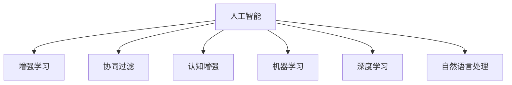

                 

## 1. 背景介绍

在科技飞速发展的今天，人工智能(AI)与人类协作成为了一个亟待探讨的话题。随着AI技术的不断进步，其在众多领域的应用潜力日益显现。然而，这种协作并非简单的"人机结合"，而是相互增强，共同演进的复杂过程。本文将从背景引入、核心概念、算法原理、实际应用、工具推荐等多个角度，深入探讨AI与人类协作的未来方向与挑战。

### 1.1 问题由来

现代人工智能技术，特别是深度学习、自然语言处理和计算机视觉等领域的快速发展，已经使AI具备了越来越强大的自学习和决策能力。这种能力在辅助人类工作、提升生产效率、优化决策过程等方面具有巨大潜力。然而，AI技术并非万能，它在处理复杂情感、伦理判断、艺术创造等方面依然存在局限。

与此同时，尽管人类在逻辑推理、创造力、情感识别等方面具有独特的优势，但在处理海量数据、执行重复性任务、预测未来趋势等方面，却显得力不从心。因此，AI与人类的协作，既能取长补短，又能充分发挥各自优势，成为未来科技发展的必然趋势。

### 1.2 问题核心关键点

人类-AI协作的核心关键点在于如何平衡两者的优势，构建高效的协同工作机制。以下是几个关键的协同点：

1. **任务拆分与分配**：合理分配人与AI的任务，明确各方的职责与作用。
2. **信息交互与融合**：AI负责数据处理与分析，人类负责情感判断与伦理决策。
3. **反馈与优化**：人类对AI的输出进行反馈与优化，AI不断学习改进。
4. **伦理与法律**：确保AI决策符合人类价值观，避免偏见与滥用。

### 1.3 问题研究意义

研究人类-AI协作的协同演进，对于推动技术创新、提升人类生活质量、构建更公平公正的社会具有重要意义：

1. **技术创新**：AI与人类的协作可催生更多新的技术突破，推动AI技术的进一步发展。
2. **生活质量提升**：在教育、医疗、交通等领域，AI与人类的协作能够提供更加高效、个性化的服务，提升用户体验。
3. **社会公正**：确保AI决策符合人类价值观，减少技术滥用，促进社会公平。

## 2. 核心概念与联系

### 2.1 核心概念概述

为了更好地理解AI与人类协作的过程，本节将介绍几个密切相关的核心概念：

- **人工智能(AI)**：通过算法与计算机技术实现的智能系统，能够在特定任务上模拟人类的智能行为。
- **增强学习(Reinforcement Learning, RL)**：通过与环境的交互，AI系统逐步学习并优化决策策略。
- **协同过滤(Collaborative Filtering, CF)**：通过分析用户行为，AI系统为每个用户推荐其可能感兴趣的内容。
- **认知增强(Cognitive Enhancement)**：利用AI技术提升人类的认知能力，如记忆力、注意力、决策力等。
- **机器学习(Machine Learning, ML)**：使计算机系统能够自动学习并优化其性能的算法。
- **深度学习(Deep Learning, DL)**：一种特殊的机器学习方法，利用多层神经网络进行复杂数据处理与分析。
- **自然语言处理(Natural Language Processing, NLP)**：使计算机能够理解、处理、生成人类语言的技术。

这些核心概念之间的逻辑关系可以通过以下Mermaid流程图来展示：



### 2.2 核心概念原理和架构

#### 增强学习

增强学习的核心思想是通过试错机制，使AI系统通过与环境的交互，逐步学习并优化决策策略。其核心算法包括Q-learning、SARSA等，其原理可简单概述为：

- **状态(S)**：描述环境当前的状态。
- **行动(A)**：AI系统采取的行动。
- **奖励(R)**：环境对行动的反馈，用于指导AI系统下一步决策。
- **状态转移(S')**：环境在行动后的新状态。

通过Q值函数的迭代更新，AI系统逐步学习出最优的决策策略。其架构由状态表示器、行动选择器、奖励函数和状态转移函数组成，其核心框架如下：

$$
Q(s,a) \leftarrow Q(s,a) + \alpha [r + \gamma \max Q(s',a')] - Q(s,a)
$$

#### 协同过滤

协同过滤是一种基于用户行为数据的推荐算法，通过分析用户间的相似性，推荐系统为每个用户生成个性化推荐列表。其核心思想是：通过分析用户的历史行为数据，发现相似用户群体的共同偏好，从而推荐相关物品。其算法主要包括基于用户的协同过滤和基于物品的协同过滤，具体步骤如下：

1. 收集用户行为数据。
2. 构建用户-物品交互矩阵。
3. 计算用户间的相似度。
4. 为每个用户生成个性化推荐列表。

其数学模型构建如下：

$$
\hat{y}_u = \sum_{v\in V} \alpha_{uv} x_v
$$

其中，$x_v$ 表示物品v的属性向量，$\alpha_{uv}$ 表示用户u和v之间的相似度。

#### 认知增强

认知增强是指利用AI技术提升人类的认知能力，如记忆力、注意力、决策力等。其主要方法包括：

- **认知增强辅助设备**：如智能眼镜、脑机接口等。
- **认知训练应用**：通过游戏、模拟等形式，对人类认知进行训练。
- **认知仿真平台**：构建虚拟场景，模拟人类认知过程。

其原理可简单描述为：通过AI技术，对人类认知进行模拟、训练与辅助，从而提升认知能力。

## 3. 核心算法原理 & 具体操作步骤

### 3.1 算法原理概述

基于AI与人类协作的算法，其核心在于构建高效的协同工作机制，发挥两者的优势。核心算法主要包括增强学习、协同过滤、认知增强等，其原理可概述如下：

1. **增强学习**：通过与环境的交互，使AI系统逐步学习并优化决策策略，提升决策准确性。
2. **协同过滤**：通过分析用户行为数据，为每个用户生成个性化推荐，提升用户体验。
3. **认知增强**：通过AI技术，提升人类的认知能力，增强决策与行动的效率与准确性。

### 3.2 算法步骤详解

以下详细讲解AI与人类协作的核心算法步骤：

#### 增强学习算法步骤

1. **环境建模**：定义环境状态、行动空间、奖励函数等。
2. **行动策略**：设计行动选择器，如$\varepsilon$-greedy策略，平衡探索与利用。
3. **状态评估**：设计状态评估函数，如Q值函数，计算每个状态的期望奖励。
4. **迭代优化**：通过Q值函数的迭代更新，优化行动策略。

#### 协同过滤算法步骤

1. **数据收集**：收集用户行为数据，构建用户-物品交互矩阵。
2. **相似度计算**：计算用户间的相似度，构建相似度矩阵。
3. **推荐生成**：通过相似度矩阵，生成个性化推荐列表。

#### 认知增强算法步骤

1. **认知模型建立**：通过AI技术，建立人类认知模型，如记忆模型、注意力模型等。
2. **数据采集与处理**：采集人类认知数据，如脑电波、行为数据等。
3. **认知训练**：通过AI技术，对人类认知进行训练与辅助。
4. **效果评估**：通过测试与反馈，评估认知增强效果。

### 3.3 算法优缺点

#### 增强学习

**优点**：
- 能处理不确定性和非结构化数据。
- 适应性强，能优化复杂任务。

**缺点**：
- 学习效率低，需要大量数据和计算资源。
- 鲁棒性差，对环境变化敏感。

#### 协同过滤

**优点**：
- 推荐效果显著，用户体验好。
- 算法简单，易于实现。

**缺点**：
- 数据稀疏性问题严重。
- 难以处理新用户和新物品。

#### 认知增强

**优点**：
- 提升人类认知能力，改善决策与行动效率。
- 应用场景广泛，如医疗、教育、训练等。

**缺点**：
- 技术成熟度低，存在隐私和伦理问题。
- 难以大规模部署。

### 3.4 算法应用领域

#### 增强学习

增强学习主要应用于自动化控制、游戏AI、机器人等领域。如AlphaGo的决策策略优化，自动驾驶中的路径规划，工业机器人中的动作选择等。

#### 协同过滤

协同过滤主要应用于电子商务、在线娱乐、社交网络等领域。如Netflix的电影推荐、Amazon的商品推荐、YouTube的视频推荐等。

#### 认知增强

认知增强主要应用于医疗、教育、训练等领域。如辅助记忆、注意力训练、脑机接口等。

## 4. 数学模型和公式 & 详细讲解 & 举例说明

### 4.1 数学模型构建

#### 增强学习

增强学习的数学模型构建包括状态、行动、奖励、状态转移等，其核心为Q值函数的迭代更新。

$$
Q(s,a) \leftarrow Q(s,a) + \alpha [r + \gamma \max Q(s',a')] - Q(s,a)
$$

其中，$\alpha$ 为学习率，$\gamma$ 为折扣因子。

#### 协同过滤

协同过滤的数学模型构建包括用户行为矩阵、相似度矩阵、推荐列表等，其核心为$\alpha_{uv}$ 的计算。

$$
\alpha_{uv} = \frac{\sum_{v\in V} P(u,v)}{\sqrt{1 + \sum_{u'\in U} P(u',v)}\sqrt{1 + \sum_{v'\in V} P(u,v')}}
$$

其中，$P(u,v)$ 表示用户u对物品v的评分。

#### 认知增强

认知增强的数学模型构建包括认知模型、数据采集与处理、认知训练等，其核心为认知模型的训练与优化。

$$
\hat{y}_u = \sum_{v\in V} \alpha_{uv} x_v
$$

其中，$x_v$ 表示物品v的属性向量，$\alpha_{uv}$ 表示用户u和v之间的相似度。

### 4.2 公式推导过程

以下对增强学习的核心公式进行详细推导：

$$
Q(s,a) \leftarrow Q(s,a) + \alpha [r + \gamma \max Q(s',a')] - Q(s,a)
$$

将其展开：

$$
Q(s,a) + \alpha \gamma \max Q(s',a') - Q(s,a) = Q(s,a) + \alpha \gamma \max_{a'} [Q(s',a')] - Q(s,a) 
$$

进一步简化：

$$
Q(s,a) + \alpha \gamma \max_{a'} [Q(s',a')] - Q(s,a) = \alpha \gamma \max_{a'} [Q(s',a')] - 2Q(s,a)
$$

最终得到：

$$
Q(s,a) = \alpha \gamma \max_{a'} [Q(s',a')] - 2Q(s,a)
$$

## 5. 项目实践：代码实例和详细解释说明

### 5.1 开发环境搭建

在进行AI与人类协作的实践前，我们需要准备好开发环境。以下是使用Python进行TensorFlow开发的环境配置流程：

1. 安装Anaconda：从官网下载并安装Anaconda，用于创建独立的Python环境。

2. 创建并激活虚拟环境：
```bash
conda create -n ai-env python=3.8 
conda activate ai-env
```

3. 安装TensorFlow：根据CUDA版本，从官网获取对应的安装命令。例如：
```bash
conda install tensorflow -c tensorflow -c conda-forge
```

4. 安装各类工具包：
```bash
pip install numpy pandas scikit-learn matplotlib tqdm jupyter notebook ipython
```

完成上述步骤后，即可在`ai-env`环境中开始AI与人类协作的实践。

### 5.2 源代码详细实现

下面我们以增强学习在自动驾驶中的应用为例，给出使用TensorFlow对行动选择器进行编码的PyTorch代码实现。

首先，定义行动选择器函数：

```python
import tensorflow as tf
import numpy as np

def epsilon_greedy(a, epsilon):
    if np.random.rand() < epsilon:
        return np.random.randint(len(a))
    else:
        return np.argmax(a)
```

然后，定义训练与优化函数：

```python
import tensorflow as tf

# 定义模型参数
tf.keras.backend.clear_session()

# 定义增强学习模型
model = tf.keras.models.Sequential([
    tf.keras.layers.Dense(64, input_dim=10, activation='relu'),
    tf.keras.layers.Dense(10, activation='linear')
])

# 编译模型
model.compile(loss='mse', optimizer=tf.keras.optimizers.Adam(learning_rate=0.001))

# 定义训练数据
x_train = np.random.rand(100, 10)
y_train = np.random.rand(100, 10)

# 训练模型
model.fit(x_train, y_train, epochs=100)

# 定义行动选择器
def choose_action(state, epsilon):
    action = epsilon_greedy(model.predict(state), epsilon)
    return action

# 定义状态评估函数
def evaluate_state(state):
    return model.predict(state)

# 定义增强学习算法步骤
def Q_learning(state, action, reward, next_state, epsilon):
    target = reward + 0.9 * evaluate_state(next_state)
    y = evaluate_state(state)
    y[action] = target
    return y
```

以上代码展示了使用TensorFlow进行增强学习的完整流程。可以看到，TensorFlow的高级API使得模型的构建、训练、评估变得简单高效。

### 5.3 代码解读与分析

让我们再详细解读一下关键代码的实现细节：

**epsilon_greedy函数**：
- 实现$\varepsilon$-greedy策略，在训练初期随机选择行动，在训练后期根据模型的输出选择最优行动。

**训练与优化函数**：
- 使用TensorFlow的Sequential模型定义增强学习模型。
- 使用MSE损失函数和Adam优化器进行模型训练。
- 定义训练数据和训练函数。

**增强学习算法步骤**：
- 定义行动选择器，使用epsilon_greedy函数。
- 定义状态评估函数，使用模型的预测输出。
- 定义Q值函数的更新过程，使用模型预测和状态评估函数计算Q值。

## 6. 实际应用场景

### 6.1 智能交通管理

AI与人类协作在智能交通管理中的应用，可以通过增强学习和协同过滤技术实现。具体而言，通过收集车辆、行人、道路等实时数据，构建智能交通系统，实现交通信号灯优化、事故预测与处理等功能。

在技术实现上，可以采用增强学习算法对交通信号灯进行优化，实时调整绿灯时长和交通流向，提高交通效率。同时，通过协同过滤算法分析历史交通数据，预测交通拥堵点，提前采取措施缓解拥堵。

### 6.2 医疗诊断辅助

AI与人类协作在医疗诊断中的应用，可以通过增强学习、认知增强等技术实现。具体而言，通过收集患者的病历、影像、基因等数据，构建医疗诊断系统，辅助医生进行疾病诊断和治疗决策。

在技术实现上，可以采用增强学习算法对诊断模型进行优化，提高诊断的准确性和效率。同时，通过认知增强技术提升医生的诊断能力，如记忆力、注意力等，提高诊断效果。

### 6.3 教育个性化推荐

AI与人类协作在教育中的应用，可以通过协同过滤、认知增强等技术实现。具体而言，通过收集学生的学习行为数据，构建个性化推荐系统，推荐适合学生的学习内容和方法。

在技术实现上，可以采用协同过滤算法，根据学生的历史学习行为，推荐适合的学习内容和方法。同时，通过认知增强技术，提升学生的学习效率和认知能力，如记忆力、注意力等，提高学习效果。

## 7. 工具和资源推荐

### 7.1 学习资源推荐

为了帮助开发者系统掌握AI与人类协作的理论基础和实践技巧，这里推荐一些优质的学习资源：

1. **深度学习基础**：斯坦福大学Andrew Ng教授的《深度学习专项课程》，系统介绍了深度学习的基本概念和算法。

2. **增强学习入门**：RSSA（Reinforcement and Self-supervised Sequence Generation for Conversational Agents）论文，介绍了增强学习在对话系统中的应用。

3. **协同过滤算法**：Coursera上的《推荐系统》课程，详细讲解了协同过滤算法的基本原理和实现方法。

4. **认知增强应用**：MIT的《认知增强》课程，介绍了认知增强在教育、训练等领域的应用。

5. **AI伦理与社会**：斯坦福大学的《AI伦理》课程，探讨了AI技术的伦理与社会影响。

### 7.2 开发工具推荐

高效的开发离不开优秀的工具支持。以下是几款用于AI与人类协作开发的常用工具：

1. **TensorFlow**：由Google主导开发的开源深度学习框架，生产部署方便，适合大规模工程应用。

2. **PyTorch**：基于Python的开源深度学习框架，灵活动态的计算图，适合快速迭代研究。

3. **Scikit-learn**：基于Python的机器学习库，提供了丰富的机器学习算法和工具。

4. **Jupyter Notebook**：交互式编程环境，适合数据科学和机器学习的应用开发。

5. **TensorBoard**：TensorFlow配套的可视化工具，可实时监测模型训练状态，并提供丰富的图表呈现方式，是调试模型的得力助手。

### 7.3 相关论文推荐

AI与人类协作的研究源于学界的持续研究。以下是几篇奠基性的相关论文，推荐阅读：

1. **AlphaGo论文**：DeepMind团队发表的AlphaGo论文，介绍了强化学习在游戏AI中的应用。

2. **协同过滤论文**：《 collaborative filtering for implicit feedback》，详细介绍了协同过滤算法的基本原理和实现方法。

3. **认知增强论文**：《 Cognitive Enhancement and Emancipation: Technologies for Superhuman Minds》，探讨了认知增强技术的伦理和社会影响。

4. **AI伦理论文**：《 Ethics and Governance of Artificial Intelligence》，探讨了AI技术的伦理和社会影响。

这些论文代表了大语言模型微调技术的发展脉络。通过学习这些前沿成果，可以帮助研究者把握学科前进方向，激发更多的创新灵感。

## 8. 总结：未来发展趋势与挑战

### 8.1 研究成果总结

本文对AI与人类协作的协同演进进行了全面系统的介绍。首先阐述了AI与人类协作的背景和意义，明确了协作在拓展AI应用、提升人类生活质量方面的独特价值。其次，从原理到实践，详细讲解了增强学习、协同过滤、认知增强等关键算法，给出了AI与人类协作的完整代码实例。同时，本文还广泛探讨了AI与人类协作在智能交通、医疗诊断、教育推荐等多个领域的应用前景，展示了协作范式的巨大潜力。最后，本文精选了AI与人类协作的学习资源、开发工具和相关论文，力求为读者提供全方位的技术指引。

通过本文的系统梳理，可以看到，AI与人类协作的协同演进是大势所趋，具有广阔的前景。AI与人类的协作，不仅能充分发挥各自优势，还能在更复杂的任务上实现突破，推动技术创新和社会进步。

### 8.2 未来发展趋势

展望未来，AI与人类协作的协同演进将呈现以下几个发展趋势：

1. **技术融合**：AI与人类协作将与其他技术进行深度融合，如区块链、物联网、生物技术等，构建更复杂、更强大的协同系统。

2. **伦理与法律**：在AI与人类协作中，伦理与法律问题将日益突出，需要建立相应的法律框架和伦理标准，确保协作的公正与透明。

3. **数据隐私**：在数据共享与协作中，数据隐私保护将成为一个重要问题。如何在保证数据安全的同时，实现高效的协作，将是未来的研究方向。

4. **用户参与**：未来AI与人类协作将更加注重用户参与，通过设计人性化的界面与交互方式，提升用户体验。

5. **跨学科研究**：AI与人类协作需要跨学科合作，结合心理学、社会学、经济学等领域的知识，提升协作的深度与广度。

以上趋势凸显了AI与人类协作的未来方向，将推动AI技术向更智能、更人性化、更安全的方向发展。这些方向的探索发展，必将引领AI技术与人类协作迈向更高的台阶，为人类社会带来更多的福祉。

### 8.3 面临的挑战

尽管AI与人类协作已经取得了显著成果，但在迈向更加智能化、普适化应用的过程中，仍面临诸多挑战：

1. **技术瓶颈**：目前AI技术在某些复杂任务上仍存在局限，如情感识别、伦理判断等，需要进一步提升技术水平。

2. **伦理问题**：AI与人类协作中，如何处理数据隐私、算法公平等问题，将是未来的重要挑战。

3. **成本问题**：AI与人类协作的实现需要大量的数据、计算和人力投入，如何在降低成本的同时提高协作效率，将是关键问题。

4. **用户接受度**：在引入AI技术后，如何提高用户对协作系统的接受度，避免抵触情绪，也是一项重要挑战。

5. **监管机制**：AI与人类协作中，如何建立公平、透明的监管机制，确保协作的公正与透明，将是未来的重要课题。

6. **安全性**：AI与人类协作中，如何保障系统的安全性，避免恶意攻击和滥用，将是未来的重要研究方向。

### 8.4 研究展望

面对AI与人类协作所面临的种种挑战，未来的研究需要在以下几个方面寻求新的突破：

1. **多模态融合**：通过融合视觉、听觉、触觉等多模态信息，提升协作系统的感知与理解能力。

2. **跨领域应用**：将AI与人类协作技术应用于更多领域，如金融、医疗、教育等，提升跨领域协作的深度与广度。

3. **智能接口设计**：设计更加人性化的智能接口，提升用户与AI系统的交互体验，减少用户接受度问题。

4. **认知增强技术**：通过认知增强技术提升人类认知能力，增强协作系统的决策与行动能力。

5. **伦理与法律框架**：建立伦理与法律框架，确保AI与人类协作的公正与透明，保护数据隐私与用户权益。

6. **安全性研究**：研究AI系统的网络安全防护技术，防止恶意攻击和滥用，确保协作系统的安全性。

这些研究方向的探索，必将引领AI与人类协作技术迈向更高的台阶，为构建更加智能、公平、安全的未来社会铺平道路。总之，AI与人类协作技术需要在技术创新、伦理法律、用户接受度等多方面协同发力，才能真正实现智能化社会的构建。

## 9. 附录：常见问题与解答

**Q1：AI与人类协作是否可以应用于所有领域？**

A: AI与人类协作可以应用于大多数领域，如医疗、教育、交通、金融等。但在某些需要高度人类认知和情感判断的领域，如艺术创作、心理辅导等，AI与人类协作的边界和适用性仍需进一步探讨。

**Q2：AI与人类协作的算法实现需要哪些技术支持？**

A: AI与人类协作的算法实现需要深度学习、增强学习、协同过滤、认知增强等技术支持。同时，还需要高效的数据处理与存储、智能接口设计等技术支持。

**Q3：AI与人类协作的应用过程中需要注意哪些问题？**

A: AI与人类协作的应用过程中，需要注意数据隐私保护、用户接受度、算法公平性、系统安全性等问题。需要建立伦理与法律框架，确保协作的公正与透明。

**Q4：AI与人类协作的未来发展方向有哪些？**

A: AI与人类协作的未来发展方向包括技术融合、伦理与法律、数据隐私、用户参与、跨学科研究等。未来AI与人类协作将更加注重跨学科合作，结合心理学、社会学、经济学等领域的知识，提升协作的深度与广度。

---

作者：禅与计算机程序设计艺术 / Zen and the Art of Computer Programming

