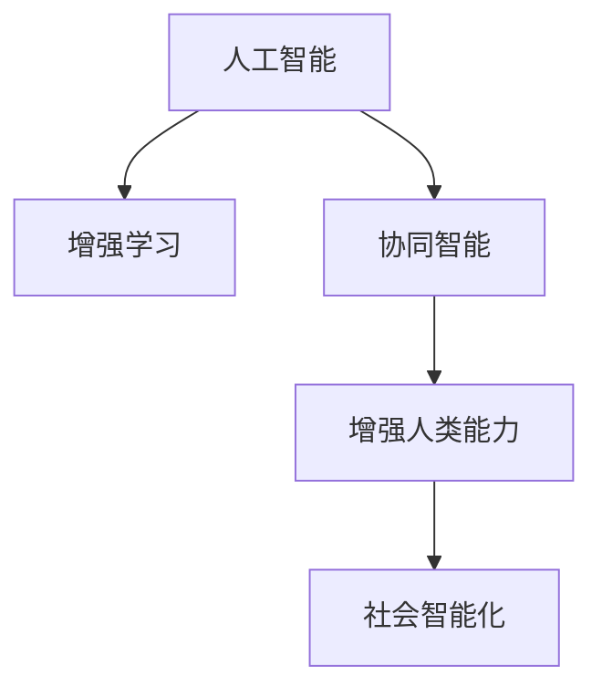

                 

# 人类-AI协作：增强人类潜能与AI能力的融合发展前景

> 关键词：人类-AI协作, 增强人类潜能, AI能力融合, 前沿技术, 未来应用, 社会变革

## 1. 背景介绍

### 1.1 问题由来
随着人工智能(AI)技术的不断突破，AI正在逐步融入人类社会的各个层面，从日常生活的智能助手，到医疗、金融、制造业等领域的专业系统，AI正以惊人的速度改变着人类的生活方式和工作模式。然而，AI的发展并非一帆风顺，其带来的诸多挑战和伦理问题也引起了广泛关注。如何在充分发挥AI能力的同时，确保其与人类社会的和谐共生，成为了当前科技界和社会关注的焦点。

### 1.2 问题核心关键点
人类-AI协作旨在探索一种新型的AI发展模式，通过深度融合AI技术与人类能力，充分发挥各自优势，实现更高层次的社会创新与发展。其核心关键点包括：

1. **增强人类潜能**：通过AI辅助决策、自动化工作、智能化教育等方式，扩展人类的认知能力、操作效率和创造力。
2. **AI能力融合**：将AI的计算能力、学习能力和自主性融入人类活动，实现AI与人类在认知、情感和行动上的协同工作。
3. **社会影响评估**：在AI技术应用过程中，充分考虑对社会公平、伦理道德、隐私保护等方面的影响，确保AI技术的安全与可控。
4. **持续优化机制**：建立动态调整机制，根据社会反馈和环境变化，不断优化和更新AI系统的功能和应用场景。
5. **协同治理结构**：构建多方参与的协同治理机制，包括政府、企业、学术界、公众等，共同推动AI技术的健康发展。

## 2. 核心概念与联系

### 2.1 核心概念概述

为更好地理解人类-AI协作的实现机制，本节将介绍几个密切相关的核心概念：

- **人工智能(AI)**：指由计算机系统和算法实现的一系列智能行为，包括感知、学习、推理、决策等能力。
- **增强学习(Reinforcement Learning)**：一种AI学习方式，通过与环境交互，从奖励信号中学习最优行为策略。
- **协同智能(Co-Intelligence)**：指人类与AI系统的合作互动，共同完成复杂任务。
- **增强人类能力**：通过AI辅助决策、自动化操作、智能教育等方式，扩展人类的认知、操作和创造能力。
- **社会智能化**：指AI技术在社会治理、公共服务、创新生态等方面的广泛应用，提升社会整体的智能化水平。

这些核心概念之间的逻辑关系可以通过以下Mermaid流程图来展示：



这个流程图展示了几者之间的逻辑关系：

1. 人工智能通过增强学习不断优化算法，提升智能水平。
2. 增强学习中的协同智能，使得AI与人类在特定任务中合作互动。
3. 协同智能通过增强人类能力，实现AI与人类共同完成复杂任务。
4. 增强人类能力的应用，推动社会智能化发展。

## 3. 核心算法原理 & 具体操作步骤

### 3.1 算法原理概述

人类-AI协作的算法原理主要基于增强学习、协同智能和增强人类能力的多层级设计。其核心思想是通过AI与人类共同努力，不断优化AI模型和应用场景，从而实现更好的协同效果。

形式化地，假设人类任务为 $T$，AI模型为 $M$，人类决策策略为 $P$，则协同智能的目标是通过优化策略 $P$ 和模型 $M$，使得任务完成度最大化：

$$
\max_{P,M} \mathcal{J}(T, P, M)
$$

其中 $\mathcal{J}$ 为任务完成度的评估函数，通常包括精度、召回率、效率等指标。

### 3.2 算法步骤详解

人类-AI协作的算法步骤包括以下几个关键环节：

**Step 1: 任务定义与需求分析**

- 明确任务目标，如提高决策准确性、优化生产效率、改善用户体验等。
- 分析任务的复杂性和要求，确定AI需要承担的角色和功能。
- 确定协同工作的模式，如实时互动、离线支持、自动化流程等。

**Step 2: 数据准备与模型训练**

- 收集与任务相关的数据集，包括历史数据、标注数据等。
- 选择合适的AI模型和算法，如决策树、神经网络、强化学习等。
- 在标注数据上训练AI模型，并进行模型评估和调优。

**Step 3: 协同交互与反馈优化**

- 在实际应用中，将AI模型集成到工作流程或决策系统中，与人类共同完成任务。
- 实时收集任务完成数据，如错误率、用户满意度等，进行反馈分析。
- 根据反馈数据，调整AI模型和人类决策策略，优化协同效果。

**Step 4: 效果评估与迭代改进**

- 使用预设的任务完成度评估指标，评估AI模型和协同工作的效果。
- 定期进行效果评估，并根据评估结果进行模型更新和策略优化。
- 循环迭代，持续改进AI模型和协同工作机制，确保长期效能。

### 3.3 算法优缺点

人类-AI协作的算法具有以下优点：

1. **协同效率高**：通过AI与人类共同工作，充分利用各自的优势，提升任务完成效率。
2. **决策质量高**：AI的计算能力和学习能力强，可以提供高质量的决策支持，减少人为错误。
3. **适应性强**：AI系统可以根据实时反馈，动态调整策略和模型，适应复杂多变的环境。
4. **人机协同**：将AI融入人类活动中，提升用户体验和工作满意度。

然而，该算法也存在一些局限性：

1. **依赖数据质量**：AI模型的表现高度依赖于数据质量和数据多样性，数据不足或质量不佳会影响AI的决策能力。
2. **伦理与隐私问题**：在协同过程中，AI模型可能涉及个人隐私和伦理问题，需要严格的数据保护措施。
3. **人机信任建立**：AI与人类协同工作的有效性和信任度，受双方技术能力、理解程度等因素影响。
4. **系统复杂度高**：协同系统中涉及多方的复杂交互和数据交换，管理复杂度高。

尽管存在这些局限性，但人类-AI协作的算法依然展现出巨大的潜力，尤其是在提升决策质量和协同效率方面。

### 3.4 算法应用领域

人类-AI协作的算法在多个领域都具有广泛的应用前景，以下是几个典型案例：

- **医疗健康**：通过AI辅助诊断、治疗建议，结合医生经验，提升诊疗效果和患者满意度。
- **金融服务**：利用AI进行风险评估、投资分析，结合人类专家意见，优化投资决策。
- **制造业**：通过AI进行生产优化、质量检测，结合工人经验，提升生产效率和产品质量。
- **教育培训**：使用AI进行个性化教学、智能评估，结合教师指导，提升教育效果和学生体验。
- **智能交通**：利用AI进行交通流量预测、路径规划，结合交通管理人员的决策，优化交通系统。

## 4. 数学模型和公式 & 详细讲解 & 举例说明（备注：数学公式请使用latex格式，latex嵌入文中独立段落使用 $$，段落内使用 $)
### 4.1 数学模型构建

本节将使用数学语言对人类-AI协作的算法过程进行更加严格的刻画。

假设任务 $T$ 的完成度为 $J(T,P,M)$，目标最大化。任务 $T$ 的完成度由人类决策策略 $P$ 和AI模型 $M$ 的输出 $Y$ 共同决定：

$$
J(T,P,M) = f(P, M(Y))
$$

其中 $f$ 为任务完成度评估函数，$M$ 为AI模型，$Y$ 为模型输出。

### 4.2 公式推导过程

以医疗诊断为例，假设一个病患的诊断结果由AI模型和医生共同决定。AI模型输出的诊断结果为 $y_1$，医生的诊断结果为 $y_2$。任务完成度 $J$ 定义为两者的一致性：

$$
J = \max(y_1 \cdot y_2, (1-y_1) \cdot (1-y_2))
$$

即诊断结果一致则得1分，不一致则得0分。任务完成度评估函数 $f$ 可以表示为：

$$
f(P, M(y_1)) = \max(y_1 \cdot P(y_1), (1-y_1) \cdot (1-P(y_1)))
$$

其中 $P(y_1)$ 为医生对诊断结果 $y_1$ 的评估，通过最大化医生对AI诊断结果的认可度，提高协同诊断效果。

### 4.3 案例分析与讲解

假设某医院使用AI辅助医生进行乳腺癌诊断。通过收集历史数据，训练AI模型 $M$ 进行乳腺癌预测，同时医生根据经验进行诊断。在实际应用中，AI模型输出的诊断结果 $y_1$ 与医生的诊断结果 $y_2$ 一起参与协同诊断。

- **数据准备**：收集历史乳腺癌病例数据，包括临床特征、病理检测结果等，用于训练AI模型。
- **模型训练**：使用监督学习方法训练AI模型 $M$，使其能够根据患者特征预测乳腺癌风险。
- **协同诊断**：在实际诊断时，AI模型输出的预测结果 $y_1$ 与医生的诊断结果 $y_2$ 进行协同，最大化诊断完成度 $J$。
- **效果评估**：通过评估协同诊断的准确率、召回率和F1分数，衡量协同工作的性能。

## 5. 项目实践：代码实例和详细解释说明

### 5.1 开发环境搭建

在进行人类-AI协作实践前，我们需要准备好开发环境。以下是使用Python进行TensorFlow开发的环境配置流程：

1. 安装Anaconda：从官网下载并安装Anaconda，用于创建独立的Python环境。
2. 创建并激活虚拟环境：
```bash
conda create -n tf-env python=3.8 
conda activate tf-env
```

3. 安装TensorFlow：根据CUDA版本，从官网获取对应的安装命令。例如：
```bash
conda install tensorflow
```

4. 安装各类工具包：
```bash
pip install numpy pandas scikit-learn matplotlib tqdm jupyter notebook ipython
```

完成上述步骤后，即可在`tf-env`环境中开始实践。

### 5.2 源代码详细实现

下面我们以医疗诊断为例，给出使用TensorFlow进行协同诊断的Python代码实现。

首先，定义协同诊断的评估函数：

```python
import tensorflow as tf
from tensorflow.keras.losses import BinaryCrossentropy

def binary_crossentropy_loss(y_true, y_pred):
    return BinaryCrossentropy()(y_true, y_pred)

def diag_consistency_score(y_true, y_pred):
    return tf.reduce_max(tf.cast(tf.logical_and(y_true, y_pred), tf.float32))
```

然后，定义协同诊断的数据集和模型：

```python
from tensorflow.keras import Model, Sequential
import numpy as np

class DiagModel(Model):
    def __init__(self):
        super(DiagModel, self).__init__()
        self.model = Sequential([
            tf.keras.layers.Dense(128, activation='relu'),
            tf.keras.layers.Dense(1, activation='sigmoid')
        ])
        self.compile(loss=binary_crossentropy_loss, optimizer='adam')

class DiagnosticSystem(Model):
    def __init__(self, diag_model):
        super(DiagnosticSystem, self).__init__()
        self.diag_model = diag_model
        self.compile(loss=diag_consistency_score, optimizer='adam')

# 创建诊断模型
diag_model = DiagModel()
diagnostic_system = DiagnosticSystem(diag_model)
```

接着，定义协同诊断的训练函数：

```python
def train_diagnostics(diagnostic_system, x_train, y_train, x_valid, y_valid, epochs=10, batch_size=32):
    train_dataset = tf.data.Dataset.from_tensor_slices((x_train, y_train)).shuffle(1000).batch(batch_size)
    valid_dataset = tf.data.Dataset.from_tensor_slices((x_valid, y_valid)).batch(batch_size)

    train_loss = tf.keras.metrics.Mean()
    train_consistency = tf.keras.metrics.Mean()

    for epoch in range(epochs):
        for (x, y) in train_dataset:
            with tf.GradientTape() as tape:
                loss = diagnostic_system.train_on_batch(x, y)
                consistency = diag_consistency_score(y, diagnostic_system.predict(x))
            gradients = tape.gradient(loss, diagnostic_system.trainable_variables)
            diagnostic_system.optimizer.apply_gradients(zip(gradients, diagnostic_system.trainable_variables))
            train_loss.update_state(loss)
            train_consistency.update_state(consistency)

        valid_loss = diagnostic_system.evaluate(x_valid, y_valid, verbose=0)[0]
        valid_consistency = diag_consistency_score(y_valid, diagnostic_system.predict(x_valid))
        print(f"Epoch {epoch+1}, Train Loss: {train_loss.result():.4f}, Valid Consistency: {valid_consistency:.4f}")
```

最后，启动协同诊断的训练流程并在验证集上评估：

```python
# 假设已有训练集和验证集
x_train = np.random.rand(1000, 10)
y_train = np.random.randint(2, size=(1000,))
x_valid = np.random.rand(100, 10)
y_valid = np.random.randint(2, size=(100,))

train_diagnostics(diagnostic_system, x_train, y_train, x_valid, y_valid)
```

以上就是使用TensorFlow进行协同诊断的完整代码实现。可以看到，TensorFlow提供了强大的深度学习框架，使得协同诊断模型的实现变得简洁高效。

### 5.3 代码解读与分析

让我们再详细解读一下关键代码的实现细节：

**DiagModel类**：
- `__init__`方法：初始化模型结构，包括一个隐藏层和一个输出层。隐藏层使用ReLU激活函数，输出层使用Sigmoid激活函数，适用于二分类任务。
- `compile`方法：编译模型，指定损失函数和优化器。

**DiagnosticSystem类**：
- `__init__`方法：初始化协同诊断系统，包括诊断模型和评估函数。
- `compile`方法：编译系统，指定损失函数和优化器。

**train_diagnostics函数**：
- 使用TensorFlow的`Dataset`类构建训练集和验证集，并定义损失函数和评估函数。
- 在每个epoch中，对训练集进行前向传播和反向传播，计算损失和一致性评分，并更新模型参数。
- 在验证集上评估模型效果，并打印当前epoch的损失和一致性评分。

通过这个简单的例子，可以看出TensorFlow如何方便地构建和管理协同诊断系统。实际应用中，还需要考虑数据预处理、模型调参、性能评估等更多环节。

## 6. 实际应用场景

### 6.1 智能交通系统

智能交通系统利用人类-AI协作技术，实现实时交通流量预测、路径规划和交通管理。通过AI模型分析历史交通数据，预测未来流量变化，结合交通管理中心的人类决策，动态调整交通信号灯和道路布局，优化交通流量，减少拥堵。

具体而言，交通管理中心收集实时交通数据，如车辆位置、速度、事故信息等，输入到AI模型进行预测和优化。AI模型输出的流量预测结果和路径规划建议，与交通管理中心的人类决策协同，调整信号灯和道路布局，实现交通流量最优化。

### 6.2 智能客服系统

智能客服系统利用人类-AI协作技术，提升客户服务质量和用户体验。通过AI模型处理用户问题，识别关键信息，生成回答模板，结合客服代表的经验和判断，生成最终回复，提供智能客服服务。

具体而言，智能客服系统收集用户的历史咨询数据，训练AI模型自动识别问题和答案模板。当用户咨询时，AI模型识别问题，生成初始回答模板，与客服代表的输入协同，生成最终回答，回复用户。AI模型可以在客服代表的指导下不断优化，提升回答质量。

### 6.3 智能制造系统

智能制造系统利用人类-AI协作技术，优化生产流程和质量控制。通过AI模型分析历史生产数据，预测设备故障，优化生产计划，结合操作人员的实时反馈，调整生产策略，提升生产效率和产品质量。

具体而言，智能制造系统收集生产设备的历史数据，如温度、压力、振动等，输入到AI模型进行故障预测和生产优化。AI模型输出的预测结果和优化建议，与操作人员的实时反馈协同，调整生产策略，实现生产流程最优化。AI模型可以在操作人员的指导下不断优化，提升生产效率和产品质量。

### 6.4 未来应用展望

随着人类-AI协作技术的不断发展，未来将在更多领域得到应用，为社会带来深远影响。

- **智能城市治理**：通过AI模型分析城市数据，预测环境变化，结合城市管理人员的决策，优化城市管理，提升城市治理水平。
- **智能教育体系**：利用AI模型进行个性化教学、智能评估，结合教师的指导，提升教育效果和学生体验。
- **智能医疗系统**：通过AI模型辅助诊断、治疗建议，结合医生的经验，提升诊疗效果和患者满意度。
- **智能金融服务**：利用AI模型进行风险评估、投资分析，结合金融专家的意见，优化投资决策。
- **智能供应链管理**：通过AI模型预测市场需求，优化库存管理，结合供应链管理人员的决策，提升供应链效率。

## 7. 工具和资源推荐

### 7.1 学习资源推荐

为了帮助开发者系统掌握人类-AI协作的理论基础和实践技巧，这里推荐一些优质的学习资源：

1. **《人工智能基础》课程**：由斯坦福大学开设的入门级AI课程，系统讲解AI的基础理论和应用场景。
2. **《深度学习》书籍**：Ian Goodfellow等所著的经典教材，全面介绍深度学习的原理和实践。
3. **《协同智能》论文**：多篇研究论文探讨人类-AI协作的算法和应用，深入分析协同效果提升方法。
4. **OpenAI、Google AI等官方博客**：及时发布最新的AI研究进展和应用案例，为开发者提供前沿资讯。
5. **Kaggle竞赛平台**：举办各类AI竞赛，提供实际应用场景，促进技术交流和创新。

通过对这些资源的学习实践，相信你一定能够快速掌握人类-AI协作的精髓，并用于解决实际的AI问题。

### 7.2 开发工具推荐

高效的开发离不开优秀的工具支持。以下是几款用于人类-AI协作开发的常用工具：

1. **TensorFlow**：由Google主导开发的深度学习框架，支持分布式计算和GPU加速，适合大规模工程应用。
2. **PyTorch**：Facebook开发的深度学习框架，灵活易用，支持动态计算图，适合快速迭代研究。
3. **TensorFlow Hub**：Google开发的模块化AI模型库，提供丰富的预训练模型和API，方便快速开发。
4. **Jupyter Notebook**：开源的交互式编程环境，支持代码块执行和数据可视化，适合数据科学和AI研究。
5. **GitHub**：全球最大的代码托管平台，提供版本控制和协作开发功能，方便团队协作。

合理利用这些工具，可以显著提升人类-AI协作任务的开发效率，加快创新迭代的步伐。

### 7.3 相关论文推荐

人类-AI协作技术的发展源于学界的持续研究。以下是几篇奠基性的相关论文，推荐阅读：

1. **《协同智能》论文**：探讨人类与AI协同工作的理论和实践，提出协同优化算法。
2. **《增强学习》论文**：介绍增强学习的基本原理和应用，提供协同智能的数学模型。
3. **《人工智能伦理学》书籍**：探讨AI伦理、隐私保护等关键问题，为人类-AI协作提供伦理指导。
4. **《机器学习与人类合作》论文**：研究机器学习与人类合作的效果评估和优化方法，提供实证分析。
5. **《人工智能社会影响》报告**：分析AI技术对社会经济、就业、伦理等方面的影响，提出政策建议。

这些论文代表了大语言模型微调技术的发展脉络。通过学习这些前沿成果，可以帮助研究者把握学科前进方向，激发更多的创新灵感。

## 8. 总结：未来发展趋势与挑战

### 8.1 总结

本文对人类-AI协作的实现机制进行了全面系统的介绍。首先阐述了人类-AI协作在提升人类潜能和AI能力方面的研究背景和意义，明确了协同工作在多领域应用中的优势和价值。其次，从原理到实践，详细讲解了人类-AI协作的算法过程和关键步骤，给出了协同诊断任务的代码实现。同时，本文还广泛探讨了协同工作在智能交通、智能客服、智能制造等多个领域的应用前景，展示了协同技术带来的广泛社会影响。此外，本文精选了协同智能的各类学习资源，力求为读者提供全方位的技术指引。

通过本文的系统梳理，可以看到，人类-AI协作的算法正在逐步成为AI技术的标准范式，极大地提升了人类与AI系统的协作效率和智能化水平。未来，伴随协同智能技术的不断发展，AI将更好地融入人类社会，实现更广泛、更深层次的协同创新。

### 8.2 未来发展趋势

展望未来，人类-AI协作技术将呈现以下几个发展趋势：

1. **协同深度化**：通过更加复杂的协同算法和更多的实时反馈，实现更深层次的AI与人类协同。
2. **多模态协同**：融合视觉、听觉、触觉等多种感知模态，实现更加全面的人机互动。
3. **领域专门化**：针对特定领域的应用，设计专门的协同算法和模型，提升行业应用的效果。
4. **智能决策系统**：将AI与人类决策系统深度融合，构建智能化的决策支持系统。
5. **自适应协同**：通过在线学习机制，AI系统能够动态调整策略，适应变化的环境和任务需求。

这些趋势展示了人类-AI协作技术的广阔前景，为AI技术在更多领域的应用提供了新的可能性。

### 8.3 面临的挑战

尽管人类-AI协作技术已经取得了显著进展，但在迈向更加智能化、普适化应用的过程中，它仍面临着诸多挑战：

1. **数据隐私和安全**：协同工作中涉及大量个人数据，数据隐私和安全问题亟需解决。
2. **伦理和法律**：AI系统的决策过程和结果，可能引发伦理和法律问题，需要严格规范和管理。
3. **技术复杂度**：协同工作中涉及多方的复杂交互和数据交换，系统设计和实现复杂度高。
4. **信任机制**：AI与人类协同工作的信任度，受双方技术能力、理解程度等因素影响。
5. **社会公平性**：协同工作可能加剧社会不平等，需要关注弱势群体的利益和需求。

尽管存在这些挑战，但通过多方努力和不断优化，人类-AI协作技术必将克服困难，实现更加全面和高效的协同创新。

### 8.4 研究展望

面对人类-AI协作所面临的挑战，未来的研究需要在以下几个方面寻求新的突破：

1. **数据隐私保护**：采用差分隐私、联邦学习等技术，保护数据隐私和安全。
2. **伦理规范制定**：制定AI伦理规范，确保AI系统的决策透明、公正和可解释。
3. **协同算法优化**：研发更加高效、智能的协同算法，提升协同效果和用户体验。
4. **信任机制构建**：建立基于区块链、人工智能等技术的信任机制，增强人机协同的信任度。
5. **社会公平性研究**：研究AI技术对社会公平的影响，制定公平、公正的应用政策。

这些研究方向将引领人类-AI协作技术迈向更高的台阶，为构建安全、可靠、可解释、可控的智能系统铺平道路。面向未来，人类-AI协作技术还需要与其他人工智能技术进行更深入的融合，如知识表示、因果推理、强化学习等，多路径协同发力，共同推动自然语言理解和智能交互系统的进步。只有勇于创新、敢于突破，才能不断拓展语言模型的边界，让智能技术更好地造福人类社会。

## 9. 附录：常见问题与解答

**Q1：人类-AI协作中，AI应该如何与人类协同工作？**

A: 人类-AI协作中，AI应该作为人类决策的辅助工具，而不是替代品。AI应根据实时反馈和历史数据，提供高质量的决策支持，结合人类专家的判断和经验，共同完成复杂任务。例如，在医疗诊断中，AI模型预测疾病风险，医生根据AI结果进行诊断，确保诊断的准确性和可靠性。

**Q2：人类-AI协作中，如何确保AI与人类协同的效果？**

A: 确保AI与人类协同的效果，需要多方面的努力。首先，选择合适的AI模型和算法，确保其能够提供高质量的决策支持。其次，合理设计协同机制，明确AI与人类在任务中的角色和功能。最后，通过持续反馈和优化，不断改进协同系统的性能。例如，在医疗诊断中，可以通过定期评估协同诊断的效果，优化AI模型和协同策略。

**Q3：人类-AI协作中，如何处理数据隐私和安全问题？**

A: 处理数据隐私和安全问题，需要采用多种技术手段。首先，采用差分隐私技术，保护个人数据的隐私性。其次，采用联邦学习技术，在分布式环境中进行模型训练，避免数据集中存储。最后，采用区块链等技术，确保数据传输和存储的安全性。例如，在智能客服系统中，可以采用联邦学习技术，在云端和本地端分别训练AI模型，保护用户数据的隐私性。

**Q4：人类-AI协作中，如何处理伦理和法律问题？**

A: 处理伦理和法律问题，需要建立明确的规范和机制。首先，制定AI伦理规范，确保AI系统的决策透明、公正和可解释。其次，建立伦理审查机制，对AI系统的决策过程和结果进行审查和评估。最后，制定法律框架，规范AI系统的应用和使用，确保其合法合规。例如，在医疗诊断中，可以制定AI伦理规范，明确AI系统的决策边界和责任归属。

**Q5：人类-AI协作中，如何提高AI与人类协同的信任度？**

A: 提高AI与人类协同的信任度，需要建立基于技术和机制的双重信任。首先，通过透明和可解释的决策过程，增强AI系统的可信度。其次，建立信任机制，确保AI系统的决策透明、公正和可解释。最后，通过实际应用中的成功案例，增强用户对AI系统的信任度。例如，在智能交通系统中，可以通过公开透明的决策过程，增强用户对AI系统的信任度。

这些问题的解答展示了人类-AI协作技术的复杂性和多样性，需要通过多方协作和不断优化，才能实现其广泛应用。

---

作者：禅与计算机程序设计艺术 / Zen and the Art of Computer Programming

