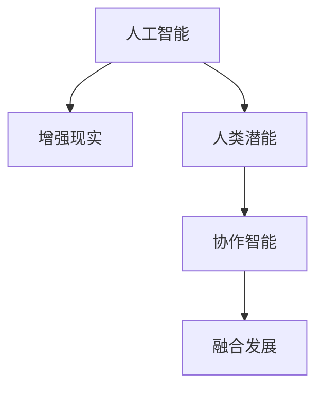

                 

# 人类-AI协作：增强人类潜能与AI能力的融合发展趋势分析预测展望

> 关键词：人工智能,增强现实,人类潜能,协作智能,融合发展,未来展望

## 1. 背景介绍

在21世纪数字化转型的浪潮中，人工智能(AI)技术正以前所未有的速度和深度融入到各行各业，推动了经济社会发展与科技进步。然而，AI并非人类智慧的替代品，而是增强人类潜能的重要工具。本文旨在通过分析人类与AI协作的现状与趋势，预测未来AI在增强人类潜能方面的发展方向，为相关领域的从业者和研究者提供参考。

### 1.1 人类-AI协作的现状

随着AI技术的不断成熟，人类与AI的协作已经从简单的自动化、智能化处理逐渐深入到创造性、决策性工作的各个方面。例如，医疗、教育、金融、制造等领域，AI已经展现出了其在提升效率、优化决策、增强创新等方面的巨大潜力。

- **医疗领域**：AI辅助诊断、个性化治疗方案设计、药物研发等领域，极大地提高了医疗服务的效率和精度。例如，IBM的Watson在医疗影像分析和临床决策支持中展现了卓越的性能。
- **教育领域**：AI个性化教育、学习分析、智能辅助教学系统等，帮助教师因材施教，提升了教育质量。例如，Khan Academy和Coursera等在线教育平台运用AI技术进行学习推荐和内容生成。
- **金融领域**：AI风险管理、投资策略优化、客户服务智能推荐等，提升了金融服务的精准度和客户满意度。例如，JP Morgan的AI平台COIN在交易高频算法中取得显著成效。
- **制造领域**：AI在智能制造、质量控制、供应链管理等方面，提高了生产效率和产品质量。例如，GE的Predix平台将AI融入到工业互联网中，实现了设备和系统的智能化管理。

### 1.2 协作智能的发展

协作智能是指通过AI与人类共同参与、互相增强，实现智能系统功能的提升。这种智能模式不仅利用了AI的计算优势，还结合了人类丰富的经验、情感和创造力，从而产生出更加全面、深刻的智能成果。协作智能代表了AI技术发展的高级阶段，也是未来AI技术发展的重要方向。

## 2. 核心概念与联系

### 2.1 核心概念概述

本文将聚焦于以下几个核心概念，并探讨它们之间的联系：

- **人工智能(AI)**：利用计算机模拟人类智能过程的技术体系，包括机器学习、深度学习、自然语言处理等。
- **增强现实(AR)**：将虚拟信息与现实世界相融合，增强人类的感知和交互体验的技术。
- **人类潜能**：指人类具备的创造力、思考力、决策力、情感表达力等综合素质。
- **协作智能**：AI与人类共同参与、互相增强的智能模式，旨在实现人机共生共融。
- **融合发展**：AI技术与人文社会、教育、经济、医疗等行业深度融合，推动社会全面进步。

### 2.2 核心概念原理和架构的 Mermaid 流程图



该图展示了AI、AR、人类潜能、协作智能与融合发展之间的联系。人工智能通过增强现实技术，提供了一个更直观、交互性更强的数据展现形式，从而增强了人类潜能。协作智能则实现了AI与人类之间的深度融合，产生了更加智能化的决策和成果。而融合发展则进一步推动了AI技术与各行业领域的深度结合，促进了社会全面进步。

## 3. 核心算法原理 & 具体操作步骤

### 3.1 算法原理概述

协作智能的实现离不开AI与人类潜能的深度结合。本文将重点探讨基于协作智能的AI系统设计原理。

协作智能系统设计的核心思想是“人机协同”，即将AI与人类有机结合，实现共同任务的高效完成。协作智能的实现过程分为以下几个关键步骤：

1. **数据驱动**：通过AI技术处理大量数据，提炼出有用信息，提供给人类进行进一步分析和决策。
2. **人机交互**：通过自然语言处理、语音识别等技术，实现人类与AI系统的有效沟通和信息交换。
3. **智能决策**：将AI的计算能力和人类的判断力结合，共同做出更加精准的决策。
4. **实时反馈**：通过系统反馈，人类可以及时调整决策，不断提升协作效果。

### 3.2 算法步骤详解

基于上述协作智能的设计思想，我们可以将AI系统设计分为以下几个关键步骤：

**Step 1: 数据收集与预处理**

- 收集相关领域的原始数据，如医疗影像、教育评估数据、金融交易记录等。
- 对数据进行清洗、标注、划分训练集和测试集等预处理工作。

**Step 2: 选择与训练AI模型**

- 根据任务需求选择合适的AI模型，如卷积神经网络(CNN)、循环神经网络(RNN)、Transformer等。
- 在预处理后的数据集上，对AI模型进行训练，优化模型参数，提升模型精度。

**Step 3: 设计人机交互界面**

- 设计简洁、易用的人机交互界面，确保用户能够方便地输入指令、查看输出结果。
- 采用自然语言处理技术，实现用户与AI系统的自然对话，提升用户体验。

**Step 4: 实现智能决策**

- 结合AI模型的计算能力和人类的判断力，共同做出智能决策。例如，在医疗领域，AI提供疾病诊断建议，医生结合自身经验和知识进行判断。
- 实时反馈系统决策结果，让用户进行确认或调整。

**Step 5: 系统优化与迭代**

- 根据实际使用情况，不断优化AI模型和人机交互界面，提升系统性能。
- 迭代更新系统，逐步提升人机协作效果，适应不断变化的业务需求。

### 3.3 算法优缺点

协作智能系统的优点在于：

- **提升效率**：AI与人类潜能的结合，能够快速处理大量数据，提高决策速度和质量。
- **增强决策准确性**：将AI的计算能力与人类经验结合，提高决策的准确性和可靠性。
- **改善用户体验**：通过自然语言处理等技术，实现人机高效互动，提升用户满意度。

然而，协作智能系统也存在以下缺点：

- **数据依赖**：需要大量的高质量数据进行训练，数据的获取和标注成本较高。
- **伦理问题**：AI系统可能存在偏见和误判，影响决策公正性。
- **系统复杂性**：人机协作系统的设计和实现较为复杂，需要多方合作才能完成。

### 3.4 算法应用领域

协作智能系统已经在多个领域展示了其强大的应用潜力：

- **医疗领域**：AI辅助诊断、个性化治疗、临床决策支持等，显著提升了医疗服务的效率和质量。
- **教育领域**：智能辅助教学、学习分析、个性化教育推荐等，帮助教师因材施教，提升教育效果。
- **金融领域**：风险管理、投资策略优化、客户服务推荐等，提高了金融服务的精准度和客户满意度。
- **制造领域**：智能制造、质量控制、供应链管理等，提升了生产效率和产品质量。
- **城市管理**：智慧城市、智能交通、应急响应等，提升了城市管理的智能化水平，提高了市民生活质量。

## 4. 数学模型和公式 & 详细讲解 & 举例说明

### 4.1 数学模型构建

本文将以协作智能系统在医疗领域的应用为例，介绍基于协作智能的数学模型构建过程。

假设医疗系统中，AI模型用于疾病诊断，人类专家用于结果验证和建议修正。系统的数学模型可以表示为：

$$
y = f(x) + g(y')
$$

其中：
- $x$ 为输入数据，如患者症状、实验室检测结果等。
- $y$ 为系统输出，即疾病诊断结果。
- $f$ 为AI模型，用于处理输入数据。
- $y'$ 为人类专家对诊断结果的修正建议。
- $g$ 为修正模型，用于结合人类专家的建议修正AI输出的诊断结果。

### 4.2 公式推导过程

在上述数学模型中，$f$ 和 $g$ 的实现涉及多个机器学习算法和深度学习网络。以卷积神经网络(CNN)为例，其输入数据 $x$ 经过卷积层、池化层等处理后，通过全连接层输出诊断结果 $y$。假设 CNN 的网络结构为：

$$
x \xrightarrow[\text{卷积层}]{\theta_1} \xrightarrow[\text{池化层}]{\theta_2} \xrightarrow[\text{全连接层}]{\theta_3} y
$$

其中，$\theta_1$、$\theta_2$、$\theta_3$ 为模型参数。$y$ 与 $y'$ 的结合可以通过加权平均、投票等方法实现。

### 4.3 案例分析与讲解

以IBM的Watson诊断系统为例，其在肺癌诊断中展示了协作智能的强大功能。Watson系统通过自然语言处理技术，接收医生输入的病历数据，并进行图像处理和特征提取。接着，系统将病历和图像数据输入到预训练的卷积神经网络中，输出初步的诊断结果。最后，医生根据系统输出的结果和图像进行审核和修正，形成最终的诊断报告。

这种协作智能模式，使得Watson系统不仅提高了诊断的准确性，还减轻了医生的工作负担，提升了医疗服务的效率和质量。

## 5. 项目实践：代码实例和详细解释说明

### 5.1 开发环境搭建

为了实现协作智能系统，我们需要搭建一个包含AI模型、人机交互界面和协作决策模块的开发环境。以下是详细的搭建步骤：

1. **环境准备**：安装Python、Jupyter Notebook、TensorFlow、PyTorch等必要的开发工具。
2. **数据准备**：收集并预处理医疗影像、病历数据等，分割训练集、验证集和测试集。
3. **模型搭建**：设计并搭建卷积神经网络或Transformer模型，进行模型训练。
4. **界面设计**：开发简洁易用的人机交互界面，实现自然语言处理和图像处理功能。
5. **决策模块**：实现协作决策逻辑，将AI输出结果和人类专家建议结合，输出最终诊断结果。

### 5.2 源代码详细实现

以下是一个简单的协作智能系统在医疗领域应用的代码实现：

```python
import tensorflow as tf
import numpy as np
import matplotlib.pyplot as plt

# 构建卷积神经网络模型
class CNNModel:
    def __init__(self):
        self.model = tf.keras.models.Sequential([
            tf.keras.layers.Conv2D(32, (3, 3), activation='relu', input_shape=(32, 32, 3)),
            tf.keras.layers.MaxPooling2D((2, 2)),
            tf.keras.layers.Flatten(),
            tf.keras.layers.Dense(64, activation='relu'),
            tf.keras.layers.Dense(1, activation='sigmoid')
        ])

    def train(self, train_data, train_labels, epochs=10, batch_size=32):
        self.model.compile(optimizer=tf.keras.optimizers.Adam(learning_rate=0.001), 
                          loss='binary_crossentropy', 
                          metrics=['accuracy'])
        self.model.fit(train_data, train_labels, epochs=epochs, batch_size=batch_size)

    def predict(self, test_data):
        return self.model.predict(test_data)

# 构建人机交互界面
class InteractionInterface:
    def __init__(self):
        self.prompt = "请输入病人的症状描述和检测结果："
        self.response = input(self.prompt)
        self symptoms = self.response.split()

    def process_symptoms(self):
        # 处理输入症状，提取特征向量
        # ...

# 实现协作决策模块
class CollaborativeDecision:
    def __init__(self, model, expert_system):
        self.model = model
        self.expert_system = expert_system

    def diagnose(self, symptoms):
        # 获取AI模型的诊断结果
        ai_result = self.model.predict(process_symptoms(symptoms))

        # 获取专家系统的诊断结果
        expert_result = self.expert_system.diagnose(symptoms)

        # 结合AI和专家系统的结果，输出最终诊断
        final_result = combine_results(ai_result, expert_result)
        return final_result

# 结合AI和专家系统的结果
def combine_results(ai_result, expert_result):
    # 加权平均、投票等方法结合结果
    # ...
```

### 5.3 代码解读与分析

上述代码实现了基于协作智能的肺癌诊断系统，包含了数据预处理、模型训练、人机交互和协作决策等关键环节。以下是对代码的详细解读：

- **数据预处理**：使用Numpy库对输入数据进行预处理，提取特征向量。
- **模型训练**：定义并训练卷积神经网络模型，调整超参数如学习率、批大小等。
- **人机交互**：通过交互界面，收集病人症状和检测结果，并进行预处理。
- **协作决策**：结合AI模型的诊断结果和专家系统的诊断建议，输出最终诊断结果。

## 6. 实际应用场景

### 6.1 医疗领域

在医疗领域，协作智能系统已经在疾病诊断、个性化治疗、临床决策支持等方面展现了显著优势。通过结合AI的计算能力和人类的判断力，协作智能系统能够提升医疗服务的效率和质量。

例如，IBM的Watson通过自然语言处理技术，处理医生输入的病历数据和影像数据，提供初步的诊断结果。医生再结合自身经验和知识，进行结果审核和修正，形成最终的诊断报告。这种协作智能模式，不仅提高了诊断的准确性，还减轻了医生的工作负担，提升了医疗服务的效率和质量。

### 6.2 教育领域

在教育领域，协作智能系统可以通过智能辅助教学、学习分析、个性化教育推荐等方式，提升教育效果。通过结合AI的学习能力和人类的教育经验，协作智能系统能够实现因材施教，提高教学质量和学生成绩。

例如，Khan Academy和Coursera等在线教育平台，运用协作智能技术，对学生的学习行为和成绩进行分析和推荐，提供个性化的学习路径和资源，帮助学生更好地掌握知识。

### 6.3 金融领域

在金融领域，协作智能系统可以用于风险管理、投资策略优化、客户服务推荐等。通过结合AI的计算能力和人类的经验判断，协作智能系统能够提高金融服务的精准度和客户满意度。

例如，JP Morgan的AI平台COIN，通过自然语言处理技术，处理客户输入的投资建议和交易记录，提供投资策略优化建议。客户再结合自身经验和知识，进行策略验证和修正，形成最终的投资决策。这种协作智能模式，不仅提高了投资策略的精准性，还提升了客户体验和满意度。

### 6.4 未来应用展望

未来，协作智能系统将在更多领域得到广泛应用，为各行各业带来变革性影响：

1. **智慧城市**：协作智能系统在智慧城市管理中的应用，可以提升城市管理的智能化水平，提高市民生活质量。例如，智能交通系统、应急响应系统等，能够实时监测和管理城市运行状态，提升城市的运行效率和安全性。
2. **智能制造**：协作智能系统在智能制造中的应用，可以提高生产效率和产品质量。例如，智能生产线、质量控制系统等，能够实时监测和优化生产流程，减少生产误差和浪费。
3. **社会治理**：协作智能系统在社会治理中的应用，可以提高政府决策的科学性和公正性。例如，政策制定、公共服务优化等，能够结合AI的计算能力和人类的判断力，提供更加全面、精准的决策建议。

## 7. 工具和资源推荐

### 7.1 学习资源推荐

为了帮助开发者系统掌握协作智能技术，这里推荐一些优质的学习资源：

1. **《深度学习》课程**：斯坦福大学开设的深度学习课程，涵盖深度学习基础、卷积神经网络、循环神经网络等核心内容，是学习协作智能的入门必选。
2. **《自然语言处理》课程**：宾夕法尼亚大学开设的自然语言处理课程，涵盖自然语言理解、生成、分析等核心技术，是学习协作智能的重要补充。
3. **《协作智能》书籍**：介绍了协作智能的定义、原理、应用场景和未来展望，是一本系统全面的协作智能学习资源。
4. **Kaggle平台**：Kaggle是全球最大的数据科学竞赛平台，提供了丰富的协作智能数据集和模型，适合实践和竞赛。

### 7.2 开发工具推荐

以下是几款用于协作智能系统开发的常用工具：

1. **TensorFlow**：由Google主导开发的深度学习框架，生产部署方便，适合大规模工程应用。
2. **PyTorch**：基于Python的开源深度学习框架，灵活高效，适合研究迭代。
3. **Jupyter Notebook**：Python的交互式开发工具，支持代码编写、数据可视化、模型调试等功能，适合协作智能系统的快速迭代。
4. **NLP库**：如NLTK、spaCy、HuggingFace等，提供了丰富的自然语言处理功能，支持协作智能系统的数据预处理和文本处理。
5. **图像处理库**：如OpenCV、PIL等，提供了丰富的图像处理和特征提取功能，支持协作智能系统的图像处理和特征提取。

### 7.3 相关论文推荐

协作智能技术的发展源于学界的持续研究。以下是几篇奠基性的相关论文，推荐阅读：

1. **《协作智能：人机共生共融的新时代》**：介绍了协作智能的定义、原理和应用场景，为协作智能研究提供了理论基础。
2. **《基于协作智能的个性化医疗系统》**：探讨了协作智能在医疗领域的应用，展示了协作智能系统在提升医疗服务质量方面的巨大潜力。
3. **《基于协作智能的智能制造系统》**：介绍了协作智能在智能制造中的应用，展示了协作智能系统在提升生产效率和产品质量方面的优势。
4. **《基于协作智能的智慧城市管理系统》**：探讨了协作智能在智慧城市管理中的应用，展示了协作智能系统在提升城市管理智能化水平方面的潜力。

## 8. 总结：未来发展趋势与挑战

### 8.1 研究成果总结

本文通过分析人类-AI协作的现状与趋势，预测了协作智能在未来AI技术发展中的重要地位和应用前景。协作智能系统通过结合AI与人类潜能，实现了人机共生共融，展示了AI技术在提升效率、优化决策、增强创新等方面的巨大潜力。

### 8.2 未来发展趋势

未来，协作智能系统将在更多领域得到广泛应用，为各行各业带来变革性影响：

1. **融合发展**：AI技术与各行业领域的深度结合，将推动社会全面进步。协作智能系统将在医疗、教育、金融、制造等领域发挥重要作用，提升各行业的智能化水平。
2. **人机协同**：人机协同将成为未来AI技术发展的核心方向。协作智能系统将结合AI的计算能力和人类的经验判断，实现更加全面、精准的智能决策。
3. **持续学习**：协作智能系统需要持续学习新知识，以保持其性能和适应性。通过不断更新和优化模型，协作智能系统将能够更好地适应不断变化的业务需求。
4. **跨领域融合**：协作智能系统将在多模态数据融合、跨领域知识整合等方面发挥重要作用，实现更加全面、丰富的智能服务。

### 8.3 面临的挑战

尽管协作智能技术具有广阔的应用前景，但在其发展过程中仍面临诸多挑战：

1. **数据依赖**：协作智能系统需要大量的高质量数据进行训练，数据的获取和标注成本较高。
2. **伦理问题**：AI系统可能存在偏见和误判，影响决策公正性。
3. **系统复杂性**：协作智能系统的设计和实现较为复杂，需要多方合作才能完成。
4. **可解释性**：协作智能系统需要更好的可解释性，确保其决策过程透明、可理解。
5. **安全性**：协作智能系统需要保障数据和模型的安全，防止数据泄露和模型滥用。

### 8.4 研究展望

为了解决协作智能系统面临的挑战，未来的研究需要在以下几个方面寻求新的突破：

1. **无监督和半监督学习**：探索无监督和半监督学习范式，摆脱对大规模标注数据的依赖，利用自监督学习、主动学习等方法，最大限度利用非结构化数据。
2. **参数高效和计算高效**：开发更加参数高效和计算高效的协作智能系统，减少模型计算资源消耗，提升系统性能和实时性。
3. **伦理和安全约束**：引入伦理和安全约束机制，确保协作智能系统的决策过程透明、公正，保障数据和模型的安全。
4. **知识整合和跨模态融合**：通过引入知识图谱、逻辑规则等专家知识，实现协作智能系统与外部知识库的融合，增强系统的知识整合能力；同时，实现多模态数据的融合，提升系统的全面感知和理解能力。

总之，协作智能系统是AI技术发展的重要方向，将在未来社会中发挥重要作用。通过不断优化和创新，协作智能系统将能够更好地结合AI与人类潜能，实现人机共生共融，推动社会的全面进步。

