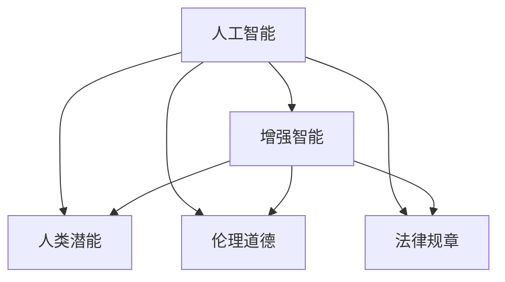

                 

## 1. 背景介绍

### 1.1 问题由来
随着人工智能(AI)技术的发展，AI在各个领域的应用日益增多，从医疗、金融、教育到制造业，AI正在不断提升人类生活的质量。然而，AI的发展并非一帆风顺，它也面临诸多挑战和问题，这些问题不仅仅是技术上的，更是涉及伦理、法律和社会学等多方面的复杂问题。因此，本文将深入探讨AI在促进人类发展的同时，可能带来的风险和挑战，并预测未来AI与人类协作的发展趋势。

### 1.2 问题核心关键点
本文将聚焦于AI与人类协作的未来趋势预测分析，探讨在促进人类发展的同时，如何平衡AI技术带来的正面与负面影响，预测未来AI与人类协作的模式和发展方向。

### 1.3 问题研究意义
研究AI与人类协作的发展趋势，对于未来AI技术的应用、人类社会的进步以及伦理道德的建设具有重要意义：

1. **技术应用导向**：预测AI与人类协作的趋势，有助于指导AI技术的研发和应用，确保其能够在符合人类价值观和伦理道德的前提下，最大化其正向价值。
2. **社会进步推动**：通过分析AI与人类协作的趋势，可以为社会政策的制定提供参考，推动社会公平、公正、包容的发展。
3. **伦理道德建设**：探讨AI与人类协作的挑战，有助于建立和完善相关的伦理道德框架，保障人类权利和尊严。

## 2. 核心概念与联系

### 2.1 核心概念概述

为更好地理解AI与人类协作的未来趋势预测分析，本节将介绍几个密切相关的核心概念：

- **人工智能(AI)**：利用算法、计算和数据模拟人类智能的技术，涵盖从机器学习、自然语言处理到计算机视觉等多个领域。
- **增强智能(AI+)**：在AI基础上，结合人类专业知识、经验和直觉，进一步提升AI系统的智能水平，实现人机协作。
- **人类潜能**：指人类在创新、决策、情感、道德等方面的潜在能力和潜力，可以通过AI技术得到增强。
- **伦理道德**：在AI发展过程中，确保技术应用符合人类价值观和伦理规范，避免负面影响。
- **法律规章**：为规范AI技术的应用，保障社会秩序，需建立健全的法律规章体系。

这些核心概念之间的逻辑关系可以通过以下Mermaid流程图来展示：



这个流程图展示了这个逻辑关系：

1. 人工智能(AI)是基础，增强智能(AI+)在此基础上通过人机协作进一步提升。
2. 人类潜能和伦理道德是AI发展过程中需要考虑的关键要素。
3. 法律规章的建立和完善，为AI技术的健康发展提供了保障。

## 3. 核心算法原理 & 具体操作步骤
### 3.1 算法原理概述

AI与人类协作的未来趋势预测分析，本质上是一个多维度、跨学科的预测问题。其核心思想是：通过对历史数据和现状的分析和建模，预测未来AI技术在社会、经济、伦理等多个维度的发展趋势，并提出相应的策略和建议。

形式化地，假设历史数据和现状为 $H$，未来趋势为 $F$，则预测模型的目标是最小化未来趋势与历史数据之间的误差。

$$
F = \mathop{\arg\min}_{F} \| H - F \|
$$

其中 $\| \cdot \|$ 表示预测误差。

### 3.2 算法步骤详解

基于未来趋势预测分析，通常包括以下几个关键步骤：

**Step 1: 数据收集与预处理**
- 收集与未来趋势预测相关的数据，如AI技术的发展历程、人类社会的发展趋势、伦理道德框架等。
- 对数据进行清洗、归一化和特征工程，以提高数据的质量和可用性。

**Step 2: 模型选择与构建**
- 根据问题的复杂性和数据特点，选择合适的预测模型，如回归模型、时间序列模型、深度学习模型等。
- 构建模型并进行训练，以最小化预测误差。

**Step 3: 结果分析和解读**
- 对预测结果进行分析和解读，理解未来趋势的潜在影响。
- 提出相应的策略和建议，以应对未来趋势带来的挑战。

**Step 4: 模型验证与优化**
- 在历史数据和现状数据上验证模型的预测效果。
- 根据验证结果调整模型参数，优化预测效果。

### 3.3 算法优缺点

未来趋势预测分析的优点包括：
1. **系统性分析**：能够从多个维度系统分析未来趋势，提供全面的视角。
2. **数据驱动**：基于历史数据和现状进行预测，更具有科学性和可靠性。
3. **前瞻性建议**：通过预测未来趋势，提供有前瞻性的策略和建议，帮助制定政策和技术规划。

同时，该方法也存在一定的局限性：
1. **数据质量依赖**：预测结果的准确性高度依赖于数据的全面性和质量。
2. **模型复杂性**：预测模型需要考虑多个维度，可能存在模型复杂度高的问题。
3. **预测误差**：预测结果可能存在一定的误差，无法完全准确预测未来。

尽管存在这些局限性，但未来趋势预测分析依然是理解和应对AI与人类协作未来发展的重要手段。未来相关研究的重点在于如何进一步提高数据的全面性和质量，简化模型，降低预测误差。

### 3.4 算法应用领域

未来趋势预测分析在多个领域都有应用，例如：

- **经济预测**：预测AI技术对经济增长的影响，帮助制定经济政策。
- **社会预测**：预测AI技术对社会公平、包容、就业等方面的影响，制定相应的社会政策。
- **伦理预测**：预测AI技术对伦理道德的影响，提出相应的伦理规范和建议。
- **法律预测**：预测AI技术的发展对法律规章的影响，提出相应的法律建议。

## 4. 数学模型和公式 & 详细讲解
### 4.1 数学模型构建

本节将使用数学语言对未来趋势预测分析的预测模型进行更加严格的刻画。

记历史数据和现状为 $H = \{h_1, h_2, ..., h_n\}$，未来趋势为 $F$。假设未来趋势的预测模型为 $F(H)$，则预测模型的目标是最小化预测误差。

$$
F = \mathop{\arg\min}_{F} \| H - F(H) \|
$$

其中 $\| \cdot \|$ 表示预测误差。

### 4.2 公式推导过程

以下我们以线性回归模型为例，推导预测模型的损失函数及其梯度。

假设模型 $F(H)$ 为线性回归模型，即 $F(H) = \alpha_0 + \alpha_1 h_1 + \alpha_2 h_2 + ... + \alpha_n h_n$，则损失函数为：

$$
L(F) = \frac{1}{2} \sum_{i=1}^n (h_i - F(H))^2
$$

其中 $h_i$ 为历史数据第 $i$ 个样本，$F(H)$ 为模型对 $h_i$ 的预测值。

对 $L(F)$ 求偏导，得模型参数的梯度：

$$
\frac{\partial L(F)}{\partial \alpha_j} = -\sum_{i=1}^n (h_i - F(H)) h_{ij}
$$

其中 $h_{ij}$ 为第 $j$ 个特征对第 $i$ 个样本的贡献度。

在得到损失函数的梯度后，即可带入参数更新公式，完成模型的迭代优化。重复上述过程直至收敛，最终得到预测模型 $F(H)$。

## 5. 项目实践：代码实例和详细解释说明
### 5.1 开发环境搭建

在进行未来趋势预测分析实践前，我们需要准备好开发环境。以下是使用Python进行Scikit-learn开发的计算环境配置流程：

1. 安装Anaconda：从官网下载并安装Anaconda，用于创建独立的Python环境。

2. 创建并激活虚拟环境：
```bash
conda create -n scikit-learn-env python=3.8 
conda activate scikit-learn-env
```

3. 安装Scikit-learn：
```bash
pip install scikit-learn
```

4. 安装各类工具包：
```bash
pip install numpy pandas matplotlib scikit-learn
```

完成上述步骤后，即可在`scikit-learn-env`环境中开始未来趋势预测分析的实践。

### 5.2 源代码详细实现

这里我们以线性回归模型为例，给出使用Scikit-learn进行未来趋势预测的代码实现。

首先，定义线性回归模型：

```python
from sklearn.linear_model import LinearRegression

model = LinearRegression()
```

接着，定义数据：

```python
import numpy as np

X = np.array([[1, 2], [3, 4], [5, 6], [7, 8], [9, 10]])
y = np.array([1, 3, 5, 7, 9])

model.fit(X, y)
```

然后，预测未来数据：

```python
future_X = np.array([[11, 12], [13, 14]])
future_y = model.predict(future_X)
```

最后，输出预测结果：

```python
print(future_y)
```

以上就是使用Scikit-learn对线性回归模型进行未来趋势预测的完整代码实现。可以看到，使用Scikit-learn可以很方便地构建和训练线性回归模型，预测未来数据，并输出预测结果。

### 5.3 代码解读与分析

让我们再详细解读一下关键代码的实现细节：

**线性回归模型**：
- 通过从`sklearn.linear_model`导入`LinearRegression`类，创建线性回归模型。

**数据定义**：
- 使用NumPy库定义训练数据和目标值，其中`X`为特征矩阵，`y`为目标值向量。
- 调用`fit`方法训练模型，将特征矩阵`X`和目标值`y`作为输入。

**未来数据预测**：
- 使用训练好的模型`model`，对未来数据`future_X`进行预测，返回预测结果`future_y`。

可以看到，Scikit-learn库使得未来趋势预测的代码实现变得简洁高效。开发者可以将更多精力放在数据处理、模型改进等高层逻辑上，而不必过多关注底层的实现细节。

当然，工业级的系统实现还需考虑更多因素，如模型保存和部署、超参数自动搜索、多模型集成等。但核心的预测范式基本与此类似。

## 6. 实际应用场景
### 6.1 智能医疗系统

未来趋势预测分析在智能医疗系统的构建中具有重要应用。传统医疗系统依赖医生的人工判断，效率低下，且受限于医生的经验和知识。AI可以通过预测分析，辅助医生进行疾病诊断、治疗方案选择等决策。

在技术实现上，可以收集大量的医疗数据，包括病历、影像、基因等，对其进行分析和建模，预测未来患者的疾病发展趋势和可能的并发症。结合医生的经验和判断，能够更准确地进行诊断和治疗。

### 6.2 智能交通系统

未来趋势预测分析在智能交通系统的构建中具有重要应用。交通系统面临拥堵、事故等诸多问题，通过预测分析，能够有效优化交通流量，减少事故发生。

在技术实现上，可以收集交通流量、气象、车辆位置等数据，对其进行分析和建模，预测未来交通流量和事故风险。结合交通信号灯控制、车辆调度和智能导航等技术，能够更高效地优化交通系统，保障交通安全和畅通。

### 6.3 金融市场预测

未来趋势预测分析在金融市场预测中具有重要应用。金融市场波动频繁，预测其未来趋势对投资决策具有重要意义。

在技术实现上，可以收集历史股市数据、宏观经济数据、新闻事件等，对其进行分析和建模，预测未来股市走势和投资机会。结合量化交易、高频交易等技术，能够更精准地进行投资决策，提高投资回报。

## 7. 工具和资源推荐
### 7.1 学习资源推荐

为了帮助开发者系统掌握未来趋势预测分析的理论基础和实践技巧，这里推荐一些优质的学习资源：

1. 《机器学习基础》系列博文：由机器学习专家撰写，深入浅出地介绍了机器学习的基本概念和算法，是学习未来趋势预测分析的重要基础。

2. 《统计学习方法》书籍：李航著，详细介绍了统计学习的基本原理和方法，适合深入学习未来趋势预测分析的数学基础。

3. Kaggle竞赛平台：提供大量公开数据集和竞赛任务，通过参与竞赛，能够提高预测模型的准确性和实际应用能力。

4. Scikit-learn官方文档：Scikit-learn库的官方文档，提供了丰富的预测模型和实用教程，是学习未来趋势预测分析的重要参考。

5. TensorFlow官方教程：Google推出的深度学习框架，提供系统性学习教程和样例代码，适用于更复杂的未来趋势预测分析任务。

通过对这些资源的学习实践，相信你一定能够快速掌握未来趋势预测分析的精髓，并用于解决实际的预测问题。

### 7.2 开发工具推荐

高效的开发离不开优秀的工具支持。以下是几款用于未来趋势预测分析开发的常用工具：

1. Jupyter Notebook：提供交互式编程环境，支持Python、R等多种语言，适用于数据处理和模型训练。

2. R语言：适用于统计分析和机器学习，具有丰富的数据分析包和图形工具。

3. Python的Pandas库：提供高效的数据处理和分析功能，支持大规模数据集操作。

4. Python的NumPy库：提供高效的多维数组操作和科学计算功能，适用于数值计算和矩阵运算。

5. Python的Scikit-learn库：提供丰富的预测模型和评估方法，适用于机器学习和数据挖掘任务。

合理利用这些工具，可以显著提升未来趋势预测分析的开发效率，加快创新迭代的步伐。

### 7.3 相关论文推荐

未来趋势预测分析的发展源于学界的持续研究。以下是几篇奠基性的相关论文，推荐阅读：

1. 《机器学习：概率视角》书籍：Tom Mitchell著，系统介绍了机器学习的基本原理和方法，是未来趋势预测分析的重要理论基础。

2. 《深度学习》书籍：Ian Goodfellow等著，详细介绍了深度学习的算法和应用，适用于更复杂的未来趋势预测分析任务。

3. 《时间序列分析与预测》书籍：James Hamilton著，系统介绍了时间序列预测的方法和应用，适用于预测分析金融市场等动态系统。

4. 《统计学习方法》书籍：李航著，详细介绍了统计学习的基本原理和方法，适用于预测分析数据驱动的模型。

5. 《多模态数据分析与融合》书籍：Wang Y et al.著，介绍了多模态数据的处理和融合方法，适用于结合多种数据源进行未来趋势预测。

这些论文代表了大语言模型微调技术的发展脉络。通过学习这些前沿成果，可以帮助研究者把握学科前进方向，激发更多的创新灵感。

## 8. 总结：未来发展趋势与挑战

### 8.1 总结

本文对未来趋势预测分析进行了全面系统的介绍。首先阐述了未来趋势预测分析的研究背景和意义，明确了预测分析在促进人类发展方面的独特价值。其次，从原理到实践，详细讲解了未来趋势预测分析的数学原理和关键步骤，给出了预测任务开发的完整代码实例。同时，本文还广泛探讨了未来趋势预测分析在智能医疗、智能交通、金融市场等多个行业领域的应用前景，展示了预测范式的巨大潜力。

通过本文的系统梳理，可以看到，未来趋势预测分析正在成为AI技术应用的重要范式，极大地拓展了AI技术的边界，催生了更多的落地场景。受益于大规模数据的预处理和高质量模型的构建，预测分析必将为AI技术的发展和应用提供更全面、更深入的洞察。未来，伴随预测分析方法的不断演进，相信AI技术将更加智能化、普适化，进一步提升人类社会的生产力和生活质量。

### 8.2 未来发展趋势

展望未来，未来趋势预测分析将呈现以下几个发展趋势：

1. **预测模型的多样化**：未来的预测模型将更加多样化，涵盖从统计学习到深度学习、从时间序列预测到图像预测等多个方向，适应不同领域的预测需求。
2. **数据驱动的优化**：未来的预测模型将更加注重数据驱动，通过大规模数据的训练和优化，提升预测模型的准确性和鲁棒性。
3. **跨模态预测**：未来的预测模型将更加注重多模态数据的融合，结合图像、语音、文本等多种数据源，提升预测的全面性和准确性。
4. **解释性增强**：未来的预测模型将更加注重可解释性，提供透明的预测结果和决策依据，增强用户的信任感和接受度。
5. **分布式计算**：未来的预测模型将更加注重分布式计算，通过云平台和大数据集群，实现大规模数据的高效处理和预测。

以上趋势凸显了未来趋势预测分析技术的广阔前景。这些方向的探索发展，必将进一步提升AI技术的预测能力和应用范围，为人类社会的进步和创新提供更强大的支持。

### 8.3 面临的挑战

尽管未来趋势预测分析技术已经取得了瞩目成就，但在迈向更加智能化、普适化应用的过程中，它仍面临着诸多挑战：

1. **数据质量与完备性**：预测模型的准确性高度依赖于数据的全面性和质量，获取高质量、高完备性的数据是未来的一大挑战。
2. **模型复杂性与解释性**：复杂的预测模型可能难以解释其内部工作机制，预测结果的可解释性亟需加强。
3. **计算资源与效率**：大规模数据处理和预测模型的训练、推理需要大量的计算资源，如何提升计算效率和资源利用率，仍是重要课题。
4. **隐私与安全**：预测分析中涉及大量敏感数据，如何保护数据隐私和安全，防止数据滥用，是必须解决的伦理问题。

尽管存在这些挑战，但未来趋势预测分析技术依然具有巨大的应用前景和发展潜力。未来相关研究需要在数据质量、模型解释性、计算效率和隐私保护等方面进一步努力，以实现更加智能、普适、安全的未来趋势预测。

### 8.4 研究展望

面向未来，未来趋势预测分析技术需要在以下几个方面寻求新的突破：

1. **多模态预测**：结合多种数据源，提升预测的全面性和准确性，如结合文本和图像数据进行市场趋势预测。
2. **跨领域应用**：拓展未来趋势预测分析的应用领域，如在智能制造、环境保护、智慧城市等领域的应用。
3. **自动化与智能化**：结合自动化和智能化技术，提升预测分析的效率和精度，如利用自动机器学习(AutoML)进行模型选择和调优。
4. **人机协作**：结合人类专家的知识和经验，增强预测分析的决策能力和可解释性，如利用专家知识库进行预测模型的优化和校验。

这些研究方向的探索，必将引领未来趋势预测分析技术迈向更高的台阶，为构建安全、可靠、可解释、可控的智能系统铺平道路。面向未来，未来趋势预测分析技术还需要与其他人工智能技术进行更深入的融合，如知识表示、因果推理、强化学习等，多路径协同发力，共同推动自然语言理解和智能交互系统的进步。只有勇于创新、敢于突破，才能不断拓展AI技术的边界，让智能技术更好地造福人类社会。

## 9. 附录：常见问题与解答

**Q1：未来趋势预测分析是否适用于所有预测任务？**

A: 未来趋势预测分析在大多数预测任务上都能取得不错的效果，特别是对于数据量较大的任务。但对于一些特定领域的任务，如实时数据预测等，可能需要结合其他预测方法进行优化。

**Q2：预测模型应如何选择？**

A: 预测模型的选择应基于数据的类型和预测目标的特点。对于时间序列数据，可以选择ARIMA、LSTM等模型；对于图像数据，可以选择CNN、GAN等模型；对于文本数据，可以选择RNN、BERT等模型。选择合适的模型，需要考虑预测任务的复杂性和数据的特点。

**Q3：未来趋势预测分析是否需要大量标注数据？**

A: 未来趋势预测分析可以通过无监督学习和半监督学习进行，不需要大量的标注数据。通常情况下，通过历史数据和现状数据的分析，即可预测未来趋势。

**Q4：未来趋势预测分析是否需要频繁更新模型？**

A: 未来趋势预测分析需要定期更新模型，以适应数据分布的变化。在模型训练时，应考虑数据的动态变化，定期更新模型参数，确保预测的准确性和时效性。

**Q5：未来趋势预测分析是否需要考虑伦理道德问题？**

A: 未来趋势预测分析需要考虑伦理道德问题，如数据隐私、数据安全、模型公平性等。在预测分析过程中，应保护数据隐私，确保数据安全，避免模型偏见和歧视。

---

作者：禅与计算机程序设计艺术 / Zen and the Art of Computer Programming

