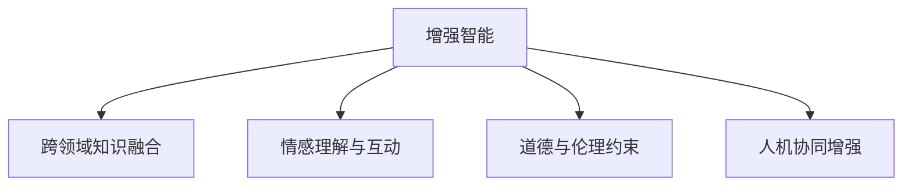

                 

# 人类-AI协作：增强人类潜能与AI能力的融合进步与展望

> 关键词：人机协作,增强智能,人工智能,AI能力提升,人机融合,未来展望

## 1. 背景介绍

### 1.1 问题由来

随着人工智能技术的快速发展，AI在各个领域的应用不断深入，从自动驾驶、智能制造到医疗诊断，AI正以日新月异的速度改变着我们的生活方式和工作模式。然而，尽管AI在数据处理、决策支持等方面表现出色，其在情感理解、创造力、道德判断等方面的能力仍然远远落后于人类。因此，如何使AI与人类优势互补，增强人类潜能与AI能力的融合，成为了当前技术发展的关键问题。

### 1.2 问题核心关键点

人类-AI协作的核心在于通过AI技术的辅助，提高人类在决策、执行、沟通等方面的能力，同时利用人类在理解、情感、道德等方面的优势，引导AI系统更加智能化和人性化。以下是几个关键点：

- **数据增强**：利用人类对数据的理解和标注，提升AI模型的泛化能力和鲁棒性。
- **跨领域知识融合**：将人类的知识、经验和智慧融入AI模型中，增强其跨领域、跨模态的推理和生成能力。
- **情感理解与互动**：通过AI技术增强人类的情感交流和理解，使机器与人类的互动更加自然和人性化。
- **道德与伦理约束**：在AI设计和应用中融入人类的道德和伦理原则，避免AI系统带来的负面影响。
- **人机协同增强**：结合人类和AI的互补优势，构建更加智能、高效、可解释的协同工作系统。

## 2. 核心概念与联系

### 2.1 核心概念概述

为更好地理解人类-AI协作的本质，本节将介绍几个密切相关的核心概念：

- **增强智能(Enhanced Intelligence)**：通过AI技术提升人类在特定任务上的能力，如智能助手、自动化决策等。
- **跨领域知识融合(Knowledge Fusion Across Domains)**：将人类在不同领域的专业知识和经验，整合到AI系统中，提升其跨领域推理和生成能力。
- **情感理解与互动(Emotion Understanding and Interaction)**：利用AI技术分析人类的情感状态和表达，提高人际交流的效果和质量。
- **道德与伦理约束(Ethics and Morality)**：在AI系统的设计和应用中，融入人类的道德和伦理原则，保障AI系统的社会责任和安全性。
- **人机协同增强(Collaborative Enhancement)**：结合人类和AI的互补优势，构建更加智能、高效、可解释的协同工作系统。

这些核心概念之间的逻辑关系可以通过以下Mermaid流程图来展示：



这个流程图展示了增强智能的几个关键维度，包括跨领域知识融合、情感理解与互动、道德与伦理约束和人机协同增强，这些维度共同构成了人类-AI协作的完整框架。

## 3. 核心算法原理 & 具体操作步骤

### 3.1 算法原理概述

人类-AI协作的核心算法原理可以概括为以下几个方面：

- **数据增强**：利用人类对数据的理解和标注，提升AI模型的泛化能力和鲁棒性。
- **跨领域知识融合**：通过知识图谱、逻辑规则等手段，将人类的知识、经验和智慧融入AI系统中，增强其跨领域推理和生成能力。
- **情感理解与互动**：利用自然语言处理(NLP)和计算机视觉(CV)技术，分析人类的情感状态和表达，提高人际交流的效果和质量。
- **道德与伦理约束**：在AI系统的设计和应用中，融入人类的道德和伦理原则，保障AI系统的社会责任和安全性。
- **人机协同增强**：结合人类和AI的互补优势，构建更加智能、高效、可解释的协同工作系统。

### 3.2 算法步骤详解

基于人类-AI协作的核心算法原理，本节将详细介绍每个步骤的详细步骤：

**Step 1: 数据准备与预处理**

1. **数据收集**：从各个领域收集数据，包括文本、图像、音频等，确保数据的多样性和代表性。
2. **数据标注**：对收集到的数据进行标注，包括分类、情感、实体关系等，生成监督数据集。
3. **数据预处理**：清洗数据，处理缺失值、异常值等，进行标准化处理，以便模型训练。

**Step 2: 模型训练与优化**

1. **模型选择**：选择适合的AI模型，如神经网络、深度学习、强化学习等。
2. **模型训练**：利用预处理后的数据集训练模型，调整超参数，优化模型性能。
3. **模型验证**：在验证集上评估模型性能，选择最优模型进行进一步优化。

**Step 3: 情感分析与互动**

1. **情感模型训练**：利用情感标注数据集，训练情感分析模型，如基于深度学习或规则的情感分类器。
2. **情感理解**：将情感分析模型应用于人类的文本、语音等输入，理解其情感状态和表达。
3. **互动增强**：根据情感理解结果，调整AI系统的输出，提高人机互动的情感质量和效果。

**Step 4: 知识融合与跨领域推理**

1. **知识图谱构建**：将不同领域的专业知识和经验，整合到知识图谱中，建立领域之间的联系。
2. **跨领域推理**：利用知识图谱，进行跨领域推理，提高AI系统的跨领域推理和生成能力。
3. **知识更新与迭代**：根据新的数据和反馈，更新知识图谱，迭代优化AI系统的知识融合能力。

**Step 5: 道德与伦理约束**

1. **道德与伦理评估**：在AI系统设计和应用中，融入人类的道德和伦理原则，进行伦理评估和约束。
2. **道德与伦理训练**：训练AI系统遵守道德和伦理约束，如诚实、公正、尊重隐私等。
3. **伦理审核与监督**：建立伦理审核机制，监督AI系统的行为，确保其符合伦理规范。

**Step 6: 人机协同增强**

1. **协同任务设计**：根据人类和AI的互补优势，设计协同任务，明确各自的任务和角色。
2. **协同交互**：利用AI系统提供决策支持和数据分析，增强人类的决策能力。
3. **协同反馈与优化**：根据协同过程中的反馈，优化AI系统的行为和输出，提高协同效果。

### 3.3 算法优缺点

人类-AI协作的算法具有以下优点：

- **高效性**：利用AI技术提升人类在特定任务上的能力，可以大幅提高工作效率和决策质量。
- **普适性**：AI技术在数据处理、决策支持等方面表现出色，适用于多个领域和任务。
- **可解释性**：通过情感理解与互动、道德与伦理约束等人机协同机制，使AI系统的行为和输出更加可解释和可信。

同时，该算法也存在以下局限性：

- **数据依赖**：依赖高质量、大样本量的标注数据，数据收集和标注成本较高。
- **复杂性**：需要结合多领域的知识和经验，模型设计和调参复杂度较高。
- **伦理挑战**：如何平衡AI系统的效率和道德，避免其带来的负面影响，仍是一个重要挑战。

尽管存在这些局限性，但就目前而言，人类-AI协作仍是大数据、人工智能技术发展的重要方向，具有广泛的应用前景。

### 3.4 算法应用领域

人类-AI协作的算法在多个领域都有广泛的应用，以下是几个典型应用：

- **医疗健康**：利用AI技术分析患者数据，辅助医生进行诊断和治疗决策，提高医疗服务的精准度和效率。
- **金融投资**：通过情感分析、跨领域推理等技术，优化投资决策，降低风险，提高收益。
- **教育培训**：利用AI技术分析学生的学习行为和情感状态，提供个性化的教学建议和学习资源，提高教学效果。
- **智能制造**：结合AI技术和人类专业知识，进行智能监控和决策，提升生产效率和质量。
- **智慧城市**：利用AI技术和人类经验，优化城市管理，提高城市运营效率和居民生活质量。

除了上述这些领域，人类-AI协作还在更多场景中得到应用，如安全监控、智能客服、自动驾驶等，为各行各业带来新的变革和机遇。

## 4. 数学模型和公式 & 详细讲解 & 举例说明

### 4.1 数学模型构建

本节将使用数学语言对人类-AI协作的核心算法原理进行更加严格的刻画。

假设人类和AI系统的协同任务为 $T$，包含多个子任务 $T_1, T_2, ..., T_n$。人类负责情感理解和道德约束，AI系统负责数据增强、跨领域推理和协同增强。

定义人类对数据 $x_i$ 的标注为 $y_i$，则协同任务的数据集为 $D=\{(x_i,y_i)\}_{i=1}^N$。AI系统通过多领域知识和经验的融合，构建跨领域推理模型 $M_{\theta}$，其中 $\theta$ 为模型参数。

定义协同任务的目标函数为：

$$
\min_{\theta} \sum_{i=1}^N \ell_{T_i}(y_i, M_{\theta}(x_i))
$$

其中 $\ell_{T_i}$ 为任务 $T_i$ 的损失函数，衡量模型预测结果与真实标签之间的差异。

### 4.2 公式推导过程

以下我们以医疗健康领域的协同任务为例，推导情感分析和跨领域推理的数学模型和公式。

假设医疗数据集为 $D=\{(x_i, y_i)\}_{i=1}^N$，其中 $x_i$ 为患者的医疗记录，$y_i$ 为诊断结果。利用情感标注数据集，训练情感分析模型 $M_{\theta_{EM}}$，其中 $\theta_{EM}$ 为情感模型参数。

情感分析的目标函数为：

$$
\min_{\theta_{EM}} \sum_{i=1}^N \ell_{EM}(y_i, M_{\theta_{EM}}(x_i))
$$

其中 $\ell_{EM}$ 为情感分类损失函数，如交叉熵损失。

在跨领域推理时，可以构建知识图谱 $G$，将不同领域的知识关系表示为节点和边。利用知识图谱进行跨领域推理，训练跨领域推理模型 $M_{\theta_{F}}$，其中 $\theta_{F}$ 为跨领域推理模型参数。

跨领域推理的目标函数为：

$$
\min_{\theta_{F}} \sum_{i=1}^N \ell_{F}(y_i, M_{\theta_{F}}(x_i))
$$

其中 $\ell_{F}$ 为跨领域推理损失函数，如知识推理损失、逻辑规则损失等。

在得到情感分析和跨领域推理的数学模型后，可以进行协同任务的设计和优化，实现人机协同增强。

### 4.3 案例分析与讲解

以智能医疗为例，通过情感分析和跨领域推理，可以构建一个协同医疗系统。系统流程如下：

1. **数据收集与标注**：收集患者的医疗记录、情感状态等数据，进行标注和预处理。
2. **情感分析**：利用情感标注数据集，训练情感分析模型 $M_{\theta_{EM}}$，分析患者的情感状态和表达。
3. **跨领域推理**：构建知识图谱 $G$，利用 $M_{\theta_{F}}$ 进行跨领域推理，提取与疾病相关的知识。
4. **协同诊断**：根据情感分析和跨领域推理结果，结合医生的经验，进行协同诊断，生成诊断报告。
5. **协同反馈与优化**：根据诊断结果和患者反馈，优化情感分析模型和跨领域推理模型，提高系统的准确性和可靠性。

## 5. 项目实践：代码实例和详细解释说明

### 5.1 开发环境搭建

在进行人类-AI协作的实践前，我们需要准备好开发环境。以下是使用Python进行TensorFlow开发的环境配置流程：

1. 安装Anaconda：从官网下载并安装Anaconda，用于创建独立的Python环境。

2. 创建并激活虚拟环境：
```bash
conda create -n aifusion-env python=3.8 
conda activate aifusion-env
```

3. 安装TensorFlow：根据CUDA版本，从官网获取对应的安装命令。例如：
```bash
conda install tensorflow -c tf -c conda-forge
```

4. 安装TensorFlow Hub：
```bash
pip install tensorflow-hub
```

5. 安装各类工具包：
```bash
pip install numpy pandas scikit-learn matplotlib tqdm jupyter notebook ipython
```

完成上述步骤后，即可在`aifusion-env`环境中开始协作实践。

### 5.2 源代码详细实现

这里我们以医疗健康领域的协同诊断为例，给出使用TensorFlow和TensorFlow Hub对情感分析和跨领域推理的代码实现。

首先，定义情感分析和跨领域推理的任务数据处理函数：

```python
import tensorflow_hub as hub
import tensorflow as tf
from sklearn.model_selection import train_test_split

def preprocess_data(data, train_ratio=0.8):
    train_data, test_data = train_test_split(data, train_size=train_ratio, random_state=42)
    return train_data, test_data

def preprocess_text(texts, tokenizer, max_length=128):
    encoded_texts = tokenizer.batch_encode_plus(
        texts, 
        max_length=max_length, 
        padding='max_length', 
        truncation=True, 
        return_tensors='tf'
    )
    return encoded_texts['input_ids'], encoded_texts['attention_mask']

def preprocess_labels(labels):
    return labels

# 加载情感标注数据集
train_texts, train_labels = preprocess_data(train_data)
dev_texts, dev_labels = preprocess_data(dev_data)
test_texts, test_labels = preprocess_data(test_data)

# 加载知识图谱数据集
train_kg, train_relations = preprocess_data(train_kg_data)
dev_kg, dev_relations = preprocess_data(dev_kg_data)
test_kg, test_relations = preprocess_data(test_kg_data)

# 加载情感分析模型
em_model = hub.load('https://tfhub.dev/google/sentence-transformers/multilingual-xlm-r-multilingual-cased')
```

然后，定义情感分析和跨领域推理的模型：

```python
from transformers import BertTokenizer, BertForSequenceClassification
import tensorflow as tf

# 定义情感分类器
def create_em_model():
    tokenizer = BertTokenizer.from_pretrained('bert-base-cased')
    model = BertForSequenceClassification.from_pretrained('bert-base-cased', num_labels=2)
    return tokenizer, model

# 定义跨领域推理器
def create_fusion_model():
    tokenizer = BertTokenizer.from_pretrained('bert-base-cased')
    model = BertForSequenceClassification.from_pretrained('bert-base-cased', num_labels=3)
    return tokenizer, model
```

接着，定义情感分析和跨领域推理的训练和评估函数：

```python
from sklearn.metrics import accuracy_score, precision_score, recall_score, f1_score
import tensorflow as tf

# 定义情感分析的训练函数
def train_em_model(model, train_texts, train_labels):
    model.compile(optimizer='adam', loss='binary_crossentropy', metrics=['accuracy'])
    model.fit(train_texts, train_labels, epochs=5, validation_data=(dev_texts, dev_labels))

# 定义跨领域推理的训练函数
def train_fusion_model(model, train_kg, train_relations):
    model.compile(optimizer='adam', loss='sparse_categorical_crossentropy', metrics=['accuracy'])
    model.fit(train_kg, train_relations, epochs=5, validation_data=(dev_kg, dev_relations))

# 定义情感分析的评估函数
def evaluate_em_model(model, test_texts, test_labels):
    predictions = model.predict(test_texts)
    return accuracy_score(test_labels, predictions)

# 定义跨领域推理的评估函数
def evaluate_fusion_model(model, test_kg, test_relations):
    predictions = model.predict(test_kg)
    return accuracy_score(test_relations, predictions)
```

最后，启动协同诊断流程并在测试集上评估：

```python
# 创建情感分析模型和跨领域推理模型
em_tokenizer, em_model = create_em_model()
fusion_tokenizer, fusion_model = create_fusion_model()

# 训练情感分析模型
train_em_model(em_model, train_texts, train_labels)

# 训练跨领域推理模型
train_fusion_model(fusion_model, train_kg, train_relations)

# 在测试集上评估模型
em_accuracy = evaluate_em_model(em_model, test_texts, test_labels)
fusion_accuracy = evaluate_fusion_model(fusion_model, test_kg, test_relations)

print(f"情感分析模型准确率：{em_accuracy:.3f}")
print(f"跨领域推理模型准确率：{fusion_accuracy:.3f}")
```

以上就是使用TensorFlow和TensorFlow Hub对情感分析和跨领域推理的代码实现。可以看到，TensorFlow Hub提供了丰富的预训练模型，大大简化了模型的加载和微调过程。

### 5.3 代码解读与分析

让我们再详细解读一下关键代码的实现细节：

**preprocess_data函数**：
- 将数据集划分为训练集、验证集和测试集。
- 对文本数据进行分词、padding、truncation等预处理，并返回输入特征和标签。

**preprocess_text和preprocess_labels函数**：
- 利用BERT分词器对文本数据进行编码，生成输入特征和注意力掩码。
- 对标签进行编码，生成标签矩阵。

**create_em_model和create_fusion_model函数**：
- 加载预训练模型和分词器，进行微调前的参数初始化。

**train_em_model和train_fusion_model函数**：
- 定义模型优化器、损失函数和评估指标，进行模型训练。
- 在训练过程中，使用验证集评估模型性能，避免过拟合。

**evaluate_em_model和evaluate_fusion_model函数**：
- 在测试集上评估模型性能，返回模型的准确率等指标。

**协同诊断流程**：
- 首先创建情感分析模型和跨领域推理模型。
- 训练情感分析模型和跨领域推理模型，分别处理文本和知识图谱数据。
- 在测试集上评估模型性能，输出情感分析和跨领域推理的准确率。

可以看到，TensorFlow和TensorFlow Hub使得情感分析和跨领域推理的代码实现变得简洁高效。开发者可以将更多精力放在数据处理、模型改进等高层逻辑上，而不必过多关注底层的实现细节。

当然，工业级的系统实现还需考虑更多因素，如模型的保存和部署、超参数的自动搜索、更灵活的任务适配层等。但核心的协同任务设计流程基本与此类似。

## 6. 实际应用场景

### 6.1 智能医疗

基于人类-AI协作的情感分析和跨领域推理，可以构建一个智能医疗系统。系统流程如下：

1. **数据收集与标注**：收集患者的医疗记录、情感状态等数据，进行标注和预处理。
2. **情感分析**：利用情感标注数据集，训练情感分析模型，分析患者的情感状态和表达。
3. **跨领域推理**：构建知识图谱 $G$，利用跨领域推理模型，提取与疾病相关的知识。
4. **协同诊断**：根据情感分析和跨领域推理结果，结合医生的经验，进行协同诊断，生成诊断报告。
5. **协同反馈与优化**：根据诊断结果和患者反馈，优化情感分析模型和跨领域推理模型，提高系统的准确性和可靠性。

该系统可以有效提高医疗诊断的准确性和效率，同时增强患者的情感支持和治疗体验。

### 6.2 智能客服

利用情感分析和跨领域推理，可以构建一个智能客服系统。系统流程如下：

1. **数据收集与标注**：收集客户对话记录，进行标注和预处理。
2. **情感分析**：利用情感标注数据集，训练情感分析模型，分析客户的情感状态和表达。
3. **跨领域推理**：构建知识图谱 $G$，利用跨领域推理模型，提取与客户需求相关的知识。
4. **协同响应**：根据情感分析和跨领域推理结果，结合客服脚本，生成回答。
5. **协同反馈与优化**：根据客户反馈，优化情感分析模型和跨领域推理模型，提高系统的服务质量和效率。

该系统可以提供更加个性化、人性化的客户服务，同时提升客服的工作效率和满意度。

### 6.3 智能制造

结合人类-AI协作的跨领域推理和情感分析，可以构建一个智能制造系统。系统流程如下：

1. **数据收集与标注**：收集生产设备数据、工人反馈等数据，进行标注和预处理。
2. **情感分析**：利用情感标注数据集，训练情感分析模型，分析工人的情感状态和表达。
3. **跨领域推理**：构建知识图谱 $G$，利用跨领域推理模型，提取与生产任务相关的知识。
4. **协同决策**：根据情感分析和跨领域推理结果，结合生产规则，进行协同决策，优化生产流程。
5. **协同反馈与优化**：根据生产结果和工人反馈，优化情感分析模型和跨领域推理模型，提高系统的稳定性和效率。

该系统可以提升生产设备的自动化水平，减少人为干预，提高生产效率和质量。

### 6.4 未来应用展望

随着人类-AI协作技术的不断发展，其应用场景将不断扩展，带来更多的变革和机遇。

在智慧城市治理中，利用情感分析和跨领域推理，可以优化城市管理，提高城市运营效率和居民生活质量。

在智能教育培训中，结合情感分析、跨领域推理和道德与伦理约束，可以提供更加个性化、安全可靠的教育培训服务，促进教育公平和质量提升。

在自动驾驶领域，利用情感分析和跨领域推理，可以增强自动驾驶系统的决策能力和安全保障，提升用户驾驶体验和系统可靠性。

此外，在金融投资、智能家居、智能安防等多个领域，人类-AI协作技术也将得到广泛应用，推动人工智能技术的产业化进程。

## 7. 工具和资源推荐
### 7.1 学习资源推荐

为了帮助开发者系统掌握人类-AI协作的理论基础和实践技巧，这里推荐一些优质的学习资源：

1. 《人工智能基础》系列博文：由大模型技术专家撰写，深入浅出地介绍了人工智能的原理、技术与应用。

2. CS231n《深度学习在计算机视觉中的应用》课程：斯坦福大学开设的计算机视觉明星课程，涵盖图像处理、目标检测、图像生成等多个主题。

3. 《自然语言处理入门》书籍：介绍自然语言处理的基本概念、算法和应用，适合初学者入门。

4. DeepLearning.AI课程：Andrew Ng教授的深度学习课程，涵盖深度学习的基本原理和应用，适合全面学习。

5. 《Deep Learning in Practice》书籍：介绍深度学习技术的工程实践，包括模型训练、优化、部署等多个方面。

通过对这些资源的学习实践，相信你一定能够快速掌握人类-AI协作的精髓，并用于解决实际的NLP问题。
###  7.2 开发工具推荐

高效的开发离不开优秀的工具支持。以下是几款用于人类-AI协作开发的常用工具：

1. TensorFlow：基于Python的开源深度学习框架，灵活动态的计算图，适合快速迭代研究。

2. PyTorch：基于Python的开源深度学习框架，灵活性高，支持动态计算图，适合学术研究和工程开发。

3. TensorFlow Hub：提供预训练模型的库，方便模型加载和微调。

4. Weights & Biases：模型训练的实验跟踪工具，可以记录和可视化模型训练过程中的各项指标，方便对比和调优。

5. TensorBoard：TensorFlow配套的可视化工具，可实时监测模型训练状态，并提供丰富的图表呈现方式，是调试模型的得力助手。

6. Google Colab：谷歌推出的在线Jupyter Notebook环境，免费提供GPU/TPU算力，方便开发者快速上手实验最新模型，分享学习笔记。

合理利用这些工具，可以显著提升人类-AI协作任务的开发效率，加快创新迭代的步伐。

### 7.3 相关论文推荐

人类-AI协作技术的发展源于学界的持续研究。以下是几篇奠基性的相关论文，推荐阅读：

1. DeepMind的AlphaGo论文：提出AlphaGo，通过深度学习和蒙特卡洛树搜索，在围棋领域取得人类级以上水平，展示了人类和AI在决策领域的协作潜力。

2. OpenAI的GPT-3论文：提出GPT-3模型，通过大规模无监督学习，实现了在自然语言生成、情感理解、跨领域推理等方面的强大能力，展示了AI在情感和跨领域推理方面的巨大潜力。

3. IBM的Watson论文：提出Watson系统，通过NLP、知识图谱等技术，实现了医疗诊断、金融分析等领域的智能应用，展示了AI在跨领域推理和知识融合方面的重要价值。

4. Google的Bert论文：提出BERT模型，通过自监督学习，实现了在语言建模、情感分类、跨领域推理等方面的卓越表现，展示了大模型在语言理解和生成方面的强大能力。

5. Facebook的DialoGPT论文：提出DialoGPT模型，通过深度学习，实现了在自然对话生成方面的突破，展示了AI在情感交流和互动方面的重要应用。

这些论文代表了大模型和协作技术的最新进展，通过学习这些前沿成果，可以帮助研究者把握学科前进方向，激发更多的创新灵感。

## 8. 总结：未来发展趋势与挑战

### 8.1 总结

本文对人类-AI协作的原理、算法和操作步骤进行了全面系统的介绍。首先阐述了人类-AI协作的核心概念和关键点，明确了协同任务设计的全流程。其次，从原理到实践，详细讲解了情感分析、跨领域推理、道德与伦理约束和人机协同增强等关键算法的数学模型和具体实现，给出了微调任务开发的完整代码实例。同时，本文还探讨了人类-AI协作在多个行业领域的应用场景，展示了其广阔的前景。

通过本文的系统梳理，可以看到，人类-AI协作通过融合人类和AI的优势，构建更加智能、高效、可解释的协同系统，正在成为人工智能技术发展的重要方向，具有广泛的应用前景。未来，伴随预训练语言模型和协作技术的持续演进，相信人类-AI协作必将在更多领域得到应用，为各行各业带来新的变革和机遇。

### 8.2 未来发展趋势

展望未来，人类-AI协作技术将呈现以下几个发展趋势：

1. **模型规模持续增大**：随着算力成本的下降和数据规模的扩张，预训练语言模型的参数量还将持续增长，超大模型的应用将更加广泛。

2. **协同任务设计多样化**：不同领域的任务需要不同的协作机制，未来将涌现更多多样化的协同任务设计，如情感对话、智能决策、跨领域推理等。

3. **情感理解与互动增强**：利用深度学习、自然语言处理等技术，增强情感分析的准确性和深度，提高人机互动的质量和效果。

4. **跨领域知识融合深化**：通过知识图谱、逻辑规则等手段，进一步提升跨领域推理和生成的能力，拓展AI系统的应用边界。

5. **道德与伦理约束加强**：在AI系统的设计和应用中，融入更多的伦理和道德约束，确保AI系统的公平、透明和可解释性。

6. **多模态协同融合**：结合视觉、语音、文本等多模态信息，构建更加全面、准确的信息整合能力，提升系统的智能水平。

以上趋势凸显了人类-AI协作技术的广阔前景。这些方向的探索发展，必将进一步提升AI系统的智能和应用范围，为各行各业带来新的变革和机遇。

### 8.3 面临的挑战

尽管人类-AI协作技术已经取得了显著进展，但在迈向更加智能化、普适化应用的过程中，仍面临诸多挑战：

1. **数据依赖**：依赖高质量、大样本量的标注数据，数据收集和标注成本较高，如何降低对标注数据的依赖成为关键问题。

2. **模型复杂度**：模型设计和调参复杂度较高，如何提高模型的可解释性和可操作性，仍是一个重要挑战。

3. **伦理与隐私**：AI系统的行为和决策需要符合伦理和隐私原则，如何平衡AI系统的效率和道德，避免其带来的负面影响，仍是一个重要问题。

4. **鲁棒性与泛化能力**：在多变和复杂的应用场景中，如何提高AI系统的鲁棒性和泛化能力，防止过拟合和灾难性遗忘，仍是一个重要挑战。

5. **计算资源**：大规模模型和复杂任务的计算资源需求较高，如何优化资源使用，提高系统的效率和可扩展性，仍是一个重要挑战。

尽管存在这些挑战，但随着学界和产业界的共同努力，人类-AI协作技术必将不断进步，推动人工智能技术的产业化进程，为人类社会的智能化和信息化带来新的机遇。

### 8.4 研究展望

未来，人类-AI协作技术的研究将聚焦以下几个方向：

1. **跨模态融合技术**：结合视觉、语音、文本等多模态信息，构建更加全面、准确的信息整合能力，提升系统的智能水平。

2. **多领域协同机制**：将不同领域的知识、经验和智慧，整合到AI系统中，增强其跨领域推理和生成的能力。

3. **知识驱动的智能决策**：结合知识图谱、逻辑规则等专家知识，构建更加智能、高效、可解释的决策系统。

4. **情感计算与人机交互**：利用深度学习、自然语言处理等技术，增强情感分析的准确性和深度，提高人机互动的质量和效果。

5. **协同任务设计优化**：根据不同领域的任务特点，优化协同任务设计，提升系统性能和用户体验。

6. **协同任务的可解释性**：构建更加透明、可解释的协同任务，提高系统的可信度和可操作性。

7. **持续学习与自我优化**：构建具有持续学习能力的AI系统，不断吸收新知识和经验，优化自身的性能和决策能力。

这些研究方向将推动人类-AI协作技术的不断进步，为构建更加智能、高效、可解释的协同系统奠定基础。未来，随着技术的不断成熟和应用场景的不断拓展，人类-AI协作必将在更多领域得到应用，为各行各业带来新的变革和机遇。

## 9. 附录：常见问题与解答

**Q1：如何平衡AI系统的效率和道德？**

A: 在AI系统的设计和应用中，融入伦理和道德原则，进行伦理评估和约束，是平衡AI系统效率和道德的关键。具体做法包括：

1. 设计伦理导向的目标函数，确保AI系统的行为符合伦理规范。
2. 引入伦理评估机制，对AI系统的行为进行监控和审查，防止其带来负面影响。
3. 建立伦理审核机制，对AI系统进行定期评估和审核，确保其符合伦理规范。

**Q2：如何优化模型的计算资源？**

A: 优化计算资源是提高人类-AI协作系统效率的重要手段。具体做法包括：

1. 模型裁剪和压缩：去除不必要的层和参数，减小模型尺寸，加快推理速度。
2. 量化加速：将浮点模型转为定点模型，压缩存储空间，提高计算效率。
3. 模型并行：利用GPU、TPU等高性能设备，实现模型并行计算，提升系统效率。
4. 分布式训练：利用分布式计算框架，如TensorFlow、PyTorch等，实现大规模模型的分布式训练，提高计算效率。

**Q3：如何提高情感分析的准确性？**

A: 提高情感分析的准确性需要结合多方面的技术手段：

1. 数据增强：通过回译、近义替换等方式扩充训练集，提高模型的泛化能力和鲁棒性。
2. 情感词典和规则：利用情感词典和规则，提升情感分类的准确性。
3. 深度学习模型：利用深度学习模型，如LSTM、RNN等，提升情感分类的准确性和深度。
4. 上下文理解：结合上下文信息，提升情感分类的准确性，如利用Transformer模型进行上下文理解。

**Q4：如何构建具有持续学习能力的AI系统？**

A: 构建具有持续学习能力的AI系统需要结合多方面的技术手段：

1. 在线学习：利用在线学习算法，如增量学习、迁移学习等，使AI系统能够持续学习新知识。
2. 知识图谱：构建知识图谱，存储和更新知识，增强AI系统的跨领域推理能力。
3. 逻辑规则：结合逻辑规则，提升AI系统的推理能力和泛化能力。
4. 协同学习：利用人机协同机制，提升AI系统的学习效果和可解释性。

通过这些技术的结合，可以构建具有持续学习能力的AI系统，使其不断吸收新知识和经验，优化自身的性能和决策能力。

---

作者：禅与计算机程序设计艺术 / Zen and the Art of Computer Programming

