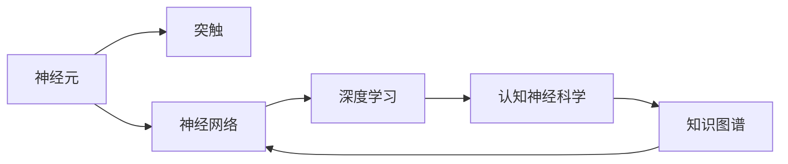

                 

# 人类大脑的奥秘：解锁知识和理解的关键

## 1. 背景介绍

### 1.1 问题由来

人类大脑是已知最复杂的生物结构之一，是知识和理解的源泉。近年来，随着人工智能和神经科学研究的深入，对大脑的研究取得了重大进展，尤其是对人脑理解机制的研究，为人工智能的开发和应用提供了新的方向。

### 1.2 问题核心关键点

理解大脑的工作原理，尤其是大脑如何进行知识存储和理解，对人工智能的开发具有重要意义。通过分析大脑的工作机制，可以指导人工智能模型如何更好地学习和应用知识，从而实现更高效、更智能的计算。

## 2. 核心概念与联系

### 2.1 核心概念概述

要理解大脑的奥秘，需要掌握以下几个核心概念：

- **神经元(Neuron)**：大脑的基本组成部分，负责信息处理和传递。
- **突触(Synapse)**：神经元之间的连接点，实现信息的传递和交流。
- **神经网络(Neural Network)**：模拟大脑神经元网络的结构，用于人工智能模型的构建。
- **深度学习(Deep Learning)**：一种基于神经网络的机器学习技术，模仿大脑的多层信息处理机制。
- **认知神经科学(Cognitive Neuroscience)**：研究大脑和认知过程的科学，揭示大脑如何处理信息。
- **知识图谱(Knowledge Graph)**：一种用于表示实体、属性和关系的图结构，模拟人类对知识的管理和理解。

这些核心概念之间存在着密切的联系，共同构成了人类大脑的知识理解和处理机制。

### 2.2 核心概念原理和架构的 Mermaid 流程图



## 3. 核心算法原理 & 具体操作步骤

### 3.1 算法原理概述

大脑的信息处理机制可以用神经网络和深度学习的原理来模拟。神经网络由多个神经元组成，通过突触传递信息。深度学习通过多层神经元的学习，实现对复杂数据的处理和理解。

### 3.2 算法步骤详解

1. **数据准备**：收集和处理大量的数据，包括图像、文本、声音等，用于训练神经网络。
2. **模型设计**：设计合适的神经网络结构，选择合适的层数、激活函数、优化器等。
3. **模型训练**：使用训练数据对模型进行训练，调整参数使其拟合数据。
4. **模型评估**：使用测试数据评估模型的性能，调整超参数以优化模型。
5. **模型应用**：将训练好的模型应用于实际问题，实现对数据的处理和理解。

### 3.3 算法优缺点

**优点**：

- **处理复杂数据**：深度学习模型可以处理大规模、复杂的数据，如图像、语音、文本等。
- **自动特征提取**：神经网络可以自动提取数据中的特征，不需要手动设计。
- **高效计算**：深度学习模型可以并行计算，加速训练和推理。

**缺点**：

- **计算资源消耗大**：深度学习模型需要大量的计算资源和存储空间。
- **模型复杂度高**：神经网络层数过多，可能导致梯度消失或爆炸，难以训练。
- **缺乏可解释性**：深度学习模型通常被视为"黑盒"，难以解释其决策过程。

### 3.4 算法应用领域

深度学习和神经网络已经被广泛应用于多个领域，包括计算机视觉、自然语言处理、语音识别、推荐系统等。这些技术在实际应用中取得了显著的效果，推动了人工智能技术的发展。

## 4. 数学模型和公式 & 详细讲解 & 举例说明

### 4.1 数学模型构建

深度学习的数学模型可以表示为：

$$
y = \sum_{i=1}^{n} w_i \cdot f(x_i)
$$

其中，$y$ 为输出，$w_i$ 为权重，$f(x_i)$ 为激活函数，$x_i$ 为输入。

### 4.2 公式推导过程

以最简单的神经网络模型为例，其前向传播过程可以表示为：

$$
a_1 = f(w_1^T \cdot x_1 + b_1)
$$
$$
a_2 = f(w_2^T \cdot a_1 + b_2)
$$
$$
...
$$
$$
a_n = f(w_n^T \cdot a_{n-1} + b_n)
$$

其中，$x_1, x_2, ..., x_n$ 为输入，$a_1, a_2, ..., a_n$ 为隐藏层和输出层的激活值。

### 4.3 案例分析与讲解

以图像分类为例，输入为一张图像，通过多个卷积层和池化层提取特征，最后通过全连接层输出分类结果。整个过程可以表示为：

$$
y = \sum_{i=1}^{n} w_i \cdot f(a_i)
$$

其中，$a_i$ 为卷积和池化层的输出，$f$ 为激活函数。

## 5. 项目实践：代码实例和详细解释说明

### 5.1 开发环境搭建

在搭建深度学习开发环境时，需要安装以下工具：

1. **Python**：安装Python 3.6及以上版本。
2. **PyTorch**：安装PyTorch 1.6及以上版本，用于深度学习模型的开发。
3. **TensorFlow**：安装TensorFlow 2.0及以上版本，用于深度学习模型的开发。
4. **Jupyter Notebook**：安装Jupyter Notebook，用于编写和运行代码。

### 5.2 源代码详细实现

以下是一个简单的图像分类器的代码实现：

```python
import torch
import torch.nn as nn
import torchvision.transforms as transforms
from torchvision.datasets import CIFAR10

# 定义网络结构
class Net(nn.Module):
    def __init__(self):
        super(Net, self).__init__()
        self.conv1 = nn.Conv2d(3, 6, 5)
        self.pool = nn.MaxPool2d(2, 2)
        self.conv2 = nn.Conv2d(6, 16, 5)
        self.fc1 = nn.Linear(16 * 5 * 5, 120)
        self.fc2 = nn.Linear(120, 84)
        self.fc3 = nn.Linear(84, 10)

    def forward(self, x):
        x = self.pool(nn.functional.relu(self.conv1(x)))
        x = self.pool(nn.functional.relu(self.conv2(x)))
        x = x.view(-1, 16 * 5 * 5)
        x = nn.functional.relu(self.fc1(x))
        x = nn.functional.relu(self.fc2(x))
        x = self.fc3(x)
        return x

# 加载数据集
transform = transforms.Compose([
    transforms.ToTensor(),
    transforms.Normalize((0.5, 0.5, 0.5), (0.5, 0.5, 0.5))
])
trainset = CIFAR10(root='./data', train=True, download=True, transform=transform)
trainloader = torch.utils.data.DataLoader(trainset, batch_size=4, shuffle=True, num_workers=2)

# 定义训练函数
def train(net, trainloader, criterion, optimizer, epochs):
    for epoch in range(epochs):
        running_loss = 0.0
        for i, data in enumerate(trainloader, 0):
            inputs, labels = data
            optimizer.zero_grad()
            outputs = net(inputs)
            loss = criterion(outputs, labels)
            loss.backward()
            optimizer.step()
            running_loss += loss.item()
        print(f'Epoch {epoch+1} loss: {running_loss/len(trainloader)}')

# 训练模型
net = Net()
criterion = nn.CrossEntropyLoss()
optimizer = torch.optim.SGD(net.parameters(), lr=0.001, momentum=0.9)
train(net, trainloader, criterion, optimizer, 2)
```

### 5.3 代码解读与分析

在上述代码中，定义了一个简单的卷积神经网络结构，用于CIFAR-10数据集上的图像分类任务。训练函数使用交叉熵损失函数和随机梯度下降优化器。通过训练，模型可以逐步学习图像的特征，并进行分类。

## 6. 实际应用场景

### 6.1 图像识别

图像识别是深度学习的一个重要应用领域。通过训练深度学习模型，可以实现对图像的自动分类、识别和标注。例如，在医疗领域，可以使用图像分类器自动识别肿瘤、病变等，提高诊断的准确性和效率。

### 6.2 自然语言处理

自然语言处理(NLP)是另一个深度学习的重要应用领域。通过训练语言模型，可以实现对文本的分类、摘要、情感分析、机器翻译等任务。例如，在新闻领域，可以使用文本分类器自动对新闻进行分类和标签标注，提高新闻处理的效率和准确性。

### 6.3 语音识别

语音识别技术在智能家居、语音助手等领域有着广泛的应用。通过训练深度学习模型，可以实现对语音的自动转写、识别和分析。例如，在智能家居领域，可以使用语音识别系统控制家电设备，提高生活的便利性和智能化水平。

## 7. 工具和资源推荐

### 7.1 学习资源推荐

为了帮助开发者深入理解深度学习和神经网络，这里推荐一些优质的学习资源：

1. **《深度学习》（Ian Goodfellow著）**：经典的深度学习教材，涵盖了深度学习的基础和高级概念。
2. **Coursera深度学习课程**：由深度学习领域的专家开设，系统讲解深度学习的理论和实践。
3. **Kaggle数据科学竞赛平台**：提供丰富的数据集和竞赛机会，可以帮助开发者练习深度学习模型的开发和应用。
4. **GitHub深度学习项目**：GitHub上有很多开源深度学习项目，可以参考和学习。
5. **DeepLearning.AI官方教程**：提供深度学习的实战教程和代码实现。

### 7.2 开发工具推荐

在深度学习开发中，需要使用一些高效的开发工具：

1. **Jupyter Notebook**：用于编写和运行深度学习代码，支持多种语言和框架。
2. **TensorBoard**：用于可视化深度学习模型的训练过程和结果。
3. **Weights & Biases**：用于跟踪和管理深度学习模型的训练过程。
4. **PyTorch**：深度学习框架，提供了强大的计算图功能和动态模型。
5. **TensorFlow**：另一个流行的深度学习框架，提供了灵活的计算图和分布式训练功能。

### 7.3 相关论文推荐

深度学习和神经网络的研究论文层出不穷，以下是几篇代表性的论文：

1. **AlexNet**：2012年ImageNet比赛的冠军模型，展示了卷积神经网络的强大能力。
2. **Inception**：谷歌提出的深度卷积神经网络，引入了多尺度卷积和并行计算，提高了模型的准确性。
3. **ResNet**：微软提出的残差网络，通过残差连接解决了深度网络训练中的梯度消失问题。
4. **BERT**：谷歌提出的预训练语言模型，通过掩码语言模型和下一句预测任务，提升了自然语言处理的效果。
5. **GPT**：OpenAI提出的生成预训练变换器模型，展示了深度生成模型的强大能力。

## 8. 总结：未来发展趋势与挑战

### 8.1 研究成果总结

深度学习和神经网络的发展已经取得了显著的进展，推动了人工智能技术的广泛应用。在未来，深度学习技术将朝着以下几个方向发展：

1. **自监督学习**：通过无监督学习方法，利用未标注数据进行预训练，提升模型的泛化能力和效率。
2. **多模态学习**：结合图像、文本、声音等多种模态数据，提高模型的理解和应用能力。
3. **知识图谱和推理**：结合知识图谱和推理算法，增强模型的逻辑推理能力和知识管理能力。
4. **迁移学习**：通过迁移学习方法，将已有模型的知识迁移到新任务中，提高模型的适应性和泛化能力。
5. **联邦学习**：通过分布式学习，实现多设备、多用户的模型训练，保护用户隐私和数据安全。

### 8.2 未来发展趋势

深度学习和神经网络技术将不断进步，未来将呈现以下几个趋势：

1. **更深、更宽的网络结构**：通过增加网络层数和节点数，提高模型的复杂度和表达能力。
2. **更高效的训练算法**：开发新的优化算法和分布式训练技术，提高模型的训练速度和效果。
3. **更丰富的数据源**：结合多种数据源和数据增强技术，提高模型的鲁棒性和泛化能力。
4. **更强的解释性**：通过可解释的深度学习算法和模型结构，增强模型的透明性和可解释性。
5. **更广泛的应用场景**：深度学习技术将应用于更多的领域，推动社会的智能化和自动化进程。

### 8.3 面临的挑战

尽管深度学习技术已经取得了显著的进展，但在实际应用中仍然面临一些挑战：

1. **数据获取和标注**：深度学习模型需要大量的标注数据，数据获取和标注成本较高。
2. **模型复杂度**：深度学习模型复杂度高，训练和推理成本较高。
3. **鲁棒性和泛化能力**：深度学习模型面对新数据和变化的环境，泛化能力有限，容易过拟合。
4. **计算资源消耗**：深度学习模型需要大量的计算资源和存储空间，对硬件要求较高。
5. **模型解释性**：深度学习模型通常被视为"黑盒"，难以解释其决策过程。

### 8.4 研究展望

为了解决这些挑战，未来的研究需要在以下几个方向进行探索：

1. **高效模型设计**：设计更加高效的网络结构，减少计算资源消耗，提高模型的推理速度和效率。
2. **无监督学习**：通过无监督学习方法，减少对标注数据的依赖，提高模型的泛化能力和效率。
3. **模型解释性**：开发可解释的深度学习算法和模型结构，增强模型的透明性和可解释性。
4. **联邦学习**：通过分布式学习，实现多设备、多用户的模型训练，保护用户隐私和数据安全。
5. **多模态学习**：结合图像、文本、声音等多种模态数据，提高模型的理解和应用能力。

## 9. 附录：常见问题与解答

**Q1: 深度学习和神经网络有什么区别？**

A: 深度学习和神经网络是密切相关的两个概念。深度学习是一种基于神经网络的机器学习技术，通过多层神经元的学习，实现对复杂数据的处理和理解。神经网络则是深度学习模型的基础，由多个神经元组成，通过突触传递信息。

**Q2: 深度学习模型的训练和推理有什么区别？**

A: 深度学习模型的训练是指通过大量的标注数据，调整模型参数使其拟合数据。推理则是使用训练好的模型对新的数据进行预测或分类。训练过程需要大量的计算资源和时间，推理过程相对简单，但需要较少的计算资源和时间。

**Q3: 深度学习模型如何避免过拟合？**

A: 深度学习模型容易过拟合，可以通过以下方法避免：

1. **数据增强**：通过旋转、平移、缩放等方法，扩充训练数据集。
2. **正则化**：使用L2正则、Dropout等方法，抑制模型复杂度。
3. **早停法**：在验证集上监测模型性能，提前停止训练。
4. **批归一化**：通过归一化，提高模型的泛化能力。

**Q4: 如何理解深度学习模型的“黑盒”特性？**

A: 深度学习模型通常被视为"黑盒"，难以解释其决策过程。这是因为深度学习模型中的神经元数量庞大，参数繁多，难以理解其内部的工作机制。为了提高模型的可解释性，可以使用可解释的深度学习算法和模型结构，增强模型的透明性和可解释性。

**Q5: 深度学习模型的计算资源消耗有哪些优化方法？**

A: 深度学习模型需要大量的计算资源和存储空间，可以通过以下方法优化：

1. **模型裁剪**：去除不必要的层和参数，减小模型尺寸。
2. **量化加速**：将浮点模型转为定点模型，压缩存储空间。
3. **模型并行**：通过分布式计算，提高模型的训练和推理速度。
4. **混合精度训练**：使用混合精度计算，提高计算效率。

总之，深度学习和神经网络是未来人工智能的重要技术方向，通过不断优化和创新，将推动人工智能技术的广泛应用和深入发展。作者：禅与计算机程序设计艺术 / Zen and the Art of Computer Programming

