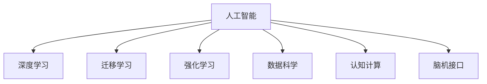

                 

# 人类智慧：AI 时代的新力量

> 关键词：人工智能,智慧时代,人类智能,机器学习,深度学习,数据科学,认知计算,脑机接口

## 1. 背景介绍

### 1.1 问题由来

随着人工智能技术的飞速发展，人类社会正迈入一个全新的人工智能时代。在这个时代，我们不仅希望计算机能够执行繁琐的数据处理任务，更希望它能够理解、学习、创造，甚至超越人类的智慧。

然而，尽管深度学习、强化学习等技术取得了显著进展，但真正意义上的人类智慧依然遥不可及。如何构建能够“思考”、“学习”的AI，是我们面临的重大挑战。

### 1.2 问题核心关键点

为了构建真正意义上的AI，我们需要对人类智慧的本质进行深入理解，从而寻找能够模仿、扩展、超越人类智能的技术路径。这不仅包括对人类大脑的神经网络结构进行模拟，还包括对人类认知、推理、记忆等核心能力的建模和优化。

当前，AI领域的诸多技术进展，如深度学习、迁移学习、强化学习等，都是围绕模仿人类智能的核心能力展开的。但如何真正实现这些技术的突破，构建具有通用智能的AI，仍是亟待解决的难题。

### 1.3 问题研究意义

研究人类智慧的本质和AI技术实现路径，对于推动人工智能的科学进步，构建更为智能化的社会系统，具有深远的意义：

1. 推动科技发展：通过对人类智能的深入理解，促进AI技术的新突破和新应用。
2. 改善人类生活：利用AI技术提升生产效率，改善生活质量，带来更为安全、便捷、高效的未来。
3. 实现脑机接口：通过脑机接口技术，实现人类与AI的深度融合，开启全新的认知交互模式。
4. 促进跨学科合作：AI技术的实现需要多学科的协同攻关，推动各领域知识整合和技术创新。

## 2. 核心概念与联系

### 2.1 核心概念概述

为了更好地理解AI时代的新力量，本节将介绍几个密切相关的核心概念：

- 人工智能(AI)：使计算机能够模拟、扩展和超越人类智能的技术。
- 深度学习(Deep Learning)：通过多层神经网络结构，实现对复杂数据的处理和表示。
- 迁移学习(Transfer Learning)：利用在不同领域之间共享知识，提高学习效率和模型泛化能力。
- 强化学习(Reinforcement Learning)：通过奖励反馈机制，训练模型从环境中学习最优决策策略。
- 数据科学(Data Science)：涉及数据收集、处理、分析和可视化的学科，为AI技术提供重要支持。
- 认知计算(Cognitive Computing)：模拟人类认知过程的计算模型，实现更高效的智能推理和决策。
- 脑机接口(Brain-Computer Interface, BCI)：通过电信号等手段，将人类大脑与计算机系统连接，实现信息交互。

这些核心概念之间的逻辑关系可以通过以下Mermaid流程图来展示：



这个流程图展示了几大AI核心概念及其之间的关系：

1. 人工智能是AI技术的核心，包括深度学习、迁移学习、强化学习等。
2. 深度学习通过多层神经网络处理数据，是实现AI的基础。
3. 迁移学习通过知识共享，提升模型泛化能力。
4. 强化学习通过奖励反馈，训练最优决策策略。
5. 数据科学提供数据支持和分析工具。
6. 认知计算模拟人类认知过程。
7. 脑机接口实现人机深度交互。

这些概念共同构成了AI技术的研究框架，为我们构建智慧AI系统提供了理论基础和实践指南。

## 3. 核心算法原理 & 具体操作步骤
### 3.1 算法原理概述

在AI时代，构建智慧AI系统通常涉及多个关键算法和步骤。这些算法和步骤相互关联，共同构成了一个复杂的系统。

### 3.2 算法步骤详解

#### 步骤1: 数据收集与预处理

AI系统的构建离不开大量高质量的数据。数据收集和预处理是第一步，包括数据采集、清洗、标注等过程。通过数据标注，为后续的训练和测试提供有监督的样本。

#### 步骤2: 模型设计

设计合适的模型结构是实现AI目标的关键。不同的任务可能需要不同的模型结构，如卷积神经网络(CNN)、循环神经网络(RNN)、Transformer等。

#### 步骤3: 训练与优化

模型训练是AI系统的核心步骤。通过大量的训练数据，模型不断调整权重参数，优化模型性能。常用的优化算法包括梯度下降、Adam等。

#### 步骤4: 模型评估与验证

模型评估是判断模型效果的重要步骤。通常使用交叉验证、留出法等技术，评估模型在不同数据集上的泛化性能。

#### 步骤5: 部署与应用

模型训练完成后，需要将其部署到实际应用中。这一步涉及模型的优化、性能调优、集成化部署等。

### 3.3 算法优缺点

AI技术虽然取得了显著进展，但也存在一些局限性：

- **优点**：
  - 高效处理大数据：深度学习等技术能够高效处理大量复杂数据。
  - 实现复杂任务：AI技术能够实现各种复杂的认知任务，如图像识别、自然语言处理等。
  - 自动化程度高：AI系统能够自主学习和优化，减少人为干预。

- **缺点**：
  - 数据依赖性高：AI系统的训练效果依赖于高质量数据，数据不足可能导致模型性能不佳。
  - 解释性不足：AI模型的决策过程缺乏可解释性，难以理解和调试。
  - 伦理与安全性问题：AI系统可能存在偏见、歧视等问题，影响模型公平性和安全性。

### 3.4 算法应用领域

AI技术已经被广泛应用于多个领域，包括：

- 医疗健康：AI系统可以用于疾病诊断、个性化治疗、药物研发等。
- 金融服务：AI技术用于风险评估、欺诈检测、自动化交易等。
- 智能制造：AI系统用于预测维护、质量检测、智能调度等。
- 教育培训：AI技术用于智能辅导、课程推荐、学生行为分析等。
- 智能交通：AI系统用于交通流优化、智能导航、事故预防等。

这些应用领域展示了AI技术的广泛应用前景，推动了各行各业的智能化升级。

## 4. 数学模型和公式 & 详细讲解 & 举例说明

### 4.1 数学模型构建

在AI系统构建过程中，数学模型是重要的基础。以下是几个常见的数学模型：

- **线性回归模型**：用于预测连续变量，公式为：$y = \theta^T x + b$。
- **逻辑回归模型**：用于分类任务，公式为：$logit(p) = \theta^T x + b$，其中$p$表示预测概率。
- **卷积神经网络模型**：用于图像处理任务，通过卷积层、池化层等结构提取特征。
- **循环神经网络模型**：用于序列数据处理任务，通过循环结构实现时序信息的处理。
- **Transformer模型**：用于自然语言处理任务，通过自注意力机制提取文本表示。

### 4.2 公式推导过程

以线性回归模型为例，公式推导过程如下：

设数据集$D=\{(x_i,y_i)\}_{i=1}^N$，其中$x_i$为输入特征，$y_i$为输出变量。线性回归模型的目标是最小化误差函数：

$$
J(\theta) = \frac{1}{2N} \sum_{i=1}^N (y_i - \theta^T x_i)^2
$$

其中$\theta$为模型参数，$x_i$为输入特征。根据最小二乘法，求解$\theta$：

$$
\theta = \left(\frac{1}{2N}\sum_{i=1}^N x_i x_i^T\right)^{-1} \left(\sum_{i=1}^N x_i y_i\right)
$$

### 4.3 案例分析与讲解

以图像分类任务为例，通过卷积神经网络实现分类。

假设输入图片为$x$，输出标签为$y$。卷积神经网络模型由多个卷积层、池化层和全连接层构成，通过前向传播计算输出。设卷积层滤波器数为$m$，步长为$s$，激活函数为$ReLU$，则卷积层的输出为：

$$
y_{conv} = \sigma(W_{conv}x + b_{conv})
$$

其中$W_{conv}$为卷积核权重，$b_{conv}$为偏置。通过不断堆叠卷积层和池化层，提取特征后，最终通过全连接层进行分类。

## 5. 项目实践：代码实例和详细解释说明

### 5.1 开发环境搭建

在进行AI系统开发前，需要搭建合适的开发环境。以下是使用Python进行TensorFlow开发的环境配置流程：

1. 安装Anaconda：从官网下载并安装Anaconda，用于创建独立的Python环境。

2. 创建并激活虚拟环境：
```bash
conda create -n tensorflow-env python=3.8 
conda activate tensorflow-env
```

3. 安装TensorFlow：根据CUDA版本，从官网获取对应的安装命令。例如：
```bash
conda install tensorflow-gpu=cudatoolkit=11.1 -c tf-nightly
```

4. 安装各类工具包：
```bash
pip install numpy pandas scikit-learn matplotlib tqdm jupyter notebook ipython
```

完成上述步骤后，即可在`tensorflow-env`环境中开始AI系统开发。

### 5.2 源代码详细实现

下面以图像分类任务为例，给出使用TensorFlow进行卷积神经网络模型的PyTorch代码实现。

首先，定义模型类：

```python
import tensorflow as tf
from tensorflow.keras import layers

class CNNModel(tf.keras.Model):
    def __init__(self):
        super(CNNModel, self).__init__()
        self.conv1 = layers.Conv2D(32, (3, 3), activation='relu', input_shape=(28, 28, 1))
        self.pool1 = layers.MaxPooling2D((2, 2))
        self.conv2 = layers.Conv2D(64, (3, 3), activation='relu')
        self.pool2 = layers.MaxPooling2D((2, 2))
        self.flatten = layers.Flatten()
        self.dense1 = layers.Dense(64, activation='relu')
        self.dense2 = layers.Dense(10)

    def call(self, x):
        x = self.conv1(x)
        x = self.pool1(x)
        x = self.conv2(x)
        x = self.pool2(x)
        x = self.flatten(x)
        x = self.dense1(x)
        x = self.dense2(x)
        return x
```

然后，定义训练函数：

```python
def train(model, data_train, data_test, batch_size, epochs):
    model.compile(optimizer='adam', loss='sparse_categorical_crossentropy', metrics=['accuracy'])
    model.fit(data_train, epochs=epochs, batch_size=batch_size, validation_data=data_test)
```

最后，启动训练流程：

```python
data_train = tf.data.Dataset.from_tensor_slices(train_images)
data_test = tf.data.Dataset.from_tensor_slices(test_images)
data_train = data_train.shuffle(buffer_size=1024).batch(batch_size).map(preprocess)
data_test = data_test.batch(batch_size).map(preprocess)

epochs = 10
batch_size = 32

train(model, data_train, data_test, batch_size, epochs)
```

以上就是使用TensorFlow构建卷积神经网络模型的完整代码实现。可以看到，借助TensorFlow的高阶API，构建AI模型变得简单高效。

### 5.3 代码解读与分析

让我们再详细解读一下关键代码的实现细节：

**CNNModel类**：
- `__init__`方法：初始化卷积层、池化层、全连接层等核心组件。
- `call`方法：定义前向传播计算过程，通过卷积层、池化层和全连接层实现特征提取和分类。

**train函数**：
- 使用TensorFlow的Keras API编译模型，设置优化器和损失函数。
- 通过`fit`方法进行模型训练，指定训练轮数和批大小，同时使用验证集评估模型性能。

**数据预处理**：
- 使用TensorFlow的`Dataset`类对数据进行批处理和预处理，包括数据切分、打乱和映射等操作。
- 使用自定义函数`preprocess`进行数据预处理，包括归一化、图像缩放等操作。

**训练流程**：
- 定义训练轮数和批大小，使用`train`函数进行模型训练。
- 使用TensorFlow的`Dataset`类构建训练集和测试集，通过批处理和预处理操作，准备模型训练所需的数据。
- 使用自定义函数`preprocess`进行数据预处理，包括归一化、图像缩放等操作。

可以看到，TensorFlow的高阶API和Keras框架使得AI模型的构建变得简洁高效。开发者可以将更多精力放在模型改进和数据处理上，而不必过多关注底层的实现细节。

当然，工业级的系统实现还需考虑更多因素，如模型的保存和部署、超参数的自动搜索、更灵活的任务适配层等。但核心的训练过程基本与此类似。

## 6. 实际应用场景

### 6.1 医疗健康

AI技术在医疗健康领域的应用前景广阔。通过深度学习和数据分析，AI系统可以辅助医生进行疾病诊断、治疗方案制定、药物研发等。

例如，通过卷积神经网络对医学影像进行分类和分析，实现疾病早期检测和个性化治疗。在药物研发方面，通过生成对抗网络(GAN)生成新分子结构，加速药物筛选和设计。

### 6.2 金融服务

金融服务领域对AI技术的需求同样旺盛。AI系统可以用于风险评估、欺诈检测、自动化交易等，提升金融服务的效率和安全性。

例如，通过时间序列分析模型预测股票价格走势，进行自动化交易；通过异常检测模型识别异常交易行为，防范金融欺诈。

### 6.3 智能制造

AI技术在智能制造领域的应用也在不断扩展。通过机器学习和大数据分析，AI系统可以优化生产流程、预测设备维护、实现智能调度等。

例如，通过深度强化学习优化生产流程，提高生产效率；通过预测性维护模型预测设备故障，提前进行维护。

### 6.4 教育培训

AI技术在教育培训领域的应用同样备受关注。通过AI系统，可以实现智能辅导、课程推荐、学生行为分析等，提升教育质量和学习效果。

例如，通过自然语言处理技术实现智能辅导系统，实时解答学生问题；通过数据分析模型分析学生学习行为，制定个性化学习方案。

### 6.5 未来应用展望

随着AI技术的不断演进，未来AI系统将在更多领域得到应用，为各行各业带来变革性影响。

- **智慧医疗**：基于AI的精准医疗和个性化治疗将提升医疗服务的智能化水平，辅助医生诊疗，加速新药开发进程。
- **智能教育**：AI技术将实现因材施教，促进教育公平，提高教学质量。
- **智慧城市**：AI系统将用于城市事件监测、舆情分析、应急指挥等环节，提高城市管理的自动化和智能化水平。
- **智能交通**：AI系统将用于交通流优化、智能导航、事故预防等，提升交通管理效率。

未来，AI技术将与各个行业深度融合，推动社会各领域的智能化升级，带来更为安全、便捷、高效的新时代。

## 7. 工具和资源推荐
### 7.1 学习资源推荐

为了帮助开发者系统掌握AI技术的基础和实践技巧，这里推荐一些优质的学习资源：

1. 《深度学习》系列课程：由斯坦福大学开设的深度学习课程，系统介绍了深度学习的基本概念和算法。
2. 《TensorFlow实战》书籍：介绍TensorFlow的高级应用，涵盖模型构建、优化、部署等全流程。
3. 《Python深度学习》书籍：介绍深度学习在Python中的应用，包括模型构建、数据处理、可视化等。
4. 《动手学深度学习》书籍：由深度学习专家编写，涵盖深度学习的理论基础和实践应用。
5. 《自然语言处理综论》书籍：介绍自然语言处理的原理和应用，包括文本分类、信息检索、机器翻译等。

通过对这些资源的学习实践，相信你一定能够快速掌握AI技术的基本框架和实践技巧，并用于解决实际的AI问题。

### 7.2 开发工具推荐

高效的开发离不开优秀的工具支持。以下是几款用于AI系统开发的常用工具：

1. Python：作为数据科学和机器学习的主流编程语言，具有丰富的第三方库和社区支持。
2. TensorFlow：由Google主导开发的开源深度学习框架，生产部署方便，适合大规模工程应用。
3. PyTorch：基于Python的开源深度学习框架，灵活动态的计算图，适合快速迭代研究。
4. Scikit-Learn：开源机器学习库，提供了丰富的算法和数据处理工具。
5. Keras：基于TensorFlow和Theano的高级API，简化了深度学习模型的构建过程。
6. Jupyter Notebook：交互式编程环境，支持代码编写、数据可视化和交互式调试。

合理利用这些工具，可以显著提升AI系统开发的效率，加快创新迭代的步伐。

### 7.3 相关论文推荐

AI技术的快速发展离不开学界的持续研究。以下是几篇奠基性的相关论文，推荐阅读：

1. 《深度学习》（Goodfellow et al.）：介绍深度学习的基本概念和算法，是深度学习的经典教材。
2. 《神经网络与深度学习》（Goodfellow et al.）：详细讲解神经网络和深度学习的基本原理和应用。
3. 《人类智慧与机器学习》（Bengio et al.）：探讨人类智慧与机器学习的关系，提出未来AI技术的发展方向。
4. 《认知计算：一种新的计算范式》（Kurzweil et al.）：介绍认知计算的基本概念和应用，推动AI技术向认知智能发展。
5. 《脑机接口：一种新的计算范式》（Rosene et al.）：探讨脑机接口的基本原理和应用，推动人机交互技术的发展。

这些论文代表了大数据、深度学习、认知计算等领域的最新研究成果，可以帮助研究者把握学科前进方向，激发更多的创新灵感。

## 8. 总结：未来发展趋势与挑战
### 8.1 总结

本文对AI时代的新力量进行了全面系统的介绍。首先阐述了AI技术的核心概念和应用场景，明确了AI技术在各个行业领域中的重要价值。其次，从原理到实践，详细讲解了AI技术的数学模型和实现方法，给出了AI系统开发的完整代码实例。同时，本文还广泛探讨了AI技术在医疗健康、金融服务、智能制造、教育培训等多个领域的应用前景，展示了AI技术的广阔前景。最后，本文精选了AI技术的学习资源、开发工具和相关论文，力求为读者提供全方位的技术指引。

通过本文的系统梳理，可以看到，AI技术已经从理论研究走向了工程实践，并在多个领域取得了显著的成果。未来，伴随AI技术的持续演进，AI系统将在更广阔的领域发挥作用，推动人类社会进入更加智能化、普适化的新阶段。

### 8.2 未来发展趋势

展望未来，AI技术将呈现以下几个发展趋势：

1. **深度学习的发展**：深度学习技术将继续发展，网络结构更加复杂，训练算法更加高效，应用场景更加广泛。
2. **跨学科融合**：AI技术将与其他学科（如认知科学、心理学、神经科学等）深度融合，推动认知计算和脑机接口技术的发展。
3. **人机协同**：通过人机协同技术，实现智能系统与人类在认知和决策上的深度合作，提升系统的智能化水平。
4. **伦理与安全**：AI技术的伦理与安全问题将受到更多关注，如何在保证技术进步的同时，确保系统的公平性和安全性，将是重要的研究方向。
5. **个性化与定制化**：AI系统将实现更加个性化和定制化的服务，满足不同用户的多样化需求。
6. **自动化与自动化运维**：AI系统将实现更加高效和自动化的运维管理，提高系统的稳定性和可靠性。

以上趋势凸显了AI技术的广泛应用前景，推动了AI技术在各行业的智能化升级。未来，AI技术将继续在各个领域深入应用，推动社会各领域的智能化发展，带来更为安全、便捷、高效的新时代。

### 8.3 面临的挑战

尽管AI技术取得了显著进展，但在迈向更加智能化、普适化应用的过程中，仍面临诸多挑战：

1. **数据隐私与安全**：AI系统需要处理大量个人数据，如何保护数据隐私和安全，防止数据泄露和滥用，将是重要的研究方向。
2. **伦理与公平性**：AI系统可能存在偏见、歧视等问题，如何确保系统的公平性和透明度，将是重要的研究方向。
3. **计算资源限制**：AI系统需要大量的计算资源，如何优化模型结构和算法，减少计算资源消耗，将是重要的研究方向。
4. **算法的可解释性**：AI系统的决策过程缺乏可解释性，难以理解和调试，如何赋予AI系统更高的可解释性，将是重要的研究方向。
5. **系统的鲁棒性**：AI系统面对数据噪声和环境变化时，可能出现性能波动，如何提高系统的鲁棒性，避免灾难性遗忘，将是重要的研究方向。

这些挑战凸显了AI技术的复杂性，推动了学界和产业界的共同努力，以实现AI技术的可持续发展。未来，只有通过跨学科合作、技术创新和伦理规范，才能真正实现AI技术的广泛应用和普适化发展。

### 8.4 研究展望

面对AI技术面临的挑战，未来的研究需要在以下几个方面寻求新的突破：

1. **模型结构优化**：通过优化神经网络结构，提高模型的可解释性和鲁棒性，降低对计算资源的需求。
2. **跨领域知识融合**：将不同领域（如认知科学、神经科学等）的知识与AI技术融合，推动认知计算和脑机接口技术的发展。
3. **自动化与自动化运维**：开发自动化的模型训练和运维系统，提高系统的自动化水平和运维效率。
4. **人机协同**：通过人机协同技术，实现智能系统与人类在认知和决策上的深度合作，提升系统的智能化水平。
5. **伦理与公平性**：在AI系统设计和应用中引入伦理导向的评估指标，过滤和惩罚有偏见、有害的输出倾向，确保系统的公平性和安全性。

这些研究方向将推动AI技术不断进步，为构建智慧AI系统铺平道路，实现更加安全、便捷、高效的未来。未来，AI技术将在各领域深度应用，推动人类社会进入更加智能化、普适化的新阶段。

